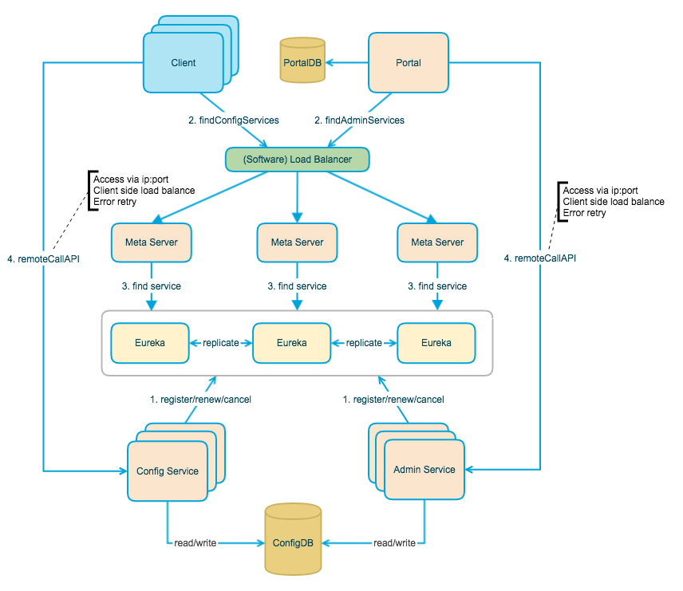
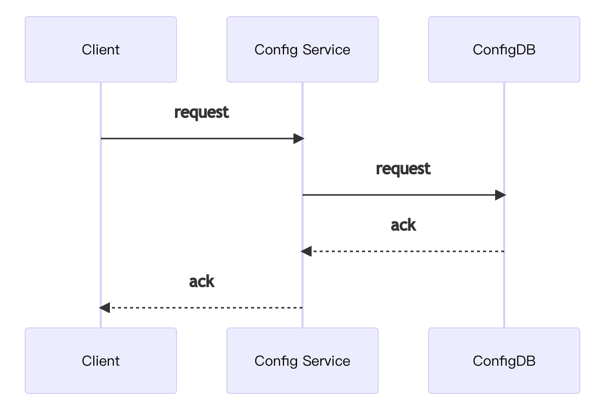
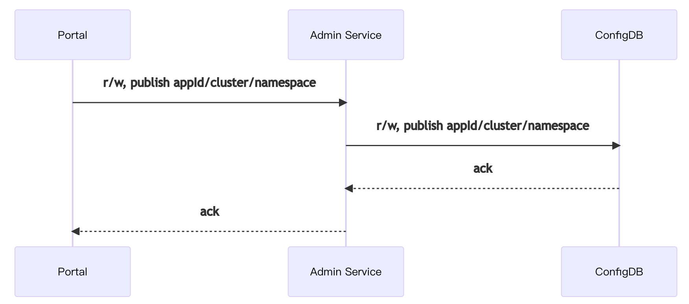
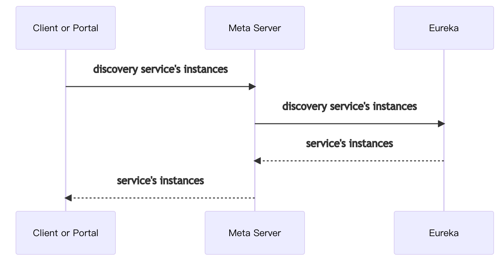
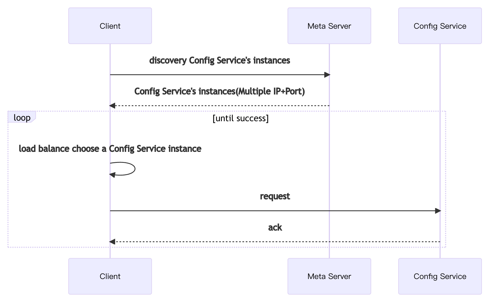
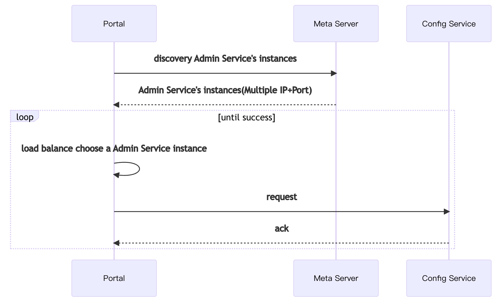
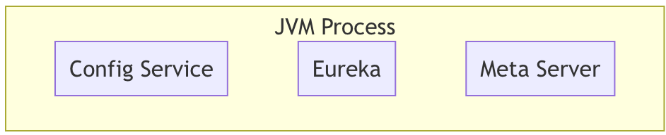
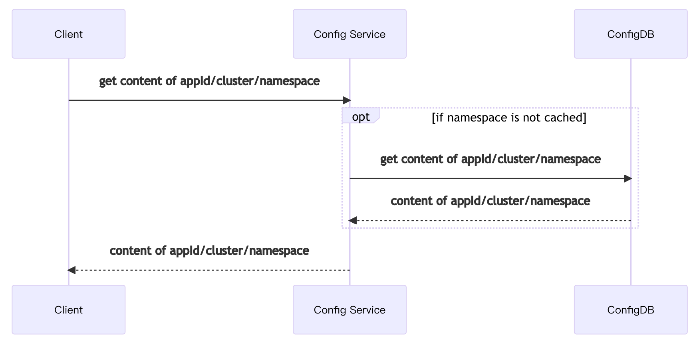

一个可靠的分布式远程配置中心。携程开发的，集中化管理应用不同环境，不通集群的配置。具备实时推送功能，权限管控等特定。服务端用Spring Cloud开发。特性
- 统一管理不同环境、不通集群的配置
  - 提供WebUI管理不同的environment、cluster、namespace的配置
  - 支持应用具有不通的配置
  - 通过命名空间支持应用共享配置，可以对共享配置覆盖
- 配置修改实时生效
- 版本发布管理，恶意方便回滚
- 支持灰度发布
- 配置项搜索
- 权限管理、发布审核、操作审计
- 客户端配置信息监控
- 提供java/.net的客户端，支持Spring占位符、注解与Spring Boot的`ConfigurationProperties`的方式使用，需要Spring 3.1.1+
- 提供API
- 部署简单外部依赖少，只依赖MySQL

# 系统设计
下面是基础模型
- 用户在配置中心对配置进行修改并发布
- 配置中心通知Apollo客户端有配置中心
- Apollo客户端从配置中心拉取最新的配置，更新本地配置并通知到应用

下图是Apollo架构模块的设计

- Config Service提供配置的读取、推送等功能，服务对象是Apollo客户端
  
- Admin Service提供配置的修改、发布等功能，服务对象是Apollo Portal（管理界面）
  
- Config Service和Admin Service都是多实例、无状态部署，所以需要将自己注册到Eureka中并保持心跳
- 在Eureka之上我们架了一层Meta Server用于封装Eureka的服务发现接口
  
- Client通过域名访问Meta Server获取Config Service服务列表（IP+Port），而后直接通过IP+Port访问服务，同时在Client侧会做load balance、错误重试
  
- Portal通过域名访问Meta Server获取Admin Service服务列表（IP+Port），而后直接通过IP+Port访问服务，同时在Portal侧会做load balance、错误重试
  
- 为了简化部署，我们实际上会把Config Service、Eureka和Meta Server三个逻辑角色部署在同一个JVM进程中
  

为什么用eureka作为注册中心?
- 功能完整，netflix出的
- 方便集成Spring Cloud与Spring Boot，可以与其他服务集成在一个容器中启动
- 开源
## Config Service
- 提供配置获取接口
- 提供配置更新推送接口(Http long polling)
  - 服务端使用[Spring DeferedResult](http://docs.spring.io/spring/docs/current/javadoc-api/org/springframework/web/context/request/async/DeferredResult.html)实现异步化，大大增加长连接的数量
  - 默认10000连接，4c8g可以支持10000个连接，也就是支持10000个进程或者应用
- 接口服务对象为Apollo客户端

## Admin Service
- 提供配置管理接口
- 提供配置修改、发布、检索等接口
- 接口服务对象为Portal
## Meta Server
- Portal通过域名访问Meta Server获取Admin Service服务列表
- Client通过域名访问Meta Server获取Config Service服务列表
- Meta Server从Eureka获取Config Service和Admin Service的服务信息，相当于是一个Eureka Client
- 增设一个Meta Server的角色主要是为了封装服务发现的细节，对Portal和Client而言，永远通过一个Http接口获取Admin Service和Config Service的服务信息，而不需要关心背后实际的服务注册和发现组件
- Meta Server只是一个逻辑角色，在部署时和Config Service是在一个JVM进程中的，所以IP、端口和Config Service一致
## Eureka
- 基于Eureka和Spring Cloud Netflix提供服务注册和发现
- Config Service和Admin Service会向Eureka注册服务，并保持心跳
- 为了简单起见，目前Eureka在部署时和Config Service是在一个JVM进程中的（通过Spring Cloud Netflix）
## Portal
- 提供Web界面供用户管理配置
- 通过Meta Server获取Admin Service服务列表（IP+Port），通过IP+Port访问服务
- 在Portal侧做load balance、错误重试
## Client
- Apollo提供的客户端程序，为应用提供配置获取、实时更新等功能
- 通过Meta Server获取Config Service服务列表（IP+Port），通过IP+Port访问服务
- 在Client侧做load balance、错误重试

