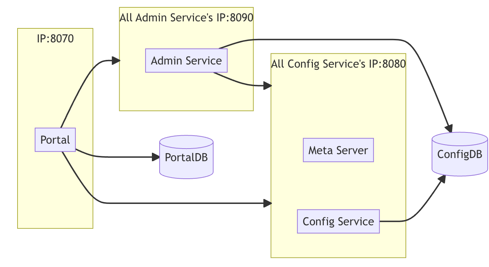

一个可靠的分布式远程配置中心。携程开发的，集中化管理应用不同环境，不同集群的配置。具备实时推送功能，权限管控等特点。服务端用Spring Cloud开发。特性
- 统一管理不同环境、不通集群的配置
  - 提供WebUI管理不同的environment、cluster、namespace的配置
  - 支持应用具有不同的配置
  - 通过命名空间支持应用共享配置，可以对共享配置覆盖
- 配置修改实时生效
- 版本发布管理，恶意方便回滚
- 支持灰度发布
- 配置项搜索
- 权限管理、发布审核、操作审计
- 客户端配置信息监控
- 提供java/.net的客户端，支持Spring占位符、注解与Spring Boot的`ConfigurationProperties`的方式使用，需要Spring 3.1.1+
- 提供API
- 部署简单外部依赖少，只依赖MySQL

# 系统设计
下面是基础模型
- 用户在配置中心对配置进行修改并发布
- 配置中心通知Apollo客户端有配置变更
- Apollo客户端从配置中心拉取最新的配置，更新本地配置并通知到应用


下图是Apollo架构模块的设计

- Config Service提供配置的读取、推送等功能，服务对象是Apollo客户端
  
- Admin Service提供配置的修改、发布等功能，服务对象是Apollo Portal（管理界面）
  
- Config Service和Admin Service都是多实例、无状态部署，所以需要将自己注册到Eureka中并保持心跳
- 在Eureka之上我们架了一层Meta Server用于封装Eureka的服务发现接口
  
- Client通过域名访问Meta Server获取Config Service服务列表（IP+Port），而后直接通过IP+Port访问服务，同时在Client侧会做load balance、错误重试
  
- Portal通过域名访问Meta Server获取Admin Service服务列表（IP+Port），而后直接通过IP+Port访问服务，同时在Portal侧会做load balance、错误重试
  
- 为了简化部署，我们实际上会把Config Service、Eureka和Meta Server三个逻辑角色部署在同一个JVM进程中
  

为什么用eureka作为注册中心?
- 功能完整，netflix出的
- 方便集成Spring Cloud与Spring Boot，可以与其他服务集成在一个容器中启动
- 开源
## Config Service
- 提供配置获取接口
- 提供配置更新推送接口(Http long polling)
  - 服务端使用[Spring DeferedResult](http://docs.spring.io/spring/docs/current/javadoc-api/org/springframework/web/context/request/async/DeferredResult.html)实现异步化，大大增加长连接的数量
  - 默认10000连接，4c8g可以支持10000个连接，也就是支持10000个进程或者应用
- 接口服务对象为Apollo客户端

## Admin Service
- 提供配置管理接口
- 提供配置修改、发布、检索等接口
- 接口服务对象为Portal
## Meta Server
- Portal通过域名访问Meta Server获取Admin Service服务列表
- Client通过域名访问Meta Server获取Config Service服务列表
- Meta Server从Eureka获取Config Service和Admin Service的服务信息，相当于是一个Eureka Client
- 增设一个Meta Server的角色主要是为了封装服务发现的细节，对Portal和Client而言，永远通过一个Http接口获取Admin Service和Config Service的服务信息，而不需要关心背后实际的服务注册和发现组件
- Meta Server只是一个逻辑角色，在部署时和Config Service是在一个JVM进程中的，所以IP、端口和Config Service一致
## Eureka
- 基于Eureka和Spring Cloud Netflix提供服务注册和发现
- Config Service和Admin Service会向Eureka注册服务，并保持心跳
- 为了简单起见，目前Eureka在部署时和Config Service是在一个JVM进程中的（通过Spring Cloud Netflix）
## Portal
- 提供Web界面供用户管理配置
- 通过Meta Server获取Admin Service服务列表（IP+Port），通过IP+Port访问服务
- 在Portal侧做load balance、错误重试
## Client
- Apollo提供的客户端程序，为应用提供配置获取、实时更新等功能
- 通过Meta Server获取Config Service服务列表（IP+Port），通过IP+Port访问服务
- 在Client侧做load balance、错误重试
## E-R图

- APP: App信息
- AppNamespace: App下的Namespace的元信息
- Cluster: 集群信息
- Namespace: 集群下的namespace
- Item: Namepace的配置，每个item都是key,value组合
- Release: Namespace发布的配置，每个发布包含发布时该Namespace的所有配置
- Commit: Namespace下的配置更改记录
- Audit: 审计信息，记录用户在何时使用何种方式操作了哪个实体
### 权限相关的ER图

- User: Apollo portal用户
- UserRole: 用户与角色的关系
- Role: 角色
- RolePermission: 角色和权限的关系
- Permission: 权限，具体的实体资源和操作
- Consumer: 第三方应用
- Consumer: 第三方应用的token
- ConsumerRole: 第三方应用和角色的关系
- ConsumerAudit: 第三方应用访问审计
## 服务端设计
### 配置发布后的实时推送设计
配置发布后实时推送到客户端的设计与实现

- 用户在Portal操作配置发布
- Portal调用Admin Service的接口操作发布
- Admin Service发布配置后，发送`ReleaseMessage`给各个Config Service
- Config Service收到`ReleaseMessage`后，通知对应的客户端

Admin Service通知Config Service配置变更，为了避免引入消息队列的额外依赖，使用数据库实现了简单的消息队列
- Admin Service在配置发布后会往ReleaseMessage表插入一条消息记录，消息内容就是配置发布的AppId+Cluster+Namespace，参见[DatabaseMessageSender](https://github.com/apolloconfig/apollo/blob/master/apollo-biz/src/main/java/com/ctrip/framework/apollo/biz/message/DatabaseMessageSender.java)
- Config Service有一个线程会每秒扫描一次ReleaseMessage表，看看是否有新的消息记录，参见[ReleaseMessageScanner](https://github.com/apolloconfig/apollo/blob/master/apollo-biz/src/main/java/com/ctrip/framework/apollo/biz/message/ReleaseMessageScanner.java)
- Config Service如果发现有新的消息记录，那么就会通知到所有的消息监听器[ReleaseMessageListener](https://github.com/apolloconfig/apollo/blob/master/apollo-biz/src/main/java/com/ctrip/framework/apollo/biz/message/ReleaseMessageListener.java)，如[NotificationControllerV2](https://github.com/apolloconfig/apollo/blob/master/apollo-configservice/src/main/java/com/ctrip/framework/apollo/configservice/controller/NotificationControllerV2.java)，消息监听器的注册过程参见[ConfigServiceAutoConfiguration](https://github.com/apolloconfig/apollo/blob/master/apollo-configservice/src/main/java/com/ctrip/framework/apollo/configservice/ConfigServiceAutoConfiguration.java)
- NotificationControllerV2得到配置发布的AppId+Cluster+Namespace后，会通知对应的客户端，实现方式如下:
  - 客户端会发起一个Http请求到Config Service的notifications/v2接口，也就是NotificationControllerV2，参见RemoteConfigLongPollService
  - NotificationControllerV2不会立即返回结果，而是通过Spring DeferredResult把请求挂起
  - 如果在60秒内没有该客户端关心的配置发布，那么会返回Http状态码304给客户端
如果有该客户端关心的配置发布，NotificationControllerV2会调用DeferredResult的setResult方法，传入有配置变化的namespace信息，同时该请求会立即返回。客户端从返回的结果中获取到配置变化的namespace后，会立即请求Config Service获取该namespace的最新配置。
## 客户端设计

- 客户端和服务端保持了一个长连接，第一时间获取配置更新的推送，通过Http Long Polling实现
- 客户端定时从配置中心拉取应用的最新配置
  - fallback机制，防止推送机制失效导致配置不更新
  - 拉取时会上报本地的版本，与服务端版本一致则返回304-Not Modified
  - 定时频率为5分钟一次，也可以通过在运行时制定系统属性`apollo.refreshInterval`来覆盖，单位为分钟
- 客户端从Apollo配置中心服务端获取到应用的最新配置后，会保存在内存中
- 客户端会把从服务端获取到的配置在本地文件系统缓存一份
  - 在遇到服务不可用或者网络不通的时候，依然能从本队恢复配置
- 应用程序可以从Apollo客户端获取最新的配置、订阅配置更新通知
### 和Spring集成的原理
Apollo除了支持API方式获取配置，也支持和Spring/Spring Boot集成。集成原理简述如下:
Spring从3.1版本开始增加了`ConfigurableEnvironment`和`PropertySource`:
- Spring的`ApplicationContext`会包含一个`Environment`(实现`ConfigurableEnvironment`接口)，`ConfigurableEnvironment`自身包含了很多个`PropertySource`
- `PropertySource`: 属性源，多个key-value的属性配置

运行时的结构如下图:

`PropertySource`之间是有优先级顺序的，如果一个key在多个属性源中都存在，那么在前面的属性源优先。在应用的启动阶段，Apollo从远端获取配置，组装成属性源插入到第一个就可以了。
# 配置中心介绍
## Apollo是什么?
程序配置太多了，实时生效、灰度发布、分环境、分集群、权限与审核等。Apollo解决这些问题。支持4个维度的配置
- 应用
- 环境
- 集群
- 命名空间

配置的特点:
- 配置是独立于程序的只读变量，配置是独立于程序的，同一份程序在不同的配置下会有不同的行为，程序不应该去改变配置
- 配置伴随应用的整个生命周期
- 配置可以有多种加载方式，hard code、配置文件、环境变量、启动参数、基于数据库等
- 配置需要治理
  - 权限控制
  - 不同环境、集群配置管理

Apollo的强大能力
- 统一管理不同环境、不同集群的配置，通过命名空间可以共享配置
- 配饰修改实时生效
- 版本发布管理
- 灰度发布
- 配置项的全局搜索
- 权限管理、发布审核、操作审计
- 客户端配置信息监控
- 提供Java、.net原生客户端，支持Spring Placeholder、Annotation与Spring Boot的`ConfigurationProperties`
- 提供了Http接口
- 提供了开放平台API
- 部署简单

## 客户端获取配置
```java
Config config = ConfigService.getAppConfig();
Integer defaultRequestTimeout = 200;
Integer requestTimeout = config.getIntProperty("requestTimeout", defaultRequestTimeout);
```
## 客户端监听配置变化
```java
Config config = ConfigService.getAppConfig();
config.addChangeListener(new ConfigChangeListener() {
  @Override
  public void onChange(ConfigChangeEvent changeEvent) {
    for (String key : changeEvent.changedKeys()) {
      ConfigChange change = changeEvent.getChange(key);
      System.out.println(String.format(
        "Found change - key: %s, oldValue: %s, newValue: %s, changeType: %s",
        change.getPropertyName(), change.getOldValue(),
        change.getNewValue(), change.getChangeType()));
     }
  }
});
```
## Spring集成
```java
@Configuration
@EnableApolloConfig
public class AppConfig {}

@Component
public class SomeBean {
    //timeout的值会自动更新
    @Value("${request.timeout:200}")
    private int timeout;
}
```
## Apollo核心概念
- application，应用，实际使用配置的应用，Apollo客户端需要知道当前应用是谁来获取应用的配置，应用有唯一的标识，appId，应用是与代码绑定的，需要在代码中配置
- environment，环境，配置对应的环境，Apollo客户端需要知道当前应用处于哪个环境，可以去获取应用的配置，环境与代码无关，环境默认读取机器上的配置`server.properties`中的env属性，也支持运行时通过系统属性等指定
- cluster，集群，一个应用下不同实例的分组，不同的cluster可以有不同的配置值，环境默认读取机器上的配置`server.properties`中的idc属性，也支持运行时通过系统属性等指定
- namespace，命名空间，一个应用不同配置的分组，类似文件，不同类型的配置放在不同的文件中，应用可以直接读取到公共组件的配置namespace，也可以通过继承公共组件的配置namespace来对公共组件的配置做调整
### 配置获取规则
使用下面的语句获取配置时就是获取应用自身的配置
```java
Config config = ConfigService.getAppConfig();
```
- 查找运行时cluster的配置，通过`apollo.cluster`指定
- 没有找到，则查找数据中心cluster的配置
- 没有找到则返回默认cluster的配置

如果应用部署在A数据中心，但是用户没有在Apollo创建cluster，那么获取的配置就是默认(default)cluster的。应用部署在A数据中心，同时在运行时指定了SomeCluster，但是没有在Apollo创建cluster，那么获取的配置就是A数据中心cluster的配置，如果A数据中心cluster没有配置的话，那么获取的配置就是默认cluster（default）的。
# 核心概念Namespace
Namespace是配置项的集合，类似一个配置文件的概念。Apollo在创建项目的时候，都会创建一个`application`的Namespace，`application`是给应用自身使用的，等同于Spring Boot的application.yml配置文件，客户端获取`application` Namespace的代码如下:
```java
Config config = ConfigService.getAppConfig();
```
获取非`applicaiton`的Namespace的代码如下:
```java
Config config = ConfigService.getConfig(namespaceName);
```
配置文件有多种格式，比如`properties`、xml、yml、yaml、json等，非properties格式的namespace，在客户端使用时需要调用`ConfigService.getConfigFile(String namespace, ConfigFileFormat configFileFormat)`来获取，如果使用Http接口直接调用时，对应的namespace参数需要传入namespace的名字加上后缀名，如datasources.json。Namespace的获取权限分类:
- private(私有的): 应用专属的
- public(公共的): 任何应用都可以获取到

Namespace的类型
- 私有类型: private权限
- 公共类型: public权限
- 关联类型(继承类型): private权限，继承于公共类型的Namespace，覆盖公共Namespace的某些配置

# 分布式部署
条件
- linux
- java1.8+
- mysql

需要先确定部署的环境与部署方式
- DEV, 开发环境
- FAT，测试环境
- UAT，集成环境
- PRO，生产环境

## 添加自定义的环境名称的方式与Portal如何增加环境
1.6.0版本增加了自定义环境的功能，不修改代码增加环境
- portaldb增加环境，参考[3.1调整ApolloPortalDB配置](https://www.apolloconfig.com/#/zh/deployment/distributed-deployment-guide?id=_31-%e8%b0%83%e6%95%b4apolloportaldb%e9%85%8d%e7%bd%ae)
- 为apollo-portal添加新增环境对应的meta server地址，具体参考[2.2.1.1.2.4 配置apollo-portal的meta service信息](https://www.apolloconfig.com/#/zh/deployment/distributed-deployment-guide?id=_221124-%e9%85%8d%e7%bd%aeapollo-portal%e7%9a%84meta-service%e4%bf%a1%e6%81%af),apollo-client在新的环境下使用时也需要做好相应的配置，参考[1.2.2Apollo Meta Server](https://www.apolloconfig.com/#/zh/client/java-sdk-user-guide?id=_122-apollo-meta-server)

一套Portal可以管理多个环境，每个环境都需要独立部署一套Config Service、Admin Service、ApolloConfigDB。

可以通过参数指定注册的IP或者网卡等，也可以跳过服务发现，直接连接Config Service，参考[跳过Apollo Meta Server服务发现](https://www.apolloconfig.com/#/zh/client/java-sdk-user-guide?id=_1222-%e8%b7%b3%e8%bf%87apollo-meta-server%e6%9c%8d%e5%8a%a1%e5%8f%91%e7%8e%b0)。网络拓扑如下图:

## 部署步骤
- 创建数据库[ApolloPortalDB](https://github.com/apolloconfig/apollo/blob/master/scripts/sql/profiles/mysql-default/apolloportaldb.sql)和[ApolloConfigDB](https://github.com/apolloconfig/apollo/blob/master/scripts/sql/profiles/mysql-default/apolloconfigdb.sql)
  如果需要迁移，需要迁移的表:
  - App, 导入全部的App, `insert into 新环境的ApolloConfigDB.App select * from 其它环境的ApolloConfigDB.App where IsDeleted = 0;`
  - AppNamespace, 导入全部的AppNamespace, 如：`insert into 新环境的ApolloConfigDB.AppNamespace select * from 其它环境的ApolloConfigDB.AppNamespace where IsDeleted = 0;`
  - Cluster, 导入默认的default集群, 如：`insert into 新环境的ApolloConfigDB.Cluster select * from 其它环境的ApolloConfigDB.Cluster where Name = 'default' and IsDeleted = 0;`
  - Namespace, 导入默认的default集群中的namespace, 如：`insert into 新环境的ApolloConfigDB.Namespace select * from 其它环境的ApolloConfigDB.Namespace where ClusterName = 'default' and IsDeleted = 0;`
- 很多配置在数据库中，需要调整可以参考[三、服务端配置说明。](https://www.apolloconfig.com/#/zh/deployment/distributed-deployment-guide?id=%e4%b8%89%e3%80%81%e6%9c%8d%e5%8a%a1%e7%ab%af%e9%85%8d%e7%bd%ae%e8%af%b4%e6%98%8e)
- 下载3个安装包或者通过源代码构建安装包
- 修改3个包的数据库连接信息与端口日志等信息
- Portal不同的环境访问不同的meta service，对于1.6.0以上的版本，可以通过`ApolloPortalDB.ServerConfig`的配置项来配置地址。
- 配置`apollo-env.properties`文件中的地址信息
- 除了`apollo-env.properties`的配置方式，可以在运行时指定, 通过JVM系统属性的方式比如`-D{env}_meta=http://xxxxx`也可以通过操作系统的环境变量
- 部署apollo-configservice，直接有启动脚本
- 部署apollo-adminservice，直接有启动脚本
- 部署apollo-portal，直接有启动脚本
## 使用其他服务注册中心替换内置eureka
- nacos
- consul
- zk
- database
## 服务端配置说明
一些配置可以在数据库中配置或者通过-D参数或者application.properties文件等配置，这些配置高于数据库的配置
### ApolloPortalDB的配置
配置项统一存储在ApolloPortalDB.ServerConfig表中，也可以通过管理员工具 - 系统参数页面进行配置，无特殊说明则修改完一分钟实时生效。
- apollo.portal.envs, 环境列表，大小写不敏感，修改完需要重启生效
- apollo.portal.meta.servers, 各环境Meta Service列表，这个方式的优先级高于其他方式设置的Meta-Service地址，需要重启生效
- organizations - 部门列表
- superAdmin - Portal超级管理员
- wiki.address
- consumer.token.salt - consumer token salt
- admin.createPrivateNamespace.switch, 是否允许项目管理员创建private namespace
- emergencyPublish.supported.envs, 允许紧急发布的环境，就是可以一个人既可以修改也能发布
- configView.memberOnly.envs, 只对项目成员显示配置信息的环境列表
- role.create-application.enabled - 是否开启创建项目权限控制
- role.manage-app-master.enabled - 是否开启项目管理员分配权限控制
- admin-service.access.tokens - 设置apollo-portal访问各环境apollo-adminservice所需的access token
- searchByItem.switch - 控制台搜索框是否支持按配置项搜索
- apollo.portal.search.perEnvMaxResults - 设置管理员工具-value的全局搜索功能单次单独环境最大搜索结果的数量适用于2.4.0及以上版本
### ApolloConfigDB配置
配置项统一存储在ApolloConfigDB.ServerConfig表中，需要注意每个环境的ApolloConfigDB.ServerConfig都需要单独配置，修改完一分钟实时生效。
- eureka.service.url - Eureka服务Url，这里需要填写本环境中全部的eureka服务地址，因为eureka需要互相复制注册信息
- namespace.lock.switch - 一次发布只能有一个人修改开关，用于发布审核
- config-service.cache.enabled - 是否开启配置缓存
- config-service.cache.key.ignore-case - 是否忽略配置缓存key的大小写
- config-service.cache.stats.enabled - 是否开启缓存metric统计功能
- item.key.length.limit - 配置项 key 最大长度限制
- item.value.length.limit - 配置项 value 最大长度限制
- appid.value.length.limit.override - appId 维度的配置项 value 最大长度限制
- namespace.value.length.limit.override - namespace 的配置项 value 最大长度限制
- admin-service.access.control.enabled - 配置apollo-adminservice是否开启访问控制
- admin-service.access.tokens - 配置允许访问apollo-adminservice的access token列表
- apollo.access-key.auth-time-diff-tolerance - 配置服务端AccessKey校验容忍的时间偏差
- apollo.eureka.server.security.enabled - 配置是否开启eureka server的登录认证
- apollo.eureka.server.security.username - 配置eureka server的登录用户名
- apollo.eureka.server.security.password - 配置eureka server的登录密码
- apollo.release-history.retention.size - 配置发布历史的保留数量
- apollo.release-history.retention.size.override - 细粒度配置发布历史的保留数量
# 客户端指南
## Java客户端使用指南
要求
- Java1.8+
- Guava20.0+
- 依赖appId/ Apollo Meta Server信息。

配置
- appId: 系统属性`-Dapp.id=YOUR-APP-ID`，环境变量`APP_ID=YOUR-APP-ID`，配置文件`application.properties`，`classpath:/META-INF/app.properties`配置
- meta server: 系统属性`-Dapollo.meta=http://config-service-url`，配置文件`application.properties`中指定`apollo.meta=http://config-service-url`，环境变量`APOLLO_META`,`server.properties`配置文件中指定，`classpath:/META-INF/app.properties`配置文件中指定，Java系统属性`-Ddev_meta=http://config-service-url`此方式需要先指定env，通过环境变量`DEV_META=http://config-service-url`，通过`classpath:apollo-env.properties`
- 可以通过`MetaServerProvider`的SPI机制实现自定义寻址逻辑

可以跳过Meta SErver的服务发现，直接使用Config Service
- 如果config service部署在公有云上，注册到meta是内网地址，本地环境无法直接连接
- config service部署在Docker上，使用的是Docker的内网地址，本地环境无法连接
- config service部署在K8s上，希望使用k8s自带的服务发现能力

方式:
- 通过Java系统属性`-Dapollo.config-service=http://config-service-url:port`
- 通过环境变量`APOLLO_CONFIG_SERVICE`
- 通过`server.properties`配置文件`apollo.config-service=http://config-service-url:port`，对于linux/mac来说，默认位置在`/opt/settings/server.properties`

Apollo客户端会缓存配置文件到本地文件系统，默认位于/opt/data/{appId}/config-cache目录下面，格式为`{appId}+{cluster}+{namespace}.properties`，这个路径可以改
- 系统属性`-Dapollo.cache-dir=/opt/data/some-cache-dir`
- 通过`application.properties`配置文件`apollo.cacheDir=/opt/data/some-cache-dir`
- 通过操作系统环境变量`APOLLO_CACHE_DIR`
- 通过`server.properties`文件中的`apollo.cache-dir=/opt/data/some-cache-dir`配置
### 可选设置
- environment: 可以通过系统属性`-Denv=YOUR-ENVIRONMENT`、环境变量、`server.properties`配置文件指定
- Cluster: Java系统属性`-Dapollo.cluster=SomeCluster`、`application.properties`配置文件、Java系统属性`-Didc=xxx`，环境变量`IDC`、`server.properties`配置文件
- 设置内存中的配置项是否保持和页面上的顺序一致，对于属性顺序有关系的场景有帮助，通过Java系统属性`-Dapollo.property.order.enable=true`、通过`application.properties`配置文件、通过`classpath:/META-INF/app.properties`配置文件
- 配置访问密钥, `-Dapollo.access-key.secret=1cf998c4e2ad4704b45a98a509d15719`、`application.properties`配置文件中指定、操作系统环境变量、`classpath:/META-INF/app.properties`配置文件
- 自定义server.properties路径`-Dapollo.path.server.properties=/some-dir/some-file.properties`、环境变量APOLLO_PATH_SERVER_PROPERTIES
- 开启propertyNames缓存，在大量配置场景下可以显著改善启动速度，`-Dapollo.property.names.cache.enable=true`、环境变量`APOLLO_PROPERTY_NAMES_CACHE_ENABLE=true`、`application.properties`配置文件、`classpath:/META-INF/app.properties`文件
- ApolloLabel用于灰度，`-Dapollo.label=YOUR-APOLLO-LABEL`、环境变量、`application.properties`文件、`classpath:/META-INF/app.properties`文件
- 覆盖系统属性，`-Dapollo.override-system-properties=true`、`application.properties`配置文件、`classpath:/META-INF/app.properties`配置文件
-  ConfigMap缓存设置

### 依赖
添加依赖
```xml
        <dependency>
            <groupId>com.ctrip.framework.apollo</groupId>
            <artifactId>apollo-client</artifactId>
            <version>2.3.0</version>
        </dependency>
```
### 客户端用法
支持API与Spring2种方式
- API方式灵活，功能完备，配置值实时更新，支持所有环境
- Spring方式
  - Placeholder用法，支持自动更新
    - 代码中直接使用，如：`@Value("${someKeyFromApollo:someDefaultValue}")`
    - 配置文件中使用替换placeholder，如：`spring.datasource.url: ${someKeyFromApollo:someDefaultValue}`
    - 直接托管spring的配置`spring.datasource.url=jdbc:mysql://localhost:3306/somedb?characterEncoding=utf8`
  - Spring Boot的`@ConfigurationProperties`方式
- Spring与API方式结合
  ```java
  @ApolloConfig
  private Config config; //inject config for namespace application
  ```

参考使用案例[apollo-use-cases](https://github.com/ctripcorp/apollo-use-cases)
#### API使用方式
- 获取默认namespace的配置(application)
  ```java
  Config config = ConfigService.getAppConfig(); //config instance is singleton for each namespace and is never null
  String someKey = "someKeyFromDefaultNamespace";
  String someDefaultValue = "someDefaultValueForTheKey";
  String value = config.getProperty(someKey, someDefaultValue);
  ```
  配置值从内存中获取，不需要应用作缓存
- 监听配置变化事件
  ```java
  Config config = ConfigService.getAppConfig(); //config instance is singleton for each namespace and is never null
  config.addChangeListener(new ConfigChangeListener() {
      @Override
      public void onChange(ConfigChangeEvent changeEvent) {
          System.out.println("Changes for namespace " + changeEvent.getNamespace());
          for (String key : changeEvent.changedKeys()) {
              ConfigChange change = changeEvent.getChange(key);
              System.out.println(String.format("Found change - key: %s, oldValue: %s, newValue: %s, changeType: %s", change.getPropertyName(), change.getOldValue(), change.getNewValue(), change.getChangeType()));
          }
      }
  });
  ```
- 获取公共Namespace的配置
  ```java
  String somePublicNamespace = "CAT";
  Config config = ConfigService.getConfig(somePublicNamespace); //config instance is singleton for each namespace and is never null
  String someKey = "someKeyFromPublicNamespace";
  String someDefaultValue = "someDefaultValueForTheKey";
  String value = config.getProperty(someKey, someDefaultValue);
  ```
- 获取yaml/yml格式的namespace的配置
  ```java
  Config config = ConfigService.getConfig("application.yml");
  String someKey = "someKeyFromYmlNamespace";
  String someDefaultValue = "someDefaultValueForTheKey";
  String value = config.getProperty(someKey, someDefaultValue);
  ```
- 获取其他格式的Namespace
  ```java
  String someNamespace = "test";
  ConfigFile configFile = ConfigService.getConfigFile("test", ConfigFileFormat.XML);
  String content = configFile.getContent();
  ```
- 读取多APP对应的Namespace的配置
  ```java
  String someAppId = "Animal";
  String somePublicNamespace = "CAT";
  Config config = ConfigService.getConfig(someAppId, somePublicNamespace);
  String someKey = "someKeyFromPublicNamespace";
  String someDefaultValue = "someDefaultValueForTheKey";
  String value = config.getProperty(someKey, someDefaultValue);
  ```
#### Spring整合方式
非properties、非yaml/yml格式（如xml，json等）的namespace暂不支持和Spring整合。
- 基于Java的配置（推荐）
  ```java
  //这个是最简单的配置形式，一般应用用这种形式就可以了，用来指示Apollo注入application namespace的配置到Spring环境中
  @Configuration
  @EnableApolloConfig
  public class AppConfig {
    @Bean
    public TestJavaConfigBean javaConfigBean() {
      return new TestJavaConfigBean();
    }
  }
  ```
- Spring Boot集成方式（推荐）
  注入application默认空间` apollo.bootstrap.enabled = true`,
  ```properties
   apollo.bootstrap.enabled = true
  # will inject 'application', 'FX.apollo' and 'application.yml' namespaces in bootstrap phase
  apollo.bootstrap.namespaces = application,FX.apollo,application.yml
  ```
- 对于 Spring Boot 2.4 以上版本还支持通过 Config Data Loader 模式来加载配置
- 


