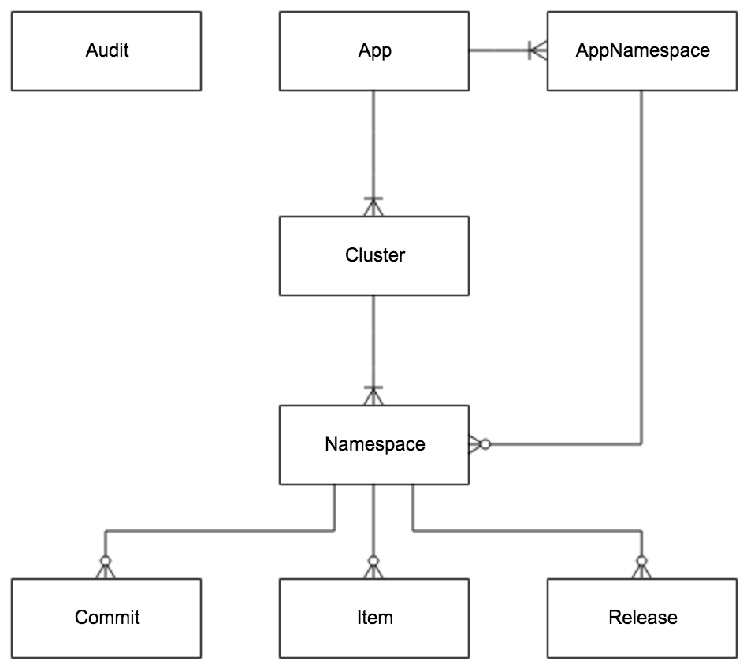
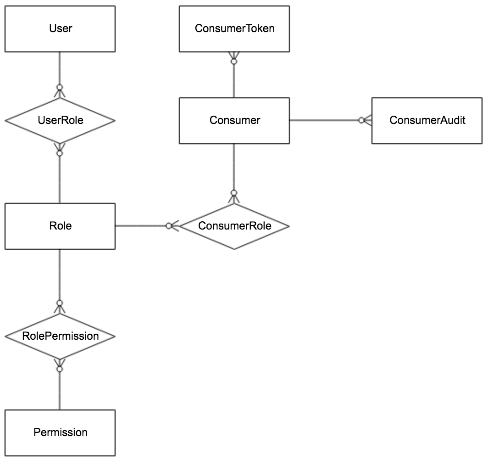
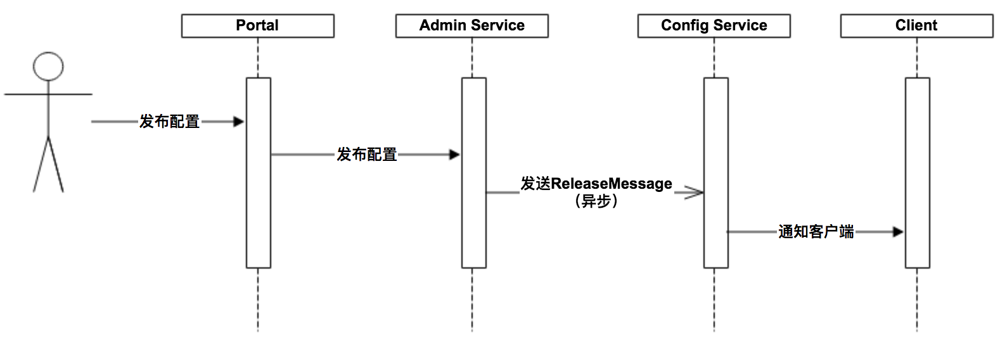
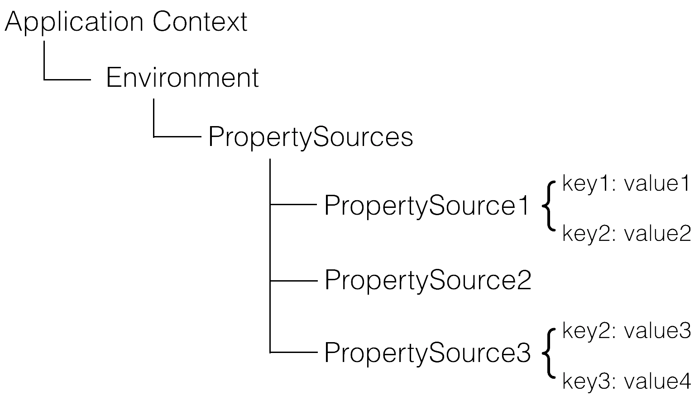

一个可靠的分布式远程配置中心。携程开发的，集中化管理应用不同环境，不同集群的配置。具备实时推送功能，权限管控等特点。服务端用Spring Cloud开发。特性
- 统一管理不同环境、不通集群的配置
  - 提供WebUI管理不同的environment、cluster、namespace的配置
  - 支持应用具有不同的配置
  - 通过命名空间支持应用共享配置，可以对共享配置覆盖
- 配置修改实时生效
- 版本发布管理，恶意方便回滚
- 支持灰度发布
- 配置项搜索
- 权限管理、发布审核、操作审计
- 客户端配置信息监控
- 提供java/.net的客户端，支持Spring占位符、注解与Spring Boot的`ConfigurationProperties`的方式使用，需要Spring 3.1.1+
- 提供API
- 部署简单外部依赖少，只依赖MySQL

# 系统设计
下面是基础模型
- 用户在配置中心对配置进行修改并发布
- 配置中心通知Apollo客户端有配置中心
- Apollo客户端从配置中心拉取最新的配置，更新本地配置并通知到应用


下图是Apollo架构模块的设计

- Config Service提供配置的读取、推送等功能，服务对象是Apollo客户端
  
- Admin Service提供配置的修改、发布等功能，服务对象是Apollo Portal（管理界面）
  
- Config Service和Admin Service都是多实例、无状态部署，所以需要将自己注册到Eureka中并保持心跳
- 在Eureka之上我们架了一层Meta Server用于封装Eureka的服务发现接口
  
- Client通过域名访问Meta Server获取Config Service服务列表（IP+Port），而后直接通过IP+Port访问服务，同时在Client侧会做load balance、错误重试
  
- Portal通过域名访问Meta Server获取Admin Service服务列表（IP+Port），而后直接通过IP+Port访问服务，同时在Portal侧会做load balance、错误重试
  
- 为了简化部署，我们实际上会把Config Service、Eureka和Meta Server三个逻辑角色部署在同一个JVM进程中
  

为什么用eureka作为注册中心?
- 功能完整，netflix出的
- 方便集成Spring Cloud与Spring Boot，可以与其他服务集成在一个容器中启动
- 开源
## Config Service
- 提供配置获取接口
- 提供配置更新推送接口(Http long polling)
  - 服务端使用[Spring DeferedResult](http://docs.spring.io/spring/docs/current/javadoc-api/org/springframework/web/context/request/async/DeferredResult.html)实现异步化，大大增加长连接的数量
  - 默认10000连接，4c8g可以支持10000个连接，也就是支持10000个进程或者应用
- 接口服务对象为Apollo客户端

## Admin Service
- 提供配置管理接口
- 提供配置修改、发布、检索等接口
- 接口服务对象为Portal
## Meta Server
- Portal通过域名访问Meta Server获取Admin Service服务列表
- Client通过域名访问Meta Server获取Config Service服务列表
- Meta Server从Eureka获取Config Service和Admin Service的服务信息，相当于是一个Eureka Client
- 增设一个Meta Server的角色主要是为了封装服务发现的细节，对Portal和Client而言，永远通过一个Http接口获取Admin Service和Config Service的服务信息，而不需要关心背后实际的服务注册和发现组件
- Meta Server只是一个逻辑角色，在部署时和Config Service是在一个JVM进程中的，所以IP、端口和Config Service一致
## Eureka
- 基于Eureka和Spring Cloud Netflix提供服务注册和发现
- Config Service和Admin Service会向Eureka注册服务，并保持心跳
- 为了简单起见，目前Eureka在部署时和Config Service是在一个JVM进程中的（通过Spring Cloud Netflix）
## Portal
- 提供Web界面供用户管理配置
- 通过Meta Server获取Admin Service服务列表（IP+Port），通过IP+Port访问服务
- 在Portal侧做load balance、错误重试
## Client
- Apollo提供的客户端程序，为应用提供配置获取、实时更新等功能
- 通过Meta Server获取Config Service服务列表（IP+Port），通过IP+Port访问服务
- 在Client侧做load balance、错误重试
## E-R图

- APP: App信息
- AppNamespace: App下的Namespace的元信息
- Cluster: 集群信息
- Namespace: 集群下的namespace
- Item: Namepace的配置，每个item都是key,value组合
- Release: Namespace发布的配置，每个发布包含发布时该Namespace的所有配置
- Commit: Namespace下的配置更改记录
- Audit: 审计信息，记录用户在何时使用何种方式操作了哪个实体
### 权限相关的ER图

- User: Apollo portal用户
- UserRole: 用户与角色的关系
- Role: 角色
- RolePermission: 角色和权限的关系
- Permission: 权限，具体的实体资源和操作
- Consumer: 第三方应用
- Consumer: 第三方应用的token
- ConsumerRole: 第三方应用和角色的关系
- ConsumerAudit: 第三方应用访问审计
## 服务端设计
### 配置发布后的实时推送设计
配置发布后实时推送到客户端的设计与实现

- 用户在Portal操作配置发布
- Portal调用Admin Service的接口操作发布
- Admin Service发布配置后，发送`ReleaseMessage`给各个Config Service
- Config Service收到`ReleaseMessage`后，通知对应的客户端

Admin Service通知Config Service配置变更，为了避免引入消息队列的额外依赖，使用数据库实现了简单的消息队列
- Admin Service在配置发布后会往ReleaseMessage表插入一条消息记录，消息内容就是配置发布的AppId+Cluster+Namespace，参见[DatabaseMessageSender](https://github.com/apolloconfig/apollo/blob/master/apollo-biz/src/main/java/com/ctrip/framework/apollo/biz/message/DatabaseMessageSender.java)
- Config Service有一个线程会每秒扫描一次ReleaseMessage表，看看是否有新的消息记录，参见[ReleaseMessageScanner](https://github.com/apolloconfig/apollo/blob/master/apollo-biz/src/main/java/com/ctrip/framework/apollo/biz/message/ReleaseMessageScanner.java)
- Config Service如果发现有新的消息记录，那么就会通知到所有的消息监听器[ReleaseMessageListener](https://github.com/apolloconfig/apollo/blob/master/apollo-biz/src/main/java/com/ctrip/framework/apollo/biz/message/ReleaseMessageListener.java)，如[NotificationControllerV2](https://github.com/apolloconfig/apollo/blob/master/apollo-configservice/src/main/java/com/ctrip/framework/apollo/configservice/controller/NotificationControllerV2.java)，消息监听器的注册过程参见[ConfigServiceAutoConfiguration](https://github.com/apolloconfig/apollo/blob/master/apollo-configservice/src/main/java/com/ctrip/framework/apollo/configservice/ConfigServiceAutoConfiguration.java)
- NotificationControllerV2得到配置发布的AppId+Cluster+Namespace后，会通知对应的客户端，实现方式如下:
  - 客户端会发起一个Http请求到Config Service的notifications/v2接口，也就是NotificationControllerV2，参见RemoteConfigLongPollService
  - NotificationControllerV2不会立即返回结果，而是通过Spring DeferredResult把请求挂起
  - 如果在60秒内没有该客户端关心的配置发布，那么会返回Http状态码304给客户端
如果有该客户端关心的配置发布，NotificationControllerV2会调用DeferredResult的setResult方法，传入有配置变化的namespace信息，同时该请求会立即返回。客户端从返回的结果中获取到配置变化的namespace后，会立即请求Config Service获取该namespace的最新配置。
## 客户端设计

- 客户端和服务端保持了一个长连接，第一时间获取配置更新的推送，通过Http Long Polling实现
- 客户端定时从配置中心拉取应用的最新配置
  - fallback机制，防止推送机制失效导致配置不更新
  - 拉取时会上报本地的版本，与服务端版本一致则返回304-Not Modified
  - 定时频率为5分钟一次，也可以通过在运行时制定系统属性`apollo.refreshInterval`来覆盖，单位为分钟
- 客户端从Apollo配置中心服务端获取到应用的最新配置后，会保存在内存中
- 客户端会把从服务端获取到的配置在本地文件系统缓存一份
  - 在遇到服务不可用或者网络不通的时候，依然能从本队恢复配置
- 应用程序可以从Apollo客户端获取最新的配置、订阅配置更新通知
### 和Spring集成的原理
Apollo除了支持API方式获取配置，也支持和Spring/Spring Boot集成。集成原理简述如下:
Spring从3.1版本开始增加了`ConfigurableEnvironment`和`PropertySource`:
- Spring的`ApplicationContext`会包含一个`Environment`(实现`ConfigurableEnvironment`接口)，`ConfigurableEnvironment`自身包含了很多个`PropertySource`
- `PropertySource`: 属性源，多个key-value的属性配置

运行时的结构如下图:

`PropertySource`之间是有优先级顺序的，如果一个key在多个属性源中都存在，那么在前面的属性源优先。在应用的启动阶段，Apollo从远端获取配置，组装成属性源插入到第一个就可以了。
# 配置中心介绍
## Apollo是什么?
程序配置太多了，实时生效、灰度发布、分环境、分集群、权限与审核等。Apollo解决这些问题。支持4个维度的配置
- 应用
- 环境
- 集群
- 命名空间

配置的特点:
- 配置是独立于程序的只读变量，配置是独立于程序的，同一份程序在不同的配置下会有不同的行为，程序不应该去改变配置
- 配置伴随应用的整个生命周期
- 配置可以有多种加载方式，hard code、配置文件、环境变量、启动参数、基于数据库等
- 配置需要治理
  - 权限控制
  - 不同环境、集群配置管理

Apollo的强大能力
- 统一管理不同环境、不同集群的配置，通过命名空间可以共享配置
- 配饰修改实时生效
- 版本发布管理
- 灰度发布
- 配置项的全局搜索
- 权限管理、发布审核、操作审计
- 客户端配置信息监控
- 提供Java、.net原生客户端，支持Spring Placeholder、Annotation与Spring Boot的`ConfigurationProperties`
- 提供了Http接口
- 提供了开放平台API
- 部署简单

## 客户端获取配置
```java
Config config = ConfigService.getAppConfig();
Integer defaultRequestTimeout = 200;
Integer requestTimeout = config.getIntProperty("requestTimeout", defaultRequestTimeout);
```
## 客户端监听配置变化
```java
Config config = ConfigService.getAppConfig();
config.addChangeListener(new ConfigChangeListener() {
  @Override
  public void onChange(ConfigChangeEvent changeEvent) {
    for (String key : changeEvent.changedKeys()) {
      ConfigChange change = changeEvent.getChange(key);
      System.out.println(String.format(
        "Found change - key: %s, oldValue: %s, newValue: %s, changeType: %s",
        change.getPropertyName(), change.getOldValue(),
        change.getNewValue(), change.getChangeType()));
     }
  }
});
```
## Spring集成
```java
@Configuration
@EnableApolloConfig
public class AppConfig {}

@Component
public class SomeBean {
    //timeout的值会自动更新
    @Value("${request.timeout:200}")
    private int timeout;
}
```
## Apollo核心概念
- application，应用，实际使用配置的应用，Apollo客户端需要知道当前应用是谁来获取应用的配置，应用有唯一的标识，appId，应用是与代码绑定的，需要在代码中配置
- environment，环境，配置对应的环境，Apollo客户端需要知道当前应用处于哪个环境，可以去获取应用的配置，环境与代码无关，环境默认读取机器上的配置`server.properties`中的env属性，也支持运行时通过系统属性等指定
- cluster，集群，一个应用下不同实例的分组，不同的cluster可以有不同的配置值，环境默认读取机器上的配置`server.properties`中的idc属性，也支持运行时通过系统属性等指定
- namespace，命名空间，一个应用不同配置的分组，类似文件，不同类型的配置放在不同的文件中，应用可以直接读取到公共组件的配置namespace，也可以通过继承公共组件的配置namespace来对公共组件的配置做调整
### 配置获取规则
使用下面的语句获取配置时就是获取应用自身的配置
```java
Config config = ConfigService.getAppConfig();
```
- 查找运行时cluster的配置，通过`apollo.cluster`指定
- 没有找到，则查找数据中心cluster的配置
- 没有找到则返回默认cluster的配置

如果应用部署在A数据中心，但是用户没有在Apollo创建cluster，那么获取的配置就是默认(default)cluster的。应用部署在A数据中心，同时在运行时指定了SomeCluster，但是没有在Apollo创建cluster，那么获取的配置就是A数据中心cluster的配置，如果A数据中心cluster没有配置的话，那么获取的配置就是默认cluster（default）的。
# 核心概念Namespace
Namespace是配置项的集合，类似一个配置文件的概念。Apollo在创建项目的时候，都会创建一个`application`的Namespace，`application`是给应用自身使用的，等同于Spring Boot的application.yml配置文件，客户端获取`application` Namespace的代码如下:
```java
Config config = ConfigService.getAppConfig();
```
获取非`applicaiton`的Namespace的代码如下:
```java
Config config = ConfigService.getConfig(namespaceName);
```
配置文件有多种格式，比如`properties`、xml、yml、yaml、json等，非properties格式的namespace，在客户端使用时需要调用`ConfigService.getConfigFile(String namespace, ConfigFileFormat configFileFormat)`来获取，如果使用Http接口直接调用时，对应的namespace参数需要传入namespace的名字加上后缀名，如datasources.json。Namespace的获取权限分类:
- private(私有的): 应用专属的
- public(公共的): 任何应用都可以获取到

Namespace的类型
- 私有类型: private权限
- 公共类型: public权限
- 关联类型(继承类型): private权限，继承与公共类型的Namespace，覆盖公共Namespace的某些配置

# 分布式部署


