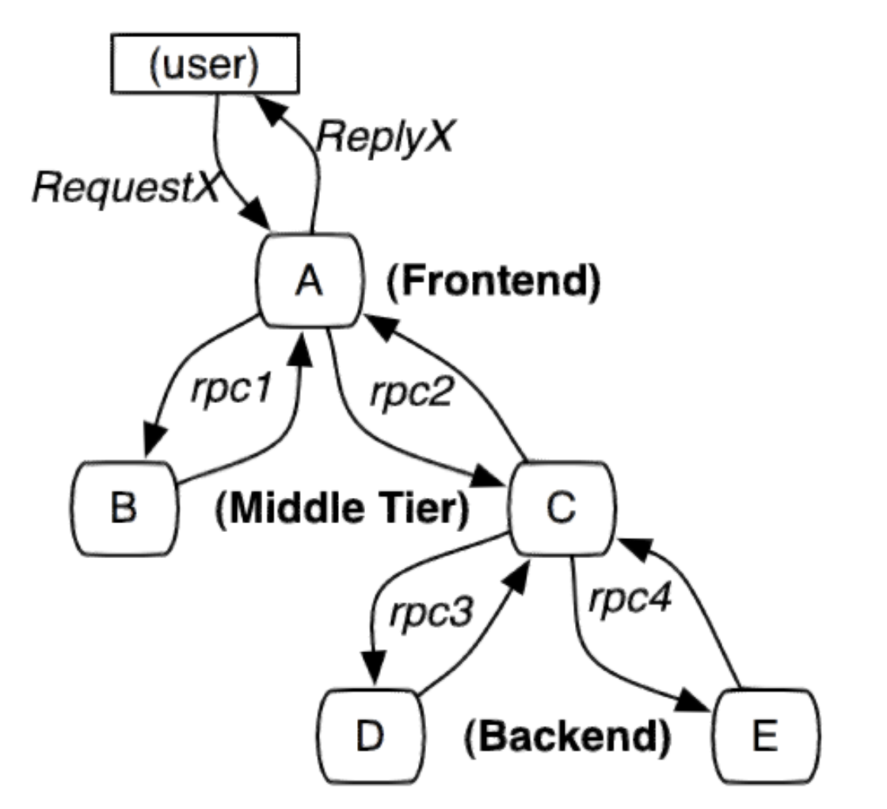
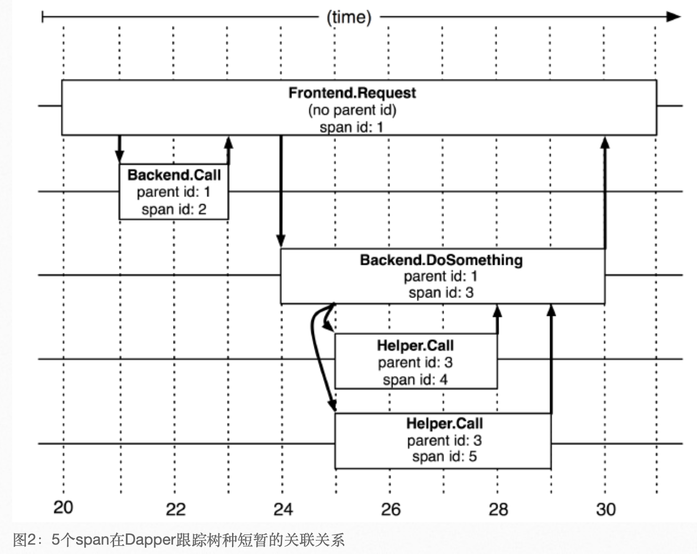
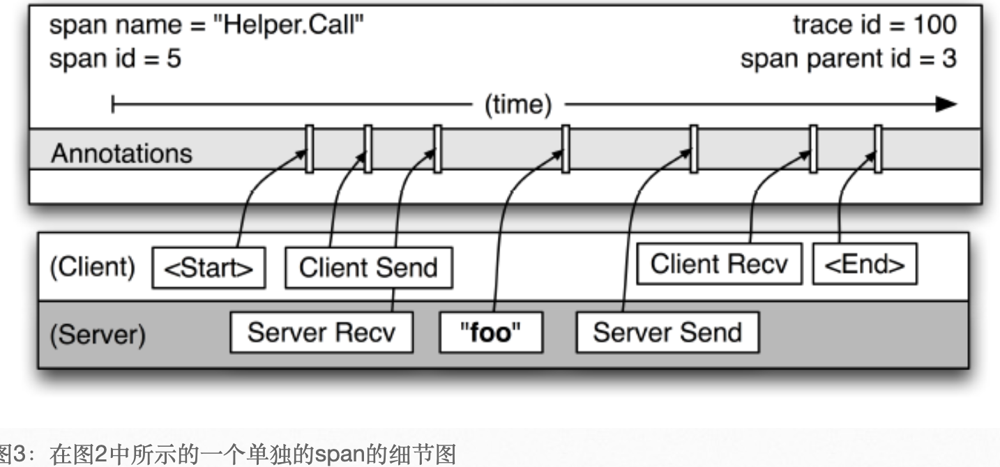

# 概述
分布式系统太分散，太复杂，错综复在的关系，人脑理不清，需要有理解系统行为，分析性能的工具；
dapper：
- 低损耗；
- 应用透明；
- 大范围部署
dapper参考了magpie与X-Trace。
# 介绍
dapper为了收集分布式系统的行为信息，需要监控横跨不同应用、不同服务器之间的关联动作；例子就是搜索请求，后台调用了特别多的服务，如果出现了问题，只能从总体上知道出了问题，但是不清楚具体哪个环节出现了问题；要求：无所不在的部署，就是监控的粒度要比较细，持续的监控，因为有的系统异常很难复现。设计目标：
- 低消耗，对在线服务的影响最小；
- 应用级的透明；
- 延展性；
- 分析的速度要快；

# 文献的总结
其他的分布式追踪系统还停留在理论上，dapper都在生产环境上运行来了几十年了，有一些独特的收获；adpper包含了很多的新的贡献，并且基本是完全的应用级透明。
# dapper的分布式追踪

最简单使用的分布式跟踪的实现，服务器每次发送与接收动作都收集跟踪标识符与时间戳。
requestId记录与发起者关联：
- 黑盒：统计回归的技术推断链路
- 基于标注的方案：需要一个全局的ID，需要代码植入。
## 跟踪树与span
树节点是架构的基本单元，每个节点是对span的引用。

dapper记录了span的名称、span的id与parent id。单独的span的细节图：

## 植入点
侵入性比较低，主要是因为：
- dapper把span的信息存储在ThreadLocal中；
- 线程池中保留span的上下文信息；
- 使用rpc通信框架做植入点。
## Annotation

