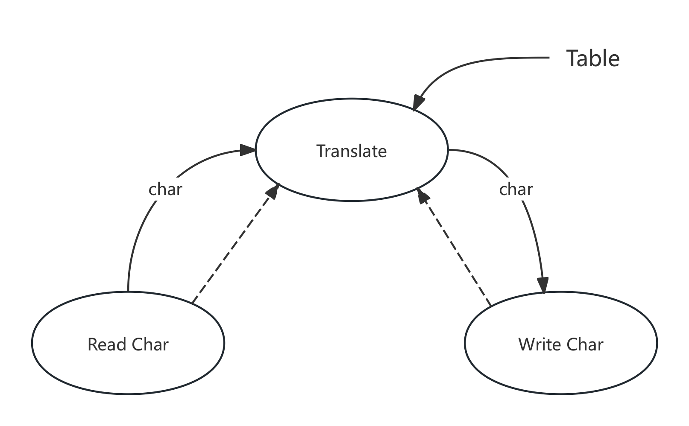
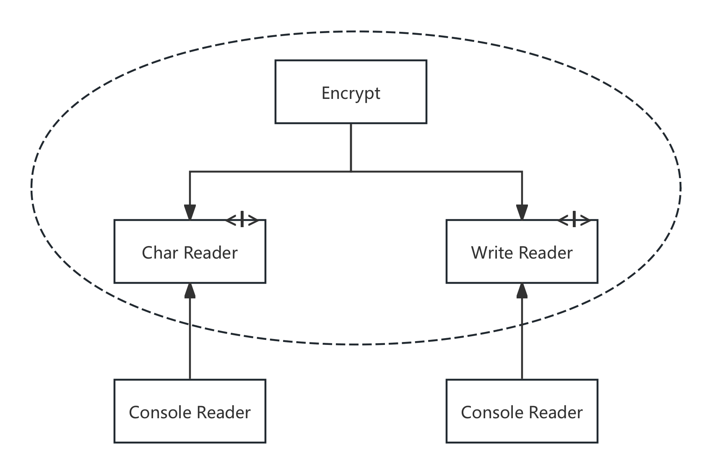

# 推荐序一
- 普通程序猿，了解程序语言特性，能够正确的实现业务逻辑与数据流程等
- 工程师，使代码易读、易扩展、易维护、可重用
- 架构师，解决复杂系统的问题，技术与业务综合的权衡。问题的多少与系统的复杂度成正比

>无论是微观世界的代码还是宏观层面的架构，无论是3种编程范式还是微服务架构，他们都在解决一个问题--分离控制与逻辑。所谓控制就是对程序流转的与业务逻辑无关的代码或系统的控制，比如多线程、异步、服务发现、部署、弹性伸缩，所谓逻辑则是实实在在的业务逻辑，是解决用户问题的逻辑，控制和逻辑构成了整体的软件复杂度，有效的分离控制和逻辑会让你的系统得到最大的简化

>如果你要成为一名架构师，你需要明确的区分几组词语，否则你不可能成为一名合格的工程师或者架构师。这几组词语是简单vs简陋、平衡vs妥协、迭代vs半成品。如果你不能很清楚的定义出其中的区别。那么你将很难做出正确的决定，也就不可能成为一名优秀的工程师或者架构师

# 推荐序二
# 序言
- 软件架构学关注的一个重点是组织架构
- 软件项目是具有递归和分形特点的
- 软件架构是系统设计过程中的重要设计决定的集合。
# 前言
Bob大叔的经验就是实际构建一些大大小小的软件系统。软件架构的规则是相同的，计算机代码没变，软件架构规则也没变，就是排列组合代码块的规则。

# 第一部分 概述
写出可运行的代码并不难，只是初级程序员的基本要求。软件架构设计难做，需要一定的知识、技能，需要自律与专注。带来的收益很大，软件变得易于扩展，需要投入巨大的人力与维护成本。
## 第1章 设计与架构究竟是什么
架构等于设计。底层设计信息构成了顶层架构设计。
### 目标是什么
软件架构的终极目标是用最小的人力成本来满足构建和维护系统的需求。
乱麻系统
- 没有经过设计，匆忙开发出来的
- 为了加快发布的速度，拼命添加新人
- 决策层对代码质量/设计结构优化忽视

软件研发人员会持续低估那些好的、良好设计的、整洁代码的重要性。2个错误观点
- 我们可以未来再重构代码，产品上线最重要
- 在工程中容忍糟糕的代码存在可以在短期内加快该工程上线的速度，未来这些代码会造成一些额外的工作量，但是没有什么大不了

要想跑得快先要跑的稳
## 第2章 2个价值维度
软件的价值体现在行为与架构2个方面
1. 行为价值
软件系统的行为是其最直观的价值维度。就是系统的功能，当前的运行行为，已满足使用者的需求为目标，就是不管怎么实现
2. 架构价值
软件发明的目的就是以一种灵活的方式改变机器的工作行为，很难改变的工作行为，称之为硬件。所以软件要足够灵活。架构价值就是当前的系统是否易于修改扩展变更

紧急的难题永远是不重要的，重要的难题永远是不紧急的。
- 系统行为是紧急的，并不总是特别重要
- 系统架构是重要的，但是并不总是特别紧急

软件架构师关注系统的整体架构而不是具体的功能和系统行为的实现。软件架构师必须创建出一个可以让功能实现起来更容易、修改起来更简单、扩展起来更轻松的软件架构。

# 第二部分 从基础构件开始: 编程范式
程序的编写模式
## 第3章 编程范式总览
1. 结构化编程，structured programming，对程序控制权的直接转移进行了限制与规范
2. 面向对象编程，object-oriented programming，对程序控制权的间接转移进行了限制与规范
3. 函数式编程，function programming，来自于1936年发明的$\lambda$演算，基于这个演算发明了LISP语言，$\lambda$演算法的核心就是不可变性。对程序中的赋值进行了限制与规范

## 第4章 结构化编程
结构化编程可以将模块递归拆分为可推导的单元，分为顺序结构、分之结构与循环结构。结构化编程限制了goto，结构化编程的功能性降解拆分式最佳实践之一。就是不断拆分出底层函数。编程时一个科学而不是数学，没法完全证明其正确性，只要没法证明其不正确就可以认为程序是足够正确的。科学理论与科学定律都是无法被证明的。测试的作用是得出某段程序已经足够实现当前目标这个结论。
## 第5章 面向对象编程
设计一个优秀的软件架构要基于对面向对象设计(Object-Oriented Design)的深入理解及应用。
什么是面向对象
- 数据与函数的组合，面向对象的理论来自于将函数的调用栈迁移到堆区域中。
- 面向对象编程是一种对真实世界进行建模的方式
- 由于采用面向对象方式构建的软件与真实世界的关系更紧密，面向对象编程可以使得软件开发更容易
- 封装(encapsulation)、继承(inheritance)、多态(polymorphism)

1. 封装: 封装数据与函数，封装不能是面向对象语言的特性
2. 继承: 
3. 多态: 多态就是函数指针的一种应用，面向对象语言消除了使用指针实现多态的危险性。可以实现很多高级的功能。程序应该与设备无关就可以在多种设备上实现同样的功能，这就是插件式架构。在多态出现之前，软件的函数调用树都是高层调用底层，首先要把底层的代码include进来，按照控制流逻辑加载对应的源代码文件，上层依赖下层。使用多态后，上层只需要提供接口定义，下层依赖上层的接口定义实现，在源代码层面，下层依赖上层，这个叫做依赖反转，在实际执行层面还是传统的调用树的，只是调用树只有在运行时才知道调用哪个实现，在源代码编写时时是不知道的，这与传统的函数调用树不同。而面向对象语言实现依赖反转就是通过接口实现的。

面向对象编程就是以多态为手段来对源代码中的依赖关系进行控制的能力。这种能力让软件架构师可以构建出某种插件式架构，让高层策略组件与底层实现性组件相分离，底层组件可以被编译成插件，实现独立与高层组件的开发与部署。
## 第6章 函数式编程
函数式编程语言中的变量是不可变的。所有的竞争问题、死锁问题、并发更新问题都是由可变变量导致的。
# 第三部分 设计原则
设计一个好的软件系统，从写整洁的代码开始做起。SOLID原则的主要作用就是如何将数据与函数组织成类，以及如何将这些类链接起来成为程序。这里的类仅仅代表一种数据与函数的分组，不一定就是面向对象的领域。
开发模块级结构的主要目标如下: 
- 使软件可容忍被改动
- 使软件更容易被理解
- 构建可以在多个软件系统中复用的组件

SOLID原则适用模块级编程，紧贴代码逻辑，这些原则可以帮助定义软件架构中的组件与模块。SOLID原则:
- **SRP**: 单一职责原则，基于康威定律(一个软件系统的最佳结构高度依赖于开发这个系统的组织的内部架构)的一个推论，每个软件模块都有且只有一个需要被改变的理由
- **OCP**: 开闭原则，软件系统想要被更容易改变，其设计就必须允许新增代码来修改系统行为而非只能靠修改原来的代码
- **LSP**: 里氏替换原则，如果想用可替换的组件来构建软件系统，那么这些组件就必须遵守同一个约定，以便让这些组件可以相互替换
- **ISP**: 接口隔离原则，在设计中避免不必要的依赖
- **DIP**: 依赖反转原则，高层的策略性代码不应该依赖实现底层细节的代码，恰恰相反，实现底层细节的代码应该依赖高层策略性的代码
## 第7章 SPR: 单一职责原则
- 任何一个软件模块都应该有且仅有一个被修改的原因
- 任何一个软件模块都应该只对一个用户或者利益攸关者负责(用户就是修改的原因)
- 任何一个软件模块都应该只对某一类行为者负责

将服务不同行为者的代码进行切分。解决办法
- 数据与函数分离
- Facade设计模式

单一职责原则主要讨论的是函数与类之间的关系。在组件层面上，成为共同闭包原则，在软件架构层面上，用于奠定架构边界的变更轴心。
## 第8章 OCP: 开闭原则
设计良好的软件应该易于扩展同时抗拒修改。一个计算机系统应该在不需要修改的前提下可以轻易的扩展。
- 依赖方向的控制
- 信息隐藏

OCP是进行系统架构设计的主导原则。主要目标是让系统易于扩展，同时限制其每次被修改所影响的范围。实现方式是通过将系统划分为一系列的组件。并将这些组件间的依赖关系按层次结构进行组织，使得高阶组件不会因为低阶组件被修改而收到影响。
## 第9章 LSP: 里氏替换原则
1988年Barbara Liskov:
>这里需要的是一种可替换性: 如果对于每个类型是S的对象o1都存在一个类型为T的对象o2,能使操作T类型的程序P在用o1替换o2时行为保持不变，我们可以将S称为T的子类型

LSP应该被用于软件架构层面，一旦违背了可替换性，不得不为此增添大量复杂的应对机制。
## 第10章 ISP: 接口隔离原则
将不同的操作隔离成接口，任何层次的软件设计如果依赖了它并不需要的东西，就会带来意料之外的麻烦。
## 第11章 DIP: 依赖反转原则
想要设计一个灵活的系统，在源代码层次的依赖关系中应该多引用抽象类型而非具体实现。DIP主要关注的是会经常变动的具体实现模块，比如业务逻辑，对于不变的或者变化可控的比如系统接口，SDK中的基础类等可以直接使用实现，也必须直接使用实现。原子无法再抽象了。接口比实现更稳定，因为实现的变更不影响接口，接口的变更必影响实现。软件架构的稳定的前提就是使用稳定的接口而不是多变的实现。
- 多使用抽象接口避免使用那些多变的具体实现类。
- 不要在具体实现类上创建衍生类。继承关系是所有一切源代码依赖关系中最强的，最难被修改的
- 不要覆盖包含具体实现的函数。
- 避免在代码中写入与任何具体实现相关的名字，或者是其他容易变动的事物的名字

创建对象如果要符合DIP原则要做特殊处理，因为创建对象依赖具体实现。使用抽象工厂模式来解决这个问题。控制流跨越架构边界的方向与源代码依赖关系跨越边界的方向正好相反。源代码依赖方向永远是控制流方向的反转，这就是DIP被称为依赖反转原则的原因。
# 组件构建原则
大型软件系统的构建过程与建筑物修建很类似。
## 第12章 组件
组件是软件的部署单元，独立部署的最小实体。设计良好的组件都应该永远保持可被独立部署的特性。
## 第13章 组件聚合
构建组件的3个基本原则:
- REP: 复用发布等同原则
- CCP: 共同闭包原则
- CRP: 共同复用原则

1. 复用发布等同原则
   软件复用的最小粒度应等同于其发布的最小粒度。组件中的类与模块必须时彼此紧密相关的。它们应该有同一个主题或者大方向。另一层来理解就是它们可以是同时发布的，共享相同的版本号与版本跟踪。
2. CCP: 共同闭包原则
   将那些会同时修改并且为相同目的而修改的类放到同一个组件中，而将不会同时修改，并且不会为了相同目的而修改的那些类放到不同的组件中。类似SRP原则，一个组件不应该同时存在多个变更原因。可维护的重要性要远远高于可复用性。变更最好都体现在同一个组件中而不是分布在多个组件中。集中在一个组件就只需要重新部署该组件其他组件则不需要重新验证重新部署。要将所有可能会被一起修改的类集中在一处。
3. CRP: 共同复用原则
   不要强迫一个组件的用户依赖他们不需要的东西。将经常共同复用的类或者模块放在同一个组件中。当决定要依赖某个组件时，最好是实际需要依赖该组件中的每个类。我们希望组件中的所有类都是不能拆分的，不应该出现别人只需要依赖它的某几个类而不需要其他类的情况。不是紧密相连的类不应该被放在同一个组件里面。不要依赖不需要用到的东西。
## 第14章 组件耦合
组件之间的关系。
1. 无依赖环原则: 组件依赖关系图中不应该出现环。一觉醒来综合症: 别人修改了你的依赖或者同时编辑一个文件，导致一夜过后，程序不能运行了。在大型多人项目中经常出现拖慢效率。业界推出2个解决方案:
   - 每周构建: 前4天在自己的分之上开发，周五提交统一集成构建。
   - 无依赖环原则，将项目分成小的可单独发布组件，各个组做自己的组件，独立发布，每次发布形成版本号并通知，其他人可以选择升级到新版或者使用某个版本。如果依赖存在环，那么很多组件的耦合起来需要一同修改，就会互相影响或者引入过多不必要的库。需要打破这种环，有2种办法
     - 应用依赖反转原则(DIP)
     - 创建一个新的组件，那其余2个组件依赖新的组件，将共同使用的抽出来。 
2. 自上而下的设计: 组件结构图是无法自上而下设计出来，必须随着软件系统的变化而变化，不可能在系统构建的最初就设计出来。组件依赖结构图不是用来描述应用程序功能的。组件结构图的一个重要的目标是隔离频繁的变更，不希望频繁变更的组件影响到本来应该很稳定的组件。组件关系图可以将稳定的高价值组件与常变的组件隔离开。
3. 稳定依赖原则: 依赖关系必须要指向更稳定的方向。如果一个设计是可维护的，那么某些部分就必须是可变得，任何一个经常变更的组件都不应该被一个难以修改的组件所依赖。稳定性与变更所需要的工作量有关。量化组件的稳定性，计算组件入与出的依赖关系。
   - Fan-in: 入向依赖，别的组件依赖当前组件的数量
   - Fan-out: 出向依赖，组件依赖别的组件的数量
   - *I*: $I=Fan-out/(Fan-out+Fan-in)$，范围为[0-1]，为0时最稳定，其他组件对它的依赖使得很难变更，为1时最不稳定，说明没有组件依赖当前组件，却依赖其他组件，这是最不稳定的，
  
  SDP的要求就是每个组件的*I*指标都必须大于其所依赖组件的*I*指标。设计组件架构图的目的就是决定哪些组件稳定，哪些组件不稳定
>什么是扇入和扇出？ 
在软件设计中，扇入和扇出的概念是指应用程序模块之间的层次调用情况。
按照结构化设计方法，一个应用程序是由多个功能相对独立的模块所组成。
扇入：是指直接调用该模块的上级模块的个数。扇入大表示模块的复用程序高。
扇出：是指该模块直接调用的下级模块的个数。扇出大表示模块的复杂度高，需要控制和协调过多的下级模块；但扇出过小（例如总是1）也不好。扇出过大一般是因为缺乏中间层次，应该适当增加中间层次的模块。扇出太小时可以把下级模块进一步分解成若干个子功能模块，或者合并到它的上级模块中去。
设计良好的软件结构，通常顶层扇出比较大，中间扇出小，底层模块则有大扇入。
其他回答 　 扇入：一个门的输入定义为门的输入的数目。 
扇出：用于描述驱动能力的一个词 
更加恰当的说法是：描述负载状况的一种描述方式
4. 稳定抽象原则: 一个组件的抽象化程度应该与其稳定性保持一致。
   1. 高阶策略应该放在哪里?系统的高阶架构设计与策略相关的高阶决策不能经常发生变更，如果需要变更则使用OCP原则。具体来说就是抽象类
   2. 稳定抽象原则为组件的稳定性与抽象程度建立关联，稳定的组件应该是抽象的，不稳定的组件要包含具体的实现代码。依赖关系应该指向更抽象的方向，组件层次上的DIP也是这样的。
   3. 组件抽象化程度就是接口与抽象类占总的类的占比，范围为[0,1]

# 软件架构
## 第15章 什么是软件架构
架构很重要对技术要求高，架构师是开发人员的终极目标。软件架构师是能力最强的一线程序员，实践设计并体会设计不佳出现的问题，然后能够引导系统到更好的设计方向。软件架构实质就是规划如何将系统切分成组件，安排好组件之间的排列关系以及组件之间互相通信的方式。设计软件架构的目的就是为了在工作中更好的对这些组件进行研发、部署、运行以及维护。如果想设计一个便于推进各项工作的系统，策略就是在设计中尽可能长时间地保留尽可能多的可选项。架构质量与系统能否正常工作关系不大，与后续的部署与扩展关系比较大。软件架构设计的目标是支撑软件系统的全生命周期，设计良好的架构可以让系统便于理解、易于修改、方便维护、轻松部署。软件架构的终极目标是最大化程序员的生产力最小化系统的总运营成本。
### 开发Development
软件架构的设计在开发层面的作用是方便开发团队的开发工作开展。按照团队配置的不同采用不同的架构设计，如果团队很小那么就不需要架构设计
### 部署(Deployment)
软件架构的目标就是实现一键式的轻松部署
### 运行(Operation)
软件架构对软件运行没有影响，软件运行问题只需要考虑硬件。
### 维护(Maintenance)
维护就会是对已有软件的扩展与Bug修复，良好的架构可以降低这2项成本。
### 保持可选项
软件有行为价值与架构价值，架构价值是最重要的，这也是为什么叫做软的原因，软就是容易变化变形的意思，软件被发明出来是因为人类需要一种灵活与便捷的方式来改变机器的行为，软件的灵活性取决于系统架构、组件的布置、组件之间的连接方式。让软件维持软的方法就是尽可能长时间的保留尽可能多的可选项。哪些选项是应该保留的，就是那些无关紧要的细节设计。所有的软件系统都可以降解为策略与细节2种元素，策略体现的是软件中所有的业务规则与操作过程，是系统真正的价值所在。细节则是指操作系统的人、其他系统以及程序员们与策略进行交互，但是又不会影响到策略本身的行为，比如IO设备、数据库、Web系统、服务器、框架、交互协议等。软件架构师的目标是创建一种系统形态，该形态以策略为最基本的元素，让细节与策略脱离关系，以允许在具体决策的过程中推迟或延迟与细节相关的内容。例子:
- 开发的早期阶段无需选择数据库系统
- 无须选定是否使用Web服务
- 不应该过早的使用REST模式
- 不应该过早的采用依赖注入框架

开发高层策略时要让自己摆脱具体细节的纠缠，可以将具体实现细节推迟，越到项目的后期就拥有越来越多的信息来作出合理的决策。一个优秀的软件架构师应该致力于最大化可选项的数量。
### 设备无关性
软件程序不依赖底层设备细节
### 垃圾邮件
## 第16章 独立性
一个设计良好的软件架构必须支持以下几点:
- 系统的用例与正常运行
- 系统的维护
- 系统的开发
- 系统的部署

系统架构必须实现用例所需要的功能，明确的反应用例表达的系统设计意图，比如类、函数、模块等都要明确的表明用例。系统架构要支持系统运行，在高并发以及延迟要求高的场景下，需要将服务拆分以实现服务并行，或者使用协程完成多IO操作。康威定律: 任何一个组织在设计系统时，往往会复制出一个与该组织内沟通结构相同的系统。这样系统拆分为隔离良好独立开发的组件，方便各自独立完成。良好的架构要能容易部署，一个架构的设计要对以上所有的方面做权衡，但是一些功能、运行、开发团队结构以及部署条件是无法提前预知的或者他们随着时间会产生变更，所以没有清晰的目标，但是还有一些原则可以帮助将系统划分为隔离良好的组件，并为未来保留更多的可选项。

- 按层解耦: 采用单一职责原则、共同闭包原则以及系统的设计意图来隔离那些变更原因不同的部分，集成变更原因相同的部分。因此一个系统可以被解耦成若干个水平分层UI、应用独有的业务逻辑、领域普适的业务逻辑、数据库等
- 用例的解耦: 按照用例垂直切分系统
- 解耦的模式: 解耦是有利于系统运行的，可以应用不同的资源分配方式，这些解耦组件通常称为服务或者微服务，这样的架构就是面向服务的架构
- 开发的独立性: 系统水平分层与用例解耦后，系统的架构就可以多团队开发
- 部署的独立性: 解耦做的好，部署就会更灵活
- 重复: 识别真正的重复与表面的重复，未来可能会发生不同演进的重复代码不需要消除，这样有利于垂直切分的解耦，
- 解耦模式:
  - 源码层次: 源代码分为不同模块，一个模块的变更不会导致其他模块的重新编译，但是还是链接为一个可执行程序
  - 部署层次: 编译后是不同的部署模块，一个模块的变更不会影响其他模块的重新部署，可能是一个机器上的多进程服务
  - 服务层次: 源码与部署都是独立的个体
## 第17章 划分边界
软件架构设计本身就是一门划分边界的艺术。边界的作用是将软件分割成各种元素，以便约束边界2侧之间的依赖关系。划分边界是把一些可以延后的决策剥离出来，这些决策不会对系统的核心业务逻辑产生影响。架构的目标是使用最小的人力资源来完成系统，消耗人力资源的地方就是耦合，耦合就是过早做出的不成熟的决策导致的，这些决策通常是与系统的业务需求无关的决策。边界线应该画在不相关的事情中间，最终的边界思想类似支持第三方插件的系统类似，软件开发技术就是如何想方设法的方便的增加插件从而构建一个可扩展、可维护的系统架构的故事。系统的核心业务逻辑必须与其他组件隔离，保持独立，其他组件要么是可以去掉的，要么是有多种实现的。为了在软件架构中画边界线，需要先将系统分割成组件，一部分是系统的核心业务逻辑组件，另一个部分则是与核心业务逻辑无关但负责提供提供必要功能的组件。然后通过对源代码的修改，让这些非核心组件依赖于系统的核心业务逻辑组件。这是一种对依赖反转原则(DIP)和稳定抽象原则(SAP)的具体应用。依赖箭头应该由底层具体实现细节指向高层抽象的方向。
## 第18章 边界剖析
一个系统的架构是由一系列软件组件以及它们之间的边界共同定义的，边界有多种存在形式
- 令人生畏的单体结构: 最简单的跨边界调用形式是类似函数的调用，此时编译时依赖与运行时依赖是一致的
- 部署层次的组件: 
- 线程: 
- 本地进程: 
- 服务: 最强的边界形式

## 第19章 策略与层次
整体的业务策略可以拆分为子策略，把变更原因、时间与层次相同的策略组成一个组件，所有的组件组成有向无环图，边的指向就是依赖关系，一般来说，低层组件被设计为依赖高层组件。层次是严格按照与输入与输出的距离来定义的，一个组件距离系统的输入与输出越远，层次就越高，直接管理输入与输出的策略在系统中的层次是最低的。一个简单加密程序

不正确的架构写法
```java
function encrypt(){
   while(true){
      writeChar(translate(readChar())); //高层组件函数依赖低层组件的函数实现。这就是问题
   }
}
```

高层的加密策略与低层的输入/输出策略解耦了，低层组件应该称为高层组件的插件。
## 第20章 业务逻辑
业务逻辑就是程序中那些真正用于赚钱或者省钱的的业务逻辑或者过程。这些被称为关键业务逻辑，相关的数据叫做关键业务数据，2者相关，通常放在同一个对象中处理，叫做业务实体(`entity`)，业务实体是计算机系统中的一种对象，包含了一系列用于操作关键数据的业务逻辑。可以直接包含关键数据或者很容易访问关键数据，接口就是操作关键数据的关键业务逻辑实现。业务实体并非面向对象语言独有，只是一个将关键数据与关键逻辑绑定在一起的这样的一个概念。业务实体属于高层概念而用例属于低层概念。用例依赖业务实体，业务实体不依赖用例。
## 第21章 尖叫的软件架构
