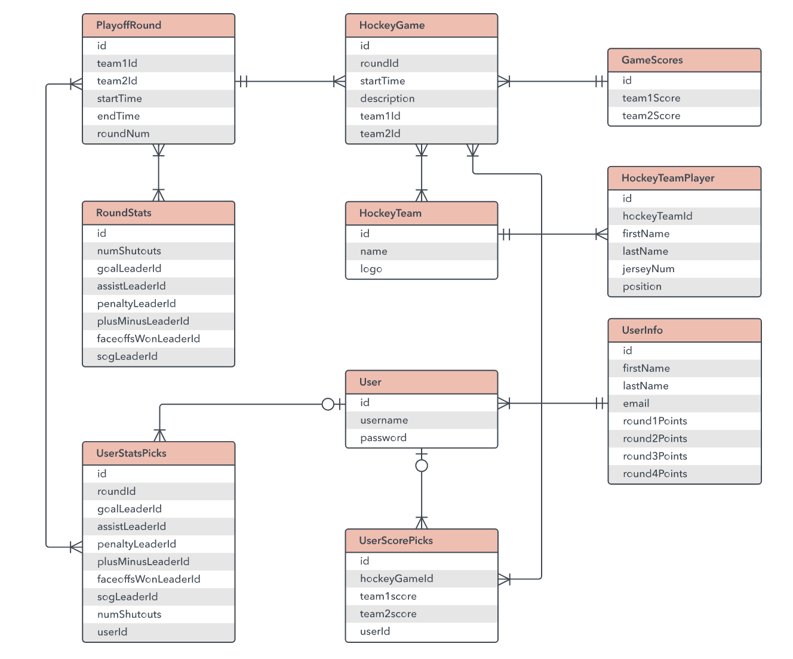
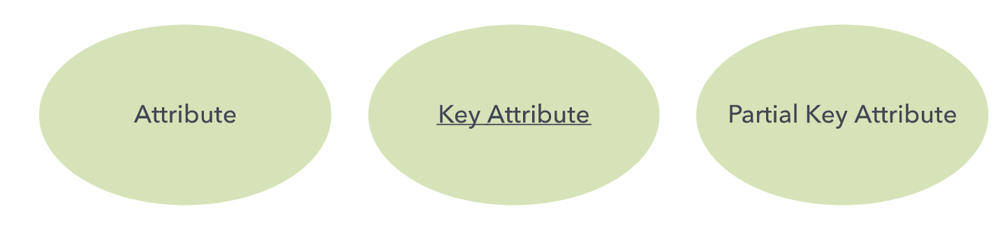
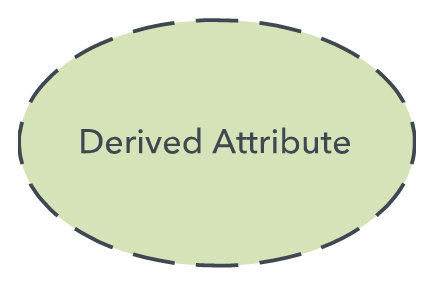
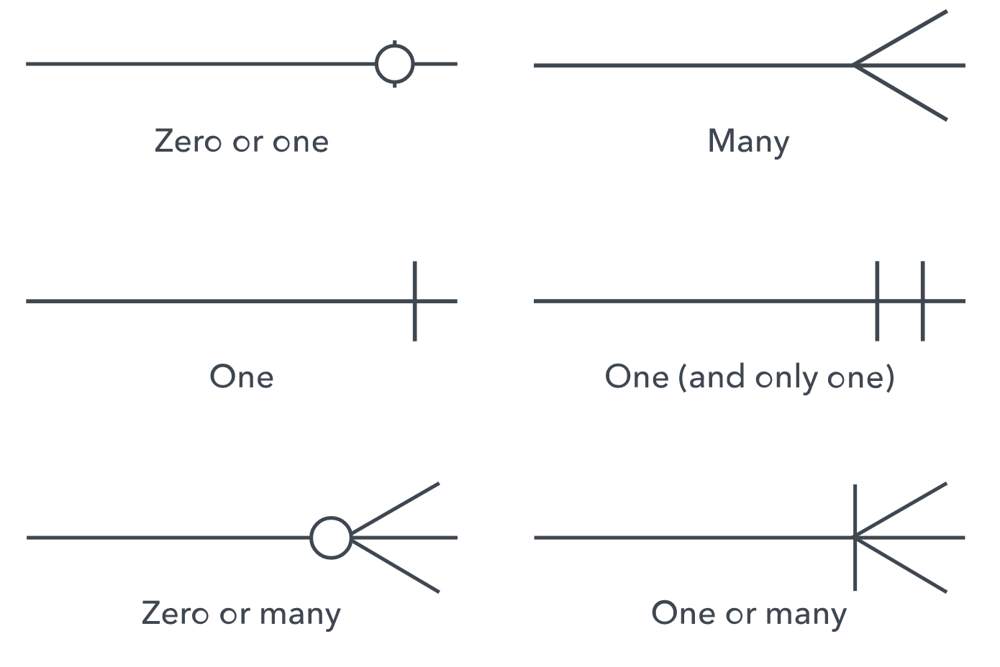
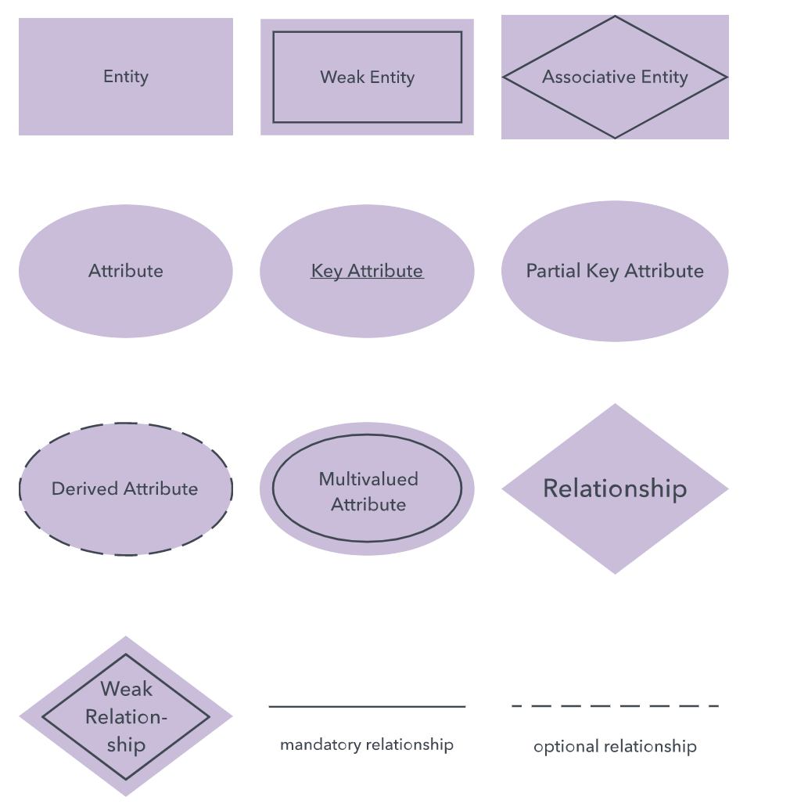
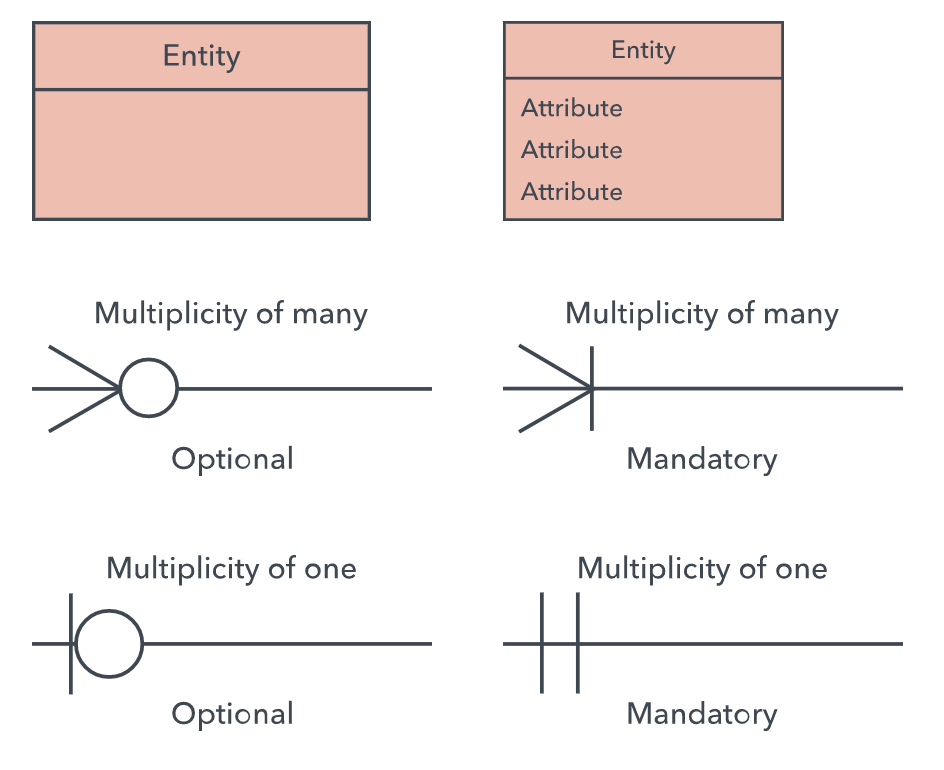
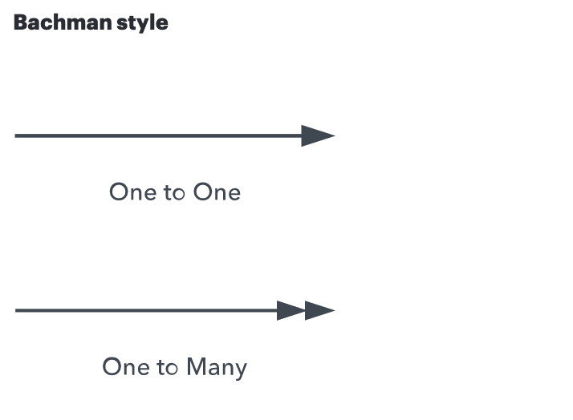
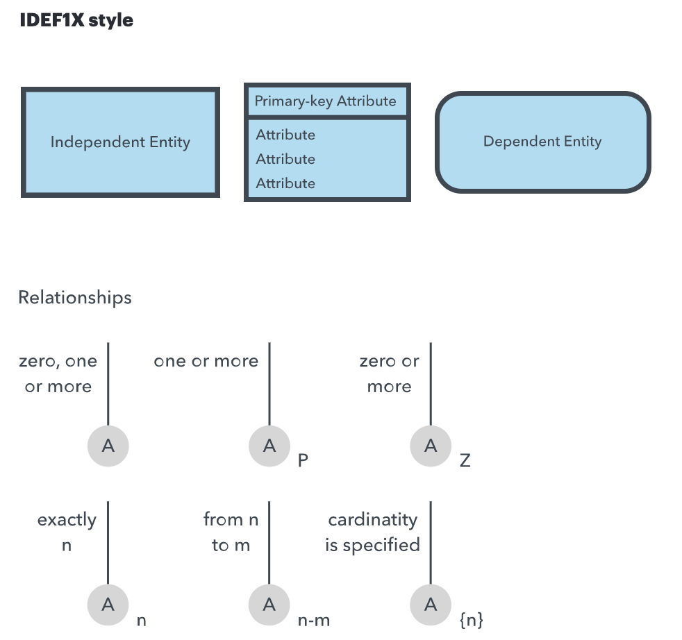
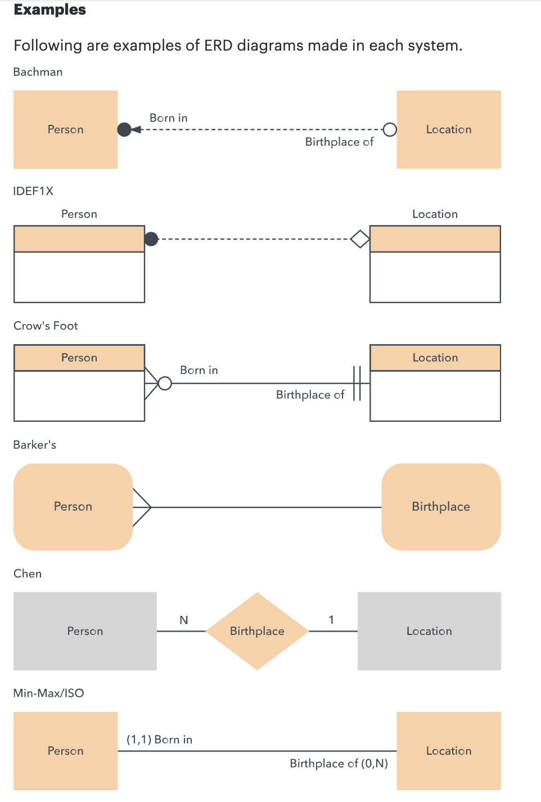

学习ER图与ER模型的本质，它们的起源、使用方法、例子、组件、限制以及画ER图的指导方针。
## What is an ERD
一个Entity Relationship（ER）图是流程图的一种，用于说明entities（比如人、对象、概念等在一个系统内部的互相关联的关系）。ER图常用于软件工程领域设计或者debug关系型数据库、商业信息系统、教育以及研究。也叫做ERDs或者ER模型，它们使用定义好的一组符号（矩形、菱形、椭圆形、连接线）来描述实体、关系以及属性的互联性。这有点类似于语法结构，实体类似名词，关系类似动词。类似下图:

ERD与数据结构图(DSDs)有关，DSD关注实体中元素之间的关系而不是实体之间的关系，ERD也常与数据流图（DFDs）联合使用，数据流图绘制流程与系统的信息流向。
## History of ER models
Peter Chen（也叫做Peter Pin-Shan Chen）, 当前在匹兹堡的卡内基梅隆大学任教，被认为是在1970s开发了ER modeling用于数据库设计，当它在MIT的斯隆商学院做助理助教期间，他发布了一个有重大影响的paper"The Entity-Relationship Model: Toward a Unified View of Data"。
从更广法的意义上说，对事物相互联系的描绘可以追溯到古希腊亚里士多德、苏格拉底、柏拉图等人的一些工作，在19世纪与20世纪中的哲学逻辑学家的工作中也能发现这种描绘的踪迹，比如查尔斯·桑德斯·皮尔斯和戈特洛布·弗雷格。
到1960年代和1970年代，Charles Bachman和A.P.G.布朗开发了ERD的前身，Bachman开发了数据流图，以他的名字命名为Bachman图，布朗发表了现实世界系统建模的著作，James Martin改进了ERD的相关的设计，Chen、Bachman、Brown、Martin等人的工作也为广泛用于软件设计的统一建模语言 (UML) 的发展做出了贡献。
## Uses of entity relationship diagrams
- 数据库设计: ERD用于关系数据库建模与设计，按照逻辑与业务规则（逻辑数据模型）与实现关系型数据的特性技术（物理数据模型）。在软件工程中，ERD是决定信息系统项目的需求的初始步骤，它后来也用于对特定数据库或者多个数据库进行建模，一个关系型数据库具有等效的与ER的关系表，所以可以用ERD表达。
- 数据库故障处理: ERD可以用于分析已经存在的数据库，发现并解决逻辑与部署上的一些问题，画ERD可以发现哪里出错了;
- 商业信息系统: ERD用于设计与分析业务流程中的关系型数据库，任何使用涉及到实体、动作以及相互之间影响的字段数据的业务流程都会使用到关系型数据库，它可以简化流程，更轻松的发现信息并改善结果;
- 业务流程引擎（Business Process Re-engineering BPR）；
- 教育：数据库回存储教育相关的关系型数据，并用于检索，ERD在表示这种数据结构时非常有价值;
- 研究：很多研究都专注于结构化数据，ERD可以帮助建立数据库来分析这些数据.
## The components and features of an ER diagram
ERD由实体、关系以及属性组成，也可以描述数量，下面好似关键术语：
1. Entity，一个确定的东西，比如人、对象、概念或者事件等，具有数据，实体是名词，比如：一个消费者、学生、车或者商品，通常使用矩形表示：

- Entity Type: 确定的物体的组成的类别，比如所有学生、所有运动员、但是实体是特定的学生或者运动员；
- Entity set: 与实体类型相同，但在特定时间点定义，例如第一天上课的学生。 其他示例：上个月购买的客户，目前在佛罗里达州注册的汽车。 一个相关的术语是实例，其中特定的人或汽车将是实体集的一个实例;
- Entity categories: 实体分为强、弱或关联。强实体可以仅由其自身的属性定义，而弱实体则不能，关联实体将实体集中的实体（或元素）关联起来;

- Entity keys: 指在实体集中唯一定义实体的属性。 实体键可以是超级键、候选键或主键。 超级键：一组属性（一个或多个）共同定义实体集中的一个实体；
- Candidate key: 最小的超级键，这意味着它具有尽可能少的属性，仍然是超级键。 一个实体集可能有多个候选键。 主键：由数据库设计者选择的候选键，用于唯一标识实体集。 外键：标识实体之间的关系。
2. Relationshiop
实体如何相互作用或相互关联。将关系视为动词。例如，指定的学生可能会注册一门课程。这两个实体将是学生和课程，所描述的关系是注册行为，以这种方式连接两个实体。 关系通常显示为菱形或者直接是连接上的一个标签。

- Recursive relationship: 同一实体不止一次地参与该关系;
3. Attribute
实体的属性或者特征，好用椭圆或者圆形表示

- 描述性属性: 关系的属性与特征;
- 属性分类: 属性分为简单、复合、派生以及单值或多值。 简单：表示属性值是原子的，不能进一步划分，例如电话号码。 复合：源自属性的子属性。 派生：属性是从另一个属性计算或派生出来的，例如从出生日期算起的年龄。

- Multi-value: 表示多个属性值，例如一个人的多个电话号码;
- Single-value: 只有一个属性值。 类型可以组合，例如：简单的单值属性或复合多值属性;
4. Cardinality(不知道怎么翻译)
定义两个实体或实体集之间关系的数字属性。 三个主要的基本关系是一对一、一对多和多对多。 一个一对一的例子是一个学生与一个邮寄地址相关联。 一对多示例（或多对一，取决于关系方向）：一名学生注册了多门课程，但所有这些课程都有一条线路返回给该学生。 多对多示例：作为一个组的学生与多个教职员工相关联，而教职员工又与多个学生相关联。

- Cardinality views： 基数可以显示为横向或同侧，具体取决于符号的显示位置;
- Cardinality constraints: 适用于关系的最小或最大数字;
## mapping natural language
ER组件与语言中的某个部分对应，下面是ER图与语法图的比较:
- Common noun(普通名词): 实体类型比如学生;
- Proper noun(专有名词): 实体比如Sally Smith
- Verb(动词): 关系类型，比如注册；
- Adjective(形容词): 实体的属性，比如sophomore;
- Adverb(副词): 关系属性，比如数字地;
数据库查询语言 ERROL 实际上模仿了自然语言结构。 ERROL 基于重构的关系代数 (RRA) 并与 ER 模型一起使用，捕捉它们的语言方面。
## ERD symbols and notations
存在集中不同的标记系统，它们都类似，只在某些小的方面不同;
1. chen标记风格

2. Crow’s Foot/Martin/Information Engineering style

3. Bachman Style

4. IDEF1X style

5. Barker style

下面是一些例子

## Conceptual, logical and physical data models
ER模型与数据模型通常绘制3种层次细节的内容:
- 概念数据模型: 包含最少细节的最高级别的视图，它的价值在于展示模型全貌并绘制系统架构，对于小型系统来说，不需要绘制，直接使用逻辑模型就可以；
- 逻辑数据模型: 比概念模型包含更多的细节，绘制更详细的操作与实体事务，逻辑模型独立于技术实现;
- 物理数据模型: 每个逻辑模型可以开发出一个躲着多个物理模型，物理模型必须展示足够多的技术细节来生成或者实现真正的数据库。
请注意，其他类型的图标也存在这3种级别的图形表示方式，例如数据流程图，但与软件工程的三模式方法比较，它们对信息的划分方法略有不同。有时，工程师会用额外的层次结构扩展ER图来为数据库设计添加必要的信息级别。例如，他们可以通过向上扩展超类和向下扩展子类来添加分组。
## Limitations of ER diagrams and models
- 只用于关系型数据: ERD的目的展示展示关系，ERD只展示关系结构;
- 不能用于非结构化数据: 除非数据能够被干净的分解为字段、行或者列，那么ERD可能会有用，半结构化数据也是一样;
- 很难与已经存在的数据库集成: 因为架构不同，集成一个已经存在的数据库是比较难的.
## How to draw a basic ER diagram
- 目的与范围: 定义分析或建模的目的和范围;
- Entities: 确定所涉及的实体。 准备好后，开始将它们绘制成矩形（或系统选择的形状）并将它们标记为名词;
- Relationships: 确定实体之间是如何关联的。 在它们之间画线以表示关系并标记它们。 有些实体可能不相关，这很好。 在不同的符号系统中，关系可以用菱形、另一个矩形或直接在连接线的顶部标记;
- Attributes: 通过添加实体的关键属性来更详细地分层。 属性通常显示为椭圆形;
- Cardinality: Show whether the relationship is 1-1, 1-many or many-to-many.
## More tips for ER diagrams
- 根据目的只展示到必须的细节程度就可以了，依据需要的细节的不同，你可以选择话概念、逻辑或者物理模型;
- 注意是否存在冗余的实体与关系;
- 如果你遇到了数据库冲突问题等，需要注意是否存在关系漏洞或者缺少了实体或者属性;
- 确保所有的实体与关系型都被标记;
- 你可以对关系表与ERD互相翻译;
- 确保ERD支持你要存储的所有的数据;
- 有很多不同的方式画ERD，只要它能表达，就是好的.

