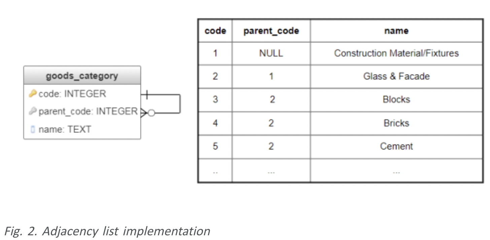
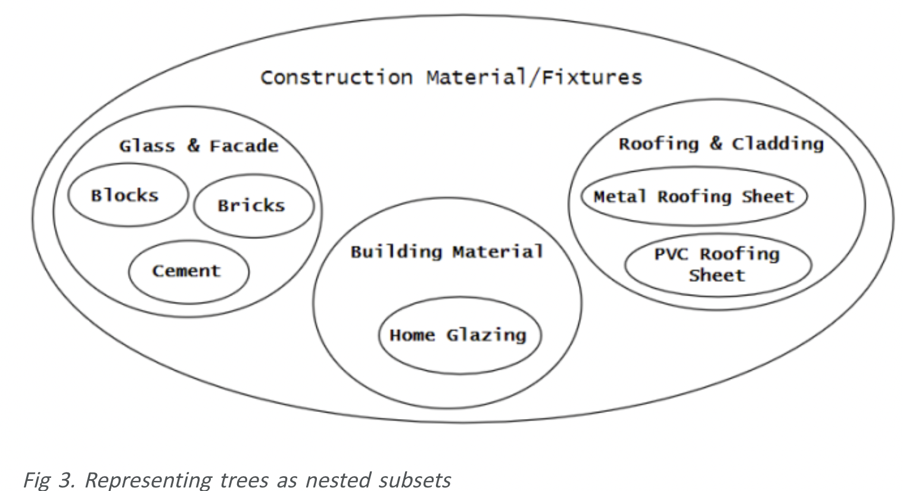
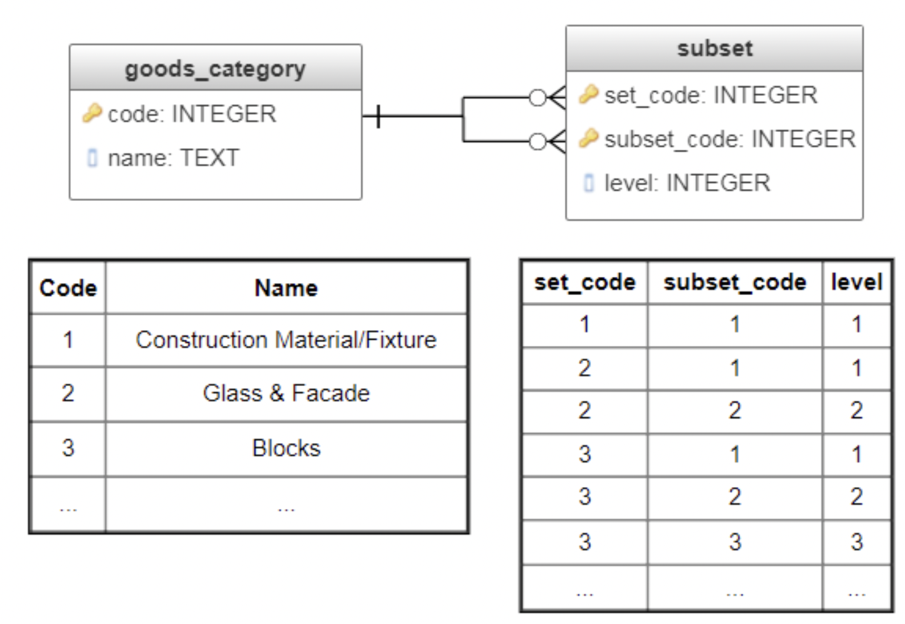
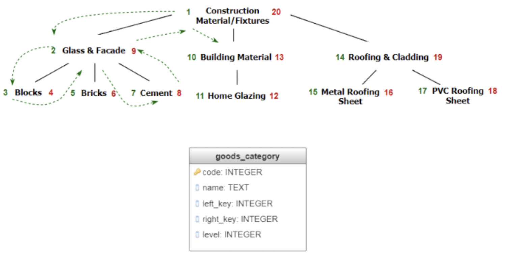
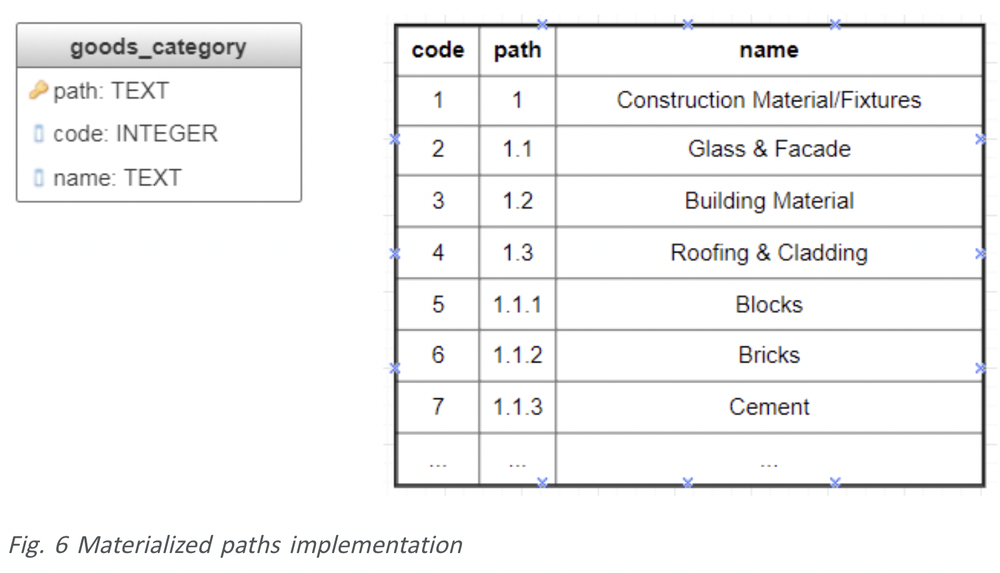
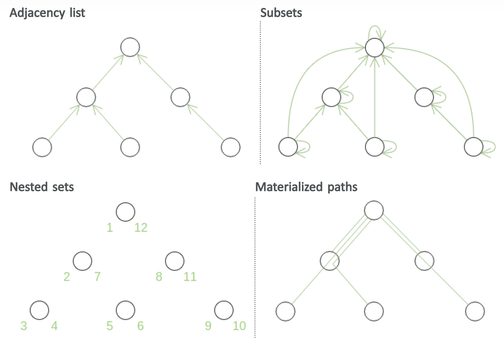
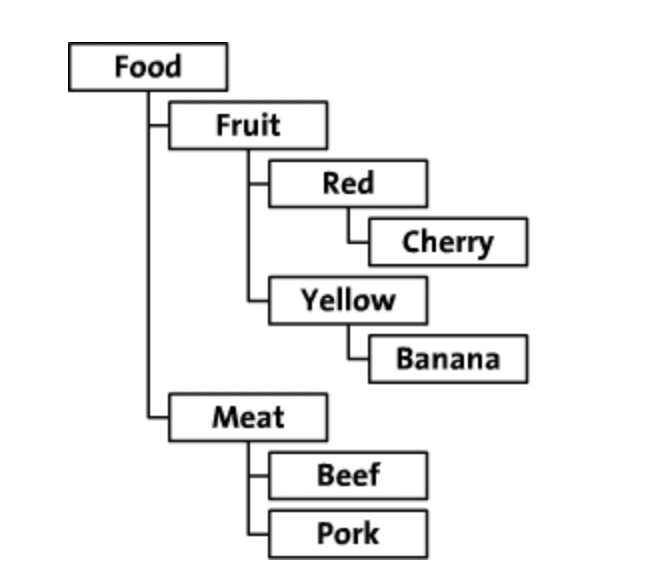
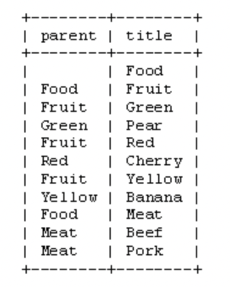
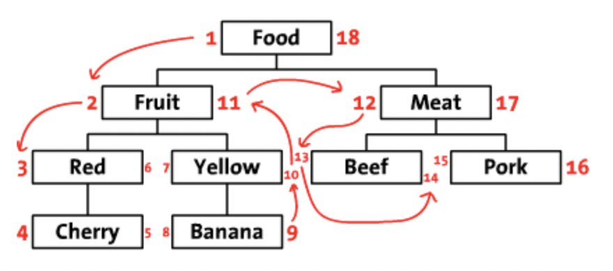
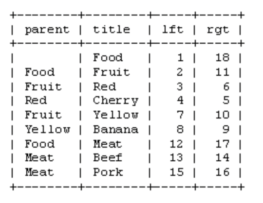

没有最好的解决方案，每个方案都有优缺点，特别是对于读取与写入来说。正确的方案依赖你做的那种操作比较多。
# native approach with parent-id
pros
- 容易实现
- 容易迁移子树
- 插入非常快，没有多余的处理
- 在SQL中可以直接访问需要的字段
cons
- 检索整个树是递归的，因此代价比较大
- 查找所有的父亲也是代价比较大的（SQL不知道递归获取）
# modified preorder tree traversal(saving a start- & end-point)预排序遍历树算法
pros:
- 检索整个树是非常容易的，代价也比较低;
- 查找所有的上级也是非常容易的，代价比较低;
- 在SQL中可以直接访问需要的字段
- 孩子节点的顺序可以存储
cons
- 新增与变更节点，代价比较大，你必须更新很多的节点
# saving path in each node
pros
- 寻找所有的父亲节点代价比较低
- 遍历整个树代价比较低
- 插入是非常方便的
cons
- 移动整个树代价非常高
- 依赖你保存路径的方式，在SQL没有直接存储路径的数据类型，你必须自己定义保存与解析的规则
# closure table
pros
- 实现非常容易
- 寻找所有的父节点是非常容易的
- 插入是非常容易的
- 检索整个树代价比较低
cons
- 需要额外的表
- 相比其他的方式需要大量额外的空间
- 移动子树代价比较高
# tree structure data in an RDB
- adjacency table Models (adjacency list model)
- Route enumeration model (path enumeration models)
- Nested collection models (nested set model)
- Close table model (closure table models)
# Storing trees in RDBMS
树是用来表示表示层次数据结构的一种方式，在很多问题领域中都出现过，本章就会讨论使用RDBMS表示树的几种常见的表示形式，并且会举例说明。
在软件开发领域，表示与存储类似于树形结构的数据是一个很常见的问题
- XML语法解析;
- PDF解析；
- 科学与游戏应用里面使用的决策树、概率树、行为树等;
树层次结构还出现在以下的问题中：
- 计算机科学中的二叉树;
- 生物生育的过程树;
- 商业领域中的庞氏模式；
- 任务分解树;
- 用来表示上下级关系、祖先关系、前后关系、整体部分、一般到特殊的关系等.
本文章讨论了最常使用的在关系数据库中存储树的4种方式。
## Adjacency list（邻接表）也就是parentId表示法
邻接表在图论里面是用来表示图的，里面存储链表，链表都是兄弟节点（也叫做相邻顶点）；对于树来说，只要存储父节点就可以了，这样链表中的每一个节点都形成数据库中的一条记录；这是最流行的表示方式之一；也是最直观的表示方式；只要一张表就可以了，表中的数据引用自身；跟节点的parent=null。表的设计如下

数据读取操作需要DBMS支持递归查询，PostgreSQL支持递归查询。
pros
- 数据表示比较直观
- 没有数据冗余，没有特别强的数据完整性依赖；
- 树的深度任意；
- 插入、移动、删除快速代价低因为不会影响别的节点.
cons
- 方法需要递归查询来获取祖先或者孩子节点、获得深度、获得孩子节点的数量。
## Subsets（也叫做Closure table或者Bridge table）
这个方法将树表示成一个嵌套的子集合，根节点包含所有的深度=1的子节点，然后在包含深度为2的所有的子节点，一直类推。

子集合的方法需要2个表：第一个表是集合的定义，第二个表是表示集合之间的包含关系，同时会有一个深度层级的表示。表的定义如下：

上面，level表示的subset_code所在的层次，这样表示的这个关系是在哪个level层面上的。
对于树中的每一个节点来说，subset表包含的记录数量等于树的深度，因此，记录的增长是指数增加的，但是查询检索变得简单而快速。
比如获取某个节点的下的树的sql
```sql
SELECT name, set_code, subset_code, level FROM subset s
    LEFT JOIN goods_category c ON c.code = s.set_code
WHERE subset_code = 1 /* the subtree root */
ORDER BY level;
```
从root给定节点的路径
```sql
SELECT name, set_code, subset_code, level FROM subset s
    LEFT JOIN goods_category c ON c.code = s.subset_code
WHERE set_code = 3 /* the give node */
ORDER BY level;
```
为了维持树的完整性，移动、插入操作需要实现触发器，这回更新所有相关的记录，subset的主要的好处就是支持快速、简单、非递归的查询操作：子树查询、祖先查询、节点的深度计算、孩子数量等.
cons
- 不是特别直观的数据表示方式（多加了间接关系的记录，关系分解到没2个之间）
- 数据冗余
- 需要触发器
- 比邻接表的表示方式移动，新增变的复杂。
## Nested sets（也叫做Modified Preorder Tree Traversal）
这个方法的思路是存储树的前序遍历结果，在这里根节点第一个访问，接下来访问左子树，然后是右子树；遍历的顺序存储到2个额外的字段里面：left_key与right_key；left_key字段是遍历整个树的起始顺序序号，right_key字段是遍历完整个树的最后的序号；因此，每个节点的孩子节点的key值都在当前节点的2个key值之间，不依赖他们的深度；这种特点允许查询检索树的时候不需要递归操作。

查询某个节点的子树
```sql
WITH root AS (SELECT left_key, right_key FROM goods_category WHERE code=2 /* id of the node */)
SELECT * FROM goods_category
    WHERE left_key >= (SELECT left_key FROM root) 
        AND right_key <= (SELECT right_key FROM root)
ORDER BY level;
```
pros
- 与closure table的方式类似
cons
- 当插入或者移动子树的时候需要重新分配前序的编号，比如：为了在底层节点上新增一个节点，你需要跟新新增节点的所有的右上节点的left——key与right-key编号。可能需要重新检索整个树；可以给left_key与right_key分配较大的间隔来减少节点序号变更的操作；另外的减少重新编号的方式是使用小数。
## Materialized paths（也叫做Lineage column，族谱列）
这种方法的想法是显式存储从根开始的整个路径作为节点的主键（图 6）。 物化路径是表示树的一种优雅方式：每个节点都有一个直观的标识符，其中的各个部分具有明确定义的语义。 此属性对于通用分类非常重要，包括国际疾病分类 (ICD)、通用十进分类 (UDC)、科学文章中使用的 PACS（物理学和天文学分类方案）。 此方法的查询很简洁，但并不总是有效，因为它们涉及子字符串匹配。

pros
- 数据的直观的表示方式，检索也是比较简单的
cons
- 插入、移动、删除比较复杂，
- 完整性约束的非平凡实现，
- 以及由于必须进行子字符串匹配而导致的低效查询
- 在使用数字标识符方法的情况下，另一个可能的缺点是深度级别的数量有限。
## 结论
邻接表的方式避免了冗余存储，不需要很强的完整性约束，插入变更不影响别的节点。
然而，大多数的查询都要递归。
另外3个方法都不需要递归，但是插入、移动等都要修改别的节点。
下图使用绿色示意性地表示对于所讨论的每种树存储方法，哪些数据实际存储在关系数据库中。

对于邻接表和物化路径方法，存储的数据直接反映了域的初始结构。 对于子集方法，结构因祖先和后代之间的额外自反和传递连接而变得复杂。 嵌套集方法的存储数据仅与初始结构间接相关。
||**Adjacency list**|**Subsets**|**Nested subsets**|**materizlized paths**|
|:---|:---|:---|:---|:----|
|**树深度和子树搜索时间的相关性**|强相关，没增加一个深度，增加一次select的递归|弱相关|弱相关|强相关（字符串子串匹配）|
|**节点插入**|简单|复杂，每个链条上的节点都要新增一个关系|复杂，需要更新right_key|复杂，需要更新所有的孩子节点中的路径|
|**节点移动**|简单|复杂，需要更新祖先与孩子节点|复杂，需要更新right_key|复杂，需要更新祖先与孩子节点|
|**节点删除**|简单|简单|简答|复杂，路径匹配|
|**冗余**|no|yes|yes|yes|
|**非参照完整性约束**|没有|需要|需要|需要|
# Storing Hierarchical Data in a Database
存储树是一个常见问题，有多种解决方案。 主要有两种方法：邻接表模型和改进的前序树遍历算法；在本文中，我们将探讨这两种保存分层数据的方法。 我将以虚构的在线食品商店的树为例。 这家食品店按类别、颜色和类型组织食物。 树看起来像这样：

本文包含许多代码示例，这些示例展示了如何保存和检索数据。 因为我自己使用该语言，并且许多其他人也使用或知道该语言，所以我选择用 PHP 编写示例。 您可能可以轻松地将它们翻译成您自己选择的语言。
## The Adjacency List Model
我们将尝试的第一种也是最优雅的方法称为“邻接表模型”或“递归方法”。 这是一种优雅的方法，因为您只需要一个简单的函数来遍历您的树。 在我们的食品店中，邻接表的表格如下所示：

如您所见，在邻接表方法中，您保存了每个节点的“父”。 我们可以看到‘梨’是‘绿色’的孩子，‘绿色’是‘水果’的孩子，依此类推。 根节点“Food”没有父值。 为简单起见，我使用“title”值来标识每个节点。 当然，在真实数据库中，您会使用每个节点的数字 id。
## Modified Preorder Tree Traversal
现在，让我们看看另一种存储树的方法。 递归可能很慢，所以我们宁愿不使用递归函数。 我们还希望尽量减少数据库查询的数量。 最好，我们对每个活动只有一个查询。
我们将首先以水平方式布置我们的树。 从根节点（‘Food’）开始，在它的左边写一个 1。 跟随树到“水果”并在旁边写一个 2。 这样，您沿着树的边缘行走（遍历），同时在每个节点的左侧和右侧写入一个数字。 最后一个数字写在“食物”节点的右侧。 在此图像中，您可以看到整个编号树，以及一些指示编号顺序的箭头。

我们将左右调用这些数字（例如，'Food' 的左边值为 1，右边值为 18）。 如您所见，这些数字表示每个节点之间的关系。 因为“Red”有数字 3 和 6，所以它是 1-18 “Food”节点的后代。 同样，我们可以说所有左值大于 2 和右值小于 11 的节点都是 2-11 ‘Fruit’的后代。 树结构现在存储在左值和右值中。 这种遍历树并计算节点的方法称为“修改前序树遍历”算法。

# database-structure-for-tree-data-structure
选择哪种模型需要考虑的内容
- 树结构变更的频率；
- 树是读多还是写多；
- 你需要从树中获取什么样的信息，


