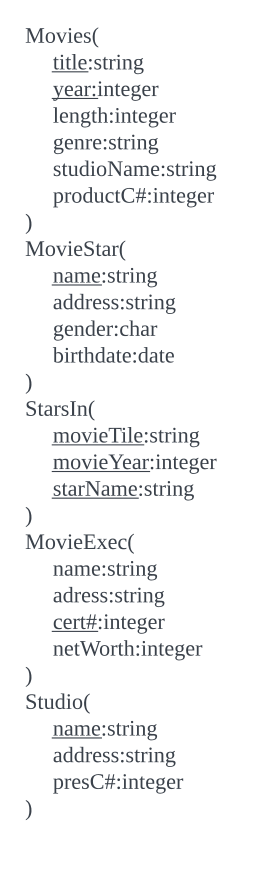
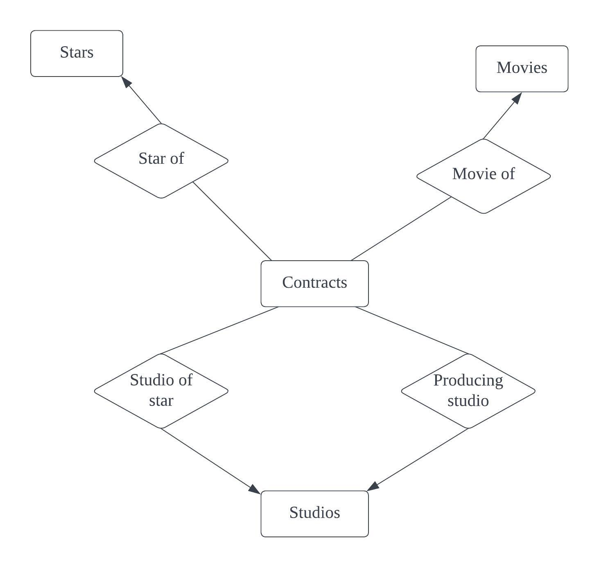

- [数据库系统世界](#数据库系统世界)
- [关系数据模型](#关系数据模型)
  - [关系模型概述](#关系模型概述)
  - [关系模型基础](#关系模型基础)
    - [习题2.2.1解答:](#习题221解答)
    - [习题2.2.2](#习题222)
    - [习题2.2.3](#习题223)
  - [在SQL中定义关系模式](#在sql中定义关系模式)
    - [习题2.3.1](#习题231)
    - [习题2.3.2](#习题232)
  - [代数查询语言](#代数查询语言)
    - [习题2.4.1](#习题241)
    - [习题2.4.2](#习题242)
    - [习题2.4.3](#习题243)
    - [习题2.4.4](#习题244)
    - [习题2.4.5](#习题245)
    - [习题2.4.6](#习题246)
    - [习题2.4.7](#习题247)
    - [习题2.4.8](#习题248)
    - [习题2.4.9](#习题249)
    - [习题2.4.10](#习题2410)
  - [关系上的约束](#关系上的约束)
  - [小结](#小结)
- [关系数据库设计理论](#关系数据库设计理论)
  - [函数依赖](#函数依赖)
    - [习题](#习题)
      - [习题3.1.1](#习题311)
      - [习题3.1.2](#习题312)
      - [习题3.1.3](#习题313)
  - [函数依赖的规则](#函数依赖的规则)
    - [函数依赖的推导](#函数依赖的推导)
    - [分解/集合规则](#分解集合规则)
    - [平凡函数依赖](#平凡函数依赖)
    - [计算属性的闭包](#计算属性的闭包)
    - [闭包算法为何有效](#闭包算法为何有效)
    - [传递规则](#传递规则)
    - [函数依赖的闭包集合](#函数依赖的闭包集合)
    - [投影函数依赖](#投影函数依赖)
    - [习题](#习题-1)
      - [习题3.2.1](#习题321)
      - [习题3.2.2](#习题322)
      - [习题3.2.3](#习题323)
  - [关系数据库模式设计](#关系数据库模式设计)
    - [异常](#异常)
    - [分解关系](#分解关系)
    - [Boyce-Codd范式](#boyce-codd范式)
    - [分解为BCNF](#分解为bcnf)
    - [习题](#习题-2)
      - [习题3.3.1](#习题331)
      - [习题3.3.2](#习题332)
      - [习题3.3.3](#习题333)
  - [分解的优劣](#分解的优劣)
    - [从分解中恢复信息](#从分解中恢复信息)
    - [无损连接(分解)的chase检验](#无损连接分解的chase检验)
    - [为什么chase检验有效](#为什么chase检验有效)
    - [依赖保持](#依赖保持)
    - [习题](#习题-3)
      - [习题3.4.1](#习题341)
  - [第三范式](#第三范式)
    - [3NF模式综合算法](#3nf模式综合算法)
    - [习题](#习题-4)
  - [多值依赖](#多值依赖)
    - [属性独立及随之产生的冗余](#属性独立及随之产生的冗余)
    - [多值依赖的定义](#多值依赖的定义)
- [高级数据库模型](#高级数据库模型)
  - [E/R模型](#er模型)
  - [设计原则](#设计原则)
    - [习题](#习题-5)
  - [E/R模型中的约束](#er模型中的约束)
    - [E/R模型中的键](#er模型中的键)
    - [引用完整性约束](#引用完整性约束)
  - [弱实体集](#弱实体集)
  - [从E/R图到关系设计](#从er图到关系设计)
  - [子类结构到关系的转化](#子类结构到关系的转化)
  - [统一建模语言](#统一建模语言)
  - [UML图到关系的转化](#uml图到关系的转化)
- [代数和逻辑查询语言](#代数和逻辑查询语言)
  - [包上的关系操作](#包上的关系操作)
  - [关系代数的扩展操作符](#关系代数的扩展操作符)
  - [关系逻辑](#关系逻辑)
    - [Datalog规则应用与包](#datalog规则应用与包)
  - [关系代数与Datalog](#关系代数与datalog)
- [数据库语言SQL](#数据库语言sql)
  - [SQL中的简单查询](#sql中的简单查询)
  - [多关系查询](#多关系查询)
  - [子查询](#子查询)

# 数据库系统世界
数据库是每一项业务的基础。DBMS=数据库系统
1. 数据库系统的发展
   数据库就是由DBMS管理的信息的集合。DBMS具备的功能:
   - 支持DDL，支持scheme
   - 支持查询/更新数据
   - 支持大数据量存储
   - 持久性，重启或程序挂掉不会丢失
   - 允许并发，用户操作不影响也就是隔离性，对数据的操作支持完整性，也就是原子性
   最开始的数据库是文件系统，但是不支持上述的功能。后面出现了具有数据存储格式的DBMS，数据有树结构与图结构。还是还不支持高级查询语言，一切都是硬编码。
   第二个发展阶段就是关系数据库系统，Codd提出将数据组织成表的形式呈现给用户，这种形式称为关系(relation)。而且程序员不需要关注数据存储结构，只需要使用SQL这种关系型查询语言就可以了。随着计算机硬件技术的发展，数据库软件作为一种大型软件已经可以运行在普通的PC上，一个趋势就是大数据时代的到来，比如google，youtube，亚马逊等网站的后台数据。
2. 数据库管理系统概述
   
   数据定义语言DDL命令由具有特定权限的DBA执行，更改数据库结构或者模式。数据操作语言DML命令由用户或者应用程序执行，查询或者变更数据。
   - 查询处理: 
   - 事务处理: 

   存储器管理器的任务是控制数据在磁盘上的位置存放和在磁盘与主存间的移动。缓冲区管理器负责把可用主存分割成缓冲区，需要获取磁盘信息的组件都要通过缓冲区管理器
   
   将操作组织成事务，事务管理器接收事务命令，执行下面的任务
   - 记日志logging，可以用于故障恢复;
   - 并发控制concurrency control，调度器也就是并发控制管理器，通过加锁的方式确保事务执行的隔离性。
   - 消除死锁，当陷入死锁时，调度器需要有机制消除打破

   事务的ACID性质:
   - A atomicity表示原子性，事务的操作要么全部被执行要么全部不被执行;
   - I isolation表示独立性，每个事务必须如同没有其他事务在同时执行一样被执行
   - D durability表示持久性，一旦事务已经完成，该事务对数据库的影响就永远不会丢失
   - C consistency表示一致性，也就是说，数据库中的元组的联系具有一致性约束，或说满足一致性期望，
   
   性能的关键点查询处理器(query processor):
   - 查询编译器，把查询转换成称作查询计划（query plan）的内部形式，也就是数据上的操作序列（关系代数）
     - 查询分析器(query parser)，查询文本构造一个查询树结构
     - 查询预处理器(query preprocessor)，语义检查，将初始查询语法树转化转换成初始的查询计划的初始操作符树
     - 查询优化器(query optimizer), 将初始操作符树转换成实际数据上执行最有效率的操作序列

    
   - 执行引擎(execution engine)，负责执行操作序列。
3. 本书概述
   - 关系数据库模型，关系模型，关系数据库理论，高级的数据库设计方法，E-R模型、UML、ODL
   - 关系数据数据库程序设计，如何对关系数据库查询与更新，SQL、数据连接方式
   - 半结构化数据的建模和程序设计
# 关系数据模型
最重要的一种数据模型: 二维表也就是关系。
## 关系模型概述
数据模型是最基本的概念。
数据模型（data model）: 描述数据或信息的标记，3部分组成:
- 数据结构(structure of data): 一般指物理数据模型(physical data model)，数据模型的概念比数据结构的概念高，数据模型也叫做概念模型(conceptual model);
- 数据操作(operation on the data): 数据上的有限的可执行的操作集，查询/修改等;
- 数据约束(constraint on the data): 简单来说，比如周数据，只有1～7，类似这样的约束

2种重要的数据模型:
- 关系数据模型: 对象关系模型。基于表的数据模型。这很像C中的结构体数组，但是关系模型存储可能不是这么简单，因为数据是存储到磁盘上的，需要考虑磁盘的访问方式。与关系模型联系在一起的操作形成了关系代数。关系代数都是面向表的。
- 半结构化数据模型: XML。半结构数据模型类似树或者图而不是关系的表或者数组，比如XML，有一系列嵌套的标签组成，这些标签类似表中的表头。半结构化数据模型的操作主要就是沿着嵌套结构搜索。也有约束，比如标签的数据类型，标签之间关系等

其他数据模型:
- 对象关系模型: 将面向对象的特征加入到关系模型中;
- 层次模型: 基于树结构
- 网状模型: 基于图的位于物理层次上的模型

关系模型是DBMS采用最多的模型，这是因为在大数据的情况下，它是高效的和易用的，它可以对任何事物建模，功能全面，提供的操作具有较高的层级，方便使用。
## 关系模型基础
关系模型描述数据的方法，称为关系的二维表。行描述实体，列描述特征。
关系列命名为属性，表示项目的语义。关系名与属性的集合的组合叫做关系的模式(schema)。描述关系模式就是用这个组合`Movies(title,year,length,genre)`，属性是集合而不是列表，但是为了说明方便，都有顺序。数据库是由一个或者多个关系组成，数据库的关系模式集合叫做关系数据库模式(relational database schema)或者就叫做数据库模式(database schema)。数据行称为元组，元组中的分量对应属性，元组的说明`(Gone with the wind,1939,231,drama)`，这个元组的对应的关系就是属性在关系中顺序。关系模型要求元组中的每个分量具有原子性，它必须属于某种基本元素类型而不能是记录、组合、列表这样可以分解为更小的组合类型。关系中每个属性都有一个域(domain，也叫做数据类型)，元组值必须属于所对应属性的域，将域定义包含在关系模式中`Movies(title: string,year:integer,length:integer,grene;string)`。关系是元组的集合，不是元组的列表，也就是元组的顺序、属性的顺序不重要。关系会随着增删改的原因变化，但是关系模式的变更代价很大，所有的元组叫做关系的实例，数据库维护的是最新的实例，也叫做当前实例。关系可以加键约束，键由一组属性集组成，元组的键值都是唯一的。作为键的属性通常描述是画下划线，比如Movies(<u>title: string</u>,<u>year:integer</u>,length:integer,grene;string)。形成键的属性集的值对于关系的所有实例都具有唯一性。现实中通常使用虚拟键。数据库模式的例子:
 
### 习题2.2.1解答:
a)Accounts关系的属性: acctNo,type,balance;Customers关系的属性:firstName,lastName,idNo,account;
b)y一个账户的数据表示为Account关系的一个元组，Accounts中有3个元组(12345,savings,12000),(23456,checking,1000),(34567,savings,25)；一个消费者的数据表示为Customers关系的一个元组，Customers关系中也有3个元组(Robbie,Banks,901-222,12345),(Lena,Hand,805-333,12345),(Lena,Hand,805-333,23456)
c)每个元组的分量为上面的每个值
d)Accounts关系模式Accounts(acctNo,type,balance),Customers关系模式:Customers(firstName,lastName,idNo,account)
e)数据库模式为Accounts(acctNo,type,balance),Customers(firstName,lastName,idNo,account)
f)Accounts(acctNo:string,type:string,balance:integer),Customers(firstName:string,lastName:string,idNo:string,account:string)
g)关系的等价表示形式只需要更改属性或者元组的顺序。

| **acctNo** | **balance** | **type** |
|------------|-------------|----------|
| 34567      | 25          | Savings  |
| 23456      | 1000        | Checking |
| 12345      | 12000       | Savings  |

| **idNo** | **firstName** | **lastName** | **account** |
|----------|---------------|--------------|-------------|
| 805-333  | Lena          | Hand         | 23456       |
| 805-333  | Lena          | Hand         | 12345       |
| 901-222  | Robbie        | Banks        | 12345       |

### 习题2.2.2
Accounts(<u>acctNo</u>:string,type:string,balance:integer);Customers(firstName:string,lastName:string,<u>idNo</u>:string,account:string)
### 习题2.2.3
一种由多少种方式来描述下面的关系实例(考虑元组与属性的排列顺序)

a)图2-6种的关系Accounts一样具有3个属性与3个元组的关系
9种;
b)具有4个属性与5个元组的关系
20种;
c)具有$n$个属性与$m$个元组的关系
$ n\times m $种
## 在SQL中定义关系模式
用于描述与操作关系数据库的语言是SQl(sequel)。
- DDL语言，定义数据库模式
- DML语言，查询与更新

1. SQL区分3类关系:
   - 需要存储的关系，也就是普通表，是数据库实际存储的数据，用户可以对元组查询与更新；
   - 视图，通过计算来定义的关系，并不存储，需要的是时候构造;
   - 临时表，执行SQL时临时构造的。
  
使用`CREATE TABLE`语句创建关系模式
2. 数据类型
   - 可变长度与固定长度的字符串CHAR(n),VARCHAR(n);
   - 固定或者可变长度的位串BIT(n);
   - BOOLEAN;
   - DATE/TIME类型，是字符串的一种特殊类型
   - 整数值INT/INTEGER;
   - 浮点数，FLOAT/REAL/DOUBLE/PRECISION/DECIMAL(n,d)/NUMERIC(n,d)
3. 简单的表定义
   最简单的关系模式的定义形式是由保留字`CREATE TABLE`后面接关系名以及括号括起来的由属性名和类型组成的列表。
   例子:
   ```sql
   CREATE TABLE(
      title CHAR(100),
      year INT,
      length INT,
      genre CHAR(10),
      studioName CHAR(30),
      produerC #  INT
   );
   ```
4. 修改关系模式
   `DROP TABLE R`
   `ALTER TABLE table-name ADD|DROP`, ADD表示添加新的属性，DROP表示删除已有的属性。
5. 默认值
   DEFAULT value,添加默认值的方式，DEFAULT NULL/DEFAULT '?'
6. 键的声明
   2种方式声明键:
   - 直接在属性后面声明
   - 专门的表项声明，可以声明一个或者多个是键；
   键有2种:
   - PRIMARY KEY(不能为NULL)
   - UNIQUE
### 习题2.3.1
下面的练习基于一个正在运行的关系数据库。该数据库模式由4个关系组成，他们的模式如下:
>Product(maker,model,type)
PC(model,speed,ram,hd,price)
Laptop(model,speed,ram,hd,screen,price)
Printer(model,color,type,price)

关系Product给出了各种产品的制造商、型号和产品类型(PC、laptop、printer)。为了简单起见，假设型号对于所有的制造商和产品都是唯一的，尽管这个假设在实际中不成立，实际的数据库中型号将包含一个代表制造商的代码。关系PC给出了每种PC的速度、RAM的大小，硬盘容量以及价格。关系Laptop与关系PC类似，在PC的基础上增加了属性screen。关系Printer记录了每种类型的打印机的型号，是否是彩色打印机、处理类型以及价格，请写出下面的定义:
a)合适的Product关系模式
```sql
CREATE TABLE Product(
   maker CHAR(25) NOT NULL,
   model CHAR(15) PRIMARY KEY ,
   type CHAR(25) NOT NULL
)
```
CREATE TABLE可以:
- 创建表
- 定义列约束
- 定义表约束(NOT NULL, PRIMARY KEY, FOREIGN KEY)
- CHARACTER数据类型接受固定长度的字符串，字符串长度在声明时指定。比如`CHARACTER(n)`这里，$n$表示想要的长度;
b)合适的PC关系模式
```sql
CREATE TABLE PC(
   model VARCHAR(15) PRIMARY KEY,
   speed DECIMAL(4,2) NOT NULL,
   ram   INT NOT NULL,
   hd    INT NOT NULL,
   price DECIMAL(7,2) NOT NULL
)
```
The CREATE TABLE statement can:
• Create a table.
• Define column constraints (Not null, Primary-key, Foreign-key).
• Define table constraints.
• The CHARACTER data type accepts character strings with fixed length. The length of the character string specified in the data type declaration. Example CHARACTER(n) where n represents the desired length.
• The INTEGER data type accepts numeric values
• The DECIMAL data type accepts numeric values and you may define a precision.
• From the above query the create command creates a table with the name PC.
• It has five fields model depicts the model number of the PC and we assume that model numbers are unique.
• Speed depicts speed of the processor in gigahertz.
• Ram depicts the amount of ram in megabytes.
• hd depicts the size of the hard disk.
• Price depicts the price of the PC
c)合适的Laptop的关系模式
```sql
CREATE TABLE Laptop(
   model CHAR(15) PRIMARY KEY,
   speed DECIMAL(4,2) NOT NULL,
   ram   INT NOT NULL,
   hd    INT NOT NULL,
   screen DECIMAL(3,1) NOT NULL,
   price DECIMAL(7,2) NOT NULL
)
```
The CREATE TABLE statement can:
• Create a table.
• Define column constraints.
• Define table constraints (Not null, Primary-key, Foreign-key).
• The CHARACTER data type accepts character strings with fixed length. The length of the character string specified in the data type declaration. Example CHARACTER(n) where n represents the desired length.
• The INTEGER data type accepts numeric values
• The DECIMAL data type accepts numeric values and you may define a precision.
• From the above query the create command creates a table with the name Laptop.
• It has six fields model depicts the model number of the Laptop and we assume that model numbers are unique.
• Speed depicts speed of the processor in gigahertz.
• Ram depicts the amount of ram in megabytes.
• hd depicts the size of the hard disk.
• Screen depicts the screen size of the Laptop in inches
• Price depicts the price of the Laptop
d)合适的Printer的关系模式
```sql
CREATE TABLE Printer(
   model CHAR(15) PRIMARY KEY,
   color BOOLEAN NOT NULL,
   type CHAR(10) NOT NULL,
   price DECIMAL(7,2) NOt NULL
)
```
The CREATE TABLE statement can:
- Create a table.
- Define column constraints.
- Define table constraints (Not null, Primary-key, Foreign-key).
- The CHARACTER data type accepts character strings with fixed length. The length of the character string specified in the data type declaration. Example CHARACTER(n) where n represents the desired length.
- The BOOLEAN data type supports the storage of two values: TRUE or FALSE
- The DECIMAL data type accepts numeric values and you may define a precision.
- From the above query the create command creates a table with the name Printer.
- It has four fields model depicts the model number of the Printer and we assume that model numbers are unique.
- color depicts whether the Printer produces color output true or not.
- type depicts the process type (laser or ink-jet).
- Price depicts the price of the Printer
e)从d的关系模式中删除属性color
ALTER TABLE Printer DROP color
f)为c的模式增加一个属性od(光驱类型)。如果某个笔记本电脑(laptop)没有光驱，则该属性的默认值是none
ALTER TABLE Laptop ADD od CHAR(10) DEFAULT 'none'
### 习题2.3.2
本习题引入另外一个运行着的实例，涉及二战中的大型舰船。它由一下几个关系组成:
>Classes(class,type,country,numGuns,bore,displacement)
Ships(name,class,launched)
Battles(name,date)
Outcomes(ship,battle,result)

相同设计的舰船组成一个类，类别的名称通常就是这个类的第一艘舰船的名字，关系Classes记录了类(也就是第一艘舰船)的名字，型号，生产国家，主跑的数目，炮尺寸和排水量。关系Ships记录了舰船的名字，舰船类属名字和开始服役的日期。关系Battles给出了这些舰船参加战役的时间。关系Outcomes给出了个舰船在各场战役中的结果(是沉没还是受伤或者完好)。
a)合适的Classes关系模式
```sql
CREATE TABLE Classes(
   class  CHAR(25) PRIMARY KEY,
   type   CHAR(2) NOT NULL,
   country CHAR(25) NOT NULL,
   numGuns  INT NOT NULL,
   bore DECIMAL(3,1) NOT NULL,
   displacement INT NOT NULL
);
```
- CREATE TABLE command will create a table with the name Classes.
- class, type, country, numGuns, bore and displacement are the columns names.
- class column is created as primary key:
- class depicts the class name of the various classes of Classes table.
- type depicts the class type of the various classes ‘bb’ for battleship or ‘bc’ for battlecruiser.
- country depicts the country name that built the ship.
- numGuns depicts the number of main guns.
- bore depicts the diameter of the gun barrel in inches.
- displacement depicts the weight in tons.
b)合适的Ships关系模式
```sql
CREATE TABLE Ships(
   name  CHAR(25) PRIMARY KEY,
   class CHAR(25) NOT NULL,
   launched DATE NOT NULL
);
```
c)合适的Battles关系模式
```sql
CREATE TABLE Battles(
   name CHAR(25) PRIMARY KEY,
   date DATE NOT NULL
);
```
d)合适的Outcomes关系模式
```sql
CREATE TABLE Outcomes(
   ship CHAR(25) NOT NULL,
   battle CHAR(25) NOT NULL,
   result CHAR(25) NOT NULL,
   PRIMARY KEY(ship, battle)
);
```
e)从a的关系模式中删除属性bore
ALTER TABLE Classes DROP bore
f)为b的到的模式增加一个属性yard，它给出制造该船的船厂的名字
ALTER TABLE Ships ADD COLUMN yard CHAR(25) NOT NULl
## 代数查询语言
数据模型包括:
- 描述数据的数据结构
- 操作这些数据的方法，关系代数，包含一些简单的方法可以从给定关系构造出新的关系。
使用专门的查询语言主要是为了方便的开发以及统一的高度优化。一门代数总是由一些操作符和一些原子操作数组成。任何一门代数都允许把操作符作用在原子操作数或者是其他代数表达式上构造表达式，比如$(x+y)*z$等。

关系代数是另外一门代数，它的原子操作数是:
- 代表关系的变量
- 代表有限关系的常量
1. 关系代数概述
   关系代数的操作4类:
   - 通常的关系操作: 并、交、差
   - 除去某些行/列的操作，**选择**是消除某些行的操作，**投影**是消除某些列的操作
   - 组合2个关系元组的操作，笛卡尔积运算，连接(join)操作，选择一些元组配对
   - 重命名操作，改变关系模式，属性/关系本身名称被改变
  
关系代数的表达式称为查询(query)
2. 关系上的集合操作
   并、交、差
   - $ R\cup S $表示关系$R$与$S$的并;
   - $ R\cap S $表示关系$R$与$S$的交;
   - $ R-S $表示关系$R$与$S$的差;
   给定2个关系$R$与$S$:
   关系$R$

   | **name**      | **address**             | **gender** | **birthdate** |
   |---------------|-------------------------|------------|---------------|
   | Carrie Fisher | 123 maple St.,Hollywood | F          | 9/9/99        |
   | Mark Hamill   | 456 Oak Rd.,Brentwood   | M          | 8/8/88        |
   关系$S$

   | **name**      | **address**             | **gender** | **birthdate** |
   |---------------|-------------------------|------------|---------------|
   | Carrie Fisher | 123 maple St.,Hollywood | F          | 9/9/99        |
   | Harrison Ford | 789 PalmDr.,Brentwood   | M          | 7/7/77        |
   执行它们的并/交/差运算
3. 投影projection
   从关系生成一个新的关系。包含部分列,这个操作表示为$ {\pi }_{{A}_{1},{A}_{2},\cdot \cdot \cdot ,{A}_{n}}\left ( {R} \right ) $,在关系代数集合中，重复元组总是会被删除。
4. 选择
   产生关系元组的子集合。这个操作表示为$ {\sigma }_{C}\left ( {R} \right ) $表示结果关系的元组必须满足关系$C$。$C$是一个关系中属性的条件表达式，假设$t$是$R$中任意一个元组，把$t$代入到条件$C$中，如果为真，则是 ${\sigma }_{C}\left ( {R} \right )$中的一个元组
5. 笛卡尔积
   也叫做积，表示为$ R\times S $，是有序对的集合，第一个元素是$R$中的元组，第二个元素是$S$中的元组。结果关系模式是关系$R$与$S$的合并。
6. 自然连接
   表示形式是$R\Join S$，此操作仅仅把$R$与$S$中有某共同属性，且值相同的元组配对。如果元组$r$与元组$s$的连接作为$R\Join S$结果的元组，这个元组称为连接元组。连接元组具有$R$与$S$连接的所有成分。在连接当中，一个元组不能与另外关系的元组配对，这个元组叫做悬浮元组。
7. θ连接
   相比自然连接，不需要相等的公共属性，只需要元组的条件满足就可以配对关系$R$与关系$S$满足条件$C$的$θ$连接表示为$R\Join _{C} S$操作的结果构造过程:
   - 先得到$R$与$S$的积;
   - 在得到的关系中寻找满足条件$C$的元组
8. 组合操作构成查询
   关系代数允许任意复杂的表达式。其操作符可以用于任何关系之上，这个关系可以是某个给定关系，也可以是操作得到的结果关系。可以在子表达式上应用算符来构造新的关系代数表达式，必要的时候用括号把操作数分割开，也可以用表达式树来表示这种表达式。一个需求是: 由Fox制作的至少100分钟的电影名称和制作年份。2种等价的关系代数表达式是:
   - $\pi _{title,year} \left ( \sigma _{length>100} \left ( Movies \right ) \cap \sigma _{studioName='FOX'}\left (Movies  \right )   \right ) $
   - $\pi _{title,year} \left ( \sigma _{length\ge 100\space AND\space studioName='FOX'}\left ( Movies \right )   \right ) $
9. 命名和重命名
   可以对关系或者关系的属性重新命名,通常是便于处理关系代数生成的中间结果或者最终结果。$\rho _{S} \left ( A_{1},A_{2},\cdots,A_{n}   \right ) \left ( R \right ) $ 表示对关系$R$重新命名为$S$，而属性也重新命名了。忽略属性名，则表示只改变关系名字
10. 操作之间的联系
    本节的一些操作可以通过其他一些操作实现比如:
    $$R\cap S=R-(R-S)$$
    $θ$连接可以通过积操作与选择操作来实现
    $$R\Join _{C} S=\sigma _{C}\left ( R\times S \right )  $$
    自然连接也可以通过积操作/选择/投影来实现
    $$R\Join S=\pi _{L}\left ( \sigma _{C}\left (R\times S  \right )   \right )  $$
    其他操作都是原子操作，不能被分解为其他的操作来表达。
11. 代数表达式的线性符号，使用赋值语句表示内部生成的临时关系。用到的符号有:
    - 关系的名字与属性列表;
    - 赋值符号:=
    - 赋值符号右面的任何代数表达式。一个例子:
$R(t,y,i,s,p):=\sigma_{length>100}(Movies)$
$S(t,y,l,s,p):=\sigma_{studioName='FOX'}(Movies)$
$T(t,y,l,s,p):=R \cap S$
$Answer(title,year):=\pi _{t,y}(T)$
### 习题2.4.1
下面的练习基于一个正在运行的关系数据库。该数据库模式由4个关系组成，他们的模式如下:
>Product(maker,model,type)
PC(model,speed,ram,hd,price)
Laptop(model,speed,ram,hd,screen,price)
Printer(model,color,type,price)

试着写出下列查询的关系代数表达式，可以用线性算符写表达式，并给出查询结果，样例数据太多，只能看书了[习题解答](https://www.chegg.com/homework-help/a-first-course-in-database-systems-3rd-edition-chapter-2.4-solutions-9780136006374)
a)哪种PC模型具有至少3.00的速度
$$\pi _{model} \left ( \sigma _{speed\ge 3.00} \left ( PC \right )  \right ) $$

b)哪个生产厂商的笔记本的硬盘容量至少100GB
$$\pi _{maker} \left ( \sigma _{hd\ge 100}\left ( Product\Join Laptop \right ) \right )$$
c)查询厂商B生产的所有产品的型号和价格
$$\pi _{model,price}(\sigma _{maker='B'}(Product)\Join ((\pi _{model,price} (PC)\cup \pi _{model,price} (Laptop))\cup \pi _{model,price} (Printer)))$$
d)查询所有彩色激光打印机的型号
$$\pi _{model} (\sigma _{color=true AND type = 'laser'} (Printer))$$
e)查询那些只出售笔记本电脑，不出售PC的厂商
$$\pi _{maker} (\sigma _{type='Laptop'} (Product))-\pi _{maker} (\sigma _{type='PC'} (Product))$$
f)查询在2种以上的PC机中出现过的硬盘容量
$$\pi _{hd}( \rho _{PC1} (PC)\Join _{PC1.hd=PC2.hd\space AND\space PC1.model<>PC2.model} \rho _{PC2}(PC))$$
g)查询有同样处理速度和同样内存大小的PC对每对只被列表几次，即列表给出(i,j)但不给出(j,i)
$$\pi _{PC1.model,PC2.model}(\rho _{PC1}{PC} \Join_{PC1.speed=PC2.speed\space AND\space PC1.ram=PC2.ram\space AND\space PC1.model<PC2.model} \rho _{PC2}(PC))$$
### 习题2.4.2
### 习题2.4.3
### 习题2.4.4
### 习题2.4.5
### 习题2.4.6
### 习题2.4.7
### 习题2.4.8
### 习题2.4.9
### 习题2.4.10

## 关系上的约束
约束: 关系模型对于存储在数据库中的数据具有的约束能力。约束可以用关系代数表示。关系代数表示约束有2种方法:
- 如果$R$是关系代数表达式，$R=\oslash $表示$R$的值必须为空或者$R$中没有元组;
- 如果$R$与$S$是关系代数表达式，那么$R\subseteq S$表示任何$R$中的元组都必须在$S$中出现;

引用完整性约束(referential integrity constraint): 在某个上下文中出现的值也必须在另外一个相关的上下文中出现。关系$R$中的某个元组的属性分量$A$的值为$v$，按照引用完整性约束，$v$也是另一个关系$S$的某个元组的一个相应的属性分量$B$的值，关系代数将引用完整性约束表述为:$$\pi _{A}(R)\subseteq \pi _{B}(S)$$
也可以表示键约束，表示形式就是自己连接自己，不存在2条键相同，而元组不同的元组,$$\sigma _{MS1.name=MS2.name AND MS1.address\ne MS2.address}(\rho _{MS1(name,address,gender,birthday)}(MovieStar)\times \rho _{MS2(name,address,gender,birthday)}(MovieStar))=\oslash $$
也可以表示属性的域约束。
## 小结
- 数据模型(Data Model): 数据模型用于描述数据库中数据的结构，也包含施加于数据上的各种约束。通常，数据模型提供了一套规则描述数据上的各种的操作比如数据查询与数据修改;
- 关系模型(Relational Model): 关系是表示信息的表。属性位于每列的头部，每个属性都有相应的域或者数据类型。行称为元组，每一行都有一个分量与关系属性对应;
- 模式(Schema): 关系名与该关系所有属性的结合。多个关系模式形成一个数据库模式。一个关系或多个关系的特定数据关系模式或者数据库模式的实例;
- 键(Key): 关系上有一类很重要的约束，由关系的一个属性或者一个属性集合组成的键，键唯一.
- 半结构化数据模型(Semistructured Data Model): 在这种数据模型中，数据以树或者图的形式组织。XML是半结构化数据。
- SQL: SQL是关系数据库系统的标准查询语言。
- 数据定义(Data Definition): SQL提供了定义数据库模式中元素的语句，可以利用CREATE TABLE语句来声明一个存储的关系模式，定义其包含的属性集、各属性的数据类型、默认值、键等;
- 模式修改(altering schema): 可以利用alter语句来修改数据库的一部分模式，这些修改包括增减属性、DROP等;
- 关系代数(Relational Algebra): 代数在关系模型的大多数查询语言中都有所体现，它的基本操作有:
  - 并
  - 交
  - 差
  - 选择
  - 投影
  - 笛卡尔积
  - 自然连接
  - $θ$连接
  - 重命名
- 选择域投影(selection and projection): 选择操作得到的结果是关系中所有满足选择条件的元组。投影操作从关系中去掉不感兴趣的列，剩下的输出形成最终结果;
- 连接(Join): 通过比较2个关系的每一对元组来进行连接操作。自然连接中把那些在2个关系的共有属性上值相等的元组接合起来，在$θ$连接中，则是连接来自2个关系的一对满足$θ$连接指定的选择条件的元组
- 关系代数中的约束: 许多常见的约束可以用某个关系代数表达式被另外一个所包含的形式表达，或者用某个关系代数表达式等于空集的等价形式表达式

# 关系数据库设计理论
设计关系数据库模式有多种方式。常规式/直接式，初始的关系都需要改进尤其是消除冗余。**依赖理论**涉及如何构建一个良好的关系数据库模式以及如何改进模式。使用函数依赖来定义关系模式的规范形式，规范化的理论影响是可以将关系分解为2个或者多个关系以消除异常。
## 函数依赖
关系的设计理论使人们可以根据少数简单原则来检验一个设计并作出改进。这一理论首先规定**作用在关系上的约束**。常见的是函数依赖约束，泛化了关系中的键概念。
关系$R$上的函数依赖(functional dependency, FD)是指如果$R$的2个元组在属性$A_{1},A_{2},\dots ,A_{n}$上一致（它们对应与这些属性的分量值都相等），那么它们必定在其他属性$B_{1},B_{2},\dots ,B_{n}$上也一致。该函数依赖的形式记为$A_{1},A_{2},\dots ,A_{n}\to B_{1},B_{2},\dots ,B_{n}$称$A_{1},A_{2},\dots ,A_{n}$函数决定$B_{1},B_{2},\dots ,B_{n}$。如果关系$R$的每个实例都能使一个给定的FD为真，那么称$R$满足函数依赖$f$，这个就是一个约束。通常FD的右边只有一个属性，那么上面的FD可以分解为多个FD:
$$A_{1},A_{2},\dots ,A_{n}\to B_{1}$$
$$A_{1},A_{2},\dots ,A_{n}\to B_{2}$$
$$ \dots $$
$$A_{1},A_{2},\dots ,A_{n}\to B_{n}$$
考虑下面的例子:

| **title**          | **year** | **length** | **genre** | **studioName** | **starName**  |
|--------------------|----------|------------|-----------|----------------|---------------|
| Star Wars          | 1977     | 124        | SciFi     | Fox            | Carrie Fisher |
| Star Wars          | 1977     | 124        | SciFi     | Fox            | Mark Hamill   |
| Star Wars          | 1977     | 124        | SciFi     | Fox            | Harrison Ford |
| Gone With the Wind | 1939     | 231        | drama     | MGM            | Vivien Leigh  |
| Wayne's World      | 1992     | 95         | comedy    | Paramount      | Dana Carvey   |
| Wayne's World      | 1992     | 95         | comedy    | Paramount      | Mike Meyers   |

上面的关系比Movies关系属性多，试图做的更多，为了找到设计中的错误，需要确定关系包含的函数依赖，FD:
$$title,year\to length,genre,studioName$$
给定title/year，可以唯一确定一部电影，进而确定电影的长度、类型和电影公司。
$$title,year \to starName$$
是错误的。
如果下列条件满足，就认为$\{A_{1},A_{2},\dots,A_{n}\}$是关系$R$的键。
- 这些属性函数决定关系的所有其他属性，也就是不存在2个不同的元组，它们具有相同$A_{1},A_{2},\dots,A_{n}$值;
- $\{A_{1},A_{2},\dots,A_{n}\}$的真子集中，没有一个能函数决定关系的所有其他属性，也就是键必须是最小的。一个关系可能有多个键，需要指定其中一个为主键，涉及到怎么存储关系的实现问题。一个包含键的属性集叫做超键。

一定要理解这里说的函数的意思: 这里的函数不是数学上的函数，可以根据输入计算出一个固定的输出，这个函数是关系的上的函数。
### 习题
#### 习题3.1.1
考虑一个关于美国公民信息的关系，这个关系的属性有: 姓名、社会保险号、街道地址、城市、州、邮编、地区代码和电话号码，这个关系有哪些FD？关系的键是什么？为了会答这些问题，就要知道分配这些数据的方法是什么？比如，一个地区代码是否可以用于2个州，一个邮编能否跨越2个地区代码?2个人是否有相同的社会保险号，它们能有相同的地址和电话号码么?
FD: 
- 社会保险号->姓名、社会保险号、街道地址、城市、州、邮编、地区代码和电话号码
- 街道地址->城市
- 城市->州
- 州<->邮编/地区代码

键: 社会保险号，电话号码等
Call the relation given as USPeople. Consider the relation as shown below:
USPeople(name, socialSecurityNumber, streetAddress, city, state, zipCode, areaCode, phoneNumber)
Observe that socialSecurityNumber is the only attribute that has a unique value in the given set of attributes. So the Functional Dependency will be of the form:
socialSecurityNumber -> name streetAddress city state zipCode areaCode phoneNumber
A key is a set of one or more attributes {A1, A2, .…. , An} that satisfy the following conditions:
1. All the other attributes in the relation are functionally determined by the attributes {A1, A2, .…. , An}.
2. There does not exist any proper subset of {A1, A2, .…. , An} which can functionally determine all other attributes of the relation.

Observe that in the given relation, socialSecurityNumber is the attribute which satisfies both the above conditions.Thus socialSecurityNumber is the key for the given relation.
#### 习题3.1.2
考虑一个密封容器中的分子位置关系，属性有分子的ID，分子位置的$x,y,z$坐标及在$x,y,z$方向上的速率，FD有哪些，键是什么?
ID->x,y,z,x-rate,y-rate,z-rate

键是ID/x,y,z
#### 习题3.1.3
假设$R$是含有属性$A_{1},A_{2},\dots ,A_{n}$的关系，给出下列条件，指出$R$有多少超键
a) $A_{1}$是仅有的键
b) $A_{1}$,$A_{2}$是仅有的键
b) $A_{1}$,$A_{2}$和$A_{3}$,$A_{4}$是键
b) $A_{1}$,$A_{2}$和$A_{1}$,$A_{3}$是键

a) $2^{n-1}$
b) $2^{n-2}$
c) $2^{n-1}-2^{n-4}$
d) $2^{n-1}-2^{n-3}$
## 函数依赖的规则
如何推导FD，关系满足一些FD集合，从当前的FD推导出关系存在的其他FD。
### 函数依赖的推导
如果关系$R(A,B,C)$满足FD: $A \to B$和$B \to C$，那么$R$也满足: $A \to C$；
- 对于FD集合$S$和$T$而言，若关系实例集合满足$S$与其满足$T$的情况完全一样，就认为$S$与$T$等价,就是所有的数据库元组不论怎么增加，都满足2个FD集合;
- 满足$T$中的所有FD的每个关系实例也满足$S$中的所有FD，则认为$S$是从$T$中推断而来，此时$S$是包含$T$的FD的或者说$T$是$S$的子集;
- 当且仅当$S$是从$T$中推断而来，$T$是从$S$中推断而来，$S$与$T$才是等价的
### 分解/集合规则
$A_{1},A_{2},\dots ,A_{n}\to B_{1},B_{2},\dots ,B_{n}$等价于下面的多个FD:
$$A_{1},A_{2},\dots ,A_{n}\to B_{1}$$
$$A_{1},A_{2},\dots ,A_{n}\to B_{2}$$
$$A_{1},A_{2},\dots ,A_{n}\to B_{n}$$
- $A_{1},A_{2},\dots ,A_{n}\to B_{i}(i=1,2\dots m)$替换FD:$A_{1},A_{2},\dots ,A_{n}\to B_{1},B_{2},\dots ,B_{n}$称为分解规则(splitting rule);
- FD$A_{1},A_{2},\dots ,A_{n}\to B_{1},B_{2},\dots ,B_{n}$替换FD集合$A_{1},A_{2},\dots ,A_{n}\to B_{i}(i=1,2\dots m)$称为组合规则(combining rule)
### 平凡函数依赖
如果关系上的一个约束对所有关系实例(不论元组的数据怎么样，任何数据，无规则数据，所以只能是自已依赖自己，如果依赖别的，是不可能对所有关系元组，且与其他约束无关都成立的)都成立，且与其他约束无关，则称其为平凡的。平凡的FD都是这样的:$$A_{1},A_{2},\dots ,A_{n}\to B_{1},B_{2},\dots ,B_{m}$$,其中$\{B_{1},B_{2},\dots , B_{m}\}\subseteq \{A_{1},A_{2},\dots , A_{m}\}$；平凡的意思就是: 2个元组在$A_{1},A_{2},\dots ,A_{n}$上取值相同则它们的任何一个子集的取值都相同（废话，肯定是这样），FD右边的一些不是全部属性出现在左边，这个FD不是平凡的，可以通过在右边去除与左边的共同属性来简化，形成的非平凡FD与原FD是等价的，这个规则称为平凡依赖规则。FD: $A_{1},A_{2},\dots ,A_{n}\to B_{1},B_{2},\dots ,B_{m}$等价于$$A_{1},A_{2},\dots ,A_{n}\to C_{1},C_{2},\dots ,C_{k}$$ 其中$C\subseteq B,C\cap A=\oslash $
### 计算属性的闭包
假设$\{A_{1},A_{2},\dots , A_{n}\}$是一个属性集合，$S$是FD的集合。$\{A_{1},A_{2},\dots , A_{n}\}$属性集合的闭包(closure)也是一个属性集合，定为$B$，如果$\{A_{1},A_{2},\dots , A_{n}\}$满足$S$，也一定满足$\{A_{1},A_{2},\dots , A_{n}  \} \to B$，也就是说通过$S$可以推导出$\{A_{1},A_{2},\dots , A_{n}  \} \to B$，也就是所有可以被推导出来的属性集合就是闭包，那么这个$B$叫做$\{A_{1},A_{2},\dots , A_{n}\}$的闭包，$\{A_{1},A_{2},\dots , A_{n}\}$属性集合的闭包叫做$\{A_{1},A_{2},\dots , A_{n}\}^{+}$,$\{A_{1},A_{2},\dots , A_{n}\}$总是在$\{A_{1},A_{2},\dots , A_{n}\}^{+}$中，因为$A_{1},A_{2},\dots , A_{n}\to A_{i}$是平凡的。计算闭包的过程: 从一个给定的属性集合出发,重复扩展这个集合，只要某个FD的左边属性都在集合中，则把右面的属性也包含在集合中。直到不产生新的属性。算法如下:
>算法3.7属性集合的闭包
**输入**: 属性集合$\{A_{1},A_{2},\dots , A_{n}\}$，FD集合$S$
**输出**: $\{A_{1},A_{2},\dots , A_{n}\}^{+}$
>- 分解$S$中的FD,每个FD右面只有一个属性;
>- 设$X$是最终的闭包集合，初始化为$\{A_{1},A_{2},\dots , A_{n}\}$
>- 寻找FD: $B_{1},B_{2},\dots , B_{m}\to C$, 其中$B_{1},B_{2},\dots , B_{m}$在$X$中，$C$不在$X$中，找到把$C$添加到$X$中，重复这个过程，直到没有元素可以加入$X$;
>- 此时$X$就是$\{A_{1},A_{2},\dots , A_{n}\}^{+}$ 

通过计算任一属性集合的闭包，可以推断任一给定的FD$A_{1},A_{2},\dots ,A_{n}\to B$是否可以由FD集合$S$推断，首先可以用FD集合S计算$\{A_{1},A_{2},\dots ,A_{n}\}^{+}$，如果$B$在其中，那么可以从集合$推断$，若不在则不能推断。若$A_{1},A_{2},\dots ,A_{n}\to B_{1},B_{2},\dots ,B_{m}$可以从FD集合$S$推断，那么$B_{1},B_{2},\dots ,B_{m}$必在$\{A_{1},A_{2},\dots ,A_{n} \}^{+}$中。
### 闭包算法为何有效
为什么上面的算法可以正确判断一个FD$A_{1},A_{2},\dots ,A_{n}\to B$能够从一个给定的FD集合$S$推断，证明分为2部分: 
- 证明如果闭包测试断言$A_{1},A_{2},\dots ,A_{n}\to B$(也就是$B$在$\{A_{1},A_{2},\dots ,A_{n} \}^{+}$中)，那么$A_{1},A_{2},\dots ,A_{n}\to B$在满足$S$中FD集合的关系中都成立。为什么闭包算法只给出正确的FD？可以通过算法中的第三步来归纳证明，对$X$中的每个属性$D$，FD$A_{1},A_{2},\dots ,A_{n}\to D$成立，那么所有的关系都满足$A_{1},A_{2},\dots ,A_{n}\to D$。
   - **基础**: 没有任何基础，$D$使$A_{1},A_{2}$中的一员，则$A_{1},A_{2},\dots ,A_{n}\to D$是一个平凡的FD,在任何的关系中都成立;
   - **归纳**: 假设使用FD$B_{1},B_{2},\dots ,B_{m}\to D$时已经将$D$加入到$X$，有归纳假设可知$R$满足$A_{1},A_{2},\dots ,A_{n}\to B_{1},B_{2},\dots ,B_{m}$，此时元组在$A$/$B$中的分量一致，那么$R$肯定满足$A_{1},A_{2},\dots ,A_{n}\to D$
- 必须证明通过闭包算法可以找到所有能够从$S$推断出来的FD，证明忽略
### 传递规则
若关系$R$中的FD$A_{1},A_{2},\dots ,A_{n}\to B_{1},B_{2},\dots ,B_{m}$和$B_{1},B_{2},\dots ,B_{m}\to C_{1},C_{2},\dots ,C_{k}$都成立，那么$A_{1},A_{2},\dots ,A_{n}\to C_{1},C_{2},\dots ,C_{k}$也成立，可以通过计算闭包验证。当且仅当$A_{1},A_{2},\dots ,A_{n}$是关系的超键时，$\{A_{1},A_{2},\dots ,A_{n}\}^{+}$才是这个关系所有属性的集合，如果要验证$A_{1},A_{2},\dots ,A_{n}$是否是一个关系的超键，就看$\{A_{1},A_{2},\dots ,A_{n}\}^{+}$是否包含了全部的属性，然后移除任何一个属性后的集合$X$,$X^{+}$都不能包含全部的属性，这是为了确定最小化。
### 函数依赖的闭包集合
选择一个FD集合作为一个关系的完全FD集合，给定FD集合$S$,任何与$S$等价的FD集合都叫做$S$的**基本集**，为了避免基本集的激增，只考虑那些FD的右边是单一属性的基本集。对于任意一个基本集，可以使用分解规则将FD的右边变成单一属性。存在一个最小基本集$B$，满足3个条件:
   - $B$中所有FD右边都是单一属性;
   - 从$B$中删除任何一个FD，不再是基本集;
   - 对于$B$中任何一个FD，如果从其左边删除一个或者多个属性，$B$将不再是基本集。

基本集中不包含平凡依赖。
**例3.11**: 考虑关系R(A,B,C)，它的任何一个属性都可以函数决定其他2个属性，此时它的FD集合是:
- $A \to B$
- $A \to C$
- $B \to C$
- $B \to A$
- $C \to A$
- $C \to B$
- $AB \to C$
- $AC \to B$
- $BC \to A$
  
其中一个最小化基本集是
- $A \to B$
- $B \to C$
- $B \to A$
- $C \to B$

还有一个等价的最小化基本集:
- $A \to B$
- $B \to C$
- $C \to A$

最小化基本集就是可以从这个集合中推断出所有等价的FD集合。
### 投影函数依赖
设关系$R$满足FD集合$S$,通过计算$R_{l}=\pi_{L}R$得到部分属性的投影。$R_{l}$中有哪些FD成立？可以通过计算**函数依赖集$S$的投影**得到，$S$的投影是所有满足下列条件的FD的集合:
- 从$S$推断而来;
- 只包含$R_{l}$中的属性。

>算法3.12 函数依赖集的投影
**输入**: 关系$R$以及通过计算$R_{l}=\pi_{L}R$得到的关系$R_{l}$，FD集合$S$
**输出**: 在$R_{l}$成立的FD集合
>- 设$T$是最终的FD集合，一开始是空;
>- 对于$R_{l}$的属性集合中的每一个子集$X$,依据$S$计算$X^{+}$, 这可能会涉及到在模式$R$中却不在$R_{l}$中的属性(没关系，只要存在就行，忽略这些属性，就得到了一个简化的FD)，对于所有在$X^{+}$中且属于$R_{l}$的属性$A$,将所有非平凡的FD$X\to A$添加到$T$中
>- $T$是在$R_{l}$中成立的FD基本集，可能不是最小化基本集，通过下面的方法构造最小基本集
>- 如果$T$中的某个FD$F$能从其他的FD推断出来，则从$T$中删除$F$;
>- 设$Y\to B$是$T$中的一个FD，$Y$至少有2个属性，从$Y$中删除一个属性并记为$Z$，如果$Z\to B$能够从$T$中的FD推断，则使用$Z\to B$替换$Y\to B$;
 >- 以各种可能的方式重复上面的步骤，只到$T$不在变化

其实这个算法也是通过闭包算法来计算一个关系的所有的FD
**例3.13**: 假设$R(A,B,C,D)$中有FD:$A \to B, B \to C, C \to D$，对$R$投影删除属性$B$得到关系$R_{l}(A,C,D)$。原则上，为了找到$R_{l}$的FD集合，需要计算8个子集的闭包并使用FD集合的完全集，可以做一些简化。
- 除去空集与不能推出非平凡FD的属性的全集
- 如果已知集合$X$的闭包包含了全部的属性，不能通过$X$的超集来来寻找新的FD

先从单元素再从双元素这样，对于集合$X$的闭包，增加FD$X \to E$，其中$E$在$X^{+}$与$R_{l}$中，但是不在$X$中
- $A^{+}={A,B,C,D}$因此FD$A \to C, A \to D$在$_{l}$中成立。$B$不是$R_{l}$的属性不考虑
- $C^{+}={C,D}$因此FD$C \to D$在$_{l}$中成立
- $D^{+}={D}$ 不考虑
- $A^{+}$包含了全部的属性，不考虑
- $CD^{+}={ C，D}$ ,不考虑
计算完成
### 习题
通过做习题你会发现，每个属性是一个图中的node，一个关系就是图中的连接线，这构成了一个拓扑关系，如果是左面是2个属性的FD，则2个属性构成一个组合的Node。计算闭包就是经过连接路径能够达到的所有的node，平凡依赖就是自己连接自己，FD投影也可以通过移除点与边做到，最小的基本集就是求最小生成树
#### 习题3.2.1
考虑模式$R(A,B,C,D)$和FD: $AB \to C,C \to D, D \to A$
a) 从给定的FD集合能够推出的非平凡FD是什么？限制FD的有面只有一个属性
根据传递规则可以获取的非平凡FD:
$AB \to D,C \to A$
根据闭包算法，计算每个非空真子集的闭包可以获得新的FD
${A}^{+}=A,{B}^{+}=B,{C}^{+}=ACD,{D}^{+}=AD$,所以新的FD是$C \to A$在考虑2个元素的情况
${AB}^{+}=ABCD,{AC}^{+}=ACD,{AD}^{+}=AD,{BC}^{+}=ABCD,{BC}^{+}=ABCD,{CD}^{+}=ACD$获得新的FD: $AB \to D,AC \to D,BC \to A,BC \to D,BD \to A, BD \to C,CD \to A$，在考虑3个属性的闭包${ACD}^{+}=ACD,{ABC}^{+}=ABCD,{ABD}^{+}=ABCD,{BCD}^{+}=ABCD$，获得新的FD$ABC \to D,ABD \to C,BCD \to A$所以新的FD有$$C \to A,AB \to D,AC \to D, BC \to A, BC \to D, BD \to A,BD \to C,CD \to A,ABC \to D, ABD \to C,BCD \to A$$
b) R的所有键是什么
因为AB与BC，BD推出了所有的属性，且少一个属性都没有推出所有其他的属性，所以键是BC，AB，BD
c) R的所有超键是什么？不包含键
ABC，ABD，BCD，ABCD
#### 习题3.2.2
针对下面的模式与集合，重做习题3.2.1中的问题
1. 模式为$S(A,B,C,D)$，FD: $A \to B, B \to C,B \to D$
   考了真子集的闭包
   - 一个元素的闭包${A}^{+}=ABCD,{B}^{+}=BCD,{C}^{+}=C,{D}^{+}=D$,的到新的FD: $A \to C,A \to D$
   - 2个元素的闭包${AB}^{+}=ABCD,{AC}^{+}=ABCD,AD^{+}=ABCD,BC^{+}=BCD,BD^{+}=BCD,CD^{+}=CD$,获得新的FD:$AB \to C, AB \to D,AC \to B, AC \to D,AD \to B,AD \to C,BC \to D,BD \to C$
   - 考虑3个元素的情况$ABC^{+}=ABCD,ABD^{+}=ABCD,ACD^{+}=ABCD,BCD^{+}=BCD$,获得新的FD$ABC \to D,ABD \to C, ACD \to B$
   
   通过对上面的分析A是键，超键就是包含A的属性子集，但是刨除A本身
2. 模式为$T(A,B,C,D)$,FD:$AB \to C, BC \to D, CD \to A, AD \to B$
   - 考虑1个元素的闭包$A^{+}=A,B^{+}=B,C^{+}=C,D^{+}=D$
   - 考虑2个元素的闭包$AB^{+}=ABCD,AC^{+}=AC,AD^{+}=ABCD, BC^{+}=ABCD,BD^{+}=BD,AD^{+}=ABCD,CD^{+}=ABCD$,可以获得新的FD：$AB \to D, AD \to C, BC \to A, CD \to B$
   - 考虑3个元素的情况$ABC^{+}=ABCD,ABD^{+}=ABCD,ACD^{+}=ABCD,BCD^{+}=ABCD$,获得新的FD$ABC \to D,ABD \to C, ACD \to B, BCD \to A$

   通过分析闭包,键是AB,AD,BC,AD,CD是键
3. 模式为$U(A,B,C,D)$,FD: $A \to B, B \to C, C \to D, D \to A$
   很明显这是一个环，所有任意组成的元素都是新的关系，ABCD任意一个都是键
#### 习题3.2.3 
运用3.2.4节的闭包算法，证明下面的规则
a) 增广左边，如果FD$A_{1},A_{2}, \dots A_{n} \to B$成立，且$C$是另一个属性，那么可以得出$A_{1},A_{2}, \dots A_{n},C \to B$成立
b) 全部增广，如果FD$A_{1},A_{2}, \dots A_{n} \to B$成立，且$C$是另一个属性，那么可以得出$A_{1},A_{2}, \dots A_{n},C \to BC$成立
c) 假传递，假设FD$A_{1},A_{2}, \dots A_{n} \to B_{1},B_{2}, \dots B_{m}$和$C_{1},C_{2},\dots C_{k} \to D$成立，且$B$中的每个元素都在$C$中，则$A_{1},A_{2}, \dots A_{n}E_{1},E_{2}, \dots E_{j} \to D$成立，其中$E$都在C中，且没有元素在$B$中。
a) 因为$A_{1},A_{2}, \dots A_{n} \to B$成立也就是$\{A_{1},A_{2}, \dots A_{n}\}^{+}$包含$B$,所以$\{A_{1},A_{2}, \dots A_{n},C\}^{+}$也一定包含B，证明成功
b) 根据A中的证明的到$A_{1},A_{2}, \dots A_{n},C \to B$成立，根据平凡依赖原理$A_{1},A_{2}, \dots A_{n},C \to C$总是成立的，根据FD的组合原则，$A_{1},A_{2}, \dots A_{n},C \to BC$成立
c)从第一个公式可以知道$\{A_{1},A_{2}, \dots A_{n}\}^{+}$包含$B_{1},B_{2}, \dots B_{m}$,$C_{1},C_{2}, \dots C_{k}$是$B_{1},B_{2}, \dots B_{m}$与$E_{1},E_{2}, \dots E_{j}$的并集，所有根据传递规则，那么闭包是包含$D$的

## 关系数据库模式设计
不仔细选择关系数据库模式会带来冗余与异常。关系模式的设计步骤如下:
- 研究不好的模式设计存在的问题
- 利用分解的思想，把不好的关系模式分解为小的关系模式;
- 引入BCNF范式，消除存在的问题

本小节的例子
Movies1
| **title**          | **year** | **length** | **genre** | **studioName** | **starName**  |
|--------------------|----------|------------|-----------|----------------|---------------|
| Star Wars          | 1977     | 124        | SciFi     | Fox            | Carrie Fisher |
| Star Wars          | 1977     | 124        | SciFi     | Fox            | Mark Hamill   |
| Star Wars          | 1977     | 124        | SciFi     | Fox            | Harrison Ford |
| Gone With the Wind | 1939     | 231        | drama     | MGM            | Vivien Leigh  |
| Wayne's World      | 1992     | 95         | comedy    | Paramount      | Dana Carvey   |
| Wayne's World      | 1992     | 95         | comedy    | Paramount      | Mike Meyers   |

### 异常
当试图在一个关系中包含过多信息时，产生的问题称为异常。常见有:
- 冗余，redundancy，信息没有必要再多个元组中重复，比如Movies1中的length与genre字段
- 更新异常，update anormaly，可能没有更改完全，比如更改了某一个元组，但是没有更改其他元组。造成数据一致性破坏。比如只对Star Wars中的第一条更改了length为125，但是第二个或者第三个没有得到修改。
- 删除异常，deletion anormaly，如果值集变成空集，丢失信息的副作用。比如想要删除影星Vivien Leigh那么顺道也把Gone With the Wind电影的信息删掉了。
   
这些都是信息冗余造成的问题。
### 分解关系
异常通过**分解**的方式消除，分解关系就是分离关系的属性。给定一个关系$R(A_{1},A_{2},\dots ,A_{n})$,分为关系$S(B_{1},B_{2},\dots ,B_{m})$与$T(C_{1},C_{2},\dots ,C_{k})$满足:
- $\{A_{1},A_{2},\dots ,A_{n}\}=\{B_{1},B_{2},\dots ,B_{m}\} \cup \{C_{1},C_{2},\dots ,C_{k}\}$;
- $S=\pi_{B_{1},B_{2},\dots ,B_{m}}(R)$;
- $T=\pi_{C_{1},C_{2},\dots ,C_{k}}(R)$;

**例3.14**分解Movies1，分为2个关系
- 关系Movies2，它的模式包含了除starName外的其他所有属性
- 关系Movies3，它包含title、year和starName

Movies2
| **title**          | **year** | **length** | **genre** | **studioName** |
|--------------------|----------|------------|-----------|----------------|
| Star Wars          | 1977     | 124        | SciFi     | Fox            |
| Gone With the Wind | 1939     | 231        | drama     | MGM            |
| Wayne's World      | 1992     | 95         | comedy    | Paramount      |
Movies3
| **title**          | **year** | **starName**  |
|--------------------|----------|---------------|
| Star Wars          | 1977     | Carrie Fisher |
| Star Wars          | 1977     | Mark Hamill   |
| Star Wars          | 1977     | Harrison Ford |
| Gone With the Wind | 1939     | Vivien Leigh  |
| Wayne's World      | 1992     | Dana Carvey   |
| Wayne's World      | 1992     | Mike Meyers   |

上面的关系更改影片的length不会造成更新异常，删除影星也不会删除电影信息。

### Boyce-Codd范式
分解的目的就是将一个关系用多个不存在异常的关系替换。也就是在一个简单条件下，异常不存在，这个条件叫做Boyce-Codd范式(Boyce Codd normal form)，简称BCNF。关系$R$属于BCNF仅当$R$中非平凡FD$A_{1},A_{2},\dots ,A_{n}\to B_{1},B_{2},\dots ,B_{m}$成立，则$\{A_{1},A_{2},\dots ,A_{n}\}$是关系$R$的超键。也就是每个非平凡的FD左边都必须是超键也就是包含键。
**例子3.15**: Movies1不属于BCNF，例子3.2已经指出(title,year,startName)是键，但是关系中还存在依赖关系$title,year \to length,genre,studioName$，这个FD的左边不是超键，所以Movies1不满足BCNF条件，
**例子3.16**: Movies2属于BCNF
**例子3.17**: 任意一个二元关系都属于BCNF，假设属性是$A$和$B$,分4重情况
- 没有非平凡FD，因为只有非平凡FD才能违反BCNF，BCNF成立，$\{A,B\}$就是唯一键
- $A \to B$成立，但是$B \to A$不成立，在这种情况下A是唯一的键，每个非平凡的FD的左边都包含$A$，因此没有FD违反BCNF;
- $B \to A$成立，但是$A \to B$不成立,与上面的情况类似
- $A \to B$成立，但是$B \to A$也成立，AB都是键，也没有违反BCNF

### 分解为BCNF
不断的分解，可以把任何一个关系模式为带有下列重要性质的具有多个属性的子集:
- 以这些子集为模式的关系都属于BCNF;
- 原始关系中的数据都被正确的反映在分解后的关系上，原始关系能够从分解后的几个关系实例中重构。

不能无限的分解为只包含2个属性(肯定符合BCNF)的表，否则不满足上面的第二条，要遵循的分解策略是找出违反BCNF条件的非平凡FD $A_{1}A_{2} \dots A_{n} \to B_{1}B_{2} \dots B_{m}$，不断在FD右边增加$A_{1}A_{2} \dots A_{n}$决定的属性
BCNF分解算法:
**输入**: 关系$R_{0}$以及函数依赖集$S_{0}$
**输出**: 由$R_{0}$分解出的关系集合，其中每个关系都属于BCNF
**方法**: 下列步骤可以被递归的用于任意关系$R$和FD集合$S$，初始时$R=R_{0},S=S_{0}$
- 检验$R$是否是BCNF，如果是直接返回
- 如果存在BCNF违例，假设为$X \to Y$，使用闭包算法计算$X^{+}$，选择$R_{1}=X^{+}$作为一个关系模式，并使另一个关系模式$R_{2}$包含属性$X$以及那些不在$X^{+}$中的属性
- 使用函数依赖集投影算法计算$R_{1}$与$R_{2}$的FD集合，分别记为$S_{1}$与$S_{2}$
- 使用本算法递归的分解$R_{1}$与$R_{2}$，返回这些分解得到的结果集合
  
如果某一个集合的闭包能包含全部的属性，则这个集合是超键，如果是最小的则是键。
**例子3.18**: Movies1中的FD$title,year \to length,genre,studioName$违反了BCNF，基于上面的算法，得到Movies2与Movies3
**例子3.19**: 如下的关系模式: (title,year,studioName,president,presAddr)，3个FD:
$title,year \to studioName$，$studioName \to president$，$president \to presAddr$，通过闭包与键的关系，可以知道title，year是键，最后2个FD违反规则，从$studioName \to president$开始分解，计算studioName的闭包得到2个分解关系:
- (title,year,studioName)
- (studioName,president,presAddr)

根据FD投影算法，第一个关系的FD$title,year \to studioName$，满足BNCF，第二个关系的FD是后面2个，但是第二个关系studioName是键。$president \to presAddr$违反了BNCF，需要再次分解最后的结果是3个关系:
- (title,year,studioName)
- (studioName,president)
- (president,presAddr)
### 习题
所谓BCNF就是所有的属性都与键节点有直接的连线，不要有唯一的非键节点之间的连线。这样更好的定义相关的属性都属于一个概念
#### 习题3.3.1
对于下列关系模式和FD集合:
a) R(A,B,C,D) FD: AB->C,C->D和D->A
b) R(A,B,C,D) FD: B->C,B->D
c) R(A,B,C,D) FD: AB->C,BC->D,CD->A,AD->B
d) R(A,B,C,D) FD: A->B,B->C,C->D,D->A
e) R(A,B,C,D,E) FD: AB->C,DE->C,B->D
f) R(A,B,C,D,E) FD: AB->C,C->D,D->B,D->E
做下列事情
1. 指出所有违反BCNF的FD，不要忘记考虑可以推断出来的FD
2. 根据需要把关系分解为一系列属于BCNF的关系集合
a) 根据闭包规则可以确定的FD有$C \to A,AB \to D,AC \to D,BC \to A,BC \to D,BD \to A,BD \to C,CD \to A,ABC \to D, ABD \to C,BCD \to A$，键是AB，BC，BD，那么违反BCNF的非平凡FD有:$C \to A,C \to D,D \to A,AC \to D,CD \to A$,从关系$C \to A$入手，$C$的闭包是$ACD$,那么分成2个关系BC,ACD,BC肯定符合BCNF，ACD属性的投影的FD有$C \to D,D \to A,C \to A, AC \to D,CD \to A$,根据闭包情况，可以确定C是key，那么$D \to A$违反BCNF规则，所以需要再次拆分，拆分后就都是2个属性的关系，那么肯定都是BCNF。
b) 通过分析闭包与所有的FD，可以发现键是AB，违反BCNF的FD有$B \to C,B \to D,BC \to D,BD \to C$,以$B to C$为例分解为AB，BCD，计算BCD的FD集合得到非平凡依赖$B \to C, B \to D，BC \to D, BD \to C$,此时B是键，所以符合BCNF。
c) 通过闭包算法与分析得到键是AB，AD，BC，CD，没有违反BCNF的FD
d) 这是一个环，任何一个属性都是键，所以所有的FD左边都是超键，所以都符合BCNF
e) 太多了做不过来。
#### 习题3.3.2
结果是一样的，因为是$A$的闭包内的属性。
#### 习题3.3.3
结果也是一样的，因为都在闭包内
## 分解的优劣
分解应当具备的3个性质
- 消除异常
- 信息的可恢复，能够doing分解后的各个元组恢复原始关系
- 依赖的保持，FD在分解后的关系上成立，恢复后的原始院系仍然满足FD

没有任何分解方法可以同时满足3个性质。
### 从分解中恢复信息
无限的分解，就会丢失连接信息，可能无法重新连接恢复原始关系，如果可以，那么中分解就是无损分解。具有无损性质。如果使用前面的BCNF方式分解，可以将原始元组的投影进行连接就可以恢复所有原始元组且仅生成原始元组。加入一个关系$R(A,B,C)$,FD$B \to C$违反BCNF，分解关系后为$R_{1}(A,B)$与$R_{2}(B,C)$，令$t(a,b,c)$是$R$的元组，那么$t$在关系模式$R_{1}$中的分量是$(a,b)$，在关系$R_{2}$中的分量是$(b,c)$，通过自然连接$R_{1}\Join R_{2}$时，他们的分量一致，投影后的元组被连接。且还是原来的结果。恢复那些用以分解关系元组并不足以确保原始关系$R$可以正确的被分解关系所表示，如果$R$中元组$t(a,b,c),v(d,b,e)$，$t$在关系$R_{1}(A,B)$投影得到$u=(a,b)$，$v$投影到$R_{2}(B,C)$上得到$w=(b,e)$，自然连接后，的到$x=(a,b,e)$，如果$R$中存在FD$B \to C$,那么就是，此时$c==e$.一个论断就是假设$R$中存在FD$Y \to Z $且$R=X\cup Y\cup Z$,那么$R=\pi _{X\cup Y}(R)\Join \pi _{Y\cup Z}(R)$成立。如果根据BCNF算法分解，原始关系可以通过自然连接恢复。这是一个递归关系。
用来从原始投影中重构关系的唯一方法是自然连接。不存在其他的方式可以重构原始关系。原始实例无法由其投影来确定
### 无损连接(分解)的chase检验
假设$R$被分解为关系$S_{1},S_{2},\dots ,S_{k}$,$R$上的集合为$F$，当分解后，能否通过这些关系的自然连接来恢复，即$\pi_{S_{1}}(R)\Join \pi_{S_{2}}(R)\Join \dots \Join \pi_{S_{k}}(R)=R$，牢记3个重要的性质:
- 自然连接满足结合律与交换律，无论以何种顺序对投影结果进行连接，得到的结果关系都相同
- $R$中的任意元组必然属于$\pi_{S_{1}}(R)\Join \pi_{S_{2}}(R)\Join \dots \Join \pi_{S_{k}}(R)$,就是连接的结果只会多不会少
- 如果$\pi_{S_{1}}(R)\Join \pi_{S_{2}}(R)\Join \dots \Join \pi_{S_{k}}(R)=R$成立，那么连接结果都属于$R$，就是说没有多出来伪元组。

无损连接的chase检验是一种有条理的方式来判断是够可以根据$F$中的FD来证明所有属于$\pi_{S_{1}}(R)\Join \pi_{S_{2}}(R)\Join \dots \Join \pi_{S_{k}}(R)$的元组也是关系$R$的元组，如果$t$在连接结果中，则$R$中必然存在元组$t_{1},t_{2},\dots ,t_{k}$,使得每个$t_{i}$在对应的属性集$S_{i}(i=1,2,\dots k)$上的投影结果的连接等于$t$，此时$t_{i}$和$S_{i}$的属性上一致，但是$t_{i}$的其他分量的值未知。使用图列来描述已知的内容，假设$R$包含属性$A,B, \dots,$,使用分量$a,b, \dots ,$来表示$t$的分量，对于$t_{i}$，使用和$t$相同的字母来表示$S_{i}$属性上的分量，若不属于$S_{i}$，则使用加下标$i$的字母来表示分量。
**例3.22**: 假设关系$R(A,B,C,D)$分解为3个关系，其属性集分别为$S_{1}={A,D},S_{2}={A,C},S_{3}={B,C,D}$，假设$S_{1}$有元组$(a,d)$,$S_{2}$有元组$(a,c)$,$S_{3}$有元组$(b,c,d)$，那么形成的图例是:

| **A** | **B** | **C** | **D** |
|-------|-------|-------|-------|
| a     | $b_{1}$ | $c_{1}$ | d     |
| a     | $b_{2}$ | c     | $d_{2}$ |
| $a_{3}$ | b     | c     | d     |

看这个图例，第一行对应属性$A$和$D$的集合，分量是不带下标的，其他属性比如$B,C$是带$S_{1}$的下标$1$的，表示它们是任意值，这是有意义的。因为元组$(a,b_{1},c_{1},d)$表示了$R$的一个元组，它通过在$(A,D)$上投影在与其他元组连接形成$t=(a,b,c,d)$，由于这个元组的$B,C$分量被投影操作移除，所以无法知道这2个分量的值。第二行与第三行类似。讨论的目标是使用给定的FD集合$F$证明$t$在$R$中，操作就是通过应用FD来尽可能等同图例中的字母，如果发现某一行和$t$相同，即该行的字母都不带下标，就可以证明投影连接中的任意元组$t$也是$R$的元组。在等同2个字母时，如果其中一个不带下标，把另一个也变成不带下标，如果是2个带有不同下标的字母，则降任一一个字母下标改为与另一个一致，需要注意的是，当等同字母时，必须对所有的出现都该动，而非仅仅针对某些出现
**例3.23**: 给定FD$A \to B, B \to C, CD \to A$，从3.22例子开始，$A \to B$应用到前2行，2个都带下标，都改为$b_{1}$，形成的图例如下:

| **A** | **B** | **C** | **D** |
|-------|-------|-------|-------|
| a     | $b_{1}$ | $c_{1}$ | d     |
| a     | $b_{1}$ | c     | $d_{2}$ |
| $a_{3}$ | b     | c     | d     |

通过$B \to C$应用到前2行，因为有一个不带下标，得到:

| **A** | **B** | **C** | **D** |
|-------|-------|-------|-------|
| a     | $b_{1}$ | c | d     |
| a     | $b_{1}$ | c     | $d_{2}$ |
| $a_{3}$ | b     | c     | d     |

$CD \to A$应用在第一行，第三行，得到

| **A** | **B** | **C** | **D** |
|-------|-------|-------|-------|
| a     | $b_{1}$ | c | d     |
| a     | $b_{1}$ | c     | $d_{2}$ |
| a | b     | c     | d     |

最后一行和$t$相等，证明了如果在$R$满足上面的FD集合，按照上面的分解投影，连接后的元组也在$R$中。
### 为什么chase检验有效
1. 如果chase的过程找到一行与元组$t$匹配，则连接是否一定是无损的?
   chase过程证明连接产生的元组中至少有一个在$R$中，不知道在说啥
2. 无法得到不带下标的行，是否一定是无损的
   答案是是
### 依赖保持
在某些情况下，把一个关系分解为一系列BCNF关系时，无法同时拥有无损连接和依赖保持2种性质。
### 习题
#### 习题3.4.1
将关系$R(A,B,C,D,E)$分解为3个关系，其属性集分别是$\{A,B,C\},\{B,C,D\},\{A,C,E\}$，对于下面每个FD集合，使用chase检验说明$R$的分解是否是无损的，对于那些有损分解，给出例子
a) $B \to E ,CE \to A$

a) 通过chase计算，没有找到最终得到$t$是有损的

## 第三范式
BCNF范式分解不能保证依赖保持/无损连接，第三范式可以保证。关系$R$属于第三范式(third normal form,3NF)，如果它满足: 只要$A_{1},A_{2},\dots ,A_{n} \to B_{1},B_{2},\dots ,B_{m}$是非平凡FD，那么或者$A_{1},A_{2},\dots ,A_{n}$是超键，或者属性$X \in \{B_{1},B_{2},\dots ,B_{m}\},X \notin \{A_{1},A_{2},\dots ,A_{n}\}$必须是某个键的属性，所属的键可以不同。如果一个属性是一个键的成员，则叫做主属性，在右边去掉平凡依赖的属性，那么，3NF可以表达成，对于每个非平凡FD，要么左边是超键，要么右边全部输是主属性。
>也有第一范式，要求每个属性是原子值，后面也有第四范式，第二范式是3NF的限制较少的版本

### 3NF模式综合算法
分解$R$以满足下面条件的算法
- 分解后的关系满足3NF
- 具有依赖保持性质
- 无损分解，无损连接
>算法3.26 具有无损连接和依赖保持性质的3NF关系综合算法
>**输入**: 关系$R$及其上的函数依赖集$F$
>**输出**: 由$R$分解出的关系集合，每个关系都符合3NF，具有无损连接与依赖保持
>**方法**
>- 找出$F$的最小基本集，记为$G$
>- 对于$G$中的每个FD$X \to A$，将$XA$作为分解出的某个关系的模式
>- 如果上面分解的关系不包含$R$的超键，则增加一个关系，其模式为$R$的任何一个键

**例3.27**: 考虑关系$R(A,B,C,D,E)$，其上的FD有：$AB \to C, C \to B, A \to D$，这个FD本身就是最小的基本集，验证的过程:
- 不能除去任何一个依赖，由算法3.7可以知道任何2个FD都不能导出第3个，主要就是计算闭包的方法;
- 不能从任一FD的左边除去任何属性，考虑$AB \to C$,如果去掉$A$得到$B \to C$，需要证明$B \to C$无法由原来的3个FD导出，如果可以导出，则证明是可以去除的，不是最小的基本集，根据原来的FD计算$\{B\}^{+}=B$，不能导出$C$,所以不能去除。

接下来根据3NF算法，将每个FD作为一个关系模式得到3个模式$S_{1}(A,B,C),S_{2}(B,C),S_{3}*(C,D)$，没有必要使一个关系的模式是另一个关系模式的子集，去掉$S_{2}$，还要考虑是否增加一个模式为键的关系，$R$的2个键为$\{A,B,E\},\{A,C,E\}$，都不是分解后关系的子集，。所以增加一个得到3个模式关系$S_{1}(A,B,C),S_{2}(A,B,E),S_{3}*(C,D)$

为什么3NF算法有效，需要证明分解具有无损连接与依赖保持的性质，所有分解出来后的关系都属于3NF
- 无损连接
- 依赖保持
- 分解后的关系属于3NF。
### 习题
TODO 后面有时间在说吧
## 多值依赖
多值依赖(multivalued dependency)是2个属性或者属性集合之间相互独立的断言。它是广义的函数依赖。
### 属性独立及随之产生的冗余
某个模式属于BCNF，但在相应的关系中还有与FD无关的冗余，导致冗余的情形是把键的2个或者多个集合值属性置于同一个关系中，比如name,username，是一个键，那么name可能有相同的情况，因为这是一个集合键。
### 多值依赖的定义
多值依赖(MVD)是指在关系$R$中，当给定某个属性集合的值时，存在另外一组属性的值，该组属性的值与关系中所有其他属性的值独立。精确的说，若给定$R$中属于$A$的各属性的值，存在一个属性集$B$，其中属性的值独立于$R$中既不属于$A$也不属于$B$的属性集合的值，称为MVD，$$A_{1}A_{2} \dots A_{n} \to B_{1}B_{2} \dots B_{m}$$
在$R$中成立。更准确的说法是，若要MVD成立，则对于$R$中每个在所有$A$属性上一致的元组对$t$和$u$，能够在$R$中找到满足下列条件的元组$v$:
- 在$A$属性上的取值与$t$和$u$相同;
- 在$B$属性上的取值与$t$相同;
- 在$R$中不属于$A$和$B$的所有其他属性上的取值与$u$相同.
# 高级数据库模型

设计阶段通常是使用一个高级设计方法然后将设计转化为关系模型。这是因为关系模型中的概念过于简单。
## E/R模型
entity-relationship model，数据的结构用图形化方式表示。3个主要的元素类型
- 实体集，实体是某种抽象对象，相似实体的集合形成实体集，只包括数据的结构而没有操作。
- 属性，实体集有相关的属性，属性是实体集中实体所具有的性质，实体集用关系来实现。
- 联系，实体集之间的连接。

E/R图是描述实体集、属性和联系的图示。每种元素都用节点表示，使用特殊形状的节点来标识特定的类别:
- 矩形表示实体集;
- 椭圆表示属性
- 菱形表示联系

E/R图是描述数据库模式的符号。联系$R$的元组叫做联系集(relationship set)联系集中的元组的分量都来自与实体集中某个元组的分量。二元联系能够将一个实体集中的任意树木的实体与另一个实体集中任意数目的实体相连接。
假设$R$连接实体集$E$和$F$，那么:
- $E$通过$R$最多与$F$中的至多一个实体联系，则说$R$是从$E$到$F$的多对一联系;
- 如果多对一联系是2个方向上的则是一对一联系;
- 如果$R$中不存在任何多对一联系，则是多对多联系

E/R模型便于描述多个实体集之间的联系。在多路联系中，指向实体集$E$的箭头表示，如果从该联系的其他每个实体集中选择一个实体，它们至多与$E$中的一个实体联系。实体集与联系的边命名称为角色表示实体集在联系中扮演的角色。联系可以有属性。属性的值由联系集中对应关系的整个元组函数决定，单独的实体集不能决定联系属性的值因为，可以直接放到该实体集中，联系的属性可以单独独立成一个实体集，这样联系就可以成为无属性的。联系上的属性有特殊的用途。有些数据模型约束联系必须是二元的，将原来的多路联系变成一个实体集，这个实体集叫做连接实体集，原来的每个实体集在联系中扮演的角色，变成一个联系。

一个实体集中含有一些实体，这些实体拥有集合中其他实体成员没有的特殊性质，此时需要定义特殊实体集或者子类。这里每个子类有自己的特殊的属性与联系。使用isa的联系联系实体集与子类。E/R中使用三角号表示。
## 设计原则
- 忠实性，实体与属性反映现实，每一个东西都要有意义
- 避免冗余，可能引起更新异常
- 简单性，
- 选择正确的联系，实体集可以用多种联系连接起来，不要加所有的联系，因为联系之间是可以导出的，造成联系冗余导致更新异常/删除异常等问题，是否需要某个联系要看你建模的世界，如果某个联系无法反映某个实际情况，那么多出来的联系可能不是冗余的
- 选择正确的元素种类，可以用属性或者实体集/联系来表示现实世界，通常用属性表示比实体集、联系的表示方式更易于实现。如果用属性替代实体集，则实体集应该满足的条件:
  - 所有与$E$有关的联系都必须有箭头指向$E$，$E$必须是多对一联系中的一;
  - 如果$E$有几个属性，必须没有属性依赖于其他属性，$E$的唯一键是它所有的属性
  - 没有联系包含$E$多次
  使用属性代替$E$的方法:
  - 如果从实体集$F$到$E$有多对一联系$R$，删除$R$，把$E$的属性的作为$F$的属性，
  - 如果有多路联系$R$的箭头指向$E$，把$E$的属性作为$R$的属性
### 习题
## E/R模型中的约束
E/R模型可以表示数据上的常用约束。
### E/R模型中的键
实体集$E$的键(key)是一个有一个或者多个属性的集合$K$，每个实体集至少有一个键，只有一个是主键。
### 引用完整性约束
使用圆箭头表示，就是说依赖的数据必须出现在某个实体集中。
## 弱实体集
一个实体集的键全部是由另一个实体集的全部或者部分属性构成。这样的实体集叫做弱实体集(weak entity set)。
## 从E/R图到关系设计
E/R设计转换为关系数据库模式
- 实体集转换为具有相同属性的关系
- 联系转换为关系，属性是联系连接的实体的键集合

1. 实体集到关系的转换，直接转换
2. 联系到关系的转换
3. 关系组合，
4. 处理弱实体集
   
## 子类结构到关系的转化
## 统一建模语言
UML，Unified Modeling Language，开发用来在面向对象风格中作为描述软件设计的一种图形化的标准，就是用来图形化的表示面向对象软件设计。也用来描述数据库设计。与E/R模型差不多，基本概念都能一一对应。
1. UML类，E/R中的实体集。UML类分为类名、属性与方法3个部分。
2. UML类的键，属性后面加PK表示是主键，没有提供表示键的形式。
3. 关联，类之间的二元联系，用一个线连接，还要起个名字，还要有代表数量关系的标签
4. 自关联，关联的2端连接的时同一个类
5. 关联类，把关联弄个类，关联的属性作为类的属性
6. 子类，
## UML图到关系的转化

# 代数和逻辑查询语言
## 包上的关系操作
关系也可以是包也就是元组可以重复。商业DBMS实现的关系是包而不是集合。采用基于包的实现，关系操作的实现效率会更高。结果数据可能会变多，但是计算比较快。而且在涉及到个数的场景，比如求平均值等，包的计算结果是最准确的。包的最主要的特性是可以独立的操作元组，而与其他的元组没有关系。
- 包的并、交、差，
- 包上的投影操作
- 包上的选择操作
- 包的笛卡尔积
- 包的连接
## 关系代数的扩展操作符
经典关系代数+包的关系代数=现代查询语言的基础。还有一些扩展操作
- 消重复操作符(duplicated-elimination operator)，$δ$消除重复元素，$δ(R)$返回没有重复元组的关系$R$
- 聚集操作符(aggregation operator)求和平均值等操作被分组操作符使用，应用到属性上，应用在值的集合或者包上的运算符，包括SUN、AVG、MIN、MAX、COUNT等
- 分组操作符(grouping)，根据属性的一个或者多个值降元组拆分成组，聚集操作在组上进行。分组操作符$γ$是组合了分组与聚集操作的算子
- 扩展投影(extended projection)，普通投影增加了一些增强功能，可以对多个列计算产生新的列，
- 排序操作符(sorting operator)，元组变成有序的列表
- 外连接，outerjoin operator，外链接使用null补齐悬浮元组，使悬浮元组在结果中被表示出来。

## 关系逻辑
逻辑形式是基于代数的抽象查询语言。Datalog由if-then规则组成，表示某个关系的特定元组的组合可以推断出另一些元组必定满足另一关系或者满足查询的结果。
- 谓词和原子，关系在Datalog中由谓词(predicate)表示，谓词有参数，谓词+参数=关系原子(atom)就像是函数调用$P\left ( x_{1},x_{2},\dots,x_{n}   \right ) $。原子就是返回布尔值的函数，谓词名就是函数名也就是关系名。
- 算术原子，arithmetic atom，对2个算术表达式做比较。比如$x < y$，满足条件就是关系中的元组。
- Datalog中的规则:
  - 叫做head的关系原子
  - <-- 读作if
  - 主体部分，由1+个子目标的原子组成，类似于交集或者选择可以是关系原子或者算术原子。
  - 例子: `LongMovie(t,y)<--Movies(t,y,l,g,s,p) AND l >=100`等价与关系代数中的$LongMovie:=\pi_{title,year}(\delta_{length\ge100}(Movies))$
  - Datalog中的查询是一个或者多个规则的组合。只有一个关系出现在规则头部，那么关系就是查询的结果。如果规则头部不止一个关系，其中一个是查询结果，其他都是辅助定义查询结果。
- 每个在规则中任意位置出现的变量都必须出现在主体的某些非否定的关系子目标中，任何在规则头部、狗定关系子目标、任意算术子目标中出现的变量也必须出现在主体的非否定的关系子目标中
- 扩展谓词、Externsional predicate: 谓词的关系存放在数据库中，等价于关系代数表达式的操作数
- 内涵谓词、Intension predicate: 谓词的关系由一个或者多个Datalog规则计算出来，关系代数表达式计算出来的关系。如果谓词分别是扩展的或者内涵的，应该提及扩展谓词与内涵谓词所对应的关系。IDB(intensional database)是内涵数据库的缩写，标识内涵谓词或者它对应的关系。EDB(extensional database)是扩展数据库的缩写，标识扩展谓词或它对应的关系。
### Datalog规则应用与包
Datalog本质上是集合逻辑。没有否定的关系子目标，Datalog也适用于包。
## 关系代数与Datalog
每个关系代数算子都可以由一条或者多条Datalog规则模拟。Datalog规则都可以用关系代数表达。当规则比较复杂时，Datalog查询比关系代数功能更强。
- 布尔操作: 
  - 并: 使用2个规则，每个规则都使用一个关系原子做子目标。$Answer(a_{1},a_{2},\dots,a_{n})<-R(a_{1},a_{2},\dots,a_{n}),Answer(a_{1},a_{2},\dots,a_{n})<-S(a_{1},a_{2},\dots,a_{n})$
  - 交: $Answer(a_{1},a_{2},\dots,a_{n})<-R(a_{1},a_{2},\dots,a_{n}) \space AND \space S(a_{1},a_{2},\dots,a_{n})$
  - 差: $Answer(a_{1},a_{2},\dots,a_{n})<-R(a_{1},a_{2},\dots,a_{n}) \space AND \space NOT\space S(a_{1},a_{2},\dots,a_{n})$
- 投影: $P(t,y,l)<-R(t,y,l,g,s,p)$
- 选择: 
- 积:
- 连接
- 用Datalog模拟多重操作
- Datalog与关系代数的比较

# 数据库语言SQL
DBMS都使用SQL定义与操作数据，结构化查询语言的简写。分为3个标准。
## SQL中的简单查询
select-from-where3段式结构。
## 多关系查询
## 子查询
查询可以通过不同的方式来计算另一个查询，查询是某个查询的一部分叫做子查询。子查询可以用于:
- 返回标量在where中与常量做比较
- 返回关系在where/from中使用

返回标量值可以直接进行比较，通常要保证结果只有一个属性的一个元组。多于1个报错。SQL很多运算符作用于子查询产生的关系上，比如
- [NOT] EXISTS $R$，存在R为真
- $s [NOT] IN R$，
- > ALL
- > ANY
- NULL值也叫做空值，空值的解释
  - 未知值
  - 不适用的值
  - 保留的值
  - NULL和任何值算术运算，结果仍然是空值，比较NULL值与其他的任意值结果为UNKNOWN值。
- ORDER BY，返回排序的结果

