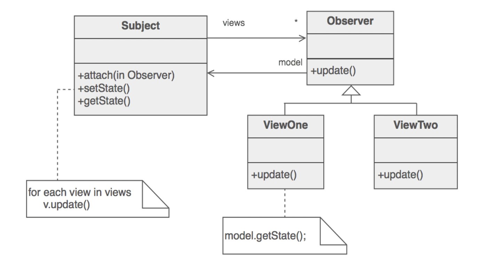
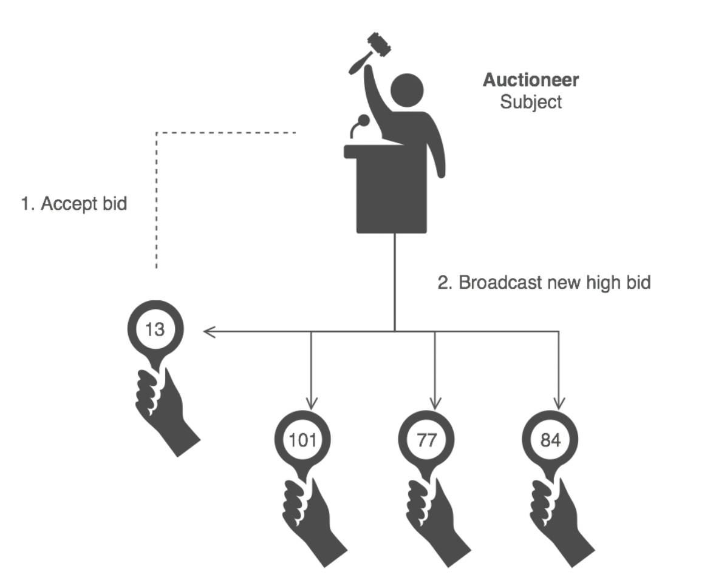

# Intent
- 定义了对象之间的一对多依赖，当一个被依赖的对象的状态变更时，所有的依赖它的对象都会被通知并自动更新
- 将核心（或通用或引擎）组件封装在Subject抽象中，将变量（或可选或用户界面）组件封装在 Observer 层次结构中;
- MVC中的view部分;
# Problem
A large monolithic design does not scale well as new graphing or monitoring requirements are levied
# Discussion
定义个对象，它是数据模型与业务逻辑（Subject）的守护者（keeper），将所有的view的功能委托给一些分散的不同的Observer对象，观察者创建的时候就注册自己到Subject中，任何时候，Subject变化时，它广播給所有的已注册的Observer，它已经变化了；每个观察者查询Subject状态中自己涉及到的状态数据的子集。
这么做，可以动态的配置任意数量、任意类型的view对象；而不是在编译器静态的组装（new 依赖）。
上面的约定描述了一个pull的交互模型，而不是Subject push已经变更的内容到所有的Observers；每个观察者负责从主题中“拉出”其特定的“感兴趣的窗口”。 “推”模型会影响重用，而“拉”模型效率较低。
设计者可以自行决定的问题如下:
- 实现事件压缩，在发生一系列连续更改后仅发送单个更改广播；
- 让单个观察者监视多个主题，并确保主题通知它即将消失时的观察者;
观察者模式主要使用在Smalltalk中的MVC模式中。
# Structure

主题代表核心（或独立或通用或引擎）抽象。 Observer 表示变量（或依赖的或可选的或用户界面）抽象。 Subject 提示 Observer 对象做他们的事情。 每个观察者都可以根据需要回调主题。
# Example
Observer 定义了一对多的关系，这样当一个对象改变状态时，其他对象会自动得到通知和更新。 拍卖行为展示了这种设计模式；每个投标人都拥有一个编号的牌子，这个牌子用于竞标。 拍卖师开始投标后就会观察是否有竞拍人举起桨接受投标；投标被接收后，投标价格的改变就会以新投标的形式向所有投标人广播的。

# check list
- 区分core（independent）功能与optional（dependent）功能，分开;
- 将core（independent）功能建模为subject抽象;
- 将optional（dependent）功能建模为obsever结构;
- Subject只会与Observer基类耦合;
- 客户端配置任意数量与类型的Observer;
- Observer注册自己到Subject中;
- Subject广播事件到所有的已注册的Observer中;
- Subject可以push信息到Observers中，Observers也可以在需要时从哪个Subject中pull信息;
# Rules of thumb
责任链模式、命令模式、中介者模式与观察者模式都解决了如何解耦发送者与接受者的问题，但是各自的权衡取舍是不同的，责任链模式在可能的接受者链上传输发送者请求，命令模式通常使用一个子类描述sender-receiver之间的连接，中介者模式让sender与receiver中间间接的相互引用; 观察者模式定义了一个非常解耦的接口，这个接口可以让receiver在运行时被配置.
中介者模式与观察者模式是相互竞争的模式，他们之间的区别是：Observer模式通过引入observer与subject2种对象来分发通信，而中介者模式将通信封装在对象内部，我们发现，Observer与Subject比Mediator更加可复用.

