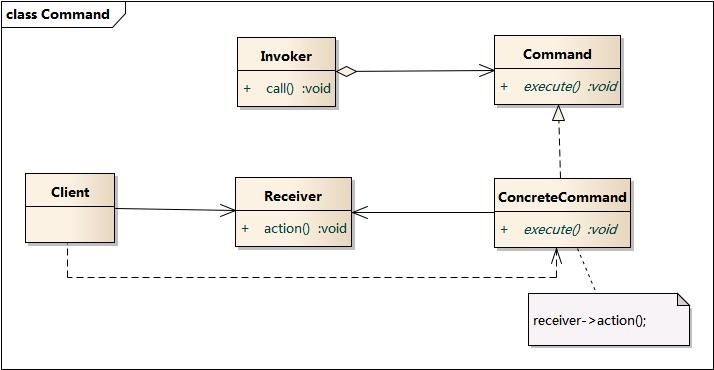
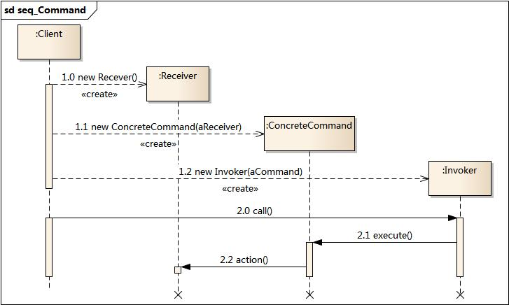

# 模式动机
软件设计中，我们经常需要向某些对象发送请求，但是并不知道请求的接受者是谁，也不知道被请求的操作是哪个，我们只需要在程序运行时指定具体的请求接受者就可，使用命令模式，请求发送者与请求接受者消除彼此之间的耦合，让对象之间的调用关系更加灵活。命令模式可以对发送者与接收者完全解耦，发送者与接收者之间没有直接引用关系，发送请求的对象只需要知道如何发送请求，而不必知道如何完成请求。
# 定义
将一个请求封装为一个对象，从而使我们可用不同的请求对客户进行参数化；对请求排队或者记录请求日志，以及支持可撤销的操作。命令模式是一种对象行为型模式，其别名为动作(Action)模式或事务(Transaction)模式。
# 模式结构
- Command: 抽象命令类;
- ConcreteCommand: 具体命令类;
- Invoker: 调用者;
- Receiver: 接受者;
- Client: 客户类;

# 分析
命令模式的本质是对命令进行封装，将发出命令的责任与执行命令的责任分割开.
- 每一个命令都是一个操作，请求的一方发出请求，接收的一方执行操作;
- 命令模式允许请求的一方与接收的一方独立开来，使得请求的一方不必知道接收请求的一方的接口，更不必知道请求是怎么被接收，以及操作是否被执行、何时被执行，以及是怎么被执行的;
- 命令模式使请求本身成为一个对象，这个对象和其他对象一样可以被存储和传递;
- 命令模式的关键在于引入了抽象命令接口，且发送者针对抽象命令接口编程，只有实现了抽象命令接口的具体命令才能与接收者相关联;
