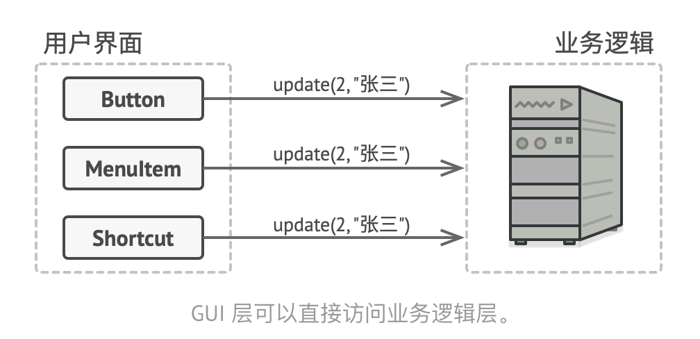
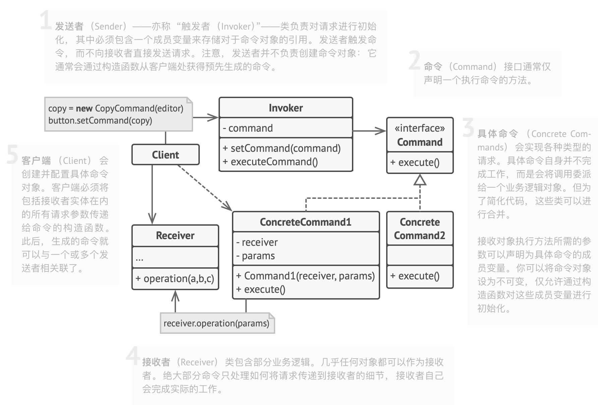
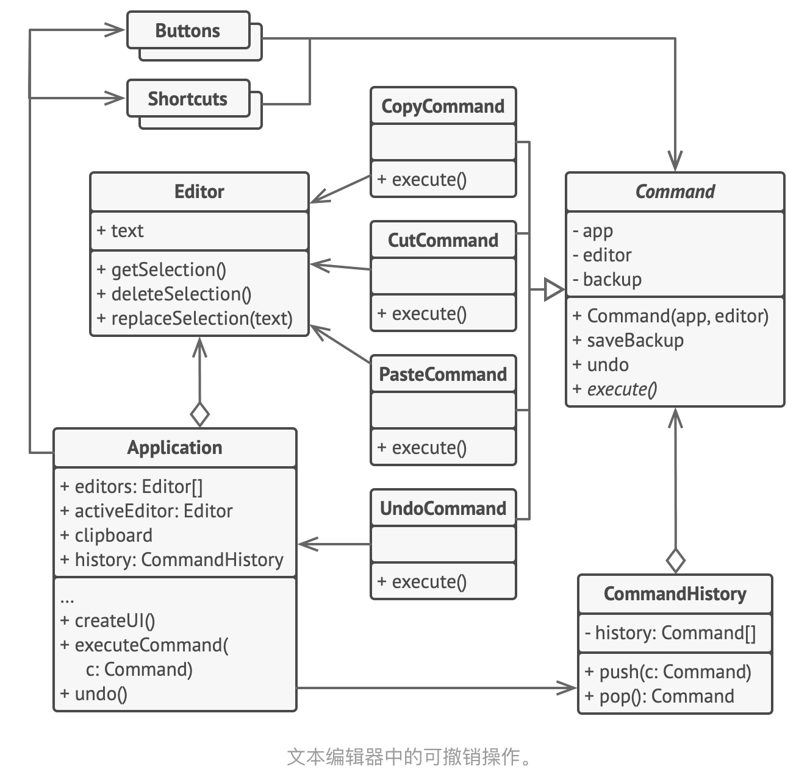

命令模式也叫做动作、事务、Action、Tansaction、Command模式。
# Intent
行为设计模式，可以将请求转换为一个包含请求相关的所有信息的独立对象，可以将请求参数化、延迟请求执行或者将其放入队列中，能实现可以撤销的操作。
# Problem
按钮-多个按钮实现，这样有大量的实现类，修改按钮类，要修改大量的子类，子类的实现有重复，比如复制/粘贴可以通过不同的方式实现，比如菜单、快捷键，右键等。
# 解决方案
优秀的软件设计通常都会将关注点分离，这就回导致软件的分层。比如分为View层与业务逻辑层:

完成内容就是GUI层委派给业务逻辑底层，就是GUI对象传递参数来调用一个业务逻辑对象，这个过程就是一个对象发送请求给另一个对象。命令模式建议GUI对象不直接提交这些请求，将请求的细节(调用的对象、方法名称和参数列表)抽取出来组成命令类，该类中仅包含一个用于触发请求的方法。命令对象负责连接不同的GUI和业务逻辑对象，GUI对象不需要了解业务逻辑对象是否获得了请求，也无须了解其对请求进行处理的方式，GUI对象触发命令即可，命令对象会自行处理所有细节工作.

下一步是让所有命令实现相同的接口。 该接口通常只有一个没有任何参数的执行方法， 让你能在不和具体命令类耦合的情况下使用同一请求发送者执行不同命令。 此外还有额外的好处， 现在你能在运行时切换连接至发送者的命令对象， 以此改变发送者的行为。你可能会注意到遗漏的一块拼图——请求的参数。 GUI 对象可以给业务层对象提供一些参数。 但执行命令方法没有任何参数， 所以我们如何将请求的详情发送给接收者呢？ 答案是： 使用数据对命令进行预先配置， 或者让其能够自行获取数据。
# 命令模式结构

# 伪代码

```java
// 命令基类会为所有具体命令定义通用接口。
abstract class Command is
    protected field app: Application
    protected field editor: Editor
    protected field backup: text

    constructor Command(app: Application, editor: Editor) is
        this.app = app
        this.editor = editor

    // 备份编辑器状态。
    method saveBackup() is
        backup = editor.text

    // 恢复编辑器状态。
    method undo() is
        editor.text = backup

    // 执行方法被声明为抽象以强制所有具体命令提供自己的实现。该方法必须根
    // 据命令是否更改编辑器的状态返回 true 或 false。
    abstract method execute()


// 这里是具体命令。
class CopyCommand extends Command is
    // 复制命令不会被保存到历史记录中，因为它没有改变编辑器的状态。
    method execute() is
        app.clipboard = editor.getSelection()
        return false

class CutCommand extends Command is
    // 剪切命令改变了编辑器的状态，因此它必须被保存到历史记录中。只要方法
    // 返回 true，它就会被保存。
    method execute() is
        saveBackup()
        app.clipboard = editor.getSelection()
        editor.deleteSelection()
        return true

class PasteCommand extends Command is
    method execute() is
        saveBackup()
        editor.replaceSelection(app.clipboard)
        return true

// 撤销操作也是一个命令。
class UndoCommand extends Command is
    method execute() is
        app.undo()
        return false


// 全局命令历史记录就是一个堆桟。
class CommandHistory is
    private field history: array of Command

    // 后进……
    method push(c: Command) is
        // 将命令压入历史记录数组的末尾。

    // ……先出
    method pop():Command is
        // 从历史记录中取出最近的命令。


// 编辑器类包含实际的文本编辑操作。它会担任接收者的角色：最后所有命令都会
// 将执行工作委派给编辑器的方法。
class Editor is
    field text: string

    method getSelection() is
        // 返回选中的文字。

    method deleteSelection() is
        // 删除选中的文字。

    method replaceSelection(text) is
        // 在当前位置插入剪贴板中的内容。

// 应用程序类会设置对象之间的关系。它会担任发送者的角色：当需要完成某些工
// 作时，它会创建并执行一个命令对象。
class Application is
    field clipboard: string
    field editors: array of Editors
    field activeEditor: Editor
    field history: CommandHistory

    // 将命令分派给 UI 对象的代码可能会是这样的。
    method createUI() is
        // ……
        copy = function() { executeCommand(
            new CopyCommand(this, activeEditor)) }
        copyButton.setCommand(copy)
        shortcuts.onKeyPress("Ctrl+C", copy)

        cut = function() { executeCommand(
            new CutCommand(this, activeEditor)) }
        cutButton.setCommand(cut)
        shortcuts.onKeyPress("Ctrl+X", cut)

        paste = function() { executeCommand(
            new PasteCommand(this, activeEditor)) }
        pasteButton.setCommand(paste)
        shortcuts.onKeyPress("Ctrl+V", paste)

        undo = function() { executeCommand(
            new UndoCommand(this, activeEditor)) }
        undoButton.setCommand(undo)
        shortcuts.onKeyPress("Ctrl+Z", undo)

    // 执行一个命令并检查它是否需要被添加到历史记录中。
    method executeCommand(command) is
        if (command.execute)
            history.push(command)

    // 从历史记录中取出最近的命令并运行其 undo（撤销）方法。请注意，你并
    // 不知晓该命令所属的类。但是我们不需要知晓，因为命令自己知道如何撤销
    // 其动作。
    method undo() is
        command = history.pop()
        if (command != null)
            command.undo()
```
# 命令模式适合应用场景
1. 将操作参数化
命令模式可以将特定的方法调用转化为独立对象，可以将命令作为方法的参数传递、保存到其他对象中，运行时切换命令; 例子就是开发GUI组件，希望用户能够配置菜单项，点击菜单时触发操作;
2. 将操作放入队列中，操作的执行或者远程执行操作
命令也可以实现序列化，可以报错或者恢复。可以延迟或计划命令的执行。可以将命令放入队列、记录命令或者通过网络发送命令;
3. 实现操作的回滚
实现撤销与恢复，为了能够回滚操作，你需要实现已执行操作的历史记录功能。命令历史记录是一种包含所有已执行命令对象及其相关程序状态备份的栈结构。这种方法有两个缺点。首先，程序状态的保存功能并不容易实现，因为部分状态可能是私有的。你可以使用备忘录模式来在一定程度上解决这个问题。其次，备份状态可能会占用大量内存。因此，有时你需要借助另一种实现方式:命令无需恢复原始状态，而是执行反向操作。反向操作也有代价:它可能会很难甚至是无法实现。
# 实现方式
- 声明仅有一个执行方法的命令接口;
- 抽取请求使之成为实现命令接口的具体命令类，每个类都有一组成员变量来保存请求参数与实际接收者对象的引用，这些变量都必须要通过构造函数初始化;
- 找到担任发送者职责的类，在这些类中添加保存命令的成员变量，发送者只能通过命令接口与其命令进行交互。 发送者自身通常并不创建命令对象， 而是通过客户端代码获取;
- 修改发送者使其执行命令， 而非直接将请求发送给接收者;
- 客户端必须按照以下顺序来初始化对象:
  - 创建接收者;
  - 创建命令， 如有需要可将其关联至接收者;
  - 创建发送者并将其与特定命令关联;
# 命令模式优缺点
- 单一职责原则，解耦触发和执行操作的类;
- 开闭原则，可以在不修改已有客户端代码的情况下在程序中创建新的命令;
- 可以实现撤销和恢复功能;
- 实现操作的延迟执行;
- 可以讲命令组合成复杂命令;
- 命令可能会变得特别多.
# 与其他模式的关系
- 责任链模式、命令模式、中介者模式和观察者模式用于处理请求发送者和接收者之间的不同连接方式:
  - 责任链模式按照顺序将请求动态传递给一系列的潜在接收者，直至其中一名接收者对请求处理;
  - 命令在发送者和请求者之间建立单向连接;
  - 中介者清除了发送者和请求者之间的直接连接，强制它们通过一个中介对象进行间接沟通;
  - 观察者允许接收者动态地订阅或者取消接收请求;
- 责任链的管理者可使用命令模式实现。在这种情况下，你可以对由请求代表的同一个上下文对象执行许多不同的操作。还有另外一种实现方式， 那就是请求自身就是一个命令对象。 在这种情况下， 你可以对由一系列不同上下文连接而成的链执行相同的操作;
- 你可以同时使用命令和备忘录模式来实现撤销。在这种情况下， 命令用于对目标对象执行各种不同的操作， 备忘录用来保存一条命令执行前该对象的状态;
- 命令模式与策略模式都可以将行为参数化，但是意图是不同的:
  - 你可以使用命令来将任何操作转换为对象。 操作的参数将成为对象的成员变量。 你可以通过转换来延迟操作的执行、 将操作放入队列、 保存历史命令或者向远程服务发送命令等;
  - 另一方面， 策略通常可用于描述完成某件事的不同方式， 让你能够在同一个上下文类中切换算法;
- 原型模式可用于保存命令的历史记录;
- 你可以将访问者模式视为命令模式的加强版本， 其对象可对不同类的多种对象执行操作。

