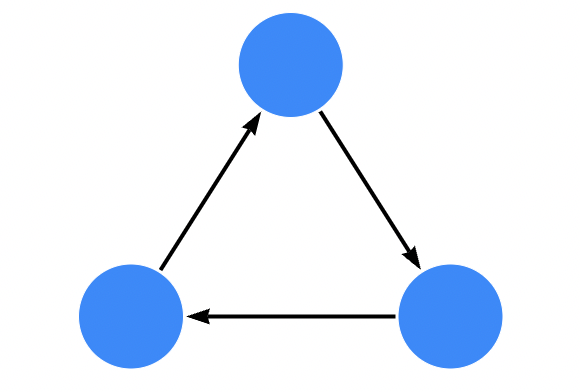
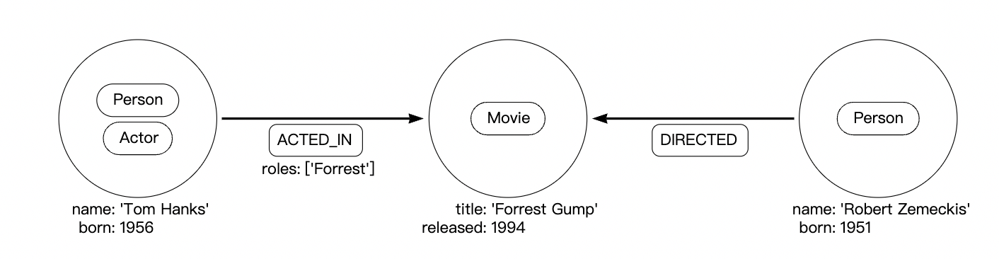
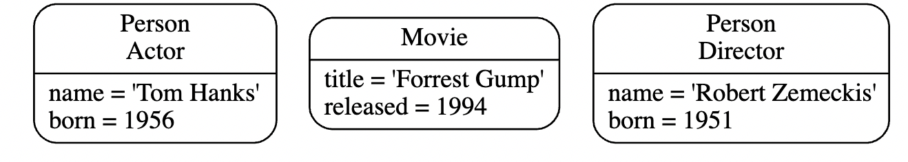
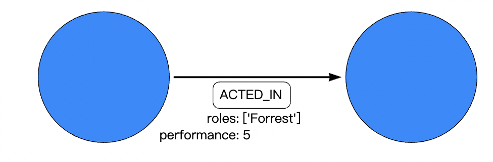
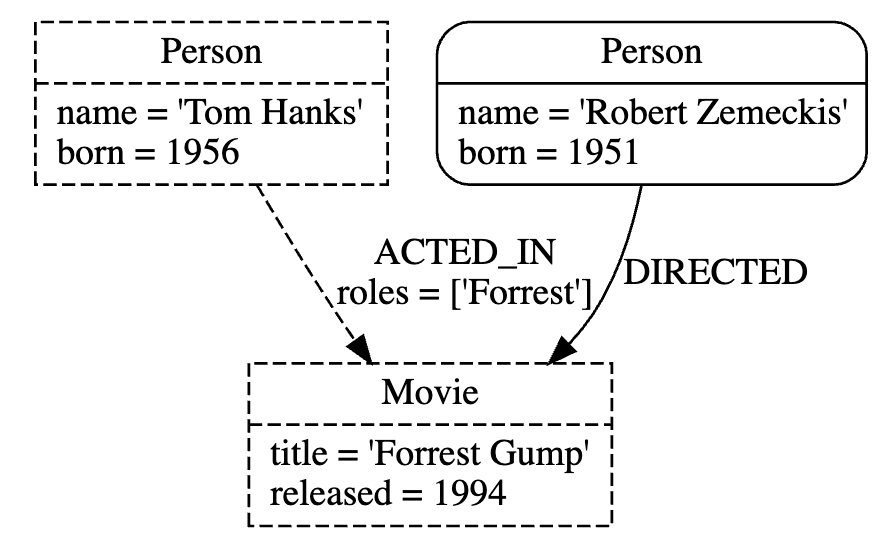
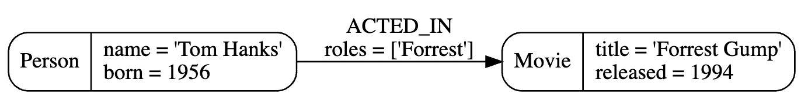
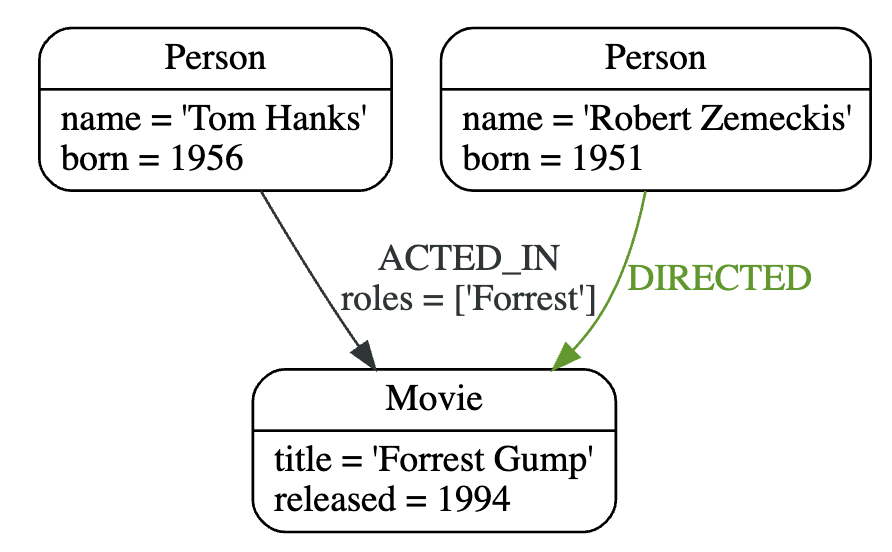
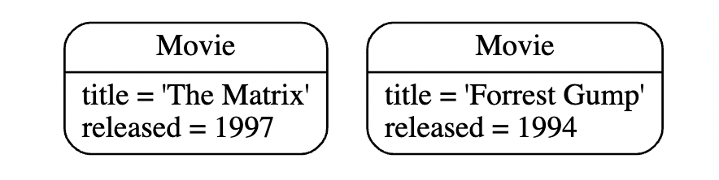
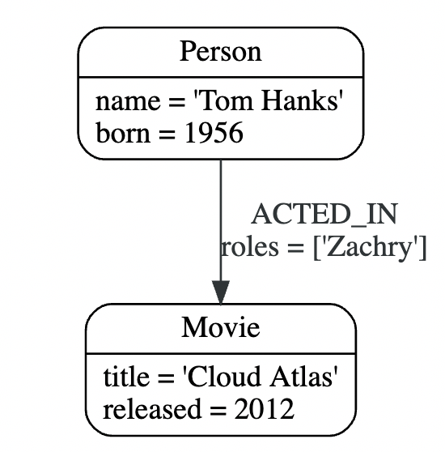
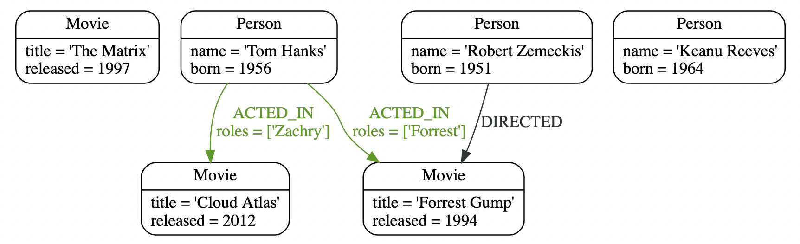

[TOC]
# Neo4j概述
Neo4j是世界上领先的图数据库。图数据库架构是用来更好的管理、存储、检索节点与节点之间关系的。图数据库采用属性图的方式，这对遍历性能和操作运行时都有好处。
# Cypher
cypher是Neo4j的图查询语言，允许用户存储、检索图数据库中的数据，它是一种声明式的、受 SQL 启发的语言，用于使用 ASCII 艺术语法描述图形中的视觉模式。Cypher的语法提供了以视觉和逻辑方式来匹配图中节点和关系的模式的查询方式。 Cypher旨在让每个人都易于学习、理解和使用，而且还融合了其他标准数据访问语言的强大功能。
# 开始
最简单的方式是使用官网的Neo4j Desktop安装。当然，官网也有很多的文档可供参考。
官网的文档地址在[https://neo4j.com/docs/](https://neo4j.com/docs/)
也有Cypher的[操作手册指南](https://neo4j.com/docs/cypher-manual/4.3/#cypher-manual)与[Neo4j的操作指南](https://neo4j.com/docs/operations-manual/4.3/#operations-manual)
# 图数据库的概念
Neo4j使用了属性图数据库模式
图数据结构包含是通过关系关联起来的节点（这些节点都是离散的对象）
下图是图结构的概念，这个图有3个节点与3个关系

Neo4j属性图数据库模型包含的的内容：
- Node，描述了一个领域里面的实体(离散的对象);
- Node的label，Node会有0个或者多个labels，用来定义（分类）它们是哪种实体;
- Relationship，描述了源节点到目的节点的连接;
- Relationship的direction，关系总有一个方向;
- Relationship的type，关系必须要有一个type(只有一个type)，用来定义(分类)关系的类型;
- node与relationship都有属性(key-value对)来详细的描述自己.
在数学中，图论是对图的研究。
在图论中：
节点也称为顶点或点。
关系也称为边、链接或线。
## 例子

使用cypher的create子句创建上述的图数据结构
```cypher
CREATE (:Person:Actor {name: 'Tom Hanks', born: 1956})-[:ACTED_IN {roles: ['Forrest']}]->(:Movie {title: 'Forrest Gump'})<-[:DIRECTED]-(:Person {name: 'Robert Zemeckis', born: 1951})
```
## Node
节点用于表示域的实体（离散对象）。最简单的图是没有关系的单个节点。 考虑下图，由单个节点组成。

node的标签是:
- Person
- Actor
属性是
- name:Tom Hanks
- born:1956
使用Cypher创建node的语句如下：
```cypher
CREATE (:Person:Actor {name: 'Tom Hanks', born: 1956})
```
## Node labels
标签通过将节点分组（分类）到集合中来塑造域，其中具有特定标签的所有节点都属于同一集合。
例如，所有表示用户的节点都可以使用标签User进行标记。 有了它，您就可以让 Neo4j 仅在您的用户节点上执行操作，例如查找具有给定名称的所有用户。
由于可以在运行时添加和删除标签，因此它们还可用于标记节点的临时状态。 Suspended 标签可用于表示暂停的银行账户，Seasonal 标签可表示当前时令的蔬菜。
一个节点可以用0个或者多个标签。
在上面的例子中，节点标签：Person、Actor、Movie用来描述节点，可以添加更多的标签来表达数据的不同的维度。
下面的图展示了多个标签的使用例子

## Relationship
关系描述了源节点和目标节点之间的连接如何相关。 节点可能与自身有关系。
一个关系：
- 连接源节点和目标节点。
- 有一个方向（只能有一个方向）。
- 必须有一个类型（一种类型）来定义（分类）它是什么类型的关系。
- 可以有属性（键值对），进一步描述关系。
关系将节点组织成结构化的数据，使图类似于列表、树、字典或复合实体 — 其中任何一个都可以组合成更复杂、相互关联丰富的结构。

关系的类型：ACTED_IN
属性是：
- roles:['Forrest']
- performance:5
roles属性是一个数组值
使用Cypher创建关系的子句如下：
```cypher
CREATE ()-[:ACTED_IN {roles: ['Forrest'], performance: 5}]->()
```
你必须创建或者引用一个现成的源节点与目的节点，才可以创建关系.
关系总是有方向的，然而，当方向无用的地方是可以被忽略的。这意味着，无需添加一个相反方向上的重复关系，除非需要精确的描述数据模型的情况下。
一个节点可以有对自己的关系，为了表达Tom Hanks 知道自己的关系，可以这么表达

## Relationship Type
一个关系必须有唯一的一个关系类型，在上面的例子是一个ACTED_IN的关系，Tom Hanks节点作为一个源节点，Forrest Gump作为目标节点。

可以观察到，Tom Hanks节点有一个外出的关系，Forrest Gump有一个进入的关系。
## Properties
属性是key-value键值对，用来在节点与关系上存储数据。
属性的值可以是如下2种：
- 可以是不同的几本的数据类型，比如number、string、boolean
- 可以是同一个数据类型的数组，比如strings、numbers、booleans
举例来说
```cypher
CREATE (:Example {a: 1, b: 3.14})
```
- 属性a一个1的integer类型值
- 属性b是一个值为3.14的float类型
```cypher
CREATE (:Example {c: 'This is an example string', d: true, e: false})
```
- 属性c是一个值为'This is an example string'的string类型
- 属性d是一个值为true的boolean类型
- 属性e是一个值为false的boolean类型
```cypher
CREATE (:Example {f: [1, 2, 3], g: [2.71, 3.14], h: ['abc', 'example'], i: [true, true, false]})
```
- 属性f是一个值为[1,2,3]的数组
- 属性g是一个值为[2.71,3.14]的数组
。。。。。
## Traversals and Paths
遍历就是查询整个图的数据，来发现问题的答案，比如：查询出那些你还不知道的你的朋友喜欢的音乐或者是能量断绝后，会影响哪些web服务。
遍历图就是根据一些规则，沿着关系访问节点的过程，在大多数的场景下，只有图的子集会被访问。
按照上面的例子中，为了查找出Tom Hanks出演过哪些电影，遍历会从Tom Hanks这个节点开始，沿着任意的ACTED_IN的关系访问到连接的节点，查询到Forrest Gump的结果结束。

遍历的结果是长度为1。因此只遍历了一个关系就得到结果了。

最短的path就是0，检索的就是自己,没有用到关系。
## Schema
Neo4j里面的架构指的是indexes与constraints；Neo4j通常不需要定义架构模式，如果需要增强性能与更好的定义模型，就可以定义索引与约束
## Indexes
用来提升性能
## Constraints
约束是用来保证数据符合领域的规范定义。
## 命名规则
节点的标签、关系的类型、属性的key都是大小写敏感的。命名规则如下：
|图实体|建议的格式|举例|
|:---|:---|:---|
|label|驼峰，开头字母大写|:VehicleOwner|
|relationship type|大写字母，使用下划线来分割单词|:OWNS_VEHICLE|
|property|驼峰，开头字母小写|firstName|
# Cypher
## Pattern
Neo4j 的属性图由节点和关系组成，其中任何一个都可能具有属性。节点代表实体，例如概念、事件、地点和事物。关系连接成对的节点。

但是，节点和关系可以被视为低级构建块。属性图的真正优势在于它能够使用特定的符号表示连接节点和关系的模式。单个节点或单个关系的模式通常没有携带太多的信息，但节点和关系的组合模式可以表示任意复杂的想法。

Neo4j 的查询语言 Cypher 是基于模式的。具体来说，模式用于匹配所需的图形结构。一旦找到或创建了匹配结构，Neo4j 就可以使用它进行进一步处理。

一个简单的模式，它只有一个关系，连接一对节点（或者，偶尔，一个节点到它自己）。例如，Person LIVES_IN a City 或 City 是 PART_OF a Country。

复杂模式，使用多重关系，可以表达任意复杂的概念并支持各种有趣的用例。例如，我们可能想要匹配 Person LIVES_IN a Country 的实例。以下 Cypher 代码将两个简单的模式组合成一个稍微复杂的模式来执行此匹配：
```cypher
(:Person) -[:LIVES_IN]-> (:City) -[:PART_OF]-> (:Country)
```
由图标或者箭头构成的图常用来做图的可视化，文本标注可以做label与属性等。
### Node syntax
Cypher 使用一对括号来表示一个节点：()。 这让人想起带有圆形端盖的圆形或矩形。 以下是节点的一些示例，提供了不同类型不同细节的定义：
```cypher
()
(matrix)
(:Movie)
(matrix:Movie)
(matrix:Movie {title: 'The Matrix'})
(matrix:Movie {title: 'The Matrix', released: 1997})
```
简单的形式 () 表示匿名、无特征的节点。 如果我们想在别处引用该节点，我们可以添加一个变量，例如：(matrix)。 变量仅限于单个语句。 它在另一个陈述中可能具有不同的含义或没有含义。

:Movie 模式声明了节点的标签。 这允许我们限制模式，防止它匹配（比如）一个在这个位置有一个 Actor 节点的结构。

节点的属性（例如标题）表示为键值对列表，括在一对大括号内，例如：{name: 'Keanu Reeves'}。 属性可用于存储信息和/或限制模式。
### Relationship syntax
Cypher 使用一对破折号 (--) 来表示无向关系。 定向关系的一端有一个箭头（<--、-->）。 括号表达式 ([...]) 可用于添加详细信息。 这可能包括变量、属性和类型信息：
```cypher
-->
-[role]->
-[:ACTED_IN]->
-[role:ACTED_IN]->
-[role:ACTED_IN {roles: ['Neo']}]->
```
356 / 5000
翻译结果
关系的括号对中的语法和语义与节点括号之间使用的语法和语义非常相似。 可以定义一个变量（例如，角色），以便在语句的其他地方使用。 关系的类型（例如：ACTED_IN）类似于节点的标签。 属性（例如，角色）完全等同于节点属性。
### Pattern syntax
组合节点与关系的语法，我们可以表示模式，下面是一个简单的模式
```cypher
(keanu:Person:Actor {name: 'Keanu Reeves'})-[role:ACTED_IN {roles: ['Neo']}]->(matrix:Movie {title: 'The Matrix'})
```
等价于节点标签， :ACTED_IN 模式声明了关系的关系类型。 变量（例如role）可以在语句的其他地方使用来引用关系。

与节点属性一样，关系属性表示为括在一对大括号内的键/值对列表，例如：{roles: ['Neo']}。 在这种情况下，我们为角色使用了一个数组属性，允许指定多个角色。 属性可用于存储信息和/或限制模式。
### Pattern Variables
为了增加模块化并减少重复，Cypher 允许将模式分配给变量。 这允许检查匹配路径，用于其他表达式等。
```cypher
acted_in = (:Person)-[:ACTED_IN]->(:Movie)
```
acted_in 变量将包含两个节点以及找到或创建的每条路径的连接关系。 有许多函数可以访问路径的详细信息，例如：nodes（path）、relationships（path）和length（path）。
Cypher 语句通常有多个子句，每个子句执行一个特定的任务，例如：
在图中创建和匹配模式
过滤、投影、排序或分页结果
撰写部分陈述
通过组合 Cypher 子句，我们可以组合更复杂的语句来表达我们想要知道或创建的内容。
## Pattterns in practice
### Creating data
我们先以创建数据的子句开始；为了添加数据，我们使用前面定义好的模式，模式定义了图结构、标签、属性等内容；最简单的子句是CREATE，它将会直接创建你指定的模式，CREATE创建的命令如下：
```cypher
CREATE (:Movie {title: 'The Matrix', released: 1997})
```
如果我们执行这个语句，Cypher会返回变更的数量、在这个语句下，添加了一个节点、1个label、2个属性
>Created Nodes: 1
Added Labels: 1
Set Properties: 2
Rows: 0

加入一开始数据库是空的，我们现在创建一个数据库，数据库中只有一个节点。如果，我们想要返回刚才创建的数据，使用RETURN子句，它会使用我们刚才给元素指定的变量的方式来返回它。
```cypher
CREATE (p:Person {name: 'Keanu Reeves', born: 1964}) RETURN p
```
返回的数据结构如下：
>Created Nodes: 1
Added Labels: 1
Set Properties: 2
Rows: 1

>+----------------------------------------------+
| p                                            |
+----------------------------------------------+
| (:Person {name: 'Keanu Reeves', born: 1964}) |
+----------------------------------------------+

如果我们想要创建多个记录，我们可以把node或者relationship逗号分隔，或者使用多个CREATE子句；我们当然也可以创建更复杂的结构，比如，一个ACTED_ID关系或者一个DIRECTED关系。
```cypher
CREATE (a:Person {name: 'Tom Hanks', born: 1956})-[r:ACTED_IN {roles: ['Forrest']}]->(m:Movie {title: 'Forrest Gump', released: 1994})
CREATE (d:Person {name: 'Robert Zemeckis', born: 1951})-[:DIRECTED]->(m)
RETURN a, d, r, m
```
更行后的图图下：

大多数的场景下，我们想要创建新的数据，并关联到已经存在的结构体上，这需要我们知道怎么查找已经存在的图
### Matching Patterns
匹配模式是执行MATCH语句的任务，我们输入一些我们需要的模式的种类给MATCH来描述我们想要的数据，它有点类似QBE查询，MATCH语句会搜索我们指定的模式，返回匹配成功的一行的数据。
为了查找我们已经创建的数据，我们搜索所有标签是Movie的节点，命令
```cypher
MATCH (m:Movie)
RETURN m
```
以下是结果

搜索标签+属性
```cypher
MATCH (p:Person {name: 'Keanu Reeves'})
RETURN p
```
记住，我们只需要提供需要查询的信息给MATCH就可以了，不是所有的属性都需要，在大多数的场景下，我们有一些类似于key的属性：SSN、ISBN、email、logins、地理位置或者产品码。
我们也可以查询关系，比如下面是查询Tom Hanks演过的电影中的角色。
```cypher
MATCH (p:Person {name: 'Tom Hanks'})-[r:ACTED_IN]->(m:Movie)
RETURN m.title, r.roles
```
在这个场景下，我们只返回了节点的属性与我们感兴趣的关系，你可以通过点号分隔符的方法来访问。现在可以混合使用MATCH与CREATE的方法为已有的图添加结构
### 添加新的结构
为了给已经存在的图添加结构，我们首先通过match查出已经存在的连接点，然后，创建新的节点，并使用关系关联新的节点，Tom Hanks添加一个新的电影的实现方式如下：
```cypher
MATCH (p:Person {name: 'Tom Hanks'})
CREATE (m:Movie {title: 'Cloud Atlas', released: 2012})
CREATE (p)-[r:ACTED_IN {roles: ['Zachry']}]->(m)
RETURN p, r, m
```

特别需要记住：我们可以给node，relationship分配变量，并在后面使用它，不论在CREATE还是MATCH中都是可以的。
使用一个CREATE子句同时创建节点与关系也是可以的，为了可读性，我们上面使用了2个CREATE子句。
MATCH 和 CREATE 组合的一个棘手方面是我们每个匹配的模式都得到一行。 这会导致后续的 CREATE 语句对每一行都会执行一次。 在许多情况下，这正是您想要的。 如果这不是你想要的，请将 CREATE 语句移动到 MATCH 之前，或者使用稍后讨论的方法更改查询的返回的条数，或者使用带有 如果存在get 不存在就create 语义的MERGE方法。
### Completing patterns
不论什么时候，当我们想要从外部系统中获取数据，或者不确定图中是否存在某条数据时，我们想要执行一种可重复（幂等）的更新操作，在Cypher来说，MERGE就有这个功能，它是CREATE与MATCH的组合语义，在创建前检查数据是否已经存在，使用MERGE，数据要么已存在，要么被创建，通常来说，使用MATCH，你一般只会通过关键的属性来查找模式，MERGE 允许您提供要在创建时设置的其他属性。如果我们不知道我们的图形是否已经包含 Cloud Atlas，我们可以多次使用MERGE。
```cypher
MERGE (m:Movie {title: 'Cloud Atlas'})
ON CREATE SET m.released = 2012
RETURN m
```
返回的结果如下：
>Created Nodes: 1
Added Labels: 1
Set Properties: 2
Rows: 1

>+-------------------------------------------------+
| m                                               |
+-------------------------------------------------+
| (:Movie {title: 'Cloud Atlas', released: 2012}) |
+-------------------------------------------------+

我们在任何两种情况下都会得到结果：图表中已经存在的数据（可能不止一行）或单个新创建的 Movie 节点。
没有任何先前分配的变量的 MERGE 子句匹配完整模式或创建完整模式。 它永远不会在模式中产生匹配和创建的部分混合。 要实现部分匹配/创建，请确保对不应受到影响的部分使用已定义的变量。
因此，最重要的是 MERGE 确保您不能创建重复的信息或结构，但它需要首先检查现有匹配项的成本。 特别是在大型图上，扫描大量标记节点以获得特定属性的成本可能很高。 您可以通过创建支持索引或约束来缓解其中的一些问题，我们将在稍后讨论。 但它仍然不是免费的，所以当你确定不创建重复数据时，使用 CREATE over MERGE。
```cypher
MATCH (m:Movie {title: 'Cloud Atlas'})
MATCH (p:Person {name: 'Tom Hanks'})
MERGE (p)-[r:ACTED_IN]->(m)
ON CREATE SET r.roles =['Zachry']
RETURN p, r, m
```
如果关系的方向是任意的，您可以省略箭头。 MERGE 然后将检查任一方向的关系，如果未找到匹配关系，则创建新的有向关系。如果您选择只传入前一个子句中的一个节点，MERGE 提供了一个有趣的功能。 然后它只会在给定模式的提供节点的直接邻域内匹配，如果没有找到，则创建它。 这对于创建例如树结构非常方便。
```cypher
CREATE (y:Year {year: 2014})
MERGE (y)<-[:IN_YEAR]-(m10:Month {month: 10})
MERGE (y)<-[:IN_YEAR]-(m11:Month {month: 11})
RETURN y, m10, m11
```
## getting the correct results
### 案例数据
首先，我们创建一些案例数据
```cypher
CREATE (matrix:Movie {title: 'The Matrix', released: 1997})
CREATE (cloudAtlas:Movie {title: 'Cloud Atlas', released: 2012})
CREATE (forrestGump:Movie {title: 'Forrest Gump', released: 1994})
CREATE (keanu:Person {name: 'Keanu Reeves', born: 1964})
CREATE (robert:Person {name: 'Robert Zemeckis', born: 1951})
CREATE (tom:Person {name: 'Tom Hanks', born: 1956})
CREATE (tom)-[:ACTED_IN {roles: ['Forrest']}]->(forrestGump)
CREATE (tom)-[:ACTED_IN {roles: ['Zachry']}]->(cloudAtlas)
CREATE (robert)-[:DIRECTED]->(forrestGump)
```


### 过滤结果
过滤数据返回MACTCH结果的子集，这些条件是使用WHERE子句表达的，这个子句可以使用任意数量的布尔表达式，谓词表达式，与逻辑运算符AND、OR、XOR、NOT
最简单的谓词表达式就是比较或者相等
```cypher
MATCH (m:Movie)
WHERE m.title = 'The Matrix'
RETURN m
```
>Rows: 1

>+------------------------------------------------+
| m                                              |
+------------------------------------------------+
| (:Movie {title: 'The Matrix', released: 1997}) |
+------------------------------------------------+

上面的查询语句等价于下面的模式匹配
```cypher
MATCH (m:Movie {title: 'The Matrix'})
RETURN m
```
另外，还可以使用数字比较，正则表达式匹配，是否在集合中存在等；
下面例子中的where子句包含一个正则表达式匹配，>比较，集合中是否已存在元素
```cypher
MATCH (p:Person)-[r:ACTED_IN]->(m:Movie)
WHERE p.name =~ 'K.+' OR m.released > 2000 OR 'Neo' IN r.roles
RETURN p, r, m
```
>Rows: 1

>+-------------------------------------------------------------------------------------------------------------------------------+
| p                                         | r                               | m                                               |
+-------------------------------------------------------------------------------------------------------------------------------+
| (:Person {name: 'Tom Hanks', born: 1956}) | [:ACTED_IN {roles: ['Zachry']}] | (:Movie {title: 'Cloud Atlas', released: 2012}) |
+-------------------------------------------------------------------------------------------------------------------------------+
模式可以使用谓词，模式谓词可以限制结果集的数量，相当于filer，只允许满足特定模式的数据通过，如下：
```cypher
MATCH (p:Person)-[:ACTED_IN]->(m)
WHERE NOT (p)-[:DIRECTED]->()
RETURN p, m
```
>Rows: 2

>+----------------------------------------------------------------------------------------------+
| p                                         | m                                                |
+----------------------------------------------------------------------------------------------+
| (:Person {name: 'Tom Hanks', born: 1956}) | (:Movie {title: 'Cloud Atlas', released: 2012})  |
| (:Person {name: 'Tom Hanks', born: 1956}) | (:Movie {title: 'Forrest Gump', released: 1994}) |
+----------------------------------------------------------------------------------------------+

### Returning results
