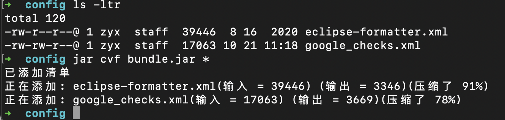

# 基础信息
为了了解大部分的JDK工具，你需要先知道一些比较重要的基础信息。
## JDK与JRE文件夹结构
本节讲解JDK的目录与文件结构，JRE的结构与JDK目录中的jre目录一致，目录结构包含下面的主题：
- 样例（Demos and Samples）
- 开发文件与目录（Development Files and Directories）
- 额外的目录文件结构（Additional Files and Directories）
### 样例
样例代码是展示如何进行Java编程的，可以在[
http://www.oracle.com/technetwork/java/javase/downloads/index.html](
http://www.oracle.com/technetwork/java/javase/downloads/index.html)中下载到。
### 开发文件与目录
这部分讲解了大部分涉及到开发的目录与文件，还有一些包含了Java的源码与C的头文件。
jdk1.8.0
    --bin
        --java*
        --javac*
        --javap*
        --javah*
        --javadoc*
    --lib
        --tools.jar
        --dt.jar
    --jre
        --bin
            --java*
        --lib
            --applet
            --ext
                --jfxrt.jar
                --localdata.jar
            --fonts
            --security
            --sparc
                --server
                --client
            --rt.jar
            --charsets.jar
假设JDK软件安装在/jdk1.8.0目录下，下面是一些比较重要的目录
- /jdk1.8.0 JDK软件安装的跟目录，包含版权、证书与README文件、src.zip等；
- /jdk1.8.0/bin JDK包含的所有的可执行开发工具，PATH里面需要有这个目录；
- /jdk1.8.0/lib 开发工具使用到的文件，包含tools.jar，里面是一些JDK工具使用到的非核心类，也包括dt.jar，里面是一些设计的归档文件，用于通知交互开发环境，如何展示Java组件你的信息。
- /jdk1.8.0/jre JDK工具使用的JRE环境的跟目录，运行时环境是java平台的实现，也是java.home系统属性的值；
- /jdk1.8.0/jre/bin 与/jdk1.8.0/bin目录的内容基本一样，java启动器工具也就是应用启动器，这个目录不需要出现在PATH中；
- /jdk1.8.0/jre/lib JRE环境使用到的代码库、属性设置、与资源文件，比如：rt.jar包含启动类与Java平台核心API组成的类，charsets.jar包含字符转换类；
- /jdk1.8.0/jre/lib/ext java平台扩展类的安装路径，这个目录包括jfxrt.jar 包含JacaFX运行时库，与localedata.jar 包含java.text与java.util包的区域语言数据；
- /jdk1.8.0/jre/lib/security 包含用于安全管理的文件，包括安全策略java.policy与安全属性java.security文件；
- /jdk1.8.0/jre/lib//sparc 由JDK使用的.so文件；
- /jdk1.8.0/jre/lib/sparc/client 包含Java Hotspot虚拟机使用的.so文件；
- /jdk1.8.0/jre/lib/sparc/server 包含Java HotSpot虚拟机服务其使用的.so文件；
- /jdk1.8.0/jre/lib/applet Java归档文件，包含applet应用使用的支持类；
- /jdk1.8.0/jre/lib/fonts 包含平台使用的字体
### 额外的文件与目录
- /jdk1.8.0/src.zip 包含源代码的归档文件
- /jdk1.8.0/db 包含Java DB
- /jdk1.8.0/include C-语言头文件；
- /jdk1.8.0/man 包含JDK工具的用户手册

## 设置类路径
类路径是一种特殊的路径，JRE会在这些路径中搜索类与其他的资源文件；
本小节含有以下的主题：
- 概要
- 描述
- JDK命令使用的类路径选项
- CLASSPATH环境变量
- 类路径通配符
- 类路径与包的名字的关系
### 基础概念（概要）
类与资源的搜索路径可以通过-classpath选项或者CLASSPATH环境变量的方式指定，-classpath命令行选项的方式的优先级更高，因为它可以对一个应用独立设置，不影响其他应用的类搜索路径。
sdkTool -classpath classpath1:classpath2…
setenv CLASSPATH classpath1:classpath2…
- skdTool 是命令行工具，比如java、javac、javadoc或者apt，工具列表[
http://docs.oracle.com/javase/8/docs/technotes/tools/index.html](http://docs.oracle.com/javase/8/docs/technotes/tools/index.html)
- classpath1:classpath2 jar、zip、或者class文件所在的路径，每个类路径都应该以一个文件名或者目录结尾，这依赖你的设置:
	- 对于包含class文件的JAR或者zip文件来说，类路径以文件名结尾；
	- 对于没有在包下面的class文件来说，类路径就是class文件所在的目录；
	- 对于在包下面的class文件来说，类路径是根包所在的目录；

多个类路径在windows平台上通过分号分割，在其他平台上通过冒号分隔，缺省的类路径是当前目录，如果设置了CLASSPATH环境变量或者-classpath命令行选项其中之一，都会覆盖默认的设置，所以，如果你想要在类路径中包含当前的目录，必须在类路径加上点号；不符合规则的类路径会被忽略（不是目录、不是归档文件、不是*通配符）
### 描述
JDK命令行工具与应用程序通过类路径查找Java平台或者扩展机制之外的第三方的类或者用户自定义的类，扩展机制在这里：[http://docs.oracle.com/javase/8/docs/technotes/guides/extensions/index.html](
http://docs.oracle.com/javase/8/docs/technotes/guides/extensions/index.html)
类路径中必须能够查找到你通过javac编译的class文件，缺省是当前的目录，可以方便的发现这些class。
JDK、JVM或者JDK的命令行工具通过搜索Java平台启动类路径、扩展类路径与classpath路径的顺序来查找类，关于详细的搜索策略，可以看下，关于类是如何找的的文档[http://docs.oracle.com/javase/8/docs/technotes/tools/findingclasses.html](http://docs.oracle.com/javase/8/docs/technotes/tools/findingclasses.html)大多数应用的基础类库都是使用扩展机制加载的，当你想要加载的一个类不在当前的目录/子目录也不在Java平台的扩展类加载路径时，你才需要设置类路径。
如果你更新了JDK的版本，你的启动设置中可能包含不在需要的CLASSPATH设置，你应该移除任何全局应用设置，比如classes.zip，一些使用JVM的第三方应用可能会更改你的CLASSPATH环境变量，如果不清除他们，他们就会遗留下来。
可以通过命令行选项-classpath或者-cp指定类路径，并且比如环境变量的方式优先级更高。
Class文件可以存到目录下或者归档文件中，java平台基础类存储在rt.jar文件中，关于归档文件的详细信息以及类搜索路径是如何工作的，可以看看类搜索路径与包名字的小节。
注意：
一些早期的JDK版本的缺省类搜索路径包含\<jdk-dir>/classes目录，这个目录中的类只是JDK软件使用的，而不是应用使用的；应用类应该放到JDK目录之外的其他目录中，这样，更新JDK时，不会把应用类class删掉而重新安装，为了兼容以前的JDK版本。
### JDK命令使用的类路径选项
大多数JDK命令都支持-classpath选项，用来覆盖默认的类路径与环境变量设置的类路径，比如java、jdb、javac、javah、jdeps等；
### CLASSPATH环境变量
设置环境变量：
> CLASSPATH = path1:path2:...
export CLASSPATH

清除这个设置：
>unset CLASSPATH
检查系统启动时，是否有设置CLASSPATH环境变量
### 路径通配符
类路径可以包含通配符*，通常与包含多个相同模式的jar文件的形式等价，比如/*就是指的包含目录下所有的jar文件，以.号开头的文件名会被隐藏；*号的类路径实体并不会包含class文件，如果想要包含class文件，需要常规的方式指定class文件所在的目录；*模式也不支持递归的搜索子目录，*模式搜索jar的顺序是随机的，没有固定的顺序，不同的平台不一样，同样的机器，不同的时间可能也是不同的，一个构建良好的应用也不应该依赖类搜索的特定顺序；现在JDK已经对*的模式做了进一步的处理，在程序的main方法调用前，在类加载的过程中，对于每个包含通配符的类路径实体，JDK都会替换成目录下j全部ar文件的类路径实体，CLASSPATH与-classpath对待通配的处理都是一样的，但是通配符在jar的清单文件头设置的classpath中是不生效的。
### 类搜索路径与包名
Java的class文件是通过包的形式组织的，而包对应的是文件系统中的目录；但是与文件系统不同的是，当你使用一个包名字的时候，你必须使用的是包的绝对路径名字而不能使用相对路径名字，比如java.awt.Button类的包就会死java.awt而不是awt；现在举个例子，假如你想要JRE在包utility.myapp中查找类Cool.class，并且包的路径是/java/MyClasses/utility/myapp，那么你需要设置类路径包含实体/java/MyClasses，运行java程序的方式如下：
> java -classpath /java/MyClasses utility.myapp.Cool

当程序执行时，任何Cool类使用到的utility.myapp包的类，都会因为设置了类路径而被找到。命令行上需要指定完整的包名，即使是类搜索路径+包名能够定位到类的地址，但是如果不是完整的类名的话，也是查找不到类的。你可能想知道一个类的包名定义在哪里？答案就是包名是类名的一部分，并且不能修改，除非重新编译类；一个包机制的有趣的结果就是同样的包的内容可以分散存在不同的目录中，只要目录在类路径设置中，每个类的包名是相同的，但是在文件系统中，每个类的路径是不同的。当类存储在一个文件夹内时，比如/java/MyClasses/utility/myapp，类路径是包含根包的目录，当类存储在一个归档文件中时（比如zip或者jar），类路径是包含zip/jar文件的路径，比如：
> java -classpath /java/MyClasses/myclasses.jar utility.myapp.Cool

多个类路径实体通过冒号分隔，类路径实体的顺序是很重要的，Java搜索类时就是按照在类搜索路径中设置的顺序搜索。
## JDK是如何找到类的
### Java启动器如何找到类
Java启动器命令java，用于初始化一个JVM进程，JVM进程按照下面的顺序搜索与加载类：
- 引导类：最重要的一些类，用于构成Java平台的的类，包括：rt.jar与其他的几个jar文件中的类；
- 扩展类：扩展机制的类，通常是放在扩展目录中的jar文件中的类；
- 用户编写的类：由开发者与其他第三方库定义的类，并且没有使用到JDK的扩展机制来加载，通过-classpath或者环境变量来指定这些类搜索的位置；
事实上，上面的3中类搜索路径都会形成一个单一的类搜索路径，就像前面使用到的那样，但是也有一些比较重要的区别：
- 隐藏或者覆盖引导类基本不可能；
- 通常来说，你只需要定义用户类的类路径就可以了，引导类与扩展类都会自动去固定的目录下加载；
- 工具类目前放到了tools.jar这个归档文件中，只有在你类路径中设置了它，才能使用这包下的类；
#### Java启动器如何找到引导类
引导类是构成了java平台的基础类，引导类主要在rt.jar归档文件还有在jre/lib目录下的几个jar包中，这些归档文件路径设置在引导类搜索路径中，引导类搜索路径是通过一个叫做sun.boot.class.path的系统属性设置的，这个系统属性只能读取使用，不能直接修改；任何情况下，你都不太可能需要修改引导类类路径设置，如果真的有必要使用不同的引导类路径设置，可以使用-Xbootclasspath命令好选项；需要注意的是：Java 2SDK工具类归档文件并没在引导类路径中，位置在/lib/tools.jar；当使用这些工具时，会自动把这个归档文件路径添加到用户类搜索路径中，这个扩张的用户类搜索路径只是在工具命令使用时起作用，处理源代码的工具命令，比如javac于javadoc等，还是使用的未扩张时的类搜索路径。
#### Java启动器如何找到扩展类
扩展类是用来扩充Java平台的能力，在jre/lib/ext目录下的归档文件都是扩展类，会使用扩展类加载器加载，这个目录是不能更改的，并且扩展类只能在这个目录下的归档文件中，单独的class文件不会被加载。
#### Java启动器如何找到用户类
用户类是基于Java平台基础创建的更高层的类，为了发现用户类，启动器根据设置的用户类搜索路径来查找，用户类搜索路径通常是一个列表，每一项是一个普通的目录或者归档文件的路径，class的全限定名的形式反映了类文件所在的子目录，用户类搜索路径是一个字符串，在Unix平台下用冒号来分隔每个路径，windows平台下使用分号分隔；java启动器把用户类搜索路径赋给java.class.path系统属性，用户类搜索路径由以下几种路径构成：
- 默认值是“.”用户类文件在当前目录下；
- CLASSPATH环境变量，会覆盖默认值；
- -cp命令行选项，会覆盖默认值于CLASSPAH环境变量；
- 通过-jar选项指定的JAR归档文件，会覆盖以上的所有值，如果制定了这个选项，则类必须全部来自指定的jar文件；
#### Java启动器如何在JAR归档路径中查找类
一个jar文件通常都会包含一个manifest(清单)文件，这个文件中列出了了JAR包中含有的内容，这个清单文件可以定义一个JAR归档文件路径，当加载JAR文件的中的类时，会深度的扩展类搜索路径，通过JAR归档文件访问的类的查找顺序如下：
- 通常来说，JAR类路径中的类在JAR文件中，JAR类路径中的出现的JAR文件，在JAR类路径前面路径搜索完成后搜索，在JAR类路径后面的路径搜索前搜索；
- 如果JAR类路径中出现了前面已经搜索过的JAR文件，JAR文件不会被再次搜索，这样的优化提升了搜索的效率避免形成搜索环。
- 如果一个JAR文件被作为拓展类安装，那么mandifest中的任何的JAR类路径都会被忽略，他需要的所有类都必须是SDK的一部分，或者也是拓展类的一部分。
#### javac与javadoc如何查找类
javac与javadoc工具使用类文件的2中方式
- 就像普通的Java应用内一样，javac与javadoc必须载入自身的类来运行；
- 处理源代码文件，javac与javadoc必须获取源代码中使用的类的相关的信息；
用来解析类文件的class通常也是javac与javadoc使用的类文件，但是还是有一些重要的不同：
- javac与javadoc，这里讲的啥，没看明白
#### 类加载与安全策略
为了使用类，一个类或者接口必须被一个类加载器加载，每种类加载器都有与之关联的安全策略，一个程序可以通过类加载器的loadClass方法来加载类与接口，通常来说，一个程序加载类或者接口，只需要简单的引用它就可以，这样的写法会调用一个内置的类加载器，对扩展类或者用户类会执行一个特定的安全策略，如果没有开启安全策略，那么所有的类都是被信任的，开启安全策略后，引导类默认都是被信任的，并不会被安全策略处理；开启安全策略后，安全策略是通过系统与用户策略文件配置的。
# 基础工具
## appletviewer，这个后面在看
## extcheck
检测目标JAR与当前已安装的扩展JAR文件的版本冲突。
### 语法
- extcheck [options] targetfile.jar
- options 命令行选项；
- targetfile.jar，用于检测与扩展JAR文件版本冲突的目标JAR文件。
### 描述
extcheck命令检测指定的jar文件的标题与版本，在Java SE SDK的扩展目录中寻找类似的的JAR文件，在安装一个扩展JAR时，你可以使用这个工具检测是否这个扩展已经被安装过了；
extcheck命令主要是对对比jar文件中的清单中包含的标题与版本头信息。
### 命令行选项
- -verbose，列出被检测的扩展JAR文件，另外，目标JAR文件的清单属性与任何冲突的JAR文件都会1⃣️报告的形式打印出来；
- -Joption 传递给JVM的命令行选项。
## jar
操作JAR文件的命令
### 语法
- 创建JAR文件：jar c[efmMnv0] [entrypoint] [jarfile] [manifest] [-C dir] file ... [-Joption...] [@arg-file];
- 更新JAR文件：jar c[efmMnv0] [entrypoint] [jarfile] [manifest] [-C dir] file ... [-Joption...] [@arg-file];
- 提取JAR文件：jar x[vf] [jarfile] file... [-Joption...] [@arg-file...];
- 列出JAR文件的内容：jar t[vf] [jarfile] file... [-Joption...] [@arg-file...];
- JAR文件添加索引：jar i jarfile [-Joption...] [@arg-file...]
### 描述
jar是一个多用途的归档与压测工具，基于ZIP压缩算法与ZLIB压缩格式；大对数情况情况下，jar命令都用来打包很多java代码为一个归档文件，java应用中组件比如文件、图片或者声音文件等，都可以被打包到一个归档文件中，你可以通过一个HTTP客户端下载这个归档文件，不需要单独下载每个文件，这节省了下载时间，同时，因为JAR也压缩了文件的大小，也会节省下载的时间，jar命令也可以通过在文件中放置一个被作者签名的实体，这样，可以认证jar的来源是否是正确，JAR可以被作为类搜索路径，不论是不是压缩的。jar命令的语法类似tar命令，有几种操作模式，由一个强制的操作模式参数定义，其他参数或者是控制操作行为的命令行选项或者操作目标。
### 操作参数
当使用jar命令时，你必须通过操作参数指定要执行的操作，你可以使用混合指定，通常，操作参数是第一个要指定的参数。
- c, 创建一个新的JAR归档文件；
- i, 生成JAR归档文件的索引信息;
- t, 列出JAR归档文件中的内容;
- u, 更新一个JAR归档文件;
- x, 从JAR归档文件中提取文件。
### 命令行选项
使用下面的选项定制JAR文件如何创建、更新、提取与查看。
- e, 设置一个Java应用的入口点类，这个选项会创建或者更新清单文件中的Main-Class属性，在创建(c)或者更新(u)JAR文件中可用；比如，下面的命令创建了一个Ji奥做Main.jar的归档文件，Main.jar中包含Main.class文件，并且清单文件中的Main-Class属性被设置为Main。
>jar cfe Main.jar Main Main.class

java运行时环境（JRE）可以直接运行这个应用
>java -jar Main.jar

如果入口类在一个包中，然后，可以用点号与斜线作为分隔符来分隔包的名字，比如，如果Main.class在一个叫做mydir的包下，然后入口可以使用下面的2种形式之一指定：
>jar -cfe Main.jar mydir/Main mydir/Main.class
>jar -cfe Main.jar mydir/Main mydir/Main/class

注意：同时指定m与e选项时，如果清单文件已经包含了Main-Class属性，这会导致Main-class指定的混乱，这种混乱会导致错误，整个命令运行终止。

- f 设置生成的Jar文件的名字，通过jarfile标识符指定，如果没有f选项，jarfile名字来自于stdin，或者把jar文件的内容输出到stdout；
- m 从标识符manifest文件中取出名字/值对包含到jar文件的清单内，位置在归档文件中的META-INF/MANIFEST.MF文件内，jar命令把键值对田间到文件清单中，除非键值对已经在文件清单中存在，在这种情况下，jar命令更新属性的值，m选项可以用在c/u归档文件时；你可以添加特定目的的键值对属性到清单文件中，清单文件只缺省保留通用的属性。
- M 禁止创建清单文件，或者删除已经存在的清单文件；
- n 当创建JAR文件时，这个选项对归档文件执行归一化操作，以便，让内容不受命令pack200的打包与解包影响，没有这个归一化操作，签名的JAR是无效的；
- v 生成冗余的运行信息到标准输出；
- 0 不使用ZIP压缩算法创建/更新JAR文件。
- -C dir 当创建或者更新JAR文件时，这个选项会指定jar命令临时切换目录到指定的目录下，然后处理file标识符指定的文件，这个操作有点类似于tar命令的-C选项，比如，下面的命令切换到classes目录，并且添加Bar.class文件到my.jar中：
>jar uf my.jar -C classes Bar.class

下面的命令切换到classes目录中，并且把目录中的全部内容都添加到my.jar中，然后切换回原目录，在切换到bin目录添加Xyz.class文件
>jar uf my.jar -C classes . -C bin Zyx.class

如果classes目录中包含bar1文件与bar2文件，JAR文件最终会包含下面的内容
>% jar tf my.jar
META-INF/
META_INF/MANIFEST.MF
bar1
bar2
Xyz.class
- -Joption 设置JRE运行JAR文件使用的JVM选项，JVM选项在java命令参考页内， 比如，-J-Xms48m设置初始内存是48m；
### 操作数
jar命令可以识别下面的操作数
- file，当创建或者更新一个JAR文件时，*file*操作数是应该被加到归档文件内的文件路径或者目录路径，当解压缩或者列出归档文件的内容时，*file*操作数则是归档文件的路径，必须指定一个有效的文件或者目录路径，使用空格隔开多个多个文件或者目录，如果指定了*entrypoint*，*jarfile*，*manifest*参数时，*file*操作数必须在他们之后指定；
- entrypoint，当创建或者更新一个JAR文件时，*entrypoint*操作数用于指定一个可执行的JAR文件的入口类，如果指定了e选项，则必须指定*entrypoint*
- jarfile，指定一个文件路径，这个文件就是要被创建、更新、提取、查看的jar文件路径地址，当出现了f选项时，必须指定*jarfile*选项，如果没有指定f选项与*jarfile*那么jar命令会总从stdin读取jar文件名字（提取或者查看），或者输出jar文件内容到stdout（创建或者更新）；
- manifest，当创建或者更新一个JAR文件时，*manifest*操作数指定一个早已存在的mainfest文件路径，mainfest文件中的内容会出现在MANIFEST.MF中；
- @arg-file，为了缩短与简化jar命令，你可以把参数与选项写到文件里面，使用@file方式导入文件内容为参数列表，文件内的内容可以是所有的jar命令的命令行选项与参数，除了-J类参数以外，因为这些参数是被传输到JVM启动器的，不支持参数文件，文件中参数可以通过空格或者换行符隔开，文件路径是jar命令运行的时的目录的相对路径。
### 例子

## java
用于启动一个java程序
### 语法
java [options] classname [args]
java [options] -jar filename [args]
- options，空格分开的命令行选项
- classname，启动的class名字
- filename，jar文件名字；
- args 通过空格分割的传给main()方法的参数；
### 描述
java命令用于启动java应用，它是通过启动一个JRE来启动java应用的，启动JRE后，加载特定的的入口类，然后调用类中的main()方法，这个方法必须是public与static的，并且不能有返回值，必须有一个String数组作为方法的参数，方法的生命如下：
`public static void main(String[] args)`
java命令可以用来启动一个JavaFX应用，JavaFX应用入口累除了有main方法外，也可以通过继承`javafx.application.Application`实现，在后面的场景中，启动器会构造一个Application类的实例，调用它的init()方法，然后调用start(javafx.stage.Stage)方法；缺省情况下，第一个不是java命令行选项的内容是入口类的限定名或者jar文件的路径；JRE在3类地址中寻找基础环境需要的启动（基础）类或者其他应用程序甬道哦的类：
- 启动类classpath；
- 扩展类classpath；
- 用户的classpath；
### 命令行选项
java命令支持非常多的命令行选项，分为以下几个类别。为了记录最新的版本中有哪些命令行选项被废弃或者移除，文档的末尾有以小结记录了变化；boolean类型的命令行选项用来开启/关闭特性，不需要参数值，Boolean类型的-XX选项使用+标记开启特性(-XX:+OptionName)与-号标记关闭特性(-XX:-OptionName);对于需要·参数的命令行选项来说，参数值与命令行选项通过空格、冒号或者等号分隔，或者直接写到命令行选项的后面，如果参数值涉及指定bytes的大小，可以在大小的后面加上k或者K(KB)、m或者M（MB）、g或者G（GB）也可以什么也不加，什么都不加表示的就是byte的大小；如果参数值涉及到百分比，使用从0到1之间的小数表示。
#### 标准命令行选项（standard options）
标准命令行选项是标准规范，任何JVM的实现都必须支持，他们定义了通用的行为，比如检测JRE的版本，设置classpath，开启冗余输出等等；
- -agentlib:libname[=options]
#### 非标准命令行选项(Non-Standard options)
非标准命令行选项只是HotSpot虚拟机特有的一些选项，是可以变更的，这些选项以-X开头
#### 高级的运行时命令行选贤
高级运行时命令行选项不建议随便使用，通常都是开发者使用的选项，这些选项通常都是用来调节HotSpot JVM的特定区域的操作，这种调节通常因为有着特定的系统需求，并且需要有权限访问系统配置参数，他们也不是规范要求的参数，也是可以变更的，这类选项以-XX开头；
#### 高级JIT编译器选项

