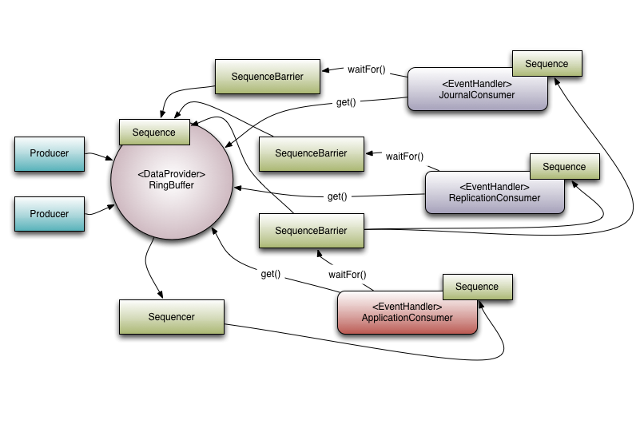

英国人开发的高新能队列相比传统的阻塞队列主要是低延迟与高吞吐量。因为Disruptor解决了CPU缓存失效的问题与加锁产生的内核中断问题，这2个都是消耗时间比较高的，Disruptor是无锁的，使用比较广泛。LMAX的研究表明传统的阻塞队列在交换数据的延迟与磁盘IO的延迟相当，如果一个处理流中有多个队列，那么累加下延迟就会比较高了。他们认为是传统队列的多线程争用导致了延迟增加，所以设计了Disruptor。
# 背景
## 并发的复杂性
并发涉及到并行执行以及对共享资源的访问争用，共享资源的访问涉及到互斥与更改的可见性。对共享资源的争用的写入访问时代价最高的，通常需要锁来保证互斥。锁提供互斥并确保更改的可见性以有序的方式发生。锁的代价很高因为争用锁时需要中断，中断的操作要将CPU的上下文切换到操作系统内核来实现，操作系统内核将休眠等待锁的线程直到锁被释放。在这样的上下文切换期间，以及将控制权释放给操作系统期间，执行上下文可能会丢失先前缓存的数据和指令。一个简单的函数执行的对比数据表如下:

更有效的方案是使用CAS操作，他是CPU提供的机器指令保证原子操作。因为CAS操作不需要内核切换执行中断所以性能更好，但是CAS操作需要内存屏障来保证更改对其他线程可见，也是有额外的消耗的，特别是多核处理器，需要内存屏障来保证其他核上运行的线程可以看到对共享数据的修改。现代的CPU都是并发执行指令并加载数据的，如果涉及到共享数据，需要使用内存屏障来保证数据的可见性，同时也会保证保障编译代码的顺序。Java中使用`volatile`定义字段为内存屏障字段。缓存对高性能操作很重要，特别是处理器缓存的数据与指令。CPU的缓存是缓存行组织的，缓存行通常是64字节。这是缓存一致性协议运行的粒度级别。如果两个变量位于同一缓存行中，并且由不同的线程写入，那么它们会出现与单个变量相同的写入争用问题。这称为伪共享。为了实现高性能要最大限度地减少争用，就是确保独立但同时写入的变量不共享同一缓存行。CPU加载内存到缓存时会使用局部性原理(指处理器在访问某些的数据时短时内存在重复访问分为时间局部性与空间局部性，时间局部性就是指令与数据可能很快被重复访问，空间局部性就是指令与数据周边的存储单元可能很快被访问。时间局部性通过将近来使用的指令与数据保存到高速缓存存储器中并使用高速缓存的层次结构实现。空间局部性通常是使用较大的高速缓存并配合预取机制来实现)加载更多的内存，这样对于数组来说可以直接使用缓存，对于链表或者树结构的数据来说则无法使用缓存。无界队列可能导致内存耗尽带来故障，所以一般使用有界队列。要么使用数组要么跟踪大小。队列实现在头部、尾部和大小变量上存在写入争用。在使用时，由于消费者和生产者之间的速度差异，队列通常总是接近满或接近空。它们很少在生产率和消费率均衡的平衡中间地带运行。这种总是满的或总是空的倾向会导致高水平的争用和/或昂贵的缓存一致性。问题是，即使使用不同的并发对象（如锁或 CAS 变量）将头部和尾部机制分开，它们通常也占用相同的缓存行。传统队列还存在需要不断创建新的对象放入的问题这增加了垃圾回收的成本。
线程安全的内存队列如下:
|队列|有界性|锁|数据结构|
|:---|:---|:---|:---|
|ArrayBlockingQueue|bounded|加锁|arraylist|
|LinkedBlockingQueue|optionally-bounded|加锁|linkedlist|
|ConcurrentLinkedQueue|unbounded|无锁|linkedlist|
|LinkedTransferQueue|unbounded|无锁|linkedlist|
|PriorityBlockingQueue|unbounded|加锁|heap|
|DelayQueue|unbounded|加锁|heap|

底层的数据结构就是数组、链表与堆。堆用来实现带有优先级特性的队列。不加锁实现的队列都是无界的，因为CAS的方式无法保证队列的长度的并发安全。
## LMAX Disruptor的设计
通过关注点分离(separation of the concerns)的方式解决队列中的问题，底层预先分配环形缓冲区形式的有届数据结构。环形缓冲区的内存在启动时都会预先分配。存储的条目消除了垃圾回收的问题重复使用直到Disruptor销毁。这些条目在内存中是连续布局的，支持缓存的预取机制(值类型： 内存连续分配且没有指针间接寻址)。垃圾收集会影响低延迟系统的设计，分配的内存越多，垃圾收集负担越重，环形缓冲区的内存是长期存在的，因此垃圾回收对此影响较小(进入老年代)。有届队列存在头部与尾部争用，环形缓冲区使用CAS操作解决争用问题，生产者可以通过对槽的序列号执行简单的CAS来管理争用，复制数据后提交序列号给消费者，消费者等待数据可用，可以使用锁的通知机制或者循环检查来消费。排序是Disruptor并发管理的核心概念。生产者声明槽位的时候使用CAS更新原子计数器。
```java
long expectedSequence = claimedSequence – 1;
while (cursor != expectedSequence)
{
  // busy spin
}
cursor = claimedSequence;
```
单个生产者与消费者是单步流水线依赖关系，拓扑图的每一个关系都需要一个队列。下面的类图描述了Disruptor框架的核心关系，这个编程模型是基于事件的，与Actor类似

## 代码例子
```java
// Callback handler which can be implemented by consumers
final BatchHandler<ValueEntry> batchHandler = new BatchHandler<ValueEntry>()
{
public void onAvailable(final ValueEntry entry) throws Exception
{
// process a new entry as it becomes available.
}

    public void onEndOfBatch() throws Exception
    {
        // useful for flushing results to an IO device if necessary.
    }

    public void onCompletion()
    {
        // do any necessary clean up before shutdown
    }
};

RingBuffer<ValueEntry> ringBuffer =
    new RingBuffer<ValueEntry>(ValueEntry.ENTRY_FACTORY, SIZE,
                               ClaimStrategy.Option.SINGLE_THREADED,
                               WaitStrategy.Option.YIELDING);
ConsumerBarrier<ValueEntry> consumerBarrier = ringBuffer.createConsumerBarrier();
BatchConsumer<ValueEntry> batchConsumer =
    new BatchConsumer<ValueEntry>(consumerBarrier, batchHandler);
ProducerBarrier<ValueEntry> producerBarrier = ringBuffer.createProducerBarrier(batchConsumer);

// Each consumer can run on a separate thread
EXECUTOR.submit(batchConsumer);

// Producers claim entries in sequence
ValueEntry entry = producerBarrier.nextEntry();

// copy data into the entry container

// make the entry available to consumers
producerBarrier.commit(entry);
```

# 使用Disruptor
Disruptor是一个提供并发环形缓冲区数据结构的库，在异步事件处理架构中提供低延迟、高吞吐量的工作队列。功能类似传统的阻塞队列，但是性能更高，面向同一个进程内的线程之间移动数据，额外还有
- 使用消费者依赖关系图将事件多播给消费者
- 为事件预分配内存
- 无锁的

核心概念与术语
- **Ring Buffer**: 环形缓冲区，负责存储与更新事件
- **Sequence**: 序列，识别特定组件的运行情况，每个消费者都维护一个队列，并发逻辑依赖这些序列值的移动
- **Sequencer**: 是Disruptor真正的核心，有2种实现，单生产者与多生产者，实现了所有核心的并发算法
- **Sequence Barrier**: 序列屏障，Sequencer生成一个序列屏障，其中包含Disruptor所有序列的引用，包含生产者序列(来自于Sequencer)与所有的消费者序列，包含确定是否有任何事件可供消费者处理的逻辑
- **Wait Strategy**: 等待策略，等待策略确定消费者将如何等待生产者将事件放入Disruptor，这里可以实现无锁的并发逻辑
- **Event**: 事件，从生产者到消费者的数据单位，由用户定义
- **Event Processor**: 用于处理来自Disrutor的事件的主要事件循环，拥有消费者序列的所有权，只有一个`BatchEventProcessor`实现类，它包含事件循环的有效实现，并将回调用户提供的`EventHandler`接口实现
- **Event Handler**: 事件处理程序，用户实现，代表消费者
- **Producer**: 生产者


1. 广播事件(Multicast Events)
   多个消费者在同一个Disruptor上监听时，事件会广播，当需要对事件执行多个并行操作时需要广播
2. 消费者依赖图
   这里没看懂在说什么?
3. 事件预分配
   Disruptor的目标就是在低延迟环境使用，减少内存分配或者删除内存分配，也是减少垃圾收集所带来的影响，预先分配的条目中会使用用户提供的`EventFactory`来生成对象
4. 无锁
   使用无锁来实现低延迟，使用内存屏障与CAS来实现，只在`BlockingWaitStrategy`中需要使用锁中的`Condition`这是为了实现线程休眠，许多低延迟的系统使用忙等待来避免使用`Condition`导致的抖动，但是这会消耗额外的CPU资源
# Get Started
maven中添加依赖，在Maven中央仓库中
```xml
<dependency>
    <groupId>com.lmax</groupId>
    <artifactId>disruptor</artifactId>
    <version>4.0.0</version>
</dependency>
```
1. 基本的生产与消费
   为了开始使用Disruptor，我们将考虑一个非常简单且人为的例子。我们将从生产者向消费者传递一个长整型值，消费者只需打印出该值即可。目前，Disruptor有几种编写发布者和消费者的风格。虽然它们基本上都相似，但每种方法可能存在细微差别，下面将介绍这些差别。首先，我们将定义将携​​带数据的事件，该事件在以下所有示例中都是通用的：
    ```java
    @Data
    public class LongEvent {
        
        private long value;
        
    }
    ```
    为了让Disruptor为我们预先分配这些事件，我们需要一个`EventFactory`来执行构造。这可以是方法引用，例如`LongEvent::new`或`EventFactory`接口的显式实现：
    ```java
    public class LongEventFactory implements EventFactory<LongEvent> {
        @Override
        public LongEvent newInstance() {
            return new LongEvent();
        }
    }
    ```
    一旦定义了事件，我们就需要创建一个消费者来处理这些事件。例如，我们将创建一个`EventHandler`，它将值打印到控制台。
    ```java
    public class LongEventHandler implements EventHandler<LongEvent> {
        @Override
        public void onEvent(final LongEvent longEvent, final long l,
                final boolean b) throws Exception {
            System.out.println(longEvent);
        }
    }
    ```
    最后，我们需要这些事件的来源。为简单起见，我们假设数据来自某种I/O设备，例如网络或`ByteBuffer`形式的文件。
    - 发布
      - 使用lambda
        从Disruptor 3.0版开始，可以使用Lambda风格的API来编写发布者。这是首选方法，因为它封装了方案的大部分复杂性。
        ```java
        @SuppressWarnings({ "InfiniteLoopStatement", "java:S2189" })
        public class LongEventMain {
            @SneakyThrows
            public static void main(final String[] args) {
                final int bufferSize = 1024;// 指定环形队列的大小，必须是2的幂个数
                // 创建一个Disruptor
                final Disruptor<LongEvent> disruptor = new Disruptor<>(LongEvent::new,
                        bufferSize, DaemonThreadFactory.INSTANCE);
                // 连接事件处理器
                disruptor.handleEventsWith(
                        (event, sequence, endOfBatch) -> System.out.println(
                                event + ", thread" + Thread.currentThread().getName()));
                // 启动Disruptor,所有线程创建并启动运行
                disruptor.start();
                // 从Disruptor中获取环形队列，用来发布事件
                final RingBuffer<LongEvent> ringBuffer = disruptor.getRingBuffer();
                final ByteBuffer bb = ByteBuffer.allocate(8);
                long l = 0;
                while (true) {
                    bb.putLong(0, l);
                    ringBuffer.publishEvent((event, sequence, buffer) -> event
                            .setValue(buffer.getLong(0)), bb);
                    // 这种写法会创建一个引用bb作为final属性的内部类，导致额外的变量
                    // ringBuffer.publishEvent((event, sequence) ->
                    // event.setValue(bb.getLong(0)));
                    TimeUnit.SECONDS.sleep(1);
                    l++;
                }  
            }
        }
        ```
        注意`publishEvent`中的lambda表达式，只会使用传递的bb参数，如果写成下面的样子
        ```java
        ByteBuffer bb = ByteBuffer.allocate(8);
        for (long l = 0; true; l++)
        {
            bb.putLong(0, l);
            ringBuffer.publishEvent((event, sequence) -> event.set(bb.getLong(0)));
            Thread.sleep(1000);
        }
        ```
        将会创建一个捕获lambda，这意味着在将lambda表达式传递给`publishEvent()`调用时，需要实例化一个对象来保存 `ByteBuffer`变量值。这将产生额外的（不必要的）垃圾，因此，如果需要较低的GC压力，则应优先使用将参数传递给lambda的调用。
      - 使用方法引用
        ```java
        public class LongEventMainUsingMethodReference {
            public static void handleEvent(final LongEvent event, final long sequence,
                    final boolean endOfBatch) {
                System.out.println(event);
            }
            
            public static void translate(final LongEvent event, final long sequence,
                    final ByteBuffer buffer) {
                event.setValue(buffer.getLong(0));
            }
            
            public static void main(final String[] args) throws Exception {
                final int bufferSize = 1024;
                
                final Disruptor<LongEvent> disruptor = new Disruptor<>(LongEvent::new,
                        bufferSize, DaemonThreadFactory.INSTANCE);
                disruptor.handleEventsWith(
                        LongEventMainUsingMethodReference::handleEvent);
                disruptor.start();
                
                final RingBuffer<LongEvent> ringBuffer = disruptor.getRingBuffer();
                final ByteBuffer bb = ByteBuffer.allocate(8);
                for (long l = 0; true; l++) {
                    bb.putLong(0, l);
                    ringBuffer.publishEvent(
                            LongEventMainUsingMethodReference::translate, bb);
                    TimeUnit.SECONDS.sleep(1);
                }
            }
        }
        ```
      - 使用Translator接口
        在3.0版本之前，发布消息的首选方式是通过事件发布器/事件转换器接口
        ```java
        public class LongEventProducer {
            private final RingBuffer<LongEvent> ringBuffer;
            
            public LongEventProducer(final RingBuffer<LongEvent> ringBuffer) {
                this.ringBuffer = ringBuffer;
            }
            
            private static final EventTranslatorOneArg<LongEvent, ByteBuffer> TRANSLATOR = (
                    event, sequence, arg0) -> event.setValue(arg0.getLong(0));
            
            public void onData(final ByteBuffer byteBuffer) {
                ringBuffer.publishEvent(TRANSLATOR, byteBuffer);
            }
            
            public static void main(final String[] args) throws Exception {
                final int bufferSize = 1024;
                
                final Disruptor<LongEvent> disruptor = new Disruptor<>(LongEvent::new,
                        bufferSize, DaemonThreadFactory.INSTANCE);
                disruptor.handleEventsWith(
                        LongEventMainUsingMethodReference::handleEvent);
                disruptor.start();
                
                final RingBuffer<LongEvent> ringBuffer = disruptor.getRingBuffer();
                final ByteBuffer bb = ByteBuffer.allocate(8);
                final var producer = new LongEventProducer(ringBuffer);
                for (long l = 0; true; l++) {
                    bb.putLong(0, l);
                    producer.onData(bb);
                    TimeUnit.SECONDS.sleep(1);
                }
            }
        }
        ```
        这种方法使用了许多额外的类（例如，处理程序、转换器），而使用lambda时这些类不是明确需要的。这样做的好处是，转换器代码可以拉入单独的类中，并轻松进行单元测试。Disruptor提供了许多不同的接口（EventTranslator、EventTranslatorOneArg、EventTranslatorTwoArg等），可以实现这些接口来提供转换器。这是为了允许将转换器表示为静态类和lambda。转换方法的参数通过Ring Buffer上的调用传递给转换器。
      - 使用以前的API发布
        ```java
        public class LongEventProducerLegacy {
            private final RingBuffer<LongEvent> ringBuffer;
            
            public LongEventProducerLegacy(final RingBuffer<LongEvent> ringBuffer) {
                this.ringBuffer = ringBuffer;
            }
            
            public void onData(final ByteBuffer bb) {
                final long sequence = ringBuffer.next();// 获取下一个序列号
                try {
                    final LongEvent event = ringBuffer.get(sequence);// 获取Discruptor中序列号位置的条目
                    event.setValue(bb.getLong(0));//填充数据
                } finally {
                    ringBuffer.publish(sequence);
                }
            }
            
            public static void main(final String[] args) throws Exception {
                final int bufferSize = 1024;
                final Disruptor<LongEvent> disruptor = new Disruptor<>(LongEvent::new,
                        bufferSize, DaemonThreadFactory.INSTANCE);
                disruptor.handleEventsWith(
                        LongEventMainUsingMethodReference::handleEvent);
                disruptor.start();
                final RingBuffer<LongEvent> ringBuffer = disruptor.getRingBuffer();
                final ByteBuffer bb = ByteBuffer.allocate(8);
                final var producer = new LongEventProducerLegacy(ringBuffer);
                for (long l = 0; true; l++) {
                    bb.putLong(0, l);
                    producer.onData(bb);
                    TimeUnit.SECONDS.sleep(1);
                }
            }
        }
        ```
        显而易见的是，事件发布比使用简单队列更加复杂。这是由于需要事件预分配。它需要采用两阶段方法来发布消息，即在环形缓冲区中声明插槽，然后发布可用数据。还需要将发布包装在try/finally块中。如果我们在Ring Buffer中声明一个槽(调用`RingBuffer.next()`)，那么我们必须发布此序列。如果不这样做，可能会导致Disruptor的状态损坏。具体来说，在多生产者的情况下，这将导致消费者停滞并且无法在不重新启动的情况下恢复。因此，建议使用lambda或EventTranslator API。最后一步是将整个东西连接在一起。虽然可以手动连接每个组件，但这可能很复杂，因此提供了DSL来简化构造。一些更复杂的选项无法通过DSL获得；但是，它适用于大多数情况。
    - Basic Tuning Options
      使用上述方法将在最广泛的部署场景中发挥作用。但是，有许多调整选项可用于提高性能。主要有2个调整项
      - 单个生产者还是多个生产者
      - 等待策略
      
      这些选项都是在构造Disruptor的时候设置的。
      ```java
        public class LongEventMain{
            public static void main(final String[] args)
            {
                //.....
                Disruptor<LongEvent> disruptor = new Disruptor(
                    factory,
                    bufferSize,
                    DaemonThreadFactory.INSTANCE,
                    ProducerType.SINGLE, // 这回创建一个`SingleProducerSequencer`，使用MULTI会创建一个`MultiProducerSequencer`
                    new BlockingWaitStrategy()// 设置等待策略
                );
                //.....
            }
        }
      ```
      - Single vs Multiple生产者
        提高并发系统性能的最佳方法之一是遵守单一写入器原则，这适用于Disruptor。如果您处于只有一个线程向Disruptor生成事件的情况，那么您可以利用这一点来获得额外的性能。为了表明通过这种技术可以获得多大的性能优势，我们可以在OneToOne性能测试中更改生产者类型。
      - Alternative Wait Strategies
        Disruptor使用的默认`WaitStrategy`是`BlockingWaitStrategy`。在内部，`BlockingWaitStrategy`使用典型的锁和条件变量来处理线程唤醒。`BlockingWaitStrategy`是所有可用等待策略中最慢的，但在CPU使用率方面最为保守，并且在各种部署选项中都能提供最一致的行为。了解已部署的系统可以通过选择更合适的等待策略来提高性能:
        - `SleepingWaitStrategy`: 与`BlockingWaitStrategy`一样，`SleepingWaitStrategy`通过使用简单的繁忙等待循环来尝试节约CPU使用率。不同之处在于`SleepingWaitStrategy`在循环中间使用`LockSupport.parkNanos(1)`的调用。在典型的Linux系统上，这将暂停线程约60µs。这样做的好处是，生产线程不需要采取任何其他操作，只需增加适当的计数器，并且不需要发送条件变量的信号。但是，在生产者和消费者线程之间移动事件的平均延迟会更高。
        - `YieldingWaitStrategy`: `YieldingWaitStrategy`是两种可用于低延迟系统的`WaitStrategy`之一。它专为可以选择消耗CPU周期以改善延迟的情况而设计。`YieldingWaitStrategy`将忙于旋转，等待序列增加到适当的值。在循环主体内，将调用`Thread#yield()`以允许其他排队线程运行。当您需要非常高的性能并且`EventHandler`线程数低于逻辑核心总数时，这是推荐的等待策略，例如您启用了超线程,它在不需要低延迟但希望对生产线程影响较小的情况下效果最佳。一个常见的用例是异步日志记录
        - `BusySpinWaitStrategy`: `BusySpinWaitStrategy`是性能最高的`WaitStrategy`。与`YieldingWaitStrategy`一样，它可以用于低延迟系统，但对部署环境的限制最高。仅当`EventHandler`线程数低于机器上的物理核心数时才应使用此等待策略，例如应禁用超线程。
2. Clearing Objects From the Ring Buffer
   通过Disruptor传递数据时，对象的存活时间可能会超过预期。为了避免这种情况发生，可能需要在处理事件后清除事件。如果您有一个事件处理程序，则清除同一处理程序中的值就足够了。如果您有一系列事件处理程序，那么您可能需要在链的末尾放置一个特定的处理程序来处理清除对象。
   ```java
    class ObjectEvent<T>{
        T val;
        void clear(){
            val = null;
        }
    }
    public class ClearingEventHandler<T> implements EventHandler<ObjectEvent<T>>{
        @Override
        public void onEvent(ObjectEvent<T> event, long sequence, boolean endOfBatch){
            event.clear(); // 调用`clear()`失败会导致时间对象直到下一次覆写期间一直有效，
        }
    }
    public static void main(String[] args){
        Disruptor<ObjectEvent<String>> disruptor = new Disruptor<>(
                () -> new ObjectEvent<>(), BUFFER_SIZE, DaemonThreadFactory.INSTANCE);
        disruptor
                .handleEventsWith(new ProcessingEventHandler())
                .then(new ClearingEventHandler());
    }
   ```
# 高级技术
处理大批次数据
```java
public class EarlyReleaseHandler implements EventHandler<LongEvent>
{
    private Sequence sequenceCallback;
    private int batchRemaining = 20;

    @Override
    public void setSequenceCallback(final Sequence sequenceCallback){
        this.sequenceCallback = sequenceCallback;
    }

    @Override
    public void onEvent(final LongEvent event, final long sequence, final boolean endOfBatch){
        processEvent(event);

        boolean logicalChunkOfWorkComplete = isLogicalChunkOfWorkComplete();
        if (logicalChunkOfWorkComplete)
        {
            sequenceCallback.set(sequence);
        }

        batchRemaining = logicalChunkOfWorkComplete || endOfBatch ? 20 : batchRemaining;
    }

    private boolean isLogicalChunkOfWorkComplete(){
        // Ret true or false based on whatever criteria is required for the smaller
        // chunk.  If this is doing I/O, it may be after flushing/syncing to disk
        // or at the end of DB batch+commit.
        // Or it could simply be working off a smaller batch size.

        return --batchRemaining == -1;
    }

    private void processEvent(final LongEvent event){
        // Do processing
    }
}
```
当使用`BatchEventProcessor`将事件作为批处理时，可以使用一项功能从名为“批处理回退”的异常中恢复。如果在处理可恢复的事件时出现问题，用户可以抛出 RewindableException。这将调用 BatchRewindStrategy 而不是通常的 ExceptionHandler 来决定序列号是否应该回退到要重新尝试的批处理的开头或重新抛出并委托给 ExceptionHandler。

