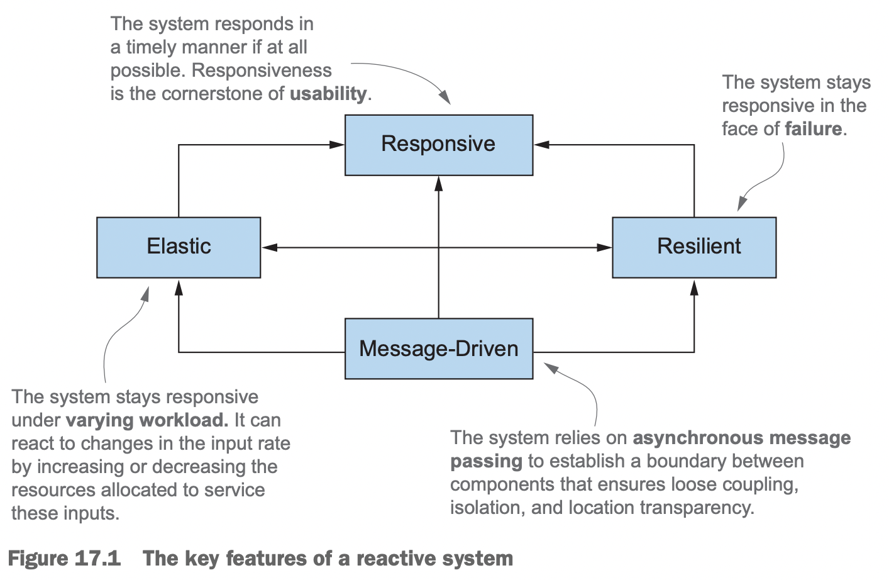

[TOC]
# 14 Java模块化系统
Java的模块化系统诞生于Jigsaw项目，从Java9开始引入，演进了很多年，具有很大意义，本章只做简单的介绍。
## 模块化的驱动力: 软件的推理
2个设计模式:
- 关注点分离，separation of concern。将程序分解为一个个相互独立的特性。可以将这些特性划分到模块，一个例子开发结算应用，需要能解析各种格式的开销，能对结果进行分析，进而为顾客提供汇总报告。采用关注点分离，可以将文件的解析、分析以及报告划分到各个模块中，模块是内聚的，模块之间是松耦合的。关注点分离使各项工作可以独立开展，减少了组件的相互依赖，便于团队合作完成项目；利于推动组件重用，系统的整体维护性更好
- 信息隐藏，information hiding，尽量隐藏实现的细节。可以帮助减少局部变更对程序其他部分的影响，避免变更传递，

可以创建易于理解的软件。
## 为什么要设计Java模块化系统
## Java模块: 全局视图
模块在module-info.java中声明分为3个部分:
- module {module-name}，为模块声明一个名字
- requires {module names} 依赖的模块名
- exports {package names} 导出的包名
## 使用Java模块系统开发应用
创建一个例子应用
```java
module expense.application {}
```
执行下面的命令:
```shell
javac module-info.java com/exmaple/expenses/application/ExpensesApplication.java -d target
jar cvfe expenses-application.jar com.exmaple.expenses.application.ExpensesApplication -C target .
java --module-path expenses-application.jar --module expense.application/com.exmaple.expenses.application.ExpensesApplication
```
## 使用多个模块
exports的使用例子，其中都是包名而不是模块名，声明的包未公有类型，可以被其他模块访问和调用。默认情况下，模块内的所有包都是被封装的。
```java
module expenses.readers {
    exports com.example.expenses.readers;
    exports com.example.expenses.readers.file;
    exports com.example.expenses.readers.http;
}
```
requires的例子
```java
module expenses.readers {
    requires java.base;
    exports com.example.expenses.readers;
    exports com.example.expenses.readers.file;
    exports com.example.expenses.readers.http;
}
```
指定本地模块对其他模块的依赖。默认依赖java.base的平台模块。它包含了Java主要的包(net、io、util)。Oracle推荐模块的命名与包的命名类似。即互联网域名规范的逆序。
## 编译与打包
每一个模块都能单独编译。2个模块。
readers模块
```java
module expenses.readers {
    requires java.base;
    exports com.example.expenses.readers;
    exports com.example.expenses.readers.file;
    exports com.example.expenses.readers.http;
}
```
```xml
<?xml version="1.0" encoding="UTF-8"?>
<project xmlns="http://maven.apache.org/POM/4.0.0"
         xmlns:xsi="http://www.w3.org/2001/XMLSchema-instance"
         xsi:schemaLocation="http://maven.apache.org/POM/4.0.0 http://maven.apache.org/xsd/maven-4.0.0.xsd">
    <modelVersion>4.0.0</modelVersion>
    <artifactId>expenses.readers</artifactId>
    <packaging>jar</packaging>
    <parent>
        <groupId>com.example</groupId>
        <artifactId>expenses</artifactId>
        <version>1.0</version>
    </parent>
</project>
```
application模块
```java
module expenses.application {
    requires expenses.readers;
    requires java.base;
}
```
```xml
<?xml version="1.0" encoding="UTF-8"?>
<project xmlns="http://maven.apache.org/POM/4.0.0"
         xmlns:xsi="http://www.w3.org/2001/XMLSchema-instance"
         xsi:schemaLocation="http://maven.apache.org/POM/4.0.0 http://maven.apache.org/xsd/maven-4.0.0.xsd">
    <modelVersion>4.0.0</modelVersion>
    <artifactId>expenses.application</artifactId>
    <packaging>jar</packaging>
    <parent>
        <groupId>com.example</groupId>
        <artifactId>expenses</artifactId>
        <version>1.0</version>
    </parent>

    <dependencies>
        <dependency>
            <groupId>com.example</groupId>
            <artifactId>expenses.readers</artifactId>
            <version>1.0</version>
        </dependency>
    </dependencies>
</project>
```
启动命令
```shell
java --module-path  ./expenses.application/target/expenses.application-1.0.jar:./expenses.readers/target/expenses.readers-1.0.jar --module  expenses.application/com.example.expenses.application.ExpensesApplication
```
## 自动模块
使用第三方库的时候，在maven的pom中引入依赖，同时使用`requires jar name`来添加模块依赖。Java会将这个jar包转换为自动模块。模块路径不带module-info.jave文件的jar都会被转换为自动模块。自动模块默认导出所有的包。自动模块的名字根据Jar的名字自动创建，此时运行程序的代码:
```java
java --module-path  ./expenses.application/target/expenses.application-1.0.jar:./expenses.readers/target/expenses.readers-1.0.jar:./expenses.readers/target/lombok-1.18.30.jar --module  expenses.application/com.example.expenses.application.ExpensesApplication
```
## 模块声明及子句
- requires，设定此模块的依赖
- exports，将包声明为公有类型，默认所有包不导出
- requires的传递，`requires transitive com.iteratrlearning.core`
- exports to,
- open/opens, 使其他模块可以用反射的方式访问它所有的包。就是允许对模块进行反射访问。
- uses/provides

# CompletableFuture及反应式编程背后的概念
软件编写方式的变化:
- 多核带来并行处理，大任务拆小任务
- 软件的微服务化，小型化与分布式联网化

并发是一种编程属性（重叠的执行），在单核的机器上也可以执行，并行是同时执行时一种硬件属性
## 为支持并发而不断演进的Java
- 最开始的版本提供了锁(synchronized)、runnable与线程
- 2004，Java5引入了`java.util.concurrent`包，`ExecutorService`将任务提交与任务执行解耦，`Callable<T>`与`Future<T>`生成一个高度封装的`Runnable`与一个`Thread`变体。
- Java7引入了fork/join实现分而治之算法新增了`java.util.concurrent.RecursiveTask`
- Java8引入了流与流的并行处理与`CompletableFuture`
- Java9分布式异步编程

理念就是提供一种程序结构让相互独立的任务尽可能并发执行。
Java线程的问题
- java线程是操作系统线程，创建于销毁的代价很大(页表操作)
- 操作系统的线程数目是有限的
- 操作系统的线程于硬件的线程不是一回事，通常线程的最优数据等于硬件线程数目

线程池的优势
- 可以获取结果
- 任务的执行与任务的提交分离，这样任务的执行可以以与硬件最匹配的方式执行，无需手动处理，降低编程的负担
- 成本低，线程重复使用
- 关于任务的处理提供了更多的可配置功能

线程池的劣势
- 线程池有并发执行的上限
- 如果任务里面有阻塞或者事件等造成线程休眠，会降低线程池的并发性，其他任务得不到执行，避免提交可能阻塞的任务

## 同步/异步API
Java8的stream流并行的2个优势:
- 内部迭代代替外部迭代
- 不需要手动创建线程并管理线程，底层已经做好了

函数`int f(int x)`与`int g(int x)`都是同步API，物理上返回时执行结果也一同返回。
```java
        var x = 1337;
        int y = f(x);
        int z = g(x);
        System.out.println(y + z);
```
串行执行是2个方法之和，如果2个任务没有依赖关系。并发执行是2个中耗时最长的那个。有几种并发的方式
- 直接使用`Thread`类，并使用`join`来等待，缺点是需要开发人员显式的操纵所有的线程
- 使用`ExecutorService`线程池，缺点是需要手动多次调用submit来提交任务
- 异步API，就是在返回结果之前就返回函数执行，使用`Future`或者增强版`CompletableFuture`
- 异步API，就是在返回结果之前就返回函数执行，使用`java.util.concurrent.Flow`接口的响应式编程API

1. Future风格的API
   ```java
    final Future<Integer> yf = fAsync(x);
    final Future<Integer> zf = gAsync(x);
    System.out.println(yf.get() + zf.get());
   ```
   方法返回一个Future对象包含一个继续执行方法体中原始内容的任务并立刻返回。`get()`方法等待执行完毕。
2. 反应式风格的API
   核心思想是使用回调风格的编程。
   ```java
   public class CallbackStyleExample {
    public static void main(final String[] args) {
        final int x = 1337;
        final Result result = new Result();
        f(x, y -> {
            result.left = y;
            System.out.println(result.left + result.right);
        });
        f(x, z -> {
            result.right = z;
            System.out.println(result.left + result.right);
        });
        
    }
    
    private static class Result {
        private int left;
        private int right;
    }
    
    private static void f(final int x, final IntConsumer dealWithResult) {
        dealWithResult.accept(x * x);
    }
    
    private static void g(final int x, final IntConsumer dealWithResult) {
        dealWithResult.accept(x + x);
    }
    }

   ```
3. 有害的睡眠及其他阻塞式操作，任务在执行时占用系统资源，目标是让它们持续的处于运行状态，直到执行完毕释放资源，其中如果有阻塞操作，会阻塞整体任务的执行
4. 如果使用异步API进行异常处理，可以使用`CompletableFuture`的`get()`方法返回异常信息或者通过`exceptionally()`处理异常信息。对于反应式异步API，需要使用回调函数来处理异常。比如`void f(int x, Consumer<Integer> dealWithResult,Consumer<Throwable> dealWithException);`多个回调函数可以封装到一个接口中，回调接口中中每个方法调用称作消息或者事件。

## 线框-管道模型
使用图形表示并发系统就是线框-管道模型。
## 为并发而生的CompletableFuture和结合器
## 发布-订阅与反应式编程
Future是一个一次性对象，只能从头到尾执行一次。反应式编程可以执行多次，类似流处理，但是流处理只支持一个终端操作，而且不能拆分或者合并。反应式编程的接口是`java.util.concurrent.Flow`实现了发布订阅模型。反应式编程的3个重要的概念
- 订阅者可以订阅发布者
- 名为订阅的连接
- 消息或者事件，通过连接传输

订阅就类似管道的思想。
## 反应式系统和反应式编程
反应式系统是一个程序，可以在运行时调整以适应变化的需求，3大特性:
- 响应性: 不能因为正在替某人处理任务就延迟其他用户的查询请求，必须实时的对输入进行响应
- 韧性: 不能因为某个组件失效就无法提供服务，某个网络连接出现问题，不应该影响其他网络的查询服务，对无法响应组件的查询应该背重新路由到备用组件上
- 弹性: 系统呢可以调整以适应工作负荷的变化，持续高效的运行

反应式编程体现了消息驱动的思想。
## 小结
- 大量可能阻塞的任务使用线程池可能会有问题
- 方法异步化(完成他们的工作之前返回)能提升程序的并发度，其可以与用于循环结构的优化进行互补
- 使用线框-管道模型可以对异步系统进行可视化
- `CompletableFuture`与`Flow`都可以通过线框-管道图表示
- `CompletableFuture`类常用于一次性的异步计算，使用结合器可以组合多个异步计算，并且无需担心使用Future时的阻塞分险
- Flow API基于发布-订阅协议，与背压一起构成了Java反应式编程的基础
- 反应式编程可以帮助实现反应式系统
# 第17章 反应式编程
目前的应用情况
- 大数据PB级别
- 异构环境，可能是移动设备或者服务器集群
- 使用模式，毫秒级的响应时间，7*24运行

反应式编程: 以异步的方式处理与整合来自不同系统与源头的数据流。
## 反应式宣言
反应式应用的4个典型的特征: 
- 响应性: 响应时间快且稳定。
- 韧性: 系统在失败时能继续响应服务，构建弹性应用
  - 组件复制
  - 时间(发送方与接收方有相互独立的生命周期)空间(发送方与接收方运行域不同的线程)解耦
- 弹性: 增加资源后，自动适配负荷
- 消息驱动: 韧性与弹性要求明确定义构成系统的组件之间的边界，从而确保组件间的松耦合、组件隔离以及位置透明性。跨组件通信则通过异步消息传递。这种设计既实现了韧性(以消息传递组件失败)又确保了弹性(通过监控交换消息规模的变化，适时调整资源分配，从而实现资源配置的优化，满足业务需求)

这些原则适用于各种规模的项目，小型应用内部架构或者多个应用协调构成的大型应用

1. reactive at application level
   应用层的反应式编程就是异步执行任务。以异步以及非阻塞的方式处理事件流可以最大化的利用多核CPU以及线程竞争的使用的优势。反应式框架与库通过共享thread(相对昂贵与稀缺的资源)的方式实现。一些轻量级的结构比如futures、actors或者用于处理回调的事件循环都可以复用这些线程。带来的优势:
   - 比多线程需要更少的资源
   - 提高了编写并发与异步应用的抽象层次，只需要写业务就行了，不需要关注底层多线程的同步、竞争条件与死锁等问题。

   不要在主事件循环内执行阻塞操作。如果要执行阻塞操作，大多数的反应式框架比如RxJava与aKka选择将阻塞操作操作放到专门的线程池中去执行。主线程池中的线程都是不可中断的执行。也就是将执行CPU密集型与IO密集型的线程池分开。
2. reactive at system level
   响应式系统是一种软件架构，允许多个应用像一个整体的弹性的平台那样工作，这些应用是松耦合的，当其中一个失败不会导致整个应用挂掉。响应式应用主要是执行基于短暂的数据流的计算，通常也叫做事件驱动。响应式系统是组合应用并使应用之间通信更容易，这种系统叫做消息驱动。
   - message: 流向一个一定的单一目的地，消息的发送与接收是异步的，与发送者与接收者是解耦的，这种解耦是实现组件隔离与系统响应性(失败(resilience)与高负载(elasticity))的关键.
   - event: 由注册监听的所有组件接收
   
   响应式系统的resilience就是将失败隔离在组件内部，避免穿到整个系统早成整个系统挂掉。就是容错的意思，可以降级并隔离失效组件来恢复系统。失效信息可以传递给管理组件。隔离后管理组件可以安全的管理失效组件。对与resilience来说，隔离与接口是关键的，对于elasticity来说，位置透明很重要。位置透明性允许系统复制或者扩展应用。

## Reactive streams and the Flow API
反应式编程是利用反应式流的技术，以异步方式处理潜在无边界数据流的标准技术，基于发布-订阅模型，处理时按照先后次序进行，带有不可阻塞的背压，背压式发布-订阅模式下的一种常见的流量控制机制。目的是避免流中的事件处理的消费者由于处理速度较慢，被一个或者多个快速的生产者压垮，需要一种方式来向上游生产者反馈以减缓生产速度，或者告诉生产者它在接收更多数据之前，在给定的时间内能够接收和处理多少事件。
Java9的反应式编程的类(`java.util.concurrent.Flow`)，无法实例化，包含了4个嵌套的接口:
- 发布者(Publisher)
  ```java
    @FunctionalInterface
    public static interface Publisher<T> {
        public void subscribe(Subscriber<? super T> subscriber);
    }
  ```
- 订阅者(Subscriber)
  ```java
    public static interface Subscriber<T> {
        public void onSubscribe(Subscription subscription);

        public void onNext(T item);

        public void onError(Throwable throwable);

        public void onComplete();
    }
  ```
- 订阅(Subscription)
  ```java
    public static interface Subscription {

        public void request(long n);

        public void cancel();
    }
  ```
- 处理者(Processor)
  ```java
  ```

# 第18章 函数式的思考
函数式编程:
- lambda表达式
- 一等函数
- 限制对可变对象的修改
- 没有副作用的函数也就是纯粹的函数
- 声明式编程
- 引用透明性

结构的合理性:
- 耦合性: 软件系统中各组件之间是否相互独立
- 内聚性: 系统的各相关部分如何协作


如果一个函数不修改任何状态，只是对输入计算然后返回输出，那么这个函数就是纯粹的或者是无副作用的。共享变量就是有状态的，对它修改的函数就是有副作用的，也容易造成一些BUG问题。副作用的一些场景
- 除了构造器内的初始化，对类中成员的任何修改赋值都是副作用函数
- 抛出一个异常
- 进行输入与输出操作，比如写文件

不可变对象，一旦完成初始化就不会被任何方法修改状态。实现一个系统有2种方式
- 专注于如何实现，这种如何做的风格，我称为算法风格，也叫做命令式编程，因为就是指定计算机指令并执行
- 专注于要做什么，就像是问题陈述，实现细节留给函数库，我们只是声明要做什么，这个是声明式编程

本质来说函数式编程就是声明式编程与无副作用计算。简单点来说就是函数是一等对象使用纯粹的函数进行编程的方式。这个纯粹的函数可能是广义的，就是有的函数可能有副作用，但是副作用不被其他对象使用或者产生干扰，那么就可以说是纯粹的。简单来说，函数式编程的函数可修改本地变量，所以所有的变量都是final的，不能抛出异常可以使用`Optional<>`的方式代替异常，没有可感知的副作用(不改变变量，不进行IO，不抛出异常)隐含引用透明性，纯粹的函数都是引用透明的，例子计算一个list的所有的子集
```java
```
尽量使用Stream代替迭代操作。
- 减少共享的可变数据结构能够帮助降低维护与调试程序的代价
- 函数式编程支持无副作用的方法和声明式编程
# 第19章 函数式编程的技巧
函数式编程还意味着一等函数，就是函数就是值，通过方法引用或者lambda表达式的形式指定函数值。
**高阶函数**: 接受至少一个函数作为参数，返回的结果是一个函数，所有的函数尽量没有副作用
**柯里化**: 减少函数参数的一种办法，就是不断的基于一些参数创建一些函数，那么函数接受剩余的参数，典型的温度转换程序
```java
static double converter(double x, double f, double b) {
    return x * f + b;
}
```
柯里化之后
```java
static DoubleUnaryOperator curriedConverter(final double f,final double b) {
    return x -> x * f + b;
}
```
这样产生的函数只需要接受一个参数。这个就是柯里化。
函数式数据结构=不可变数据结构=持久化数据结构。函数式方法如果修改外部数据，则2次调用就可能产生不同的结果，这违背了引用透明性原则，破坏了参数到结果的简单的映射。函数式的解决办法是就禁止副作用的方法，如果要改变就返回copy之后的新结果，永远不改变全局的或者参数的数据结构。这样的函数式的数据结构就是持久化的。不会产生任何变更。
```java
public class MyMathUtils {
    public static Stream<Integer> primes(final int n) {
        return Stream.iterate(2, i -> i + 1).filter(MyMathUtils::isPrime)
                .limit(n);
    }
    public static boolean isPrime(final int candidate) {
        final int candidateRoot = (int) Math.sqrt(candidate);
        return IntStream.rangeClosed(2, candidateRoot)
                .noneMatch(i -> candidate % i == 0);
    }
}
```
延迟计算就是先声明，只有用到的时候才计算，Stream就是类似的思想，只有终端操作时才实际计算。创建一个延迟列表
```java
public class MyLinkedList<T> implements MyList<T> {
    
    private final T head;
    
    private final MyList<T> tail;
    
    public MyLinkedList(final T head, final MyList<T> tail) {
        this.head = head;
        this.tail = tail;
    }
    
    @Override
    public T head() {
        return head;
    }
    
    @Override
    public MyList<T> tail() {
        return tail;
    }

    @Override
    public boolean isEmpty() {
        return false;
    }
}
class Empty<T> implements MyList<T> {
    @Override
    public T head() {
        throw new UnsupportedOperationException();
    }

    @Override
    public MyList<T> tail() {
        throw new UnsupportedOperationException();
    }
}
interface MyList<T> {
    T head();

    MyList<T> tail();

    default boolean isEmpty() {
        return true;
    }
}
```
使用延迟计算的思想改造节点，使其在运行时才计算下一个节点，使用`Supplier<T>`工厂方法。
```java
public class LazyList<T> implements MyList<T> {
    
    private T head;
    
    private Supplier<MyList<T>> tail;
    
    public LazyList(final T head, final Supplier<MyList<T>> tail) {
        this.head = head;
        this.tail = tail;
    }
    
    @Override
    public T head() {
        return head;
    }
    
    @Override
    public MyList<T> tail() {
        return tail.get();
    }
    
    @Override
    public boolean isEmpty() {
        return false;
    }
}
```


   
