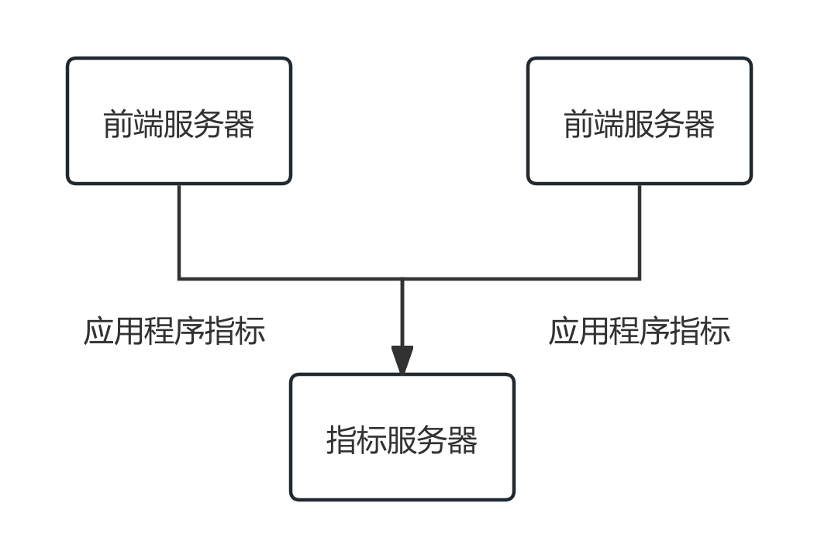
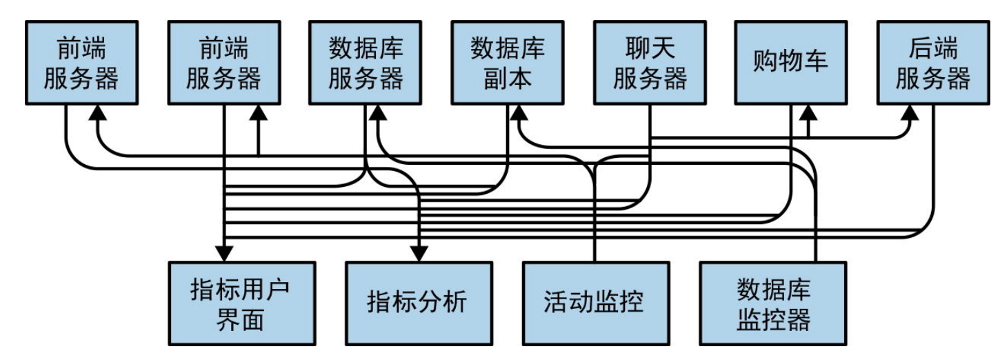
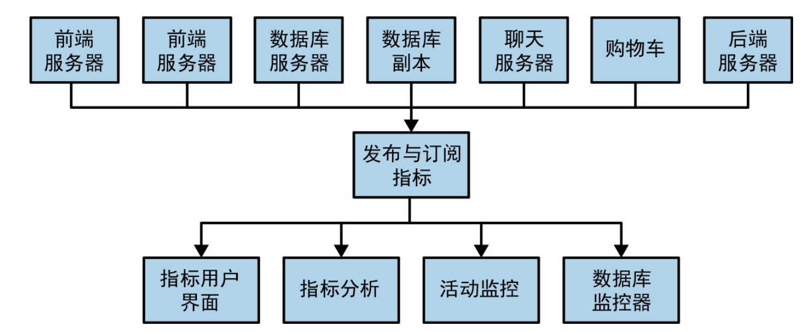
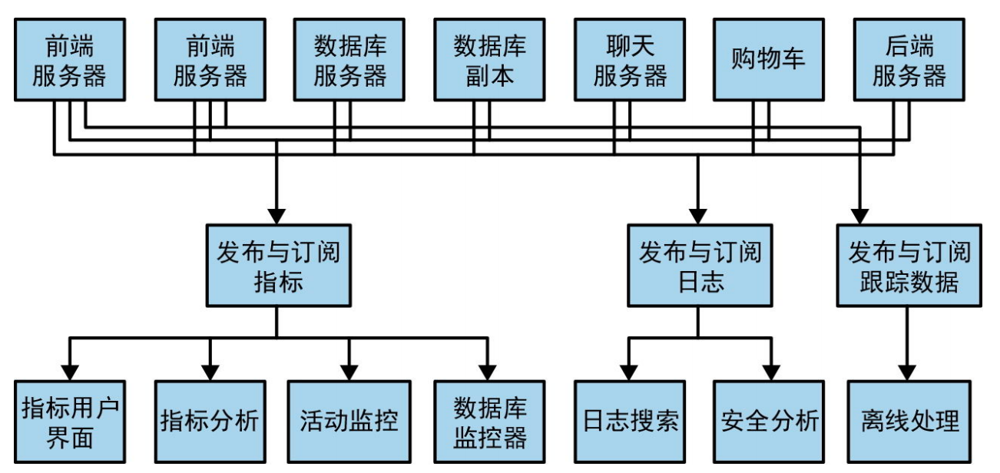
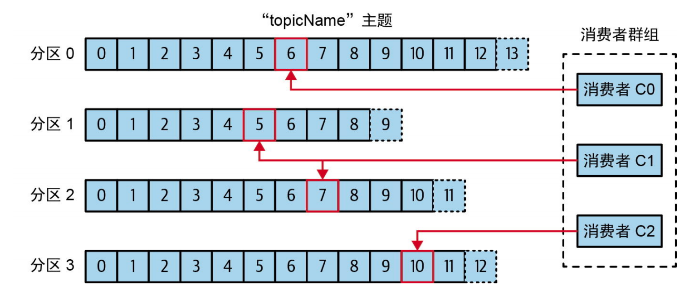
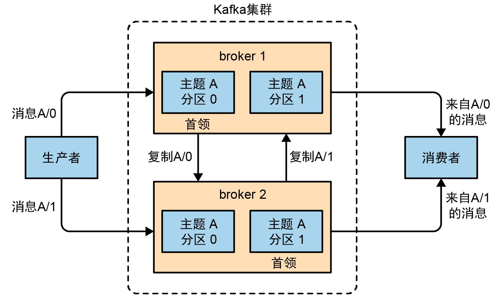
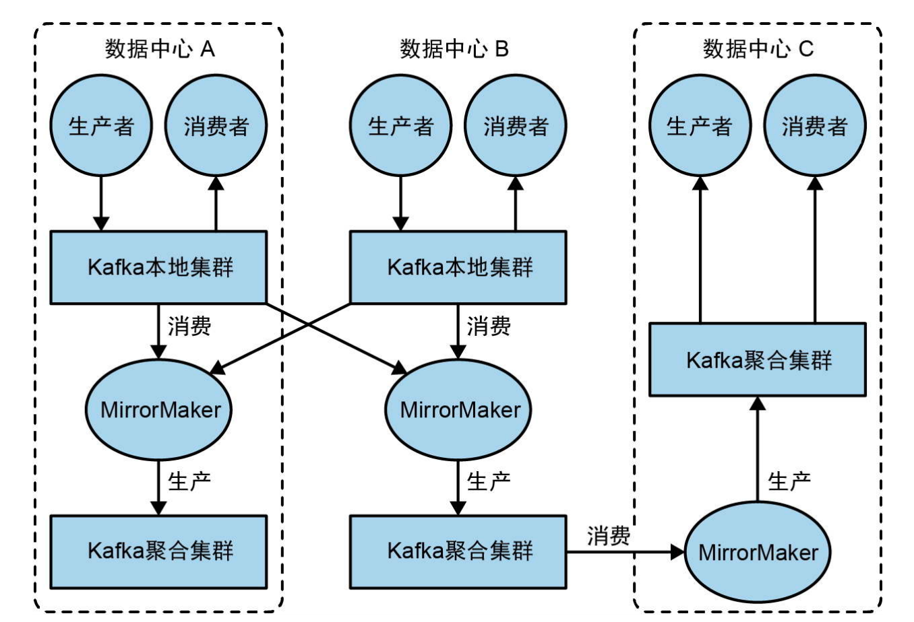

# 第1章 初识Kafka
数据可以获取信息，对数据分析处理可以获得更多的数据。应用会产生各种类型的数据，比如搜广推。数据需要移动到可以分析的平台来处理，所以数据管道称为关键性的组件。
## 发布与订阅消息系统
发布与订阅消息系统
- 消息的发布者不会直接发送消息给接收者
- 消息会进行分类，接收者可以订阅感兴趣的类型的消息
- broker就是发布消息的地方
- 就是做消息队列或者进程间通信

随着需求越来越复杂以及应用越来越多

一团乱，解决的思路是收紧入口

如果后续需要收集很多数据，那么解决就是如下:

线性增长，维护多个消息系统。需要一个消息系统，可以发布所有类型的数据(通用格式的数据)，可以扩展
## Kafka登场
称为分布式提交日志或者分布式流式平台。Kafka的数据也是按照顺醋存储的。
- 消息与批次: kafka的数据单元称为消息，一个消息就是一个字节数组。消息还有可选的元数据，叫做键，也是字节数组。通常用于分发分区用。消息是按批处理的，一批包含同一个主题与分区的多个消息，单个批次越大，吞吐量就越大，但是单条消息的延迟变高
- 模式: 通常是json/xml，但是兼容性不太好，Apache Avro是更好的选择
- 主题与分区: 消息通过主题分类，分为若干个分区，追加写入，先进先出，多分区的主题顺序无法保证，单个分区的顺序可以保证。通过分区实现数据的冗余与伸缩。使用流来描述主题的数据，流式处理就是实时的处理流中的数据
- 生产者与消费者: 写入消息与读取消息。高级客户端API: Kafka Connect API/流式处理的Kafka Streams。生产者要注意的就是分区键与分区器。消费者需要注意的就是偏移量，保存在Kafka中，还有消费者组。
  
- broker与集群: Kafka服务器称为broker，接收生产者的消息设置偏移量，为消费者服务，响应读取请求，集群中一个broker选举为集群控制器，负责管理工作，主分区所在的broker称为首领，分区副本叫做跟随者，分区复制提供分区的消息冗余。领导者broker故障，跟随者接管。生产者必须连接到首领，消费者可以从首领或者跟随者读取消息。
  
- 多集群:
  - 数据类型分离
  - 安全需求隔离
  - 多数据中心
  
  MirrorMaker的工具，将数据复制到其他集群中。
  
  