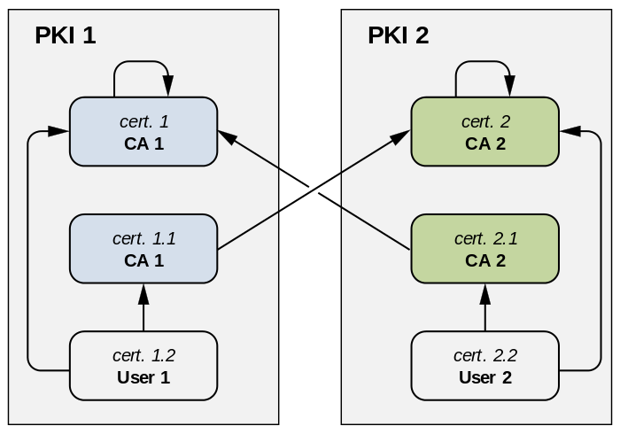
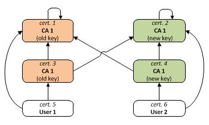
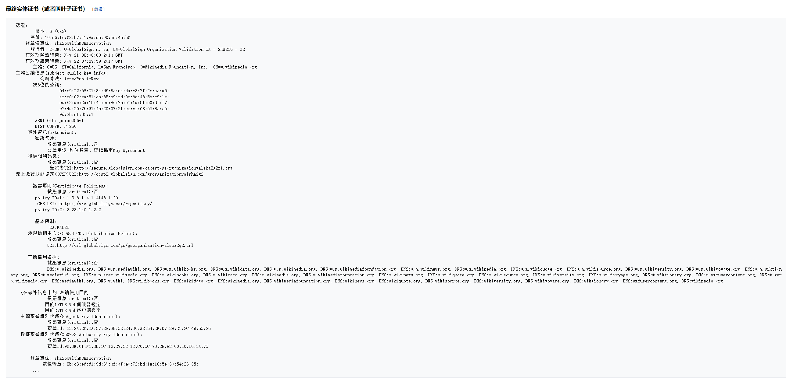
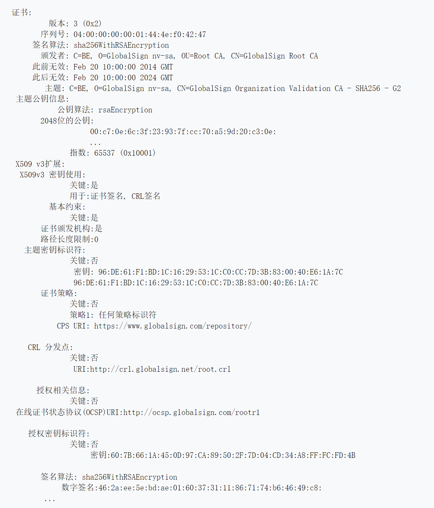
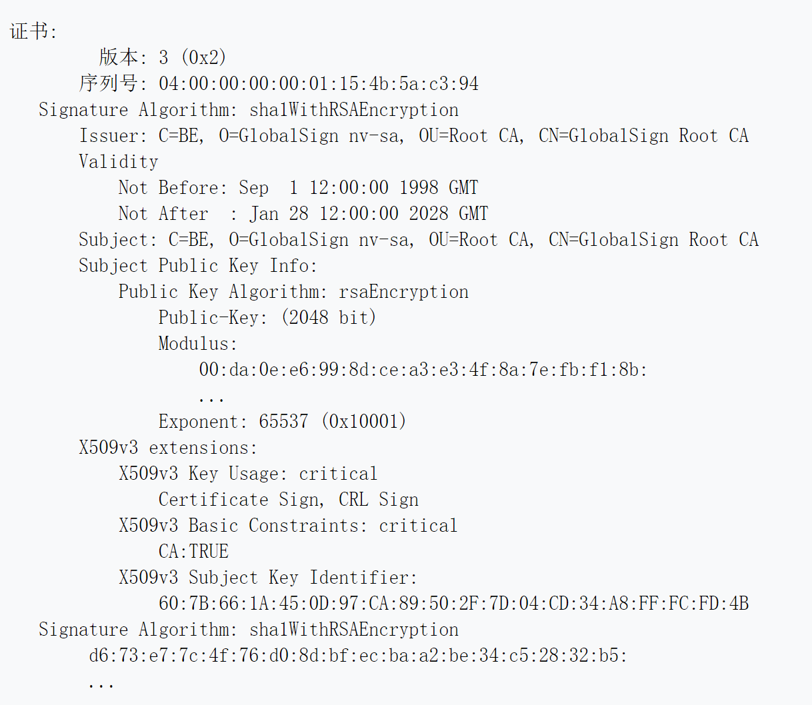

密码学里公钥证书的格式标准。应用场景多。X.509证书里面含有公钥、身份信息（网络主机名、组织的名称或个体名称）和签名信息(可以是证书签发机构CA的签名，也可以是自签名)。X.509还附带了证书吊销列表和用于从最终对证书进行签名的证书签发机构直到最终可信点为止的证书合法性验证算法。X.509是ITU-T标准化部门基于他们之前的ASN.1定义的一套证书标准。
# 历史及使用情况
X.509与X.500一起发布于1988年7.3日。它假设有一套严格的层次化的证书颁发机构(CA)。X.500系统仅有主权国家实施，以实现国家身份信息共享条约的实施目的。而IETF的公钥基础设施(X.509)简称PKIX工作组将该标准制定成适用于更灵活的互联网组织。而且事实上，X.509认证指的是RFC5180里定义的X.509 V3，包括对IETF的PKIX证书和证书吊销列表。通常也称为公钥基础设施(PKI)。
# 证书
在X.509里，组织机构通过发起证书签名请求(CSR)来得到一份签名的证书。首先需要生成对密钥对，然后用其中的私钥对CSR进行数码签署(签名)，并安全的保存私钥。CSR进而包含有请求发起者的身份信息、用来对此请求进行验证的公钥以及所请求证书专有名称。CSR里还可能带有CA要求的其他有关身份证明的信息。然后CA对这个CSR进行签名。组织机构可以把受信的根证书分发给所有的成员，这样就可以使用公司的PKI系统了。浏览器或者作业系统预装有可信任的根证书列表。所以主流CA发布的TLS证书都直接可以正常使用。浏览器的开发者直接影响着它的用户对CA的信任。X.509也定义了GRL实现标准。另一种检查合法性的方式是OCSP。
## 证书组成结构
证书组成结构标准用ASN.1(一种标注你的语言)来进行描述。X.509 V3数字证书结构如下:
- 证书
  - 版本号
  - 序列号
  - 签名算法
  - 颁发者
  - 证书有效期
    - 此日期前无效
    - 此日期后无效
  - 主题
  - 主题公钥信息
    - 公钥算法
    - 主题公钥
  - 颁发者唯一身份信息（可选项）
  - 主题唯一身份信息（可选项）
  - 扩展信息（可选项）
    - ...
- 证书签名算法
- 数字签名

所有扩展都有一个ID，由object identifier来表达，它是一个集合。并且有一个标记用于指示这个扩展是不是决定性的。证书使用时，如果发现一份证书带有决定性标记的扩展，而这个系统并不清楚该扩展的用途，那么要拒绝使用它。但对于非决定性扩展，不认识可以忽略。RFC 1422给出了V1的证书结构，ITU-T在V2里面增加了颁发者和主题唯一标识符，从而可以在一段时间后可以重用。重用的一个例子是当一个CA破产了，它的名称也在公共列表里清除掉了，一段时间之后另一个CA可以用相同的名称来注册，即使它于之前的没有任何关系。IETF不建议重用同名注册。V2在internet上没有大范围使用。V3引入了扩展，CA使用扩展来发布一份特定使用目的的证书。所有版本中，同一个CA颁发的证书序列号都必须是唯一的。

## 扩展指定了证书的用途
RFC5280及后续版本，定义了一些扩展来指定证书的用途。它们的多数都来源于join-iso-ccitt、ds、id-ce OID。在4.2.1里定义的几个常用扩展定义如下:
- Basic Constraints, { id-ce 19 }用于指定一份证书是不是一个CA证书;
- Key Usage, { id-ce 15 }指定了这份证书包含的公钥可以执行的密码操作。作为一个例子，它可以指定只能用于签名，而不能用来进行加密操作;
- Extended Key Usage, { id-ce 37 }典型用法是用于叶子证书中的公钥的使用目的。

通常情况下，一份证书由多个限制用途的扩展时，所有限制条件都应该满足才可以使用。RFC5280里有对一个同时含有keyUsage/extendedKeyUsage的证书的例子，这样的证书只能用在2个扩展中都指定了的用途。比如网络安全服务决定证书用途时会同时对这2个扩展进行判断。
## 证书文件扩展名
X.509有多种常用的扩展名。不过其中的一些还用与其他用途，也就是具有这个扩展名的文件可能并不是证书
- .pem 隐私增强型电子邮件格式，通常是Base64格式的;
- .cer，.crt，.der 通常是DER二进制格式的;
- .p7b, .p7c PKCS#7 signed data structure without data, just certificates or CRL
- .p12 PKCS#12格式，包含证书的同时可能还包含私钥
- .pfx PFX， PKCS#12之前的格式

PKCS#7是签名或者加密数据的格式标准，官方称为容器。
# 证书链和交叉认证
证书链(也就是RFC5280里的证书路径)是从终端使用者证书后跟着一系列的CA证书，而通常最后一个是自签名者证书，并且有如下关系:
- 在证书链上除最后一个证书外，证书颁发者等于其后一个证书的主题
- 除了最后一个证书，每个证书都是由其后的一个证书签名的;
- 最后的证书是信任主题，由于是通过可信过程得到的，你可以信任它.

证书链用于检查目标证书（证书链的第一个证书）里的公钥及其它数据是否属于其主题。用证书链中的下一个证书的公钥来验证它的签名，一直检查到证书链的尾端，如果所有验证都成功通过，那么这个证书就是可信的。下面是对RFC5280里定义的证书路径合法性算法的一个简要介绍，包括对证书的有效期，CRL等其他额外的检查。对于具体的证书来说，它可能存在于很不一样的2条或者多条证书链中，且都是合法的。因为CA证书可以来自多个颁发者，或者来自相同颁发者但用不同的私钥签发，这样在CA证书上会出现分叉，从而可以出现多条证书链。这也是PKI之间交叉认证和其他应用的关键所在。看下面的例子，下面的2个图中，方块代表证书，加黑的是证书的主题的名字，A->B表示A是有B签发的，也就是A是由B中年所载公钥对应的私钥签署的，相同颜色的证书具有相同的公钥。
- 例子1：2个PKI之间的根证书交叉认证

为了让PKI2的用户证书也得到PKI1的信任，CA1生成一个包含CA2公钥的证书cert2.1 这时候cert2和cert2.1据有相同的主题以及公钥，cert2.2就有了2条合法的证书链.
- 例子2: CA证书更新

为了证书颁发者从旧的私钥顺利的转移到新的私钥，他可以颁发2个证书，其中一个是新的私钥对旧的公钥进行签名，另一个是旧的私钥对新的公钥的签名，这2个都是机构自己给自己颁发的证书，但都不是自签名证书，另外还存在新旧2个自签名证书。

# X.509证书样例
下面是GlobalSign颁发的用于wikipedia.org以及一些其他Wikipedia网站的X.509证书，证书颁发者填在颁发者字段，主题内容里是组织机构的描述，主题备用名称是那些采用该证书的服务器的主机名，主题密钥里的信息表明采用的是椭圆曲线公钥密钥，位于最后的签名算法表示它是由GlobalSign用其私钥并采用带RSA加密的SHA-256算法进行签名的。

要验证这个证书，我们需要一个跟该证书颁发者及授权密钥标识符都匹配的中间证书

|1|2|
|:---|:---|
|颁发者|C=BE, O=GlobalSign nv-sa, CN=GlobalSign Organization Validation CA - SHA256 - G2|
|授权密钥标识符|96:DE:61:F1:BD:1C:16:29:53:1C:C0:CC:7D:3B:83:00:40:E6:1A:7C|

配置正确的服务器可以在TLS连接建立的握手阶段同时提供其中间证书。但是也有可能需要根据证书里颁发者的URL去取得中间证书。
下面是证书颁发机构的证书示例。该证书是由下例根证书签名的用于颁发上例最终实体证书的证书。当然它的主题标识符跟上例证书的授权密钥标识符是相匹配的。

下面是证书颁发机构的自签名根证书。它的颁发者和主题是相同的，可以用自身的公钥进行合法认证。证书认证过程也将在此终止。如果应用已经在它的可信公钥存贮里已经含有该公钥证书，那么TLS连接时的那个最终实体证书是可信的，否则就是不可信的。

