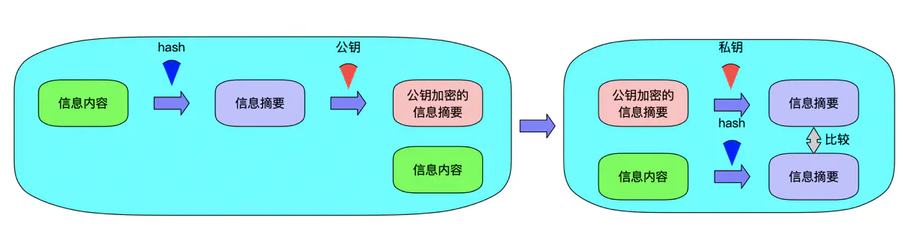
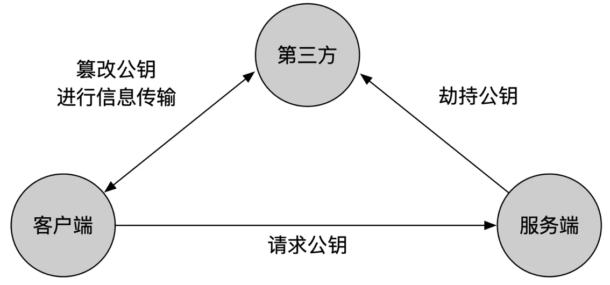
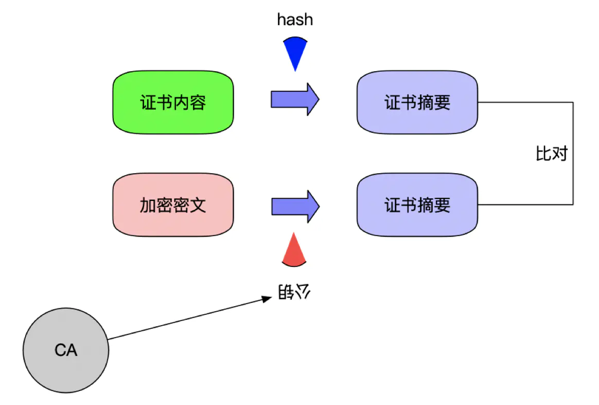
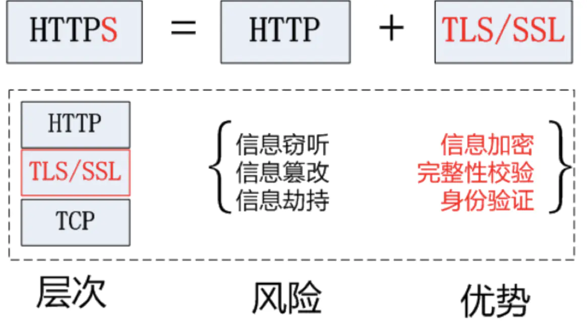
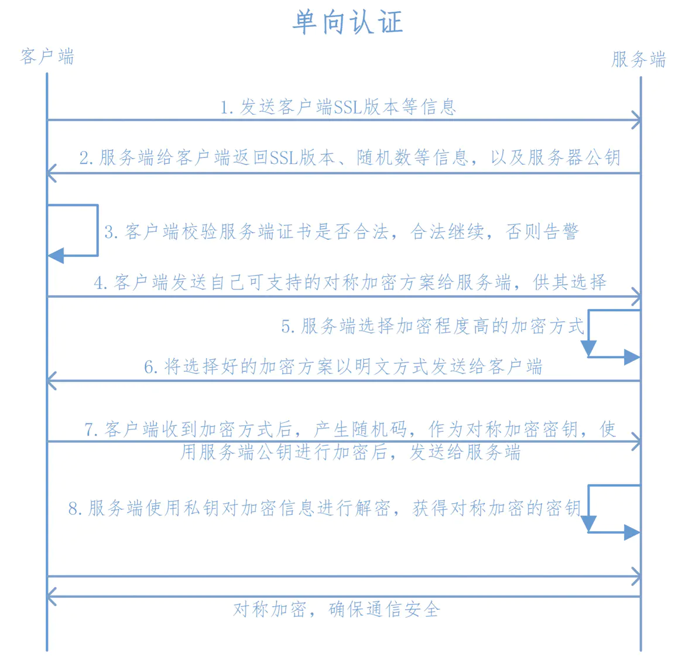
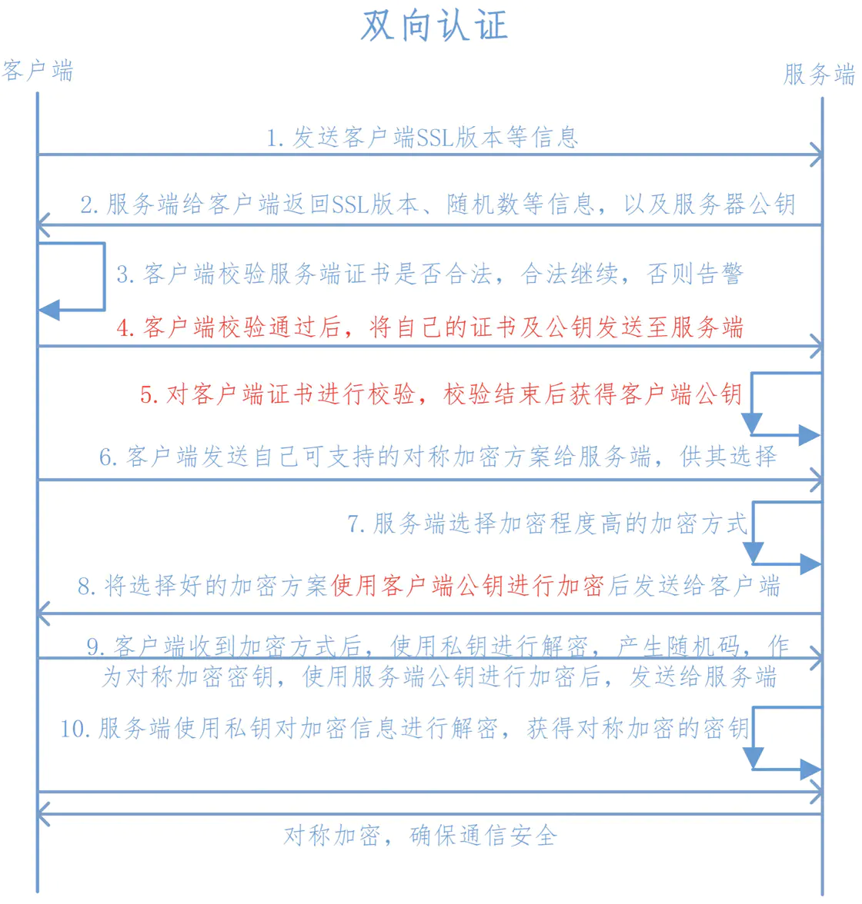

# 对称加密
通信双方的密钥相同，双方怎么获得相同的密钥。对称加密算法DES、3DES、AES。
# 非对称加密
公开密钥加密，公私钥机制。公钥是对外开放的，私钥自己拥有，公钥机密的数据，只能私钥解密。私钥加密的数据，只能用公钥解密。

- 信息的保密性
- 信息的完整性
- 身份识别

# 信息的保密性(机密算法)
信息的保密性我们可以使用对称加密和非对称加密来完成，使用对称加密来完成，速度相对非对称加密很快，但是存在一个安全问题，密钥如何传递？由此通用的方法是使用非对称加密+对称加密来完成。客户端使用公钥对对称加密的密钥进行加密，然后传递给服务端，服务端使用私钥进行解密确认密钥，开始传输数据。

# 信息的完整性(数字签名)
信息传输的途中，信息有可能被第三方劫持篡改，需要保证信息的完整性。通用方法是使用散列算法SHA1，MD5将传输内容hash一次获得hash值，即摘要。客户端使用服务端的公钥对摘要和信息内容进行加密，然后传输给服务端，服务端使用私钥进行解密获得原始内容和摘要值，服务端使用相同的hash算法对原始内容进行hash，然后与摘要值比对，如果一致，说明信息是完整的。

# 身份识别(数字证书)
在信息传输的过程中，通常需要验证信息的发送方的身份。这时，把发送端的公钥发送给接收端，发送端通过把自己的内容使用私钥加密然后发送给接收端，接收端只能用发送端的公钥解密，自然就验证了发送端的身份。

# 数字证书
传输的过程中，客户端如何获得服务器端的公钥呢？是服务端分发给客户端的，如果一开始服务端发送的公钥到客户端的过程中有可能被第三方劫持，然后第三方自己伪造一对密钥，将公钥发送给客户端，当服务器发送数据给客户端的时候，中间人将信息进行劫持，用一开始劫持的公钥进行解密后，然后使用自己的私钥将数据加密发送给客户端，而客户端收到后使用公钥解密，反过来也是如此，整个过程中间人是透明的。

为防止这么情况，数字证书出现了，就是私钥加密数据，公钥解密来验证其身份。
数字证书是由权威的CA机构给服务端进行颁发。CA机构通过服务端提供的相关信息生成证书，证书内包含了持有人的相关信息，服务器的公钥，签署者签名信息等，最重要的公钥再数字证书中。数字证书是如何保证公钥来自请求的服务器内。数字证书上有持有人的相关信息，可以确定不是一个中间人，证书如何保证为真，一个证书中含有3个部分:
- 证书内容
- 散列算法
- 加密密文

证书内容会被散列算法hash计算出hash值，然后使用CA机构提供的私钥进行RSA加密。

当客户端发起请求时，服务器将该数字证书发送给客户端，客户端通过CA机构提供的公钥对加密密文进行解密获得散列值(数字签名)，同时将证书内容使用相同的散列算法进行hash得到另一个散列值，对比2个散列值。相同则说明证书没问题。

一些常见的证书文件类型:
- X.509#DER，二进制格式证书，常用后缀cer.crt
- X.509#PEM，文本格式证书，常用后缀.pem
- 有的证书内容只包含公钥，如.crt、.cer、.pem
- 有的证书内容只包含公钥，如.pfx、.p12

# HTTPS/TLS/SSL
Hyper Text Transfer Protocol over Secure Socket Layer，安全的超文本传输协议，默认TCP端口时443
TLS， Transport Layer Security，传输层安全协议，2个应用程序之间提供保密性和数据完整性
SSL，Secure Socket Layer，安全套接字层，位于可靠的面向连接的网络层协议和应用层协议之间的一种协议层。SSL通过互相认证、使用数字签名确保完整性、使用加密确保私密性，以实现客户端和服务端之间的安全通信。SSL协议用到对称加密也用到非对称加密。在建立传输链路时，SSL首先对对称加密的密钥使用公钥进行非对称加密，链路建立好后，SSL对传输内容使用对称加密。

Https在建立Socket连接之前，需要进行握手，具体过程如下:

1. 客户端向服务端发送SSL协议版本号、加密算法种类、随机数等信息;
2. 服务端给客户端返回SSL协议版本号、加密算法种类、随机数等信息，同时也返回服务器端的证书，即公钥证书;
3. 客户端使用服务端返回的信息验证服务器的合法性，包括：
   - 证书是否过期;
   - 发行服务器证书的CA是否可靠;(通过查询浏览器或本机内的CA证书)
   - 返回的公钥是否能正确解开返回证书中的数字签名;（通过使用本机或浏览器内置的CA公钥进行解密）
   - 服务器证书上的域名是否和服务器的实际域名相匹配;
   - 验证通过后，将继续进行通信，否则，终止通信;
4. 客户端向服务端发送自己所能支持的对称加密方案，供服务器端进行选择;
5. 服务器端在客户端提供的加密方案中选择加密程度最高的加密方式;
6. 服务器将选择好的加密方案通过明文方式返回给客户端;
7. 客户端接收到服务端返回的加密方式后，使用该加密方式生成产生随机码，用作通信过程中对称加密的密钥，使用服务端返回的公钥进行加密，将加密后的随机码发送至服务器;
8. 服务器收到客户端返回的加密信息后，使用自己的私钥进行解密，获取对称加密密钥;
   在接下来的会话中，服务器和客户端将会使用该密码进行对称加密，保证通信过程中信息的安全;

双向认证和单向认证类似，它额外增加了服务端对客户端的认证：

1. 客户端向服务端发送SSL协议版本号、加密算法种类、随机数等信息;
2. 服务端给客户端返回SSL协议版本号、加密算法种类、随机数等信息，同时也返回服务器端的证书，即公钥证书;
3. 客户端使用服务端返回的信息验证服务器的合法性，包括：
   - 证书是否过期;
   - 发行服务器证书的CA是否可靠;(通过查询浏览器或本机内的CA证书)
   - 返回的公钥是否能正确解开返回证书中的数字签名;（通过使用本机或浏览器内置的CA公钥进行解密）
   - 服务器证书上的域名是否和服务器的实际域名相匹配;
   - 验证通过后，将继续进行通信，否则，终止通信;
4. 服务端要求客户端发送客户端的证书即客户端证书公钥，客户端会将自己的证书发送至服务端；
5. 验证客户端的证书，通过验证后，会获得客户端的公钥；
6. 客户端向服务端发送自己所能支持的对称加密方案，供服务器端进行选择
7. 服务器端在客户端提供的加密方案中选择加密程度最高的加密方式;
8. 将加密方案通过使用之前获取到的公钥进行加密，返回给客户端
9. 客户端收到服务端返回的加密方案密文后，使用自己的私钥进行解密，获取具体加密方式，而后，产生该加密方式的随机码，用作加密过程中的密钥，使用之前从服务端证书中获取到的公钥进行加密后，发送给服务端；
10. 服务端收到客户端发送的消息后，使用自己的私钥进行解密，获取对称加密的密钥，在接下来的会话中，服务器和客户端将会使用该密码进行对称加密，保证通信过程中信息的安全；
