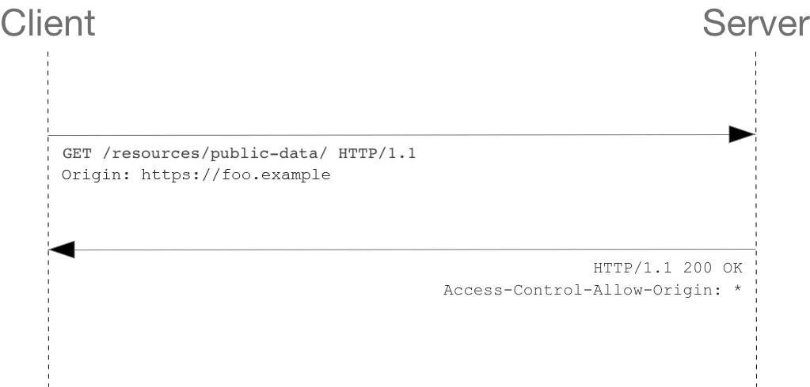
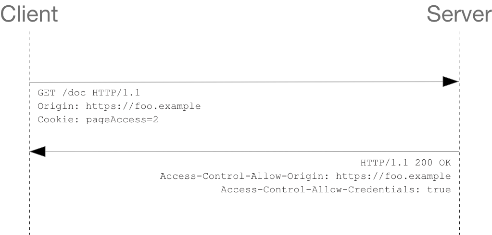

跨源资源共享(CORS)是一种基于HTTP标头的机制，允许服务器指示除其自身之外的任何来源(域、schema或port)，浏览器应允许这些源从服务器加载资源。CORS还依赖于一种机制，浏览器通过该机制向托管跨源资源的服务器发出“预检”请求，以检查服务器是否允许实际请求。在该预检请求中中，浏览器发送表明HTTP方法与将在实际请求中使用的标头。跨源HTTP请求的一个例子: 运行在`https://domain-a.com`的JavaScript代码使用`XMLHttpRequest`来发起一个到`https://domain-b.com/data.json`的请求。出于安全性，浏览器限制脚本内发起的跨源HTTP请求。例如，`XMLHttpRequest`和`Fetch API`遵循同源策略。这意味着使用这些API的Web应用程序只能从加载应用程序的同一个域请求HTTP资源，除非响应报文包含了正确CORS响应头。

CORS机制允许Web应用服务器进行跨源访问控制，从而使跨源数据传输得以安全进行。现代浏览器支持在API容器(JS)中（例如`XMLHttpRequest`或`Fetch`）使用CORS，以降低跨源HTTP请求所带来的风险。
# 什么情况下需要CORS
- 前文提到的由`XMLHttpRequest`或`Fetch API`发起的跨源HTTP请求。
- Web 字体（CSS中通过`@font-face`使用跨源字体资源），因此，网站就可以发布TrueType字体资源，并只允许已授权网站进行跨站调用。
- WebGL 贴图。
- 使用`drawImage()`将图片或视频画面绘制到canvas。
- 来自图像的CSS图形 (en-US)。
  
# 功能概述
跨源资源共享标准新增了一组 HTTP 标头字段，允许服务器声明哪些源站通过浏览器有权限访问哪些资源。另外，规范要求，对那些可能对服务器数据产生副作用的 HTTP 请求方法（特别是 GET 以外的 HTTP 请求，或者搭配某些 MIME 类型的 POST 请求），浏览器必须首先使用 OPTIONS 方法发起一个预检请求（preflight request），从而获知服务端是否允许该跨源请求。服务器确认允许之后，才发起实际的 HTTP 请求。在预检请求的返回中，服务器端也可以通知客户端，是否需要携带身份凭证（例如 Cookie 和 HTTP 认证相关数据）。CORS请求失败会产生错误，但是为了安全，在JavaScript代码层面无法获知到底具体是哪里出了问题。你只能查看浏览器的控制台以得知具体是哪里出现了错误。接下来的内容将讨论相关场景，并剖析该机制所涉及的HTTP标头字段。
# 若干访问控制场景
这里，我们使用三个场景来解释跨源资源共享机制的工作原理。这些例子都使用在任意所支持的浏览器上都可以发出跨域请求的`XMLHttpRequest`对象。
## 简单请求
某些请求不会触发CORS预检请求。在废弃的CORS规范中称这样的请求为简单请求，但是目前的Fetch规范（CORS的现行定义规范）中不再使用这个词语。其动机是，HTML4.0 中的\<form>元素（早于跨站`XMLHttpRequest`和`fetch`）可以向任何来源提交简单请求，所以任何编写服务器的人一定已经在保护跨站请求伪造攻击（CSRF）。在这个假设下，服务器不必选择加入（通过响应预检请求）来接收任何看起来像表单提交的请求，因为 CSRF 的威胁并不比表单提交的威胁差。然而，服务器仍然必须提供 Access-Control-Allow-Origin的选择，以便与脚本共享响应。若请求满足所有下述条件，则该请求可视为简单请求：
- 使用下列方法: GET\HEAD\POST
- 除了被用户代理自动设置的标头字段（例如 Connection、User-Agent 或其他在 Fetch 规范中定义为禁用标头名称的标头），允许人为设置的字段为Fetch规范定义的对CORS安全的标头字段集合。该集合为：Accept、Accept-Language、Content-Language、Content-Type、Range
- Content-Type标头所指定的媒体类型的值仅限于下列三者之一: text/plain、multipart/form-data、application/x-www-form-urlencoded
- 如果请求是使用`XMLHttpRequest`对象发出的，在返回的`XMLHttpRequest.upload`对象属性上没有注册任何事件监听器；也就是说，给定一个 XMLHttpRequest 实例 xhr，没有调用 xhr.upload.addEventListener()，以监听该上传请求。
- 请求中没有使用 ReadableStream 对象。

比如说，假如站点 https://foo.example 的网页应用想要访问 https://bar.other 的资源。foo.example 的网页中可能包含类似于下面的 JavaScript 代码：
```javascript
const xhr = new XMLHttpRequest();
const url = "https://bar.other/resources/public-data/";

xhr.open("GET", url);
xhr.onreadystatechange = someHandler;
xhr.send();
```
此操作实行了客户端和服务器之间的简单交换，使用CORS标头字段来处理权限：

以下是浏览器发送给服务器的请求报文：
```http
GET /resources/public-data/ HTTP/1.1
Host: bar.other
User-Agent: Mozilla/5.0 (Macintosh; Intel Mac OS X 10.14; rv:71.0) Gecko/20100101 Firefox/71.0
Accept: text/html,application/xhtml+xml,application/xml;q=0.9,*/*;q=0.8
Accept-Language: en-us,en;q=0.5
Accept-Encoding: gzip,deflate
Connection: keep-alive
Origin: https://foo.example
```
请求标头字段Origin表明该请求来源于http://foo.example。让我们来看看服务器如何响应：
```http
HTTP/1.1 200 OK
Date: Mon, 01 Dec 2008 00:23:53 GMT
Server: Apache/2
Access-Control-Allow-Origin: *
Keep-Alive: timeout=2, max=100
Connection: Keep-Alive
Transfer-Encoding: chunked
Content-Type: application/xml
[…XML Data…]
```
本例中，服务端返回的`Access-Control-Allow-Origin`标头的`Access-Control-Allow-Origin: *`值表明，该资源可以被任意外源访问。使用 Origin 和 Access-Control-Allow-Origin 就能完成最简单的访问控制。如果 https://bar.other 的资源持有者想限制他的资源只能通过 https://foo.example 来访问（也就是说，非 https://foo.example 域无法通过跨源访问访问到该资源），他可以这样做：`Access-Control-Allow-Origin: https://foo.example`。备注： 当响应的是附带身份凭证的请求时，服务端必须明确Access-Control-Allow-Origin的值，而不能使用通配符“*”。
## 预检请求
与简单请求不同，“需预检的请求”要求必须首先使用 OPTIONS 方法发起一个预检请求到服务器，以获知服务器是否允许该实际请求。"预检请求“的使用，可以避免跨域请求对服务器的用户数据产生未预期的影响。如下是一个需要执行预检请求的 HTTP 请求：
```javascript
const xhr = new XMLHttpRequest();
xhr.open("POST", "https://bar.other/resources/post-here/");
xhr.setRequestHeader("X-PINGOTHER", "pingpong");
xhr.setRequestHeader("Content-Type", "application/xml");
xhr.onreadystatechange = handler;
xhr.send("<person><name>Arun</name></person>");
```
上面的代码使用 POST 请求发送一个 XML 请求体，该请求包含了一个非标准的 HTTP X-PINGOTHER 请求标头。这样的请求标头并不是 HTTP/1.1 的一部分，但通常对于 web 应用很有用处。另外，该请求的 Content-Type 为 application/xml，且使用了自定义的请求标头，所以该请求需要首先发起“预检请求”

如下所述，实际的 POST 请求不会携带 Access-Control-Request-* 标头，它们仅用于 OPTIONS 请求。下面是服务端和客户端完整的信息交互。首次交互是预检请求/响应：
```http
OPTIONS /doc HTTP/1.1
Host: bar.other
User-Agent: Mozilla/5.0 (Macintosh; Intel Mac OS X 10.14; rv:71.0) Gecko/20100101 Firefox/71.0
Accept: text/html,application/xhtml+xml,application/xml;q=0.9,*/*;q=0.8
Accept-Language: en-us,en;q=0.5
Accept-Encoding: gzip,deflate
Connection: keep-alive
Origin: https://foo.example
Access-Control-Request-Method: POST
Access-Control-Request-Headers: X-PINGOTHER, Content-Type

HTTP/1.1 204 No Content
Date: Mon, 01 Dec 2008 01:15:39 GMT
Server: Apache/2
Access-Control-Allow-Origin: https://foo.example
Access-Control-Allow-Methods: POST, GET, OPTIONS
Access-Control-Allow-Headers: X-PINGOTHER, Content-Type
Access-Control-Max-Age: 86400
Vary: Accept-Encoding, Origin
Keep-Alive: timeout=2, max=100
Connection: Keep-Alive
```
从上面的报文中，我们看到，第 1 - 10 行使用 OPTIONS 方法发送了预检请求，浏览器根据上面的 JavaScript 代码片断所使用的请求参数来决定是否需要发送，这样服务器就可以回应是否可以接受用实际的请求参数来发送请求。OPTIONS 是 HTTP/1.1 协议中定义的方法，用于从服务器获取更多信息，是安全的方法。该方法不会对服务器资源产生影响。注意 OPTIONS 预检请求中同时携带了下面两个标头字段：
```http
Access-Control-Request-Method: POST
Access-Control-Request-Headers: X-PINGOTHER, Content-Type
```
标头字段 Access-Control-Request-Method 告知服务器，实际请求将使用 POST 方法。标头字段 Access-Control-Request-Headers 告知服务器，实际请求将携带两个自定义请求标头字段：X-PINGOTHER 与 Content-Type。服务器据此决定，该实际请求是否被允许。第 12 - 21 行为预检请求的响应，表明服务器将接受后续的实际请求方法（POST）和请求头（X-PINGOTHER）。重点看第 15 - 18 行：
```http
Access-Control-Allow-Origin: https://foo.example
Access-Control-Allow-Methods: POST, GET, OPTIONS
Access-Control-Allow-Headers: X-PINGOTHER, Content-Type
Access-Control-Max-Age: 86400
```
服务器的响应携带了 Access-Control-Allow-Origin: https://foo.example，从而限制请求的源域。同时，携带的 Access-Control-Allow-Methods 表明服务器允许客户端使用 POST 和 GET 方法发起请求（与 Allow 响应标头类似，但该标头具有严格的访问控制）。标头字段 Access-Control-Allow-Headers 表明服务器允许请求中携带字段 X-PINGOTHER 与 Content-Type。与 Access-Control-Allow-Methods 一样，Access-Control-Allow-Headers 的值为逗号分割的列表。最后，标头字段 Access-Control-Max-Age 给定了该预检请求可供缓存的时间长短，单位为秒，默认值是 5 秒。在有效时间内，浏览器无须为同一请求再次发起预检请求。以上例子中，该响应的有效时间为 86400 秒，也就是 24 小时。请注意，浏览器自身维护了一个最大有效时间，如果该标头字段的值超过了最大有效时间，将不会生效。
```http
POST /doc HTTP/1.1
Host: bar.other
User-Agent: Mozilla/5.0 (Macintosh; Intel Mac OS X 10.14; rv:71.0) Gecko/20100101 Firefox/71.0
Accept: text/html,application/xhtml+xml,application/xml;q=0.9,*/*;q=0.8
Accept-Language: en-us,en;q=0.5
Accept-Encoding: gzip,deflate
Connection: keep-alive
X-PINGOTHER: pingpong
Content-Type: text/xml; charset=UTF-8
Referer: https://foo.example/examples/preflightInvocation.html
Content-Length: 55
Origin: https://foo.example
Pragma: no-cache
Cache-Control: no-cache

<person><name>Arun</name></person>

HTTP/1.1 200 OK
Date: Mon, 01 Dec 2008 01:15:40 GMT
Server: Apache/2
Access-Control-Allow-Origin: https://foo.example
Vary: Accept-Encoding, Origin
Content-Encoding: gzip
Content-Length: 235
Keep-Alive: timeout=2, max=99
Connection: Keep-Alive
Content-Type: text/plain

[Some XML payload]
```
### 预检请求与重定向
并不是所有浏览器都支持预检请求的重定向。如果一个预检请求发生了重定向，一部分浏览器将报告错误：
>The request was redirected to 'https://example.com/foo', which is disallowed for cross-origin requests that require preflight.Request requires preflight, which is disallowed to follow cross-origin redirects.

CORS最初要求浏览器具有该行为，不过在后续的修订中废弃了这一要求。但并非所有浏览器都实现了这一变更，而仍然表现出最初要求的行为。在浏览器的实现跟上规范之前，有两种方式规避上述报错行为：
- 在服务端去掉对预检请求的重定向；
- 将实际请求变成一个简单请求。

如果上面两种方式难以做到，我们仍有其他办法：
- 发出一个简单请求（使用 Response.url (en-US) 或 XMLHttpRequest.responseURL）以判断真正的预检请求会返回什么地址。
- 发出另一个请求（真正的请求），使用在上一步通过 Response.url 或 XMLHttpRequest.responseURL 获得的 URL。
  
不过，如果请求是由于存在 Authorization 字段而引发了预检请求，则这一方法将无法使用。这种情况只能由服务端进行更改。
## 附带身份凭证的请求
当发出跨源请求时，第三方cookie策略仍将适用。无论如何改变本章节中描述的服务器和客户端的设置，该策略都会强制执行。`XMLHttpRequest`或`Fetch`与CORS的一个有趣的特性是，可以基于HTTP cookies和HTTP 认证信息发送身份凭证。一般而言，对于跨源`XMLHttpRequest`或`Fetch`请求，浏览器不会发送身份凭证信息。如果要发送凭证信息，需要设置`XMLHttpRequest`对象的某个特殊标志位，或在构造`Request`对象时设置。本例中，https://foo.example 的某脚本向 https://bar.other 发起一个 GET 请求，并设置 Cookies。在 foo.example 中可能包含这样的 JavaScript 代码：
```javascript
const invocation = new XMLHttpRequest();
const url = "https://bar.other/resources/credentialed-content/";
function callOtherDomain() {
  if (invocation) {
    invocation.open("GET", url, true);
    invocation.withCredentials = true;
    invocation.onreadystatechange = handler;
    invocation.send();
  }
}
```
第7行将`XMLHttpRequest`的withCredentials标志设置为true，从而向服务器发送Cookies。因为这是一个简单GET请求，所以浏览器不会对其发起“预检请求”。但是，如果服务器端的响应中未携带Access-Control-Allow-Credentials: true，浏览器将不会把响应内容返回给请求的发送者。

```http
GET /resources/credentialed-content/ HTTP/1.1
Host: bar.other
User-Agent: Mozilla/5.0 (Macintosh; Intel Mac OS X 10.14; rv:71.0) Gecko/20100101 Firefox/71.0
Accept: text/html,application/xhtml+xml,application/xml;q=0.9,*/*;q=0.8
Accept-Language: en-us,en;q=0.5
Accept-Encoding: gzip,deflate
Connection: keep-alive
Referer: https://foo.example/examples/credential.html
Origin: https://foo.example
Cookie: pageAccess=2

HTTP/1.1 200 OK
Date: Mon, 01 Dec 2008 01:34:52 GMT
Server: Apache/2
Access-Control-Allow-Origin: https://foo.example
Access-Control-Allow-Credentials: true
Cache-Control: no-cache
Pragma: no-cache
Set-Cookie: pageAccess=3; expires=Wed, 31-Dec-2008 01:34:53 GMT
Vary: Accept-Encoding, Origin
Content-Encoding: gzip
Content-Length: 106
Keep-Alive: timeout=2, max=100
Connection: Keep-Alive
Content-Type: text/plain
```
即使第 10 行指定了 Cookie 是属于 https://bar.other 的内容的，但是，如果 https://bar.other 的响应中缺失 Access-Control-Allow-Credentials: true（第 16 行），则响应内容会被忽略，不会提供给 web 内容。
### 预检请求和凭据
CORS 预检请求不能包含凭据。预检请求的响应必须指定 Access-Control-Allow-Credentials: true 来表明可以携带凭据进行实际的请求。
## 附带身份凭证的请求与通配符
在响应附带身份凭证的请求时:
- 服务器不能将`Access-Control-Allow-Origin`的值设为通配符“*”，而应将其设置为特定的域，如：Access-Control-Allow-Origin: https://example.com。
- 服务器不能将`Access-Control-Allow-Headers`的值设为通配符“*”，而应将其设置为标头名称的列表，如：Access-Control-Allow-Headers: X-PINGOTHER, Content-Type
- 服务器不能将 Access-Control-Allow-Methods 的值设为通配符“*”，而应将其设置为特定请求方法名称的列表，如：Access-Control-Allow-Methods: POST, GET

对于附带身份凭证的请求（通常是 Cookie），这是因为请求的标头中携带了Cookie信息，如果 Access-Control-Allow-Origin 的值为“*”，请求将会失败。而将 Access-Control-Allow-Origin 的值设置为 https://example.com，则请求将成功执行。另外，响应标头中也携带了Set-Cookie 字段，尝试对 Cookie 进行修改。如果操作失败，将会抛出异常。
### 第三方 cookie
注意在 CORS 响应中设置的 cookie 适用一般性第三方 cookie 策略。在上面的例子中，页面是在 foo.example 加载，但是第 19 行的 cookie 是被 bar.other 发送的，如果用户设置其浏览器拒绝所有第三方 cookie，那么将不会被保存。请求中的 cookie（第 10 行）也可能在正常的第三方 cookie 策略下被阻止。因此，强制执行的 cookie 策略可能会使本节描述的内容无效（阻止你发出任何携带凭据的请求）。Cookie 策略受 SameSite 属性控制。

# HTTP 响应标头字段
本节列出了服务器为访问控制请求返回的 HTTP 响应头，这是由跨源资源共享规范定义的。上一小节中，我们已经看到了这些标头字段在实际场景中是如何工作的。
## Access-Control-Allow-Origin
响应标头中可以携带一个 Access-Control-Allow-Origin 字段，其语法如下：`Access-Control-Allow-Origin: <origin> | *`，Access-Control-Allow-Origin 参数指定了单一的源，告诉浏览器允许该源访问资源。或者，对于不需要携带身份凭证的请求，服务器可以指定该字段的值为通配符“*”，表示允许来自任意源的请求。例如，为了允许来自 https://mozilla.org 的代码访问资源，你可以指定：
```http
Access-Control-Allow-Origin: https://mozilla.org
Vary: Origin
```
如果服务端指定了具体的单个源（作为允许列表的一部分，可能会根据请求的来源而动态改变）而非通配符“*”，那么响应标头中的 Vary 字段的值必须包含 Origin。这将告诉客户端：服务器对不同的 Origin 返回不同的内容。
## Access-Control-Expose-Headers
译者注：在跨源访问时，XMLHttpRequest 对象的 getResponseHeader() 方法只能拿到一些最基本的响应头，Cache-Control、Content-Language、Content-Type、Expires、Last-Modified、Pragma，如果要访问其他头，则需要服务器设置本响应头。Access-Control-Expose-Headers 头将指定标头放入允许列表中，供浏览器的 JavaScript 代码（如 getResponseHeader()）获取。
```http
Access-Control-Expose-Headers: <header-name>[, <header-name>]*
```
## Access-Control-Max-Age
Access-Control-Max-Age 头指定了 preflight 请求的结果能够被缓存多久，请参考本文在前面提到的 preflight 例子。`Access-Control-Max-Age: <delta-seconds>`，delta-seconds 参数表示 preflight 预检请求的结果在多少秒内有效。
## Access-Control-Allow-Credentials
Access-Control-Allow-Credentials 头指定了当浏览器的 credentials 设置为 true 时是否允许浏览器读取 response 的内容。当用在对 preflight 预检测请求的响应中时，它指定了实际的请求是否可以使用 credentials。请注意：简单 GET 请求不会被预检；如果对此类请求的响应中不包含该字段，这个响应将被忽略掉，并且浏览器也不会将相应内容返回给网页。
## Access-Control-Allow-Methods
Access-Control-Allow-Methods 标头字段指定了访问资源时允许使用的请求方法，用于预检请求的响应。其指明了实际请求所允许使用的 HTTP 方法。`Access-Control-Allow-Methods: <method>[, <method>]*`
## Access-Control-Allow-Headers
Access-Control-Allow-Headers 标头字段用于预检请求的响应。其指明了实际请求中允许携带的标头字段。这个标头是服务器端对浏览器端 Access-Control-Request-Headers 标头的响应。`Access-Control-Allow-Headers: <header-name>[, <header-name>]*`

# HTTP 请求标头字段
本节列出了可用于发起跨源请求的标头字段。请注意，这些标头字段无须手动设置。当开发者使用 XMLHttpRequest 对象发起跨源请求时，它们已经被设置就绪。
## Origin
`Origin`标头字段表明预检请求或实际跨源请求的源站。`Origin`参数的值为源站URL。它不包含任何路径信息，只是服务器名称。注意，在所有访问控制请求中，`Origin`标头字段总是被发送。
## Access-Control-Request-Method
`Access-Control-Request-Method`标头字段用于预检请求。其作用是，将实际请求所使用的HTTP方法告诉服务器。`Access-Control-Request-Method: <method>`
## Access-Control-Request-Headers
`Access-Control-Request-Headers`标头字段用于预检请求。其作用是，将实际请求所携带的标头字段(通过`setRequestHeader()`等设置的)告诉服务器。这个浏览器端标头将由互补的服务器端标头`Access-Control-Allow-Headers`回答。


