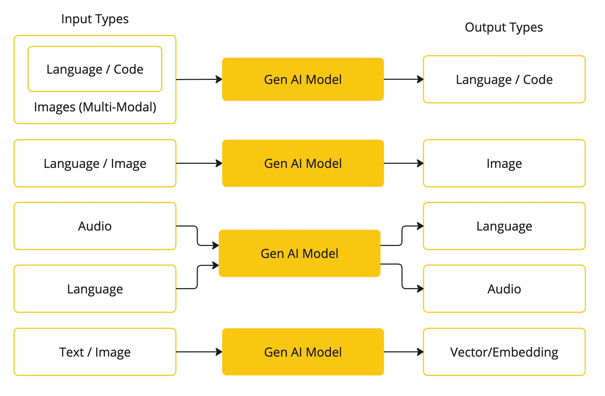

# Overview
Spring AI是一个AI引擎应用框架，它的目的是在AI领域应用Spring生态系统的设计准则，比如可移植性、模块化设计、使用POJO来提升AI领域设计。Spring AI解决了一个最基本的问题就是将你的企业应用的Data与API与AI模型连接起来。
- 支持多个AI厂商发布的API，支持Chat、文本生成图片与嵌入模型等
- 支持同步与流式的API
- 结构化输出
- 支持大部分的向量数据库

`Spring AI`项目就是把人工智能应用开发流程化，减少不必要的复杂性，就是简化涉及到AI的应用的开发流程。这个项目参考了一些重要的Python项目，比如LangChain与LlamaIndex等，但是Spring AI并不是这些项目的直接移植，这个项目建立在一个观点上即下一波的生成式AI应用不仅是面向Pythion开发者的而是跨语言的。因此，Spring AI解决了AI集成的基础问题: `Connecting your enterprise Data and APIs with the AI Models`.

Spring AI提供了很多用于开发AI应用的抽象，这些抽象有很多实现，只需要很少的编码变更就可以实现组件切换。Spring AI提供了以下的特性:
- 支持所有主流的大语言模型，比如OpenAI、Microsoft、Amazon、Google与Hugging Face等
- 支持的模型类型包括Chat、Text to Image、Audio Transcription、Text to Speech、Moderation以及更多
- 支持所有模型的API，支持阻塞与流式API，甚至支持使用特定模型的特定功能
- 将AI模型的输出映射为POJOs
- 支持所有主流的向量数据库，比如Apache Cassandra, Azure Vector Search, Chroma, Milvus, MongoDB Atlas, Neo4j, Oracle, PostgreSQL/PGVector, PineCone, Qdrant, Redis, and Weaviate
- 支持跨多个向量存储方案的可移植的API
- 函数调用
- 提供了AI模型与向量存储的Spring Boot自动配置与启动器
- 用于数据引擎的ETL框架

这些特性集可以让你实现一些常用的功能，比如`Q&A over your documentation`或者`Chat with your documentation`。
# AI Concepts
这一章节描述Spring AI使用的核心概念，建议仔细阅读理解这些概念背后Spring AI是如何实现的。
## Models
AI模型是一个算法，可以处理并生成信息，模仿的是人类的认知功能，通过学习大量数据的模式与含义，模型可以做出预测、生成文本或者其他的输出，增强跨行业的各种应用。有很多种不同类型的AI模型，针对的是特定的使用场景，ChatGPt的生成式AI能力生成文本，其他的模型还有各式各样的输入与输出，在ChatGPT之前，很多人对text-to-image生成模型感兴趣比如Midjourney与Stable Diffusion。下面你的表格基于模型的输入与输出类型做了模型的分类

Spring AI目前支持的模型可以处理输入与输出为language、image与audio的信息。上面表格中的最后一行，接受文本作为输入并输出向量，通常被称为嵌入文本，表示的是AI模型中使用的内部的数据结构，Spring AI支持嵌入向量所以可以支持更加高级的使用场景。GPT等模型的独特之处在于其预训练特性，正如GPT中的P所示——Chat Generative Pre-trained Transformer。这种预训练功能将AI转变为通用的开发工具，不需要广泛的机器学习或模型训练背景。
## Prompts
提示词是语言输入的基础，可指导AI模型产生特定输出。对于熟悉ChatGPT的人来说，提示词可能看起来只是输入到对话框中并发送到API的文本。然而，它包含的内容远不止这些。在许多 AI 模型中，提示词的文本不仅仅是一个简单的字符串。ChatGPT的API在一个提示词中有多个文本输入，每个文本输入都被分配一个角色。例如，系统角色会告诉模型如何操作并设置交互的上下文。用户角色通常是来自用户的输入。制作有效的提示词既是一门艺术，也是一门科学。ChatGPT是为人类对话而设计的。这与使用SQL之类的东西来"提问"大不相同。人们必须与AI模型进行交流，就像与另一个人交谈一样。这种互动方式非常重要，以至于"提示工程"一词已经成为一门学科。有越来越多的技术可以提高提示的有效性。花时间制作提示可以大大改善最终的输出。分享提示已经成为一种公共实践，学术界正在积极研究这一主题。作为创建有效提示（例如，与SQL形成对比）是多么违反直觉的一个例子，最近的一篇研究论文发现，您可以使用的最有效的提示之一以“深呼吸，一步一步地进行这项工作”这句话开头。这应该能让你明白为什么语言如此重要。我们还没有完全了解如何最有效地利用这项技术的先前版本，例如ChatGPT 3.5，更不用说正在开发的新版本了.
### Prompt Templates
## Embeddings
## Tokens

