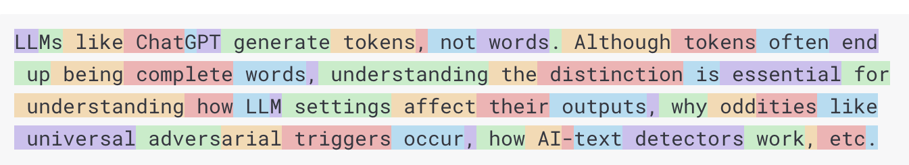
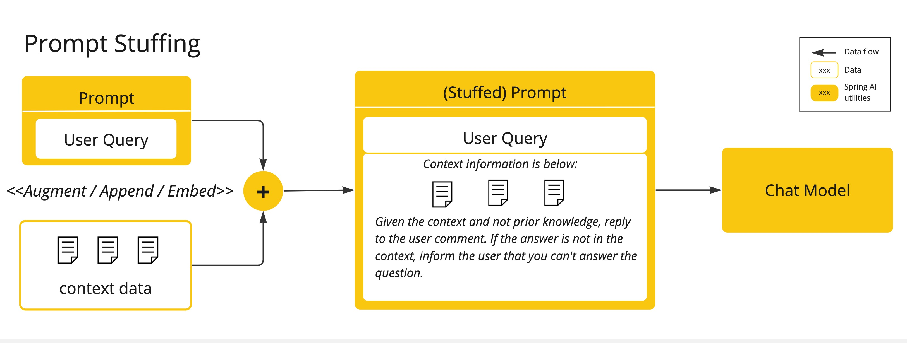
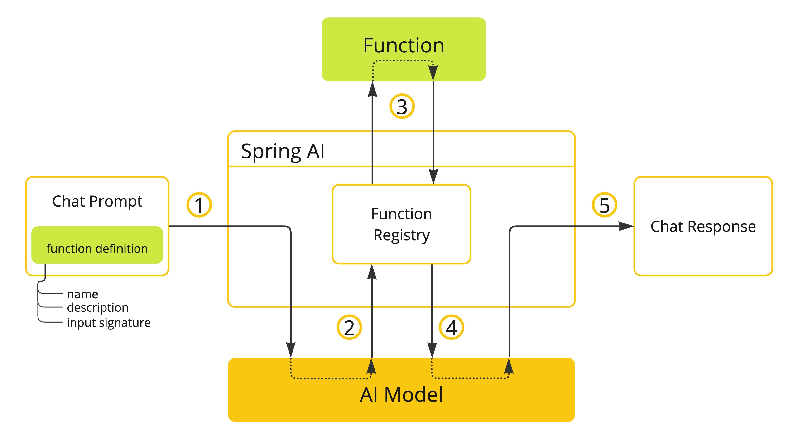

# Overview
Spring AI是一个AI引擎应用框架，它的目的是在AI领域应用Spring生态系统的设计准则，比如可移植性、模块化设计、使用POJO来提升AI领域设计。Spring AI解决了一个最基本的问题就是将你的企业应用的Data与API与AI模型连接起来。
- 支持多个AI厂商发布的API，支持Chat、文本生成图片与嵌入模型等
- 支持同步与流式的API
- 结构化输出
- 支持大部分的向量数据库

`Spring AI`项目就是把人工智能应用开发流程化，减少不必要的复杂性，就是简化涉及到AI的应用的开发流程。这个项目参考了一些重要的Python项目，比如LangChain与LlamaIndex等，但是Spring AI并不是这些项目的直接移植，这个项目建立在一个观点上即下一波的生成式AI应用不仅是面向Pythion开发者的而是跨语言的。因此，Spring AI解决了AI集成的基础问题: `Connecting your enterprise Data and APIs with the AI Models`.

Spring AI提供了很多用于开发AI应用的抽象，这些抽象有很多实现，只需要很少的编码变更就可以实现组件切换。Spring AI提供了以下的特性:
- 支持所有主流的大语言模型，比如OpenAI、Microsoft、Amazon、Google与Hugging Face等
- 支持的模型类型包括Chat、Text to Image、Audio Transcription、Text to Speech、Moderation以及更多
- 支持所有模型的API，支持阻塞与流式API，甚至支持使用特定模型的特定功能
- 将AI模型的输出映射为POJOs
- 支持所有主流的向量数据库，比如Apache Cassandra, Azure Vector Search, Chroma, Milvus, MongoDB Atlas, Neo4j, Oracle, PostgreSQL/PGVector, PineCone, Qdrant, Redis, and Weaviate
- 支持跨多个向量存储方案的可移植的API
- 函数调用
- 提供了AI模型与向量存储的Spring Boot自动配置与启动器
- 用于数据引擎的ETL框架

这些特性集可以让你实现一些常用的功能，比如`Q&A over your documentation`或者`Chat with your documentation`。
# AI Concepts
这一章节描述Spring AI使用的核心概念，建议仔细阅读理解这些概念背后Spring AI是如何实现的。
## Models
AI模型是一个算法，可以处理并生成信息，模仿的是人类的认知功能，通过学习大量数据的模式与含义，模型可以做出预测、生成文本或者其他的输出，增强跨行业的各种应用。有很多种不同类型的AI模型，针对的是特定的使用场景，ChatGPt的生成式AI能力生成文本，其他的模型还有各式各样的输入与输出，在ChatGPT之前，很多人对text-to-image生成模型感兴趣比如Midjourney与Stable Diffusion。下面你的表格基于模型的输入与输出类型做了模型的分类

Spring AI目前支持的模型可以处理输入与输出为language、image与audio的信息。上面表格中的最后一行，接受文本作为输入并输出向量，通常被称为嵌入文本，表示的是AI模型中使用的内部的数据结构，Spring AI支持嵌入向量所以可以支持更加高级的使用场景。GPT等模型的独特之处在于其预训练特性，正如GPT中的P所示——Chat Generative Pre-trained Transformer。这种预训练功能将AI转变为通用的开发工具，不需要广泛的机器学习或模型训练背景。
## Prompts
提示词是语言输入的基础，可指导AI模型产生特定输出。对于熟悉ChatGPT的人来说，提示词可能看起来只是输入到对话框中并发送到API的文本。然而，它包含的内容远不止这些。在许多 AI 模型中，提示词的文本不仅仅是一个简单的字符串。ChatGPT的API在一个提示词中有多个文本输入，每个文本输入都被分配一个角色。例如，系统角色会告诉模型如何操作并设置交互的上下文。用户角色通常是来自用户的输入。制作有效的提示词既是一门艺术，也是一门科学。ChatGPT是为人类对话而设计的。这与使用SQL之类的东西来"提问"大不相同。人们必须与AI模型进行交流，就像与另一个人交谈一样。这种互动方式非常重要，以至于"提示工程"一词已经成为一门学科。有越来越多的技术可以提高提示的有效性。花时间制作提示可以大大改善最终的输出。分享提示已经成为一种公共实践，学术界正在积极研究这一主题。作为创建有效提示（例如，与SQL形成对比）是多么违反直觉的一个例子，最近的一篇研究论文发现，您可以使用的最有效的提示之一以“深呼吸，一步一步地进行这项工作”这句话开头。这应该能让你明白为什么语言如此重要。我们还没有完全了解如何最有效地利用这项技术的先前版本，例如ChatGPT 3.5，更不用说正在开发的新版本了.
### Prompt Templates
创建有效的提示词涉及到创建请求的上下文，将请求中的部分内容替换为用户输入相关的部分内容。这个过程使用传统的基于文本的模板引擎来创建提示词并管理提示词。Spring AI使用了OSS库[SpringTemplate](https://www.stringtemplate.org/)。比如下面的提示词模板:
```
Tell me a {adjective} joke about {content}.
```
在Spring AI中，提示词模板类似Spring MVC架构中的View，一个模型对象，通常是`java.util.Map`类型用来填充模板中的占位符。渲染后的字符串称为提示词的内容，然后提交给AI模型。提供给模型的提示词是各种各样的格式的，最开始只是简单的字符串，然后演变为包含多个消息，每个消息中的字符串表示模型所代表一个角色。
## Embeddings
嵌入向量是text、images、video的数字化表示，能够表示输入中间的关系。嵌入向量把文本、图片、视频转换为向量，表示内容的含义，向量的长度叫做维度。通过计算向量之间的距离，应用能够判断向量所代表对象的相似度。

当一个Java开发者探索AI的时候，没有必要理解负载的数学理论或者向量表示背后的特定实现，对它们在AI系统的角色与功能有一个基本了解就可以了，特别是做AI应用开发时。嵌入向量在实际应用才是有意义的，比如RAG中，它们将数据表示为语义空间中的一个数据点，类似2-D的欧几里得空间中的一个点，只是向量的维度更高。这样可以根据坐标判断点的远近，距离表示了它们在含义上相似性，在这个多维空间中，表示类似主题的语句位置更接近，就像图上彼此靠近的点一样。这种接近性有助于文本分类、语义搜索甚至产品推荐等任务，因为它允许AI根据相关概念在这个扩展的语义空间中的位置来辨别和分组相关概念。
## Tokens
Tokens表示AI模型工作的单元块，模型将输入转换为token，将token转换为单词。在英语中，一个token大致对应一个单词的 75%。作为参考，莎士比亚的全集总计约90万个单词，翻译后大约有120万个token。

或许，更重要的是Tokens=Money，在AI模型的上下文中，你的费用是由所使用token数决定的，输入与输出都作为token计数。同时模型还受到token限制，这会限制单次API调用中处理的文本量，此阈值通常称为'上下文窗口'。模型不会处理超出此限制的任何文本。例如，ChatGPT3的token限制为4K，而 GPT4提供不同的选项，例如8K、16K和32K。Anthropic Claude AI模型的令牌限制为100K，而Meta的最新研究产生了 1M令牌限制模型。要使用GPT4总结莎士比亚的文集，您需要设计软件工程策略来分割数据并在模型的上下文窗口限制内呈现数据。Spring AI项目可以帮助您完成此任务。
## Structured Output
即使您要求回复为JSON，AI模型的输出通常也会以`java.lang.String`的形式出现。它可能是正确的JSON，但它不是JSON数据结构。它只是一个字符串。此外，在提示中要求输入 JSON并非 100%准确。这种复杂性导致了一个专门领域的出现，该领域涉及创建提示词以产生预期的输出，然后将生成的简单字符串转换为可用于应用程序集成的数据结构。

结构化输出转换采用精心设计的提示，通常需要与模型进行多次交互才能实现所需的格式。
## Bringing Your Data & APIs to the AI Model
如何为 AI 模型配备尚未训练过的信息？请注意，GPT 3.5/4.0数据集仅延续到2021年9月。因此，该模型表示它不知道需要该日期之后知识的问题的答案。一个有趣的小知识是，这个数据集大约有650GB。有三种技术可以定制AI模型以整合您的数据:
- Fine Tuning: 这种传统的机器学习技术涉及定制模型并更改其内部权重。然而，对于机器学习专家来说，这是一个具有挑战性的过程，而且由于GPT等模型的大小，它极其耗费资源。此外，有些模型可能不提供此选项。
- Prompt Stuffing: 更实用的替代方案是将您的数据嵌入到提示词中并提供给模型。考虑到模型的token限制，需要使用技术在模型的上下文窗口中呈现相关数据。这种方法俗称填充提示词。Spring AI库可帮助您基于填充提示词技术（也称为检索增强生成 (RAG)）实现解决方案。
  
- Function Calling: 该技术允许注册自定义的用户函数，将大型语言模型连接到外部系统的API。Spring AI大大简化了您需要编写的代码以支持函数调用。

### Retrieval Augmented Generation(RAG)
一种称为检索增强生成(RAG)的技术应运而生，旨在解决将相关数据纳入提示词以获得准确的AI模型响应的挑战。该方法涉及批处理模式的编程模型，其中作业从文档中读取非结构化数据，对其进行转换，然后将其写入矢量数据库。从高层次上讲，这是一个ETL(提取、转换和加载)管道。矢量数据库用于RAG技术的检索部分。作为将非结构化数据加载到矢量数据库的一部分，最重要的转换之一是将原始文档拆分成更小的部分。将原始文档拆分成更小部分的过程有两个重要步骤：
- 将文档拆分成几部分，同时保留内容的语义边界。例如，对于包含段落和表格的文档，应避免在段落或表格中间拆分文档。对于代码，应避免在方法实现的中间拆分代码
- 将文档子部分进一步拆分成大小仅为AI模型token限制的一小部分的部分

RAG的下一个阶段是处理用户输入。当用户的问题需要由AI模型回答时，问题和所有类似的文档片段都会被放入发送给AI模型的提示词中。这就是使用矢量数据库的原因。它非常擅长查找类似内容。

- ETL管道提供了有关协调从数据源提取数据并将其存储在结构化向量存储中的流程的更多信息，确保在将数据传递给AI模型时具有最佳检索格式
- [ChatClient-RAG](https://docs.spring.io/spring-ai/reference/1.0/api/chatclient.html#_retrieval_augmented_generation)解释了如何使用 `QuestionAnswerAdvisor`在您的应用程序中启用RAG功能。
### Function Calling
大语言模型(LLM)在训练后会冻结，导致知识陈旧，并且无法访问或修改外部数据。函数调用机制解决了这些缺点。它允许您注册自己的函数，以将大语言模型连接到外部系统的API。这些系统可以为LLM提供实时数据并代表它们执行数据处理操作。Spring AI大大简化了您需要编写的代码以支持函数调用。它为您处理函数调用对话。您可以将函数作为`@Bean`提供，然后在提示词选项中提供该函数的bean名称以激活该函数。此外，您可以在单个提示词中定义和引用多个函数。

- 执行聊天请求并发送函数定义信息。后者提供名称、描述(例如，解释模型应何时调用该函数)和输入参数(例如，函数的输入参数架构)
- 当模型决定调用该函数时，它将使用输入参数调用该函数并将输出返回给模型
- Spring AI会为您处理此对话。它将函数调用分派给适当的函数，并将结果返回给模型
- 模型可以执行多个函数调用来检索所需的所有信息
- 一旦获得了所需的所有信息，模型就会生成响应

参考[Function Calling](https://docs.spring.io/spring-ai/reference/1.0/api/functions.html)文档获取更多的信息

## Evaluating AI responses
有效地评估AI系统响应用户请求的输出对于确保最终应用程序的准确性和实用性非常重要。一些新兴技术使得预训练模型本身能够用于此目的。此评估过程涉及分析生成的响应是否与用户的意图和查询的上下文相符。相关性、连贯性和事实正确性等指标用于衡量AI生成的响应的质量。一种方法是向模型呈现用户的请求和AI模型的响应，查询响应是否与提供的数据一致。此外，利用存储在矢量数据库中的信息作为补充数据可以增强评估过程，有助于确定响应相关性。Spring AI项目提供了一个评估器API，目前可以访问评估模型响应的基本策略。有关更多信息，请参阅评估测试文档。
# Getting Started
本节提供了如何开始使用Spring AI的起点。您应该根据需要按照以下每个部分中的步骤进行操作。
## Spring Initializr
