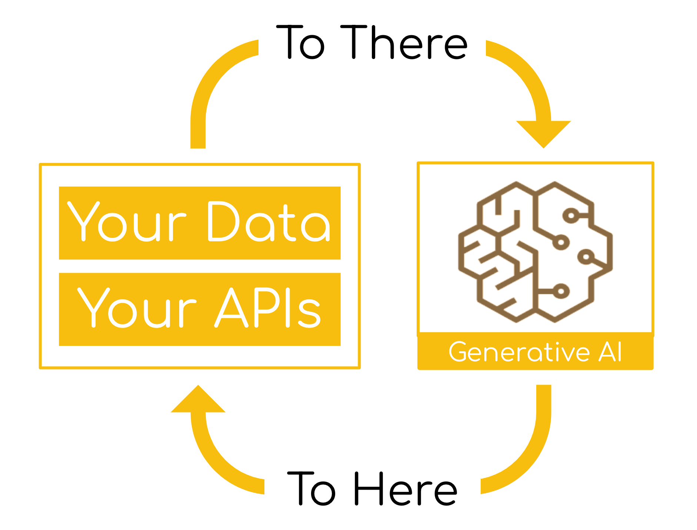

# Overview
Spring AI是一个AI引擎应用框架，它的目的是在AI领域应用Spring生态系统的设计准则，比如可移植性、模块化设计、使用POJO来提升AI领域设计。Spring AI解决了一个最基本的问题就是将你的企业应用的Data与API与AI模型连接起来。
- 支持多个AI厂商发布的API，支持Chat、文本生成图片与嵌入模型等
- 支持同步与流式的API
- 结构化输出
- 支持大部分的向量数据库

`Spring AI`项目就是把人工智能应用开发流程化，减少不必要的复杂性，就是简化涉及到AI的应用的开发流程。这个项目参考了一些重要的Python项目，比如LangChain与LlamaIndex等，但是Spring AI并不是这些项目的直接移植，这个项目建立在一个观点上即下一波的生成式AI应用不仅是面向Pythion开发者的而是跨语言的。因此，Spring AI解决了AI集成的基础问题: `Connecting your enterprise Data and APIs with the AI Models`.

Spring AI提供了很多用于开发AI应用的抽象，这些抽象有很多实现，只需要很少的编码变更就可以实现组件切换。Spring AI提供了以下的特性:
- 支持所有主流的大语言模型，比如OpenAI、Microsoft、Amazon、Google与Hugging Face等
- 支持的模型类型包括Chat、Text to Image、Audio Transcription、Text to Speech、Moderation以及更多
- 支持所有模型的API，支持阻塞与流式API，甚至支持使用特定模型的特定功能
- 将AI模型的输出映射为POJOs
- 支持所有主流的向量数据库，比如Apache Cassandra, Azure Vector Search, Chroma, Milvus, MongoDB Atlas, Neo4j, Oracle, PostgreSQL/PGVector, PineCone, Qdrant, Redis, and Weaviate
- 支持跨多个向量存储方案的可移植的API
- 函数调用
- 提供了AI模型与向量存储的Spring Boot自动配置与启动器
- 用于数据引擎的ETL框架

这些特性集可以让你实现一些常用的功能，比如`Q&A over your documentation`或者`Chat with your documentation`。
# AI Concepts
