这个工程集成了Netflix开源软件，完成了netflix的自动配置并且绑定到Spring环境，可以使用Spring的编程特性开发，通过几个简单的注解，你就可以快速开启相关的功能并配置一些通用的模式，提供的模式包括服务发现、（CB）断路器、智能路由（Zuul）、与客户端负载均衡（Ribbon）。
# 服务发现：Eureka客户端
服务发现是微服务架构中的关键部分，手动配置每个服务的客户端或者手动指定某些约定是比较难的并且这种配置或者约定是脆弱的，Eureka是Netflix的服务发现的目录服务器也是各个服务的客户端，目录服务器可以通过配置部署成高可用形式既每个服务器都会复制其他服务器持有的注册的服务信息。
## 如何接入Eureka客户端
使用maven包含spring-cloud-starter-netflix-eureka-client的组件
## 注册
使用eureka注册服务时，需要提交有关于自身服务的元数据，比如host、port、健康检查url、主页或者其他的细节，eureka目录服务器从每个服务实例中接收到心跳消息，如果超过配置的时间限制则心跳失败，服务实例会从目录中移除。下面的例子是一个简易的使用eureka注册的例子
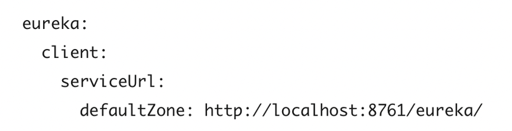
在上面的例子中，defaultZone是一个魔术字符串，也就是一个备选值或者也叫做缺省值，为所有没有指定优先级的client提供默认的注册中心的地址或者接入链接，defaultZone是大小写敏感的，因为serviceUrl属性是一个Map<String,String>，因此，Spring boot中蛇形命名法与驼峰字段的自动转换约定无法应用到defaultZone属性。应用名字（也是服务的ID）、虚拟Host、端口分别来自Enviroment中的${spring.application.name}、${spring.application.name}、${server.port}。eureka不仅将服务注册为一个实例，他也是一个存储注册信息的客户端，它查询注册中心来定位访问的服务地址；实例的行为通过eureka.instance.*的属性配置，只要你配置了spring.application.name值，那么eureka.instance.*的key只需要保持默认值就可以了。可以查看EurekaInstanceConfigBean与EurekaClientConfigBean这2个类，这里面有更多的细节。如果不需要访问其他服务可以禁用服务的client的功能，这样不会拉取注册中心的注册信息，可以通过设置eureka.client.enabled=false，当设置了spring.cloud.discovery.enabled=false时也会关闭eureka的客户端功能。
## eureka server鉴权
当serviceUrl的值含有类似证书的字符时，eurekaclient自动会开启HTTP basic认证，如果想要更复杂的控制，你可以创建一个DiscoveryClientOptionalArgs的bean并注入一个ClientFilter类型的bean，这个bean会拦截所有client对server的访问并做你定义的处理。当eurekaserver需要客户端的证书来认证时，客户端的证书与trust store可以通过属性配置，如下：
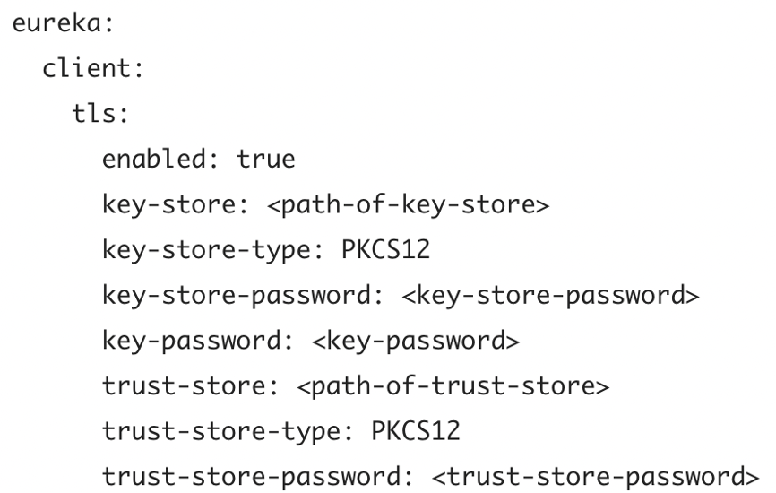
需要设置eureka.client.tls.enabled=true开启客户端的TLS协议，当忽略eureka.client.tls.trust-store时，会使用一个JVM的默认的trust store。如果你想要定制Eureka HTTP Client使用的RestTemplate，你需要创建一个EurekaClientHttpRequestFactorySupplier类型的bean，书写你自己的生成ClientHttpRequestFactory实例的逻辑。
## 状态页与健康检查
一个Eureka实例的状态页与健康检查的缺省路径分别是/info与/heath，都是Spring Boot Actuator应用中的端点提供的位置，新的版本需要加上/actuator/info，如果你需要变更这些，比如你使用了一个servlet path，下面是2个新的设置
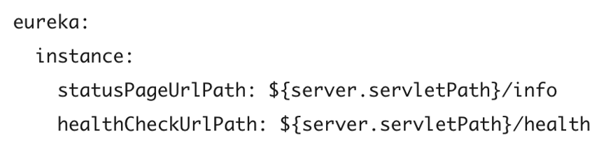
这2个链接位于客户端存储的元数据中，在某些场景下，需要发送请求到应用。
## 注册一个安全的eureka应用
## 健康检查
缺省情况下，Eureka使用客户端你心跳来决定client的状态，除非指定，当前客户服务不会广播应用当前的健康状态，因此，成功注册后，Eureka一直任务应用是UP状态的，可以通过设置eureka的健康检查来改变，启动后会向eureka广播服务的状态
>eureka:
  client:
    healthcheck:
      enabled: true
## Eureka的元数据
花点时间了解下Eureka的元数据是如何工作的，这样你可以应用在你的平台上，有标准的元数据比如hostname、ip地址、端口、状态页与健康检查，这些数据都会发送到注册中心，客户端可以使用这些信息连接到服务，实例注册还可以添加一些额外的元数据信息，这些元数据信息配置在eureka.instance.metadataMap，远程客户端可以访问这些元数据，通常来说，额外的元数据不会改变客户端的行为，除非客户端明确了解元数据的含义。
Eureke是使用一个ID注册的，Eureke提供这个ID的缺省实现
>${spring.cloud.client.hostname}:${spring.application.name}:${spring.application.instance_id:${server.port}}

一个例子是`myhost:myappname:8080`,你可以通过设置eureka.instance.instanceId来自定义ID，比如
>eureka:
  instance:
    instanceId: ${spring.application.name}:${vcap.application.instance_id:${spring.application.instance_id:${random.value}}}

## EurekaClient的使用
如果你的应用是一个Discovery客户端，你可以用它从Eureka服务器发现服务实例，一种办法是使用EurekaClient接口类，如下图
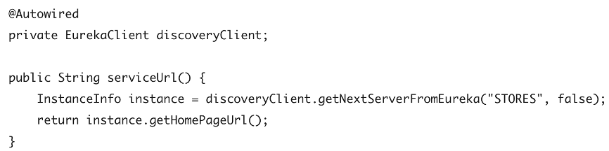
缺省情况下，EurekaClient使用RestTemplate作为HTTP通讯客户端，如果你想要使用Jersey，你需要加入Jersey的依赖。
## 本地EurekaClient的替代者
通常，你用不到原始的EurekaClient接口，常用的是它的包装者，Spring Cloud支持Feign与RestTemplate，你也可以使用org.springframework.cloud.client.discovery.DiscoveryClient，也提供了简单的API来发现Client，如下图：
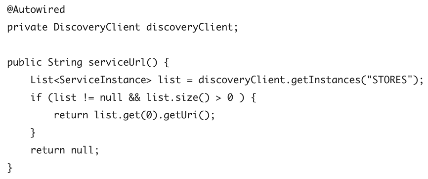
## 为什么注册一个服务是这么的慢
注册过程要涉及到周期性的心跳，心跳间隔是30s，一个服务可用需要服务instance、server与eureka client 在本地的cache中保存的metadata是相同的，你可以通过eureka.instance.leaseRenewalIntervalInSeconds改变周期。
## Zones
如果你的Eureka客户端配置了多个Zone，你可能想要拥有相同Zone的可以互相访问，如果没有在访问其他的Zone，可以合理的配置Eureka客户端来达到这样的效果。
首先，你需要把Eureka server集群配置成多个Zone的，并且它们可以相互复制，接下来，你需要告诉Eureka，你的服务是拿个Zone，你可以通过metadataMap属性的方式配置，比如，service1的Zone是zone1与zone2，你需要设置Eureka的属性如下：
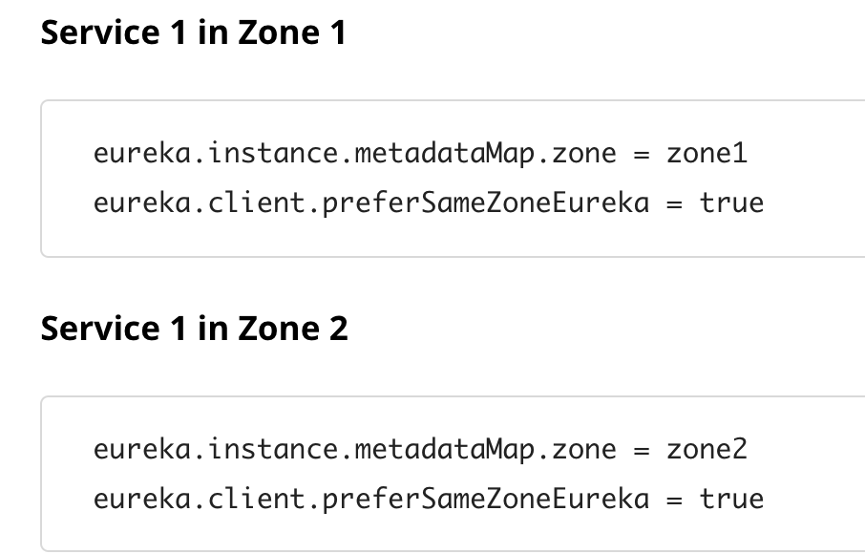
## Eureka客户端刷新
缺省，EurekaClient是可刷新的，这意味着EurekaClient的属性是可以随时变更并加载的，当一个刷新发生时，客户端会从eureka server解除绑定，服务的实例会有一个短暂的时间内不可用，如果不刷新就不会发生这种情况，eureka.client.refresh.enable=false，eureka提供了对Spring Cloud负载均衡器ZonePreferenceServiceInstanceListSupplier的支持，Eureka实例中的元数据（eureka.instance.metadataMap.zone）中的zone可以用来设置spring.cloud-loadbalancer-zone的值，用来通过zone过滤服务实例，如果没有配置zone设置了spring.cloud.loadbalancer.eureka.approximateZoneFromHostname server的域名会作为zone。
# 服务发现：Eureka服务器
## 如何包含Eureka Server
包含Eureka Server只需要在你的工程中添加group id=org.springframework.cloud，artifact id=spring-cloud-starter-netflix-eureka-server的starter，如果你的工程使用Thymeleaf作为模板引擎，Eureka server使用的Freemarker模板引擎可能不能正确加载，在这种情况下，有必要人工配置模板加载器：
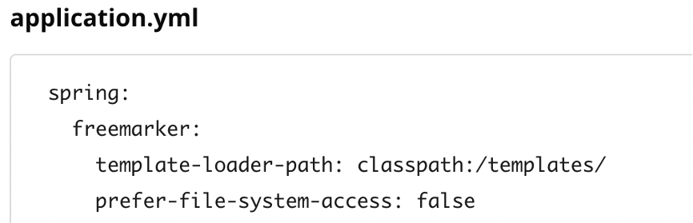
## 如何运行一个Eureka Server
启动一个简易的eureka server的方式如下：
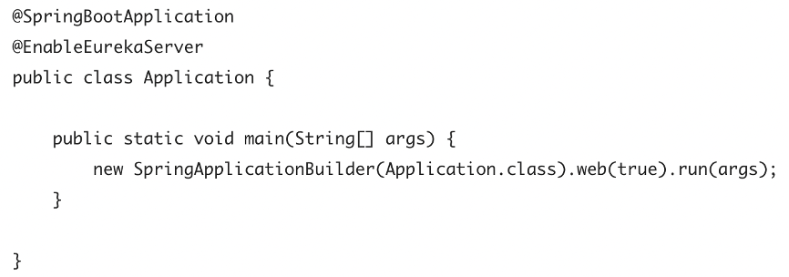
server在/eureka/*目录下带有UI与HTTP API的端点。
## 高可用，Zone与Region
Eureka Server没有备份的存储器，注册中的所有的服务实例，必须一直发送心跳，保持他们的注册状态，客户端在内存中也会缓存Eureka的注册信息，所以没有必要每次访问服务时都去注册中心获取服务信息；缺省情况下，每个Eureka Server也是一个Eureka客户端，需要一个服务的URL用来定位对等服务，如果你没有提供，服务运行后，会打印很多日志，反应不能注册为对等实体
## 单体模式
只要有某种监视器或弹性运行时（例如Cloud Foundry），两个缓存（客户端和服务器）和心跳的组合就可以使独立的Eureka服务器对故障具有相当的恢复能力；在独立模式下，您可能希望关闭客户端行为，以使其不会继续尝试连接对等对象或者连接不到时持续报错。单体模式的配置如下：
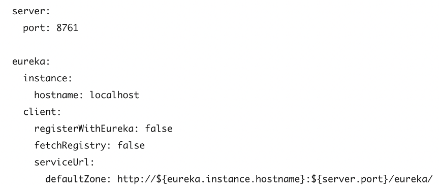
请注意，serviceUrl指向与本地实例相同的主机。
## 对等感知
通过运行多个实例并要求它们相互注册，可以使Eureka更具弹性并可以使用。实际上，这是默认行为，因此要使其正常工作，您需要做的就是向对等方添加一个有效的serviceUrl，如以下示例所示：
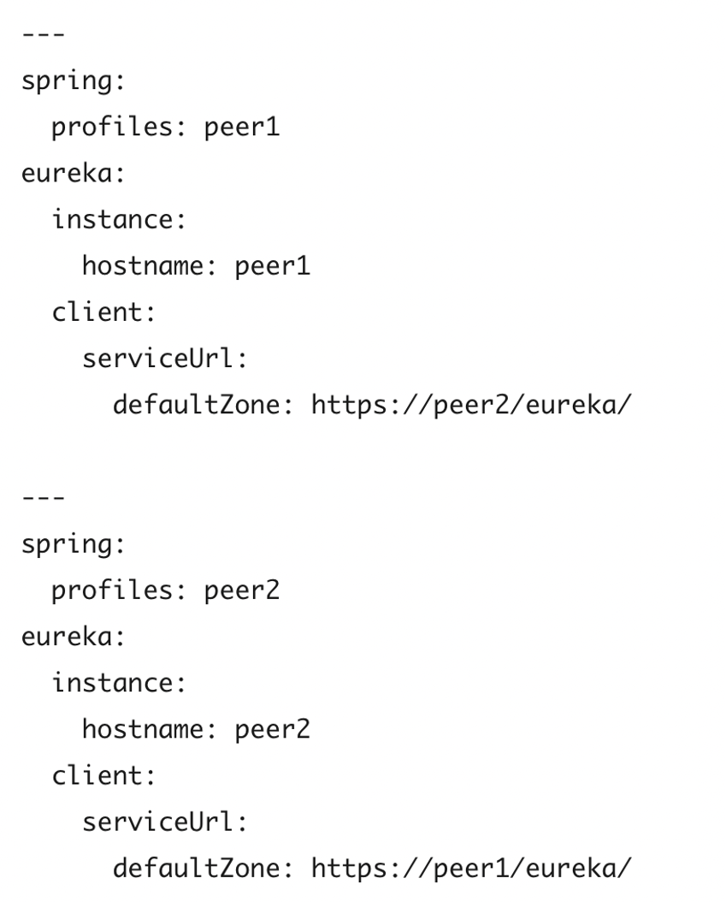
在这个例子中，我们使用了一个YAML文件，通过Profiles的方式可以在2台不同的机器上运行同样的服务，你可以使用这个配置在单一的机器上测试对等感知的功能，事实上，如果机器知道它自己的hostname，那么eureka.instance.hostname是不需要的；你能向系统中添加更多的对等实体，只要他们是互相连通的，他们就会相互同步注册信息，如果对等实体是物理隔离的，原则上来讲，是可以避免脑裂的，除非所有的连接都断开，如下：
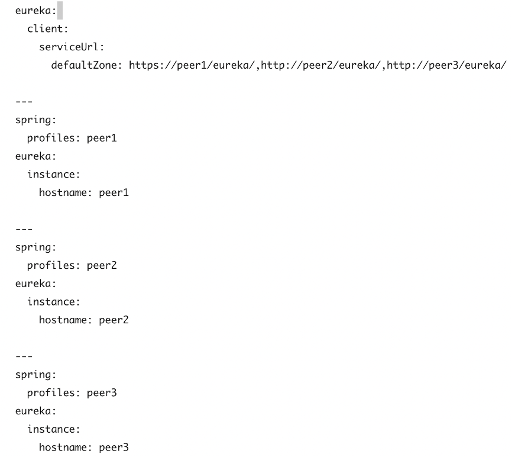
## 什么时候使用IP地址
在某些情况下，eureka使用服务的IP地址比使用hostname更合适，设置eureka.instance.preferIpAddress=true，当服务向eureka注册时，它会使用IP地址而不是hostname，如果java无法是被hostname，IP地址就会发送到eureka，只有设置了eureka.instance.hostname属性的值才算明确设定了hostname，你可以在运行时通过设置属性来设置hostname。
## 保护eureka server
你可以通过添加Spring security的方式保护eureka server，缺省情况下，spring secutiy会要求每个请求都带有一个有效的CSR证书，Eureka客户端通常没有这个证书，所以在/eureka/**站点，你需要关闭CSRF检测，如下：
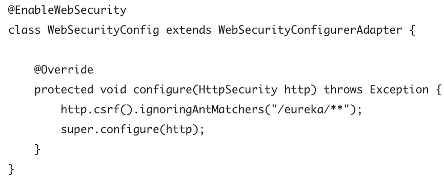
# 属性配置
在附录中