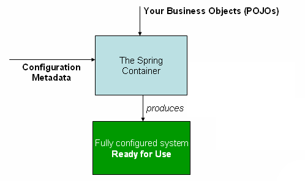

`org.springframework.context.ApplicationContext`接口表示Spring IoC容器，负责实例化、配置与组装beans。Spring容器通过读取配置元数据信息得到如何创建、配置与组装Bean的指令，配置元数据可以是注解的组件类、带有工厂方法的注解的配置类、外部XML或者Groovy脚本组成，元数据定义了组成应用的对象与这些对象之间的依赖关系。
Spring提供了几个`ApplicationContext`接口的实现类，比如单机版的应用可以使用`ClassPathXmlApplicationContext`与`FileSystemXmlApplicationContext`或者`AnnotationConfigApplicationContext`；
在大多数应用场景中，开发者不需要明确的实例化一个或者多个容器，只需要进行一定的声明，比如在Web应用场景中，只需要在web.xml文件中配置8行的Web应用描述XML就可以了，具体可以了解[Convenient ApplicationContext Instantiation for Web Applications](https://docs.spring.io/spring-framework/reference/core/beans/context-introduction.html#context-create)，在Spring Boot场景中，应用上下文基于通用约定隐式创建。下图展示了Spring如何工作的高层视角，你的应用类通过配置元数据组合起来，这样在`ApplicationContext`创建与初始化后，你拥有一个配置完整的可执行的系统与应用。

# 配置元数据
如上图所示，Spring IoC容器消费配置元数据，这些配置元数据表示你作为开发者需要告诉Spring容器如何实例化、配置与组装对象的指令。配置元数据传统上是XML，也有基于注解的配置，Spring IoC容器本身已经与元数据的配置格式解藕了。所以可以支持多种元数据书写格式，Spring 2.5版本后开始支持基于Java注解的元数据格式，从Spring 3.0集成了Spring JavaConfig项目，所以也包含其提供的一些特性(比如可以使用Java的方式定义第三方包中类的bean)。现在多数开发者选择使用基于Java的配置方式创建Spring应用，分2种:
- 基于注解的配置方式: 使用应用组件类上的注解配置元数据来定义bean
- 基于Java的配置方式: 使用java配置类的方式将外部类定义为Bean，使用注解`@Configuation`、`@Bean`、`@Import`、`@DependsOn`等

Spring配置通常包含至少一个或者多个Bean definition，Java配置方案通常使用`@Configuation`修饰的配置类中的`@Bean`修饰的方法来生成Bean配置元数据，这些Bean定义就表示组成你应用的实际的对象。通常来说，你定义服务层对象、持久层对象比如repositories或者data access objects、展示层对象比如Web controllers、基础组件层对象比如一个JPA的`EntityManagerFactory`,JMS queue等，通常来说，开发者不在容器中配置细粒度的领域对象，因为通常是repositories与业务逻辑负责创建或者加载领域对象。
## XML as an External Configuration DSL
XML配置元数据方式使用`<bean>`元素配置bean，`<bean>`定义在一个`<beans>`元素中。
java配置方式是在@Configuration类中配置@Bean注解的方法来管理多个bean。下面的例子是一个XML配置元数据的基本结构:
```xml
<?xml version="1.0" encoding="UTF-8"?>
<beans xmlns="http://www.springframework.org/schema/beans"
	xmlns:xsi="http://www.w3.org/2001/XMLSchema-instance"
	xsi:schemaLocation="http://www.springframework.org/schema/beans
	https://www.springframework.org/schema/beans/spring-beans.xsd">
	<bean id="..." class="...">
		<!-- collaborators and configuration for this bean go here -->
	</bean>
<!--id属性标识bean定义，class属性定义了bean的类型，使用类的全限定名-->
	<bean id="..." class="...">
		<!-- collaborators and configuration for this bean go here -->
	</bean>
	<!-- more bean definitions go here -->
</beans>
```
`id`属性可以用来引用对象。为了实例化容器，XML配置元数据资源文件的路径需要提供给`ClassPathXmlApplicationContext`的构造函数，这样容器会从外部资源加载配置元数据，比如本地文件系统或者Java的Classpath等
```java
ApplicationContext context = new ClassPathXmlApplicationContext("services.xml", "daos.xml");
```
在你了解到Spring IoC容器后，你可能项了解Spring的`Resource`抽象模型，它抽象了一个行为，就是从任意URI语法定义的位置读取输入流，特别是`Resource`的位置用来构造`ApplicationContext`时也是使用的它。下面的例子展示了服务层对象配置元数据文件
```xml
<?xml version="1.0" encoding="UTF-8"?>
<beans xmlns="http://www.springframework.org/schema/beans"
	xmlns:xsi="http://www.w3.org/2001/XMLSchema-instance"
	xsi:schemaLocation="http://www.springframework.org/schema/beans
		https://www.springframework.org/schema/beans/spring-beans.xsd">

	<!-- services -->

	<bean id="petStore" class="org.springframework.samples.jpetstore.services.PetStoreServiceImpl">
		<property name="accountDao" ref="accountDao"/>
		<property name="itemDao" ref="itemDao"/>
		<!-- additional collaborators and configuration for this bean go here -->
	</bean>

	<!-- more bean definitions for services go here -->

</beans>
```
下面的例子展示了dao层配置元数据文件`daos.xml`
```xml
<?xml version="1.0" encoding="UTF-8"?>
<beans xmlns="http://www.springframework.org/schema/beans"
	xmlns:xsi="http://www.w3.org/2001/XMLSchema-instance"
	xsi:schemaLocation="http://www.springframework.org/schema/beans
		https://www.springframework.org/schema/beans/spring-beans.xsd">

	<bean id="accountDao"
		class="org.springframework.samples.jpetstore.dao.jpa.JpaAccountDao">
		<!-- additional collaborators and configuration for this bean go here -->
	</bean>

	<bean id="itemDao" class="org.springframework.samples.jpetstore.dao.jpa.JpaItemDao">
		<!-- additional collaborators and configuration for this bean go here -->
	</bean>

	<!-- more bean definitions for data access objects go here -->

</beans>
```
在前面的例子中，服务层包含`PetStoreServiceImpl`对象与2个dao层对象，其中`<property>`元素的`name`属性引用Bean中的属性名字，`ref`属性应用其他bean定义的名字，`ref`对`id`的引用表示了对象间的依赖关系。
## Composing XML-based Configuration Metadata


1.1.2.2 实例化容器
提供给ApplicationContext的位置路径或者多个位置路径是资源的位置，这告诉容器从浙西传递的外部资源中加载配置元数据，比如本地文件系统，Java CLASSPATH等等。

在你了解了Spring IoC容器的内容之后，你可能想要了解更多关于Resource抽象的内容(在Resources章节中有详细的说明)，Resource提供了方便的机制从标注的URI位置中读取输入流的内容，尤其是，Resource路径用来构造ApplicationContext。将配置元数据分解到多个XML文件中很有用，一个文件表示一个模块或者一个代码层；你可以通过构造函数的方式传递多个XML来从多个地方加载配置元数据，也可以使用<import>元素来从其他文件中加载配置元数据，如下面的例子所示:

在前面的示例中，外部配置元数据从三个文件加载：services.xml、messageSource.xml 和 themeSource.xml。 所有位置路径都相对于当前的元数据文件，因此 services.xml 必须与当前元数据文件位于同一目录或类路径位置，而 messageSource.xml 和 themeSource.xml 必须位于该位置子目录下，如您所见，前置斜杠会被忽略。但是，鉴于这些路径是相对的，最好不要使用斜线。 被导入文件的内容，必须是包括<beans/>元素的有效的XML bean定义文件
<import>导入其他的配置文件信息。需要注意的是<import>标签中的文件路径是相对路径；不推荐使用../的相对路径形式，这样做可能会创建一个对应用程序外部文件的依赖，特别是使用classpath资源协议时，运行时处理过程会选选择第一个碰到的classpath，然后在它的父目录里面寻找文件，当classpath发生变更时，路径可能会变化。绝对路径可定时可以的。但是不推荐使用绝对路径的方式，这种方式将应用与特定路径耦合起来，通常是建议使用一种间接的绝对路径方式，比如通过${}占位符的方式指定路径。也可以使用Groovy的配置方式。
配置元数据可以用Spring的Groovy Bean Definition DSL的方式描述，配置的格式如下:


1.1.2.3 使用容器
ApplicationContext就是一个高级的工厂接口，可以管理Bean的注册与他们的依赖，通过使用T getBean(String name, Class<T> requiredType)方法，可以检索所有的Bean。

ApplicationContext有一个最灵活的实现者就是GenericApplicationContext，它内部组合了一个元数据reader delegates，可以读取任意格式的元数据格式文件，比如XML的或者Groovy的。


通常不建议应用代码嗲用getBean方法，那会产生对对Spring API的依赖关系。