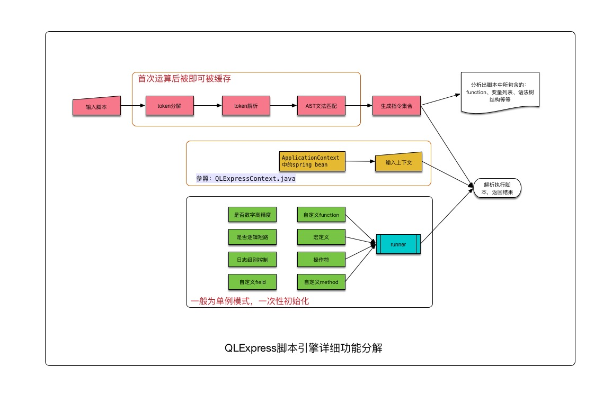

[TOC]
>In programming, simplicity and clarity are not a dispensable luxury, but a crucial matter that decides between success and failure. - E. Dijkstra
# 开源的方案
- incubator-kie-drools
- easy-rules
- liteflow
- radar
- rulebook
- QLExpress
- ice
- RuleEngine
- jetlinks/rule-engine
- evrete/evrete
# easy-rules
Easy Rules是一个简单但是强大的Java规则引擎，提供了以下的特性:
- 轻量级的框架与易于学习的API
- 基于POJO的开发方式
- 定义业务规则与应用业务规则的方便的抽象
- 创建复杂业务规则的能力
- 使用表达式语言(MVEL、SpEL与JEXL)定义业务规则的能力

在一篇关于规则引擎的文章中，Martin Fowler说:
>你可以创建一个简单的规则引擎，你需要做的就是创建一堆带有条件与行为的对象，把他们存到集合中，运行他们，对条件求值并执行后续的行为

这就是规则引擎做的事，提供了规则的抽象来创建带有条件与行为的规则，`RuleEngine`API运行规则对规则的条件求值并执行后续的行为。
## Getting Started
Java 8+

# liteflow
轻量请打的规则引擎框架，用于复杂的组件化业务的编排，使用DSL规则驱动整个复杂业务，实现平滑刷新热部署，支持多种脚本语言的嵌入。特点
- 强大的EL: 简单低学习成本的EL，丰富的关键字，完成任意模式的逻辑编排
- 皆为组件: 独特的设计理念，所有逻辑皆为组件，上下文隔离，组件单一指责，组件可以复用并互相解耦
- 脚本支持: 可以使用7种脚本语言写逻辑Java、Groovy、Js、Python、Lua、QLExpress、Aviator
- 规则存储: 支持把规则和脚本存储在任何关系型数据库，支持大部分的注册中心zk、nacos、etcd、appolo、redis
- 平滑热刷: 编排规则、脚本组件，不需要重启应用即时刷新，实时替换逻辑
- 支持度广: JDK8~JDK17,Spring 2.x ~ Spring 3.x
- 高级特性: 很多
# RuleBook
RuleBook是用Java开发的，可以通过Lambda DSL或者POJOs来描述rule。还在为代码中大量的if/else烦恼？你需要一个抽象运训通过规则的形式将它们互相解耦。RuleBook就是你正在等待的规则抽象。
## Getting RuleBook
```xml
<dependency>
    <groupId>com.deliveredtechnologies</groupId>
    <artifactId>rulebook-core</artifactId>
    <version>0.12</version>
</dependency>
```
## Using RuleBook
```java
RuleBook ruleBook = RuleBookBuilder.create()
    .addRule(rule -> rule.withNoSpecifiedFactType()
      .then(f -> System.out.print("Hello "))
      .then(f -> System.out.println("World")))
    .build();
RuleBook ruleBook = RuleBookBuilder.create()
    .addRule(rule -> rule.withNoSpecifiedFactType().then(f -> System.out.print("Hello ")))
    .addRule(rule -> rule.withNoSpecifiedFactType().then(f -> System.out.println("World")))
    .build();
ruleBook.run(new FactMap());
```
### 一个更复杂的场景
MegaBank发放住房贷款。如果申请人的信用评分低于600，那么他们必须支付当前利率的4倍。如果申请人的信用评分在600分但低于700分之间，那么他们必须在信用评分的基础上额外支付一点。如果申请人的信用评分至少为700，并且手头至少有25,000美元现金，那么他们的利率将降低四分之一个百分点。如果申请人是首次购房者，则根据信用评分进行调整后，他们的计算利率可享受20%的折扣(注: 首次购房折扣仅适用于信用评分为600或以上的申请人)。
### Thread Safety
RuleBook是线程安全的。但是`FactMaps`与其他的`NameValueReferableMap`实现不是线程安全的。也就是说，一个RuleBook类型的实例对象可以在不同的线程中使用不同的Facts正常运行。在不同的线程中，使用同一个`FactMap`可能会产生异常结果。`Facts`表示`RuleBook`的一次调用的数据，`RuleBooks`表示可复用的规则集合。
## RuleBook DSL详细说明
RuleBook的Java DSL使用了` Given-When-Then`的格式，由BDD与相关的测试框架推广开来。很多概念都来自借鉴自BDD，应该使用句子来描述规则，并且应该使用翻译成代码库的通用语言来定义规则。
### Given-When-Then: RuleBook语言的根本
与BDD推广的Given-When-Then语言结构类似，RuleBook使用这个结构来定义规则。Given-When-Then有如下含义:
- **Given** some Fast(s)
- **When** a condition evaluates to true
- **Then** an action is triggered

`Given`方法可以接受一个或者多个不同形式的facts，作为一个信息集合提供给单一的规则。当把规则构成RuleBook后，RuleBook运行时会把facts提供给规则，所以Given是用来推断的。
`When`方法接受一个谓词，谓词使用Facts计算条件，每个规则只能定义一个When
`Then`方法接受一个`Consumer`或者`BiConsumer`(有结果的规则)，描述了when中的条件为真时的后续动作，一个规则中可以有多个`then()`方法会按照定义的顺序执行。
### The Using Method
**Using**方法将会简化传递给`then()`方法的facts集合。多个`using()`方法可以组成链。在`then()`方法之前的所有`using()`方法中指定名称的fact的聚合将可供该`then()`方法使用。上面显示了`using()`如何工作的示例。
### The Stop Method
**Stop**方法会中断rule chain。如果定义规则时指定了`stop()`方法，就意味着当`when()`为真时，在`then()`中的行为完成后，rule chain就会被打断，链中后续的rule不会被执行。
### Working With Facts
通过`given()`方法提供facts给规则，Facts包含在`NameValueReferableMap`(FactMap是实现)，是一种特殊的Map，可以方便的访问fact中包含的对象，fact存在的原因是，总是存在对规则所使用的对象的引用，即使替换了不可变的对象，人们也会认为事实仍然存在并提供对代表性对象的命名引用。Facts有很多方便的方法，因为`NameValueReferableMap`是实际传递给`when()`与`then()`方法的对象，这些方法与Map一样，facts包含一个key/value对，但是在大多数场景，key只是value的字符表示形式，在这种情况下，Fatc支持一个参数值的构造方法。此外还提供的方法:
- `getOne()`: 如果`FactMap`中只有一个Fact则获取Fact的值
- `getValue(String name)`: 获取name表示的Fact的值
- `setValue(String name, T value)`: 生成一个Fact
- `put(Fact fact)`: 添加一个Fact，使用Fact的名字作为Map的key
- `toString()`: 当只有一个Fact存在时，获取Fact值的`toString()`方法返回的字符串

下面方法是接口`NameValueReferrableTypeConvertible`的方法，`TypeConvertibleFactMap`是这个接口的实现，也是`NameValueReferableMap`的装饰器。
- `getStrVal(String name)` gets the value of the Fact by name as a String
- `getDblVal(String)` gets the value of the Fact by name as a Double
- `getIntVal(String)` gets the value of the Fact by name as an Integer
- `getBigDeciVal(String)` gets the value of the Fact by name as a BigDecimal
- `getBoolVal(String)` gets the value of the Fact by name as a Boolean

### Auditing Rules
Rules auditing可以通过`asAuditor()`方法启动。
```java
 RuleBook rulebook = RuleBookBuilder.create().asAuditor()
   .addRule(rule -> rule.withName("Rule1").withNoSpecifiedFactType()
     .when(facts -> true)
     .then(facts -> { } ))
   .addRule(rule -> rule.withName("Rule2").withNoSpecifiedFactType()
     .when(facts -> false)
     .then(facts -> { } )).build();
     
 rulebook.run(new FactMap());
```
使用`asAuditor()`方法，RuleBook中的每个命名规则都会注册为一个*Auditable Rule*，每个*Auditable Rule*都会在RuleBook中存储状态。当规则注册为*Auditable Rule*时，`RuleStatus=NONE`，在RuleBook运行后，运行失败的规则或者条件不满足的规则的`RuleStatus=SKIPPED`，条件满足并成功执行`then()`的规则`RuleStatus=EXECUTED`，可以通过以下的方式获取状态
```java
 Auditor auditor = (Auditor)rulebook;
 System.out.println(auditor.getRuleStatus("Rule1")); //prints EXECUTED
 System.out.println(auditor.getRuleStatus("Rule2")); //prints SKIPPED
```
所有规则与它们状态可以通过下面的方式获取
```java
 Map<String, RuleStatus> auditMap = auditor.getRuleStatusMap();
```
### Rule Chain Behavior
缺省情况下，加载规则时发现错误或者运行规则时抛出异常，这些规则会从rule chain中移除，换句话说，发生错误的规则会被skip，一个规则只有在条件为真且`then()`正常执行时才能stop整个rule chain。这个行为可以改变:
```java
RuleBook ruleBook = RuleBookBuilder.create()
    .addRule(
        RuleBuilder.create(GoldenRule.class, RuleChainActionType.STOP_ON_FAILURE)
            .withFactType(String.class)
            .when(facts -> true)
            .then(consumer)
            .stop()
            .build())
    .addRule(
        RuleBuilder.create()
            .withFactType(String.class)
            .when(facts -> true)
            .then(consumer)
            .build())
    .build();
```
在上面的例子中，第一个规则的默认的`RuleChainActionType.CONTINUE_ON_FAILURE `将会变更为`RuleChainActionType.STOP_ON_FAILURE`，这回保证如果第一个规则发生错误，第二个规则将永不会得到执行，但是不会抛出异常。如果要抛出异常并stop整个rule chain，使用下面的设置
```java
RuleBook ruleBook = RuleBookBuilder.create()
    .addRule(
        RuleBuilder.create(GoldenRule.class, RuleChainActionType.ERROR_ON_FAILURE)
            .withFactType(String.class)
            .when(facts -> true)
            .then(consumer)
            .build())
    .addRule(
        RuleBuilder.create()
            .withFactType(String.class)
            .when(facts -> true)
            .then(consumer)
            .build())
    .build();
```
- CONTINUE_ON_FAILURE: 默认的`RuleChainActionType`，如果规则匹配错误或者发生异常跳过规则
- ERROR_ON_FAILURE: 规则抛出异常时，stop整个rule chain
- STOP_ON_FAILURE: rules that have their RuleState set to BREAK will stop the RuleChain if the rule's condition is false or if an exception is thrown

## POJO Rules
v0.2版本中加入了POJO规则，将规则注解到POJO类上，然后使用`RuleBookRunner`来扫描某个package下面的所有规则来创建RuleBook。
### 一个例子
```java
package com.example.rulebook.helloworld;

import com.deliveredtechnologies.rulebook.annotations.*;
import com.deliveredtechnologies.rulebook.RuleState;

@Rule
public class HelloWorld {

  @Given("hello")
  private String hello;

  @Given("world")
  private String world;

  @Result
  private String helloworld;

  @When
  public boolean when() {
      return true;
  }

  @Then
  public RuleState then() {
      helloworld = hello + " " + world;
      return RuleState.BREAK;
  }
}
```
### A New MegaBank Example With POJO Rules
MegaBank改变了利率调整政策。他们现在还接受最多包含3名申请人的贷款申请。如果所有申请人的信用评分都低于600，那么他们必须支付当前利率的4 倍。然而，如果所有申请人的信用评分都低于700，但至少有一个申请人的信用评分高于600，那么他们必须在费率之上额外支付一分。此外，如果任何申请人的信用评分为700 或以上，并且所有申请人手头可用现金总和大于或等于50,000美元，那么他们的利率将降低四分之一个百分点。如果至少一名申请人是首次购房者，并且至少一名申请人的信用评分超过600，那么在进行所有其他调整后，他们的计算利率将降低20%。
### POJO Rules Explained
POJO规则是通过`@Rule`注解定义的，`RuleBookRunner`会认为定义的类为一个规则，Facts通过`@Given`注解注入到POJO，`@Given`注解的名字就是fact的名字，`@Given`也可以匹配Fact值的类型或者本身就是fact，两者之间的最大区别在于，如果事实的通用对象发生更改，则应用于不可变对象的更改不会沿着规则链传播（因为它将成为一个新对象）。但是，如果您在Fact对象上设置值，这些更改将保留在规则链中。`@When`注解注释到方法上，也就是执行条件，方法必须是无参并返回boolean的。`@Then`注释到方法上，表示要执行的规则行为，`@Then`方法必须是无参的可选的返回`RuleState`，如果POJO中存在多个`@Then`方法。`@Result`表示规则的结果。
# QLExpress
一个总台脚本引擎/解析工具，用于阿里的电商业务规则、表达式、特殊数学公式计算、语法分析、脚本二次定制等场景。特点:
- 线程安全，引擎运算过程中的产生的临时变量都是ThreadLocal的
- 执行高效，脚本编译可以缓存，临时变量采用了缓冲池的技术
- 弱类型脚本语言，和Groovy、Javascript类似，灵活
- 安全控制
- 代码少

添加依赖
```xml
<dependency>
  <groupId>com.alibaba</groupId>
  <artifactId>QLExpress</artifactId>
  <version>3.3.3</version>
</dependency>
```
语法
```java
//支持 +,-,*,/,<,>,<=,>=,==,!=,<>【等同于!=】,%,mod【取模等同于%】,++,--,
//in【类似sql】,like【sql语法】,&&,||,!,等操作符
//支持for，break、continue、if then else 等标准的程序控制逻辑
n = 10;
sum = 0;
for(i = 0; i < n; i++) {
   sum = sum + i;
}
return sum;

//逻辑三元操作
a = 1;
b = 2;
maxnum = a > b ? a : b;
```
- 不支持try-catch
- 注释只支持/****/,不支持单行注释
- 不支持Java8的lambda表达式
- 不支持for循环集合操作
- 弱类型语言，不要定义类型生命，不要用Template
- array的声明不一样
- min,max,round,print,println,like,in 都是系统默认函数的关键字，请不要作为变量名

```java
//java语法：使用泛型来提醒开发者检查类型
keys = new ArrayList<String>();
deviceName2Value = new HashMap<String, String>(7);
String[] deviceNames = {"ng", "si", "umid", "ut", "mac", "imsi", "imei"};
int[] mins = {5, 30};

//ql写法：
keys = new ArrayList();
deviceName2Value = new HashMap();
deviceNames = ["ng", "si", "umid", "ut", "mac", "imsi", "imei"];
mins = [5, 30];

//java语法：对象类型声明
FocFulfillDecisionReqDTO reqDTO = param.getReqDTO();
//ql写法：
reqDTO = param.getReqDTO();

//java语法：数组遍历
for(Item item : list) {
}
//ql写法：
for(i = 0; i < list.size(); i++){
    item = list.get(i);
}

//java语法：map遍历
for(String key : map.keySet()) {
    System.out.println(map.get(key));
}
//ql写法：
keySet = map.keySet();
objArr = keySet.toArray();
for (i = 0; i < objArr.length; i++) {
    key = objArr[i];
    System.out.println(map.get(key));
}
```
Java的对象操作
```java
import com.ql.util.express.test.OrderQuery;
//系统自动会import java.lang.*,import java.util.*;

query = new OrderQuery();           // 创建class实例，自动补全类路径
query.setCreateDate(new Date());    // 设置属性
query.buyer = "张三";                // 调用属性，默认会转化为setBuyer("张三")
result = bizOrderDAO.query(query);  // 调用bean对象的方法
System.out.println(result.getId()); // 调用静态方法
```
脚本中定义function
```java
function add(int a, int b){
    return a + b;
};

function sub(int a, int b){
    return a - b;
};

a = 10;
return add(a, 4) + sub(a, 9);
```
## 扩展操作符：Operator
替换关键字
```java
runner.addOperatorWithAlias("如果", "if", null);
runner.addOperatorWithAlias("则", "then", null);
runner.addOperatorWithAlias("否则", "else", null);

express = "如果 (语文 + 数学 + 英语 > 270) 则 {return 1;} 否则 {return 0;}";
DefaultContext<String, Object> context = new DefaultContext<String, Object>();
runner.execute(express, context, null, false, false, null);
```
定义一个Operator
```java
import java.util.ArrayList;
import java.util.List;

/**
 * 定义一个继承自com.ql.util.express.Operator的操作符
 */
public class JoinOperator extends Operator {
    public Object executeInner(Object[] list) throws Exception {
        Object opdata1 = list[0];
        Object opdata2 = list[1];
        if (opdata1 instanceof List) {
            ((List)opdata1).add(opdata2);
            return opdata1;
        } else {
            List result = new ArrayList();
            for (Object opdata : list) {
                result.add(opdata);
            }
            return result;
        }
    }
}
```
使用Operator
```java
//(1)addOperator
ExpressRunner runner = new ExpressRunner();
DefaultContext<String, Object> context = new DefaultContext<String, Object>();
runner.addOperator("join", new JoinOperator());
Object r = runner.execute("1 join 2 join 3", context, null, false, false);
System.out.println(r); // 返回结果 [1, 2, 3]

//(2)replaceOperator
ExpressRunner runner = new ExpressRunner();
DefaultContext<String, Object> context = new DefaultContext<String, Object>();
runner.replaceOperator("+", new JoinOperator());
Object r = runner.execute("1 + 2 + 3", context, null, false, false);
System.out.println(r); // 返回结果 [1, 2, 3]

//(3)addFunction
ExpressRunner runner = new ExpressRunner();
DefaultContext<String, Object> context = new DefaultContext<String, Object>();
runner.addFunction("join", new JoinOperator());
Object r = runner.execute("join(1, 2, 3)", context, null, false, false);
System.out.println(r); // 返回结果 [1, 2, 3]
```
## 绑定java类或者对象的method
```java
public class BeanExample {
    public static String upper(String abc) {
        return abc.toUpperCase();
    }
    public boolean anyContains(String str, String searchStr) {
        char[] s = str.toCharArray();
        for (char c : s) {
            if (searchStr.contains(c+"")) {
                return true;
            }
        }
        return false;
    }
}

runner.addFunctionOfClassMethod("取绝对值", Math.class.getName(), "abs", new String[] {"double"}, null);
runner.addFunctionOfClassMethod("转换为大写", BeanExample.class.getName(), "upper", new String[] {"String"}, null);

runner.addFunctionOfServiceMethod("打印", System.out, "println", new String[] { "String" }, null);
runner.addFunctionOfServiceMethod("contains", new BeanExample(), "anyContains", new Class[] {String.class, String.class}, null);

String express = "取绝对值(-100); 转换为大写(\"hello world\"); 打印(\"你好吗？\"); contains("helloworld",\"aeiou\")";
runner.execute(express, context, null, false, false);
```
## macro 宏定义
```java
runner.addMacro("计算平均成绩", "(语文+数学+英语)/3.0");
runner.addMacro("是否优秀", "计算平均成绩>90");
IExpressContext<String, Object> context = new DefaultContext<String, Object>();
context.put("语文", 88);
context.put("数学", 99);
context.put("英语", 95);
Object result = runner.execute("是否优秀", context, null, false, false);
System.out.println(r);
//返回结果true
```
## 编译脚本，查询外部需要定义的变量和函数
```java
String express = "int 平均分 = (语文 + 数学 + 英语 + 综合考试.科目2) / 4.0; return 平均分";
ExpressRunner runner = new ExpressRunner(true, true);
String[] names = runner.getOutVarNames(express);
for(String s:names){
    System.out.println("var : " + s);
}

//输出结果：
var : 数学
var : 综合考试
var : 英语
var : 语文
```
## 关于不定参数的使用
```java
@Test
public void testMethodReplace() throws Exception {
    ExpressRunner runner = new ExpressRunner();
    IExpressContext<String, Object> expressContext = new DefaultContext<String, Object>();
    runner.addFunctionOfServiceMethod("getTemplate", this, "getTemplate", new Class[]{Object[].class}, null);

    //(1)默认的不定参数可以使用数组来代替
    Object r = runner.execute("getTemplate([11,'22', 33L, true])", expressContext, null, false, false);
    System.out.println(r);
    //(2)像java一样,支持函数动态参数调用,需要打开以下全局开关,否则以下调用会失败
    DynamicParamsUtil.supportDynamicParams = true;
    r = runner.execute("getTemplate(11, '22', 33L, true)", expressContext, null, false, false);
    System.out.println(r);
}

//等价于getTemplate(Object[] params)
public Object getTemplate(Object... params) throws Exception{
    String result = "";
    for(Object obj:params){
        result = result + obj + ",";
    }
    return result;
}
```
## 关于集合的快捷写法
```java
@Test
public void testSet() throws Exception {
    ExpressRunner runner = new ExpressRunner(false, false);
    DefaultContext<String, Object> context = new DefaultContext<String, Object>();
    String express = "abc = NewMap(1:1, 2:2); return abc.get(1) + abc.get(2);";
    Object r = runner.execute(express, context, null, false, false);
    System.out.println(r);
    express = "abc = NewList(1, 2, 3); return abc.get(1) + abc.get(2)";
    r = runner.execute(express, context, null, false, false);
    System.out.println(r);
    express = "abc = [1, 2, 3]; return abc[1] + abc[2];";
    r = runner.execute(express, context, null, false, false);
    System.out.println(r);
}
```
## 集合的遍历
```java
//遍历map
map = new HashMap();
map.put("a", "a_value");
map.put("b", "b_value");
keySet = map.keySet();
objArr = keySet.toArray();
for (i = 0; i < objArr.length; i++) {
    key = objArr[i];
    System.out.println(map.get(key));
}
```
## 运行参数和API列表介绍

### 属性开关
- `private boolean isPrecise = false;`: 是否需要高精度计算,不丢失精度
- `private boolean isShortCircuit = true;`: 是否使用逻辑短路
- `private boolean isTrace = false;`:  是否输出所有的跟踪信息，同时还需要log级别是DEBUG级别

### 调用入参
```java
/**
 * 执行一段文本
 * @param expressString 程序文本
 * @param context 执行上下文，可以扩展为包含ApplicationContext
 * @param errorList 输出的错误信息List
 * @param isCache 是否使用Cache中的指令集,建议为true
 * @param isTrace 是否输出详细的执行指令信息，建议为false
 * @param aLog 输出的log
 * @return
 * @throws Exception
 */
Object execute(String expressString, IExpressContext<String, Object> context, List<String> errorList, boolean isCache, boolean isTrace);
```
### 功能扩展API列表
实现`Operator`自定义操作符，通过`addFunction`或者`addOperator`注入到`ExpressRunner`中
```java
public abstract Object executeInner(Object[] list) throws Exception;
import java.util.ArrayList;
import java.util.List;

public class JoinOperator extends Operator {
    public Object executeInner(Object[] list) throws Exception {
        List result = new ArrayList();
        Object opdata1 = list[0];
        if (opdata1 instanceof List) {
            result.addAll((List)opdata1);
        } else {
            result.add(opdata1);
        }
        for (int i = 1; i < list.length; i++) {
            result.add(list[i]);
        }
        return result;
    }
}
```
function相关API
```java
//通过name获取function的定义
OperatorBase getFunciton(String name);

//通过自定义的Operator来实现类似：fun(a, b, c)
void addFunction(String name, OperatorBase op);

//fun(a, b, c) 绑定 object.function(a, b, c)对象方法
void addFunctionOfServiceMethod(String name, Object aServiceObject, String aFunctionName, Class<?>[] aParameterClassTypes, String errorInfo);

//fun(a, b, c) 绑定 Class.function(a, b, c)类方法
void addFunctionOfClassMethod(String name, String aClassName, String aFunctionName, Class<?>[] aParameterClassTypes, String errorInfo);

//给Class增加或者替换method，同时支持 a.fun(b), fun(a, b) 两种方法调用
//比如扩展String.class的isBlank方法:"abc".isBlank()和isBlank("abc")都可以调用
void addFunctionAndClassMethod(String name, Class<?> bindingClass, OperatorBase op);
```
Operator相关API
```java
//添加操作符号,可以设置优先级
void addOperator(String name, Operator op);
void addOperator(String name, String aRefOpername, Operator op);

//替换操作符处理
OperatorBase replaceOperator(String name, OperatorBase op);

//添加操作符和关键字的别名，比如 if..then..else -> 如果。。那么。。否则。。
void addOperatorWithAlias(String keyWordName, String realKeyWordName, String errorInfo);
```
宏定义相关API
```java
//比如addMacro("天猫卖家", "userDO.userTag &1024 == 1024")
void addMacro(String macroName, String express);
```
java class的相关api
```java
//添加类的属性字段
void addClassField(String field, Class<?>bindingClass, Class<?>returnType, Operator op);

//添加类的方法
void addClassMethod(String name, Class<?>bindingClass, OperatorBase op);
```
语法树解析变量、函数的API
```java
//获取一个表达式需要的外部变量名称列表
String[] getOutVarNames(String express);
String[] getOutFunctionNames(String express);
```
语法解析校验api, 脚本语法是否正确，可以通过ExpressRunner编译指令集的接口来完成。
```java
String expressString = "for(i = 0; i < 10; i++) {sum = i + 1;} return sum;";
InstructionSet instructionSet = expressRunner.parseInstructionSet(expressString);
//如果调用过程不出现异常，指令集instructionSet就是可以被加载运行（execute）了！
```
令集缓存相关的api, 因为QLExpress对文本到指令集做了一个本地HashMap缓存，通常情况下一个设计合理的应用脚本数量应该是有限的，缓存是安全稳定的，但是也提供了一些接口进行管理。
```java
//优先从本地指令集缓存获取指令集，没有的话生成并且缓存在本地
InstructionSet getInstructionSetFromLocalCache(String expressString);
//清除缓存
void clearExpressCache();
```
### 安全风险控制
- 防止死循环
  ```java
    try {
        express = "sum = 0; for(i = 0; i < 1000000000; i++) {sum = sum + i;} return sum;";
        //可通过timeoutMillis参数设置脚本的运行超时时间:1000ms
        Object r = runner.execute(express, context, null, true, false, 1000);
        System.out.println(r);
        throw new Exception("没有捕获到超时异常");
    } catch (QLTimeOutException e) {
        System.out.println(e);
    }
  ```
- 防止调用不安全的系统api
  ```java
    ExpressRunner runner = new ExpressRunner();
    QLExpressRunStrategy.setForbiddenInvokeSecurityRiskMethods(true);

    DefaultContext<String, Object> context = new DefaultContext<String, Object>();
    try {
        express = "System.exit(1);";
        Object r = runner.execute(express, context, null, true, false);
        System.out.println(r);
        throw new Exception("没有捕获到不安全的方法");
    } catch (QLException e) {
        System.out.println(e);
    }
  ```
### 增强上下文参数Context相关的api
- 与spring框架的无缝集成，上下文参数`IExpressContext context`非常有用，它允许put任何变量，然后在脚本中识别出来。在实际中我们很希望能够无缝的集成到spring框架中，可以仿照下面的例子使用一个子类。
  ```java
    public class QLExpressContext extends HashMap<String, Object> implements IExpressContext<String, Object> {
        private final ApplicationContext context;

        // 构造函数，传入context 和 ApplicationContext
        public QLExpressContext(Map<String, Object> map, ApplicationContext aContext) {
            super(map);
            this.context = aContext;
        }

        /**
        * 抽象方法：根据名称从属性列表中提取属性值
        */
        public Object get(Object name) {
            Object result;
            result = super.get(name);
            try {
                if (result == null && this.context != null && this.context.containsBean((String)name)) {
                    // 如果在Spring容器中包含bean，则返回String的Bean
                    result = this.context.getBean((String)name);
                }
            } catch (Exception e) {
                throw new RuntimeException(e);
            }
            return result;
        }

        public Object put(String name, Object object) {
            return super.put(name, object);
        }
    }
  ```
- 自定义函数操作符获取原始的context控制上下文，自定义的Operator需要直接继承OperatorBase，获取到parent即可，可以用于在运行一组脚本的时候，直接编辑上下文信息，业务逻辑处理上也非常有用。
  ```java
    public class ContextMessagePutTest {
        class OperatorContextPut extends OperatorBase {
            public OperatorContextPut(String aName) {
                this.name = aName;
            }

            @Override
            public OperateData executeInner(InstructionSetContext parent, ArraySwap list) throws Exception {
                String key = list.get(0).toString();
                Object value = list.get(1);
                parent.put(key, value);
                return null;
            }
        }

        @Test
        public void test() throws Exception {
            ExpressRunner runner = new ExpressRunner();
            OperatorBase op = new OperatorContextPut("contextPut");
            runner.addFunction("contextPut", op);
            String express = "contextPut('success', 'false'); contextPut('error', '错误信息'); contextPut('warning', '提醒信息')";
            IExpressContext<String, Object> context = new DefaultContext<String, Object>();
            context.put("success", "true");
            Object result = runner.execute(express, context, null, false, true);
            System.out.println(result);
            System.out.println(context);
        }
    }
  ```
## 多级别安全控制
QLExpress与本地JVM交互的方式有:
- 应用中的自定义函数/操作符/宏: 该部分不在QLExpress运行时的管控范围，属于应用开放给脚本的业务功能，不受安全控制，应用需要自行确保这部分是安全的
- 在QLExpress运行时中发生的交互: 安全控制可以对这一部分进行管理, QLExpress会开放相关的配置给应用
  - 通过 .操作符获取Java对象的属性或者调用Java对象中的方法
  - 通过 import 可以导入JVM中存在的任何类并且使用, 默认情况下会导入`java.lang`, `java.util`以及`java.util.stream`

在不同的场景下，应用可以配置不同的安全级别，安全级别由低到高：
- 黑名单控制: QLExpress默认会阻断一些高危的系统API, 用户也可以自行添加, 但是开放对JVM中其他所有类与方法的访问, 最灵活, 但是很容易被反射工具类绕过，只适用于脚本安全性有其他严格控制的场景，禁止直接运行终端用户输入
- 白名单控制: QLExpress支持编译时白名单和运行时白名单机制, 编译时白名单设置到类级别, 能够在语法检查阶段就暴露出不安全类的使用, 但是无法阻断运行时动态生成的类(比如通过反射), 运行时白名单能够确保运行时只可以直接调用有限的 Java 方法, 必须设置了运行时白名单, 才算是达到了这个级别
- 沙箱模式：QLExpress作为一个语言沙箱, 只允许通过自定义函数/操作符/宏与应用交互, 不允许与JVM中的类产生交互

# RuleEngine
非常简单的规则引擎，容易使用，可以用多种方式来表示规则，xml、drools、database等。添加依赖
```xml
    <dependency>
        <groupId>com.github.hale-lee</groupId>
        <artifactId>RuleEngine</artifactId>
        <version>0.2.0</version>
    </dependency>
```
# Evrete
Evrete是一个前向推理Java规则引擎，实现了RETE算法，兼容Java规则引擎规范JSR94。历史上，该引擎被设计为全面规则管理系统的快速、轻量级替代方案，还带来了自己的特性:
- Rule authoring
  - 规则可以从外部输入或者内联为Java8代码
  - 规则可以通过注解书写
  - 库本身是一个灵活的工具，支持创建自定义的DSL
- Intuitive and developer-friendly
  - 库的类型系统允许它处理各种类型的对象包括JSON、XML
  - 流式Builder，Java的函数式接口等最佳实践让你的代码简洁清晰
  - 关键组件暴露为SPI可以定制化
- Performance and security
  - 引擎的算法与内存使用支持大规模数据
  - 内置支持`Java Security Manager`防止规则中的恶意代码造成破坏

添加依赖
```xml
<dependency>
    <groupId>org.evrete</groupId>
    <artifactId>evrete-core</artifactId>
    <version>3.2.00</version>
</dependency>
```
## Quick start
以下是一个简单的规则示例，该规则从会话内存中删除除了质数之外的每个整数。
```java
public class PrimeNumbersInline {
    public static void main(String[] args) {
        KnowledgeService service = new KnowledgeService();
        Knowledge knowledge = service.newKnowledge().builder()
                .newRule("prime numbers")
                .forEach("$i1", Integer.class, "$i2", Integer.class, "$i3",
                        Integer.class)
                .where("$i1 * $i2 == $i3").execute(ctx -> ctx.deleteFact("$i3"))
                .build();
        
        try (StatefulSession session = knowledge.newStatefulSession()) {
            // Inject candidates
            for (int i = 2; i <= 100; i++) {
                session.insert(i);
            }
            
            // Execute rules
            session.fire();
            
            // Print current memory state
            session.forEachFact((handle, o) -> System.out.println(o));
        }
        service.shutdown();
    }
}
```
## About
一个兼容标准、轻量、开源、开发者友好的Java规则引擎，适用于任何规模或者复杂性的系统。
## Getting Started
添加下面的核心依赖，如果要使用注解与JSR94的支持，也需要加入额外的依赖。
```xml
<!-- Evrete core dependency -->
<dependency>
    <groupId>org.evrete</groupId>
    <artifactId>evrete-core</artifactId>
    <version>3.2.00</version>
</dependency>
```
### Key Concepts
主要分为几个模块:
- Type System: 库的逻辑类型系统
- Knowledge Service: Evrete的根对象与配置
- Rulesets: 规则的类型与它们的生命周期
- Rule Sessions: 有状态与无状态的会话以及如何使用它们
- Working Memory: working memory的描述与它的基本功能
- Rule Builders: 一个简短的描述与基本的使用
#### Type System
在Evrete中，所有的fact类型都是逻辑的,并使用一个字符串标识符与一个关联的Java类2个来表示，也就是相同Java实例可以有不同的逻辑类型。比如说XML，如果你处理XML facts，这些实例大概率是`org.w3c.dom.Document`Java类型，它们的逻辑类型可能是不同的。默认的逻辑类型包含的field来自关联的Java类的getter方法或者public fields。除了这些默认field之外，您还可以将关联Java类的函数定义为自定义field。领域类可能不太适合编写规则，而自定义field可以提供额外的抽象级别并大大简化规则条件，比如下面的例子，直接使用领域类:
```
.where("$obj.status == 4 && $obj.map.containsKey('KEY')")
```
通过将2个条件定义为函数，条件可以简化为
```
.where("$obj.customFlag")
```
逻辑类型标识符与底层的Java类可以是隐式关联，也可以明确指定关联起来。下面的2个例子都声明了一个Java的Long.class具有`asDouble`的field，并在规则条件中使用了声明的field
隐式声明
```java
Knowledge knowledge = service
    .newKnowledge()
    .configureTypes(typeResolver -> {
        Type<Long> type = typeResolver
                .getOrDeclare(Long.class);
        type.declareDoubleField("asDouble", value -> value * 1.0);
    })
    .builder()
    .newRule()
    .forEach("$l", Long.class) // Implicit type declaration
    .where("$l.asDouble > 0")
    .execute(context -> {
        Long fact = context.get("$l");
        System.out.println(fact);
    })
    .build();

StatelessSession session = knowledge.newStatelessSession();

// Implicit insert
session
    .insert(-1234L, 1234L)
    .fire();
```
显示声明
```java
Knowledge knowledge = service
    .newKnowledge()
    .configureTypes(typeResolver -> {
        Type<Long> type = typeResolver
                .declare("Custom Type", Long.class);
        type.declareDoubleField("asDouble", value -> value * 1.0);
    })
    .builder()
    .newRule()
    .forEach("$l", "Custom Type") // Explicit declaration
    .where("$l.asDouble > 0")
    .execute(context -> {
        Long fact = context.get("$l");
        System.out.println(fact);
    })
    .build();

StatelessSession session = knowledge.newStatelessSession();

// Explicit insert
session
    .insertAs("Custom Type", -1234L, 1234L)
    .fire();
```
引擎类型系统的关键组件是` org.evrete.api.Type`与`org.evrete.api.TypeResolve`。可以在指南中发现更多的例子
- [Custom Fact Properties](https://www.evrete.org/guides/howto/field-declaration)
- [XML Facts](https://www.evrete.org/guides/howto/xml-facts)
- [CSV](https://www.evrete.org/guides/howto/csv-facts)
#### Knowledge Service
`org.evrete.KnowledgeService`是所有Evrete应用的根组件，它包含了初始配置、安全设置、内部内存集合的工厂与一个Java executor线程池。每个配置只需要有一个`KnowledgeService`实例即可。
```java
// Service with a default configuration
KnowledgeService service = new KnowledgeService();
```
```java
// Service with a custom configuration
Configuration conf = new Configuration();
KnowledgeService service = new KnowledgeService(conf);
```
#### Rulesets
一个Ruleset，也就是一组逻辑相关联的规则形成的集合。构成每个规则引擎的核心概念。处理这些规则很有挑战性都是CPU密集操作。规则引擎通过预编译规则来解决这个性能问题。Evrete也采用了类似的形式，将Ruleset分成2种类型或者说是2个阶段。
- `org.evrete.api.Knowledge`: 表示预编译或者优化后的规则集合，一个模板来产生后续的会话
- `org.evrete.api.RuleSession`: 建立规则与session的关联来让规则操作session数据，可以是有状态的或者无状态的

Evrete能够绕过预处理阶段并直接向现有会话添加规则:

```java
// With Knowledge
Knowledge knowledge = service
        .newKnowledge()
        .builder()
        .newRule()
        //
        //
        .build();
StatelessSession session = knowledge.newStatelessSession();
```
```java
// Without knowledge
StatelessSession session = service
        .newStatelessSession()
        .builder()
        .newRule()
        //
        //
        .build();
```
#### Rule Sessions
Java规则引擎API规范定义了2种类型的会话:
- 有状态会话: 一个专门的会话，facts的生命周期与会话的生命周期相同
- 无状态会话: 一个request/response会话，执行完自动关闭

规范也强制指出每个insert到会话的fact都有它自己的handle，handle就是一个序列化的唯一标识符，handle可以用来检索、删除或者更新fact。Evrete支持2种会话，分别是2个类来实现` org.evrete.api.StatefulSession`与`org.evrete.api.StatelessSession`。
有状态会话:
```java
// Stateful
try (StatefulSession session = knowledge.newStatefulSession()) {
    Customer customer = new Customer();
    FactHandle customerHandle = session.insert(customer);

    // Commit changes
    session.fire();

    // Direct memory inspection
    customer = session.getFact(customerHandle);
    customer.setLimit(57125.00);
    session.update(customerHandle, customer)
    session.fire();

    //
    //  More inserts, updates and deletes
    //
}
```
无状态会话
```java
// Stateless
StatelessSession session = knowledge.newStatelessSession();
Customer customer = new Customer();
Invoice invoice = new Invoice();
FactHandle customerHandle = session.insert(customer);
FactHandle invoiceHandle = session.insert(invoice);

// Commit and inspect memory
session.fire((handle, object) -> {
    // Inspect memory objects
});
// Session has ended and can not be reused
```
## Working Memory
Working memory是保存会话并操作facts的地方。Evrete提供了working memory数据结构默认的SPI实现，开发者可以提供他们自定义的解决方案，比如存储数据到database、NoSQL或者基于文件系统的实现。在Evrete内部，Evrete对待有状态或者无状态的working memories没有区别。然而，查询Working memeory的方式是完全不同的。检查有状态会话的memory，开发者可以调用`org.evrete.api.StatefulSession`实例上的流式方法:
- `<T> T getFact(FactHandle handle);`
- `<T> StatefulSession forEachFact(Class<T> type, Consumer<T> consumer);`
- `<T> StatefulSession forEachFact(String type, Consumer<T> consumer);`
- `<T> StatefulSession forEachFact(Class<T> type, Predicate<T> filter, Consumer<T> consumer);`
- `<T> StatefulSession forEachFact(String type, Predicate<T> filter, Consumer<T> consumer);`
- `StatefulSession forEachFact(BiConsumer<FactHandle, Object> consumer);`
- `StatefulSession forEachFact(Consumer<Object> consumer);`

与规则条件不同，`forEachFact()`方法中的`Predicate<T>`过滤条件不是RETE算法的一部分，因此不会被优化，开发者需要考虑将他们作为遍历方法，并据此设计应用。对于short-lived的`org.evrete.api.StatelessSession`实例来说，memory检查就是会话的`fire()`方法的一部分
- `void fire(Consumer<Object> consumer);`
- `void fire(Predicate<Object> filter, Consumer<Object> consumer);`
- `<T> void fire(String type, Consumer<T> consumer);`
- `<T> void fire(String type, Predicate<T> filter, Consumer<T> consumer);`
- `<T> void fire(Class<T> type, Consumer<T> consumer);`
- `<T> void fire(Class<T> type, Predicate<T> filter, Consumer<T> consumer);`

如果开发人员只对会话如何更改插入的事实感兴趣，并且如果memory实现支持引用相等(默认实现支持)，则完全不需要内存扫描，可以直接使用以下`fire(...)`方法:
- `void fire();`
- `void insertAndFire(Object... objects);`

下面是一个简单自解释的例子，展示了无状态会话中通过引用更新facts
```java
Knowledge knowledge = service
        .newKnowledge()
        .builder()
        .newRule()
        .forEach("$ai", AtomicInteger.class)
        .where("$ai.get() < 10")
        .execute(context -> {
            AtomicInteger obj = context.get("$ai");
            obj.incrementAndGet();
            context.update(obj);
        })
        .build();

StatelessSession session = knowledge.newStatelessSession();

AtomicInteger obj = new AtomicInteger(0);
System.out.println("Pre-value:  " + obj.get()); // Prints 0
session.insertAndFire(obj);
System.out.println("Post-value: " + obj.get()); // Prints 10
```
## Rule Builders
使用Evrete，` org.evrete.api.builders.RuleSetBuilder`与`org.evrete.api.builders.RuleBuilder`都是用来创建与发布规则的基础类，开发者可以使用这些构建器来编写内联规则或者使用DSL编写规则。每个`RuleBuilder`包含下面的声明
- 一个必须的fact类型选择器 - `forEach(...)`
- 0个或者多个`where(...)`子句
- 一个必须的action子句 - `execute(...)`

`RuleBuilder`实例对象可以从`Knowledge`对象或者`RuleSession`上下文创建，他们都被设计为流式的接口，这样一个规则的LHS与RHS部分都只需要一个链式的命令添加到规则集合中。
```java
KnowledgeService service = new KnowledgeService();
Knowledge knowledge = service
        .newKnowledge()
        .builder()                      // Start of the ruleset
        .newRule("Rule 1")
        .forEach(
            "$c", Customer.class,
            "$o", Order.class
        )
        .where("$c.active")
        .where("$c.id == $o.customer.id")
        .execute(this::rule1Rhs)
        .newRule("Rule 2")
        .forEach("$s", Shipment.class)
        .where("$s.delivered == true")
        .execute(this::rule2Rhs)
        .build();                       // End of the ruleset

StatefulSession session = knowledge.newStatefulSession();
```
LHS=facts+conditions, RHS=actions。
## Left Hand Side
facts/conditions的声明也叫做LHS(left hand side)，定义哪些fact在什么条件下将传递到规则的action块(RHS, right hand side)。语义上来说，每个规则定义的LHS基本等同于SQL的`SELECT ... FROM .... WHERE ...`结构，定义包含fact声明与可选的条件声明。每个规则都有一个或者多个fact声明，每个fact声明包含一个类型与一个变量。fact变量就是在条件以及随后的action中的引用句柄，Fact变量必须在规则中唯一，以`$`标志开头。fact的类型定义了它的属性，从内部来看，Evrete不依赖Java的类型系统，但是当fact类型直接通过Java类来定义时，引擎会检查Java类并自动推导fact的类型属性(有哪些field)。调用`RuleBuilder`实例上的`forEach(...)`方法来声明Facts。
```java
RuleBuilder<Knowledge> rb = knowledge
    .builder()
    .newRule("Rule 1");

rb.forEach(
        "$c", Customer.class,
        "$o", Order.class
    )
    // End of fact declarations
    // ...
    ;
```
参考[org.evrete.api.LhsFactSelector](https://www.evrete.org/apidocs/3.2.00/org.evrete.core/org/evrete/api/LhsFactSelector.html)来获取更多的声明的细节与方便的方法。Fact条件可以表示为字符串或者不同类型的谓词(predicate)。比如下面的3个例子都是等价的
```java
// Literal
RuleBuilder<Knowledge> rb = knowledge
    .builder()
    .newRule("Rule 1");

rb.forEach(
        "$c", Customer.class,
        "$o", Order.class
    )
    .where("$c.active == true")
    .where("$o.customer == $c")
    // ...
    ;
```
```java
// predicate 1
RuleBuilder<Knowledge> rb = knowledge
    .builder()
    .newRule("Rule 1");

rb.forEach(
        "$c", Customer.class,
        "$o", Order.class
    )
    .where(this::condition1, "$c.active")
    .where(this::condition2, "$o.customer.id", "$c.id")
    // ...
    ;

boolean condition1(IntToValue values) {
    return values.get(0);
}

boolean condition2(IntToValue values) {
    int id1 = values.get(0);
    int id2 = values.get(1);
    return id1 == id2;
}
```
```java
// predicate 2
RuleBuilder<Knowledge> rb = knowledge
    .builder()
    .newRule("Rule 1");

rb.forEach(
        "$c", Customer.class,
        "$o", Order.class
    )
    .where(this::condition1, "$c.active")
    .where(this::condition2, "$o.customer.id", "$c.id")
    // ...
    ;

boolean condition1(Object[] values) {
    return (boolean) values[0];
}

boolean condition2(Object[] values) {
    int id1 = (int) values[0];
    int id2 = (int) values[1];
    return id1 == id2;
}
```
多个`where()`条件会通过`AND`连接。当使用函数式接口作为条件时，需要在predicate函数式接口后提供相关的field引用作为参数。参考[org.evrete.api.FieldReference](https://www.evrete.org/apidocs/3.2.00/org.evrete.core/org/evrete/api/FieldReference.html)API文档获取field引用的细节。在Evrete中，条件不属于规则，相反，规则使用条件的引用，也就是条件的handles，这样规则引擎可以检测逻辑相等性或者反转条件等，以便在多个规则中复用他们。在大多数场景中，规则引擎会自动将条件转换为condition handles，开发者可以明确的获取condition handles并在`where()`指令中使用它们，参考下面的资源获取细节与案例用法
- [Change Conditions](https://www.evrete.org/guides/howto/change-conditions/) in the Guides section
- [org.evrete.api.builders.RuleBuilder](https://www.evrete.org/apidocs/3.2.00/org.evrete.core/org/evrete/api/builders/RuleBuilder.html)与它的多个`createCondition()`方法。
## Right Hand Side
规则的RHS是一个方法，对于声明的facts，每个满足条件条件的组合都会调用RHS一次。在规则构建器中，RHS是通过`execute(...)`方法定义的，最终完成整个规则的定义并返回当前的ruleset构建器。
```java
// Execute RHS as a functional interface
RuleSetBuilder<C> execute(Consumer<RhsContext> consumer);
// Execute RHS as Java source code
RuleSetBuilder<C> execute(String literalRhs);
// Sets the RHS to "do nothing"
RuleSetBuilder<C> execute();
```
`org.evrete.api.RhsContext`接口提供必要的方法来通过名字或者引用检索、更新、删除facts。如果你还没决定好要执行的action就使用一个空的`execute()`方法。不用说，将规则的LHS/RHS都表示为函数式接口可以将规则集完全集成到开发人员的应用程序上下文中。
```java
knowledge
    .builder()
    .newRule();
    .forEach(
        "$c", Customer.class,
        "$o", Order.class
    )
    .where(this::condition, "$o", "$c")
    .execute(this::action)
    .build();
    // ...

boolean condition(IntToValue values) {
    Order o = values.get(0);
    Customer c = values.get(1);
    // call a REST API, query a database, etc
    // ...
}

void action(RhsContext ctx) {
    Order o = ctx.get("$o");
    Customer c = ctx.get("$c");
    // process, update, write to a stream,
    // save to a file or a database...
    // ...
}
```
当规则action以字符串形式提供时，引擎会即时生成并编译一个Java类，其方法的主体与所提供的操作字符串完全相同。例如，像这样的操作声明：
```java
knowledge
    .builder()
    .newRule("My rule")
    .forEach("$c", Customer.class)
    .where("$c.rating > 1000.0")
    .execute("System.out.println($c);")
    .build()
    .newStatefulSession();
```
底层编译的Java类类似下面的代码:
```java
class Rhs036355 implements RhsContext {
    // ....

    void doRhs(Customer $c) {
        // RHS START
        System.out.println($c);
        // RHS END
    }
}
```
对文字RHS的支持是Evrete扩展性接口的一部分，允许开发人员通过提供`org.evrete.api.spi.LiteralSourceCompiler`的替代实现来覆盖它。Evrete允许在运行时改变规则的action，不论规则是在一个预编译的`knowledge`规则集合中还是在一个live`RuleSession`实例对象中，你都可以随时检索与更改规则的action
```java
void setRhs(String literalRhs);

void setRhs(Consumer<RhsContext> rhs);

Consumer<RhsContext> getRhs();

void chainRhs(Consumer<RhsContext> anotherRhs);
```
## Conflict Resolution
当一个规则集合包含2个或者以上的规则时，规则作者或者开发者可能想要设置规则执行的顺序或者在某些条件下才执行规则。一个重要的考虑因素是，如果规则的执行对会话内存产生副作用，会发生什么情况。Conflict Resolution就是一种通知引擎如何处理这种情况的方法。Evrete提供了3种开发者可以使用的机制
- Salience
- ActivationManager
- ActivationMode
### Rule Salience
开箱即用，引擎使用的是规则的自然出现顺序，就是越早出现的，优先级(salience)越高。可以通过`setSalience()`方法覆盖默认的优先级，缺省情况下，引擎按照从0开始的降序数字为每个规则分配一个默认的salience，也就是0,-1,-2,....。开发者可以通过为`Knowledge`与`RuleSession`实例对象设置一个自定义的规则`Comparator`来完全忽略salience概念。下面的例子定义了一个规则排序器，这个排序依据规则的一些数字类型的属性
```java
ruleset.setRuleComparator(
    (rule1, rule2) -> {
        double val1 = rule1.get("SORT-PROPERTY", 1.0);
        double val2 = rule2.get("SORT-PROPERTY", 1.0);
        return Double.compare(val1, val2);
    }
);
```
### Activation Manager
在Evrete中，每一个规则集合都会关联一个默认的`org.evrete.api.ActivationManager`实例对象，本质上是一个激活过滤器。默认的实现不做任何限制也就是激活所有的规则。你可以自定义一个组激活策略来替换默认的allow-all策略，组过滤器策略通过使用规则的`ACTIVATION-GROUP` meta-paramter来定义哪些规则属于一个组，策略可以确保在一个激活组内规则，只有一个规则被激活
```java
public class SampleActivationManager implements ActivationManager {
    private final Set<String> activatedGroups = new HashSet<>();

    @Override
    public void onAgenda(int sequenceId, List<RuntimeRule> agenda) {
        // New agenda resets activation history
        activatedGroups.clear();
    }

    @Override
    public boolean test(RuntimeRule rule) {
        return !activatedGroups.contains(getActivationGroup(rule));
    }

    @Override
    public void onActivation(RuntimeRule rule, long count) {
        String activationGroup = getActivationGroup(rule);
        activatedGroups.add(activationGroup);
    }

    static String getActivationGroup(RuntimeRule rule) {
        // Reading rule's meta property
        return Objects.requireNonNull(rule.get("ACTIVATION-GROUP"));
    }
}
```
指定activation manager的2种方式:
- 一个无参构造函数的工厂类
- 使用activation manager更新会话

```java
// Knowledge-wide approach
Knowledge knowledge = service
    .newKnowledge()
    .setActivationManagerFactory(SampleActivationManager.class)
    .newRule("Rule 1")
    .salience(20)
    .set("ACTIVATION-GROUP", "AG1")
    // .....

StatefulSession session = knowledge.newStatefulSession();

// Overriding activation manager for a session
session.setActivationManager(new SampleActivationManager());
```
### Activation Mode
当session调用了`fire()`方法后，引擎的处理类似下面的伪代码:
```java
while [there are changes in session memory] do:
  1. create an agenda - a sorted list of rules affected by the changes
  2. for each rule in the agenda do:
      2.1 activate the rule (if permitted by the ActivationManager)
      2.2 if the activation did not incur any memory changes,
          then continue with the next rule
      2.3 if it did ...

       - "Then what? We're in the middle of dealing with previous
          changes, what should we do with the new ones?"
```
如果没有规则改变工作内存，唯一的改变就是第一次的会话内存的初始化，`while`循环只会执行一次，如果规则改变了内存，比如说插入了一个新的fact，引擎需要处理这种新的情况。规则引擎如何处理这种情况是通过它的**conflict resolution strategy**决定的，冲突解决不是Rete算法的一部分，规则引擎必须自己决定如何处理。冲突解决是与*Working Memory Action (WMA)*的概念极度相关的，一个WMA可以被认为是改变working memory中某些内容的意图。不论我们是在外部调用了`insert/update/delete`方法还是在规则的action部分调用这些方法，引擎不会马上变更工作内存，而且是创建一个WMA集合并缓存起来。类似下面的格式
```
[UPDATE] HANDLE=12359 FACT=Invoice{total="346.7"}
[INSERT] HANDLE=52552 FACT=Customer{id="8"}
[DELETE] HANDLE=27658
[DELETE] HANDLE=32353
```
当调用`fire()`方法，引擎处理WMA buffer，对Rete节点求值，计算agenda，执行规则的action，如果产生新的WMA就添加到队列中，继续处理，当WMA buffer空了，`fire()`方法完成整个循环处理。Evrete提供了2种相对比较简单的*conflict resolution strategies*，它们由` org.evrete.api.ActivationMode`参数指定。
- `ActivationMode.CONTINUOUS`: 引擎执行agenda上的所有的规则并收集由action产生的WMA，一旦引擎处理完agenda，收集到的WMA组成一个新的WMA buffer，这种策略，agenda上的所有规则都不知道前面规则创建的WMA。
- `ActivationMode.DEFAULT`: 使用一个内部的版本机制，一个规则action块可以看到agenda上前面一个规则作出的变更，删除的或者有了新的版本的fact会从当前的action块排除，这种方式的运行逻辑类似Drools库。

可以在`Knowledge`与`RuleSession`对象实例上配置策略.
```java
// Global setting, each new session will inherit this choice
knowledge.setActivationMode(ActivationMode.DEFAULT);

// As a new session create argument
StatefulSession session = knowledge.newStatefulSession(ActivationMode.DEFAULT);

// The strategy can be changed at any time
session.setActivationMode(ActivationMode.CONTINUOUS);
```
应该选择哪种策略呢?在回答这个问题前，需要提及Evrete的一些最佳实践
- No rule flows: 规则的执行最好不要依赖顺序，带有flow的规则集合通常会更慢且难以维护，除此以外，无序规则可以像软件包一样打包与复用。如果您决定朝这个方向发展，引入和使用flags、events或semaphores等非领域类可能会派上用场。无论如何，谁说你不能使用一组辅助类？
- Avoid unnecessary updates: 虽然`update()`看起来与`insert()`与`delete()`方法组合看起来差不多，但是规则引擎更难处理`update()`，在规则的action部分更新一个fact会导致大量事件发生，比如重新对Rete节点求值或者重新执行fact matching。仅当条件依赖fact的属性时，才需要使用`update()`方法，否则，除非您使用序列化/反序列化fact的自定义`org.evrete.api.FactStorage`实现，否则对可变fact的任何更改都会立即适用于其他fact和规则，不需要显式`update()`调用。

2种策略的唯一区别就是如何对待规则action部分的`delete()`与`update()`调用，如果你不用这2个方法，你不需要考虑activation mode。`CONTINUOUS`始终是一个安全的模式，简单可预测容易debug与维护。`DEFAULT`模式更适合你从Drools向Evrete快速而平滑的迁移。
## Annotated Java Rules
AJR也是支持的，通过`org.evrete.api.spi.DSLKnowledgeProvider`SPI的实现提供，也是创建自定义DSL的入口点。扩展模块只依赖Evrete的public的API，当出现在classpath下，AJR模块expose3个DSL实现:
- `JAVA-SOURCE`: 通过annotated Java sources使用
- `JAVA-CLASS`: 通过annotated Java classes使用
- `JAVA-JAR`: 通过annotated Java archives使用
### Getting Started
AJR是轻量级的包，不需要任何的第三方依赖，只需要包含核心依赖就行了
```xml
<!-- Annotated Java Rules -->
<dependency>
    <groupId>org.evrete</groupId>
    <artifactId>evrete-dsl-java</artifactId>
    <version>3.2.00</version>
</dependency>
```
导入外部规则集合对每一种DSL实现的方式都是一致的。
```java
KnowledgeService service = new KnowledgeService();
Knowledge knowledge = service
        .newKnowledge(
                "JAVA-SOURCE", // <-- name of the DSL implementation
                new URL("https://www.evrete.org/examples/PrimeNumbersSource.java")
        );
```
开发者可以使用下面的导入方法:
```java
newKnowledge(String dsl, InputStream... streams) throws IOException;
newKnowledge(String dsl, URL... resources) throws IOException;
newKnowledge(String dsl, Class<?>... classes) throws IOException;
newKnowledge(String dsl, Reader... readers) throws IOException;
newKnowledge(String dsl, String... sources) throws IOException;
```
使用`JAVA-JAR`源类型需要额外的配置参数，指示引擎将哪些类视为规则集
```java
KnowledgeService service = new KnowledgeService();
// Configuring JAR source
service
    .getConfiguration()
    .setProperty("org.evrete.dsl.rule-classes", "com.abc.rule.RuleSet1, com.abc.rule.RuleSet2");

InputStream is = getStream(); // Create a stream somewhere in your app
Knowledge knowledge = service.newKnowledge("JAVA-JAR", is);
```
### Key Concepts
1. 规则使用`@Rule`表示，放在public类的方法上
   - 方法参数就是规则的fact声明(LHS)
   - 对于不是`.java`的规则源，参数必须使用`@Fact`注解，因为编译后，参数名可能丢失
   - 方法体本身是规则的action(RHS)
   - 方法名是规则的名字或者指定
   - 规则通过方法名升序或者降序指定顺序，除非明确设置`salience`参数
2. 规则方法可以有一个可选的`@Where`注解，表示规则条件
   - `@Where`注解的参数可以是普通的文本集合，对其他方法引用的集合，或者2者的组合
   - 引用的条件方法需要使用`@MethodPredicate`注释
   - 条件方法必须是public的并且返回boolean类型
3. `@PhaseListener`放在方法上，通过session的生命周期事件触发，比如session creation、firing、closure等
4. `@FieldDeclaration`放到方法上，声明可以用在条件中的fact属性。
5. 如果规则类继承了`org.evrete.api.ActivationManager`，这些类自动成功activation过滤器。

开发人员可以在规则集中声明类helper方法和字段，并在条件、规则actions、字段声明、事件侦听器和冲突解决中全面使用它们。
静态与非静态类成员
- 静态的field值是在一个`Knowledge`的所有会话间共享
- 非静态的field值是会话作用域的，因为引擎会为每一个会话创建一个专门的实例对象
### Annotation Reference
- `@RuleSet`: 一个可选的注解，给予规则集一个有意义的名字并且在缺少`salience()`设置时指定默认的排序策略
  ```java
    @RuleSet(value = "Ruleset name", defaultSort = RuleSet.Sort.BY_NAME)
    public class MyRuleset {
        // ....
    }
  ```
- `@Rule`: 标注一个规则方法，可以是静态的或者非静态的，但是必须是public void的，每个规则方法都有一个可选的` org.evrete.api.RhsContext`类型参数外加一个或者多个任意的其他参数，这些参数会被认为是fact声明:
  ```java
    @Rule(value="Invoice payment", salience=10)
    public void someMethod(Customer $c, Invoice $i, RhsContext ctx) {
        $c.updateLimit($i.getTotal());
        $i.markPaid();
        ctx.update($c);
    }
  ```
  注解接受2个可选的参数:
  - `value()`: 规则的名字，如果没有指定使用方法名
  - `salience()`: rule的salience
  
  fact声明需要使用`@Fact`注解
- `@Where`: 一个可选的注解，声明`@Rule`方法的条件，接受2个参数:
  - `value()`: 一个可选的普通文本条件数组
  - `asMethods()`: 对条件方法的引用的数组
  
  下面是一个例子:
  ```java
    @Rule
    @Where(
        value = {"$i.paid == false", "$c.active == true"},
        asMethods = {
            @MethodPredicate(
                method = "testMethod1",
                args = {"$i", "$c.id"}
            )
        }
    )
    public void myRule(Invoice $i, Customer $c) {
        // ....
    }

    public boolean testMethod1(Invoice i, int customerId) {
        return i.getCustomer().getId() == customerId;
    }
  ```
- `@MethodPredicate`: 定义了对一个boolean条件方法的引用。这个条件方法是用在`@Where`注解中的，接受2个参数:
  - `method()`: 方法的名字，条件方法必须是public boolean的
  - `args()`: 指定要传输给方法的fact，类型必须匹配
- `@Fact`: 注解提供了方法参数与fact名字之间的绑定，也就是为参数指定fact名，当规则集是通过`.class`或者`.jar`的方式提供时，`@Fact`是必须的，如果是`.java`的规则集源，则是可选的，比如下面的2个规则都声明了一个名字为$c的Customer
  ```java
    @Rule()
    public void rule1(Customer $c) {
        // ....
    }

    @Rule()
    public void rule2(@Fact("$c") Customer var) {
        // ....
    }
  ```
  这么做的原因就是因为Java字节码可能不会保留参数的名字，但是Java编译器会。如果编译时使用`-parameters`就可以不用这个注解，对于Maven项目来说，编译器的行为可以在模块的build配置中修改
  ```xml
    <plugin>
        <groupId>org.apache.maven.plugins</groupId>
        <artifactId>maven-compiler-plugin</artifactId>
        <configuration>
            <compilerArgs>
                <arg>-parameters</arg>
            </compilerArgs>
        </configuration>
    </plugin>
  ```
- `@FieldDeclaration`: `@FieldDeclaration`注解奖注解方法转换成field声明，比如，下面的2个方法都为`Person`fact声明了一个新的`fullName`字段，声明的field可以用在条件中
  ```java
    @FieldDeclaration
    public String fullName(Person p) {
        return p.getFirstName() + " " + p.getLastName();
    }

    @FieldDeclaration("fullName")
    public String someMethod(Person p) {
        return p.getFirstName() + " " + p.getLastName();
    }
  ```
- `@PhaseListener`: 标准在你方法上，由session生命周期事件触发，主要的目的就是初始化规则集实例并提供rule session与外部环境的通信。注解可以指定一个或者多个`Phase`
  |Phase value|事件描述|
  |Phase.CREATE|一个新的session创建后触发|
  |Phase.FIRE|在session的`fire()`或者`fireAsync()`调用前触发|
  |Phase.CLOSE|在session的`close()`调用前触发|
  |Phase.BUILD|在Knowledge创建后触发，标注的方法需要是静态的|

  标准的方法必须是public void且无参的、或者一个`org.evrete.api.Environment`参数或者一个`org.evrete.Configuration`参数或者2者都有，在下面的例子中，类实例在会话创建后初始化一个数据库连接，并在session关闭后关闭连接
  ```java
    public class DatabaseRuleset {
        private javax.sql.Connection connection;

        @PhaseListener(Phase.CREATE)
        public String initResources(Environment env) throws SQLException {
            DataSource ds = env.get("data-source-name");
            this.connection = ds.getConnection();
        }

        @PhaseListener(Phase.CLOSE)
        public String closeResources() throws SQLException {
            this.connection.close();
        }

        // Rule declarations
        // ...
        // ...
    }
  ```
## 高级主题
本节主要致力于配置和扩展库API。对于库的高级用法，请访问[指南](https://www.evrete.org/guides)部分，其中包含可运行的示例和每个步骤的全面说明。
### Configuration
初始配置是在`KnowledgeService`初始化期间设置的，然后子组件复制配置，以便后续更改不会影响父配置。
```java
Configuration conf = new Configuration();
conf.setProperty("PROP1", "1000");

KnowledgeService service = new KnowledgeService(conf);

// Knowledge instance will have the property "PROP1" set to "1000"
Knowledge knowledge = service.newKnowledge();

// This will NOT override the service configuration
knowledge
    .getConfiguration()
    .setProperty("PROP1", "2000");
```
默认配置预先填充了`System.getProperties()`中的值，这允许通过Java命令行`-Dprop=value`参数进行配置。支持的参数
|Name|component|默认值|描述|
|:---|:---|:---|:---|
|`evrete.core.parallelism`|Core|CPU核数|内部使用的executor service的处理器核数|
|`evrete.core.warn-unknown-types`|Core|true|当未知类型的fact插入到session时是否告警|
|`evrete.core.fact-identity-strategy`|Core|"identity"|fact标识的策略，可以是identity(fact1 == fact2)或者equals(fact1.equals(fact2))|
|`evrete.core.insert-buffer-size`|Core|4096|用于insert、update、delete的每个会话的action buffer的大小|
|`evrete.spi.memory-factory`|Core||`org.evrete.api.spi.MemoryFactoryProvider`的实现类名|
|`evrete.spi.expression-resolver`|Core||`org.evrete.api.spi.ExpressionResolverProvider`的实现类名|
|`evrete.spi.type-resolver`|Core||`org.evrete.api.spi.TypeResolverProvider`的实现类名|
|`org.evrete.dsl.rule-classes`|AJR||空格或者逗号分隔的类，这些类是AJR规则集合|
|`evrete.impl.rule-base-class`|	SPI Impl|"org.evrete.spi.minimal.BaseRuleClass"|每一个编译的LHS与RHS类的父类|
|`org.evrete.jsr94.dsl-name`|JSR94||DSL实现名，必须是`org.evrete.api.spi.DSLKnowledgeProvider`的实现类|
|`org.evrete.jsr94.ruleset-name`|JSR94||一个规则集合的名字|
|`org.evrete.jsr94.ruleset-description`|JSR94||规则集合的描述|
|`org.evrete.jsr94.rule-description`|JSR94||规则的描述|

### Multithreading
Evrete使用`ForkJoinPool`来对条件求值。你可以通过`evrete.core.parallelism`配置参数调整并行度。Rule action运行在调用session的`fire()`方法的线程上。从3.2.00版本开始，会话的`insert()`、`update()`、`delete()`都是线程安全的。对于其他的使用，引擎不保证线程安全，开发者自己负责保证线程安全。
### Extensibility API
开发者可以定制Evrete规则引擎，只需要提供库的SPI实现，这包括:
|[org.evrete.api.spi.DSLKnowledgeProvider](https://www.evrete.org/apidocs/3.2.00/org.evrete.core/org/evrete/api/spi/DSLKnowledgeProvider.html)|接口提供创建自定义的DSL机制|
|[org.evrete.api.spi.LiteralSourceCompiler](https://www.evrete.org/apidocs/3.2.00/org.evrete.core/org/evrete/api/spi/LiteralSourceCompiler.html)|设计为编译用户指定的文本条件与action，允许东南台规则求值|
|[org.evrete.api.spi.ExpressionResolverProvider](https://www.evrete.org/apidocs/3.2.00/org.evrete.core/org/evrete/api/spi/ExpressionResolverProvider.html)|解析方法引用编译文本表达式的接口|
|[org.evrete.api.spi.MemoryFactoryProvider](https://www.evrete.org/apidocs/3.2.00/org.evrete.core/org/evrete/api/spi/MemoryFactoryProvider.html)|用来构造规则引擎使用的不同的内存结构，实现高效的数据管理|
|[org.evrete.api.spi.TypeResolverProvider](https://www.evrete.org/apidocs/3.2.00/org.evrete.core/org/evrete/api/spi/TypeResolverProvider.html)|处理数据类型解析，field声明等|
### JSR94支持
通过额外的包提供支持
```xml
<!-- JSR94 compatibility wrapper -->
<dependency>
    <groupId>org.evrete</groupId>
    <artifactId>evrete-jsr94</artifactId>
    <version>3.2.00</version>
</dependency>
```
实现不包含规范的API，你必须自己添加规则的API依赖，JSR-94没有规定使用哪种规则语言，需要兼容的规则引擎自己读取外部规则源。JSR-94支持需要一个DSL实现，无论使用Annotated Java还是任何其他自定义规则语言，至少一种`org.evrete.api.spi.DSLKnowledgeProvider`SPI的实现必须在运行时可用。其名称必须作为配置选项提供给JSR-94 API。假设我们选择的规则脚本语言是Evrete的Annotated Java Source，并且我们需要Prime Numbers示例的JSR-94兼容版本。然后，除了上面提到的依赖项之外，我们还需要包含相关的DSL provider作为运行时依赖项
```xml
<!-- Annotated Java Rules -->
<dependency>
    <groupId>org.evrete</groupId>
    <artifactId>evrete-dsl-java</artifactId>
    <version>3.2.00</version>
</dependency>
```
```java
// Load Evrete JSR implementation
Class<?> implClass = Class.forName("org.evrete.jsr94.RuleServiceProviderImpl");
String providerName = "prime numbers provider";

// Register the implementation
RuleServiceProviderManager.registerRuleServiceProvider(providerName, implClass);
RuleServiceProvider serviceProvider = RuleServiceProviderManager.getRuleServiceProvider(providerName);

// Obtain administrator instance
RuleAdministrator administrator = serviceProvider.getRuleAdministrator();

// Ruleset configuration
Map<Object, Object> config = new HashMap<>();
config.put("org.evrete.jsr94.dsl-name", "JAVA-SOURCE");
config.put("org.evrete.jsr94.ruleset-name", "Prime numbers ruleset");

// Building the ruleset
RuleExecutionSet ruleSet = administrator
        .getRuleExecutionSetProvider(null)
        .createRuleExecutionSet(
                new URL("https://www.evrete.org/examples/PrimeNumbersSource.java"),
                config
        );

// Registering the ruleset
String rsName = ruleSet.getName();
administrator.registerRuleExecutionSet(rsName, ruleSet, null);

// Getting a RuleRuntime
StatelessRuleSession session = (StatelessRuleSession) serviceProvider
        .getRuleRuntime()
        .createRuleSession(
                rsName,
                new HashMap<>(),
                RuleRuntime.STATELESS_SESSION_TYPE
        );

// Creating an input list.
List<Object> input = new ArrayList<>();
for (int i = 2; i < 100; i++) {
    input.add(i);
}

// Executing the rules
List<?> results = session.executeRules(input);
System.out.println("Result of calling executeRules: " + results);

// Releasing the session.
session.release();
RuleServiceProviderManager.deregisterRuleServiceProvider(providerName);
```
provider的类名必须设置为`org.evrete.jsr94.RuleServiceProviderImpl`，并且规则集配置必须包含`org.evrete.jsr94.dsl-name`属性以及所选DSL provider的名称。