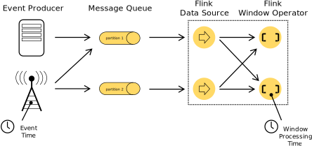

[toc]
# Flink中的API
Flink为流/批应用程序的开发提供了不同级别的抽象:

- Flink API最底层的抽象是有状态实时流处理，其抽象实现是[Process Function](https://nightlies.apache.org/flink/flink-docs-release-1.16/zh/docs/dev/datastream/operators/process_function/)，并且**Process Function**被Flink框架集成到了DataStream API中来为我们使用，它允许用户在应用程序中自由的处理来自单流或者多流的事件，并提供具有全局一致性和容错保障的状态。此外，用户可以在此层抽象中注册事件时间（event time）和处理时间(processing time)回调方法，从而允许程序可以实现复杂计算;
- Flink API的第二层抽象是Core APIs，许多应用程序不需要使用到上述最底层抽象的API，而是可以使用Core APIs进行编程，其中包含DataStream API(应用于有界/无界数据流场景)和DataSet API(应用于有界数据集场景)2部分。Core APIs提供的流式API为数据处理提供了通用的模块组件，例如各种形式的用户自定义转换(transformations)、联接(joins)、聚合(aggregations)、窗口(windows)和状态(state)操作等，此层API中处理的数据类型在没种编程语言中都有其对应的类。Process Function这类底层抽象和DataStream API的相互集成使得用户可以选择使用更底层的抽象API来实现自己的需求，DataSet API还额外提供了一些源语，比如循环/迭代操作;
- Flink API第三层抽象是Table API，Table API是以表为中心的声明式编程API，例如在流式数据场景下，它可以表示一张正在动态改变的表，Table API遵循关系模型: 即表拥有schema，并且Table API也提供了类似关系模型中的操作，比如select、project、join、group by和aggregate等，Table API程序是以声明的方式定义应执行的逻辑操作，而不是确切的指定程序应该执行的代码，尽管Table API使用起来很简洁并且可以由各种类型的用户自定义函数扩展功能，但还是比Core API的表达能力差，此外，Table API程序在执行之前还会使用优化器中的优化规则对用户编写的表达式进行优化，表和DataStream/DataSet可以进行无缝切换，Flink允许用户在编写应用程序时将Table API与DataStream/DataSet API混合使用;
- Flink API最顶层抽象是SQL，这层抽象在语义和程序表达上都类似于Table API，但是其程序实现都是SQL查询表达式，SQL抽象与Table API抽象之间的关联是非常紧密的，并且SQL查询语句可以在Table API中定义的表上执行。

# 有状态流处理
## 状态是什么
数据流中的很多操作一次只处理一个单一的事件，比如事件解析器，也有一些操作需要记录横跨多个事件的一些信息，比如窗口计算，这些计算就叫做有状态的。有状态计算的例子:
- 当一个应用搜索具体事件之间的关系模式，状态会存储连续的事件序列;
- 当按照分/小时/天单位维度聚合事件时，状态存储中间聚合状态;
- 当在数据流上训练机器学习模型时，状态需要保存模型参数;
- 当需要管理历史数据时，状态可以有效的访问历史事件。
Flink需要知道状态的存在以便通过checkpoints与savepoint机制实现容错，状态还支持Flink应用的扩缩容，也就是Flink会在并行的实例间重新分发状态。[可查询状态](https://nightlies.apache.org/flink/flink-docs-release-1.16/zh/docs/dev/datastream/fault-tolerance/queryable_state/)允许你从Flink外部访问状态。使用状态机制前，你需要了解[Flink's state backends](https://nightlies.apache.org/flink/flink-docs-release-1.16/zh/docs/ops/state/state_backends/)，Flink提供了多种state backends。
## Keyed State
分区状态可以被认为一种内嵌的key/value存储，有状态的操作读取流时，这些状态是在流上严格的分区并在在这些分区上分布的，因而，只允许在分区流上访问这些键值存储，比如，在一个keyed/partitioned数据交换操作后，访问键值存储只允许访问与当前的事件key相关联的value，对齐流的key与状态可以确保所有的状态更新都是本地操作，不需要事务的支持就可以保证数据一致性。这种对齐，也允许flink重新分发状态或者调整流的分区设置。

分区状态也会被深入组织成key groups，key groups是一种原子单元，Flink重新分发状态时，就是重新分发这种原子单元，key groups的数量与定义的最大并行度数量一样，在执行期间，每一个分区算子并行实例工作在一个或者多个key groups的keys上。
## State Persistence
Flink组合使用**流重放**机制与**checkpointing**机制实现了容错处理，一个checkpoint就是输入流中的一个特殊标记点，这个标记点还具有流经算子时对应的状态，流式数据流可以从一个checkpoint处重放，重放会保证数据一致性(精确一次处理语义)，这是通过存储的算子的状态并且从checkpoint标记点之后重放记录实现的。checkpoint间隔需要权衡考虑，综合焦虑执行期间的容错开销与恢复时的恢复时间(需要重放的记录数)。容错机制不断绘制分布式流式数据流的快照。对于状态较小的流式应用程序，这些快照非常轻量级，可以频繁绘制而不会对性能产生太大影响。 流应用程序的状态存储在可配置的位置，通常在分布式文件系统中。如果出现程序故障(由于机器、网络或软件故障)，Flink会停止分布式数据流。然后系统重新启动算子并将它们重置为最后成功的checkpoint。输入流被重置为状态快照标记点。重新启动的并行数据流处理的任何记录都保证不会影响先前的检查点状态。
默认情况下，checkpointing时关闭的，可以参考[Checkpointing]部分获得开启/配置checkpointing机制的细节。
为了使该机制实现其完全保证，数据流source(例如message queue或者broker)需要能够将流倒回到定义的最近点。[Apache Kafka](http://kafka.apache.org/)具有这种能力，Flink的Kafka connector利用了这一点。 有关Flink connectors提供的保证的更多信息，请参阅[数据源和数据汇的容错保证](https://nightlies.apache.org/flink/flink-docs-release-1.16/zh/docs/connectors/datastream/guarantees/)。因为Flink的checkpoints是通过分布式快照实现的，所以我们将snapshot和checkpoint互换使用。我们通常还使用术语snapshot来表示checkpoint或savepoint。
### Checkpointing
Flink容错机制的核心部分是对分布式数据流和算子状态绘制一致的快照。这些快照充当一致的checkpoints，系统可以在发生故障时回退到这些checkpoint。Flink绘制这些快照的机制在[Lightweight Asynchronous Snapshots for Distributed Dataflows](http://arxiv.org/abs/1506.08603)中有描述。它的灵感来自分布式快照的标准算法[Chandy-Lamport](http://research.microsoft.com/en-us/um/people/lamport/pubs/chandy.pdf)，Flink专门针对执行模型做了定制。请记住，与检查点有关的所有事情都可以异步完成。检查点barriers不会以锁的方式进行，并且操作可以异步快照其状态。从Flink 1.11版本开始，可以在对齐或不对齐的情况下记录checkpoints。在本节中，我们首先描述aligned checkpoints。
1. Barriers
   Flink分布式快照中的一个核心元素是*stream barriers*，这些栅栏被注入到数据流中，作为数据流的一部分记录存在，栅栏记录不存在乱序，它们是严格的一条线上的顺序流，栅栏将数据流中的记录分为进入当前快照的记录集和进入下一个快照的记录。每个栅栏都带有快照的ID，快照包含的记录都在它前面推送。栅栏不会中断数据流，非常轻量级。来自不同快照的多个栅栏可以同时在流中，这意味着各种快照可能并发发生。
   .svg)
   Stream栅栏在数据源被注入到并行的数据流，注入快照$n$的栅栏的点（我们称之为$S_n$）是源流中快照覆盖数据的位置。例如，在Apache Kafka中，此位置将是分区中最后一条记录的偏移量。这个位置$S_n$被报告给checkpoint coordinator（Flink 的 JobManager）。栅栏然后流向下游，当中间算子从其所有输入流中接收到快照$n$的栅栏时，它会将快照$n$的栅栏发射到其所有输出流中。一旦数据汇算子（流式DAG的末端）从其所有输入流中接收到栅栏$n$，它就会向checkpoint coordinator ack快照$n$。 在所有数据汇都ack快照后，它被认为已完成。一旦快照$n$完成，job将不会向数据源请求任何$S_n$位置之前的记录，因为这些记录都已经通过了整个数据流的拓扑逻辑（栅栏就是设置路卡拦截的意思）。接受多个输入流的算子需要在快照栅栏上对齐输入流，下面的图片表明
   .svg)
   - 只要算子从任意一个输入流中接收到栅栏$n$，它将不能继续处理流中后面的记录，直到从其他流中都接收到栅栏$n$，如果不等待，那么快照的输入流中将含有$n+1$的记录;
   - 一旦从最后一个输入流中接收到栅栏$n$，算子会将等待中的输出记录发送出去，然后发送栅栏$n$;
   - flink将状态存储为快照，开始处理后面的输入流数据;
   - 最后，算子异步的将状态写到state backend;
  请注意，所有有多个输入流的算子都需要对齐。
2. Snapshotting Operator State
   当算子包含任何形式的状态，快照将会包含状态。算子从所有输入流接收到快照栅栏后在将栅栏发射到其输出流之前的时间点快照其状态。此时，所有对状态的更新都来自栅栏之前的记录，并且没有任何更新依赖于应用栅栏之后的记录。因为快照的状态可能很大，所以它存储在可配置的*state backend*中。默认情况下，这是JobManager的内存，但对于生产使用，应配置分布式持久存储（例如 HDFS）。存储状态后，算子ack checkpoint，将快照栅栏发送到输出流中，然后继续处理后面的数据。最终快照包含:
   - 对于并行的数据源，包含流中的offset/position;
   - 对于每个算子，包含对于状态（作为快照的一部分存储）的指针
   
3. Recovery
   恢复的当时很简单，一旦失败，Flink选择最后的完成的checkpoint $k$执行恢复，Flink会重新部署整个分布式数据流，给每个算子分配快照$k$中的状态，数据源被重置为从快照中的指定位置开始读取输入流，如果状态是增量快照的，算子将会从最后一次全量快照的状态开始，依次应用快照的增量更新。可以参考[重启策略](https://nightlies.apache.org/flink/flink-docs-release-1.16/zh/docs/ops/state/task_failure_recovery/#restart-strategies)获取更多的信息。
### 未对齐的checkpointing
checkpointing时也可以不用对齐，The basic idea is that checkpoints can overtake all in-flight data as long as the in-flight data becomes part of the operator state。记住，这种方式实际接近Chandy-Lamport algorithm，但是Flink仍然会在source中插入barrier以避免overloading the checkpoint coordinator.

上面的图片描述了一个算子如何处理未对齐的checkpoint barrier。
- The operator reacts on the first barrier that is stored in its input buffers;
- It immediately forwards the barrier to the downstream operator by adding it to the end of the output buffers
- The operator marks all overtaken records to be stored asynchronously and creates a snapshot of its own state.

因此，算子只是简短的停止input处理，来标记buffer，转发barrier并创建其他状态的快照。Unaligned checkpointing ensures that barriers are arriving at the sink as fast as possible. It’s especially suited for applications with at least one slow moving data path, where alignment times can reach hours. However, since it’s adding additional I/O pressure, it doesn’t help when the I/O to the state backends is the bottleneck. See the more in-depth discussion in ops for other limitations.

Note that savepoints will always be aligned.

Unaligned Recovery #
Operators first recover the in-flight data before starting processing any data from upstream operators in unaligned checkpointing. Aside from that, it performs the same steps as during recovery of aligned checkpoints.

### State Backends
key/value存储的数据结构依赖选择的state backend，有in-memory hashmap/RocksDB几种state backend。除了定义保存状态的数据结构，state backend也实现了一些逻辑用于获取key/value状态的一个时间点快照并存储快照为checkpoint的一部分。可以配置State backends而不需要变更你的应用逻辑。

### Savepoints
具有checkpoint机制的所有程序都可以从一个savepoint恢复执行，Savepoint可以让你在不丢失任何状态的情况下更新程序逻辑或者Flink集群。Savepoint是人工触发的checkpoint，Savepoint获取程序的快照并将它写入state backend，为此，Savepoint依赖常规检查点机制。Savepoint类似与checkpoint，除了他们是手动触发的，而且不会自动过期。为了正确使用savepoints，了解 checkpoints与 savepoints之间的区别非常重要，[checkpoints与savepoints](https://nightlies.apache.org/flink/flink-docs-release-1.16/zh/docs/ops/state/checkpoints_vs_savepoints/)中对此进行了描述。
### Exactly Once vs At Least Once
对齐可能会增加流式程序的延迟，通常来说，这个额外的延迟差不多几毫秒。但是我们也碰到过一些极端的场景，延迟明显的增大。对于需要超低延迟的应用来说，可以控制Flink忽略checkpoint过程中的流对齐。只要算子从每一个input中看到checkpoint barrier，checkpoint就会尽快的的到执行。When the alignment is skipped, an operator keeps processing all inputs, even after some checkpoint barriers for checkpoint n arrived. That way, the operator also processes elements that belong to checkpoint n+1 before the state snapshot for checkpoint n was taken. On a restore, these records will occur as duplicates, because they are both included in the state snapshot of checkpoint n, and will be replayed as part of the data after checkpoint n.Alignment happens only for operators with multiple predecessors (joins) as well as operators with multiple senders (after a stream repartitioning/shuffle). Because of that, dataflows with only embarrassingly parallel streaming operations (map(), flatMap(), filter(), …) actually give exactly once guarantees even in at least once mode.

## State ann Fault Tolerance in Batch Programs
Flink执行批处理程序是当作特殊的流式程序处理的。这种特殊的流式程序的流是有界的(有限数量的元素)，DataSet在内部被认为是数据流，所以上面的应用与流式程序的概念对于批处理程序也是适用的。只有几个微小的差别:
- 批处理程序的容错不使用checkpointing机制，如果失败了只需要重新处理批数据就行了。
- Stateful operations in the DataSet API use simplified in-memory/out-of-core data structures, rather than key/value indexes;
- The DataSet API introduces special synchronized (superstep-based) iterations, which are only possible on bounded streams. For details, check out the iteration docs.

# 及时流处理(实时流处理)
## Introduction
及时流处理是状态流处理的延伸，在及时流处理中，时间是一个特别重要的因素。一些场景，比如时序分析，基于时间周期聚合，基于时间的事件处理等场景都是及时流处理场景。下面是一些开发及时流处理应用的注意点。
## Notions of Time: Event Time and Processing Time
流处理程序中存在2种时间概念:
- Processing Time: 处理时间是执行算子操作的机器的系统时间，当流式应用使用处理时间时，所有的基于时间的操作(比如时间窗口)都会使用算子运行的机器的系统时钟时间，一个每一小时的处理时间窗口会包括系统完整一小时内到达算子的所有时间或者记录。比如说，如果应用在9:15am开始运行，第一个一小时处理时间窗口处理的数据包含从9:15am～10:00am的数据，下一个时间窗口包含的数据是10:00am ~ 11:00am之间。处理时间是最容易理解的时间概念，不需要流与机器之间的协调。提供了最佳的性能以及最低的延迟。然而，在分布式以及异步的环境中，处理时间无法做到精确保证。因为它会收到消息到达的速率的影响，还收到消息在算子间流动速率的影响等等。
- Event Time: 事件时间就是消息在生产者设备上本身产生时的时间，通常内嵌在事件本身中，并且可以从事件中解析出事件时间。使用事件时间，时间处理进度依赖数据本身，不依赖机器的时钟周期。事件时间流处理程序必须明确指出如何生成*Event Time Watermark*，这是一种通知处理进展的机制。在完美的世界中，事件时间处理能够产生完整的一致性正确的结果，不论事件什么时候达到以什么顺序到达。然而，除非事件有序的到达，否则事件时间处理会因为等待乱序事件带来一些延迟，因为它只能等待有限的时间，这可能会对正确性产生影响。假设所有的数据都到达了，事件时间操作就会正常处理并产生正确的一致的结果，即使存在乱序事件。比如，每小时事件时间窗口会包含所有事件时间在窗口内的事件，不管事件到达的顺序。记住，有时候事件时间流处理程序会处理实时数据，他们可能会使用处理时间，以保证他们的低延迟能够的到及时的处理。

## Event Time and Watermarks
注意: Flink实现了很多来自Dataflow Model的技术。如果相对事件时间与watermarks有更深入的了解，可以参考下面的文章:
- [Streaming 101](https://www.oreilly.com/ideas/the-world-beyond-batch-streaming-101) by Tyler Akidau
- The [Dataflow Model paper](https://research.google.com/pubs/archive/43864.pdf)

支持事件时间的流处理器需要一种方式来测定当前事件时间的进度（也就是哪些事件是OK，已经过去了）。比如，一个每小时窗口算子会被通知事件时间已经超过当前窗口一小时的结束时间，所以，算子可以关闭窗口。事件时间的推进可以独立与处理时间。也就是2者没关系。比如: 在一个程序中，当前算子的事件时间可能稍微落后处理时间，这是考虑到接收事件与事件流动的延迟。2者的处理速度是一样的。另一方面，另一个流处理程序可能在几秒钟内处理完整周的数据，这是通过消费早已存在的历史数据实现的。Flink保证事件时间推进的机制是watermark。watermark流是数据流的一部分携带了时间戳*t*，*Watermark(t)*声明流中的事件时间已经到达了*t*。这意味着后续流中的数据的时间戳$t^'$都是大于 *t*的，也就是不存在更多的数据的时间戳\<=*t*。下面的图展示了一个带有时间戳的时间流，内部有watermark流。在这个例子中，事件是按照时间戳有序的，意味着watermark只是流中的简单周期性标记。

watermark对于乱序流是非常重要的。正如下面的插图所示，事件是乱序的。通常来说，watermark就是一个声明，在流的当前点，带有watermark以前的时间戳的所有事件都到达了。一旦watermark到达算子，算子将它哪部的事件时间推进到watermark指示的值。

记住，事件时间来自于流中的元素，这些元素要么本身是事件，要么就是来自于watermark点。
### Watermarks in Parallel Streams
Watermark在source中生成，也可以在source后生成。一个source的并行的子任务通常都独立的生成自己的watermark。这些watermark定义了source的事件时间。随着watermark在流中流动，当watermark到达算子时就推动了这个算子的事件时间前进。当算子的事件时间推进时，它会为后继的算子生成新的watermark。一些算子消费多个输入流，这会联合起来。比如，一个算子在`keyBy(...)`或者`partition(...)`function之后。这样一个算子的当前的事件时间是它的所有输入流事件时间的最小值。随着输入流更新它的事件时间，算子也会更新。下面的图示是一个并行流中的事件/watermark流动的例子:

## Lateness
特定元素也可能会在watermark时间戳之后到达。事实上，在真实的世界，特定的元素可能会在任意时间到达。所以指定一个时间戳标识所有相关的事件都已到达了，这几乎是不可能的。而且，即使迟到时间在一定范围内，watermark延迟太长时间通常不是想要的结果，可能造成严重的计算delay。出于这个原因，流式程序可能会明确需要一些延迟元素。迟到元素是在系统的事件时钟（由watermark发出信号）已经超过迟到元素时间戳的时间之后到达的元素。有关如何在事件时间窗口中处理迟到元素的更多信息，请参阅[允许迟到](https://nightlies.apache.org/flink/flink-docs-release-1.16/zh/docs/dev/datastream/operators/windows/#allowed-lateness)。
## Windowing
聚合事件操作(比如计数、汇总)在流程序与批处理程序中工作方式是不同的，比如，你不可能计算流中所有元素的个数，因为流是无界的。流的聚合计算是通过window实现的。Widnows是通过时间/数据驱动的，比如每30s，或者每100个元素。Window的类型:
- tumbling windows(no overlap)
- sliding widnows(with overlap)
- session windows(punctuated by a gap of inactivity)

请参考这里的[博客](https://flink.apache.org/news/2015/12/04/Introducing-windows.html)，这里有窗口计算的例子。或者参考DataStream API中的[window document](https://nightlies.apache.org/flink/flink-docs-release-1.16/zh/docs/dev/datastream/operators/windows/)部分。
# Flink架构
Flink是一个分布式系统，需要有效分配和管理计算资源才能执行流应用程序。它集成了所有常见的集群资源管理器，例如Hadoop YARN，但也可以设置为独立集群甚至库运行。
## Flink集群刨析
Flink运行时由2种类型的进程组成: 一个JobManager和一个或者多个TaskManager。

Client不是运行时和程序执行的一部分，而是用于准备数据流并将其发送给JobManager。之后，客户端可以断开连接(分离模式)，或保持连接来接收进程报告（附加模式）。客户端可以作为触发执行Java/Scala程序的一部分运行。也可以在命令行进程`./bin/flink run ...`中运行。可以通过多种方式启动Jobmanager/TaskManager。直接在机器上作为standalone集群启动、在容器中启动、或者通过YARN等资源框架管理并启动。TaskManager连接到JobManager，宣布自己可用，并被分配工作。
### JobManager
JobManager具有许多与协调Flink应用程序的分布式执行有关的职责: 它决定何时调度下一个task、对完成的task或者执行失败做出反应，协调checkpoint、协调故障恢复，由3个组件构成：
- ResourceManager: ResourceManager负责Flink集群中的资源提供、回收、分配。它管理task slots。这是Flink集群中资源调度的单位。Flink为不同的环境和资源提供者比如YARN、Kubernetes、standalone部署实现了对应的ResourceManager。在standalone设置中，ResourceManager只能分配可用TaskManager的slots，而不能自行启动新的TaskManager。
- Dispatcher: Dispatcher提供了一个REST接口，用来提交Flink应用程序执行，并为每个提交的作业启动一个新的JobMaster，它还运行Flink WebUI用来提供作业执行信息。
- JobMaster: JobMaster负责管理单个JobGraph的执行。Flink集群中可以同时运行多个作业，每个作业都有自己的JobMaster。

始终至少有一个JobManager，高可用设置中可能有多个JobManager，其中一个始终是leader，其他的则是standby[高可用](https://nightlies.apache.org/flink/flink-docs-release-1.16/zh/docs/deployment/ha/overview/)。
### TaskManagers
TaskManager(worker)执行作业流的task，并且缓存和交换数据流。必须始终至少有一个TaskManager。在TaskManager中资源调度的最小单位是task slot。TaskManager中task slot的数量表示并发处理task的数量，请注意一个task slot中可以执行多个算子[Tasks和算子链](https://nightlies.apache.org/flink/flink-docs-release-1.16/zh/docs/concepts/flink-architecture/#tasks-and-operator-chains)
## Tasks和算子链
对于分布式执行，Flink将算子的subtasks链接成tasks。每个原子task由一个线程执行。将算子链接成task是个有用的优化: 它减少线程间切换、缓冲的开销，并且减少延迟的同时增加整体吞吐量。链行为是可以配置的，请参考[链文档](https://nightlies.apache.org/flink/flink-docs-release-1.16/zh/docs/dev/datastream/operators/overview/#task-chaining-and-resource-groups)以获取详细信息。
下图中样例数据流用 5 个 subtask 执行，因此有 5 个并行线程。

## Task Slots和资源
每个worker(TaskManager)都是一个JVM进程，可以在单独的线程中执行一个或者多个subtask。为了控制一个TaskManager中接受多少个task，就有了所谓的task slots，至少一个。每个task slot代表TaskManager中资源的固定子集。具有3个slot的TaskManager，会将托管内存1/3用于每个slot。分配资源意味着subtask不会与其他作业的subtask竞争托管内存，而是具有一定数量的保留托管内存。此处没有CPU隔离，当前slot仅分离task的托管内存。通过调整task slot的数量，用户可以定义subtask如何相互隔离。每个TaskManager有一个slot，这意味着每个task组都在单独的JVM中运行。具有多个slot意味着更多subtask共享同一JVM，同一JVM中的task共享TCP连接(多路复用)和心跳信息。它们还可以共享数据集和数据结构，从而减少每个task的开销。

默认情况下，Flink允许subtask共享slot，即便它们是不同的task的subtask，只要是来自于同一个作业即可。结果就是一个slot可以持有整个作业管道。允许slot共享有2个主要优点:
- flink集群所需的task slot和作业中使用的最大并行度恰好一样，无需计算程序总共包含多少个task，具有不同并行度;
- 容易获得更好的资源利用。如果没有slot共享，非密集subtask(source/map)将阻塞和密集型subtask(window)一样多的资源。通过slot共享，我们示例中的基本并行度从2增加到6，可以充分利用分配的资源，同时确保繁重的subtask在TaskManager之间公平分配.

## Flink应用程序执行
Flink是从其main()方法产生的一个或多个Flink作业的任何用户程序。这些作业的执行可以在本地JVM（LocalEnvironment）中进行，或具有多台机器的集群的远程设置(RemoteEnvironment)中进行。对于每个程序，`ExecutionEnvironment`提供了一些方法来控制作业执行，例如设置并行度并与外界交互。Flink应用程序的作业可以被提交到长期运行的[Flink Session集群](https://nightlies.apache.org/flink/flink-docs-release-1.16/zh/docs/concepts/glossary/#flink-session-cluster)，专用的[Flink Job集群](https://nightlies.apache.org/flink/flink-docs-release-1.16/zh/docs/concepts/glossary/#flink-job-cluster)或者[Flink Application集群](https://nightlies.apache.org/flink/flink-docs-release-1.16/zh/docs/concepts/glossary/#flink-application-cluster)。这些选项之间的差异主要与集群的生命周期和资源隔离保证有关。
### Flink Session集群
- 集群生命周期: Flink Session集群中，客户端连接到一个预先存在的长期运行的集群，集群可以接受多个作业提交。即使所有作业完成后，集群仍将继续运行直到手动停止session为止，Flink Session集群的寿命不受任何Flink作业寿命的约束;
- 资源隔离: TaskManager slot由ResourceManager在提交作业时分配，并在作业完成时释放。由于所有的作业都共享同一集群，因此在集群资源方面存在一些竞争，此共享设置的局限性在于如果TaskManager崩溃，则在此TaskManager上运行task的所有作业都将失败，类似的，如果JobManager发生一些致命错误，它将影响集群中正在运行的所有作业;
- 其他注意事项: 拥有一个预先存在的集群可以节省大量时间申请资源和启动TaskManager。有种场景很重要，作业执行时间短并且启动时间长会对端到端的用户体验产生负面的影响，就像对简短查询的交互式分析一样，希望作业可以使用现有资源快速执行计算。
### Flink Job集群
- 集群生命周期: 在Flink Job集群中，可用的集群管理器用于为每个作业启动一个集群，并且该集群仅可用于该作业。在这里，客户端首先从集群管理器请求资源启动JobManager，然后将作业提交给在这个进程中运行的 Dispatcher。然后根据作业的资源请求惰性的分配TaskManager。一旦作业完成，Flink Job集群将被拆除;
- 资源隔离: JobManager中的致命错误仅影响在Flink Job集群中运行的一个作业;
- 其他注意事项: 由于ResourceManager必须应用并等待外部资源管理组件来启动TaskManager进程和分配资源，因此 Flink Job集群更适合长期运行、具有高稳定性要求且对较长的启动时间不敏感的大型作业。k8s不支持
### Flink Application 集群
- 集群生命周期: Flink Application集群是专用的Flink集群，仅从Flink应用程序执行作业，并且main()方法在集群上而不是客户端上运行。提交作业是一个单步骤过程：无需先启动Flink集群，然后将作业提交到现有的session集群；相反，将应用程序逻辑和依赖打包成一个可执行的作业JAR中，并且集群入口（ApplicationClusterEntryPoint）负责调用main(方法来提取JobGraph。例如，这允许你像在Kubernetes上部署任何其他应用程序一样部署Flink应用程序。因此，Flink Application集群的寿命与Flink应用程序的寿命有关。
- 在Flink Application集群中，ResourceManager和Dispatcher作用于单个的Flin 应用程序，相比于Flink Session集群，它提供了更好的隔离。Flink Job集群可以看做是Flink Application集群客户端运行的替代方案。

# 词汇表
- Flink Application Cluster: Flink Application 集群是专用的Flink Cluster，仅从Flink Application执行Flink Jobs。它的寿命与Flink Application的寿命有关;
- Flink Job Cluster: Flink Job集群是专用的Flink Cluster，仅执行一个Flink Job。 Flink Cluster的寿命与Flink Job的寿命有关;
- Flink Cluster: 一般情况下，Flink集群是由一个Flink JobManager和一个或多个Flink TaskManager进程组成的分布式系统;
- Event: Event是对应用程序建模的域的状态更改的声明。它可以同时为流或批处理应用程序的input和output，也可以单独是input或者output中的一种，Event是特殊类型的Record;
- ExecutionGraph: [Physical Graph](https://nightlies.apache.org/flink/flink-docs-release-1.16/zh/docs/concepts/glossary/#physical-graph)
- Function: Function是由用户实现的，封装了Flink程序的应用程序逻辑，大多数Function都由相应的Operator封装;
- Instance: Instance常用于描述运行时的特性类型(通常是Operator/Function)的一个具体实例。由于Flink主要用Java编写的，这与Java中的概念一致，在Flink的上下文中，parallel instance也常用于强调同一Operator/Function的多个instance以并行的方式运行;
- Flink Application: 一个Flink应用程序是一个Java应用程序，从Main方法提交一个或多个Flink Jobs，提交Jobs通常是通过调用`ExecutionEnvironment.execute()`完成的;
- Flink Job: Flink Job表示为运行时的logical graph，通过在Flink Application中调用execute()方法来创建和提交;
- JobGraph: 见[Logical Graph](https://nightlies.apache.org/flink/flink-docs-release-1.16/zh/docs/concepts/glossary/#logical-graph);
- Flink JobManager: 是Flink Cluster的主节点，包含3个不同的组件:
  - Flink Resource Manager;
  - Flink Dispatcher;
  - Flink JobMaster;
- Flink JobMaster: JobMaster是在Flink JobManager运行中的组件之一。JobManager负责监督单个作业Task的执行。以前，整个Flink JobManager都叫做JobManager;
- JobResultStore: JobResultStore是一个Flink组件，它将全局终止(已完成的、取消的、失败的)作业的结果保存到文件系统中，从而使结果比已完成的作业更长久，这些结果然后被Flink用来确定作业是否应该在高可用集群中被恢复;
- Logical Graph: 逻辑图是一种有向图，其中顶点是算子，边定义算子的输入/输出体系对应于数据流或者数据集;
- Managed State: Managed State描述了已在框架中注册的应用程序的托管状态。对于托管状态，Apache Flink会负责持久化和重伸缩等事宜;
- Operator: Logical Graph的节点，算子执行某种操作，该操作由Function执行，Source/Sink是数据人输入数据输出的特殊算子;
- Operator Chain: 算子链由两个或多个连续的Operator组成，两者之间没有任何的重新分区。同一算子链内的算子可以彼此直接传递record，而无需通过序列化或Flink的网络栈;
- Partition: 分区是整个数据流或数据集的独立子集。通过将每个Record分配给一个或多个分区，来把数据流或数据集划分为多个分区。在运行期间，Task会消费数据流或数据集的分区。改变数据流或数据集分区方式的转换通常称为重分区;
- Physical Graph: Physical graph是一个在分布式运行时，把Logical Graph转换为可执行的结果。节点是 Task，边表示数据流或数据集的输入/输出关系或partition;
- Record: Record是数据集或数据流的组成元素。Operator和Function接收record作为输入，并将record作为输出发出;
- Flink Session Cluster: 长时间运行的Flink Cluster，它可以接受多个Flink Job的执行。此Flink Cluster 的生命周期不受任何Flink Job生命周期的约束限制。以前，Flink Session Cluster也称为session mode的Flink Cluster，和Flink Application Cluster相对应;
- State Backend: 对于流处理程序，Flink Job的State Backend决定了其state是如何存储在每个TaskManager上的，TaskManager的Java堆栈或嵌入式RocksDB，以及它在checkpoint时的写入位置(Flink JobManager的Java堆栈还是FileSystem);
- Sub-Task: Sub-Task是负责处理数据流Partition的Task，Sub-Task强调的是同一个Operator或者Operator Chain具有多个并行的Task;
- Task: Task是Physical Graph的节点。它是基本的工作单元，由Flink的runtime来执行。Task正好封装了一个 Operator或者Operator Chain的parallel instance;
- Flink TaskManager: TaskManager是Flink Cluster的工作进程。Task被调度到TaskManager上执行。TaskManager相互通信，只为在后续的Task之间交换数据;
- Transformation: Transformation应用于一个或多个数据流或数据集，并产生一个或多个输出数据流或数据集。Transformation可能会在每个记录的基础上更改数据流或数据集，但也可以只更改其分区或执行聚合。虽然Operator 和Function是Flink API的"物理"部分，但Transformation只是一个API概念。具体来说，大多数（但不是全部）Transformation是由某些Operator实现的。
