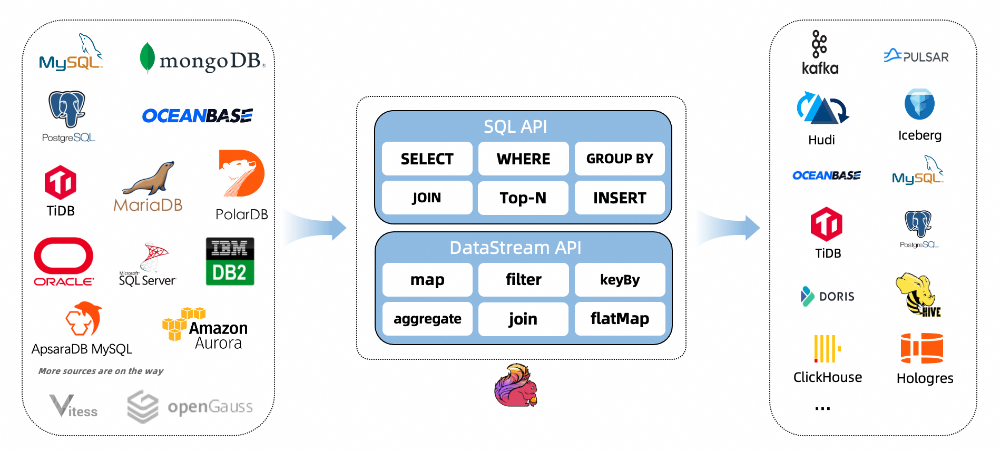

CDC Connectors for Apache Flink是一些开源的Flink Connector的集合。使用CDC的方式跟踪数据库变化，CDC连接器集成了Debezium作为CDC的引擎，所以依托Debezium的能力，它可以做到CDC。

支持的连接器如下:
|Connector|Database|Driver|
|:---|:---|:---|
|mongodb-cdc|MongoDB: 3.6, 4.x, 5.0|MongoDB Driver: 4.3.1|
|mysql-cdc|MySQL: 5.6, 5.7, 8.0.x<br>RDS MySQL: 5.6, 5.7, 8.0.x<br>PolarDB MySQL: 5.6, 5.7, 8.0.x<br>Aurora MySQL: 5.6, 5.7, 8.0.x<br>MariaDB: 10.x<br>PolarDB X: 2.0.1|JDBC Driver: 8.0.27|
|oceanbase-cdc|OceanBase CE: 3.1.x<br>OceanBase EE (MySQL mode): 2.x, 3.x|JDBC Driver: 5.1.4x|
|oracle-cdc|Oracle: 11, 12, 19|Oracle Driver: 19.3.0.0|
|postgres-cdc|PostgreSQL: 9.6, 10, 11, 12|JDBC Driver: 42.2.12|
|sqlserver-cdc|Sqlserver: 2012, 2014, 2016, 2017, 2019|JDBC Driver: 7.2.2.jre8|
|tidb-cdc|TiDB: 5.1.x, 5.2.x, 5.3.x, 5.4.x, 6.0.0|JDBC Driver: 8.0.27|
|db2-cdc|Db2: 11.5|DB2 Driver: 11.5.0.0|

支持的flink版本如下:
|Flink CDC version|Flink version|
|:---|:---|
|1.0.0|1.11.*|
|1.1.0|1.11.*|
|1.2.0|1.12.*|
|1.3.0|1.12.*|
|1.4.0|1.13.*|
|2.0.\*|1.13.*|
|2.1.\*|1.13.*|
|2.2.\*|1.13.*,1.14.\*|
|2.3.\*|1.13.*,1.14.\*,1.15.\*,1.16.\*|

支持读取数据库快照，支持持续读取binlogs以精确一次的处理语义即使发生失败。DataStream API的CDC连接器，用户可以在单个作业中使用多个数据库和表的更改，而无需部署Debezium和Kafka。Table/SQL API的CDC连接器，用户可以使用SQL DDL创建CDC源来监视单个表上的更改。
```sql
-- creates a mysql cdc table source
CREATE TABLE mysql_binlog (
 id INT NOT NULL,
 name STRING,
 description STRING,
 weight DECIMAL(10,3),
 PRIMARY KEY(id) NOT ENFORCED
) WITH (
 'connector' = 'mysql-cdc',
 'hostname' = 'localhost',
 'port' = '3306',
 'username' = 'flinkuser',
 'password' = 'flinkpw',
 'database-name' = 'inventory',
 'table-name' = 'products'
);

-- read snapshot and binlog data from mysql, and do some transformation, and show on the client
SELECT id, UPPER(name), description, weight FROM mysql_binlog;
```
```xml
<dependency>
  <groupId>com.ververica</groupId>
  <!-- add the dependency matching your database -->
  <artifactId>flink-connector-mysql-cdc</artifactId>
  <!-- The dependency is available only for stable releases, SNAPSHOT dependency need build by yourself. -->
  <version>2.4-SNAPSHOT</version>
</dependency>
```
```java
import org.apache.flink.streaming.api.environment.StreamExecutionEnvironment;
import com.ververica.cdc.debezium.JsonDebeziumDeserializationSchema;
import com.ververica.cdc.connectors.mysql.source.MySqlSource;

public class MySqlBinlogSourceExample {
  public static void main(String[] args) throws Exception {
    MySqlSource<String> mySqlSource = MySqlSource.<String>builder()
            .hostname("yourHostname")
            .port(yourPort)
            .databaseList("yourDatabaseName") // set captured database
            .tableList("yourDatabaseName.yourTableName") // set captured table
            .username("yourUsername")
            .password("yourPassword")
            .deserializer(new JsonDebeziumDeserializationSchema()) // converts SourceRecord to JSON String
            .build();
    
    StreamExecutionEnvironment env = StreamExecutionEnvironment.getExecutionEnvironment();
    
    // enable checkpoint
    env.enableCheckpointing(3000);
    
    env
      .fromSource(mySqlSource, WatermarkStrategy.noWatermarks(), "MySQL Source")
      // set 4 parallel source tasks
      .setParallelism(4)
      .print().setParallelism(1); // use parallelism 1 for sink to keep message ordering
    
    env.execute("Print MySQL Snapshot + Binlog");
  }
}
```