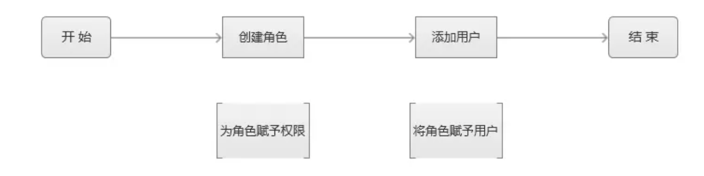

基于角色的访问控制，RBAC，Role-based access control，在信息安全领域中，一种较新且广为使用的安全访问控制机制，它实现了强制访问控制（mandatory access control，MAC）与自由选定访问控制（discretionary access control， DAC）RBAC是一个定义于角色与权限之上的中立的访问控制机制，RBAC的关系组件比如role-permission，user-role，role-role使得RBAC执行赋权非常简单，RBAC满足商业与政府组织的需求，RBAC使得管理大型组织的安全变得容易，1996年，莱威-桑度在前任的理论基础上，提出以角色为基础的访问控制模型，所以这个模型也被称为RBAC96，美国国家标准局重新定义了以角色为基础的访问控制模型，并纳为一种标准，成为NIST RBAC。相比强制访问控制以及自由选定访问控制，RBAC更中性且灵活性更好。
1. 定义
组织中，因为不同的作业功能产生不同的角色，执行某项操作的权限会被赋予特定的角色，组织成员被赋予不同的角色，这些用户通过被赋予角色来获取执行某项计算机系统功能的权限。因为用户没有被直接赋予权限，只是间接的通过角色来获取权限，用户的权限管理之需要简单的改变用户的角色就可以了，这简化了常见的操作，比如添加用户、改变用户的部门。
基于角色的访问控制干扰在安全应用程序中是一个相对较新的问题，其中具有动态访问级别的多个用户帐户可能会导致加密密钥不稳定，从而允许外部用户利用该弱点进行未经授权的访问。 动态虚拟化环境中的密钥共享应用程序在解决这个问题方面取得了一些成功。
RBAC定义了3个主要准则:
- Role assignment: 一个subject行使权限只能是被赋予了角色的情况下;
- Role authorization: subject的活动角色必须为subject授权。根据上面的规则1，此规则确保用户只能担任他们被授权的角色;
- Permission authorization: 只有当权限被授权给subject的活动角色时，subject才能行使权限。根据规则1和2，此规则确保用户只能行使他们被授权的权限;也可以应用其他约束，并且可以将角色组合在层次结构中，其中更高级别的角色包含子角色拥有的权限；借助角色层次结构和约束的概念，可以控制RBAC以创建或模拟基于点阵的访问控制 (LBAC)。 因此RBAC可以被认为是LBAC的超集。
- S=subject=主体=用户或者用户组
- R=role=角色=工作职位或者职称;
- P=permission=权限=一种访问资源的方式;
- SE=Session-涉及到S、R、P的映射;
- SA=Subject Assignment=主体分配;
- PA=Permission Assignment=权限分配;
- RH=Role Hierarchy,RH can also be written: ≥ (The notation: x ≥ y means that x inherits the permissions of y.)
* A subject can have multiple roles;
* A role can have multiple subjects;
* A role can have many permissions;
* A permission can be assigned to many roles;
* An operation can be assigned to many permissions;
* A permission can be assigned to many operations;
约束对来自相反角色的权限的潜在继承设置了限制性规则，因此它可用于实现适当的职责分离。 例如，不应允许同一个人同时创建登录帐户和授权帐户创建。
- {\displaystyle PA\subseteq P\times R} 是一个多对多的权限-角色分配方式。
- {\displaystyle SA\subseteq S\times R}{\displaystyle SA\subseteq S\times R} 是一个多对多的主体-角色指派方式。
- {\displaystyle RH\subseteq R\times R}{\displaystyle RH\subseteq R\times R}
NIST/ANSI/INCITS RBAC 标准 (2004) 承认三个级别的RBAC:
- 核心RBAC;
- 分层RBAC，增加了对角色之间继承的支持;
- 受约束的RBAC，增加了职责分离;
2. 与其他模型的关系
RBAC是一种灵活的访问控制技术，其灵活性使其能够实现DAC或MAC。带有组的DAC（例如，在POSIX文件系统中实现）可以模拟RBAC。如果角色图被限制为树而不是部分有序集，MAC可以模拟RBAC。在RBAC模型开发出来之前，Bell-LaPadula(BLP)模型是MAC的同义词，文件系统权限是DAC的同义词，这些模型被认为是唯一已知的访问控制模型，如果一个模型不是BLP，则认为它是DAC，反之亦然，1990晚期的研究表明RBAC不属于任何类别，基于上下文的访问控制 (CBAC) 不同，RBAC 不查看消息上下文（例如连接的源），RBAC也因导致角色爆炸而受到批评，这是大型企业系统中的一个问题，因为大型企业系统需要比RBAC提供的更精细粒度的访问控制，因为角色固有地分配给操作和数据类型，与CBAC类似，基于实体关系的访问控制（ERBAC，虽然相同的首字母缩写词也用于修改后的RBAC系统，例如扩展的基于角色的访问控制）系统能够保护数据实例通过考虑它们与执行主体的关联。
- 相比于ACL: Access Control Lists(ACLs)通常用在传统的自主访问控制系统中，用来影响低级别数据对象，RBAC与ACL的不同是，访问控制列表 (ACL) 在传统的自主访问控制系统中用于影响低级数据对象。 RBAC 与 ACL 的不同之处在于将权限分配给更改多个实体之间的直接关系的操作（请参阅下面的 ACLg）。例如，ACL 可用于授予或拒绝对特定系统文件的写访问权，但它不会规定如何更改该文件。在基于 RBAC 的系统中，操作可能是在财务应用程序中“创建信用账户”交易或在医疗应用程序中“填充血糖水平测试”记录。因此，角色是更大活动中的一系列操作。 RBAC 已被证明特别适合职责分离 (SoD) 要求，该要求确保必须有两个或更多人参与授权关键操作。分析了RBAC中SoD安全的充要条件。 SoD 的一个基本原则是任何个人都不能通过双重特权来破坏安全性。通过扩展，任何人都不得担任对另一个同时担任的角色行使审计、控制或审查权力的角色。
- Attribute-based access control, 基于属性的访问控制，这个模型来自于RBAC模型，除了角色与组外还要考虑额外的属性，在ABAC模型中，可能使用的属性有:
* 用户信息;
* 资源;
* 动作;
* 上下文，比如时间、位置与IP.
ABAC是基于策略的，因为它使用策略而不是静态权限来定义允许或不允许的内容。
3. Use and Availability
使用 RBAC 来管理单个系统或应用程序中的用户权限（计算机权限）已被广泛接受为最佳实践。 Research Triangle Institute 为 NIST 准备的 2010 年报告分析了 RBAC 对企业的经济价值，并估计了每位员工从减少员工停机时间、更有效的供应和更有效的访问控制策略管理中获得的收益。在具有异构 IT 基础架构和需求跨越数十或数百个系统和应用程序的组织中，使用 RBAC 管理足够的角色并分配足够的角色成员资格变得极其复杂，而无需分层创建角色和权限分配。较新的系统扩展了旧的NIST RBAC模型，以解决RBAC对企业范围部署的限制。 NIST模型作为ANSI/INCITS 359-2004被INCITS采用为标准。还发表了关于 NIST 模型的一些设计选择的讨论.
4. RBAC模型分类
RBAC0, RBAC1, RBAC1, RBAC34种
- RBAC0，最简单的用户、角色、权限模型,包含2种，1种是用户与角色的是多对一关系，另一种是用户与角色的关系是多对多关系，如果用户的身份单一，使用多对一的关系，如果存在多重身份，使用多对多的关系;
- RBAC1，增加了自角色，引入了继承概念，子角色可以继承父角色的所有的权限;而RBAC1模型就很好解决了这个问题，创建完经理角色并配置好权限后，主管角色的权限继承经理角色的权限，并且支持在经理权限上删减主管权限;
- RBAC2, 增加了对角色的一些限制，角色互斥、基数约束、先决条件角色等
* 角色互斥: 同一用户不能分配到一组互斥角色集合中的多个角色，互斥角色是指权限互相制约的两个角色。案例：财务系统中一个用户不能同时被指派给会计角色和审计员角色;
* 基数约束: 一个角色被分配的用户数量受限，它指的是有多少用户能拥有这个角色。例如：一个角色专门为公司CEO创建的，那这个角色的数量是有限的;
* 先决条件角色: 指要想获得较高的权限，要首先拥有低一级的权限。例如：先有副总经理权限，才能有总经理权限;
* 运行时互斥: 例如，允许一个用户具有两个角色的成员资格，但在运行中不可同时激活这两个角色;
* RBAC3模型: 统一模型，综合了RBAC0，1，2的所有的特点;
5. 权限
权限是资源的集合，这里的资源指的是软件中所有的内容，包括模块、菜单、页面、字段、操作功能（增删改查）等等；大体分为页面权限、操作权限与数据权限.
- 页面权限: 所有系统都是由一个个的页面组成，页面再组成模块，用户是否能看到这个页面的菜单、是否能进入这个页面就称为页面权限;
- 操作权限: 用户凡是在操作系统中的任何动作、交互都是操作权限，如增删改查等;
- 数据权限: 一般业务管理系统，都有数据私密性的要求：哪些人可以看到哪些数据，不可以看到哪些数据;
实现数据权限的方式:
- 可以利用RBAC1模型，通过角色分级来实现;
- 在"用户-角色-权限"的基础上，增加用户与组织的关联关系，用组织决定用户的数据权限;
6. 如何设计RBAC权限系统
一个简单的权限系统应该具有哪些内容，用户-角色-权限，角色作为枢纽，关联用户、权限，基本的操作是创建一个角色，位这个角色赋予相应权限最后将角色赋予用户。

- 第一步，需要角色管理列表，在角色管理列表能快速创建一个角色，且创建角色的同时能为角色配置权限，并且支持创建成功的角色列表能随时进行权限配置的的修改;
- 第二步，需要用户管理列表，在用户管理列表能快速添加一个用户，且添加用户时有让用户关联角色的功能;
RBAC1中的角色分级如何实现
- 在RBAC0的基础上，加上角色等级这个字段;
- 权限分配规则制定：低等级角色只能在高等级角色权限基础上进行删减权限;
## AGDLP
## ABAC
Attribute-based access control (ABAC),也叫做policy-based access control也就是PBAC，IAM（identifier and access management），定义了一种访问控制范式，通过使用属性组合的策略授予用户访问权限，策略可以使用任何类型的属性（用户属性、资源属性、对象、环境属性）.该模型支持布尔逻辑，逻辑中的规则包括"IF,THEN"这样的语句，比如谁正在请求、谁正在访问资源以及做什么操作等，如果请求者是经理，则允许对敏感数据进行读/写访问。NIST框架引入了ABAC中主要概念作为它的实体，比如Policy Administration Point(PAP)，Policy Enforcement Point（PEP），Policy Decision Point（PDP），Policy Information Point(PIP)，与RBAC模型不同，RBAC使用预定义的角色，这些角色携带与其相关联的特定特权集并分配给subject，最关键的不同是，ABAC中的策略概念，ABAC中的策略表达复杂的计算很多不同属性表达式的布尔规则集，属性值可以是集合值也可以是原子值。例子是role与project。
原子值属性只包含一个原子值。 例如清除率和敏感性。 属性可以与静态值或彼此进行比较，从而实现基于关系的访问控制。尽管这个概念已经存在很多年，并且，被认为是下一代的授权模型，因为它提供了对资源的动态的、上下文感知的、智能应对风险的的访问控制，访问控制策略包含来自许多不同信息系统的特定属性，这种策略的方式可以实现授权与高效的权限兼容性，允许企业在其现有基础设施的基础上灵活地实施。
### Dimensions of ABAC
ABAC可以被看作是
- 外部授权系统
- 动态授权系统
- 基于策略的访问控制
- Fine-grained authorization 细粒度权限控制;
### Components
1. Architecture
ABAC带有一个推荐的架构，如下所示:
- PEP: 它负责保护你想要应用ABAC的应用程序和数据，PEP检查请求然后从中生成授权请求，然后将其发送给PDP;
- PDP: PDP 或策略决策点是架构的大脑。 这是根据已配置的策略评估传入请求的部分。 PDP 返回允许/拒绝决定。 PDP 也可以使用PIP来检索丢失的元数据;
- PIP: PIP 或策略信息点将 PDP 连接到外部属性源，例如 LDAP 或数据库;
2. Attributes
属性可以是关于任何事物和任何人的。 它们往往分为 4 种不同的类别：
- 主题属性：描述尝试访问资源的用户的属性，例如年龄、权限、部门、角色、职位;
- 动作属性：描述正在尝试的动作的属性，例如 阅读、删除、查看、批准;
- 对象属性：描述正在访问的对象（或资源）的属性，例如 对象类型（病历、银行账户）、部门、分类或敏感性、位置;
- 上下文（环境）属性：处理访问控制场景的时间、位置或动态方面的属性;
3. Policies
策略是组合属性以表达可能发生和不允许发生的情况的语句。ABAC中的策略可以是授予或拒绝策略。策略也可以是本地的或全局的，并且可以以覆盖其他策略的方式编写。示例包括：
- 如果文档与用户在同一部门，则用户可以查看文档
- 如果用户是所有者并且文档处于草稿模式，则用户可以编辑文档
- 早上 9 点之前拒绝访问
使用ABAC，您可以拥有尽可能多的策略来满足许多不同的场景和技术。
### Other models
从历史上看，访问控制模型包括强制访问控制(MAC)、自主访问控制(DAC)以及最近的基于角色的访问控制(RBAC)。这些访问控制模型以用户为中心，不考虑其他参数，例如资源信息、用户（请求实体）与资源之间的关系以及动态信息，例如一天中的时间或用户IP。ABAC 试图通过基于描述请求实体（用户）、目标对象或资源、所需操作（查看、编辑、删除）以及环境或上下文信息的属性来定义访问控制来解决这个问题。 这就是为什么说访问控制是基于属性的。
### Implementations
实现基于属性和策略的访问控制的一种标准是XACML，即可扩展访问控制标记语言。 XACML 定义了架构、策略语言和请求/响应方案。它不管理属性，属性通常由传统IAM工具、数据库和目录来管理（用户属性分配、对象属性分配、环境属性分配）。公司，包括美国军队的每个分支机构，都开始使用 ABAC。 在基本层面上，ABAC 使用“IF/THEN/AND”规则保护数据，而不是将数据分配给用户。 美国商务部已将其作为强制性做法，并已在多个政府和军事机构中推广.
### Applications
ABAC 的概念可以应用于技术栈和企业基础架构的任何级别。 例如，ABAC可用于防火墙、服务器、应用程序、数据库和数据层。 属性的使用带来了额外的上下文来评估任何访问请求的合法性，并为决定授予或拒绝访问提供信息。评估ABAC解决方案时的一个重要考虑因素是了解其潜在的性能开销及其对用户体验的影响。预计控制越细化，开销就越高。
1. API and microservices security
ABAC 可用于对API方法或函数应用基于属性的细粒度授权。 例如，银行 API 可能会公开一个approveTransaction(transId) 方法。 ABAC 可用于保护呼叫。 使用 ABAC，策略作者可以编写以下内容:
- 政策，精力可以审批额度在其范围内的交易;
- 使用的属性，角色、动作ID、对象类型、数量、审批额度
流程如下:
- 用户Alice调用API方法approveTransaction(123);
- API接收调用，对用户身份认证;
- API 中的拦截器调用授权引擎（通常称为策略决策点或 PDP）并询问：Alice可以批准交易123吗?
- PDP检索ABAC的策略与必要的属性;
- PDP做出角色，比如允许或者禁止并将结果返回给API拦截器;
- 如果决策结果是Permit，则调用底层API业务逻辑，否则，API会返回错误或者拒绝访问。
2. Application Security
ABAC的主要优势之一是授权策略和属性可以以技术中立的方式定义。这意味着为API或数据库定义的策略可以在应用空间中重复使用。可以从ABAC中受益的常见应用包括：
- 内容管理系统(Content Management Systems)
- 企业资源规划系统(ERPs)
- 本土应用(Home-grown Applications)
- 网络应用程序(Web Applications)
与API部分中描述的流程差不多的流程也适用于此。
3. Database security
数据库的安全性长期以来一直特定于数据库供应商：Oracle VPD、IBM FGAC和Microsoft RLS都是实现细粒度类ABAC安全性的手段。例子如下:
- 策略: 经理可以查看他们自己片区的交易;
- 以数据为中心的策略: 具有角色=manager的用户可以执行交易表的select动作 if user.region==transaction.region;
4. Data security
数据安全通常比数据库安全更进一步，将控制直接应用于数据元素。 这通常被称为以数据为中心的安全性。 在传统的关系型数据库中，ABAC策略可以使用带有过滤条件和基于属性的屏蔽的逻辑控件来控制对表、列、字段、单元格和子单元格的数据的访问。属性可以是数据、用户、会话或工具，以在动态授予/拒绝对特定数据元素的访问方面提供最大程度的灵活性。 在大数据和Hadoop等分布式文件系统上，ABAC应用在数据层控制对文件夹、子文件夹、文件、子文件等粒度的访问；
5. Big data security
基于属性的访问控制也可以应用于Hadoop等大数据系统。从数据湖中检索数据时，可以应用与以前使用的策略类似的策略
6. File server security
从 Windows Server 2012 开始，Microsoft 实施了一种 ABAC 方法来控制对文件和文件夹的访问。 这是通过动态访问控制 (DAC) 和安全描述符定义语言 (SDDL) 实现的。 SDDL 可以被视为一种 ABAC 语言，因为它使用用户（声明）和文件/文件夹的元数据来控制访问。
## Context-base access control
基于上下文的访问控制(CBAC)是防火墙软件的一项功能，它根据应用层协议会话信息智能地过滤TCP和UDP数据包。它可用于 Intranet、Extranet 和 Internet。CBAC可以进行灵活的配置，比如如果初始连接是从网络内部发起的，那么相关后续的TCP/UDP可以一直允许通过，换句话说，CBAC可以检测源自外部网络会话的网络流量。然而，虽然此示例讨论了检查源自外部网络的会话的流量，但 CBAC 可以检查源自防火墙任一侧的会话的流量.这是状态检测防火墙的基本功能.
如果没有 CBAC，流量过滤仅限于在网络层或最多在传输层检查数据包的访问列表实现。但是，CBAC 不仅会检查网络层和传输层信息，还会检查应用层协议信息（例如 FTP 连接信息）以了解 TCP 或 UDP 会话的状态。 [3]这允许支持涉及由于在 FTP 控制通道中协商而创建的多个通道的协议。大多数多媒体协议以及一些其他协议（如 FTP、RPC 和 SQL*Net）都涉及多个控制通道。CBAC 检查通过防火墙的流量，以发现和管理 TCP 和 UDP 会话的状态信息。此状态信息用于在防火墙的访问列表中创建临时开口，以允许允许会话（源自受保护内部网络内的会话）的返回流量和附加数据连接。
CBAC 通过深度数据包检测工作，因此思科在其互联网操作系统 (IOS) 中将其称为“IOS 防火墙”。
CBAC 还提供以下好处：
- 拒绝服务预防和检测
- 实时警报和审计跟踪
## Data-centric security
以数据为中心的安全性是一种安全方法，它强调数据本身的可靠性，而不是网络、服务器或者应用的安全性，随着企业越来越依赖数字信息来运营业务以及大数据项目成为主流，以数据为中心的安全正在迅速发展。以数据为中心的安全性还允许组织通过将安全服务直接与安全服务隐含保护的数据相关联来克服IT安全技术与业务战略目标之间的脱节； 这种关系常常被安全本身作为目的的表述所掩盖。
1. Key concepts
以数据为中心的安全模型中得常见流程包括:
- 发现，知道数据存储在哪里的能力，包括敏感信息;
- 管理，定义访问策略的能力，这些策略将决定特定用户是否可以访问、编辑特定数据等;
- 保护，防止数据丢失或未经授权使用数据并防止敏感数据被发送给未经授权的用户或位置的能力;
- 监控，持续的监控数据使用，识别正常的行为是否偏离了意图;
从技术角度来看，以信息（数据）为中心的安全依赖于以下方面的实施:
- Information (data) that is self-describing and defending 自描述，自防护;
- 解释业务上下文的策略与控制;
- 当数据被移动时或者改变业务上下文时，信息仍然被保护;
- 不论数据管理技术以及保护层技术是啥样的，策略效果保持不变;
2. Technology
- Data access controls and policies: 数据访问控制是对数据访问的选择性限制。 访问可能意味着查看、编辑或使用。 定义适当的访问控制需要绘制出信息、信息所在的位置、信息的重要性、对谁很重要、数据的敏感程度，然后设计适当的控制;
- Encryption: 加密是一种经过验证的以数据为中心的技术，用于解决智能手机、笔记本电脑、台式机甚至服务器（包括云）中的数据被盗风险。 一个限制是，一旦发生网络入侵并且网络犯罪分子使用被盗的有效用户凭据进行操作，加密并不总是有效的;
- Data masking: 数据屏蔽是在数据库表或单元格中隐藏特定数据的过程，以确保维护数据安全并且敏感信息不会暴露给未经授权的人员。 这可能包括屏蔽来自用户、开发人员、第三方和外包供应商等的数据。数据屏蔽可以通过多种方式实现：通过复制数据以消除需要隐藏的数据子集，或通过动态模糊数据 当用户执行请求时；
- Auditing: 监控数据层的所有活动是以数据为中心的安全策略的关键组成部分, 它提供动作执行特定数据的操作可见性，数据层的持续监控与精确的访问控制相结合，可以显着有助于实时检测数据泄露，限制泄露造成的损害，如果有适当的控制，甚至可以阻止入侵。 2016 年的一项调查表明，大多数组织仍然没有持续评估数据库活动，并且缺乏及时识别数据库泄露的能力.
- Privacy-enhancing technologies: 隐私增强技术 (PET) 是一种保护数据的方法。 PET允许在线用户保护提供给服务或应用程序个人身份信息(PII)的隐私。 PET 使用技术在不丢失信息系统功能的情况下最大限度地减少对个人数据的拥有。
3. Cloud computing
云计算是一种不断发展的范式，具有巨大的发展势头，但其独特的方面加剧了安全和隐私方面的挑战。云服务和环境的异构性和多样性需要细粒度的访问控制策略和服务，这些策略和服务应该足够灵活，以捕获动态、上下文或基于属性的访问需求和数据保护.云服务和环境的异构性和多样性需要细粒度的访问控制策略和足够灵活的服务以满足动态的、上下文的或者基于属性的访问控制与数据保护需求。近几十年来，公共云环境中以数据为中心的安全性的实现方式是
许多组织依赖公共云中的数据库服务，例如 Amazon Web Services、Oracle Cloud、Google Cloud Platform 或 Microsoft Azure 来组织他们的数据。这些方法对用户可以做什么来管理其敏感数据的安全性有其自身的限制。例如，在数据库服务器上运行的硬件安全设备或代理不再是一种选择。这需要创新的方法来保护数据和数据库，例如使用位于客户端/应用程序和数据库服务器之间的反向代理。支持负载平衡、高可用性和以数据为中心的安全中的故障转移等要求带来了数据库安全供应商必须满足的额外挑战。
## Data masking
数据屏蔽或数据混淆是一种修改敏感数据的过程，以使其对未经授权的入侵者没有价值或价值很小，同时仍可供软件或授权人员使用。对数据字段应用屏蔽的主要原因是为了保护个人身份信息、敏感个人数据或商业敏感数据等类型的数据，但是，为了进行有效的测试周期，数据必须保持可用。它还必须看起来真实且一致。更常见的是将屏蔽应用于在公司生产系统之外表示的数据。但是，为了进行有效的测试周期，数据必须保持可用。它还必须看起来真实且一致。更常见的是将屏蔽应用于在公司生产系统之外表示的数据。换句话说，为了应用程序开发、构建程序扩展和执行各种测试周期需要数据。企业计算中的常见做法是从生产系统获取数据来填充这些非生产环境所需的数据组件。但是，这种做法并不总是仅限于非生产环境。在某些组织中，显示在呼叫中心操作员终端屏幕上的数据可能会根据用户安全权限动态应用屏蔽（例如，阻止呼叫中心操作员查看计费系统中的信用卡号）。
从公司治理的角度来看的主要问题是，在这些非生产环境中开展工作的人员并不总是获得安全许可，无法使用生产数据中包含的信息进行操作。这种做法代表了一个安全漏洞，未经授权的人员可以复制数据，并且可以轻松绕过与标准生产级别控制相关的安全措施。这代表了数据安全漏洞的访问点。组织级别的数据屏蔽的整体实践应与测试管理实践和基础方法紧密结合，并应包含用于分配屏蔽测试数据子集的过程。
1. Backgorund
涉及任何数据屏蔽或混淆的数据必须在多个级别上保持有意义：
- 数据必须对应用程序逻辑有意义。 例如，如果要混淆地址元素并将城市和郊区替换为替代城市或郊区，那么，如果在应用程序中有验证邮政编码或邮政编码查找的功能，则仍必须允许该功能在没有 错误并按预期运行。 信用卡算法验证检查和社会安全号码验证也是如此;
- 

