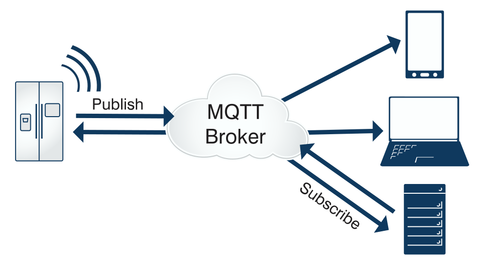

# 简述
MQTT(Mesaage Queuing Telemetry Transport, 消息队列遥测传输协议)，是ISO标准下的一种基于发布/订阅（publish/subscribe）模式的轻量级通讯协议，该协议构建于TCP/IP协议上，由IBM在1999年发布，MQTT最大有点在于可以以极少的代码和有限的带宽，为连接远程设备提供实时可靠的消息服务，作为一种低开销、低带宽占用的即时通讯协议，使其在物联网、小型设备、移动应用等方面有较广泛的应用。MQTT是一个基于客户端-服务端的消息发布/订阅传输协议。MQTT协议是轻量、简单、开放和易于实现的，这些特点使它适用范围非常广泛。在很多情况下，包括受限的环境中，比如：机器与机器通信和物联网。其在通过卫星链路传感器、偶尔拨号的医疗设备、智能家居中广泛适用。

MQTT协议定义了两种网络实体：消息代理（message broker）与客户端（client）。其中，消息代理用于接收来自客户端的消息并转发至目标客户端。MQTT客户端可以是任何运行有MQTT库并通过网络连接至消息代理的设备，例如微型控制器或大型服务器。信息的传输是通过主题（topic）管理的。发布者有需要分发的数据时，其向连接的消息代理发送携带有数据的控制消息。代理会向订阅此主题的客户端分发此数据。发布者不需要知道订阅者的数据和具体位置；同样，订阅者不需要配置发布者的相关信息。如果消息代理接受到某个主题上的消息，且这个主题没有任何订阅，那么代理就会丢弃之，除非发布者将其标记为保留消息（retained message）。当发布客户端首次与代理连接时，客户端可以设置一个默认消息。当代理发现发布者意外断开，其会向订阅者发送此预设的消息。客户端仅与代理有直接的数据传输，但整个系统中可能有多个代理，其于当前订阅者的主题交换数据。MQTT控制消息最小只有2字节的数据。最多可以承载256Mb的数据。有14种预定义的消息类型用于：连接客户端与代理、断开连接、发布数据、确认数据接收、监督客户端与代理的连接。MQTT基于TCP协议，用于数据传输。变体MQTT-SN用于在蓝牙上传输，基于 UDP。MQTT协议使用普通文本发送连接认证书，且并不包含任何安全或认证相关的措施。但可以使用传输层安全来加密并保护发送的数据，以防止拦截、修改或伪造。MQTT默认端口为1883。加密的端口为8883。
# 历史
IBM公司的安迪·斯坦福-克拉克及Arcom公司的阿兰·尼普于1999年撰写了该协议的第一个版本。该协议的可用性取决于该协议的使用环境。IBM公司在2013年就向结构化资讯标准促进组织提交了MQTT 3.1版规范，并附有相关章程，以确保只能对规范进行少量更改。MQTT-SN是针对非TCP/IP网络上的嵌入式设备主要协议的变种，与此类似的还有ZigBee协议。纵观行业的发展历程，MQTT中的MQ是来自于IBM的MQ系列消息队列产品线。然而通常队列本身不需要作为标准功能来支持。可选协议包含了高级消息队列协议，面向文本的消息传递协议，互联网工程任务组约束应用协议，可扩展消息与存在协议，数据分发服务，OPC UA以及web应用程序消息传递协议。
# 设计规范
由于物联网环境是非常特别的，所以MQTT遵循以下设计原则
- 精简，不添加可有可无的功能
- 发布订阅模式，方便消息在传感器之间传递
- 允许用户动态创建主题，零运营成本
- 把传输量降到最低以提高传输效率
- 把低带宽、高延迟、不稳定的网络等因素考虑在内
- 支持连续的会话控制
- 理解客户端计算能力可能很低
- 提供服务质量管理
- 假设数据不可知，不强求传输数据的类型与格式，保持灵活性
# 主要特性
MQTT协议工作在低带宽、不可靠的网络的远程传感器和控制设备通讯而设计的协议，具有几项特性:
- 使用发布订阅模式，提供一对多的消息发布，解除应用程序耦合，类似XMPP，但是MQTT的信息冗余小于XMPP，XMPP使用XML文本来传递数据。
- 对负载内容屏蔽的消息传输
- 使用TCP/IP提供网络连接，也可以基于UDP，叫做MQTT-SN;
- 有3种消息发布服务质量
  - 至多一次：消息发布完全依赖底层TCP/IP网络，会发生消息丢失或者重复。这一级别可用于如下情况，环境传感器数据，丢失一次读记录无所谓，因为不久后还会有第二次发送。
  - 至少一次，确保消息到达，但消息重复可能会发生
  - 只有一次，确保消息到达一次，在一些要求比较严格的计费系统中，可以使用此级别，这种最高质量的消息发布服务还可以用于即时通讯类的APP的推送，确保用户收到且只会收到一次。
- 小型传输，开销很小，固定长度的头部是2字节，协议交换最小化以降低网络流量
- 使用Last Will和Testament特性通知有关各方客户端异常终端机制
  - Last Will: 即遗言机制，用于通知同一主题下的其他设备发送遗言的设备已经断开连接
  - Testament: 遗嘱机制，功能类似Last Will

# MQTT协议原理
## MQTT协议实现方式
实现MQTT协议需要客户端和服务器端通讯完成。在通讯过程中，MQTT协议有3种身份: 发布者、代理、订阅者，发布者订阅者都是客户端，消息代理是服务器，MQTT传输的消息分为: 主题和负载2部分:
- Topic，可以理解为消息的类型，订阅者订阅后，就会收到该主题的消息内容
- payload，消息的内容，是指订阅者具体要使用的内容
## 网络传输与应用消息
MQTT会构建底层网路传输，建立客户端到服务器的连接，提供2者之间的一个有序的无损的基于字节流的双向传输。数据通过MQTT网络发送时，MQTT会把与之相关的服务质量QoS和主题名相关联
## MQTT客户端
一个使用MQTT协议的应用程序或者设备，它总是建立到服务器的网络连接。客户端可以:
- 发布其他客户端可能会订阅的信息；
- 订阅其它客户端发布的消息；
- 退订或删除应用程序的消息；
- 断开与服务器连接。
## MQTT服务器
一个使用MQTT协议的应用程序或者设备，它总是建立到服务器的网络连接。客户端可以：
- 发布其他客户端可能会订阅的信息；
- 订阅其它客户端发布的消息；
- 退订或删除应用程序的消息；
- 断开与服务器连接。
## MQTT协议种的订阅、主题、会话
1. 订阅，订阅包含主题筛选器(Topic Filter)和最大服务质量(QoS)，订阅会与一个会话(Session)关联。一个会话可以包含多个订阅。每一个会话种的每个订阅都有一个不同的主题筛选器
2. 会话，Session，每个客户端与服务器建立连接后就是一个会话，客户端和服务器之间有状态交互，会话存在于一个网络之间，也可能在客户端和服务器之间跨越多个连续的网络连接。
3. 主题名，连接到一个应用程序消息的标签，该标签于服务器的订阅相匹配，服务器会将消息发送给订阅所匹配标签的每个客户端
4. 主题筛选器，一个对主题名通配符筛选器，在订阅表达式中使用，表示订阅所匹配到的多个主题
5. 负载，消息订阅者所具体接收的内容
6. 保活，最大保活间隔，18小时12分钟15秒，客户在保活间隔乘以1.5倍的时间内可以不与broker通信。如果客户没有消息发给broker，则应该发布PINGREQ包；broker回复PINGRESP包。broker具有Client Take-Over功能，以便在客户重连broker，但broker认为与客户的TCP连接还存在时（称为Half-Open），能删除原有连接，接收重连请求
7. 持久会话，当会话与broker断连时，broker会保存会话已经订阅的QoS为1或2的主题的消息，以便重新连接后把这些消息发给会话；
8. 非持久的non-persistent或称clean session。适合于只发布消息，不订阅消息的会话。broker不存储这种会话的任何未分发的订阅主题的消息。创建与broker的connection时，参数clean session设置为真则创建非持久会话，否则创建持久会话。
## Topic
Topic是个utf-8编码的字符串，Topic是层次化表示的，层级由/分割开。Topic名字中相邻的2个/表示一个0长的topic层级
topic name和topic filter是：
- 大小写敏感的;
- 可以包含空格符（但不建议这么做）
- 前导或尾部的/将产生不同的Topic Name或Topic Filter。例如/finance不同于finance
- Topic Name或Topic Filter只包含/是有效的
- Topic Name或Topic Filter禁止包含null字符(U+0000)
- Topic Name或Topic Filter是utf-8编码的字符串，不能超过65,535个字节。
- Topic Name或Topic Filter的level数量没有限制。
订阅者的topic filter可包含通配符，使其同时能订阅多个topic：
- +：单级通配符，如：check/+/baseline。必须占据整个topic level。可以是第一层或者最后一层。sport/+不匹配sport但是匹配sport/。/finance匹配+/+和/+，但不匹配+。sport+是无效的。
- #：多级通配符，必须放在topic的最后。或者单独存在(即匹配所有topic)，或者其前一个字符必须是'/'。可匹配上一层topic level及其所有子孙topic
- $：以$开始的topic name用于broker内部的统计信息。用户的topic name不应该以$开始。broker不会把以$开始的topic name与#或+开始的topic filter相匹配。
topic name中不能包含上述通配符。
## QoS
服务质量指的是交通优先级和资源预留控制机制，而不是接收的服务质量。 服务质量是为不同应用程序，用户或数据流提供的不同优先级的能力，或者也可以说是为数据流保证一定的性能水平的能力。以下是每一个服务质量级别的具体描述：
- QoS 0：最多一次传送，即“fire and forget”（只负责传送，发送过后就不管数据的传送情况）。
- QoS 1：至少一次传送（握手2次）；PUBLISH packet与PUBACK packet（确认数据交付）。
- QoS 2：正好一次传送（握手4次）；PUBLISH 、PUBREC包用于确认收到。如果发送方没有收到PUBREC包，就用DUP标志重发消息；如果收到PUBREC包，就删除最初的PUBLISH包，存储并回复PUBREL包。接收方收到PUBREL包，就回复PUBCOMP包并删除所有相关状态（保证数据交付成功）。 
## 保留的消息（Retained Message）
broker会在该主题（topic）下保留最新一条带有Retained标志的消息。新订阅者或者重连的订阅者总是会收到broker保存的最新的Retained Message。这可用于发布者让订阅者总是能获取到最新的状态信息。如果发布一条zero-byte payload的Retained Message，则broker就会删除保存的Retained Message。
## Last Will and Testament (LWT)
当一个会话不文雅的出乎意料的断连时，LWT可以用于通知其他连接在这个boroker上的客户端。客户可以在一个topic下向broker发出CONNECT message时可以发出一条LWT消息，broker保存这条LWT消息，直到客户发出一条DISCONNECT消息文雅地断连为止。broker检测到下设情况之一，就会给所有订阅了LWT主题的客户发布LWT:
- 检测到网络失败或IO错误
- 由于协议错误，broker需要关闭网络连接
- 客户关闭了网络连接且没有发DISCONNECT消息
- 在Keep Alive周期后客户没有与broker通信
## MQTT协议中的方法
MQTT协议中定义了一些方法，来表示对确定资源所进行的操作。这个资源可以代表预先存在的数据或者动态生成数据，取决于服务器实现，主要的方法有:
- Connect。等待于服务器建立连接
- Disconnect。等待MQTT客户端完成所做的工作，并与服务器断开TCP/IP会话;
- Subscribe。等待完成订阅。
- UnSubscribe。等待服务器取消客户端的一个或多个topics订阅。
- Publish。MQTT客户端发送消息请求，发送完成后返回应用程序线程。
# MQTT协议数据包结构
MQTT协议中，一个MQTT数据包由: 固定头、可变头、消息体3部分构成。MQTT数据包结构如下:
- 固定头，存在于所有MQTT数据包中，表示数据包类型及数据包的分组类标识。
- 可变头（Variable header）。存在于部分MQTT数据包中，数据包类型决定了可变头是否存在及其具体内容。
- 消息体（Payload）。存在于部分MQTT数据包中，表示客户端收到的具体内容。
## 固定头
固定头存在于所有MQTT数据包中，其结构如下：
- Byte1中的0-3bit，标识位，第一位为DUP位，用于保证消息的可靠传输，后2位为QoS，00表示最多一次，01表示至少一次，10表示只有一次，最后一位表示保留标识，标识服务器是否要保留这次推送的信息。
- Byte1中的4-7bit，一个4位的无符号值，类型、取值及描述如下：这里没说
- Byte2，剩余长度，固定头的第二字节用来保存变长头部和消息体的总大小的，但不是直接保存的。这一字节是可以扩展，其保存机制，前7位用于保存长度，后一部用做标识。当最后一位为1时，表示长度不足，需要使用二个字节继续保存。
## 可变头
MQTT数据包中包含一个可变头，它驻位于固定的头和负载之间。可变头的内容因数据包类型而不同，较常的应用是作为包的标识：很多类型数据包中都包括一个2字节的数据包标识字段，这些类型的包有：PUBLISH (QoS > 0)、PUBACK、PUBREC、PUBREL、PUBCOMP、SUBSCRIBE、SUBACK、UNSUBSCRIBE、UNSUBACK。
## 消息体
Payload消息体位MQTT数据包的第三部分，包含CONNECT、SUBSCRIBE、SUBACK、UNSUBSCRIBE四种类型的消息：
- CONNECT，消息体内容主要是：客户端的ClientID、订阅的Topic、Message以及用户名和密码。
- SUBSCRIBE，消息体内容是一系列的要订阅的主题以及QoS。
- SUBACK，消息体内容是服务器对于SUBSCRIBE所申请的主题及QoS进行确认和回复。
- UNSUBSCRIBE，消息体内容是要订阅的主题。
