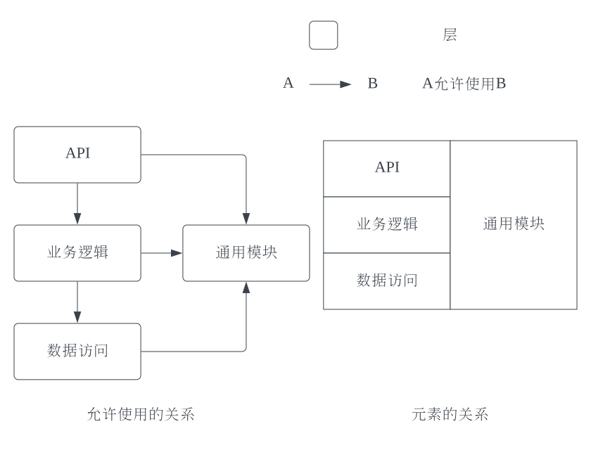
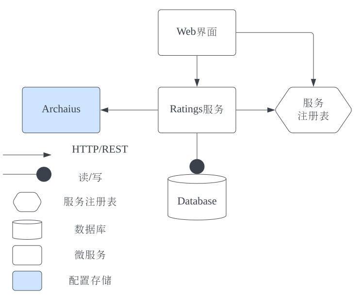
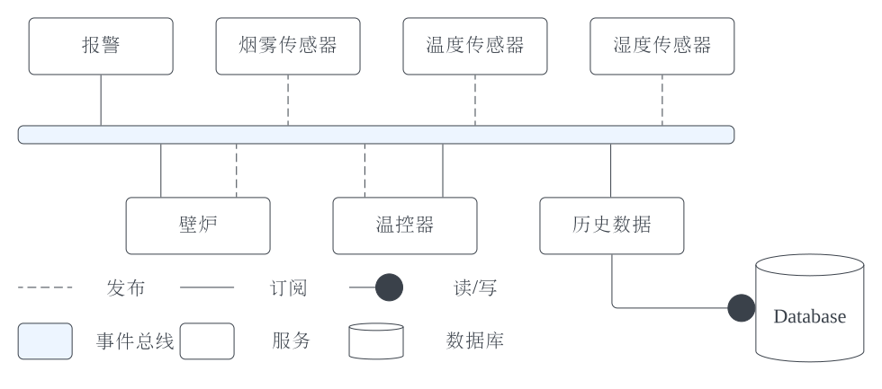
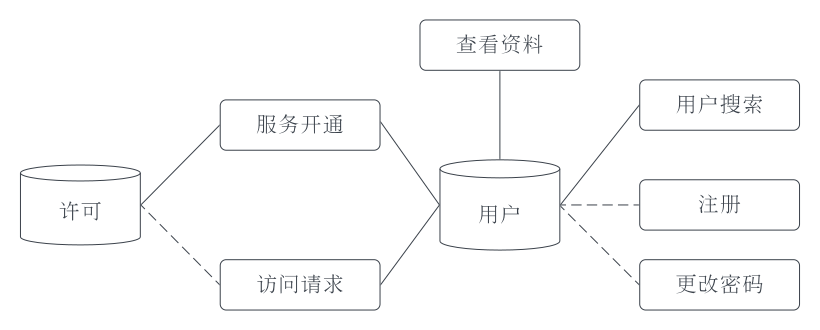
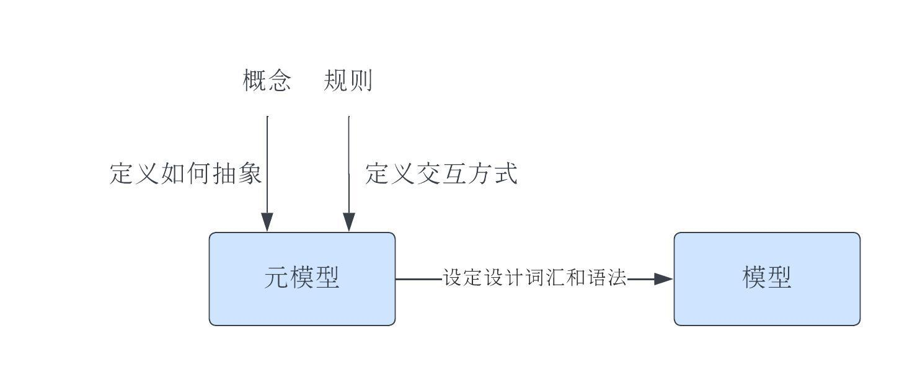
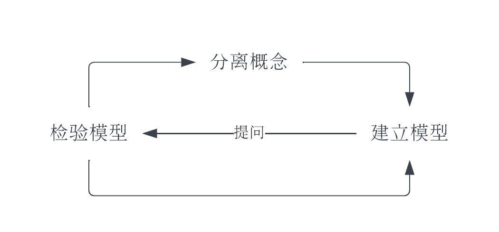
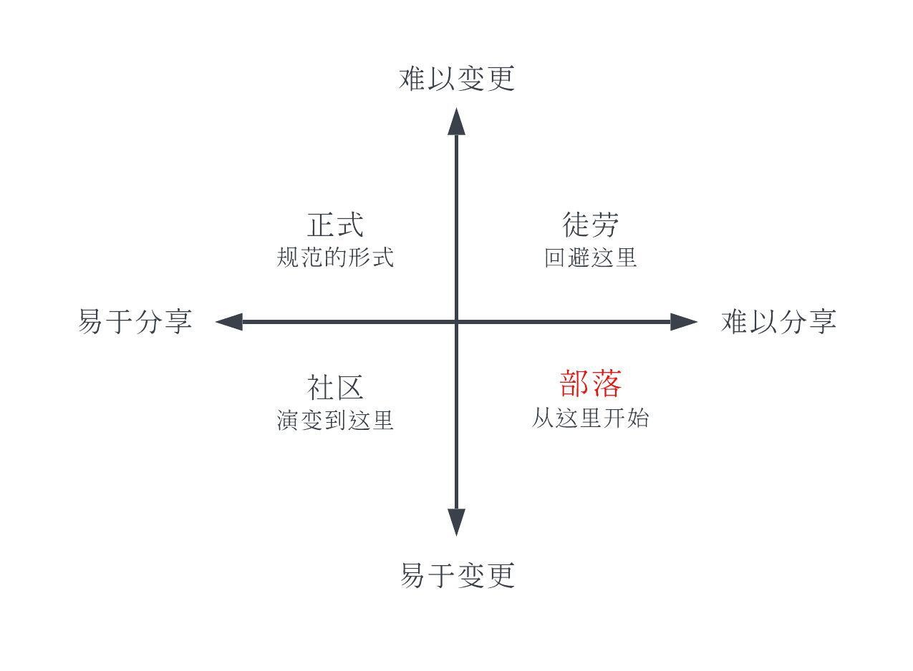
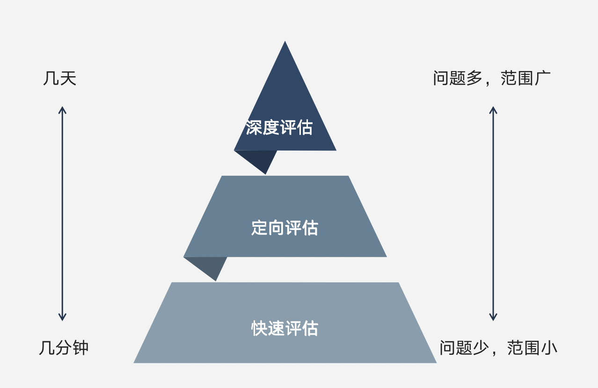

# 第1章 成为软件架构师
## 软件架构师要做什么?
- 从工程角度定义问题，与所有人合作，共同定义软件的需求与目标，要关注软件的质量属性，关注那些影响架构设计方向的约束与特性，定义问题的同时考虑架构;
- 分解系统，分配指责，只有把软件系统分解，才能制作出满足质量属性需求的策略；
- 关注大局，与外围环境和谐共生，纵观全局，不能着眼于细节
- 在质量属性之间做出取舍；
- 管理技术债务;
- 提升团队的机构技能;
## 什么是软件架构
软件架构是关于如何组织软件的一系列重大设计决策的集合，旨在实现期望的质量属性和其他软件特性。设计决策影响所有软件的相关方，也决定软件的属性，好的架构满足需要的软件质量属性，抑制或者消除不需要的质量属性.
软件结构定义了软件系统的组织与协调方式，将2个元素以某种关系链接在一起就成为了结构，元素是软件的基本组成部分，关系则描述了元素如何协作完成任务。元素与关系粉3中，可以用来构建架构:
- 模块(module);
- 组件连接器(component & connector);
- 分配(allocation);
下面的例子:

|种类|示例元素|示例关系|
|:---|:---|:---|
|模块|类、包、层、存储过程、模块、配置文件、数据库表|使用、允许使用、依赖|
|组件连接器|对象、连接、线程、进程、层、过滤器|调用、订阅、管道、发布、返回器|
|分配|服务器、传感器、台式机、负载均衡器、团队、用户、Docker容器|运行于、负责、开发、存储、支付|
- 模块结构存在与设计阶段;
- 组件连接器结构在软件运行时出现，运行时，组件可以创建与其他组件的连接、产生新进程以及实例化新对象;
- 分配展示了模块元素与组件连接器之间以及模块的元素与现实的物理元素之间的协同与响应关系。

模块指的是设计阶段的元素，组件则是软件运行时的概念，不同类型的结构适合用来思考不同的系统特性，模块结构考虑可测试性和可维护性，组件连接器结构考虑运行时问题（如可用性与性能），选择架构的结构实际上就是选择你想在软件系统中提升的质量属性，思考架构设计可以确保你设计的软件呢系统能够支持你关心的质量属性，是质量属性让软件独一无二。
## 成为团队的架构师
对每一个项目回顾:
- 利益相关方是谁？主要业务目标是什么?
- 项目的整体解决方案是什么样的?
- 涉及哪些技术?
- 最大的风险是什么？你是如何克服的？
- 如果有机会重新做一遍项目，你会如何改进?
# 开发出色的软件
- 架构将大问题分解为容易处理的小问题，现代软件系统庞大且复杂，架构精确的解释了如何将系统划分为轻巧、独立的小模块还能确保整个系统协同工作，让系统的价值高于各个部分的价值之和;
- 软件架构告诉大家如何协同工作;
- 软件架构为讨论复杂设计提供了基本词汇;
- 软件架构关注的不仅仅是功能;
- 软件架构让你避免犯重大错误;
- 架构让软件更灵活
# 第2章 设计思维基础
架构设计总是一边摸索要解决的问题，一边探求解决方案。以人为本的设计思维，将注意力放在受设计决策影响的人身上。
## 设计思维的4条原则
设计思维是从他人的角度思考问题及其解决方案的一种方式。有4种设计原则(HERT):
- 以人为本(design for human)，设计本身是围绕人开展的工作，要理解利益攸关方的要求，架构师离不开团队，必须于团队一起设计架构；
- 推迟决策(preserve ambiguity)，设计决策必须准确、清晰，模糊的需求设计会毁掉项目，软件架构的目标是安排系统结构，提升期望的质量属性，极简主义架构只关心高优先级的质量属性，除此之外的设计决策都可以悬置，等时机成熟后再决定，要求尽可能推迟那种一旦决定就难以更改的设计决策，特别是细枝末节的设计决策都可以留到后面。
- 善于借鉴(design is redesign)，研究以往的设计，探索其中的规律，可能同样的问题已经有了解决方案，你可以在其基础上开始自己的设计，设计软件架构之前，应该多花点时间研究已有的设计，而不是凭空创造一个新的出来，忽视前人的经验是最低效的架构设计方法之一;
- 化虚为实(make the architecture tangible)，架构中的结构以代码的形式存在，代码不够直观，不适合用来讨论质量属性、组件、设计原理、决策结果之类的问题。呈现架构的方式很多可以画出来，可以制作原型或者简单的模型，人们只有通过感性的认识才会理解和消化架构。
## 运用思维模式
设计软件系统需要我们从不同的角度考虑架构，设计思维模式可以帮助我们在合适的时机关注合适的细节。四种思维模式
- 理解问题: 弄清楚问题，从所有涉及的人员那里获取信息，从各方的需求与自身的工作中达到平衡;
- 探索想法: 尝试各种结构的组合，找到最能满足要求的组合，最终找到解决问题的工程方法，需要研究大量的模式、技术或者开发方法;
- 展示想法: 制作模型，线框图编写文档、展示数据等;
- 评估适用性: 针对不同的场景审视某一架构，检查决策风险等展开评估.
## 思考、动手、检查

- 迭代学习，每一次迭代都是一个完整的循环，设计没有终点，永远可以持续改进;
- 组合运用思维模式
# 第3章 指定设计策略
- 软件系统充满了不确定性，但是也必须制定计划;
- 架构设计不是一蹴而就，而是持续不断的学习以及实验。
## 找到够用的设计
不是寻找最佳设计而是找到够用的设计，寻找够用设计的方法:
- 将解决方案看成实验;
- 降低设计风险;
- 努力简化问题;
- 快速迭代学习；
- 同时考虑问题与解决方案
## 决定前期做多少架构设计
开发，架构设计，返工是项目工期的3个主要部分，架构设计时间不能太长也不能太短，根据软件复杂度不同，有一个最佳的平衡点，架构设计与返工时间反相关，根据研究:
- 软件系统越大，前期做架构设计的收益就越大，一般37%时间做架构师合理的;
- 软件系统越小，前期做架构设计的收益就越小，一般不超过5%;
- 架构设计做的不够，后期要返工，
软件系统可以按照规模或者复杂度评估工作量，但是一般复杂度更准一些，还要考虑需求波动。
## 用风险做向导
风险可以提醒什么东西可能会造成障碍，按优先级直觉列出可能的问题，选择合适的思维模式降低风险。
风险用条件(当前状况)与后果(可能的问题)描述。降低风险的方式:
- 降低概率;
- 减少影响;
- 减小风险发生的时间窗口;
- 移除条件;
- 接受现状，什么也不做.
软件架构设计师一种降低风险的活动，风险帮助我们决定设计内容，思维模式帮助制定降低风险的策略，风向与思维模式:

|风险|思维模式|
|:---|:---|
|要解决的问题还不确定，对于利益相关方和其他系统参与者，还需要更深入的理解|理解|
|解决方案还不确定，需要充分了解可选的方案|探索|
|利益相关方不完全了解准备实施的方案|展示|
|在设计决策上举棋不定|评估|

架构师需要将技术风险降低到架构不在是系统中的最大风险源，也就是到达恰如其分的状态，此时可以从主动设计转为被动设计:
- 主动设计是主动设法降低架构风险;
- 被动设计是指监控系统运行表现，并采取纠正措施。
架构还可能重新成为风险源，要切换回主动设计模式。
## 制定设计计划
设计计划指出团队在架构设计上分配时间的总体策略，包含的内容:
- 结束设计的条件（前期设计如何开展）
- 必要的设计成果（文档/图等存储）
- 时间节点关键设计工作的时间节点，至少给出对架构设计有重大影响的事件的时间节点(需求审查、设计审查、设计评估)，还有与利益相关方会面的时间节点，在开发工作即将开始或者确定初期工作包含的范围要召集相关会议;
- 重大风险，风险驱动的设计方法;
- 概念架构设计，可以先从可行的解决方案中选择一个，解决方案可以帮助定义问题，只要能表达初步的设计想法就行。
# 第4章 换位思考
搞清楚到底要解决什么的问题。
## 找合适的人交谈
利益攸关方有很多，同样角色的攸关方的人，可能想法也不同，需要攸关方团队确定唯一的想法。
## 创建利益相关方关系图
呈现了与软件系统有关系或者受其影响的人，将关系与互动进行可视化的呈现，展示利益攸关方的动机，并可以确定需要沟通的关键人物
>客户体验架构，通用电气软件架构师，以客户为中心的设计流程，先搞清楚谁是客户，他们想做什么，将系统按照客户的任务进行划分。
第一步: 观察客户在正常情况下如何完成任务，向对方提问确定对客户至关重要的事项包括功能需求与质量属性需求；第二步: 围绕客户的需求设计系统并记录在原型里，原型应尽可能具有交互性，而不仅仅是流程图; 第三步: 尽早语客户一起评审原型，确保对方真正了解新系统的变化以及这些变化对他们的影响; 第四步: 根据客户评审会上的反馈修改调整架构设计。
## 了解业务目标
所有软件系统的开发都是为了满足业务目标，业务目标是利益攸关方希望通过软件系统实现的东西，谈论系统的质量属性、权衡取舍、技术债务都要以业务目标为基础。业务目标是架构的主要驱动因素，描述业务目标就是阐明利益相关方想从软件系统获得什么。
- 记录业务目标，业务目标是可衡量的，有成功的标准。业务目标的描述要包含3个部分
  - 主体，特定的人员或者角色;
  - 结果，可衡量的结果表达利益相关方的需求，会带来哪些变化;
  - 背景，背景信息有助于进一步理解利益相关方的需求;
- 帮助利益相关方描述业务目标，架构师可以用一些模板帮助利益相关方表达需求。
  
# 第5章 挖掘关键架构需求
关键架构需求(architecturally significant requirement, ASR)是显著影响架构中的结构选择的需求，架构师有责任确定对架构有重大影响的需求，ASR分为4类:
- 约束，给定或者选定的不可更改的设计决策;
- 质量属性，外部可见特性，表征系统在特定环境下的运行情况;
- 影响较大的功能需求，架构设计需要特别注意的特性和功能;
- 其他影响因素，时间、知识、经验、技术、办公室政治、你的技术特长等.
## 用约束限制设计选择
约束是外界限定的或者自己选择的不可更改的设计决策，约束可以简化问题，也会增加设计难度，设计决策可能变得越来越像约束，要区分。
## 定义质量属性
质量属性描述了软件系统的外部可见特性和我们对系统运行的期望，也定义了系统执行某些操作时的表现，也称为质量需求下面是常见的质量属性:
|设计属性|运行属性|感知属性|
|:---|:---|:---|
|可修改性|可用性|可管理性|
|可维护性|可靠性|可支持性|
|可复用性|性能|简单性|
|可测试性|可伸缩性|指导性|
|可构建性或者开发时间|安全性||

设计决策就是提升某些质量属性同时牺牲另一些质量属性。关键架构需求主要就是为了确定系统的质量属性，质量属性用于在整个设计过程中指导挑选技术、结构、模式评估设计决策的合理性。功能需求描述系统行为，非功能性需求描述功能需求之外的其他系统需求，有质量需求与约束。设计软件架构必须区分功能、质量属性、约束，因为它们对设计的要求是不同的。质量属性就是非功能性需求。
1. 用场景描述质量属性
   质量属性场景描述了系统如何在特定环境下运行，每个场景都包含刺激和响应。质量属性场景与功能需求的不同在于: 质量属性场景对响应做了明确的限定，并给出了度量方式。除了能正确响应，如何响应也很重要，质量属性场景的6个元素（图在书上）。
   - 刺激，需要系统以某种方式最初响应的事件；
   - 来源，刺激的来源，人或者系统;
   - 软件部件，系统的某个部分
   - 响应，外部可见的活动，刺激引发响应
   - 响应度量，定义响应成功的标准与条件
   - 环境背景，系统的操作环境
  合格的质量属性场景应该表达需求的意图，确保所有人都能理解。
2. 寻找具体可衡量的响应度量
   良好定义的响应度量是可测试的，
3. 确定质量属性场景

## 对功能需求分类
功能需求定义了软件系统的行为，在某些情况下会影响系统架构设计。影响架构的功能需求的确定方法:
1. 先画出概念架构草图，展示当前对架构的构想
2. 对功能需求大致分类，每类需求反应一个相同类型的架构问题
3. 对照概念架构草图，思考每个分类如何实现，如果对于已知的粗粒度需求，实现功能的方式并不明显，那么它就可能对架构有重大影响

功能需求分类的策略如下:
- 寻找可以使用相同架构元素实现的功能需求，例如，需要持续运行的功能归为一类，需要用户交互的功能可以归在另一类;
- 寻找看起来有难度的功能需求，他们对架构可能有重大影响
- 寻找重要的，高优先级的需求

架构设计应该反应所有影响较大的功能需求。
## 找出其他影响架构的因素
影响架构的其他因素包括: 当前的技术趋势、团队组织、影响较大的功能需求、质量属性、约束、业务目标、团队的能力，技术，知识、架构师的能力，技术，知识等。
团队的组织结构与合作形式会影响架构设计，康威定律描述了团队组织结构与架构之间的关系:
> 任何设计系统的组织产生的设计必然是该组织沟通结构的写照
## 挖掘关键架构需求
关键架构需求往往是隐藏的，需要挖掘。产品代办列表是挖掘关键架构需求的宝藏，功能需求都隐含或者暗示了某些质量属性。与利益相关方沟通，挖掘关键需求的方法:
- GQM会议将业务目标与质量属性度量数据化;
- 利益相关方访谈，搞清楚质量属性场景和约束;
- 假设清单，将隐藏需求明晰化公开化;
## 创建ASR工作薄
发现关键架构需求后，记录在工作簿中。为所有相关人员提供系统背景信息。ASR工作簿大纲:
- 目的与范围
- 阅读对象
- 业务背景
  - 利益相关方
  - 业务目标
- 关键架构需求
  - 技术约束
  - 业务约束
  - 质量属性需求
    - 重点场景
  - 有影响力的功能需求
    - 重点用户或用户角色
    - 用例或用户故事
- 附录A: 术语表
- 附录B: 质量属性分类

了解利益相关方及其目标是通过软件实现价值的第一步。需要做到积极倾听，试着理解。可以使用ASR工作簿向团队及其他人员介绍架构概念。
## 小结
不同的架构可以实现相同的功能，功能本身不能帮助我们决定如何设计架构，还需要知道关键架构需求，尤其是质量属性，这决定了对架构方案的取舍。解决方案源自我们对问题的理解，不需要等到完全清楚问题之后再考虑解决方案，探索解决方案会加深你对问题的理解，不断发现新的情况是正常的。
# 第6章 主动选择架构（choose an architecture）
架构设计就是在不确定的情况下做决策。就是取舍妥协，放弃一些东西避免更坏的情况发生，接受不好的条件以便在其他方面做的更出色，只要做出合适的取舍，就可以实现关键架构需求完成业务目标。
## 发散探索，聚合决策
做决策意味着需要多个备选方案，要获得备选方案，需要进行设计探索。设计探索是反复的发散与聚合的过程。确定问题后，需要发散思维，探索解决问题的各种方案。找到备选方案后，又需要聚合思维取得共识，排除不适合的方案。架构师重点关注质量属性、架构结构以及会对2者产生影响的设计决策。所有的架构都是设计，并非所有的设计都是架构。软件架构是关于如何组织软件的一系列重大设计决策的集合。旨在实现期望的质量属性和其他软件特性。架构师必须探索重大重大设计决策，主动选择软件的组织方式以实现既定的质量属性。下面是架构设计通常要探索的几个方面:
- 探索元素及其作用，确定架构的结构组成。探索方案就是探索功能各异的元素的组合形式;
- 探索关系及其接口，确定元素的交互方式。关系描述了架构中2个元素如何协同工作以完成任务。组件接口就是一种关系。通信机制和通信规则定义了接口。
- 探索问题领域，理解架构所处的环境。每类问题都有自己的术语和概念，描述了它存在的环境。领域中的概念，无论是对象还是事件，都必须在架构的相应之处加以说明。对问题领域理解的越透彻，对架构元素的划分及功能分配就越理想。
- 探索技术和框架，提升质量属性。探索各种中间件/库的优缺点更好的发挥作用。
- 探索构建和部署方法，确保架构可以交付。
- 探索以往的设计，获得启发指导决策。所有设计都是在已有设计基础上的重新设计和调整创新。大多数架构探索始于温故。审视已知的软件设计知识。设计知识可以总结成经验法则和模式。

2种部署方法，红黑部署/滚动升级。出现不一致，强制兼容、开关、容错处理等方式避免不一致。
## 接受约束
约束是无法更改的既定设计决策。约束：
- 技术约束
- 业务约束，可能不是很明显
- 早起的设计决策，重构可以变更。
## 提升质量属性
架构师通过选择结构来提升系统的质量属性。选择结构就是探索各种架构模式。借助质量属性探索架构模式。一个例子是构建数据驱动的web应用3种架构模式:

3种模式分别提升/抑制了不同的质量属性。
- 3层模式，每一层完成不同的任务，易于测试、部署、描述。可伸缩性与可用性差。
- 所有元素都讲消息发布到事件总线上。组件可以订阅感兴趣的消息。事件可能不按顺序传送，也不确保传送成功，具有较高的可更改性与灵活性。适合构建松耦合系统，但是消息的顺序也会造成加大的影响。
- 面向服务架构模式，服务都在中央注册表注册，以便调用者可以找到它们，组件查找并直接调用这些服务，服务响应并回复信息。可更改、灵活、可测试的特点，易于扩展，易于提升可用性。但是复杂。
  
选择架构模式关键要看质量属性，针对既定质量属性，分出各种模式的优劣。决策矩阵(decision matrix)是一个表格。用于总结/分析多个架构设计方案的利弊，它适合用来选择与架构有关的各种设计选项，包括架构模式、功能分配、技术方案等。

决策矩阵的第一列列出备选特性，矩阵每一行代表一个特性，每一列是你对相应设计选项的分析判断。
## 为架构元素分配功能
项目中的每个元素都有功能，选择架构时会为每个元素分配特定的功能。以便实现所有既定的功能需求。确保每个功能都有且仅有一个元素负责。至少负责一个功能。
## 设计，应变而生
通过选择决策时间点以及将设计决策移出架构，可以做到应变设计。避免走入死胡同或者走上歧路的办法是推迟决策。可以为研究，探索争取更多的时间。最后责任时刻-在避免失去重要备选方案的前提下，做出决策的最晚时间。做出设计决策的最佳时机:
- 不做决策是否阻碍了项目进展;
- 决策是否解决不能再耽搁的问题;
- 决策是否会创造更多的选项或机会;
- 推迟决策是否明显会带来更多风险;
- 我是否理解并接受设计决策带来的一切后果;
- 我有明确的理由说明为什么现在必须做这个决定吗?
- 如果决策失误，是否有时间弥补，我能承受这样的错误吗?
可以把容易变化的东西移出架构，在可能的情况下，应该把容易变化的设计决策留给后续设计人员来做。SOLID原则用于架构设计。
- single responsibility 单一功能;
- open/closed 开闭原则
- liskov substitution 里氏代换
- interface segregation 接口隔离
- dependency inversion 依赖反转
将设计决策移出架构的方法:
- 可插拔/可替换的架构;
- 外部配置;
- 自描述数据;
- 动态发现
它们都是在设计时/运行时更改系统的行为。
## 小结
接受约束、探索能实现既定质量属性的模式、找出影响较大的功能需求并选择合适的架构、在正确的时间做出决策、尽可能提高架构的可修改性。
# 架构模式
提炼解决常见问题的的方案，总结可复用的模式。所有软件系统都有自己的核心模式，设计决策都以此核心模式为基础，根据特定的需要做修改。使用模式相当于汲取前人的智慧。
## 什么是架构模式
架构社区构建可扩展、可维护、可靠、高可用、可测试的软件系统。大部分的软件设计问题都有已知的解决方案。所说的模式(标准的结构或者样式)就是指这些已知的解决方案。
维基百科的解释: 是存在于人们感知到的世界、人造设计或抽象思想中的规律。模式的元素以可预测的方式重复。架构模式是针对特定问题的可复用的解决方案。通过特定的结构组合提升某方面的质量属性。使用模式可以方便沟通，同时也有助于理解现有的框架/平台的架构设计思想。设计模式，用于提升面向对象程序的可复用性，可维护性。架构模式关注各种质量属性下的解决方案。比较宽泛。
## 分层模式
分层是最常用的架构模式。分层模式实现了层间低耦合与层内高内聚。提升了可维护性。如果想更改模块内的代码而不影响其他模块，就应该使用分层模式。

| **类别** | **模块**                                                             |
|--------|--------------------------------------------------------------------|
| 元素     | 层: 一组功能内聚的模块                                                       |
| 关系     | 允许使用，哪些层可以使用其他层的模块                                                 |
| 使用规则   | 所有模块必须划分到某一层里，上层可以使用下层，这种关系是单向的，允许使用关系可以进行限制让当前层只能使用处于其下方的层，禁止循环依赖 |
| 优势     | 提升可维护性、可移植性、可复用性、可测试性、设计阶段的可修改性。概念上比较容易实施，分层可以直观的反映在代码上            |
| 劣势     | 每一层都引入了额外的抽象，增加了复杂度，可能会影响性能，层数繁多与抽象泄漏可能会导致开发过程比较痛苦                 |

## 端口适配器模式
端口适配器模式隔离了核心业务逻辑，确保它可以在多种环境下使用。以及在隔离其他组件的情况下测试。在运行时，可以讲输入源的可插拔适配器注入核心业务逻辑中，以提供对事件或数据的访问。构建或运行时可以通过切换适配器生成各种系统配置。

| 类别   | 模块或者组件连接器                                                                                 |
|------|-------------------------------------------------------------------------------------------|
| 元素   | 层: 包含业务逻辑，不清楚使用的数据和事件来源，端口: 层与适配器之间的接口。借助端口层可以与具体的适配器分离，适配器: 与外部数据源、设备进行交互的代码使得层能够访问数据和事件 |
| 关系   | 暴露：指明层可用的端口，实现: 指明约束适配器的端口，注入: 指明层可用的适配器                                                  |
| 使用规则 | 层通常会暴露端口，没有端口的层也叫做内层，                                                                     |
| 优势   |                                                                                           |
| 劣势   |                                                                                           |

## 管道过滤器模式
管道过滤器模式里面的组件称为过滤器，负责单一的数据转换与数据操作。数据快速从一个过滤器流转到下一个过滤器，数据操作是并发进行的，松耦合的过滤器可以复用与组合创建新管道。多用在数据分析/数据转换领域。Unix终端命令连接在一起，就是管道过滤器模式。

| **类别** | **组件连接器**                                                                                                                                     |
|--------|-----------------------------------------------------------------------------------------------------------------------------------------------|
| 元素     | 过滤器: 读取、转换、记录数据的组件，过滤器可以在读取数据的第一时间开始处理，必须定义预期输入与预期结果。管道:  连接器，用于将数据从一个过滤器传输到下一个过滤器，管道具有单一输入与输出，不会改变传输的数据。该模式的一些变种还包括source/sink，专门产生/接收数据的过滤器 |
| 关系     | 接驳：通过管道连接一个过滤器的输出与另一个过滤器的输入                                                                                                                   |
| 使用规则   | 管道只能连接与其输入输出兼容的过滤器，过滤器完全相互独立                                                                                                                  |
| 优势     | 提升性能，可复用性，可修改性                                                                                                                                |
| 劣势     | 管道过滤器系统不是交互性的，不包含用户界面， 不会明显提升可靠性，简单实现可能会影响性能                                                                                                  |

批处理模式和管道过滤器模式很像，批处理模式是各个阶段逐个逐次操作，管道过滤器是流水线并发操作。
## 面向服务架构模式
SOA模式，用独立的组件提供特定功能的服务，各种服务在运行时整合在一起，决定系统的行为，要求服务的使用者必须在不清楚服务实现细节的情况下寻找和调用服务。有很多种实现方式，传统的SOA非常倚重消息总线和SOAP通信，现代SOA则使用细粒度的微服务。用轻量级的HTTP协议进行连接。复杂的组织通常使用SOA来设计大型系统，不同的部门管理不同的系统部分。SOA允许各个部门在其专业领域内独立工作(隐藏重要业务信息)，这些子系统又能供外部访问。

| **类别** | **组件连接器**                                                                                          |
|--------|----------------------------------------------------------------------------------------------------|
| 元素     | 服务: 可独立部署的单元，通过定义好的接口提供服务功能;服务注册表: 列出所有可用的服务，以便服务可以查找其他可用服务消息系统: 取决于具体的系统设计，如SOAP、REST、gRPC、异步消息 |
| 关系     | 根据SOA系统的约束而变化，如果使用netflix的智能端点与哑管道方法，则关系调用，如果使用异步消息，则关系是发布/调用|
| 使用规则   | 服务不必知道所有的其他服务的实现细节，服务必须通过外部组件发现其他服务，要么是服务注册表，要么是异步消息传递的消息总线                                        |
| 优势     | 提升互用性、可复用性、可伸缩性。模式成熟，有很多子模式                                                                        |
| 劣势     | SOA系统是分布式系统，带有分布式计算的所有复杂性，组成部分多，集成复杂                                                               |

架构失配: 对组件的预期用法与实际使用情况有冲突。如果选择的架构模式与高优先级的质量属性有冲突，则是架构失配。如果选择的实现技术与架构设计不一致，也属于架构失配。
## 发布订阅模式
发布订阅模式中，生产者与消费者在彼此不知情的情况下独立存在。大量的消费者订阅各种生产者发布的事件，生产者与消费者通过事件总线间接通信，事件总线负责将发布的事件与感兴趣的订阅者连接起来，事件总线技术的选择极大地影响系统属性。如果有多个独立组件要访问相同的信息，可以使用发布订阅模式。

| **类别** | **组件连接器**                                                                            |
|--------|--------------------------------------------------------------------------------------|
| 元素     | 发布者: 发布事件的组件，发布的事件应在设计文档中描述，订阅者: 订阅事件的组件，事件总线: 负责登记组件订阅和传递发布的事件，事件总线提升的属性由具体技术及其配置决定 |
| 关系     | 发布: 组件将事件发布到事件总线，订阅: 组件登记订阅事件                                                        |
| 使用规则   | 所有通信都通过事件总线进行。因此，所有组件必须连接到总线。某个组件可能既是发布者又是订阅者                                        |
| 优势     | 提升可扩展性、可复用性、可测试性。根据事件总线的选择及其配置方式，还可以提升可用性、可靠性、可伸缩性                                   |
| 劣势     | 性能很难判断                                                                               |

大部分发布订阅系统都有一个事件规范文档，定义了组件可以订阅事件，描述事件格式与发布事件的组件。
## 共享数据模式
通过共用的数据库访问数据，没有组件单独对数据或者数据存储负责。特别适合有大量数据，多组件的系统。

| **类别** | **模块或者组件连接器**                                                                                                   |
|--------|-----------------------------------------------------------------------------------------------------------------|
| 元素     | 数据库: 保存访问器共享的数据，数据存储的选择及其约束决定了能实现的质量属性;数据访问器组件: 以某种方式使用数据的组件                                                   |
| 关系     | 读取: 数据访问器组件可以从共享数据库中读取数据，某些读取关系可能需要特定协议或对可读取的数据量、类型进行限制;写入: 数据访问器组件将数据写入共享数据库，写入关系可以采用事务形式，进行限流和保护，或者用其他方式进行约束 |
| 使用规则   | 只有数据访问器可以与共享的数据库进行交互                                                                                            |
| 优势     | 通过数据一致性、安全和隐私提升可靠性，如果数据库充分优化，数据访问器划分良好，可以提升可伸缩性和可用性                                                             |
| 劣势     | 可能导致单点故障，从而影响可用性和性能，如果数据库发生变更，可维护性也会受影响，因为所有数据访问器都需要变更                                                          |

## 多层模式
系统运行时的结构被组织称逻辑组，逻辑组可以被分配到特定的物理组件。如果系统的组件将在不同的平台或者硬件上运行，可以考虑使用多层模式

| **类别** | **组件连接器或分配**                                                                            |
|--------|-----------------------------------------------------------------------------------------|
| 元素     | 层(tier): 运行时组件的逻辑组，有许多方式进行分层，如功能职责，计算平台，团队职责，沟通机制，安全需求，数据访问                             |
| 关系     | 属于: 将组件归到某一层，通信: 层或其内部组件与其他层的交互，该关系可以设计定义协议和通信约束，允许通信: 那些层可以与其他层中的组件通信，分配到: 将层映射到物理计算平台 |
| 使用规则   | 一个组件可能只属于某一层，层内的组件仅允许与同层的其他组件通信。增加层通信的约束条件，可以提升可维护性。常见的方法是仅允许相邻层之间的通信                   |
| 优势     | 提升安全性、性能、可用性、可维护性、可修改性。有利于分析成本与部署                                                       |
| 劣势     | 作为运行时构造，在大型系统中实施可能会有难度，太多的层会抑制系统性能和可维护性                                                 |

## 能力中心模式
能力中心模式中，一个专家团队负责定义模式、建立最佳范例、开发支持工具、为架构提供培训。能力中心本身不会构建和交付系统模块，而是帮助其他团队在日常开发工作中取得进步。CoC可以围绕技术、用例、模式、高风险领域进行组织。

| **类别** | **分配**                                                     |
|--------|------------------------------------------------------------|
| 元素     | CoC团队: 开发人员于架构师小组责任区域: 架构的子集，可以是模式、技术、用例 |
| 关系     | 负责: 联系CoC团队及其责任区域                                          |
| 使用规则   | 通常一位CoC成员负责一种技术或者用例                                        |
| 优势     | 提升专家的可复用性与可伸缩性，从而提升多方面的质量属性                                |
| 劣势     | CoC让一些专家形成了知识上的孤岛，且容易一位内人员流动而出现知识流失，能力不足的CoC成员会引发问题，影响开发速度 |

## 开源贡献模式
允许其他人未开发做贡献。团队负责从质量与概念完整性的角度来审核其他人提交的组件与更新。该模式仅允许在架构上有少量的集中控制。当有来自多个开发团队的专家参与项目并且对某些组件有共同的依赖，可以使用这个模式。
## 大泥球模式
大泥球模式就是杂乱无章模式。毫无章法的开发与缺乏架构知识是导致大泥球出现的原因。
## 发现新架构模式
模式源于经验。发现模式有2种方法:
- 以问题为中心，从一个常见的问题入手，如果你反复看到同样的问题出现，可以开发一个通用的解决方案。研究现有的解决方案，找出其中的相同之处与不同之处。根据分析描述新解决方案的模式；
- 以解决方案为中心，从反复使用的解决方案入手，描述你观察到的解决方案模式，分析它能解决哪些常见的问题，试着定义清楚。

## 小结
- 掌握的架构模式越多，越容易完成架构设计工作;
# 建立模型，化繁为简
在成功的软件系统也难免走向复杂。
- 用户数量的增加影响软件的可用性与性能;
- 不断的迭代让软件越来越笨重
- 扩展系统越来越多

架构是由结构组成的，结构是由元素和关系组成的。
## 推演架构
人的大脑只能保留有限的信息。突破自身局限的方法:
- 与他人协作共同完成大型复杂系统;
- 建立抽象概念来压缩表示大量信息
协作与抽象是思考、分析、理解架构的基本方法。抽象让我们关注特定的细节，通过建立抽象的架构模型来协作，架构模型是对架构的精确描述，它需要认真思考。它的优势:
- 构建设计词汇，要具有恰当的名称
- 引导关注重要的细节，
- 帮助推演质量属性和其他系统特性，
- 展示架构师的构思，
## 设计元模型(design the meta-model)
架构的元模型定义了模型中使用的概念和使用规则。是设计的语法规范思考方式，设定了讨论架构的词汇。

定义元模型可以更容易的描述架构设定期望推演创建的模型。首先要定义概念就是架构中的元素与关系。在建立概念的使用规则。
1. 分离新概念(individuate new concepts)
   概念分离是学习新概念的认知过程。从架构中分离出新的概念就加深了对模型及其反应的世界的理解。概念分离就是区分事物或者区分事物状态的过程，将猪与狗分辨出来就是概念分离。分离的过程叫做好奇心循环，是建立任何模型的过程
   
   从提问开始，提问是检验模型的手段，要么是在模型中找到答案强化了模型，要么是发现认知存在偏差，要修正模型(分离概念)。如果知识与经验不足以分离新概念，可以使用现成的元模型
2. 选择架构模式作为基础(pick a pattern to seed the architecture)
   所有设计都是在已有设计基础上的重新设计和调整创新，架构模式包含了针对特定问题的元模型。使用一个合适的架构模式，就有了元模型就有了相关的概念了。可以使用一个架构模式作为架构。
3. 保持一致性(reconcile inconsistencies)
   同时使用多个元模型可能会出现冲突，应该对相似的概念合并，对同名不同义的概念更名。添加新概念要附上使用规则(描述了元素和关系在系统中的交互方式)，规则也是概念约束，概念约束可以提高某种质量属性。
4. 取好名称(use good names)
   命名反映了对设计的理解程度，命名有7个阶段:
   - 空白，对系统或者背景不了解，无法为元素提供名称
   - 凑合，有了大致想法的名称
   - 沾边，名称至少反映了元素某一方面的功能
   - 反映功能，名称直接描述了元素的所有功能
   - 反映角色，名称反映了元素在架构中的角色
   - 反映意图，不仅反映元素的功能还有其目的，既了解元素要做什么也理解元素为什么存在
   - 领域抽象，超越了单个元素本身，成为一个新的抽象概念
## 让模型融入代码
模型可以用来推演架构，但是模型与代码是分离的。架构模型融入代码,容易维护设计的完整性，降低架构漂移的可能性，减少对文档的依赖。因为设计已经融入系统中，架构显见的编码风格可以帮助减少模型与代码之间的偏差。
1. 统一使用架构词汇，apply the vocabulary of the architecture，统一架构与代码中的词汇概念，使用领域模型的方式编写代码
2. 组织代码，凸显架构，organize code to make pattern obvious，组织代码使代码与模块结构相匹配，也就是与架构元素相对应，可以按照层或者功能模块组织
3. 贯彻落实元素关系（强化关系），enforce ralations among elements
4. 添加代码注释，add hints as comments，可以描述逻辑或者理由或者给出设计的链接
5. 用代码生成模型，比如面向对象语言生成UML，或者Go中的包依赖分析等

# 召开架构设计研讨会
## 筹划架构设计研讨会
架构设计研讨会充分运用集体的智慧与经验，需要有时间限制，需要先发散探索然后聚合想法，设计探索的3个F: fast、fun、effective，常见的想法分为3种:
- 可实现的想法，靠谱的想法，应该为他设计原型或者模型，充实和丰富设计;
- 有待评估的想法，有些优秀的想法需要一定的前提假设或者因为不了解相关信息，需要做实验研究来进一步评估，评估后，有的被淘汰，有的称为候选方案;
- 引发新问题的想法，提出了正在解决问题的新疑问，这涉及到利益攸关方，能够获得对问题新的理解

- 准备，提前了解要探索的问题;
- 启动，向团队介绍研讨会的目标和问题背景
- 创建，制作模型、绘制草图、构建原型，通常有时间限制
- 分享，展示创建的内容，具体描述设计如何实现目标
- 评判，对分享的内容进行评判，就设计能否完成目标发表意见
- 迭代，重复展开创建、分享、评判，优化模型、创建新模型，至少迭代3次
- 跟进，针对发现的想法、风险、问题决定后续处理步骤

1. 准备 before the workshop: prepare
   确定研讨目标与参会人员，要与利益相关方沟通、做基本调研、设法确定业务目标、提炼质量属性和关键架构需求，充分了解问题与背景，定好1-2个探讨的目标，
2. 启动研讨会，kick off the workshop
   分享对问题与架构的理解，确保每个人理解问题背景，阐述研讨目标，然后进入正式流程
3. 创建、分享、评判-CSC迭代，iterate through the create-share-critique cycle
   每一次迭代都将加深我们对备选解决方案的理解。
   - 创建，参与者针对研讨目标，提出设计想法，可以简单的画图也就是画模型，主要就是表示一个简单的想法，时间不要太长
   - 分享，解释自己的设计如何满足目标
   - 评判，分享完开始评判，评判要围绕设计与目标的关系展开，评判应该指出好的方面与可以改进的地方，每个设计都应该得到正面的反馈与建设性的批评，评判中可以做什么，不可以做什么?
   
   | **可以**        | **不可以**        |
   |---------------|----------------|
   | 注意听分享者要达成的目标  | 对于自己的设计，采取防御姿态 |
   | 就事论事，实事求是     | 带入个人喜好         |
   | 要求澄清问题        | 偏离研讨主题         |
   | 指出设计引入的风险与新问题 | 故意刁难           |
   | 指出设计的优点       | 只盯着缺点          |
4. 迭代
   迭代可以促进思维的快速发散与聚合，创建阶段构思和绘制设计，分享阶段展示设计方案，评判阶段指出盲点，改进或者尝试其他方案（本地迭代种的某个优秀方案也可以）。迭代可以让大家逐渐达成共识。
5. 会议总结，确定后续行动
   总结收获，决定下一步的行动，
## 挑选设计方法
choose appropriate design activities，就是挑选合适的设计方式，能够快速的开展CSC迭代，挑选那些能够提高架构设计效率的方法。
## 挑选参与者，invite the right participants
参与者决定了研讨会的质量。不能人员太多，也不能有不合适的参与者，需要考虑人员的多样性。总的人员不能太多，总的小组不要太多。每个小组的人员不要太多。需要有不同背景或者视角的人参会。挑选那些善于提问和思考复杂问题的人，确保与会者有不同领域的经验，才能更深入广泛的研讨。团体协作时有一种团体迷思现象，就是团队成员丢掉了自己的观点，追求表面的和谐而让研讨失去了客观性。冲突和辩论才能让我们不会固步自封，让新鲜的想啊脱颖而出。
## 会议管理
时间不够会造成设计活动仓促，如果想要出成果，留出充足的时间。简短的研讨会只适合探索具体的目标。大部分目标需要较长的时间。会议开启前需要宣布研讨目标与会议议程，同时宣布一些规则，比如不分对错，不懂提问等。在介绍如何进行设计活动时，最好每个步骤都展示一下例子，帮助理解。每个活动应该有个差不多的截止时间。在掌握必要的信息与知识的基础上，可以酌情教参与者一些基本的软件架构设计知识与设计概念，确保参与者掌握必要的知识，融入架构设计活动。
## 与远程团队协作
- 使用远程协作工具，因为需要工具，远程研讨会才能开展，比如屏幕共享、协作编辑、群、语音等
- 增加会议时间;
- 备用沟通渠道;
- 准备共享资料，提前准备好演示材料，因为都不在现场，那么没办法用黑板演示，然后用共享文档编辑;
- 创造面对面的机会;
- 离线运转

# 展示设计决策
分享设计方法的最佳方法是展示出来。架构图没必要画的很精致，表达想法就行。
## 用不同的视图展现架构 show the architecture from different views
创建多个架构视图，不同的架构视图可以回答不同的问题。
1. 元素功能视图，tell us what elements do with an element-responsibility view。线条与方框是架构师最常画的东西，线框图可以表示元素之间的复杂关系。还需要用注释、表格等描述性文字说明元素的功能。
2. 精细视图，zoom in or out with a refinement view，精细视图增加了模型细节，可以不断放大展示内部细节。
3. 质量属性视图，show how the architecture promotes quality attributes。展示架构如何提升特定的质量属性。 
4. 映射视图，connect elements from different views。把多个视图中的元素组合到一个新的视图中，以便展示元素之间的关系。
5. 粗略视图，架构草图，临时绘制适合探索想法，可以表达设计方法的精髓。
6. 自定义视图，create custome views show exactly what you need，
## 绘制出色的图表
出色的视图不仅仅是漂亮的图表，应该反映架构模型与设计思想。图表可以用来表现各种设计思想。将架构设计用可视化的方式展示出来。绘制图表的技巧

| **建议**           | **避免**            |
|------------------|-------------------|
| 添加图例，对图中元素进行说明   | 假定受众了解你用的符号       |
| 调价描述性文字，说明图中结构类型 | 把所有内容都画在一张图表里     |
| 添加文本注释，便于理解      | 使用黑白打印时无法区分的符号    |
| 所有图表使用一致的符号      | 使用多余的装饰和不必要的形状和线条 |
| 突出显示模式           | 省略文字描述            |

1. 使用图例，use the legand，don't just include a legand;
2. 突出模式，highlight the patterns，
3. 简洁与一致，strive for consistency and simplicity，每一笔每一画都要有所指，颜色、形状、方向、字体、位置的选择都要代表某种含义。添加不必要的细节和装饰只会增加他人理解的难度。选择多种颜色和形状应该是为了突出想法而不是画蛇添足。
4. 描述性文字，provide descriptive prose，描述图片的文字往往是视图中最有缺的部分，文字描述了架构的故事，架构从哪里来，怎么工作，它的目标是什么?

- 图表能帮助你推演什么？
- 图表中的基本模式是什么?有隐藏的模式吗?
- 底层元模型是什么?可以从图表中看出来吗?
- 图表是否完整，在表达设计思路的前提下，还能再简化吗
# 描述架构
出色的架构描述可以相团队展示清晰的愿景，促进沟通与协作，将设计决策与思想传递给每一个人提高软件开发的质量。
## 讲述完整的故事，tell the whole story
架构描述的重要性体现在下面几个方面:
- 组织有序，架构描述了所有东西时如何组织在一起的，方便管理和协调开发工作，每个人都应该知道系统中的组件如何协同运作;
- 在开发人员和业务相关方之间建立通用语，建立了设计词汇，架构描述的作用就是向业务相关方展示软件架构师如何实现业务目标和提升质量属性的
- 突出质量属性，
- 理清思路，
- 创建可评估的媒介，通过架构描述分析设计决策，
- 展示架构，
## 因地制宜，选择描述方法，match the description method to the situation
架构描述没有一成不变的方法。2个问题
- 设计决策发生变更的可能性大吗?
- 准备在多大程度上分享设计决策?

描述架构的4种方法

- 部落描述，口述历史，就是原始人类，没有纸笔，所有的知识都靠口口相传，口头约束、草图都是部落描述方法，容易修改，符合初期的架构探索需求。难以分享
- 社区描述，传播的更远，就是一个小范围的文本记录，简单的描述架构，增加架构设计的可分享性，主要写下架构主旨、决策记录，随着架构成熟，变化率降低，过渡到社区描述
- 正式描述，必要时采用，由传统的架构描述文档和正式模型组成。

**创建传统的软件架构描述**
SAD可以将所有的东西汇总到一起。需要首先确定文档模板。文档模板通常包含的内容:
- 引言和导读信息，包括标题页、版本说明、签名页、目录、图表目录、许可和法律等；
- 文档综述与简介，文档的目的，组合和创建文档的方法，背景知识
- 利益相关方的诉求、业务目标和关键架构需求概述
- 系统情景图，软件系统所处的背景和环境
- 相关视图，需要多张架构视图展示架构如何满足质量属性与其他需求，围绕利益相关方关系的内容组织视图
- 风险、未解决的问题以及后续工作，
- 附录，术语表，

用精美的幻灯片描述架构就是徒劳描述，制作耗时难以分享，应对变化调整比较难，难以变更。出色的架构描述的特征
- 根据受众的需求定制
- 用多个视图展示架构
- 清晰定义元素及其功能
- 解释设计决策的逻辑依据
## 尊重受众,respect your audience
写架构描述的目的在于与受众沟通，使用受众熟悉的领域语言，提高架构的可理解性。尽量使用大白话，避免使用生僻的行话，沿用已经使用的设计术语，使用图例表明符号的意义。使用标准模板写文档。编写文档的注意事项

| **应该**         | **不该**              |
|----------------|---------------------|
| 在架构概念初次出现时给出定义 | 若非必要不要引入新概念和术语      |
| 使用对方熟悉的领域语言    | 不要假设每个人都能理解图表和符号的含义 |
| 图表要包含图例        | 不使用生僻的行话            |
| 尽可能使用通用模板      |                     |

## 围绕利益相关方关注点组织视图，organize views around stakeholders' concerns
不同的人有不同的关注点，架构描述还要包含设计决策、决策依据与架构结构。设计以人为本，从利益相关方的角度出发，组织架构视图与各种设计文档，应该考虑对象想了解什么。
- 建立视点, establish the viewpoint，视点决定了如何从利益攸关方的角度描述架构，不仅决定应该展示哪些视图，也决定视图的受众，以及视图使用的©符号、词汇与规则。视点可以有图形视图与文本视图组成，在决定如何描述架构时，一定要以受众为中心。
- 自定义视点，有已经制定好的视点集比如:
  - 超越视图方法
  - 4+1视图模型
  - 视点与视角
  - C4模型
  视点是围绕质量属性组织的，也可以自定义视点来满足利益相关方的需求。
## 阐述决策的逻辑依据
设计的逻辑依据是你做出设计决策的理由，每个决策都有利有弊，设计的逻辑依据说明了我们是如何权衡利弊，最后做出决策的。后续设计人员越了解决策依据，越容易接受你的设计意图。其他人越了解决策意图，越容易在系统的演变过程中维护架构的完整性。可以通过文字描述或者列出所有淘汰的方案来描述逻辑依据。

# 架构评估
## 评估得真知
架构评估让我们了解架构能在多大程度上实现目标。架构有多好，好在哪里。主要是满足关键架构需求。
## 检验设计
尽早检验，频繁检验。架构评估得3方面准备:
- 评估对象，架构的有形呈现;
- 评估准则，反映利益攸关方对优劣的看法;
- 制定计划，帮助评估者形成判断，指出架构的可取之处。

1. 必须是有形的东西才能评估，要将架构展现出来，展现出来才能评估，写代码、画草图、PPT等。想要得到什么反馈就应该准备相应的展示对象。如果希望评估某个质量属性，就展示这个质量属性的架构视图。架构不成熟可以先简单画草图，高风险高成本的设计方案要比较正式。
- 用例无法清楚的展示展示架构
- 代码评审不能代替架构评估，代码不能反映关键架构需求与众多元素的关系
- 方框不是唯一的架构元素还有线条。连线代表最关键的架构决策。
2. 定义评估准则，就是简历架构评估的客观性准则，防止个人喜好产生过多的影响。评估准则包含2个部分:
- 指标，带评估的架构属性
- 评分，对指标的打分
根据关键架构需求选择指标，合格的指标满足以下的条件:
- 举足轻重，不可或缺，评估指标与关键架构需求有关，体现了我们认为的好架构应该是什么样子的，
- 互不重叠，指标应该相互独立
- 易观察，可衡量，
- 准确不模糊
3. 形成判断，generate insight，
## 举办评估研讨会
评估研讨会的目标是收集与分析评估架构所需的数据。研讨会结束可以确定架构可以在多大程度上满足既定质量属性和其他关键架构需求。架构评估研讨会的流程:
1. 准备工作，将架构设计呈现出来，指定评估准则，选择收集数据的方法，要求评估者。首先要定义评估目标，围绕目标将架构设计展现出来。
2. 帮评估者做好准备，向评估者展示架构设计，说明评估准则，阐述评估目标，回答评估者的问题。
3. 评估，引导评估者通过一系列活动研究架构设计，形成判断，给指标打分。帮助大家发现问题的手段:
   - 场景排查，最基本最可靠的架构评估方法
   - 问题-评论-关注事项
   - 风险风暴
   - 绘制草图做比较
   - 代码评审

   架构研讨会的目标是判断架构是否满足目标以及如何改进架构设计
4. 分析与结论，收集评估者反馈的数据(评分)，汇总结果，给出结论。结论应该清晰表达架构满足指标的程度，同时提出改进架构的建议，还应该分析架构为什么不满足要求以及如何改进。
5. 后续行动，根据结论做行动，给问题分级，给出简要纪要或者报告。
## 尽早评估，反复评估，持续评估
早评估早发现问题，每天都有机会确认设计决策。
1. 用评估金字塔平衡成本与价值。简单来说，就是大部分评估可以快速完成，对于深度的问题，补充少量的深度评估。
   
   3类评估的作用与区别
   | **评估类型** | **开展次数** | **描述**                   | **采用方法**             |
   |----------|----------|--------------------------|----------------------|
   | 深度评估     | 一到三次     | 考虑整个系统以及几项关键架构需求之间的相互影响  | 架构权衡分析方法             |
   | 定向评估     | 几十次      | 考虑单一的决策、组件、关键架构需求        | 风险风暴、问题-评论-关注事项、架构简报 |
   | 快速评估     | 几百次      | 考虑零碎的设计决策，通常用于加强理解或者评估细节 | 代码评审、故事叙述、白班涂鸦、合理性检查 |

2. 发现各种类型的问题
   - 风险，未来可能发生的糟糕的事情，描述风险需要2个部分: 条件与后果。条件是当前的实际情况，后果是由条件引发的将来可能出现的不良状况。要么选择降低风险，要么接受;
   - 信息空白，盲点，需要进一步的调查与研究;
   - 麻烦，麻烦是已经出现的问题，如果麻烦已经存在代码里，叫做技术债务，要么解决，要么接受
   - 认知偏差，沟通指导解决
   - 架构变异，理想中的架构与最终实现的架构之间的差异叫做架构变异或者架构偏移。定期检查代码与文档，可以解决这个问题
   - 情境偏移，设计决策不符合当前的业务场景。

3. 从仪式感弱的评估方法开始，方法的仪式感是指运用它所包含的正式手续的数量。仪式感强的方法有约束、成本高、效果好。仪式感弱的方法不拘小节、规矩少、成本低，难以保证效果。仪式感弱的方法可以引导大家思考，树立质疑设计决策的团队文化。

# 鼓励团队参与架构设计
## 提倡架构师思维
具有架构思维可以帮助开发更好的软件，提高效率，因为每个人都可以对设计决策评估。还带来责任感。对系统的理解更深。带来较高的变更质量与水平。架构师要比团队多看一步、先行一步，带领大家避开陷阱与误区。程序员每天都在做架构决策。如果一行代码就能影响系统的某个质量属性，那你就是一个架构师了。
## 传授技能，辅助决策，facilitate decision making and foster skills grouth
向团队成员传授知识与技能，以便他们自己做出设计决策。架构师应该是教练与导师而不是设计决策的权威。架构师要让团队自己做决策，不要亲自动手。优秀架构师与普通架构师的区别
| **普通软件架构师**        | **优秀软件架构师**                   |
|--------------------|-------------------------------|
| 独自选择架构模式与技术        | 与团队成员一起选择架构模式与技术              |
| 撰写详细的设计文档，公布后不允许修改 | 设计文档模板给团队使用，与团队一起起草评审文档       |
| 所有设计决策由他指定或批准      | 传授决策方法，指导设计，让大家共同决策，及时评审，提供反馈 |
| 为团队成员指定工作任务        | 帮助团队自己组织工作，划分任务               |
| 害怕架构出现变化           | 接受变化，让架构易于调整                  |
| 技术决策由他一人说了算        | 让大家就技术决策达成共识                  |

## 为团队创造实践机会，create opportunities for safe practice
只有通过实践才能获得经验得到锻炼。具有架构设计思维与技能才能得到更多的架构设计权力。有几种方法可以获得相关的架构设计经验
- 结对设计，最简单，最安全的练习设计的方法，可以一起做设计，或者找团队成员一起过设计
- 搭建支架，就是教学用的一些工具，比如ppt、模板等，你可以:
  - 为常见的设计任务建立模板
  - 在代码评审中给出建设性的意见
  - 为新组建搭建好代码框架
  - 为设计任务设定期望，并举例解释什么是好的设计，什么是糟糕的设计
  - 为各种思维模式和设计任务建立检查清单，帮助团队成员建立架构思维
- 引入架构guide rails，也就是一些设计约束，确保不会偏离既定架构太多，简化设计，创造安全的设计。约束或者指定使用的库都是这种形式。
- 举办交流会，具体话题探讨，可长可短。

## 设计下放
尽可能的下放设计，确保架构与核心质量属性不受影响。7级权限:
- 告知，由你做设计决策，告诉团队结果
- 贯彻，由你做设计决策，向团队说明这样设计的理由
- 咨询，在做设计决策前咨询团队的意见，最终还是由你决策
- 商定，与团队合作，就设计决策建立共识
- 建议，通过观点见解影响团队，由团队其他成员做设计决策
- 审查，由团队做决策
- 委托，委托另一位成员做决策，由他对成果全权负责

要恰当的下放设计权限，放少了，束手束脚，放多了设计结果偏差太大。与团队交流了解水平意见见解是决定是否下放设计权限的办法。带领缺少经验的团队或者项目风险比较高，要保守。架构师的职责：
- 降低技术风险
- 设法应对未来的变化
- 确保提升既定的系统质量属性
  
当团队具有经验或者对系统了解的深入，可以逐步下放架构设计。

## 共同设计架构
出色的软件架构可以提高团队开发能力。提高开发能力的是架构而不是架构师，架构师是指导团队设计出色的架构，架构师的职责:
- 从工程角度定义问题，定义关键架构需求，质量属性
- 分解系统，分配职责，引导团队识别有利于提高既定质量属性的模式，只做够用的架构设计，确保实现关键的质量属性
- 关注大局，确保全局设计的一致性，全局的角度把我架构设计，带领团队完成系统开发，建立精确的架构模型
- 在质量属性之间做出取舍
- 管理技术债务，识别技术债务，指定偿还策略。
- 提升团队的架构技能

编程是相对容易的任务，困难的是理解问题并从系统的角度解决问题。

# 理解问题的常用方法
理解模式要求主动从利益攸关方处获取信息，定义问题，理解需求，理解谁是利益攸关方主体，理解系统的业务目标，构思如何设计架构满足需求。质量属性是架构中的关键问题。
- 约束，给定或者选定的不可更改的设计决策
- 质量属性，外部可见特性，表征系统在特定环境下的运行情况
- 影响较大的功能需求，需要特别注意的特性与功能
- 其他影响因素，时间、知识、经验、技术、办公室政治、技术特长等。

## 方法1： 二选一，choose one thing
与利益相关方讨论任务优先级时，做一个极端的选择，现在只做2件事中的一件，做哪个？
1. 作用
   - 开门见山，确定孰轻孰重
   - 用作引子，了解对方的决策依据，改变决策需要什么条件
   - 出现不同意见时，表明立场

2. 参与者，所有的利益相关方
3. 主备事项，对比选项，质量属性、成本、进度、功能等
4. 步骤
   - 说明规则，只能选一个，借此澄清问题，解决分歧，避免不必要的麻烦
   - 展示选项，逐一解释每个选项的含义，确保每个人都能理解
   - 挑选一个选项，找出都认同的选项，达成共识
   - 简要说明选择的理由
   - 另一组选项重复上述步骤

5. 指导与建议
   - 适合在麻烦出现前使用
   - 难以取舍的功能需求应当进行公开评估
   - 可以给较大影响的功能需求排定优先级
   - 在非正式会谈时使用

6. 示例
   | 对比项           | 选择结果                         |
   |---------------|------------------------------|
   | 更高的性能vs更高的准确性 | 更高的性能，前提时准确性不能低于一定标准         |
   | 成本vs上市时间      | 上市时间，务必在规定时间实现系统功能，哪怕要背负技术债务 |
   | 可用性vs安全性      | 安全性，这是最重要的质量属性               |
   | 可用性vs成本       | 可用性，为了实现高可用性，愿意出资购买荣誉设备      |

## 方法2: 移情图，Empathy Map
举行头脑风暴，描绘利益相关方的任务、想法、感受帮助团队换位思考，理解对方的目标。
1. 作用
   - 写架构描述前，确定受众的需求
   - 判断哪些信息有用，哪些信息可以忽略
   - 建立评估准则，用于评估架构描述的有效性

2. 参与者，软件架构师、开发团队
3. 准备事项
   - 事先确定换位思考的对象
   - 白板、笔、纸、便利贴
   - 远程参与者的设备

4. 步骤
   - 在白板上画4个象限，依次写上: 任务、产出、口头禅、想法
   - 目标人物的名字写中间
   - 开展头脑风暴，分别描述目标任务要完成什么任务、有哪些产出、喜欢说什么以及他内心的想法
   - 以便利贴记录描述内容，贴到对象的象限里
   - 审视移情图，加深对目标人物的理解
5. 指导与建议
   - 力求真实
   - 与目标人物核实得出的结论是否属实
   - 告诉大家与目标人物有关的质量属性、风险以及他关注的事项
6. 变化与调整

## 方法3: GQM研讨会
GQM=Goal、Question、Metric。目标、问题、指标研讨会。确定检测指标和响应度量以便在数据与业务目标之间建立联系。
- 目标，必须满足的概念性需求，目标可以是质量属性场景、一般软件质量、业务目标等
- 问题，检测一个或者多个目标的手段
- 指标，回答一个或者多个问题所需的度量方式

1. 作用
   - 强调以利益攸关方的目标作为度量的基础
   - 通过回答问题，检查问题是否被满足清晰的展示数据与目标的关系
   - 帮助团队在不同的场景下思考指标，用法灵活

2. 参与者，单人或者3-5个人，有利益攸关方
3. 准备事项，白板、笔、纸。会前先确定几个目标
4. 步骤:
   - 在白板最左侧写下目标
   - 请参与者提出问题，要确定解决了哪些问题才能满足目标，在目标的右侧写下每一个问题，在目标与问题间画上连线，形成树形结构
   - 研究每个问题，找出回答问题所需的指标。把指标写在问题的右侧，在问题与指标之间画上连线
   - 确定指标所需的数据，在指标右侧写下数据形式，在指标与相应数据之间画上连线
   - 确定从哪里可以获取所需的数据，写下数据源以及收集数据的成本
   - 对指标与数据源进行优先级排序，挑出那些必须有的指标。
   - 记录研讨会的结果
## 方法4：利益相关方访谈

