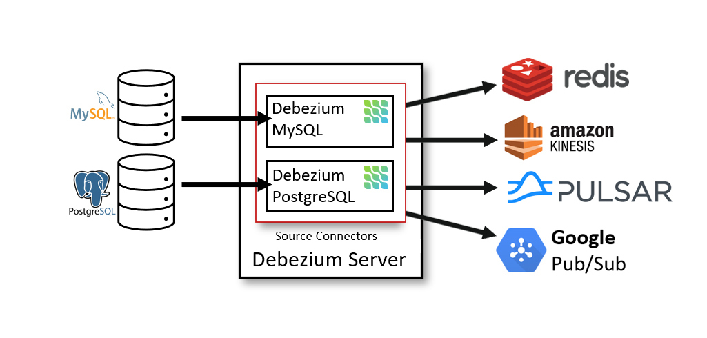

这个指南展示了如何使用Debenium来监控MySQL数据库。随着数据库数据库数据的变更，你将会看到行程的event stream。在这个指南中，你将会启动Debezium服务，运行一个MySQL服务，然后使用Debezium来监控数据库来获取变更。需要首先安装并运行Docker，这个指南使用Docker与Debezium容器镜像来运行需要的服务。你需要使用最新版本的Docker。
# Introduction to Debezium
Debezium是一个分布式平台，将数据库的数据信息转换为event stream使应用程序可以检测到这种变更并响应这种变更。Debezium基于Apache Kafka并提供了一组兼容[Kafka Connect](https://kafka.apache.org/documentation.html#connect)的连接器。每一种连接器都对应一个数据库系统。连接器检测数据库的数据变更并形成变更事件流到一个kafka的topic中。消费程序可以从Kafka的topic中读取事件记录。通过利用Kafka的可靠的流处理平台的优势，应用程序可以正确而完整的消费数据库的变更。即使你的应用意外终止或者丢失连接，也不会丢失事件。接下来的指南将会展示如何部署与使用MySQL连接器。
# Staring the services
使用Debezium需要3个不同的服务，Zookeeper、Kafka与Debezium连接器服务。在这个指南中，你会使用Docker镜像来创建这些服务的单机版本。
## Considerations for running Debezium with Docker
这个指南使用Docker与Debezium容器镜像来运行ZooKeeper, Kafka, Debezium，MySQL。每个服务运行在一个容器中将会简化部署，你也能随时看到发生的事情。生产中，你需要部署多个实例来提供性能、可靠性、复制与容错性。下面是你要提前知道的
- Zookeeper与Kafka的容器都是短命的，数据都是存在容器中，如果要持久性存储需要额外挂载Volume，否则容器停止时所有数据都不会存在
- 所有的容器都是前台的，这样可以直接在终端看到服务的输出
## Starting Zookeeper
```shell
docker run -it --rm --name zookeeper -p 2181:2181 -p 2888:2888 -p 3888:3888 quay.io/debezium/zookeeper:2.4
```
## Starting Kafka
```shell
docker run -it --rm --name kafka -p 9092:9092 --link zookeeper:zookeeper quay.io/debezium/kafka:2.4
```
## Starting a MySQL database
```shell
docker run -it --rm --name mysql -p 3306:3306 -e MYSQL_ROOT_PASSWORD=debezium -e MYSQL_USER=mysqluser -e MYSQL_PASSWORD=mysqlpw quay.io/debezium/example-mysql:2.4
```
## Starting a MySQL command line client
```shell
docker run -it --rm --name mysqlterm --link mysql --rm mysql:8.2 sh -c 'exec mysql -h"$MYSQL_PORT_3306_TCP_ADDR" -P"$MYSQL_PORT_3306_TCP_PORT" -uroot -p"$MYSQL_ENV_MYSQL_ROOT_PASSWORD"'
```
## Starting Kafka Connect
```shell
docker run -it --rm --name connect -p 8083:8083 -e GROUP_ID=1 -e CONFIG_STORAGE_TOPIC=my_connect_configs -e OFFSET_STORAGE_TOPIC=my_connect_offsets -e STATUS_STORAGE_TOPIC=my_connect_statuses --link kafka:kafka --link mysql:mysql quay.io/debezium/connect:2.4
```
# Installing Debezium
有几种方式来安装并使用Debezium连接器。我们介绍几种最常用的方式。
## Installing a Debezium Connector
如果你已经安装了Zookeeper、Kafka与Kafka Connect。使用Debezium的连接器是很容易的。只需要下载连接器archive文件解压到Kafka Connect环境即可。将解压后的插件目录添加到Kafka Connect的plugin目录。还可以在worker配置(connect-distributed.properties)中使用`plugin.path`属性指定插件目录。比如，假设你下载了MySQL连接器，解压到`/kafka/connect/debezium-connector-mysql`目录。你需要指定下面的配置
>plugin.path=/kafka/connect

重新启动Kafka Connect来加载新的jar包。连接器插件可以在Maven中找到。如果你的容器不能修改。可以使用 Debezium的容器镜像，里面包含了Apache Kafka、Kafka Connect与Apache Zookeeper。并且预安装了Debezium的连接器。我们的指南已经帮助你熟悉了这些镜像，这对了解Debezium是什么很有帮助。当然你也可以在k8s/openshift上运行Debezium，建议使用[Strimzi Kubernetes Operator](https://strimzi.io/)，允许通过自定的k8s资源部署Apache Kafka、Kafka Connect、connectors等。缺省请款下，/kafka/connect目录被用作kafka Connect的插件目录。所以最好把所有的连接器都放到这个目录下，另外你还可以通过`KAFKA_CONNECT_PLUGINS_DIR`环境变量启动容器来指定更多的目录。当使用官方的kafka connect镜像的时候，你必须指定`CONNECT_PLUGIN_PATH`环境变量。需要Java11+来运行Debezium连接器与Debezium UI。Debezium执行每日构建并发布到Snatype Snapshot仓库。如果你想要尝鲜或者验证BUG。
### Using a Debezium Connector
为了使用一个连接器来产生变更事件，为这些连接器创建一个配置文件并使用Kafka Connect的REST API将连接器配置添加到Kafka Connect集群中，当连接器启动，它会连接数据源并产生变更事件。
### Configuring Debezium Topics
DEbezium使用多个topic来存储数据，topic或者有管理员创建或者自动创建。这些topic有一些限制与建议
- Database schema history topic(MySQL/SQL Server)连接器使用
  - 无限期保留，不要压缩
  - 生产上的replication factor至少是3个
  - 单分片
- 其他Topic
  - （可选）启用日志压缩(如果您希望仅保留给定记录的最后一个更改事件)；在这种情况下，应该配置Apache Kafka中的`min.compaction.lag.ms`和`delete.retention.ms`topic级别设置，以便消费者有足够的时间接收所有事件并删除标记；具体来说，这些值应大于您预期的接收器连接器的最大停机时间，例如 更新它们时.
  - 生产级别的副本
  - 单分片，也可以是多分片，但是无法保证变更事件的顺序，如果使用多分片，默认通过对主键做hash来决定分片。
### Using the Debezium Libraries
虽然Debezium通常的使用方式是作为一个服务，但是所有的相关的Jar都是可用的。我们提供了一些库使应用可以将Kafka Connect连接器嵌入到应用中，直接从数据源消费数据变更事件。这种方式比较轻量，不需要安装Kafka、Zookeeper、Kafka Connect等。但是它不具有容错性与可靠性。因为应用必须管理所有的之前存储在Kafka日志中的状态。这更多的用于测试，在某些特定的应用中可能也是有用的。

# Debezium Architecture
通常来说，你会通过Apache Kafka Connect来部署Debezium，Kafka Connect是一个框架与运行时，用来实现与操作
- 源连接器，比如Debezium，用来发送记录到Kafka
- Sink连接器，广播kafka topic中的记录到其他的系统
下面的架构展示了基于Debezium的变更数据获取管道的架构

正如在图片中所示，不输了Debezium连接器来获取数据变更，每一个Debezium连接器创建一个对源数据库的连接。
- MySQL连接器使用一个客户端库来访问binlog
- PostgreSQL连接器从逻辑副本流中读取数据

Kakfa Connect则是一个除了Kafka之外的分离的服务。默认情况下，数据库表的变更会被写入到与表名对应的topic中，你可以配置destination topic名字，只需要更改Debezium的topic路由规则。比如，你可以
- 将记录路由到任意的topic中
- 将所有表的记录都路由到一个topic中

当变更记录发送到kafka后，不同连接器可以将数据流发送到其他的系统或者ES、数据仓库、分析系统或者缓存(比如Infinispan)。依赖选择的sink连接器。你需要配置Debezium的新纪录状态解析信息。此Kafka Connect SMT将After结构从Debezium的更改事件传播到接收器连接器。这代替了默认传播的详细更改事件记录。

## Debezium Server
另一种部署Debezium的方式是使用Debezium server。Debezium server是可配置的即时可用的应用，他将来自于一个源数据库的变更事件流式传输到各种各样的消息队列中。下图展示了使用Debezium server的变更数据获取管道架构

Debezium Server配置为使用Debezium源连接器之一来捕获源数据库中的更改。更改事件可以序列化为不同的格式（例如 JSON 或 Apache Avro），然后发送到各种消息传递基础设施之一，例如Amazon Kinesis、Google Cloud Pub/Sub或 Apache Pulsar。
## Debezium Engine
另一种使用Debezium连接器的方式是[Debezium engine](https://debezium.io/documentation/reference/2.5/development/engine.html)。在这种场景中，Debezium不会通过Kafka Connect运行，而是作为一个库内嵌到你的Java应用中，当你的应用想要直接消费变更事件时是非常有用的，不需要部署完整的Kafka/Kafka Connect集群。你可以在例子仓库中找到一个这样的[例子](https://github.com/debezium/debezium-examples/tree/main/kinesis)
# Debezium Features
Debezium是Apache Kafka Connect的一组源连接器。每一个连接器使用其对应的数据库的特性摄取数据变更来实现CDC。与其他方法(例如轮询或双入)不同，Debezium实现基于日志的CDC:
- 确保所有的数据变更都会被捕获到
- 在低延迟的产生变更事件的同时避免了因为频繁的polling生成的CPU消耗。对MySQL来说，是ms级别的
- 不需要额外的数据模型支持，比如需要一个特定的列等
- 能获取删除事件
- 能获取就的记录状态与额外的metadata，比如transaction ID与造成变更的查询

[Five Advantages of Log-Based Change Data Capture](https://debezium.io/blog/2018/07/19/advantages-of-log-based-change-data-capture/)这篇博客提供了更多的信息。Debezium同时具有几个与获取数据变更相关的能力与可选项
- Snapshots: 可选的，连接器刚启动并且可能不存在所有的logs时会使用当前数据库的初始快照，通常来说，这种场景就是数据库已经运行了一段时间，已经丢弃了一些无用的日志记录，比如这些日志不再被事务恢复或者复制所需要。执行快照有几种模式，包括增量式快照，可以在连接器运行时触发。更多的细节，参考你使用的连接器的文档。
- Filters: 你可以配置大量的包含/排除的filters，用来过滤schema、table或者column
- Masking: 特定列的值可以被masked，比如当他们包含敏感的数据
- Monitoring: 大部分的连接器可以使用JMX监控
- 即时使用的message transformation，用于message routing、event flattening等等，参考[Transformation](https://debezium.io/documentation/reference/2.5/transformations/index.html)

Debezium可以被用来当作一个内嵌的lib嵌入到你的应用中，通过Debezium Server，你还可以发送变更事件到消息中间件。


