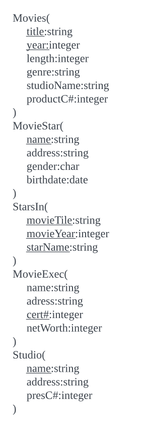

# 数据库系统世界
数据库是每一项业务的基础。DBMS=数据库系统
1. 数据库系统的发展
   数据库就是由DBMS管理的信息的集合。DBMS具备的功能:
   - 支持DDL，支持scheme
   - 支持查询/更新数据
   - 支持大数据量存储
   - 持久性，重启或程序挂掉不会丢失
   - 允许并发，用户操作不影响也就是隔离性，对数据的操作支持完整性，也就是原子性
   最开始的数据库是文件系统，但是不支持上述的功能。后面出现了具有数据存储格式的DBMS，数据有树结构与图结构。还是还不支持高级查询语言，一切都是硬编码。
   第二个发展阶段就是关系数据库系统，Codd提出将数据组织成表的形式呈现给用户，这种形式称为关系(relation)。而且程序员不需要关注数据存储结构，只需要使用SQL这种关系型查询语言就可以了。随着计算机硬件技术的发展，数据库软件作为一种大型软件已经可以运行在普通的PC上，一个趋势就是大数据时代的到来，比如google，youtube，亚马逊等网站的后台数据。
2. 数据库管理系统概述
   
   数据定义语言DDL命令由具有特定权限的DBA执行，更改数据库结构或者模式。数据操作语言DML命令由用户或者应用程序执行，查询或者变更数据。
   - 查询处理: 
   - 事务处理: 

   存储器管理器的任务是控制数据在磁盘上的位置存放和在磁盘与主存间的移动。缓冲区管理器负责把可用主存分割成缓冲区，需要获取磁盘信息的组件都要通过缓冲区管理器
   
   将操作组织成事务，事务管理器接收事务命令，执行下面的任务
   - 记日志logging，可以用于故障恢复;
   - 并发控制concurrency control，调度器也就是并发控制管理器，通过加锁的方式确保事务执行的隔离性。
   - 消除死锁，当陷入死锁时，调度器需要有机制消除打破

   事务的ACID性质:
   - A atomicity表示原子性，事务的操作要么全部被执行要么全部不被执行;
   - I isolation表示独立性，每个事务必须如同没有其他事务在同时执行一样被执行
   - D durability表示持久性，一旦事务已经完成，该事务对数据库的影响就永远不会丢失
   - C consistency表示一致性，也就是说，数据库中的元组的联系具有一致性约束，或说满足一致性期望，
   
   性能的关键点查询处理器(query processor):
   - 查询编译器，把查询转换成称作查询计划（query plan）的内部形式，也就是数据上的操作序列（关系代数）
     - 查询分析器(query parser)，查询文本构造一个查询树结构
     - 查询预处理器(query preprocessor)，语义检查，将初始查询语法树转化转换成初始的查询计划的初始操作符树
     - 查询优化器(query optimizer), 将初始操作符树转换成实际数据上执行最有效率的操作序列

    
   - 执行引擎(execution engine)，负责执行操作序列。
3. 本书概述
   - 关系数据库模型，关系模型，关系数据库理论，高级的数据库设计方法，E-R模型、UML、ODL
   - 关系数据数据库程序设计，如何对关系数据库查询与更新，SQL、数据连接方式
   - 半结构化数据的建模和程序设计
# 关系数据模型
最重要的一种数据模型: 二维表也就是关系。
## 关系模型概述
数据模型是最基本的概念。
数据模型（data model）: 描述数据或信息的标记，3部分组成:
- 数据结构(structure of data): 一般指物理数据模型(physical data model)，数据模型的概念比数据结构的概念高，数据模型也叫做概念模型(conceptual model);
- 数据操作(operation on the data): 数据上的有限的可执行的操作集，查询/修改等;
- 数据约束(constraint on the data): 简单来说，比如周数据，只有1～7，类似这样的约束
2种重要的数据模型:
- 关系数据模型: 对象关系模型。基于表的数据模型。这很像C中的结构体数组，但是关系模型存储可能不是这么简单，因为数据是存储到磁盘上的，需要考虑磁盘的访问方式。与关系模型联系在一起的操作形成了关系代数。关系代数都是面向表的。
- 半结构化数据模型: XML。半结构数据模型类似树或者图而不是关系的表或者数组，比如XML，有一系列嵌套的标签组成，这些标签类似表中的表头。半结构化数据模型的操作主要就是沿着嵌套结构搜索。也有约束，比如标签的数据类型，标签之间关系等

其他数据模型:
- 对象关系模型: 将面向对象的特征加入到关系模型中;
- 层次模型: 基于树结构
- 网状模型: 基于图的位于物理层次上的模型

关系模型是DBMS采用最多的模型，这是因为在大数据的情况下，它是高效的和易用的，它可以对任何事物建模，功能全面，提供的操作具有较高的层级，方便使用。
## 关系模型基础
关系模型描述数据的方法，称为关系的二维表。行描述实体，列描述特征。
关系列命名为属性，表示项目的语义。关系名与属性的集合的组合叫做关系的模式(schema)。描述关系模式就是用这个组合`Movies(title,year,length,genre)`，属性是集合而不是列表，但是为了说明方便，都有顺序。数据库是由一个或者多个关系组成，数据库的关系模式集合叫做关系数据库模式(relational database schema)或者就叫做数据库模式(database schema)。数据行称为元组，元组中的分量对应属性，元组的说明`(Gone with the wind,1939,231,drama)`，这个元组的对应的关系就是属性在关系中顺序。关系模型要求元组中的每个分量具有原子性，它必须属于某种基本元素类型而不能是记录、组合、列表这样可以分解为更小的组合类型。关系中每个属性都有一个域(domain，也叫做数据类型)，元组值必须属于所对应属性的域，将域定义包含在关系模式中`Movies(title: string,year:integer,length:integer,grene;string)`。关系是元组的集合，不是元组的列表，也就是元组的顺序、属性的顺序不重要。关系会随着增删改的原因变化，但是关系模式的变更代价很大，所有的元组叫做关系的实例，数据库维护的是最新的实例，也叫做当前实例。关系可以加键约束，键由一组属性集组成，元组的键值都是唯一的。作为键的属性通常描述是画下划线，比如Movies(<u>title: string</u>,<u>year:integer</u>,length:integer,grene;string)。形成键的属性集的值对于关系的所有实例都具有唯一性。现实中通常使用虚拟键。数据库模式的例子:
 
### 习题2.2.1解答:
a)Accounts关系的属性: acctNo,type,balance;Customers关系的属性:firstName,lastName,idNo,account;
b)Accounts中有3个元组(12345,savings,12000),(23456,checking,1000),(34567,savings,25)；Customers关系中也有3个元组(Robbie,Banks,901-222,12345),(Lena,Hand,805-333,12345),(Lena,Hand,805-333,23456)
c)每个元组的分量为上面的每个值
d)Accounts关系模式(acctNo,type,balance),Customers关系模式:(firstName,lastName,idNo,account)
e)数据库模式为Accounts(acctNo,type,balance),Customers(firstName,lastName,idNo,account)
f)Accounts(acctNo:string,type:string,balance:integer),Customers(firstName:string,lastName:string,idNo:string,account:string)
g)Accounts(acctNo:string,type:string,balance:integer),Customers(firstName:string,lastName:string
### 习题2.2.2
Accounts(<u>acctNo</u>:string,type:string,balance:integer);Customers(firstName:string,lastName:string,<u>idNo</u>:string,account:string)
### 习题2.2.3
一种由多少种方式来描述下面的关系实例(考虑元组与属性的排列顺序)

a)图2-6种的关系Accounts一样具有3个属性与3个元组的关系
9种;
b)具有4个属性与5个元组的关系
20种;
c)具有$n$个属性与$m$个元组的关系
$ n\times m $种
## 在SQL中定义关系模式
用于描述与操作关系数据库的语言是SQl(sequel)。
- DDL语言，定义数据库模式
- DML语言，查询与更新

1. SQL区分3类关系:
   - 需要存储的关系，也就是普通表，是数据库实际存储的数据，用户可以对元组查询与更新；
   - 视图，通过计算来定义的关系，并不存储，需要的是时候构造;
   - 临时表，执行SQL时临时构造的。
   使用`CREATE TABLE`语句创建关系模式
2. 数据类型
   - 可变长度与固定长度的字符串CHAR(n),VARCHAR(n);
   - 固定或者可变长度的位串BIT(n);
   - BOOLEAN;
   - DATE/TIME类型，是字符串的一种特殊类型
   - 整数值INT/INTEGER;
   - 浮点数，FLOAT/REAL/DOUBLE/PRECISION/DECIMAL(n,d)/NUMERIC(n,d)
3. 简单的表定义
   最简单的关系模式的定义形式是由保留字`CREATE TABLE`后面接关系名以及括号括起来的由属性名和类型组成的列表。
   例子:
   ```sql
   CREATE TABLE(
      title CHAR(100),
      year INT,
      length INT,
      genre CHAR(10),
      studioName CHAR(30),
      produerC #  INT
   );
   ```
4. 修改关系模式
   `DROP TABLE R`
   `ALTER TABLE table-name ADD|DROP`, ADD表示添加新的属性，DROP表示删除已有的属性。
5. 默认值
   DEFAULT value,添加默认值的方式，DEFAULT NULL/DEFAULT '?'
6. 键的声明
   2种方式声明键:
   - 直接在属性后面声明
   - 专门的表项声明，可以声明一个或者多个是键；
   键有2种:
   - PRIMARY KEY(不能为NULL)
   - UNIQUE
<<<<<<< HEAD
### 习题2.3.1

### 习题2.3.2
## 关系代数查询
=======
## 代数查询语言
数据模型包括:
- 描述数据的数据结构
- 操作这些数据的方法，关系代数，包含一些简单的方法可以从给定关系构造出新的关系。
使用专门的查询语言主要是为了方便的开发以及统一的高度优化。一门代数总是由一些操作符和一些原子操作数组成。任何一门代数都允许把操作符作用在原子操作数或者是其他代数表达式上构造表达式，比如$(x+y)*z$等。关系代数是另外一门代数，它的原子操作数是:
- 代表关系的变量
- 代表有限关系的常量
1. 关系代数概述
   关系代数的操作4类:
   - 通常的关系操作: 并、交、差
   - 除去某些行/列的操作，**选择**是消除某些行的操作，**投影**是消除某些列的操作
   - 组合2个关系元组的操作，笛卡尔积运算，连接(join)操作，选择一些元组配对
   - 重命名操作，改变关系模式，属性/关系本身名称被改变
   关系代数的表达式称为查询(query)
2. 关系上的集合操作
   并、交、差
   - $ R\cup S $表示关系$R$与$S$的并;
   - $ R\cap S $表示关系$R$与$S$的交;
   - $ R-S $表示关系$R$与$S$的差;
   给定2个关系$R$与$S$:
   关系$R$
>>>>>>> ea34290 (update)

   | **name**      | **address**             | **gender** | **birthdate** |
   |---------------|-------------------------|------------|---------------|
   | Carrie Fisher | 123 maple St.,Hollywood | F          | 9/9/99        |
   | Mark Hamill   | 456 Oak Rd.,Brentwood   | M          | 8/8/88        |
   关系$S$

   | **name**      | **address**             | **gender** | **birthdate** |
   |---------------|-------------------------|------------|---------------|
   | Carrie Fisher | 123 maple St.,Hollywood | F          | 9/9/99        |
   | Harrison Ford | 789 PalmDr.,Brentwood   | M          | 7/7/77        |
   执行它们的并/交/差运算
3. 投影projection
   从关系生成一个新的关系。包含部分列,这个操作表示为$ {\pi }_{{A}_{1},{A}_{2},\cdot \cdot \cdot ,{A}_{n}}\left ( {R} \right ) $,在关系代数集合中，重复元组总是会被删除。
4. 选择
   产生关系元组的子集合。这个操作表示为$ {\sigma }_{C}\left ( {R} \right ) $表示结果关系的元组必须满足关系$C$。$C$是一个关系中属性的条件表达式，假设$t$是$R$中任意一个元组，把$t$代入到条件$C$中，如果为真，则是 ${\sigma }_{C}\left ( {R} \right )$中的一个元组
5. 笛卡尔积
   也叫做积，表示为$ R\times S $，是有序对的集合，第一个元素是$R$中的元组，第二个元素是$S$中的元组。结果关系模式是关系$R$与$S$的合并。

## 关系上的约束


   