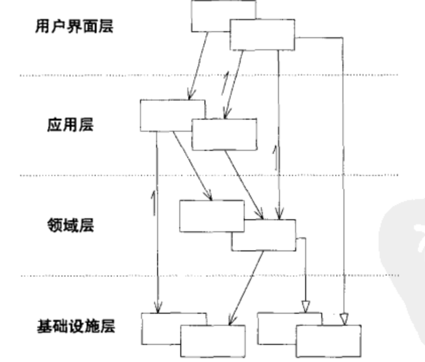
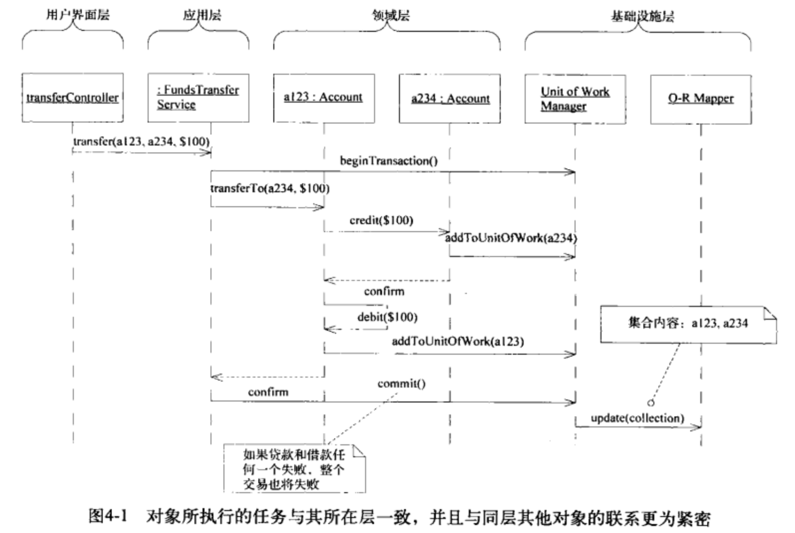

我们需要将领域对象与系统中的其他功能分离，这样可以避免将领域概念与其他只与软件技术相关的概念搞混，也不会在复杂的系统中迷失了领域。
# 模式：Layered Architecture

要想创建出能够处理复杂任务的程序，需要做到关注点分离，使设计中的每个部分都得到单独的关注，分离的同时，需要维持系统内部复杂的交互关系。
分层模式的基本原则是层中的任何元素都仅依赖于本层的其他元素或其下层的元素，向上的通信必须通过间接的方式进行。
分层的价值在与每一层都只代表程序中的某一特定方面，这种限制使每个方面的设计都更具内聚性更容易解释。内聚设计的最终要的是选择合适的分层方式。
大多数的分层架构都是下面概念的变体。
|层|描述|
|:---|:---|
|用户界面层（表示层）|负责人向用户显示信息或者解释指令，这里的用户可以是另一个计算机系统|
|应用层|定义软件要完成的任务，并且指挥表达领域概念的对象来解决问题，这一层对业务意义重大。应用层要尽量简单，不包含业务规则与知识，只为下一层的领域对象协调任务、分配工作、使他们互相协作，它没有反映业务情况的状态，但是却可以具有另一种状态，为用户或者程序显示某个任务的进度|
|领域层（模型层）|负责表达业务概念，业务状态信息以及业务规则，尽管保存业务状态的技术细节是由基础设施层实现的，但是反映业务情况的状态是由本层控制并且使用的，领域层是业务软件的核心|
|基础设施层|为上面各层提供通用的技术能力，为应用层传递消息，为领域层提供持久化机制，为用户界面层绘制屏幕组件，基础设施层还能够通过架构框架来支持4个层次间的交互模式|

将领域层分离是DDD的关键。给复杂的应用划分层次，在每一层内分别进行设计，使其具有内聚性并且只依赖它的下层，采用标准的架构模式，只与上层进行松散的耦合，将所有与领域模型相关的代码放在一层中，并把它与用户界面层、应用层、以及基础设施层的代码分开，领域对象应该将重点放到如何表达领域模型上，不需要考虑自己的显示与存储问题，也无需管理应用任务等内容，这使得模型的含义足够丰富，结构足够清晰，可以捕捉到基本的业务知识并有效的使用这些知识。
关注点的分离可以使每一层的设计更易理解与维护。一个银行转账的分层模型

各层之间是松散连接的，层与层的依赖关系只能是单向的，上层可以直接使用或者操作下层元素，下层需要与上层元素通信需要使用到架构模式，如回调模式或者Observers模式。最早将用户界面层与应用层领域层连接的模式是MVC模式，连接的模式不能影响领域层的独立性，那么连接的方式就是有效的，也就是在设计领域对象时不需要考虑到用户界面等的影响。
基础设施层处于领域层的下面，不包含领域知识，通常以service的方式提供能力，应用层与领域层可以调用基础设施层提供的service，service中封装详细行为，调用程序可以与service保持松散的连接。并不是所有的基础设施层的都可以简单的以service的方式提供，由的要直接支持其他层的基本功能，通常会侵入其他层的实现，整合了大量基础设施需求的框架通常会要求其他层以某种特定的方式实现，如以框架类的子类或者带有结构化的方法签名，最好的架构框架既能解决复杂的技术问题，也能让领域开发人员集中精力去表达模型。在框架的基础上，我们要建立一种可以表达领域模型的实现，可能需要抛弃框架中的一些功能。就是有选择的使用框架的功能。
# 领域层是模型的精髓
领域层是领域模型与所有与其直接相关的内容；由业务逻辑的设计与实现组成，将领域实现独立是DDD的前提。
# 模式：The smart UI 反模式
