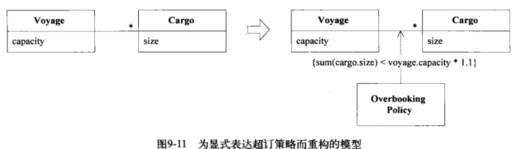
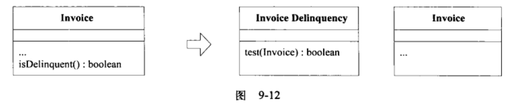
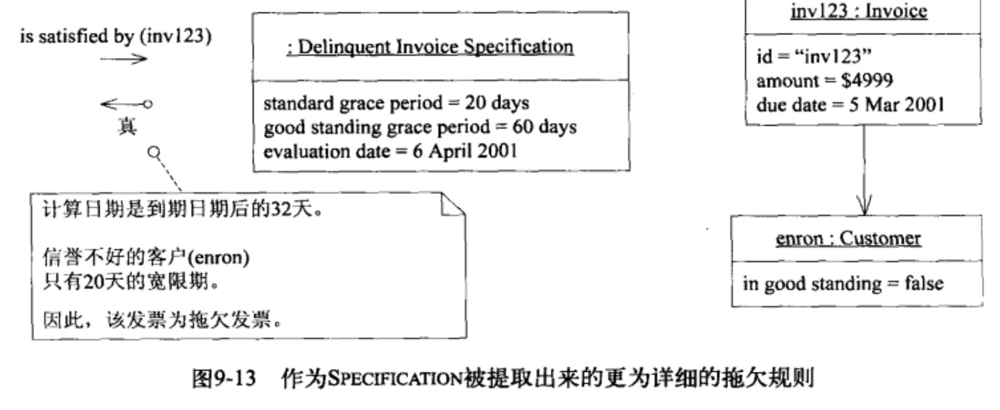
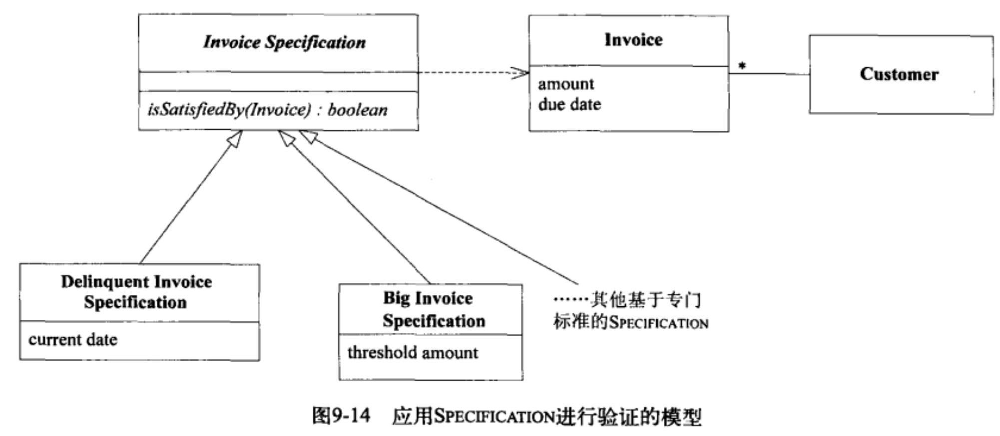
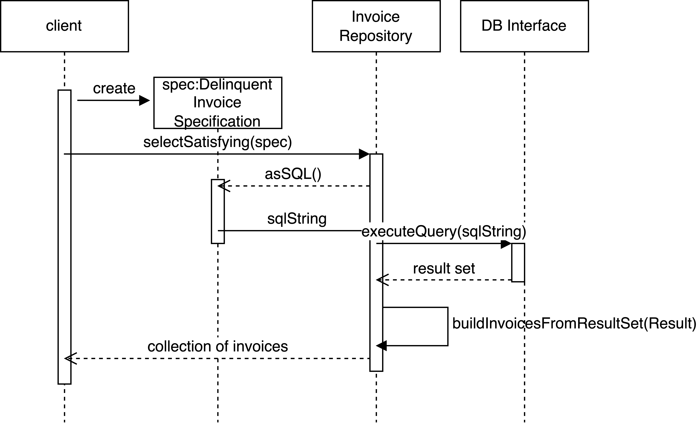

深层模型包含了领域的核心概念与抽象，能够以简单灵活的方式表达出基本的用户活动、问题以及解决方案。深层建模的第一步就是要设法在模型中表达出领域的基本概念，在不断的消化知识与重构中，精化模型。这个过程是从我们识别出某个重要概念并在模型与设计中把它显式的表达出来开始的。开发人员发现一个新的概念，就要重构代码或新增对象把概念显式的表现出来。找到隐含概念才能获得突破。
# 9.1 概念挖掘
开发人员需要敏锐的捕捉到隐含概念，可以主动寻找，几个方式
- 倾听团队语言，找出设计中没有的领域专家说的术语名词概念等，
- 检查设计的不足，操作复杂且难于理解的地方，新的需求会使功能更复杂的地方，对象的职责实现很笨拙的地方；需要自己探索想法，并跟领域专家验证；
- 检查设计与专家矛盾的地方，不同的领域专家的看法概念可能不同，也有可能领域概念前后不一致，将矛盾统一起来可以获得对模型的更深层次的理解，
- 研究领域相关文献，看书与咨询领域专家不冲突，或者是参考此领域中有过开发经验的人员编写的资料。
每次改变都会把开发人员更深刻的理解添加到模型中，每次重构都会使设计变的灵活，并且为可能需要修改的地方做好准备，只有不断尝试才能知道什么有效，什么无效，企图避免设计上的失误将会导致开发出来的产品质量低劣，因为没有更多的经验可用来借鉴，同时也会比进行一系列快速实验更加费时。
# 9.2 如何为那些不太明显的概念建模
约束是模型概念中非常重要的类别，通常是隐含的，显式的表现出来可以极大的提高设计质量。比如一个简单的固定规则
```java
class Bucket {
    private float capacity;
    private float contents;
    public void pourIn(float addedVolume){
        if(contents+addedVolume>capacity){
            contents=capacity;
        }else {
            contents=contents+addedVolume;
        }
    }
}
```
在更复杂的类中，约束将丢失，将它提取到一个单独的方法中，并用清晰直观的名称来表达它的含义。
```java
class Bucket {
    private float capacity;
    private float contents;
    public void pourIn(float addedVolume){
        float volumePlacedIn=contents+addedVolume;
        contents=constrainedToCapacity(volumePlacedIn);
    }
    public void constrainedToCapacity(float volumePlacedIn){
        if(volumePlacedIn>capacity)return capacity;
        return volumePlacedIn
    }
}
```
后面的方式也为约束扩展提供了空间，有的情况下，提取为方法是无法表达约束的，比如约束需要用到其他的信息，这些信息不是当前对象的主要的职责，这个时候约束规则不适合放到当前的对象中。下面情况下需要单独提取为对象或者类
- 约束需要外来的数据;
- 规则在多个对象中出现，造成代码重复，或不属于同一个族的对象产生了继承关系;
- 规则在设计与需求中比较重要。
一个货运中的约束的例子


领域中的过程必须在模型中表示出来，经常被领域专家提起的过程需要显示的表达出来。

模式：Specification
业务规则通常不适合作为Entity或Value Object的职责，而且规则的变化与组合也会掩盖领域对象的基本含义，当时将规则移出领域层的结果会更糟糕，这样一来，领域代码就不再表达模型了。逻辑编程提供了一种概念，即谓词，这种可分离，可组合的规则对象；要把这种概念用对象完全实现是很麻烦的，这种概念过于通用，在表达设计意图方面，它的针对性不如专门的设计那么好。我们可以使用谓词概念来创建可计算出布尔值的特殊对象，负责的规则方法可以单独提取为一个对象，它们都是一些小的真值测试，可以提取到单独的Value Object中，新对象可以用来计算另一个对象，看看谓词对那个对象的计算是否为真。


这个新对象就是一个规格。Specifiction可以测试任何对象以检验它们是否满足指定的标准。Specifiction将规则保留在领域层。规格是一个完备的对象，这种设计更能清晰的反映模型，利用工厂，可以用来自其他资源的信息对规格进行配置。


使用规格可以得到一整套解决领域建模问题的思路，规则使用的3种场景
- 验证对象，检查它是否满足某些需求或者是否已经为实现某个目标做好了准备;
- 从集合种选择一个对象;
- 指定在创建新对象时必须满足某种需求。

3种用法也就是验证、选择、创建。通过应用Specification模式，可以使用一致的模型。

1. 验证

代码如下:
```java
class DelinquentInvoiceSpecification extends InvoiceSpecification {
    private Date currentDate;
    public DelinquentInvoiceSpecification(Date currentDate){
        this.currentDate=currentDate;
    }
    public boolean isSatisfiedBy(Invoice candidate){
        int gracePeriod=candidate.customer().getPaymentGracePeriod();
        ......
    }
```
2. 选择（从集合中选择一个对象）
验证可以对一个独立的对象进行测试，检查它是否满足某些标准。假设应用程序的需求时列出所有拖欠发票的客户，可以使用之前的标准，那么创建的InvoiceRepository的部分代码如下
```java
public Set selectSatisfying(InvoiceSpecification spec){
    Set results=new HashSet();
    Iterator it=invoices.iterator();
    while(it.hasNext()){
        Invoice candidate=it.next();
        if(spec.isSatisfiedBy(candidate))results.add(candidate);
    }
    return results;
}
```
这个函数可以获取所需要的数据，invoces可能是通过数据库获取的，没有必要获取全部的invoice，因为SQL也可以实现Spec的功能，通过查询语句，将生成SQL的方法封装在spec类中
```java
public Stirng asSQL(){
    return "select * from invoice,customer where invoice.cust_id=customer.id and invoice.due_date+customer.grace_period < SQLUtility.dateAsSQL(currentDate)";
}
```
Spec与Repo的搭配非常合适，如下图

这个设计的一个问题是，表结构的细节本来应该被隔离到一个映射层（把领域对象与关系表关联），现在却在领域层中，需要在多处跟踪表结构信息的变化，通常sql语句与查询会放在基础设施层。如果无法把sql语句创建到基础设施层，还可以重写一个查询方法，并把它添加到Repo实现中，把sql从领域对象中分离出来，为了不在repo中嵌入规则，必须采用更通用的方式来表达查询，这种方式不捕捉规则但是可以通过组合或放置在上下文中来表达规则，比如使用双分发模式
```java
public class InvoiceRepository{
    public Set selectWhereGracePeriodPast(Date  aDate){
        String sql=whereGracePeriodPast_SQL(aDate);
        ResultSet queryResultSet=SQLDatabaseInteface.instance().executeQuery(sql);
        return buildInvoicesFromResultSet(queryResultSet);
    }
    public String whereGracePeriodPast_SQL(Date aDate){
          return "select * from invoice,customer where invoice.cust_id=customer.id and invoice.due_date+customer.grace_period < "+SQLUtility.dateAsSQL(aDate);
    }
    public set selectSatisfying(InvoiceSpecification  spec){
        return spec.satisfyingElementsFrom(this);
    }
}
```
spec中的asSQL()方法被替换为satisfyingElementsFrom(InvoiceRepository)
```java
public class DelinquentInvoiceSpecification{
    public Set satisfyingElementsFrom(InvoiceRepository invoiceRepository){
        return invoiceRepository.selectWhereGracePeriodPast(currentDate);
    }
}
```

