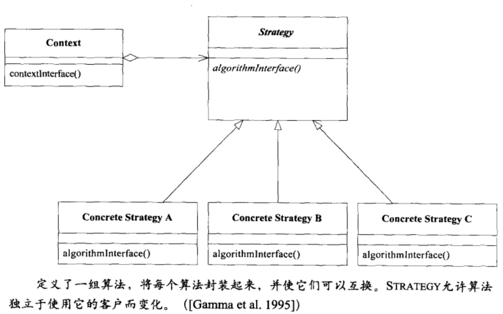
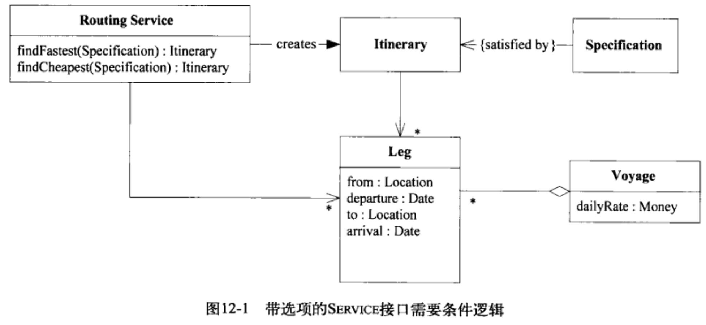
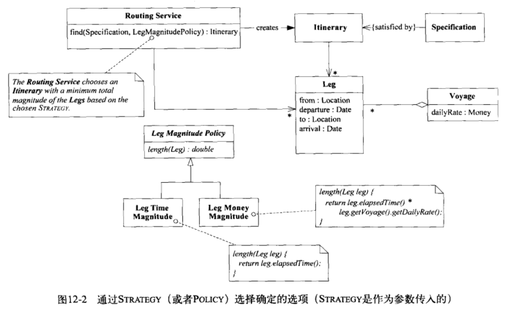
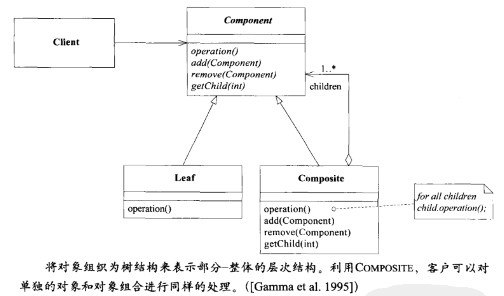

立场不同会影响人们如何看待什么是模式以及什么不是模式，一个人所认为的模式在另一个人看来可能是基本构造块，设计模式并不是指像链表或者散列表那样可以被封装到类中，并供人们直接重用的设计，也不是用于整个应用程序或者子系统的复杂的、领域特定的设计，设计模式是对一些交互对象或者类的描述，通过定制这些类与对象来解决特定上下文中的一般设计问题。
# 模式：Strategy（Policy）

模型包含一些并非用于解决技术问题的过程，将它们包含进来，是因为它们对处理问题领域具有实际的价值，当必须从多个过程中进行选择时，选择的复杂性或者多个过程本身的复杂性会使局面失去控制，当对过程建模时，过程有不止一种的合理的实现方式，如果把所有的可选项都写到过程的定义中，定义就会变得臃肿而复杂，可供选择的实际的行为也会因为混杂在其他行为中而显得模糊不清，我们希望把这些过程从主体中分离出来，既能看清主体概念，也能看清选择，策略模式从技术上就是来解决这个问题的，但是在领域驱动设计中，策略模式是一种概念设计。需要把过程中极易发生变化的部分与更稳定的部分分离开。需要把模型中的易变的部分提取到模型的一个单独的策略对象中，将规则与它所控制的行为区分开，实现规则可替换的过程，策略对象的多个版本表示了完成过程的不同方式。通常，策略设计模式侧重于替换不同算法的能力，在领域驱动设计中，侧重概念的能力，这里的概念是指过程或者策略规则。
一个重要的例子

里面充斥着条件判断或者重复的代码，当有新的选择时，会更麻烦，改起代码来更难，一种解决办法就是把那些起调节作用的参数解耦到策略中，如下：

# 模式：Composite

定义一个把Comnposite的所有成员·都包含在内的抽象类型，在容器上实现那些查询信息的方法时，这些方法返回由容器内容所汇总的信息，