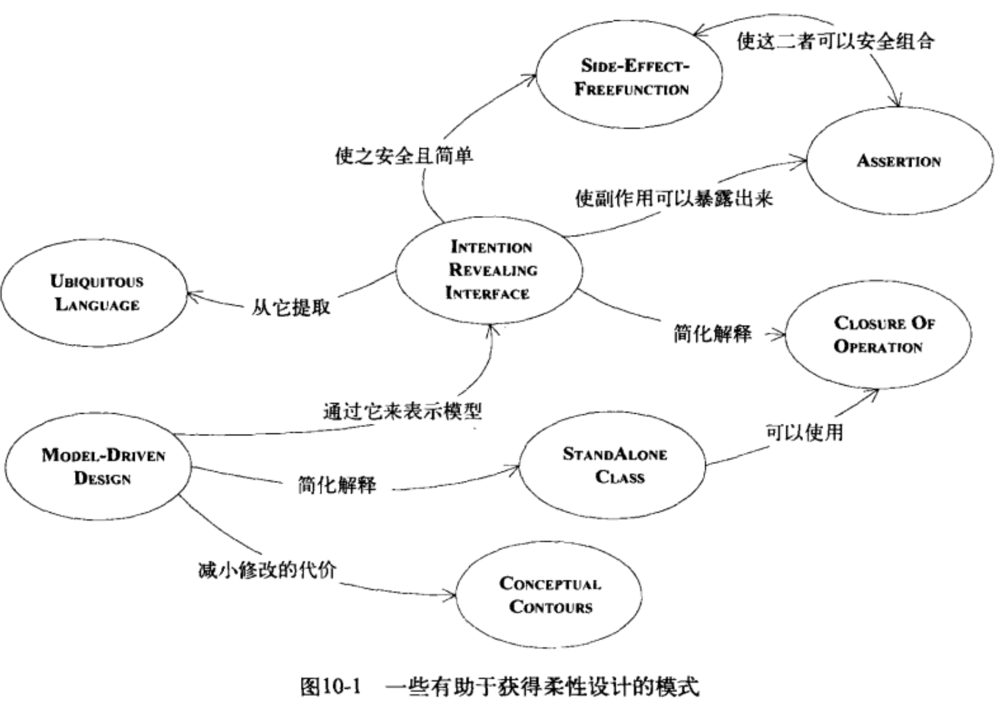
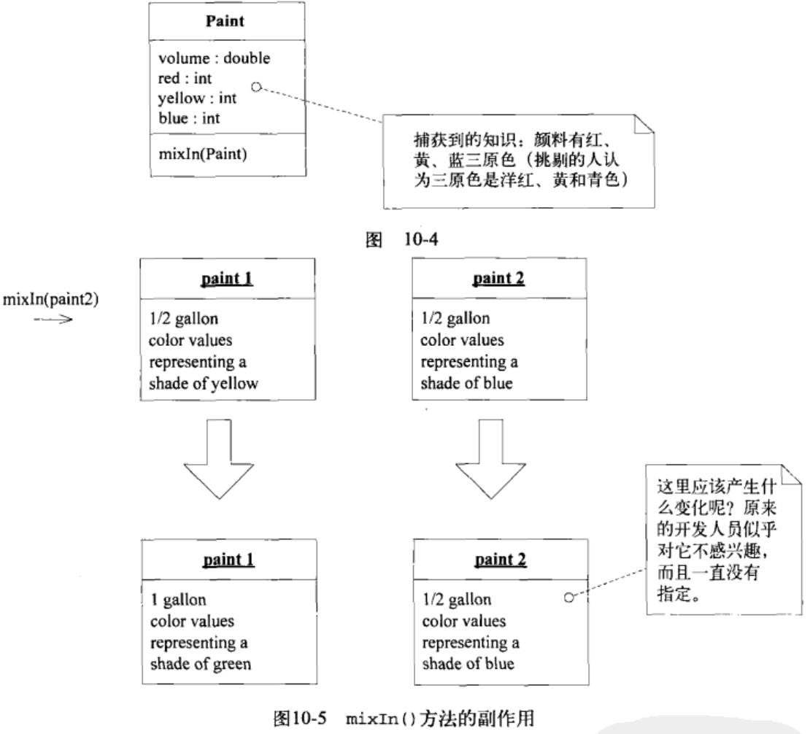
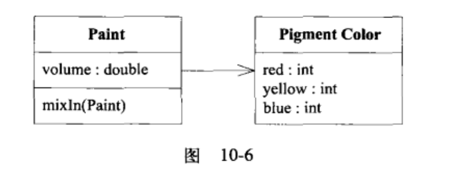
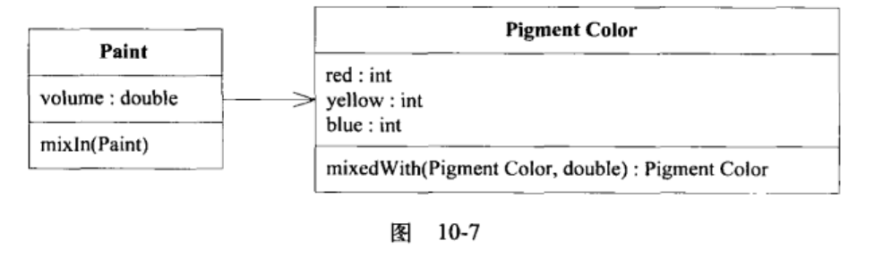
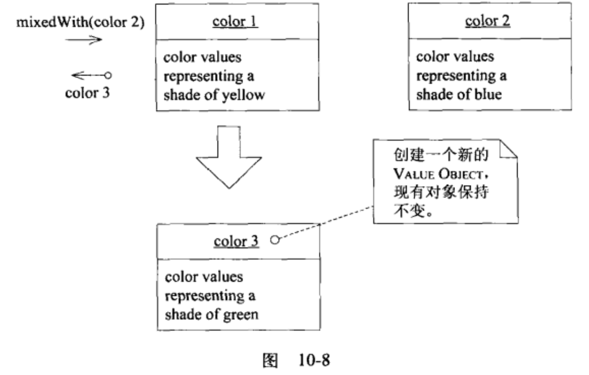
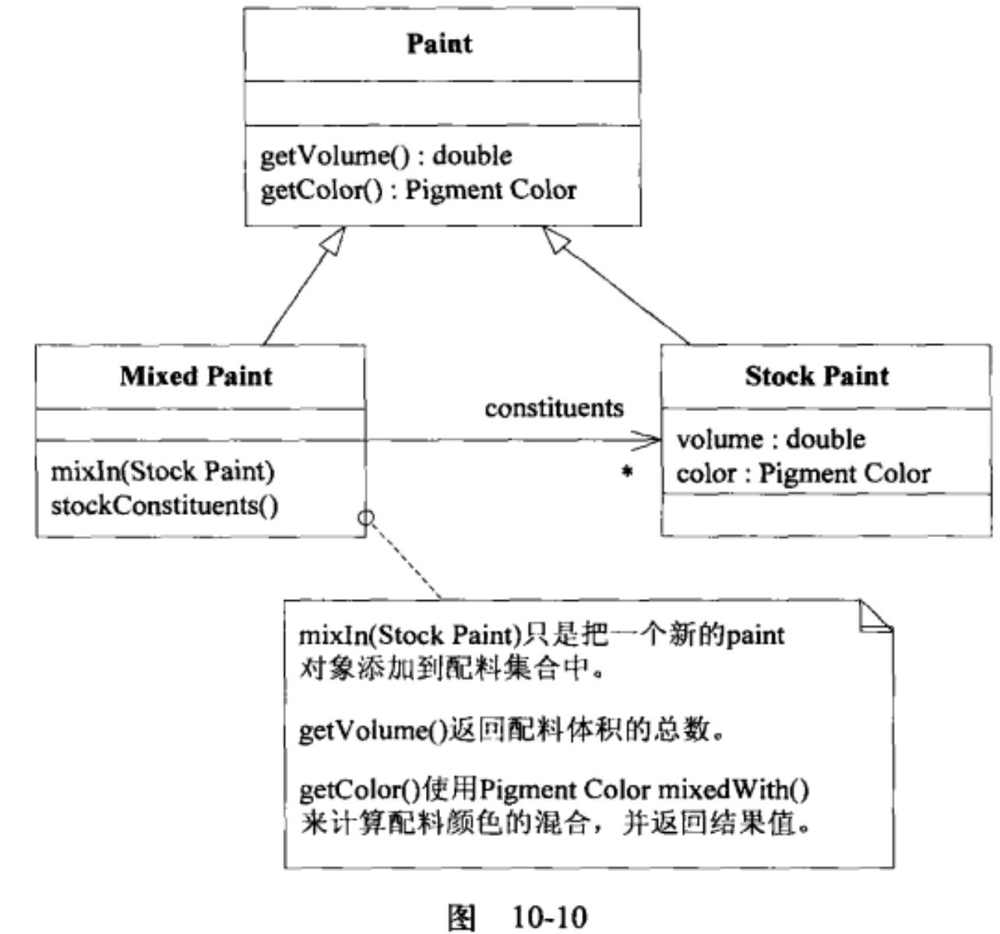

复杂的软件缺少良好的设计时，重构或者元素的组合会变得困难，因为不了解代码的逻辑，可能会重复书写一些逻辑一样的代码。，又不敢破坏历史的代码，可能会更乱或者破坏了依赖，这样限制了重构与迭代的精华，限制了程序提供功能的上限。
为了让项目能够随着开发工作的进行加速前进，不会由于自己的老化停滞不前，设计时必须乐于使用且乐于修改，这就是柔性设计(supple design)。
坚持模型驱动的设计方法，当复杂性阻碍了项目的前进时，就需要仔细修改最关键、最复杂的地方，使之变成一个柔性设计。才能突破复杂性带给我们的限制，而不会陷入遗留代码维护的麻烦中。柔性设计没有公式，一些模式运用得当，可以获得柔性设计。
# 模式： Intention Revealing Interfaces(意图展示接口)
领域驱动的设计中，希望突出有意义的领域逻辑（变成名字啥的，不要隐藏在多行的代码中）这样需要一行一行读代码.

客户开发人员想要有效的使用对象，必须知道对象的一些信息，如果接口没有表示这些信息，那么就需要研究对象的内部实现，理解细节，这就失去了封装的意义，如果需要思考使用组件的大量细节，也没有时间解决上层问题的复杂性。如果使用组件的开发者，不得不通过其实现来推断用途，推断出来的用途不一定就是接口定义的用途，如果不符合定义，代码虽然可以暂时工作，但是设计的概念基础被误用了，开发人员的意图也相反了。当把概念显示建模为类或者方法时，必须起一个能够反映概念的名字。
使用Intention Revealing Selector选择方法的名称，使名称表达出目的，名字的命名方法如下：要描述效果与目的，复杂的机制封装在抽象背后，接口只表明意图不表明方式。
# 模式：side effect free function可以让方法的执行结果变得易于预测
操作可以分为2大类：
- 命令
- 查询
副作用=意外的结果，任何对系统状态产生的影响都叫副作用。
多个规则的相互作用或计算的组合产生的结果是很难预测的，为了预测操作的结果，必须理解底层的内部实现与其他的关联调用，那么接口抽象就失去意义，如果没有可以安全的预见结果的接口抽象，那么接口实现就必须简单，组合的复杂性就要被降低，系统的功能与行为就会减少。返回结果而不产生副作用的操作称为函数，因为没有副作用可以降低风险。
减少命令的副作用的2个方法
- 把命令与查询放在不同的操作中，确保导致状态改变的方法不返回领域数据，保持命令简单，在不引起副作用的方法中执行查询与计算
- 一些模型与设计创建返回Value Object表示计算结果，不能被修改，也不影响Entity，Entity的生命周期受到严格管理，Value Object随时可以创建丢弃.
如果一个操作把逻辑或计算与状态改变混合在一起，应该把这个操作重构为2个独立的操作。把副作用隔离到简单的命令方法的做法仅适用于Entity，Value Object负责复杂的计算逻辑.
尽可能把程序的逻辑放到函数(无状态的方法)中，函数只返回结果，不产生副作用；把命令隔离到不返回领域信息的简单的操作中，当发现一个非常适合承担复杂逻辑职责的概念时，把复杂的逻辑移到Value Object中，可以进一步控制副作用。因为是Value Object，所以可以随便使用。可以看下mixIn()方法的副作用

修改于查询分离。这个问题中，颜色是很重要的概念，把它变成一个显示的对象。

PigmentColor是一个ValueObject，独立出对象后，相关的操作也要独立出来，那么与volume的改变就毫无关系了，只与Paint有关系，它是具有生命周期的实体。调漆的结果就是产生一个新的PigmentColor对象.

产生的类如下
```java
public class PigmentColor{
    public PigmentColor mixedWith(PigmentColor other,double ratio){
        // many lines of complicated color-mixing logic
        // ending with the creation of a new PigmentColor object
        // with appropriate new red,blue,and yellow values
    }
}
public class Paint{
    public void mixIn(Paint other){
        volumme=volume+other.getVolume();
        double ratio=other.getVolume()/volume;
        pigmentColor=pigmentColor.mixedWith(other.pigmentColor(), ratio);
    }
}
```

## 模式：Assertion
如果操作的副作用仅仅是由它们的实现隐式定义的，那么在一个具有大量相互调用关系的系统中，起因与结果会变得一团糟，理解程序的唯一的方式就是沿着分支路径来跟踪程序的执行，封装完全失去了价值，跟踪具体的执行也使抽象失去了意义，需要在不深入研究内部机制的情况下理解设计元素的意义与执行操作的后果。接口定义无法完全展示副作用，契约式设计(design by contract)通过给出类和方法的断言使开发人员知道肯定会发生的结果，这种设计的特点是
- 后置条件描述了一个操作的副作用
- 前置条件是合同条款，为了满足后置条件呢必须要满足的前置条件;
- 类的固定规则规定操作结束时对象的状态;
他们都是对状态的约束，把操作的后置条件与类的固定规则表述清楚，如果不能在语言中直接编写Assertion，把它们编写为自动的单元测试或者写到文档或图中，寻找在概念上内聚的模型，以便使开发人员更容易推断出预期的Assertion。

assertion的一个单元测试，通过单元测试理解了操作的副作用
```java
public void testMixingVolume(){
    PigmentColor yello=new PigmentColor(0,50,1);
    PigmentColor blue=new PigmentColor(0,0,50);
    StockPaint paint1=new StockPaint(1.0,yello);
    StockPaint paint2=new StockPaint(1.0,blue);
    MixedPaint mix=new MixedPaint();
    mix.mixIn(paint1);
    mix.mixIn(paint2);
    assertEquals(2.5,mix.getVolume(),0.01);
}
```
## 模式: Conceptual Contour
有时人们会对功能进行更细的分解，以便灵活的组合它们，有时要把功能合成大块，以便封装复杂性，如果把模型或者设计的所有的元素都放在一个整体的大结构中，那么它们的功能就会发生重复，外部接口无法给出客户可能关心的全部信息，由于不同的概念被混合在一起，它们的意义变得很难理解，但是把类或者方法分开也可能毫无意义，会使客户更复杂，迫使客户对象去理解各个细微部分是如何组合在一起的，有的概念可能会完全丧失。领域含有着逻辑一致性的规则，当模型与领域的部分逻辑一致，那么也要与后续发现的逻辑一致。当新发现的知识不符合这种逻辑，那么就需要重构，以便获取更深层次的理解。反复重构会实现柔性设计。随着模型不断完善，概念逐渐形成。
高内聚低耦合是所有部分设计的原则，要寻找在概念上有意义的功能单元，使得设计即灵活又易懂。任何领域中，都有一些细节是用户不感兴趣的，把那些没有必要分解或者重组的元素作为一个整体。把设计元素(操作、接口、类、AGGREGATE)分解为内聚的单元，在这个过程中，你对领域中一切重要划分的直观的认识也要考虑在内，在连续的重构过程中观察发生变化和保证稳定的规律性，并寻找能够解释这些变化模式的底层的conceptual contour，使模型与领域中那些一致的方面想匹配。
我们的目标是得到一组可以在逻辑上组合起来的简单接口，这需要不断的修改与重构。
## 模式：standalone class
相互依赖使模型与设计变得难以理解，而且会越来越多。MODULE与AGGREGATE都是为了限制互相依赖的关系网的规模，识别出高度内聚的子领域并提取到一个module中，子领域内的对象与系统的其他部分解除了联系，这样关系网的规模变小，但是module内也存在关系网，规模也不能打。这些关联可能存在隐式的概念，对每个依赖关系提出质疑，直到证实它确实表示对象的基本概念为止。不断精炼模型，按照低耦合的方式前进，那么最终依赖关系可能越来越少，类变得比较独立，变得容易理解。
尽力把最复杂的计算提取到standalone class中，实现此目的的唯一的方法就是从存在大量依赖的类中将Value Object建模出来。低耦合式减少概念过载的最基本的办法，独立的类式低耦合的极致。
## 模式: closure of operation
