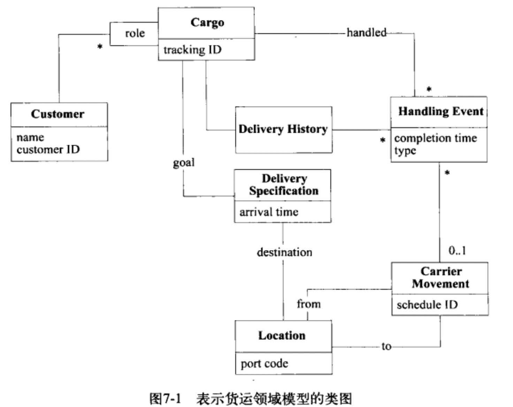

这一章就是一个比较全面的示例
# 7.1 货物运输系统简介
为一家货运公司开发软件，需求如下：
- 跟踪客户货物的主要处理;
- 事先预约货物;
- 当货物达到处理过程中的某个位置时，自动想客户寄送发票。
一个合理的模型如下：

HandlingEvent用于处理Cargo的不同的事件，DeliverySpecification定义了运送目标（目的地或者到达日志等）DeliverySpecification的职责也可以由Cargo担任，抽象出来的好处有3个:
- 如果Cargo负责执行运送目标，Cargo对象就会比较混乱，难以理解或者修改;
- 当将模型作为一个整体时，可以轻松的忽略掉细节，比如规格的细节;
- 具有更强的表达力，DeliverySpecification没有指明具体的方式，但是是必须完成的规格;
Customer按照角色分shipper、receiver、payer等；carrier movement表示某个Carrier执行的从一个Location到另一个Location的过程，Cargo被装上Carrier后，通过Carrier的一个或者多个Carrier Movement，可以在不同的地点之间转移。Delivery History反映了cargo实际上发生了什么事情，一次成功的满足DeliverySpecification的运送会得到一个DeliveryHistory。
# 7.2 隔离领域：引入应用程序层
为了防止领域的职责与系统的其他部分混杂在一起，使用Layered Architecture把领域层划分出来。分析得到3个用户级别的应用程序功能，将这3个功能分给3个应用层类。
- 第一个类是Tracking Query（跟踪查询），它可以访问某个Cargo过去与现在的处理情况;
- 第二个类是Booking Application(预订应用)，它允许注册一个新的Cargo，并使系统准备好处理它;
- 第三个类是Incident Logging Application(事件日志应用),记录对Cargo的每次处理.
# 7.3 将Entity与Value Object区分开
依次考虑每个对象，看对象是一个实体还是仅表示一个值；
- Customer: Customer具有标识，是一个Entity;
- Cargo: 也是Entity;
- HandlingEvent与CarrierMovement: 反映了真实世界的事件，是Entity; 
- Location: Entity;
- Delivery History: Entity,2个对象不能互换，也就是有自己的标识；
- Delivery Specification: 不同的Cargo可以共用一个，因此是Value Object;
# 7.4 设计运输领域的关联
  