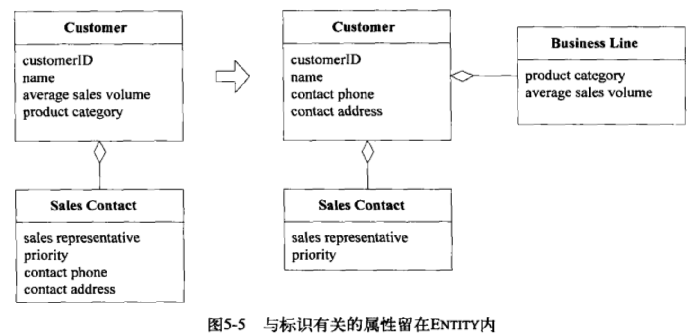

[TOC]
# 关联
对象之间的关联使得建模与实现之间的交互更为复杂。对象之间的关联关系可以是一对多或者多对多，多对多比较难控制，能优化到一对多或者一对一就会使关系变得简单，优化的方法有3种：
- 规定一个关联方向，不好不要是双向的；
- 添加一个限定符，减少多重关联；
- 消除不必要的关联。
尽可能的对关系进行约束，就是通过业务规则将双向的关联弄成单向的关联，通过不断的添加限定条件，将一对多约束到一对一。
关系便简单了。
# 模式：Entity(又称为Reference Object)
很多对象不是通过他们的属性定义的，是通过连续性与标识定义的。一些对象不是由属性定义的，他们实际是由标识表示的；对象经多不同的时间不同的表示，但是标识是不变的；主要由标识定义的对象称作Entity，他们具有生命周期，这期间他们的形式与内容可能会发生根本改变，但必须保持一种内在的连续性，为了有效的跟踪这些对象，必须定义他们的标识，它们的类定义、职责、属性和关联必须由其标识符来决定，而不依赖其所具有的属性；Entity可以是任何事物，满足2个条件：
- 整个生命周期中具有连续性；
- entity的区别不是由属性决定的。
标识是一种业务上的含义，可能与java语言的标识不对应，一些对象上的比较操作也不能简单的通过==或者equals来比较；不是每个事物都必须有一个标识符，标识重不重要完全取决于是否有用。
## Entity建模
需要保持实体的简练，不要将注意力集中在属性与行为上，关注实体的最基本的特征，尤其是那些用于识别、查找与匹配对象的特征，只添加那些对概念至关重要的行为和这些行为所必需的属性，将其他的行为与属性转移到与核心实体关联的其他对象中，实体可以通过协调其关联对象的操作来完成自己的职责。

## 设计标识操作
可以为用户生成唯一的ID，记住唯一，也可以使用业务上的由含义的一些属性等。
# 模式：Value Object
很多对象没有概念上的标识，但是描述了一个事物的某种特征。用于描述领域某个方面而本身没有概念标识的对象叫做Value Object（值对象），Value Object被实例化后用来表示一些设计元素，对于这些设计元素，我们只关心它们是什么，而不关心它们是谁。
Value Object经常作为参数在对象之间传递传递消息，当我们只关心一个模型元素的属性时，应把它归类为value Object，我们应该使这个模型元素能够表示出其属性的意义，并为它提供相关的功能，Value Object应该是不可变的，不要为它分配任何的标识。
## 5.3.1 设计Value Object
Value Object的设计可以选择复制、共享或者保持Value Object不变，共享对象存在2个问题：
- 一处修改，别的对对象的引用也会被修改；
- 放作为方法结果返回或者作为参数传递时，对象的变成流浪的，里面的修改可能破坏内部对象的约束规则。
这些都可以通过传递不可变对象的方式来解决。Value Object有共享或者复制2种方式，共享的方式对象少，但是交互可能比较多；复制的方式对象多，但是不需要同步等交互操作。
以下情况建议使用共享：
- 节省数据库空间或者减少对象数量是一个关键要求;
- 通信开销很低时;
- 共享的对象被严格限定为不可变时。
如果一个Value的实现是可变的，那么就不能共享它，无论是否要共享Value Object，都要尽可能将他们设计成不可变的。
存储相同数据的多个副本的技术叫做非规范化，当访问时间比存储空间与维护的简单性重要时，通常使用这种技术。在关系型数据库中，我们可能把一个具体的值放到拥有此值的Entry表中，而不是将其关联到一个单独的表，我们可以随意的使用副本，因为处理的是Value Object。
## 5.3.2 设计包含Value Object的关联
Value Object之间的双向关联没有意义。
# 5.4 模式：Service
最清楚、最实用的设计会包含一些特殊的操作，这些操作不属于任何对象，如果没有尽力为这些操作找到归属的对象，则沦为过程化编程，如果放到不合适的对象中去，增加了复杂性，违反了单一职责原则，还有一些操作涉及多个领域对象没发归类到某个对象中，这些操作可以归为Service；Service是作为接口提供的操作；它在模型中是独立的，不像Entry那样具有封装的状态，Service强调的是与其他对象的关系，它不应该替代Entry或者Value Object的所有的行为，好的Service特点：
- 与领域概念相关的操作不是Entry/Value Object的一个自然组成部分；
- 接口是根据领域模型的其他元素定义的;
- 操作时无状态的。
当领域中的某个重要的过程或者转换操作不是Entry或者Value Object的自然职责时，应该在模型中添加一个作为独立接口的操作，并将其声明为Service，定义接口时要使用模型语言，并确保操作名称是ubiquitous language中的术语，应该使Service时无状态的。
### Service与孤立的领域层
Service分为3种：
- 纯技术的Service,也就是基础设施层service;
- 领域层的Service,涉及到业务逻辑的就是领域层Service;
- 应用层的Service,不涉及到业务逻辑的其他上层Service;

