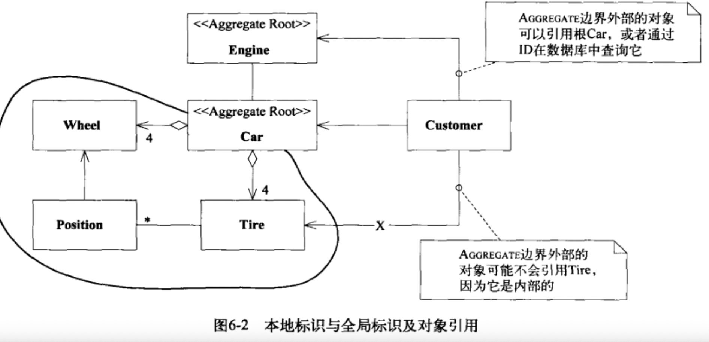
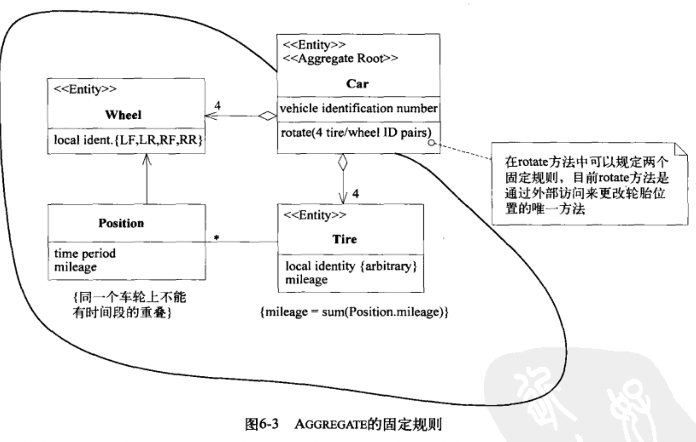

每个对象都有生命周期，一些临时对象的生命周期因为比较短，关联少，所以不是很复杂，但是长生命周期的对象的状态关联比较多，需要仔细考虑以便满足model-driven design。
主要的挑战有2个:
- 在整个生命周期中维护完整性
- 防止模型陷入管理生命周期复杂性造成的困境当中。
3种模式解决这个问题
- AGGREGATE: 通过定义清晰的所属关系与边界避免混乱的模型关系实现模型的内聚;
- FACTORY: 创建重建复杂对象与AGGREGATE，封装内部结构;
- REPOSITORY: 查找与检索持久化对象并封装庞大的基础设施.
# 6.1 模式：AGGREGATE
在具有复杂关联的模型中，要想保证对象更改的一致性是很难的，不仅互不关联的对象需要遵守一些固定的规则，紧密关联的对象的也要遵守一些固定规则，过于谨慎的锁定机制会导致多个用户之间毫无意义的互相干扰，使系统不可用。这些问题的根源在于模型定义缺乏明确的边界，领域对象需要划分并确定从属关系。下面是一个划分边界的模式
- 首先，我们需要一个抽象来封装模型中的引用，AGGREGATE就是一组相关对象的集合，它是数据修改的单元，是一个相关关联的对象的整体，每个AGGREGATE都有一个root与boundary，boundary边界定义AGGREGATE内都有什么，边界也就是构成整个对象的具体的组件的对象或者模块等，root是对象整体，也就是一个ENTITY，root是AGGREGATE唯一允许外部对象保持对AGGREGATE引用的元素，就是对外只报漏整体对象，边界对象可以互相引用并且具有内部标识。一个典型的模型的例子是汽车，汽车是一个聚合根，如下图所示

固定规则：数据变化时，必须保持不变的一致性规则，AGGREGATE内部的对象之间就是固定规则关系，AGGREGATE内部的规则不一定非要每时每刻都要求对象符合，比如事务的中间，对象处于中间态，或者是异步更新等，但是在事务处理完成后，AGGREGATE内对象状态要符合固定规则。下入时car的固定规则

为了实现AGGREGATE，所有的事务需要满足：
- 根具有全局标识，它最终负责检查固定规则;
- 根具有全局标识，边界内的ENTITY具有本地标识，这些标识只有在AGGREGATE内部才是唯一的。
- AGGREGATE外部的对象不能引用除root外的任何的内部对象，root可以boundary的引用传递给外部，但是只是临时使用，不能保持引用或者就是传递一个Value Object。
- 只有AGGREGATE的根才能直接通过数据库查询到，所有其他对象必须通过关联的遍历才能找到。
- 删除操作必须一次删除AGGREGATE边界内的所有对象;
- 当提交对AGGREGATE边界内部的任何对象的修改时，整个AGGREGATE内的所有的固定规则必须被满足.
root作为根，可以用来控制对边界内其他对象的所有访问，因为访问边界只能通过root，不能绕过root，这有利于确保AGGREGATE中的所有对象满足固定规则。
# 6.2 模式：FACTORY

