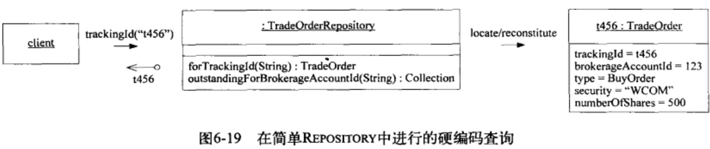
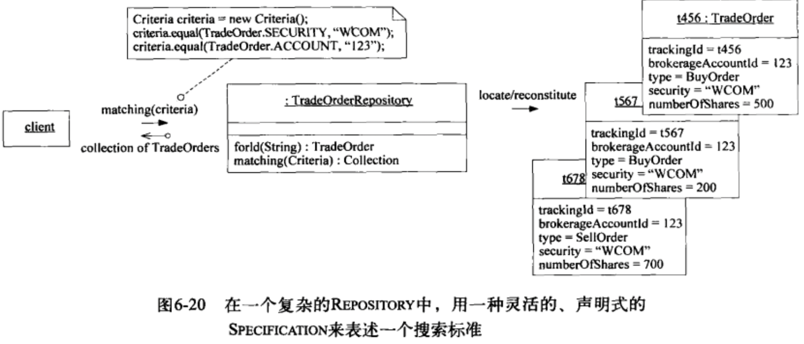
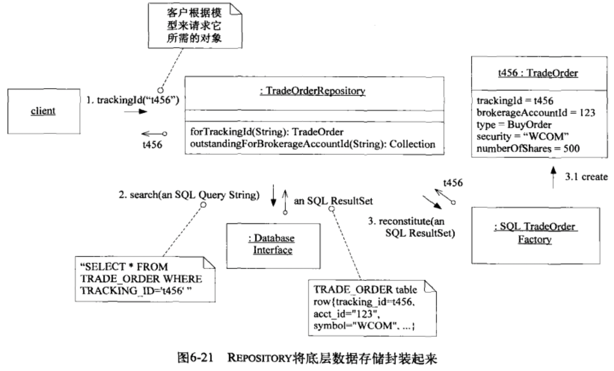
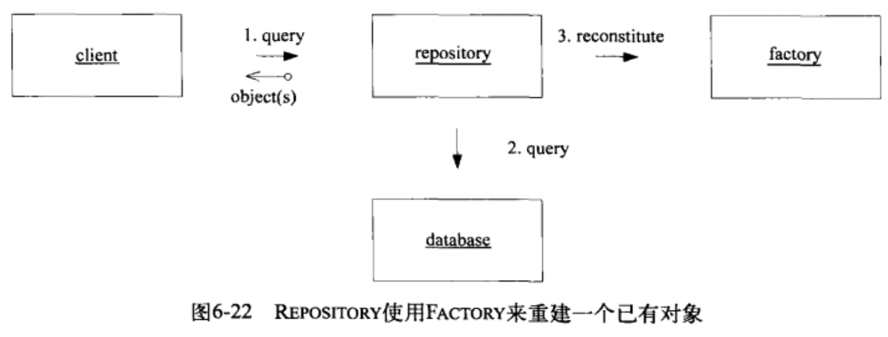

每个对象都有生命周期，一些临时对象的生命周期因为比较短，关联少，所以不是很复杂，但是长生命周期的对象的状态关联比较多，需要仔细考虑以便满足model-driven design。
主要的挑战有2个:
- 在整个生命周期中维护完整性
- 防止模型陷入管理生命周期复杂性造成的困境当中。
3种模式解决这个问题
- AGGREGATE: 通过定义清晰的所属关系与边界避免混乱的模型关系实现模型的内聚;
- FACTORY: 创建重建复杂对象与AGGREGATE，封装内部结构;
- REPOSITORY: 查找与检索持久化对象并封装庞大的基础设施.
# 6.1 模式：AGGREGATE
在具有复杂关联的模型中，要想保证对象更改的一致性是很难的，不仅互不关联的对象需要遵守一些固定的规则，紧密关联的对象的也要遵守一些固定规则，过于谨慎的锁定机制会导致多个用户之间毫无意义的互相干扰，使系统不可用。这些问题的根源在于模型定义缺乏明确的边界，领域对象需要划分并确定从属关系。下面是一个划分边界的模式
- 首先，我们需要一个抽象来封装模型中的引用，AGGREGATE就是一组相关对象的集合，它是数据修改的单元，是一个相关关联的对象的整体，每个AGGREGATE都有一个root与boundary，boundary边界定义AGGREGATE内都有什么，边界也就是构成整个对象的具体的组件的对象或者模块等，root是对象整体，也就是一个ENTITY，root是AGGREGATE唯一允许外部对象保持对AGGREGATE引用的元素，就是对外只报漏整体对象，边界对象可以互相引用并且具有内部标识。一个典型的模型的例子是汽车，汽车是一个聚合根，如下图所示

固定规则：数据变化时，必须保持不变的一致性规则，AGGREGATE内部的对象之间就是固定规则关系，AGGREGATE内部的规则不一定非要每时每刻都要求对象符合，比如事务的中间，对象处于中间态，或者是异步更新等，但是在事务处理完成后，AGGREGATE内对象状态要符合固定规则。下入时car的固定规则

为了实现AGGREGATE，所有的事务需要满足：
- 根具有全局标识，它最终负责检查固定规则;
- 根具有全局标识，边界内的ENTITY具有本地标识，这些标识只有在AGGREGATE内部才是唯一的。
- AGGREGATE外部的对象不能引用除root外的任何的内部对象，root可以boundary的引用传递给外部，但是只是临时使用，不能保持引用或者就是传递一个Value Object。
- 只有AGGREGATE的根才能直接通过数据库查询到，所有其他对象必须通过关联的遍历才能找到。
- 删除操作必须一次删除AGGREGATE边界内的所有对象;
- 当提交对AGGREGATE边界内部的任何对象的修改时，整个AGGREGATE内的所有的固定规则必须被满足.
root作为根，可以用来控制对边界内其他对象的所有访问，因为访问边界只能通过root，不能绕过root，这有利于确保AGGREGATE中的所有对象满足固定规则。
# 6.2 模式：FACTORY
对象承担很多职责，如果还负责自身的创建，则会指责过载，对象的创建与执行通常是分开的，就像汽车的装配与驾驶是分开的一样，2种操作放到一起是指责过载。
客户知道要完成的操作，并依靠领域对象执行必要的计算，如果将创建领域对象的职责交给客户，那么客户需要知道对象的内部结构与AGGREGATE的固定规则，结果就是领域对象的任何的修改，都要客户改动。重构变得困难。
对象的创建本身是一个主要操作，但是被创建的对象并不适合承担复杂的装配操作，客户负责会让客户的代码破坏装配对象与AGGREGATE的封装，导致客户与被创建对象产生过雨紧密的耦合。
复杂对象的创建是领域层的职责，这种职责不属于模型的对象，每种语言都提供了创建对象的机制，但还是需要更加抽象且不与其他对象发生耦合的构造机制。

FACTORY应该封装创建复杂对象与AGGREGATE的知识，它仅提供一个反映客户目标的接口，返回的是被创建对象的抽象视图。
应该将创建复杂对象的实例与呼和的职责交给一个单独的对象。
FACTORY的几种创建模式：
- factory method
- abstract factory
- builder
工厂需要满足2个基本需求：
- 每个创建方法都是原子的，被创建的对象的状态要满足固定规则，如果无法正确创建，需要抛出异常;
- 返回的结果应该是抽象的类型，不应该是具体类。
## 6.2.1 选择FACTORY及其应用位置
一般来说，FACTORY的作用是隐藏创建对象的细节，这些细节与AGGREGATE相关。
如果向一个AGGREGATE中添加元素，可以在root上创建FACTORY，把AGGREGATE的内部细节隐藏起来，root确保添加元素时的完整性。

另一个例子是，当一个对象的创建主要使用另一个对象的数据时，可以在后者的对象上创建FACTORY，这样不必将后者的信息提取到其他地方，

FACTORY与被创建的对象时紧密耦合的，当有些细节需要隐藏时，必须创建一个FACTORY或者SERVICE；整个AGGREGATE通常由一个独立的FACTORY来创建，FACTORY负责把根的引用传递出去，如果AGGREGATE的内部的某个对象需要一个FACTORY，FACTORY要么建立在聚合根上，要么是独立的，如下图

### 6.2.2 有些情况下只需使用构造函数
使用简单的公共的构造函数的场景：
- 没有多态;
- 客户关系的是实现, 直接依赖实现;
- 客户可以访问对象的所有的属性;
- 构造不复杂;
- 公共构造函数是原子的，符合固定规则.
不要在构造函数中调用其他类的构造函数，这种装配使用工厂更合适；
### 6.2.3 接口的设计
FACTORY的方法签名满足的规则
- 每个操作都必须是原子的，我们必须在与FACTORY的一次交互中把创建对象所需要的所有的信息传给FACTORY，不符合规则的直接抛出异常或者返回null。
- FACTORY将会与参数发生耦合，参数最好是较低设计层的参数或者是模型中与创建对象密切相关的对象。
### 6.2.4 固定规则的相关逻辑应放到那里？
放到FACTORY中，不要放到FACTRORY METHOD中。
### 6.2.5 Entity Factory与Value Object Factory
一个可变一个不可变，Value Object Factory构造出来的对象就是最终的形势，Entity只要满足规定规则就行了，其他细节可以之后添加，
### 6.2.6 重建已存储的对象
重建的Factory与创建的Factory有2个不同
- 不重新分配标识ID，标识ID是参数的的一部分;
- 当固定规则不满足时，重建Factory需要通过某种策略修复不一致的情况。

# 6.3 模式：REPOSITORY
对象无论执行什么操作，都必须要持有一个引用；大部分的对象存储在关系数据库中，所以可以通过对象的属性执行查询来找到对象，或是找到对象的组成部分然后重建它。使用已存储的数据创建实例的过程叫做重建，不能叫做新建，因为领域对象处于生命周期的中间而不是开始。
我们现在编写的程序的风格更类似于数据处理程序。过程式程序，要什么数据，取什么数据，然后做一些数据对象的对象的转换，这是丢失了领域规则的，领域知识可能在SQL中，可能在上层的应用层中。
客户需要一种有效的方式来获取对已存在的领域对象的引用，如果基础设施提供了这方面的便利，开发人员可能会增加很多可遍历的关联，这会使模型变的混乱，另一方面，开发人员可能使用查询从数据库中提取他们所需的数据，或是直接提取所需要的具体的对象，而不是通过AGGREGATE来得到这些对象，这样就导致领域逻辑进入进入查询与客户代码中，而ENTITY与VALUE OBJECT则变成单纯的数据容器，技术复杂性会使得客户代码变得混乱，导致开发人员简化领域层，最终模型变得无关紧要。
需要找到一种方法，明确的将模型作为焦点，其中重要的就是除了通过根来遍历查找对象这种方法外，禁止用其他方法对AGGREGATE内部的任何对象进行访问。
在所有的持久化对象中，有一小部分必须通过基于对象属性的搜索来全局访问，当很难通过遍历的方式来访问某些AGGREGATE根的时候，就需要使用这种访问方式，他们通常是ENTITY，有时候时具有复杂内部结构的Value Object，还可能是枚举VALUE，而其他对象不宜使用这种访问方式，随意的数据库查询会破坏领域对象的封装和AGGREGATE。
REPOSITORY将某种类型的所有的对象表示为一个集合，它的行为类似于集合，具有复杂的查询功能，与操作集合的功能，底层的实现是对数据库的操作。
REPOSITORY是封装底层存储的一种呢概念，对于模型来说它是一种抽象，对象集合的抽象。
REPO的优点:
- 为客户提供了一个简单的模型，用来获取持久化对象并管理生命周期;
- 使应用程序领域设计与持久化技术（多种数据库策略甚至多个数据源）解耦;
- 体现了有关对象访问的设计决策;
- 很容易将他们替换为芽实现，以便在测试中使用。
### 6.3.1 REPO的查询
查询接口的设计：
- 硬编码实现具有特定参数的查询，如下图

- 使用支持灵活参数的框架，比如基于SPECIFICATION，如下图

### 6.3.2 客户可以忽略REPO的实现，开发人员不能
开发人员要了解REPO封装背后的实现，因为不了解，接口设计可能会不合理或者遇到性能问题。
### 6.3.3 REPO的实现
将存储、检索、查询机制封装起来是REPO的最基本的特性，REPO会委托基础设施服务来完成工作，下图：

- 对类型进行抽象；
- 充分利用与客户解耦的优点;
- 将事务的控制权留给客户;
### 6.3.4 在框架内工作
### 6.3.5 REPO与FACTORY的关系
REPO也可以委托FACTORY来创建一个对象，如下图

## 6.4 为关系数据库设计对象
简单的对应关系就是最好的，表中的一行应该包含一个对象，也可能包含AGGREGATE中的一些附属项，表中的外健应该转化为对另一个ENTITY对象的引用，
