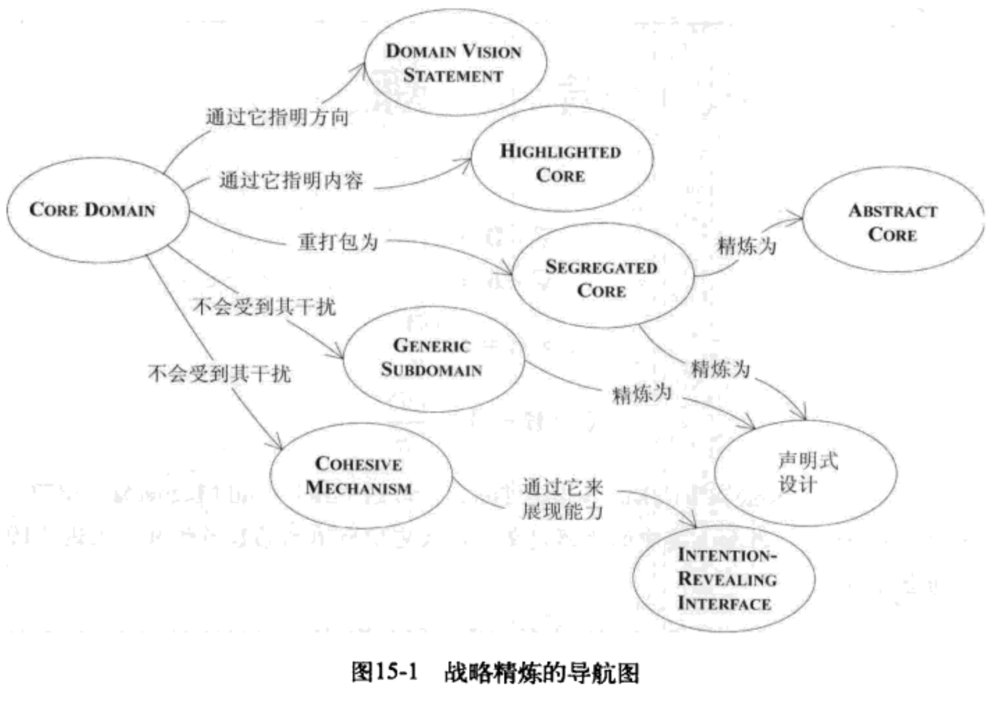

专注于核心问题的一种的方法是使用Layered Architecture，这种架构可以把领域概念从技术逻辑中分离出来；精炼是把一堆混杂在一起的组件分开的过程，以便通过某种形式从中提取出最重要的内容，使得得到的结果更有价值也更有用，模型就是知识的精炼，通过每次重构所得到的更深层的理解，得以把关键的领域知识与优先级提取出来。精炼的主要动机是把最有价值的部分那部分提取出来，正是这个部分使我们的软件区别与其他软件并让整个软件的构建物有所值，这个部分就是CORE DOMAIN。领域模型的战略精炼包含一下部分:
- 帮助团队的所有成员掌握系统的总体设计以及各部分如何协调工作;
- 找到一个具有适度规模的核心模型，并把它添加到通用语言中，促进沟通;
- 指导重构;
- 专注于模型中最有价值的那部分;
- 指导外包、现成组件的使用以及任务委派;

# 15.1 模式：CORE DMAIN
大型系统有很多组成部分，这导致最核心的业务模型往往不够突出甚至被掩盖忽略，难以理解的系统修改起来会很难，而结果也很难预料；开发人员可能不熟悉当前的模块或者开发人员只了解一个模块的内容而不了解全局，这种壁垒导致系统很难平滑的集成，也不好灵活分配工作，功能可能会实现多次，使系统变得更加复杂。
大型系统中不可能对所有设计部分呢精化，必须分出优先级，为了使领域模型称为有价值的资产，必须整齐的梳理出模型的真正的核心，并根据这个核心创建应用程序的功能。
高水平开发人员往往只关注于技术基础设置或是一些通用的技术问题上。而真正体现应用程序价值的领域核心确是有水平稍差的开发人员完成的，如果模型很差，不论技术基础设施建设的有多好，应用程序不能为用户提供更好的功能。
在制定项目规划的时候，必须把资源分配给模型与设计中最关键的部分，在规划与开发期间，每个人都必须识别与理解这些关键部分。这些部分就是CORE DOMAIN。对模型进行精炼，找到CORE DOMAIN并把它与起辅助作用的模块与代码分开，最有价值和最专业的概念要轮廓分明，尽量压缩CORE DOMAIN。让最有才能的人来开发CORE DOMAIN。在CORE DOMAIN中努力开发能够确保实现系统蓝图的深层模型与柔性设计，仔细判断任何其他部分的投入，看它是否能够支持这个提炼出来的CORE。当必须在2个看起来都很有用的重构之间进行抉择时，应该首选对CORE DOMAIN影响最大的那个重构。
- 选择核心，需要关注能够表示业务领域并解决业务问题的模型部分，CORE DOMAIN的选择取决于看问题的角度；
- 工作中的分配，需要存在一个最有能力的开发人员来开发CORE DOMAIN。聘请短期的专业人员来开发CORE DOMAIN是不行的，会造成知识的流失，购买CORE DOMAIN也是行不通的，自主开发的软件的最大价值就是对CORE DOMAIN的完全控制，使用框架可以节省开发更通用部分的时间，因为框架做了，可以专注于CORE，但是框架必然有某些限制；
    - 如果限制太多，应该把框架从CORE DOMMAIN中剥离;
    - '
## 15.2 精炼的逐步提升
各种精炼技术在使用顺序上没有要求，对设计的改动是不同的。
## 15.3 模式：Generic Subdomain
模型中有些部分除了增加复杂性外没有捕捉或者传递专门的知识，任何外来的因素都会使CORE DOMAIN难以分辨与理解，模型中充斥着大量众所周知的一般原则，或者是专门的细节，这些细节并不是我们主要的关注点，只是起到支持作用，无论它们是多么通用的元素，对实现系统功能与充分表达模型都是必要的。识别出那些与项目意图无关的内聚子领域，把这些子领域的通用模型提取出来，并放到单独的MODULE中，任何专有的东西都不应该放在这些模块中。把它们分离出来以后，在继续开发的过程中，它们的优先级应低于CORE DOMAIN的优先级，并可不要分派核心开发人员来完成这些任务（因为他们很少能够从这些任务中获得领域知识）。还可以考虑为这些GENERIC SUBDOMAIN使用现成的解决方案或者公开发布的模型。开发这样的软件包时，有以下几种选择:
1. 现成的解决方案，使用开源代码或者购买现成的方案
优点:
- 减少代码开发;
- 维护负担转移到外部;
- 比自己开发的代码更可靠，更完备;
缺点:
- 使用之前需要花时间评估理解;
- 无法保证正确性与稳定性;
- 包含的内容远远多于自己需要;
- 集成不方便;
- 可能会引入对平台、编译器版本的依赖等。
Generic Subdomain通常打包为框架的形式，实现了非常抽象的模型，可以与应用程序集成满足特殊需求，越通用，则模型的精炼程度越高，用处就越大;
2. 公开发布的设计或模型
优点: 
- 比自己开发的模型更成熟，反映了很多人的深层知识;
- 提供了随时可用的高质量文档
缺点:
- 可能不符合需要或者超出需要的范围
领域中已经存在好的模型，那么就使用它，因为它是被广泛接受的，不需要专门的培训；或者如果只是已存在模型的一部分符合我们的需要也可以直接使用，不要自己实现，因为比较成熟，也有文档。
3. 把实现外包出去
优点:
- 核心团队处理CORE DOMAIN，那是最需要经验与知识的部分;
- 可以维持较小的团队规模，保证CORE DOMAIN的知识不会发散;
- 面向接口的设计有助于保持子领域的通用性，并定义为规格;
缺点:
- 多了一些沟通，需要核心开发人员与外包商定接口等一些信息;
- 交付时，要花时间来理解外包写的代码;
- 代码质量无法掌握;
自动测试或者单元测试有助于确保交付的代码的质量并且再集成方便。
4. 内部实现
优点:
- 易于集成;
- 只开发自己需要的，不做多余的工作;
- 可以临时把工作分出去;
缺点:
- 需要花时间维护与培训使用;
- 开发这些需要时间或者其他成本

CORE模型会变得越来越小，通用模型会作为框架或者公开发布的模型或者分析模式而变得越来越多，大部分模型需要自己开发，但是与CORE DOMAIN分区开很有价值.
### 通用不等于可重用
子领域要保持通用性，不要关注可重用性，因为原则就是把精力放在CORE上，只需要把业务所需要的那部分建模出来并实现，只投入必要的精力就可以了。可能会重用，但是没必要关注。通用子领域的设计必须严格限定在通用概念的范围之内，不要引入行业专用的模型元素，这会限制通用子领域的扩展而且行业专用模型比通用子领域模型更有价值。
### 项目风险管理
敏捷过程建立一个初始的模型+外围通用子领域构成的整体系统，这可能是为了验证技术架构，这种方式不利于风险管理，很容易低估领域建模的风险，未预料到存在的复杂性、存在理解偏差或者关键技术欠缺等。除非团队拥有精湛的技术或者对领域非常熟悉，否则第一个雏形系统应该以CORE DOMAIN的某个部分作为基础，不管它有多么简单。
## 15.4 模式: Domain Vision Statement
在项目的开始阶段，模型并不存在，模型可能包含了多个Bounded Context，而开始开发阶段对系统的价值是清楚的，Domain Vision Statement一个重点关注领域模型的文档，是对CORE DOMAIN的简短的描述以及它将会创在的价值，不需要写那些领域模型与其他领域模型一样或者相同的方面，只写独特的方面，展示出领域模型是如何均衡各方利益的，随着新的理解修改它，团队中的所有人员都可以参与修改。它作为一个指南，管理人员根据它来分配资源或者培训，开发人员用于精炼模型与代码.
## 15.5 模式: Highlighted Core

