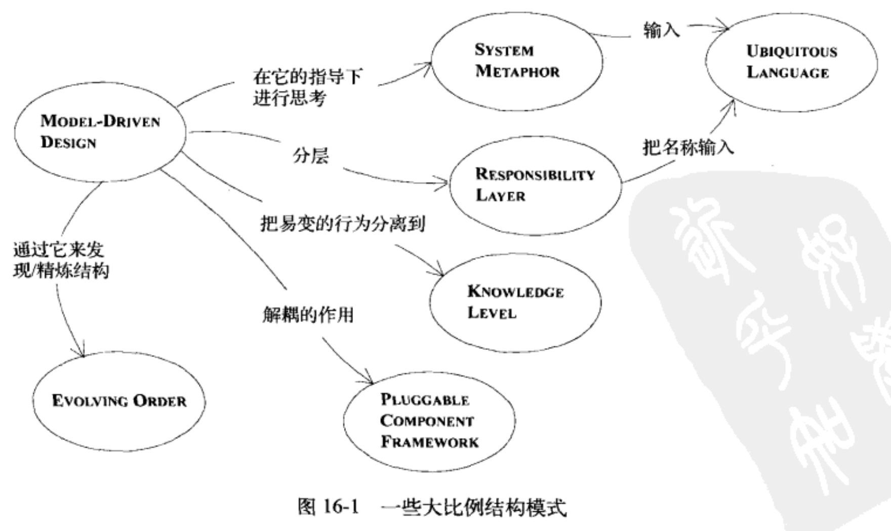

在一个大的系统中，如果因为缺少一种全局性的原则而使人们无法根据元素在模式中的角色来解释这些元素，那么开发人员就会陷入只见树木不见森林的境地，需要理解各个部分在整体中的角色不必去深究细节，大型结构是一种语言，人们可以用它来从大局上讨论与理解系统，用一组高级概念或规则来为整个系统的设计建立一种模式，这种组织元素能指导设计与理解设计，能够协调不同人员工作，提供共享视图让人们知道各个部分在整体中的角色。
设计一种应用于整个系统的规则（角色或者关系）模式，使人们可以通过它在一定程度上了解各个部分在整体中所处的位置(即使在不知道各个部分的详细职责的情况下)。

## 16.1 模式: Evolving Order
为了避免设计结构混乱，项目通过架构约束开发，但是架构有限制，这些限制可能阻碍一些良好的实现或者对解决特定问题有阻碍，不够灵活，随着需求的变更与理解的深入，可能架构的阻碍会越来越大。一个没有任何规则的随意设计会产生一些无法理解整体含义且很难维护的系统，架构中早期的设计假设会使项目变得束手束脚，开发人员要为适应结构在开发应用程序上妥协要么就要推翻架构又回到没有协调的开发老路上来。让这种概念上的大型结构随着应用程序一起演变，甚至可以变成一种完全不同的结构风格，不要依次过分限制详细的设计与模型决策，这些决策和模型决策必须在掌握了详细知识后才能确定。全局规则的设计要考虑模型的整体，也要考虑某些组件的灵活需求，最好折中处理，大型结构通常需要跨越Bounded Context来使用，2