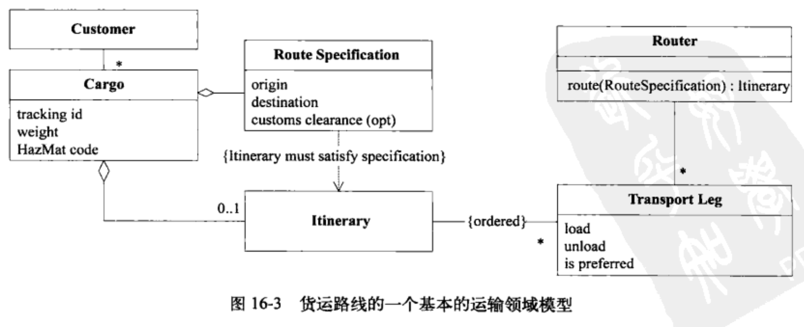
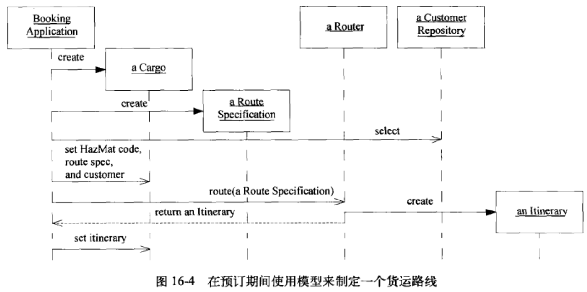
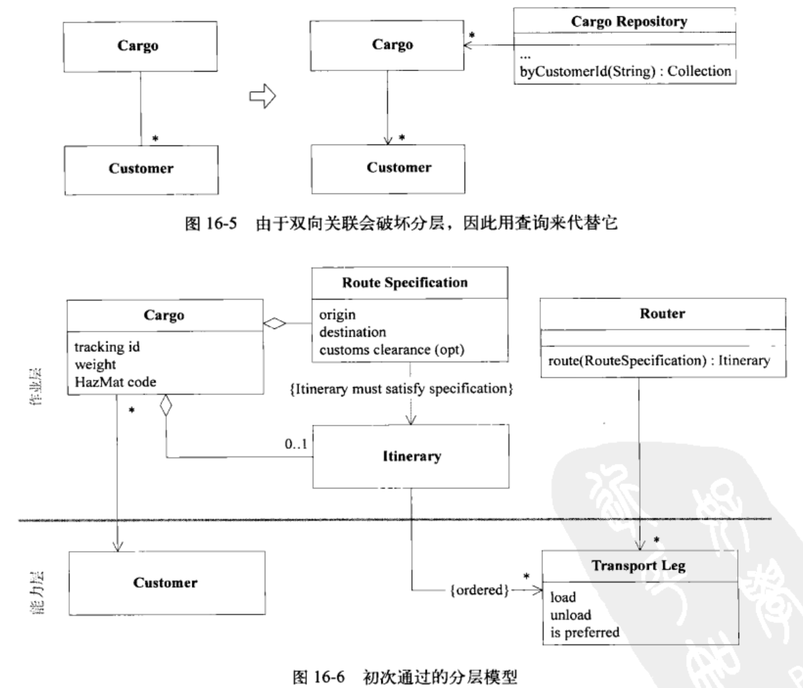
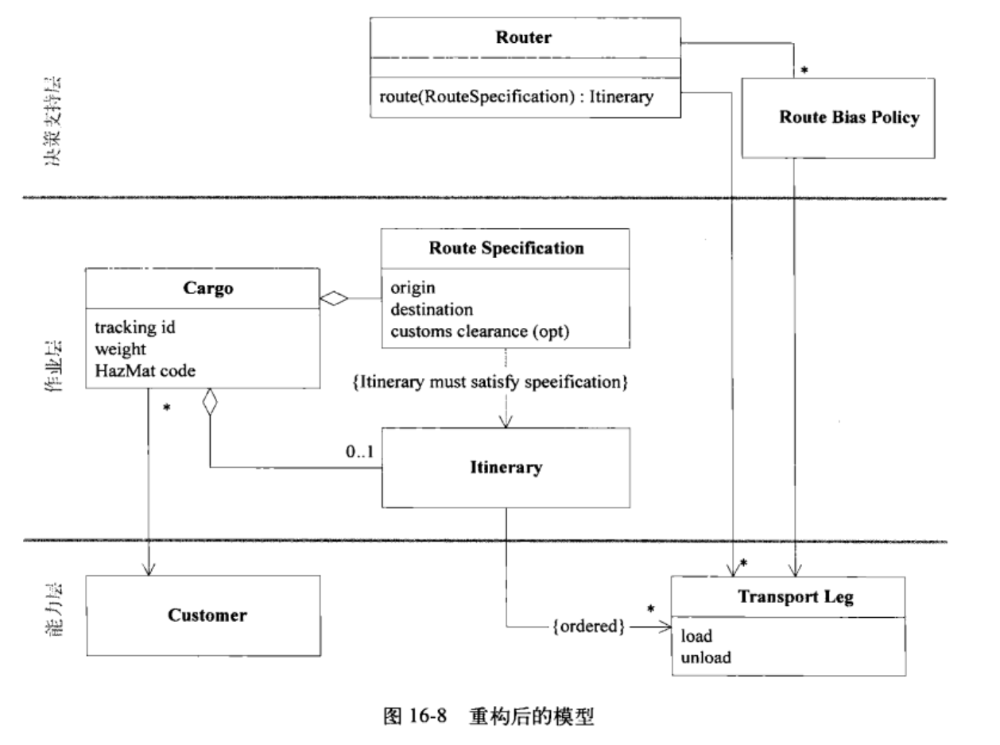
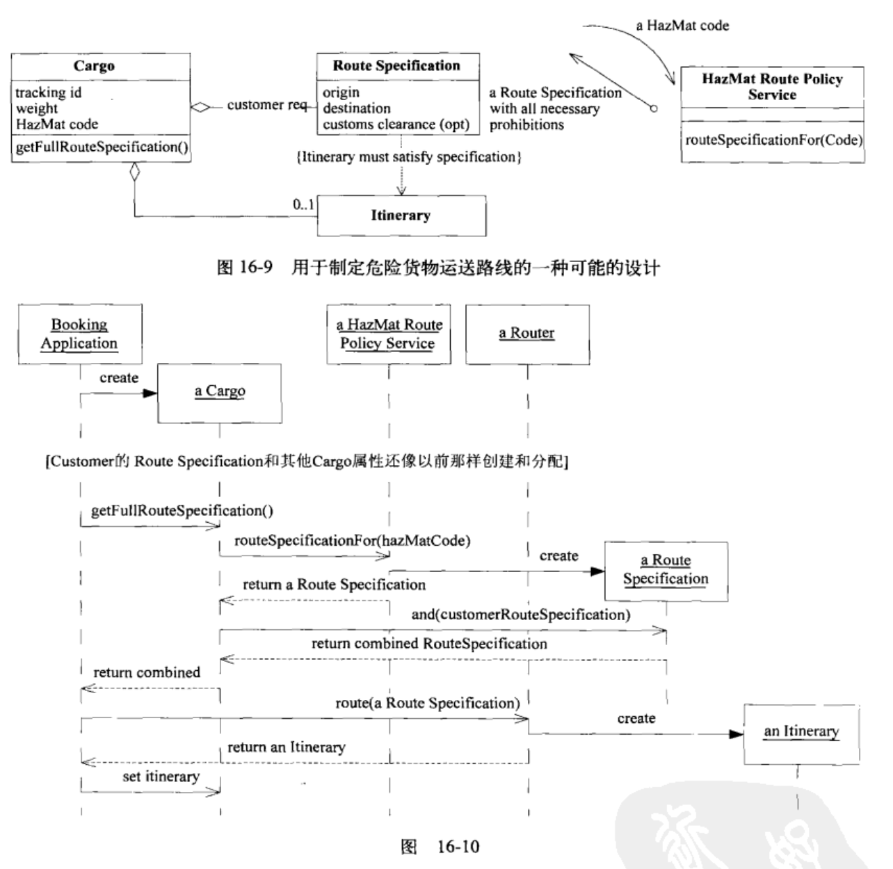
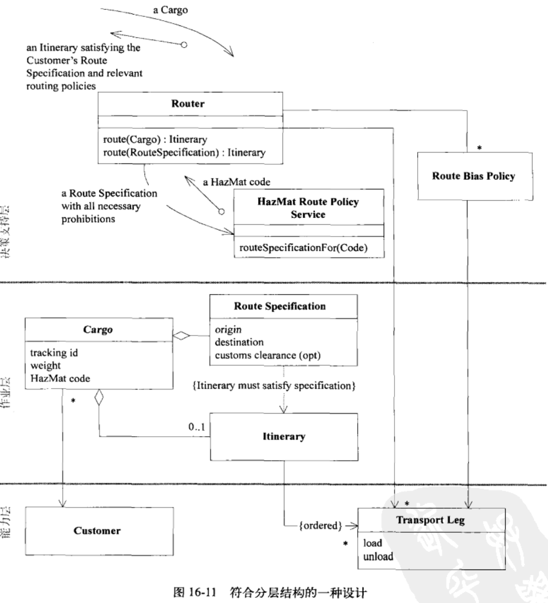
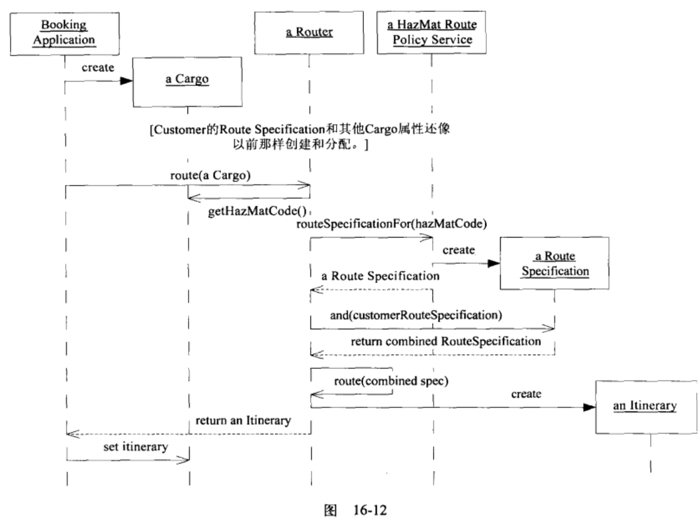
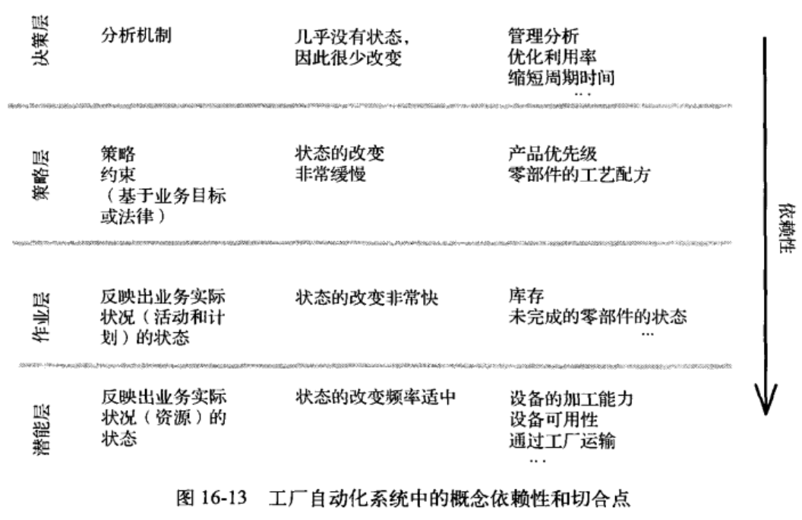

在一个大的系统中，如果因为缺少一种全局性的原则而使人们无法根据元素在模式中的角色来解释这些元素，那么开发人员就会陷入只见树木不见森林的境地，需要理解各个部分在整体中的角色不必去深究细节，大型结构是一种语言，人们可以用它来从大局上讨论与理解系统，用一组高级概念或规则来为整个系统的设计建立一种模式，这种组织元素能指导设计与理解设计，能够协调不同人员工作，提供共享视图让人们知道各个部分在整体中的角色。
设计一种应用于整个系统的规则（角色或者关系）模式，使人们可以通过它在一定程度上了解各个部分在整体中所处的位置(即使在不知道各个部分的详细职责的情况下)。

## 16.1 模式: Evolving Order
为了避免设计结构混乱，项目通过架构约束开发，但是架构有限制，这些限制可能阻碍一些良好的实现或者对解决特定问题有阻碍，不够灵活，随着需求的变更与理解的深入，可能架构的阻碍会越来越大。一个没有任何规则的随意设计会产生一些无法理解整体含义且很难维护的系统，架构中早期的设计假设会使项目变得束手束脚，开发人员要为适应结构在开发应用程序上妥协要么就要推翻架构又回到没有协调的开发老路上来。让这种概念上的大型结构随着应用程序一起演变，甚至可以变成一种完全不同的结构风格，不要依次过分限制详细的设计与模型决策，这些决策和模型决策必须在掌握了详细知识后才能确定。全局规则的设计要考虑模型的整体，也要考虑某些组件的灵活需求，最好折中处理，大型结构通常需要跨越Bounded Context来使用，必须适应开发过程中的实际约束，当发现一种大型结构可以明显使系统变得更清晰，而又没有对模型开发施加一些不自然的约束时，就应该采用这种结构，使用不合适的结构还不如不使用它，不要为了追求设计的完整性而勉强去使用一种结构，应该找到尽可能精简的方式解决所出现问题。
## 16.2 模式: System Metaphor
隐喻思维在软件开发中很普遍，比如防火墙就是一种隐喻，引来保护局域网略免受外部攻击，隐喻可以穿搭设计的中心主题，在团队的所有成员中形成共同理解，当系统的一个具体类比正好符合团队成员对系统的想象，并且能够引导它们向着一个有用的方向思考时，就应该把这个类比作为一种大型结构，围绕这个隐喻来组织设计，隐喻应该能促进系统的交流，指导系统的开发，增加系统不同部分之间的一致性。
## 16.3 模式: Responsibility layer
职责驱动的设计在更大的规模上也是适用的。分层是最成功的架构设计模式之一，分层就是对系统划分，每个层的元素只知道或者能使用它下面的层的服务，不知道上面层而且与上面层保持独立。在一个具有自然层次结构的模型中，可以围绕主要职责进行概念上分层，可以把分层与职责驱动的设计的2个原则结合起来使用。分层模式有一种变体最适合按职责来分层，这种变体为Relaxed Layered System（松散分层系统），这种分层方式某一层中的组件可以访问任何比它低的层，而不仅限于只能访问直接与它相邻的下一层。
注意观察模型中的概念依赖性，以及领域中不同部分的变化频率和变化的原因，如果在领域中发现了自然的层次结构，就把它们转换为宽泛的抽象职责，这些职责应该描述系统的高层目的与设计，对模型进行重构，使得每个领域对象、Aggregate、Module的职责都清晰的位于一个职责层中。
货运应用程序的领域模型

货运模型的自然的层次结构：作业层与作业基础层
- 作业层：公司的活动都是作业层，Cargo、Route Specification、Itinerary;
- 作业基础层: 执行作业时所能利用的资源，

要找到一种适当的Responsibility layer活着大比例结构，需要理解问题领域并反复进行实验，下面是分层时要注意的事项:
- 场景描述，层应该能够表达出领域的基本现实或者优先级，选择一种大比例结构与其说是一种技术决策，不如说是一种业务建模决策，层应该显示出业务的优先级;
- 概念依赖性，较高层概念的意义应该依赖较低层，而底层概念的意义应该独立于较高的层;
- Conceptual Contour:允许变化；
在一系列领域中，有些层是固定的:
- 潜能层，我们能够做什么，不关系打算做什么？
- 作业层，我们正在做什么？
- 决策支持层，应该采取什么行动或者制定什么策略？这个层是用来做出分析与制定决策的，它根据来自较低层的信息进行分析；
- 策略层，规则与目标是什么？

## 16.4 模式: Knowledge level知识要素层
