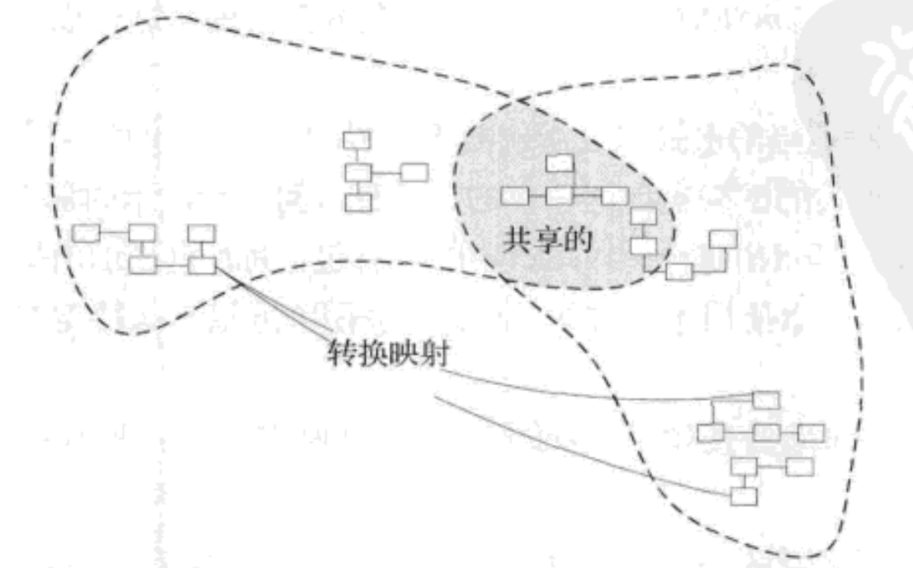

模型最基本的要求是它应该保持内部一致，术语总具有相同的意义，不包含相互矛盾的规则，大型系统中无法保持这种统一，完全统一不可行，因为大型系统必须分模块开发。要保持模型关键部分的高度统一。
无法维护一个涵盖整个企业的统一模型，就要确定什么统一，什么不统一。统一的部分保持一致，不统一的部分不会混乱或者破坏模型。需要一种方式来标记不同模型之间的边界与关系，bounded context定义了每个模型的应用范围，context map定义了上下文与关系的总图，下图是模型完整性模式的导航图

# 14.1 模式：bounded context
模型如果在不同的上下文中，就没有关联，是最简单的情况。但是想要复用模型的一部分工作时，会遇到问题比如，复用的边界在哪里？任何大型项目都会存在多个模型，而当基于不同模型的代码被组合到一起后，软件就会出现BUG、变得不可靠与难以理解，团队成员之间的沟通变得混乱，人们往往弄不清楚一个模型应该在哪个上下文中使用。一个模型只在一个上下文中使用，上下文可以是任何东西，比如代码、或者某个团队的工作，或者一次头脑风暴得到的模型的上下文就是头脑风暴讨论，模型只有在上下文中才有意义，上下文是模型的前提条件。明确的定义模型所应用的上下文也就是设置模型的边界，在这些边界中严格保持模型的一致性，而不要受到边界之外的问题的干扰与混淆。bounded context明确限定了模型的应用范围，以便让团队对什么应该保持一致以及上下文之间如何关联有一个明确和共同的理解，在context中，要保证模型在逻辑上统一，而不用考虑它是不是适用于边界之外的情况，在其他Context中，会使用其他模型。通过划定明确的边界，可以使模型保持纯粹，因而在它所适用的context中更有效，
# 14.2 Continuous Integration
当很多人在同一个Bounded Context中工作时，模型很容易发生分裂，团队越大，问题就越大，如果将系统分解为更小的Context，最终又难以保持集成度和一致性。有时开发人员没有完全理解其他人所创建的对象或者交互的意图，就对它进行了修改，使其失去了原来的作用，有时他们没有意识到他们正在开发的概念已经在模型的另一个部分中实现了，而导致了概念与行为重复，有时他们意识到了已经有了实现，却担心破坏现有功能而不敢去改动它，于是重复开发这些概念与功能。
Continuous Integration是指把一个上下文中的所有工作足够频繁地合并到一起，并使他们保持一致，以便当模型发生分裂时，可以迅速发现并纠正问题，有2个级别:
- 模型概念的集成;
- 实现的集成;
建立一个把所有代码与其他实现工件频繁的合并到一起的过程，并通过自动化测试来快速查明模型的分裂问题，严格坚持使用Ubiquitous Language，以便在不同人的头脑中演变出不同的概念时，使所有人对模型都能达成一致。
# 14.3 模式：Context Map
其他团队中的人员并不是十分清楚Context的边界，他们会不知不觉地做出一些更改，从而使边界变得迷糊，或者使互联变得复杂，当不同的上下文必须互相连接时，它们可能会相互重叠。限界上下文之间的代码重用是很危险的，应该避免，功能与数据的集成必须要通过转换去实现，通过定义不同上下文之间的关系，并在项目中创建一个所有模型上下文的全局视图，可以减少混乱。
识别在项目中起作用的每个模型，并定义其限界上下文，这包括非面向对象子系统的隐含模型，为每个限界上下文命名，把名称添加到Ubiquitous Language中，描述模型之间的连接点，明确所有通信需要的转换，并突出任何共享的内容。根据设计问题与项目组织问题的不同，限界上下文之间的关系有很多种形式，明确的Contextmap的画出是逐渐进行的，先找到一个比较接近的关系模式，找到那些特别明显违反模式的问题，修复，再观察，再修复。最终明确.
限界上下文应该有名称，以便可以讨论他们，这些名称应该被添加到团队的统一语言中，每个人都应该知道边界在哪里，应该能够分辨出任何代码段的Context，或任何情况的Context，比如通过Module的方式隔离Context，或者图、或者文本。
# 14.4 限界上下文之间的关系
模型之间的关系可以为组织开发工作设定目标并且可以为描述现有组织提供术语。
# 14.5 模式：Shared Kernel(共享内核)

当开发团队开发一些紧密相关的应用程序时，如果团队之间不进行协调，即使短时间内能够快速取得进展，但他们开发出的产品可能无法结合到一起，就是不方便集成，最后可能不得不耗费大量精力在转换层上，并且频繁的进行改动，不如一开始就使用Continuous Integration那么省心省力，同时也造成重复工作。从领域模型中选出2个团队都同意共享的一个子集，当然，除了这个模型子集以外，还包括与该模型部分相关的代码子集，或数据库设计的子集，这部分明确共享的内容具有特殊地位，一个团队在没有与另一个团队商量的情况下不应擅自更改它。
# 14.6 模式: Customer/Supplier Development Team
遇到服务依赖的问题，下游服务依赖上游服务，并且是不同的Context开发的，属于独立进行，如果下游团队对变更具有否决权，或请求变更的程序太复杂，那么上游团队的开发自由度就会受到限制，由于担心破坏下游系统，上游团队甚至会受到抑制，同时，由于上游团队掌握优先权，下游团队有时也会无能为力。最主要的就是上游更改时要下游的人员参与。在2个团队之间建立一种明确的客户/供应商关系，在计划会议中，下游团队相当于上游团队的客户，根据下游团队的需求来协商需要执行的任务并为这些任务做预算，以便每个人都知道双方的约定与进度，2个团队共同开发自动化验收测试，用来验证预期的接口，把这些测试添加到上有团队的测试套件中，以便作为持续集成的一部分来运行，这些测试使得上游团队在做出修改时，不必担心对下游团队产生副作用。这种模式有2个关键要素:
- 必须是客户供应商关系，就是客户提出要求，供应商要满足要求，如果多个客户，那么就平衡要求;
- 必须有自动测试套件，变更时不会相互影响。
# 14.7 模式: Conformist
当不能建立供应商/客户关系时，下游团队无能为力，只能靠自己，一种方案是放弃上游自力更生，但是如果上游价值较大，不允许放弃，如果上游很难用，需要开发转换层，转换成自己的模型，如果上游的模型与当前你的模型比较匹配，那么不要自力更生或者不需要写转换层，而是使用跟随者（conformist）模式；这样可以极大的简化集成。
# 14.8 模式: Anticorruption Layer
当正在构建的新系统与另一个系统的接口很大时，为了克服连接2个模型而带来的困难，新模型所表达的意图可能会被完全改变，最终导致它被修改得像是另一个系统的模型了，遗留系统的模型通常很弱，即使对于那些模型开发得很好的例外情况，它们可能也不符合当前项目的需要，集成遗留系统仍然具有很大的价值。
创建一个隔离层，以便根据客户自己的领域模型来为客户提供相关功能，这个层通过另一个系统现有接口与其进行对话，而只需对那个系统做出很少的修改，甚至无需修改，在内部，这个层在2个模型之间进行必要的双向转换。
- 设计Anticorruption Layer的接口，以service的形式提供，其实就是对另一个系统的抽象，抽象的定义要按照我们系统的模型来定义;
- 实现Anticorruption Layer，通过FACADE、ADAPTER与转换器以及底层的通信与传输实现Anticorruption Layer；对大而复杂，接口混乱的系统集成使用FACADE模式就能解决，ADAPTER用于转换2边的语义，每个Service都需要一个实现的接口的ADAPTER。

子系统之间的通信可以在FACADE与子系统之间、ADPATER与FACADE之间、当前系统与ADAPTER之间，这取决于把Anticorruption Layer的组件放在哪，被集成的子系统如果可以，就进行可能的重构来方便集成；如果集成的内容比较多，那么当前系统可以选择做出一些改变，使接近外部系统的模型，或者极端情况选择跟随者模型。
# 14.9 模式：Separate Way
集成有时代价高昂，而有时获益很小。如果2个功能部分不互相调用对方的功能，或者对象并不交互，或者不共享数据，那么集成可能是没必要的。声明一个与其他上下文毫无关联的Bounded Context，使开发人员能够在这个范围内找到简单专用的解决方案。
# 14.10 模式: Open Host Service
当一个子系统必须与大量其他系统进行集成时，为每个集成都定制一个转换层可能会减慢团队的工作速度，需要维护的东西越来越多，而且修改的时候担心的事情也会越来越多，团队可能在做着同样的事情，如果一个子系统有某种内聚性，那么或许可以把它描述为一组Service，这组Service满足了其他子系统的公共需求，需要定义一个协议，把你的子系统作为一组Service供其他系统访问，开放这个协议，以便所有需要与你的子系统集成的人都可以使用它，当有新的集成需求时，就增强并扩展这个协议，但个别团队的特殊需求除外，满足这种特殊需求的方法是使用一次性的转换器来扩充协议，以便使共享协议简单且内聚。
# 14.11 模式：Published Language
2个限界上下文之间的模型转换需要一种公共的语言。一种解决办法时，把旧的模型转换为新的模型，因为总是认为新的模型是更好的。还有一种情况就是2种业务模型无法方便的转换，这时需要数据交换语言，这种数据交互语言已经充分的文档化，比如XML。
# 14.12 大象的统一
如果不需要集成，模型统不统一不重要，下图是6个盲人认识到的大象的模型

统一多个模型总是意味着创建一个新模型

经过讨论，可能认识到他们正在对一个更大整体的不同部分进行描述与建模，部分-整体的集成只要完成各个部分的连接就可以了，如下图

持续精化以及新的需求会促成更深层次的模型理解。

去除模型中那些偶然或不正确的方面并创建新的概念。
## 14.13 选择你的模型上下文策略
- 团队决策或更高层决策，团队必须决定在哪里定义限界上下文，以及它们之间有什么样的关系。整个团队要有一致的理解，在决定是否扩展或者分拆限界上下文应该权衡团队独立工作的价值以及能产生直接且丰富集成的价值，作为决策依据;
- 置身上下文中，开发者本身就是所处理的Context中的一部分;
- 转换边界，在决定Bounded Context的边界时，需要考虑下面的因素：
    - 首选较大的Bounded Context
        - 用一个统一模型来处理多任务时，任务之间的流动更顺畅;
        - 一个内聚模型比2个不同模型再加他们之间的映射更容易理解;
        - 2个模型之间的转换可能会很难;
        - 共享语言可以使团队沟通起来更清楚.
    - 首选较小的Bounded Context
        - 开发人员的沟通开销减少了;
        - 由于团队和代码规模较小，持续集成更容易了;
        - 可以满足一些特殊需求。
在不同的Bounded Context之间进行深度功能集成是不切实际的。
- 接受那些我们无法更改的事物：描述外部系统,保持谨慎;
- 与外部系统的关系，不需要外部项目，就绝不集成，因为会带来负担；如果一定要集成，可以选择Conformist与Anticorruption Layer模式；
- 设计中系统，正在构建的软件就是设计中的系统；
- 用不同模型满足特殊需要；
- 部署;
- 权衡；
- 当项目正在进行时，
## 14.14 转换
Bounded Context的决策并不是一成不变的。
- 合并Context：Separate Way->Shared Kernel， 合并Bounded Context的动机很多：翻译开销过高、重复现象明显。即使最终目标是完全合并成一个持续集成的Context，也应该先过渡到Shared Kernel。
    - 评估初始状况，确保2个Context确实需要统一;
    - 建立合并过程，需要决定代码的共享方式以及模块应该采用哪种命名约定，Shared Kernel的代码至少每周要集成一次，必须有一个测试套件；
    - 选择某个小的子领域作为开始。

        合并的方法有3种：
        - 基于一个模型重构另一模型；
        - 一次选择一部分共同的子领域，同时修改2个模型;
        - 找到一个新的模型，能够承担2个模型的功能
    - 抽取2个团队的开发人员，共同开发相同的子领域；
    - 实现模型，如果遇到困难，从选择某个小的子领域作为开始重新组织；
    - 每个团队的开发人员都承担与心的Shared kernel集成的任务;
    - 清除那些不再需要的翻译.
    如果专用术语不同，不能简单的作为相同的子领域，除非能够有一个模型能cover这种多个术语的情况，Shared Kernel的优点是具有持续集成的部分优势又保留了Separate Way模式的优点，
- 合并Context：Shared Kernel->Continuous Integration，这个过程意味着团队结构的改变。
    - 确保每个团队都建立了持续集成所需的所有的过程;
    - 团队成员在团队之间流动;
    - 澄清每个模型的精髓;
    - 核心领域合并到Shared Kernel中，要快，因为这里易出错；
    - SK增长，集成频率提高;
    - 当Shared kernel逐渐把先前的2个限界上下文的所有的内容都包括进来的时候，要么形成了一个大的团队，要么形成了2个较小的团队，这2个小的团队共享一个持续集成的代码库，而且成员可以2队之间来回流动。
- 逐步淘汰遗留系统，遗留系统可以逐步淘汰，需要使用一个新的系统与一个Anticorruption Layer。首先确定测试策略，任何一次迭代中：
    - 确定遗留系统的哪一部分可以被添加到新系统中;
    - 确定需要在AnticorruptionLayer中添加的功能;
    - 实现;
    - 部署;
- Open Host Service-> Published Language, Published Language规范系统之间的关系，
    - 如果有一种行业标准语言可用，则尽可能评估并使用它;
    - 如果没有，那么完善CORE DOMAIN;
    - 使用CORE DOMAIN作为交换语言的基础;
    - 想所有参与合作的各方发布新语言;
    - 为每个协作系统构建转换层;
    - 切换.

项目领导者应该根据功能集成需求和开发团队之间的关系来定义Bounded Context。

