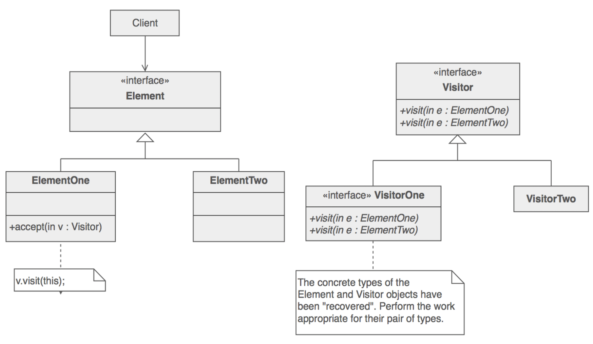
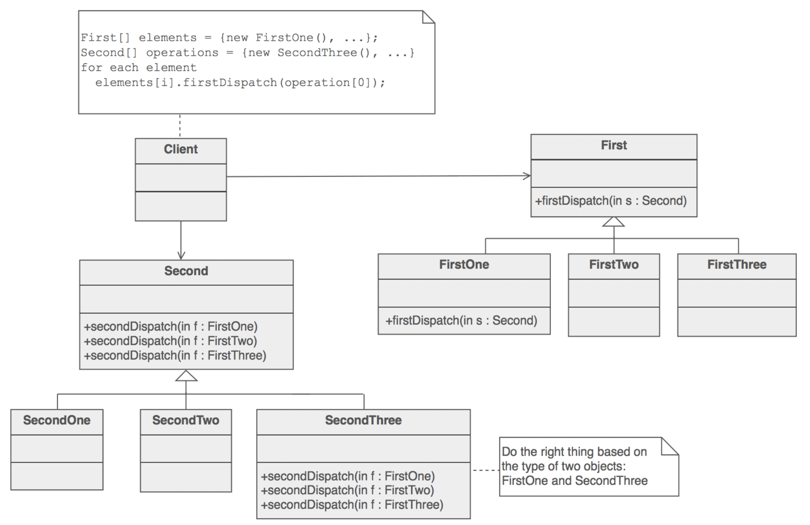

# 1. 引言
设计可复用的面向对象软件比较困难，步骤：
- 找到相关的对象；
- 适当的粒度归类；
- 定义类的接口与继承层次；
- 建立对象之间的基本关系；
设计对手头的问题有针对性，对将来的问题与需求要有足够的通用性；一个设计在最终完成前需要数次修改。
设计模式可以复用成功的设计与体系结构，设计模式可以帮助设计者更快更好的完成系统设计。
## 1.1 什么是设计模式
Christopher Alexander: 每一个模式描述了一个在我们周围不断重复发生的问题以及该问题的解决方案的核心，可以一次又一次的使用方案而不必做重复的劳动。
一个模式的4个要素：
- 模式名：对模式的命名；
- 问题：描述了应该在何时使用模式；
- 解决方案：描述了设计的组成成分，它们之间的相互关系各自的职责与协作方式；
- 效果：描述了模式应用的效果以及使用模式应权衡的问题，对灵活性、扩充性、可移植性的影响。
## 1.2 Smalltalk MVC中的设计模式
MVC（model、view、control）三元组模式，通常用与书写视图界面类的程序；MVC通过建立订阅与通知（观察者模式）机制来分离视图与模型。
## 1.3 描述设计模式
描述的结构
- 模式名与分类；
- 意图：设计模式是做什么的？基本原理与意图是什么？它解决的是什么样的特定设计问题？
- 别名：模式的其他名称；
- 动机：一个简单的情景，说明一个设计问题以及如何用模式中的类、对象来解决该问题；
- 适用性：什么情况下，可以使用该设计模式？
- 结构：才有对象建模技术表示类的关系；
- 参与者：设计模式中的类、对象与它们各自的职责；
- 协作：模式的参与者怎么协作来实现职责；
- 效果：
- 实现：
- 代码实例：
- 已知应用；
- 相关模式：类似的模式的区别。
## 设计模式编目
23种设计模式与意图
- Abstract Factory：提供您一个创建一系列相关或相互依赖对象的接口，而无需指定它们具体的类；
- Adapter: 将一个类的接口转换成客户希望的另外一个接口；
- Bridge：将抽象部分与实现部分分离，使它们都可以独立的变化；
- Builder：将复杂对象的构建与表示分离，使得构建过程可以创建不同的表示；
- Chain of Responsibility：解除请求的发送者与接受者之间的耦合，使多个对象都有机会处理这个请求，将这些对象连成一条链，并沿着这条链传递该请求，直到有一个对象处理它；
- Command：将请求封装为一个对象，从而可以用不同的请求对客户参数化，对请求排队或者记录请求日志，以及支持可取消的操作；
- Compsite：将对象组合成树形结构以表示“部分-整体”的层次结构，使得对单个对象与组合对象的使用具有一致性；
- Decorator：动态的给一个对象添加额外的职责，比生成子类更灵活；
- Facade：为系统中的一组接口提供一个一致的界面，Facade模式定义了一个高层接口，这个接口使得子系统更加容易使用；
- Factory Method：定义一个用于创建对相关的接口，让子类决定将哪个类实例化，使类的实例化延迟到子类中；
- Flyweight：运用共享技术有效的支持大量细粒度的对象；
- Interpreter：给定一个语言，定义它的文法的一种表示，定义一个解释器，该解释器使用该表示来解释语言中的句子；
- Iterator：提供一个方法顺序访问一个聚合对象中的元素，不需要曝漏该对象的内部表示；
- Mediator：用一个中介对象来封装一系列对象的交互，中介者使对象不需要显示的依赖，使其耦合松散，从而可以独立的改变其实现；
- Memento：在不破坏封装性的前提下捕获一个对象的内部状态并保存，对象可以恢复到这个状态；
- Observer：定义对象的一对多的依赖关系，以便当一个对象的状态发生变更时，所有依赖与它的对象都得到通知并自动刷新；
- Prototype：用原型实例指定创建对象的种类，通过拷贝原型来创建新的对象；
- Proxy：为其他对象提供一个代理以控制对对象的访问；
- Singleton：保证一个类仅有一个实例，并提供一个访问它的全局访问点；
- State：允许一个对象在内部状态改变时，修改它的行为，看起来就像变成了一个新的类；
- Strategy：定义一系列的算法，把它们一个个封装起来，使它们可相互替换，使得算法的变化可独立使用它的客户；
- Template Method：定义一个操作红中的算法的骨架，将一些步骤延迟到子类中来，使得子类不改变算法的结构可以重定义算法的某些步骤；
- Visitor：表示一个作用于某对象结构中额各元素的操作，可以在不改变各元素类的情况下，定义作用于这些元素的新操作；
## 组织编目
设计模式在粒度与抽象层次上不同，根据2个准则对设计模式分类，第一是目的准则（模式是用来完成什么工作的），可分为创建型（与对象的创建有关）、结构型（处理类与对象的组合）、行为型（对类与对象怎么交互怎么分配职责）3种；第二是范围准则，指定模式是用于类还是对象；类模式处理类与子类的关系，这些模式通过继承建立，是静态的，在编译器就确定了，对象模式处理对象间的关系，这些关系在运行时是可以变化的，根据动态性。

  创建型类模式将对象的创建工作延迟到子类中，创建型对象模式则讲它延迟到另一个对象中，结构型类模式使用继承机制组合类，结构型对象模式描述了对象的组装方式，行为型类模式使用继承描述算法与控制流，行为型对象模式描述了一组对象怎么协作完成单个对象无法完成的任务，设计模式还有一种组织方式：
  

## 1.6 设计模式怎么解决设计问题
- 寻找合适的对象，面向对象的程序又对象组成，对象包括封装的数据与对外的操作或者方法；面向对象最难的部分是将系统分解成对象集合，面向对象方法学支持许多设计方法：
   - 挑出名词与动词创建类与操作；
   - 系统的协作与职责关系；
   - 现实世界建模；
设计模式可以确定并不明显的抽象和描述这些抽象的对象；
- 决定对象的粒度，设计模式可以决定；
- 指定对象接口，所有对外的操作的集合叫做接口，
- 描述对象的实现，

# 访客设计模式
访问者模式是一种将算法与对象结构分类的设计模式；用于表示一个结构化对象中的元素上的一个操作；访问者模式可以让你在不改变元素类定义的情况喜爱增加一个元素的新的操作；增加类型操作的经典技术方法；双重委派；
## 问题
多种元素混合起来的结构化对象的中的节点对象或者叫做元素对象可能需要执行一些不同的对象操作，你不想在所有的对象类中都添加这些操作，那么相当于污染了这些对象类，你也不想迭代每个对象时还要查询对象的类型，并把对象转换成它实际的类型，然后执行规定的操作。
## 讨论
访客模式的只要的目的是抽象元素对象的功能，它鼓励设计轻量级的元素类，因为元素操作功能从它本身的指责中移除了，它变的轻量级了；创建新的访客的子类是非常容易的，也非常容易添加到原有的继承体系中去。访客模式实现了双分发模型.
- 单分发模型：操作执行的依赖于接收者的类型与请求的名字；
- 双分发模型：操作的执行依赖于2个接收者的类型（访问者的类型与访问对象的类型）与请求的名字。
2个模型是针对多态这种情况来说的。
In short, single dispatch is when a method is polymorphic on the type of one parameter (including the implicit this). Double dispatch is polymorphism on two parameters.
Double dispatch is a technical term to describe the process of choosing the method to invoke based both on receiver and argument types.
Double dispatch determines the method to invoke at runtime based both on the receiver type and the argument types.
Single dispatch is a way to choose the implementation of a method based on the receiver runtime type.
## 双分发模型
在软件工程领域，DD是multi dispatch的特殊形式，它的机制原理是这样的，它是一种根据调用中涉及的两个对象的运行时类型，将函数调用调度到不同的具体函数的机制。 在大多数面向对象的系统中，从代码中的函数调用调用的具体函数取决于单个对象的动态类型，因此它们被称为单调度调用，或简称为虚函数调用。
## 继续讨论
实现的处理步骤如下：
- 定义一个Visitor体系的相关的类，在抽象基类中为每个具体的元素类型定义一个visit的虚方法，每个visit()方法都接受一个单一的参数，这个参数的类型是对元素实际类型的引用；
- 元素的基类添加一个虚方法accept()，accept被定义为接收一个参数，这个参数是对Visitor抽象基类的引用;
- 每个元素的实际类型（衍生类）都实现accept方法，aceept()方法里面只是简单的发起Visitor.visit()调用，visit中传递this引用作为参数;
这样，元素与访问者之间的关系就建立起来了，当客户端需要一个执行一个新的操作时，他可以创建一个Visitor的对象，在每个元素对象上调用accept方法，并且传递Visitor对象作为参数。
accept方法会讲控制流交给元素的实际类型；然后visit方法就会被调用，控制流走向到Visitor实现类中，accept()分发了一次，visit()分发了一次，所有叫做双分发。
访问者模式使得添加新的操作是非常容易的，只是简单的添加一个新的Visitor实现类，但是如果元素子类是不稳定的，那么保持Visitor子类的同步需要耗费非常多的精力。
对访问者模式的一个公认的反对意见是它代表了功能分解的回归——将算法与数据结构分开。 虽然这是一个合理的解释，但也许更好的观点/理由是将非传统行为提升为完全客体状态的目标。
## 类结构
元素结构使用通用方法适配器的方式组织，所有元素类中的accept方法实现都是一样的，但是这个方法不能到元素基类中去用于所有的实现类继承，这是因为如果放到基类中，那么元素类的中对this的引用就会指向元素类的基类而不是具体的类型。下面的图示url图

下面是一个UML类图的另一种形式：

当在抽象的First对象上调用多态的firstDisptach()方法时，该对象的具体实现类型被恢复，当Second抽象类的对象的secondDisptach()方法被调用时，该对象的具体实现类型被恢复。
## 例子
访问者模式适用的情况是，当不想或者不能改变元素类型的定义的时候，还想在这个元素上添加一种新的操作；这种模式在出租车模式中很常见，当一个人打电话给出租车公司（接受一个访问者），出租车公司调度一个出租车给访问者；当消费者进入到出租车上后，访问者或者是消费者不能控制自己的路径，taxi控制
## 检查清单
- 确认当前的层次结构（称为 Element 层次结构）相当稳定，并且这些类的公共接口足以满足访问者类所需的访问。 如果不满足这些条件，则访问者模式不是很好的匹配。
- 创建一个Visitor基类，类中含有所有元素类型的visit(ElementXxx)的方法;
- 在元素类中添加一个accept(Visitor)，这个方法的每一个实现都是一样的，就是`accept( Visitor v ) { v.visit( this ); }`，因为循环以来的关系，元素类与Visitor类的实现需要垂直没有任何依赖路径;
- 元素类只会跟Visitor抽象基类耦合，Visitor的继承体系只会跟每个元素类型的子类耦合；如果元素继承体系的稳定性比较低，Visitor的继承体系的稳定性比较高，考虑转换2种体系的角色;
- 每个Visitor的实现类都实现visit方法，visit方法中会使用到元素对象上的操作，也就是元素对象的公共的接口;
- 客户端创建Visitor对象，遍历元素对象调用accept方法。
## 经验法则
- Interpreter 的抽象语法树是一个 Composite（因此 Iterator 和 Visitor 也适用）。
- 迭代器可以遍历复合。 访问者可以对 Composite 应用操作。
- 访问者模式就像一个更强大的命令模式，因为访问者可以启动适合它遇到的对象类型的任何内容。
- 访问者模式是无需借助动态类型转换即可恢复丢失的类型信息的经典技术。
## 笔记
2000年11月份的JavaPro杂志刊登了GoF的作者James Cooper的一篇访问者设计模式的文章，里面提到，改变面相对象模型的定义，创建一个外部类来处理其它类型中的数据，这看起来不是整洁的，但是这么做是有理由的。
他举了一个例子；假设你有一个员工-工程师-老板的层次结构；他们都享受正常的假期累积政策，但是，老板们也参加了“奖金”假期计划。 因此，Boss 类的接口与 Engineer 类的接口不同。 我们不能多态地遍历这种层次化的组合化（因为类中的接口定义是不同的）的的组织并计算该组织剩余假期的总和；当有多个具有不同接口的类并且我们想要封装从这些类中获取数据的方式时，访问者变得更加有用。
访问者模式的好处如下：
- 对你不能更改的类库文件可以添加新的操作;
- 从不相关的类中不相关的集合中获取数据，并且使用这些数据计算一个全局结构是可以实现的。
- 把所有的操作聚集到一个类中，而不是改变类或者继承类来添加新的操作;
- 与组合模式一起搭配使用。
访问者模式不适用得场景：
被访问的类或者也叫做元素类是不稳定的。
