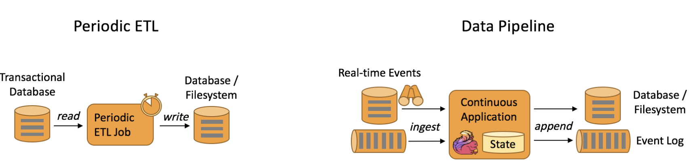

[TOC]
Apache Flink是一个框架与分布式流处理引擎，用于在无边界与有边界的数据流上进行有状态的计算，集群部署适应性强;
## 处理无界与有界数据
任何类型的数据都可以形成一种事件流，分为有界与无界2种:
- 无界: 有流的开始没有流的结束，因为输入是无限的，数据被获取后就要立即处理不能等都到达再处理，还可以规定处理的顺序;
- 有界: 流有开始也有结束，可以获取所有数据后，排序处理，也叫做批处理.

## 部署应用到任何地方
Flink集成了所有常见的集群资源管理器，也可以作为独立集群运行。部署Flink应用程序时，Flink会根据应用程序配置的并行性自动标识所需的资源，并从资源管理器请求这些资源，在发生故障的情况下，Flink通过请求新资源来替换发生故障的容器，提交或者控制应用程序的所有通信都是通过REST调用进行的，这可以简化Flink与各种环境的集成。
## 运行任意规模的应用
Flink 旨在任意规模上运行有状态流式应用。因此，应用程序被并行化为可能数千个任务，这些任务分布在集群中并发执行。所以应用程序能够充分利用无尽的 CPU、内存、磁盘和网络 IO。而且 Flink 很容易维护非常大的应用程序状态。其异步和增量的检查点算法对处理延迟产生最小的影响，同时保证精确一次状态的一致性。
## 利用内存性能
有状态的Flink程序针对本地状态访问进行优化，任务的状态始终保留在内存中，如果状态大小超过内存，则会保存在能高效访问的磁盘数据结构中，任务通过访问本地状体来进行所有的计算，从而产生非常低的处理延迟，Flink通过定期与异步的对本地状态进行持久化存储来保证故障场景下精确一次的状态一致性。


Flink自底向上在不同的抽象级别提供了多种API，针对常见的使用场景开发了专用的扩展库.
## 流处理应用的基本组件
1. 流，flink是一个可以处理任何类型数据流的处理框架，流分为有界/无界，流也分为实时/历史记录，也就是立即处理还是存储一会执行批处理。
2. 状态，具有一定复杂度的流处理应用都是有状态的，任何流处理应用都需要在一定时间内存储所接收的事件或者中间结果，以供后续某个时间点访问，应用状态是Flink中的一等公民，Flink提供了很多状态管理相关的特性支持，包括:

- 多种状态基础类型: Flink为多种不同的数据结构提供了相对应的状态基础类型，比如原子值(value)、列表(list)以及映射(map)，开发者可以基于处理函数对状态的访问方式，选择最高效、最适合的状态基础类型;
- 插件化的State Backend: State Backend负责管理应用程序状态，并在需要的时候进行checkpoint，Flink支持多种state backend，可以将状态存储在内存或者RocksDB;
- 精确一次语义，Flink的checkpoint的故障恢复算法保证了故障发生后应用状态的一致性，因此，Flink可以在应用程序发生故障时对应用程序透明不造成正确性的影响;
- 超大数据量状态，Flink能够利用其异步与增量式的checkpoint算法，存储TB级别的应用状态数据;
- 可弹性伸缩的应用，Flink能够通过在更多或者更少的工作节点上对状态进行重新分布，支持有状态应用的分布式的横向伸缩.
3. 时间，时间时流处理应用的另一个重要的组成部分，因为事件总是在特定时间点发生，大多数的事件流都有事件本身固有的时间语义，常见的流计算都基于事件语义，比如窗口聚合、会话计算、模式检测与基于时间的join，流处理的一个重要的方面时程序如何衡量时间就是区分事件时间与处理时间.
- 事件时间模式，使用事件时间语义的流处理应用根据事件本身自带的时间戳进行结果的计算，无论处理的事历史记录的事件还是实时的事件，事件时间模式的处理总能保证结果的准确性与一致性;
- Watermark支持，Flink引入了watermark的概念，用以衡量事件时间进展，Watermark也是一种平衡延时和完整性的灵活机制;
- 迟到数据处理，当以带有watermmark的事件时间模式处理数据流时，在计算完成之后仍会有相关数据达到，这样的事件称为迟到事件，Flink提供了多种处理迟到数据的选项，例如将这些数据重定向到旁路输出(side output)或者更新之前完成计算的结果;
- 处理时间模式，除了事件时间模式，Flink还支持处理事件语义，处理时间模式根据处理引擎的机器时间触发计算，一般适用于有着严格的低延迟的需求，并且能够容忍近似结果的流处理应用;

## 分层API
Flink根据抽象程度分层，提供了3种不同的API，每一种API在简洁性欲表达力上有着不同的侧重，并且针对不同的应用场景

1. ProcessFunction
是Flink提供的最具表达力的接口，ProcessFunction可以处理一个或者多个数据数据流中的事件，或者归入一个窗口的内的多个事件进行处理，它提供了对于时间与状态的细粒度控制，开发者可以在其中任意的修改状态，也能够注册定时器以在未来的某一个时刻触发回调函数，你可以用ProcessFunction实现许多有状态的事件驱动应用所需要的基于单个事件的复杂业务逻辑,下面是一个例子:
```java
/**

 * 将相邻的 keyed START 和 END 事件相匹配并计算两者的时间间隔
 * 输入数据为 Tuple2<String, String> 类型，第一个字段为 key 值， 
 * 第二个字段标记 START 和 END 事件。
    */
public static class StartEndDuration
    extends KeyedProcessFunction<String, Tuple2<String, String>, Tuple2<String, Long>> {

  private ValueState<Long> startTime;

  @Override
  public void open(Configuration conf) {
    // obtain state handle
    startTime = getRuntimeContext()
      .getState(new ValueStateDescriptor<Long>("startTime", Long.class));
  }

  /** Called for each processed event. */
  @Override
  public void processElement(
      Tuple2<String, String> in,
      Context ctx,
      Collector<Tuple2<String, Long>> out) throws Exception {

    switch (in.f1) {
      case "START":
        // set the start time if we receive a start event.
        startTime.update(ctx.timestamp());
        // register a timer in four hours from the start event.
        ctx.timerService()
          .registerEventTimeTimer(ctx.timestamp() + 4 * 60 * 60 * 1000);
        break;
      case "END":
        // emit the duration between start and end event
        Long sTime = startTime.value();
        if (sTime != null) {
          out.collect(Tuple2.of(in.f0, ctx.timestamp() - sTime));
          // clear the state
          startTime.clear();
        }
      default:
        // do nothing
    }
  }

  /** Called when a timer fires. */
  @Override
  public void onTimer(
      long timestamp,
      OnTimerContext ctx,
      Collector<Tuple2<String, Long>> out) {

    // Timeout interval exceeded. Cleaning up the state.
    startTime.clear();
  }
}
```
2. DataStream API
DataStream API为很多通用的流处理操作提供了处理原语，这些操作包括窗口、逐条记录的转换操作、处理事件时进行外部数据库查询等，比如map()、reduce()、aggregate()等函数，下面是一个例子:
```java
// 网站点击 Click 的数据流
DataStream<Click> clicks = ...

DataStream<Tuple2<String, Long>> result = clicks
  // 将网站点击映射为 (userId, 1) 以便计数
  .map(
    // 实现 MapFunction 接口定义函数
    new MapFunction<Click, Tuple2<String, Long>>() {
      @Override
      public Tuple2<String, Long> map(Click click) {
        return Tuple2.of(click.userId, 1L);
      }
    })
  // 以 userId (field 0) 作为 key
  .keyBy(0)
  // 定义 30 分钟超时的会话窗口
  .window(EventTimeSessionWindows.withGap(Time.minutes(30L)))
  // 对每个会话窗口的点击进行计数，使用 lambda 表达式定义 reduce 函数
  .reduce((a, b) -> Tuple2.of(a.f0, a.f1 + b.f1));
```
3. SQL & Table API
Flink支持2种关系型的API， Table API 与 SQL，批处理与流处理统一的API，关系型API在批处理与实时处理方面以统一的语义执行查询，Table与SQL借助了Apache Calcite来进行查询的解析、校验与优化，可以与DataStream/DataSet API无缝集成，支持用户自定义标量函数、聚合函数以及表值函数.Flink的关系型API旨在简化数据分析、数据流水线和ETL应用的定义。下面是一个例子:
```java
SELECT userId, COUNT(*)
FROM clicks
GROUP BY SESSION(clicktime, INTERVAL '30' MINUTE), userId
```
4. 库
Flink具有数个适用于常见数据处理应用场景的扩展库，这些库嵌入在API中;
- 复杂事件处理(CEP): 模式检测是事件流处理中的一个非常常见的用例。Flink 的 CEP 库提供了 API，使用户能够以例如正则表达式或状态机的方式指定事件模式。CEP 库与 Flink 的 DataStream API 集成，以便在 DataStream 上评估模式。CEP 库的应用包括网络入侵检测，业务流程监控和欺诈检测;
- DataSet API: DataSet API 是 Flink 用于批处理应用程序的核心 API。DataSet API 所提供的基础算子包括map、reduce、(outer) join、co-group、iterate等。所有算子都有相应的算法和数据结构支持，对内存中的序列化数据进行操作。如果数据大小超过预留内存，则过量数据将存储到磁盘。Flink 的 DataSet API 的数据处理算法借鉴了传统数据库算法的实现，例如混合散列连接（hybrid hash-join）和外部归并排序（external merge-sort）。
- Gelly:  Gelly 是一个可扩展的图形处理和分析库。Gelly 是在 DataSet API 之上实现的，并与 DataSet API 集成。因此，它能够受益于其可扩展且健壮的操作符。Gelly 提供了内置算法，如 label propagation、triangle enumeration 和 page rank 算法，也提供了一个简化自定义图算法实现的 Graph API。

Apache Flink 是一个针对无界和有界数据流进行有状态计算的框架。由于许多流应用程序旨在以最短的停机时间连续运行，因此流处理器必须提供出色的故障恢复能力，以及在应用程序运行期间进行监控和维护的工具。
## 7*24小时稳定运行
Flink有故障恢复机制，Flink提供的机制包括:
- 检查点的一致性: Flink的故障恢复机制是通过建立分布式应用服务状态一致性检查点实现的，当有故障产生时，应用服务会重启后，再重新加载上一次成功备份的状态检查点信息。结合可重放的数据源，该特性可保证精确一次（exactly-once）的状态一致性。
- 高效的检查点: 如果一个应用要维护一个TB级的状态信息，对此应用的状态建立检查点服务的资源开销是很高的，为了减小因检查点服务对应用的延迟性的影响，Flink采用异步与增量的方式构建检查点服务;
- 端到端的精确一次: Flink为某些特定的存储支持了事务型输出的功能，及时在发生故障的情况下，也能够保证精确一次的输出;
- 内置高可用服务: Flink内置了为解决单点故障问题的高可用性服务模块，此模块是基于Apache ZooKeeper 技术实现的，Apache ZooKeeper是一种可靠的、交互式的、分布式协调服务组件;
## Flink能够更方便的升级、迁移、暂停、恢复应用服务
驱动关键业务服务的流应用经常需要维护，比如升级，而Flink的Savepoint服务就是为解决升级服务过程中记录流应用状态信息及其相关难题而产生的一种唯一的、强大的组件。一个 Savepoint，就是一个应用服务状态的一致性快照，因此其与checkpoint组件的很相似，但是与checkpoint相比，Savepoint 需要手动触发启动，而且当流应用服务停止时，它并不会自动删除。Savepoint 常被应用于启动一个已含有状态的流服务，并初始化其（备份时）状态。Savepoint 有以下特点:
- 便于升级应用服务版本,Savepoint 常在应用版本升级时使用，当前应用的新版本更新升级时，可以根据上一个版本程序记录的 Savepoint 内的服务状态信息来重启服务。它也可能会使用更早的 Savepoint 还原点来重启服务，以便于修复由于有缺陷的程序版本导致的不正确的程序运行结果;
- 方便集群服务移植,通过使用 Savepoint，流服务应用可以自由的在不同集群中迁移部署;
- 方便Flink版本升级: 通过使用 Savepoint，可以使应用服务在升级Flink时，更加安全便捷;
- 增加应用并行服务的扩展性: Savepoint 也常在增加或减少应用服务集群的并行度时使用;
- 便于A/B测试及假设分析场景对比结果: 通过把同一应用在使用不同版本的应用程序，基于同一个 Savepoint 还原点启动服务时，可以测试对比2个或多个版本程序的性能及服务质量。
- 暂停和恢复服务: 一个应用服务可以在新建一个 Savepoint 后再停止服务，以便于后面任何时间点再根据这个实时刷新的 Savepoint 还原点进行恢复服务。
- 归档服务: Savepoint 还提供还原点的归档服务，以便于用户能够指定时间点的 Savepoint 的服务数据进行重置应用服务的状态，进行恢复服务。
## 监控和控制应用服务
与其他应用服务一样，持续运行的流应用服务也需要监控及集成到一些基础设施资源管理服务中，Flink与许多常见的日志记录和监视服务集成得很好，并提供了一个REST API来控制应用服务和查询应用信息。具体表现如下:
- Web UI方式: Flink提供了一个web UI来观察、监视和调试正在运行的应用服务。并且还可以执行或取消组件或任务的执行;
- 日志集成服务:Flink实现了流行的slf4j日志接口，并与日志框架log4j或logback集成;
- 指标服务: Flink提供了一个复杂的度量系统来收集和报告系统和用户定义的度量指标信息。度量信息可以导出到多个报表组件服务，包括 JMX, Ganglia, Graphite, Prometheus, StatsD, Datadog, 和 Slf4j.
- 标准的WEBREST API接口服务: Flink提供多种REST API接口，有提交新应用程序、获取正在运行的应用程序的Savepoint服务信息、取消应用服务等接口。REST API还提供元数据信息和已采集的运行中或完成后的应用服务的指标信息。

## 应用场景
Flink支持开发与运行多种不同种类的应用程序，主要特性包括:
- 批流一体化;
- 精密的状态管理;
- 事件事件支持;
- 精确一次的状态一致性保障等.
Flink不仅可以运行在YARN、Mesos、Kubernetes等多种资源框架上，还支持裸机集群独立部署，不存在单点失效的问题。
1. 事件驱动型应用
事件驱动型应用是一类具有状态的应用，它从一个或者多个事件流提取数据，并根据到来的事件触发计算、状态更新或者其他外部动作；事件驱动应用是在计算/存储分离的传统应用基础上进化而来，在传统架构中，应用需要读写远程事务型数据库; 事件驱动型应用是基于状态流处理来完成的，在该设计中，数据与计算不会分离，应用只需要访问本地即可获取数据，系统容错性的实现依赖于定期向远程持久化存储写入 checkpoint。下图描述了传统应用和事件驱动型应用架构的区别:

事件驱动型应用无需查询远程数据库，本地数据访问使得它具有更高的吞吐和更低的延迟，而由于定期向远程持久化存储的checkpoint工作可以异步、增量式完成，因此对于正常事件处理的影响甚微，事件驱动型应用的优势不仅限于本地数据访问。传统分层架构下，通常多个应用会共享同一个数据库，因而任何对数据库自身的更改（例如：由应用更新或服务扩容导致数据布局发生改变）都需要谨慎协调。反观事件驱动型应用，由于只需考虑自身数据，因此在更改数据表示或服务扩容时所需的协调工作将大大减少。
事件驱动型应用会受制于底层流处理系统对时间与状态的把控能力，Flink诸多优秀的特性都是围绕这方面来设计的，它提供了一系列丰富的状态操作原语，允许以精确一次的一致性语义合并海量规模(TB级别)的状态数据，此外，Flink还支持事件时间和自由度极高的定制化窗口逻辑，而且它内置的ProcessFunction支持细粒度的时间控制，方便实现一些高级业务逻辑，同时Flink还拥有一个复杂事件处理(CEP)类库，可以用来检测数据流中的模式。Flink中针对事件驱动应用的特殊特性是savepoint，savepoint是一个一致性的状态映像，它可以用来初始化任意状态兼容的应用，在完成一次savepoint后，即可放心对应用升级或扩容，还可以启动多个版本的应用来完成A/B测试。典型的事件驱动型应用实例有:
- 反欺诈;
- 异常检测;
- 基于规则的报警;
- 业务流程监控;
- 社交网络Web应用
2. 数据分析应用
数据分析任务需要从原始数据中提取有价值的信息和指标，传统的分析方式通常是利用批查询或将事件记录下来并基于此有限数据集构建应用来完成，为了得到最新数据的分析结果，必须先将它们加入分析数据集并重新执行查询或者运行应用，随后将结果写入存储系统或生成报告.借助一些先进的流处理引擎，还可以实时的进行数据分析，和传统模式下读取有限数据集不同，流式查询或应用会接入实时事件流，并随着事件消费持续产生和更新结果，这些结果数据可能会写入外部数据库系统或以内部状态的形式维护，仪表展示应用可以相应的从外部数据库读取数据或直接查询应用的内部状态.

和批量分析相比，由于流式分析省掉了周期性的数据导入语查询过程，因此从事件中获取指标的延迟更低，不仅如此，批量查询必须处理那些由定期导入和输入有界性导致的人工数据边界，而流式查询则无须考虑该问题。另一方面，流式分析会简化应用抽象，批量查询的流水线通常由多个独立部件组成，需要周期性的调度提取数据和执行查询，一旦某个组件出错会影响流水线的后续步骤，而流式分析应用整体运行在Flink之类的高端流处理系统之上，涵盖了从数据接入到连续结果计算的所有步骤，可以依赖底层引擎提供的故障恢复机制。Flink为持续流式分析与批量分析都提供了良好的支持，具体而言，它内置了一个符合ANSI标准的SQL接口，将批、流查询的语义统一起来，无论是在记录事件的静态数据集还是实时事件流上，相同SQL查询都会得到一致的结果，同时Flink还支持丰富的用户自定义函数，允许在SQL中执行定制化代码，如果还需进一步定制逻辑，可以利用Flink DataStream API和DataSet API进行更低层次的控制，此外，Flink的Gelly库为基于批量数据集的大规模高性能图分析提供了算法和构建模块支持.数据分析类应用的例子:
- 电信网络质量监控;
- 移动应用中的产品更新及试验结果评估分析;
- 消费者技术中的实时数据即席分析;
- 大规模图分析
3. 数据管道应用
ETL是一种在存储系统之间进行数据转换和迁移的常用方法，ETL作业通常会周期性的触发，将数据从事务性数据库拷贝到分析型数据库或者数据仓库，数据管道与ETL作业的用途类似，都可以转换、丰富数据，并将其从某个存储系统移动到另一个，但是数据管道是以持续流模式运行，而非周期性触发，因此它支持从一个不断生成数据的源头读取记录，并将它们以低延迟移动到终点，

 和周期性ETL作业相比，持续数据管道可以明显降低将数据移动到目的端的延迟，此外，由于它能够持续消费和发送数据，因此用途更广，支持用例更多.
 很多常见的数据转换和增强操作可以利用 Flink 的 SQL 接口（或 Table API）及用户自定义函数解决。如果数据管道有更高级的需求，可以选择更通用的 DataStream API 来实现。Flink 为多种数据存储系统（如：Kafka、Kinesis、Elasticsearch、JDBC数据库系统等）内置了连接器。同时它还提供了文件系统的连续型数据源及数据汇，可用来监控目录变化和以时间分区的方式写入文件。数据管道的例子:
 - 电子商务中的实时查询索引构建;
 - 电子商务中的持续ETL
