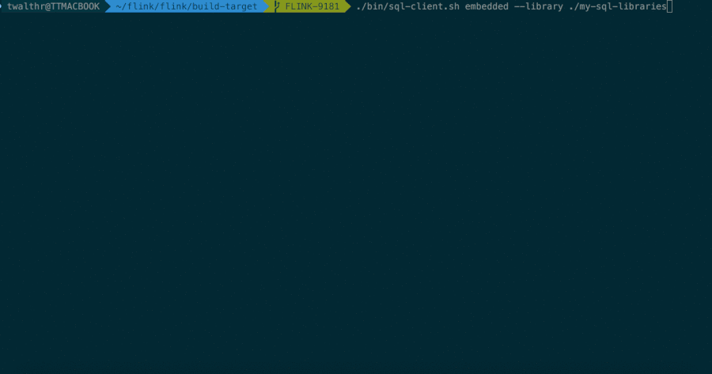

Flink的Table & SQL API可以处理SQL语言编写的查询语句。但是这些查询需要嵌入用Java/Scala编写的表程序中，此外，这些程序在提交到集群前需要用构建工具打包，这或多或少限制了Java/Scala程序员对Flink的使用。SQL客户端的目的是提供一种简单的方式来编写、调试和提交表程序到Flink集群上，而无需写一行Java/Scala代码。SQL客户端命令行界面（CLI）能够在命令行中检索/可视化分布式应用中实时产生的结果。

# 入门
SQL客户端捆绑在常规Flink发行版中，因此可以直接运行。它仅需要一个正在运行的Flink集群就可以在其中执行表程序。有关设置Flink群集的更多信息，请参见[集群和部署](https://nightlies.apache.org/flink/flink-docs-release-1.17/zh/docs/deployment/resource-providers/standalone/overview/)部分。如果仅想试用SQL客户端，也可以使用以下命令启动本地集群:
```shell
./bin/start-cluster.sh
```
## 启动SQL客户端命令行界面
SQL Client脚本也位于Flink的bin目录中。用户可以通过启动嵌入式standalone进程或通过连接到远程SQL Gateway来启动SQL客户端命令行界面。SQL客户端默认使用embedded模式，你可以通过以下方式启动CLI:
```shell
./bin/sql-client.sh
```
或者显式使用embedded模式:
```shell
./bin/sql-client.sh embedded
```
若想使用gateway模式，你可以通过以下命令启动SQL客户端:
```shell
./bin/sql-client.sh gateway --endpoint <gateway address>
```
SQL客户端目前只支持和REST API版本大于v1的[REST Endpoint](https://nightlies.apache.org/flink/flink-docs-release-1.17/zh/docs/dev/table/sql-gateway/rest/#rest-api)通信。参阅[SQL Client startup options](https://nightlies.apache.org/flink/flink-docs-release-1.17/zh/docs/dev/table/sqlclient/#sql-client-startup-options)了解更多启动命令。
## 执行SQL查询
命令行界面启动后，你可以使用`HELP`命令列出所有可用的SQL语句。输入第一条SQL查询语句并按 Enter键执行，可以验证你的设置及集群连接是否正确:
```sql
SELECT 'Hello World';
```
这个查询不需要table source，只产生一行结果。CLI将从集群中检索结果并将其可视化。按Q键退出结果视图。CLI为维护和可视化结果提供三种模式。
- 表格模式，table mode，在内存中实体化结果，并将结果用规则的分页表格可视化展示出来。执行如下命令启用:
  ```sql
  SET 'sql-client.execution.result-mode' = 'table';
  ```
- 变更日志模式(changelog mode)不会实体化和可视化结果，而是由插入（+）和撤销（-）组成的持续查询产生结果流
  ```sql
  SET 'sql-client.execution.result-mode' = 'changelog';
  ```
- Tableau模式(tableau mode)更接近传统的数据库，会将执行的结果以制表的形式直接打在屏幕之上。具体显示的内容会取决于作业执行模式的不同(execution.type):
  ```sql
  SET 'sql-client.execution.result-mode' = 'tableau';
  ```
注意当你使用这个模式运行一个流式查询的时候，Flink会将结果持续的打印在当前的屏幕之上。如果这个流式查询的输入是有限的数据集，那么Flink在处理完所有的数据之后，会自动的停止作业，同时屏幕上的打印也会相应的停止。如果你想提前结束这个查询，那么可以直接使用CTRL-C按键，这个会停掉作业同时停止屏幕上的打印。你可以用如下查询来查看三种结果模式的运行情况:
```sql
SELECT name, COUNT(*) AS cnt FROM (VALUES ('Bob'), ('Alice'), ('Greg'), ('Bob')) AS NameTable(name) GROUP BY name;
```

