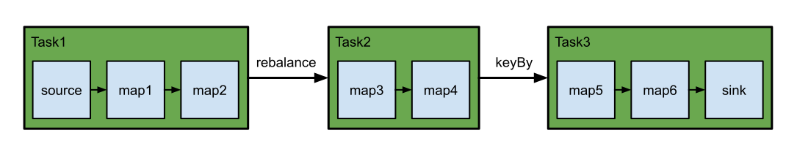

# 概览
Flink中的DataStream程序是对数据流进行转换的常规程序。数据流的起始时从各种源(消息队列、套接字流、文件)创建的。结果通过sink返回，例如可以将数据写入文件或者标准输出。Flink程序可以在各种上下文中运行，可以独立运行，也可以嵌入到其他程序中。任务执行可以运行在本地JVM也可以运行在多台机器的集群上。
## DataStream是什么?
DataStream API得名于特殊的DataStream类，该类用于表示flink程序中的数据集合。你可以认为 它们是可以包含重复项的不可变数据集合。这些数据可以是有界（有限）的，也可以是无界（无限）的，但用于处理它们的API是相同的。DataStream在用法上类似于常规的Java集合，但在某些关键方面却大不相同。它们是不可变的，这意味着一旦它们被创建，你就不能添加或删除元素。你也不能简单地察看内部元素，而只能使用DataStream API操作来处理它们，DataStream API操作也叫作转换（transformation）。你可以通过在Flink程序中添加source创建一个初始的DataStream。然后，你可以基于DataStream派生新的流，并使用map、filter等API方法把DataStream和派生的流连接在一起。
## Flink程序剖析
Flink程序看起来像一个转换DataStream的常规程序，每个程序由相同的基本部分组成:
- 获取一个执行环境(execution environment)
- 加载/创建初始数据;
- 指定数据相关的转换;
- 指定计算结果的存储位置;
- 触发程序执行。
现在我们将对这些步骤逐一进行概述，更多细节请参考相关章节。请注意，Java DataStream API的所有核心类都可以在[org.apache.flink.streaming.api](https://github.com/apache/flink/blob/release-1.16//flink-streaming-java/src/main/java/org/apache/flink/streaming/api)中找到。`StreamExecutionEnvironment`是所有Flink程序的基础。你可以使用`StreamExecutionEnvironment`的如下静态方法获取`StreamExecutionEnvironment`:
```java
getExecutionEnvironment();
createLocalEnvironment();
createRemoteEnvironment(String host, int port, String... jarFiles);
```
通常，你只需要使用`getExecutionEnvironment()`即可，因为该方法会根据上下文做正确的处理: 如果你在IDE执行，你的程序或将作为一般的Java程序执行，那么它将创建一个本地环境，该环境将在你的本地机器上执行你的程序。如果你基于程序创建了一个JAR文件并通过命令行运行它，Flink集群管理器将执行程序的main方法，同时`getExecutionEnvironment()`方法会返回一个执行环境以在集群上执行你的程序。为了指定data sources，执行环境提供提供一些方法，支持使用各种方法从文件中读取数据，可以直接逐行读取或者使用第三方的source，如果你只是将一个文本文件作为一个行的序列来读取，那么可以使用：
```java
final StreamExecutionEnvironment env = StreamExecutionEnvironment.getExecutionEnvironment();
DataStream<String> text = env.readTextFile("file:///path/to/file");
```
这将生成一个DataStream，然后你可以在上面应用转换（transformation）来创建新的派生DataStream。你可以调用 DataStream上具有转换功能的方法来应用转换。例如，一个map的转换如下所示:
```java
DataStream<String> input = ...;
DataStream<Integer> parsed = input.map(new MapFunction<String, Integer>() {
    @Override
    public Integer map(String value) {
        return Integer.parseInt(value);
    }
});
```
这将通过把原始集合中的每一个字符串转换为一个整数来创建一个新的 DataStream。一旦你有了包含最终结果的DataStream，你就可以通过创建sink把它写到外部系统。下面是一些用于创建sink的示例方法:
```java
writeAsText(String path);
print();
```
一旦指定了完整的程序，需要调用`StreamExecutionEnvironment.execute()`方法来触发程序执行，根据`ExecutionEnvironment`的类型，执行会在你的本地机器上触发或者将你的程序提交到某个集群上执行。`execute()`将等待作业完成，返回一个`JobExecutionResult`，其中包含执行时间和累加器结果。如果不想等待作业完成，可以通过调用`StreamExecutionEnvironment.executeAsync()`方法来触发作业异步执行，它会返回一个JobClient，你可以通过它与刚刚提交的作业进行通信，如下是例子:
```java
final JobClient jobClient = env.executeAsync();
final JobExecutionResult jobExecutionResult = jobClient.getJobExecutionResult().get();
```
程序如何执行最后一部分对于理解何时执行以及如何执行Flink算子是至关重要的。所有Flink程序都是延迟执行的: 当程序的main方法执行时，数据加载和转换不会直接发生，相反，每个算子都被创建并添加到dataflow形成的有向图。当执行被执行环境的execute()方法显示的触发时，这些算子才会真正的执行。程序是在本地执行还是在集群上执行取决于执行环境的类型。延迟计算允许你构建复杂的程序，Flink会将其作为一个整体的计划单元来执行。
## 示例程序
下面是一个可运行的程序例子，基于流窗口的单词统计应用程序，计算5秒内来自Web套接字的单词数。
```java
public class WindowWordCount {
    
    public static void main(String[] args) throws Exception {
        // Sets up the execution environment, which is the main entry point
        // to building Flink applications.
        final StreamExecutionEnvironment env = StreamExecutionEnvironment
                .getExecutionEnvironment();
        DataStream<Tuple2<String, Integer>> dataStream = env
                .socketTextStream("localhost", 9999).flatMap(new Splitter())
                .keyBy(value -> value.f0)
                .window(TumblingProcessingTimeWindows.of(Time.seconds(5)))
                .sum(1);
		dataStream.print();
        env.execute("WindowWordCount");
    }
}
```
通过`nc -lk 9999`启动输入流，按回车键可以穿入新的单词，这些将作为单词统计程序的输入。如果想查看大于1的计数，在5秒内重复输入相同的单词即可（如果无法快速输入，则可以将窗口大小从5秒增加）。
## Data Sources
Source是你的程序从中读取其输入的地方。 你可以用`StreamExecutionEnvironment.addSource(sourceFunction)`将一个source关联到你的程序。Flink自带了很多预先实现的source functions。不过你仍然可以通过实现`SourceFunction`接口编写自定义的非并行source，也可以实现`ParallelSourceFunction`接口或者继承`RichParallelSourceFunction`类编写自定义的并行sources。通过`StreamExecutionEnvironment`可以访问多种预定义的stream source:
- 基于文件:
  - readTextFile(path)，读取文本文件，例如遵守`TextInputFormat`规范的文件，逐行读取并将它们作为字符串返回;
  - readFile(fileInputFormat,path)，按照指定的文件输入格式读取（一次）文件;
  - readFile(fileInputFormat, path, watchType, interval, pathFilter, typeInfo)，这是前两个方法内部调用的方法。它基于给定的fileInputFormat读取路径path上的文件。根据提供的watchType的不同，source可能定期（每interval毫秒）监控路径上的新数据（watchType为FileProcessingMode.PROCESS_CONTINUOUSLY），或者处理一次当前路径中的数据然后退出（watchType为FileProcessingMode.PROCESS_ONCE）。使用pathFilter，用户可以进一步排除正在处理的文件;

  在底层，Flink将文件读取过程拆分为2个子任务，即目录监控与数据读取。每个子任务都由一个单独的实体实现。监控由单个非并行任务实现，而读取由多个并行运行的任务执行。后者的并行度和作业的并行度相等。单个监控任务的作用是扫描目录(定期或者仅扫描一次，取决于watchType),找到要处理的文件，将它们划分为片，并将这些分片分配给下游的reader。Reader是实际获取数据的角色，每一个分片只能被一个reader读取，一个reader可以一个一个的读取多个分片。如果watchType设置为 FileProcessingMode.PROCESS_CONTINUOUSLY，当一个文件被修改时，它的内容会被完全重新处理。这可能会打破"精确一次"的语义，因为在文件末尾追加数据将导致重新处理文件的所有内容。如果watchType设置为FileProcessingMode.PROCESS_ONCE，source扫描一次路径然后退出，无需等待reader读完文件内容。当然，reader会继续读取数据，直到所有文件内容都读完。关闭source会导致在那之后不再有检查点。这可能会导致节点故障后恢复速度变慢，因为作业将从最后一个检查点恢复读取。
- 基于套接字
  - socketTextStream，从套接字读取，元素可以由分隔符分隔
- 基于集合
  - fromCollection(Collection)，从Java Java.util.Collection创建数据流。集合中的所有元素必须属于同一类型;
  - fromCollection(Iterator, Class)，从迭代器创建数据流。class参数指定迭代器返回元素的数据类型;
  - fromElements(T ...)，从给定的对象序列中创建数据流。所有的对象必须属于同一类型;
  - fromParallelCollection(SplittableIterator, Class)，从迭代器并行创建数据流。class参数指定迭代器返回元素的数据类型;
  - generateSequence(from, to)，基于给定间隔内的数字序列并行生成数据流;
- 自定义
  - addSource(), 关联一个新的source function。例如，你可以使用`addSource(new FlinkKafkaConsumer<>(...))`来从Apache Kafka获取数据。更多详细信息见[连接器](https://nightlies.apache.org/flink/flink-docs-release-1.16/zh/docs/connectors/datastream/overview/)。
## DataStream Transformations
有关可用stream转换(transformation)的概述，参阅[算子](https://nightlies.apache.org/flink/flink-docs-release-1.16/zh/docs/dev/datastream/operators/overview/)
## Data Sinks
Data Links使用DataStream并将它们转发到文件、套接字、外部系统或打印它们。Flink自带了多种内置的输出格式，这些格式相关的实现封装在DataStreans的算子里:
- writeAsText()//TextOutputFormat,将元素按行写成字符串。通过调用每个元素的toString()方法获得字符串;
- writeAsCsv(...)// CsvOutputFormat,将元组写成逗号分隔值文件。行和字段的分隔符是可配置的。每个字段的值来自对象的toString()方法;
- print()/printToErr() // 在标准输出/标准错误流上打印每个元素的toString()值。可选地，可以提供一个前缀（msg）附加到输出。这有助于区分不同的print调用。如果并行度大于1，输出结果将附带输出任务标识符的前缀;
- writeUsingOutputFormat()//FileOutputFormat,自定义文件输出的方法和基类。支持自定义object到byte的转换;
- writeToSocket(), 根据SerializationSchema将元素写入套接字;
- addSink() 调用自定义sink function。Flink捆绑了连接到其他系统（例如 Apache Kafka）的连接器，这些连接器被实现为sink functions。

DataStream的write*()方法主要用于调试目的，它们不参与Flink的checkpointing，这意味着这些函数通常具有至少一次语义。刷新到目标系统的数据取决于OutputFromat的实现。这意味着并非所有发送到OutputFormat的元素都会立即显示在目标系统中。此外，在失败的情况下，这些记录可能会丢失。为了将流可靠地、精准一次地传输到文件系统中，请使用FileSink。此外，通过.addSink(...)方法调用的自定义实现也可以参与Flink的checkpointing，以实现精准一次的语义。
## Iterations
Iterative Streaming程序实现了step function并将其嵌入到IterativeStream。由于DataStream程序可能永远不会完成，因此没有最大迭代次数。相反，你需要指定流的哪一部分反馈给迭代，哪一部分使用旁路输出或过滤器转发到下游。这里，我们展示了一个使用过滤器的示例。首先，我们定义一个IterativeStream:
```java
IterativeStream<Integer> iteration = input.iterate();
```
然后，我们使用一系列转换（这里是一个简单的map转换）指定将在循环内执行的逻辑:
```java
DataStream<Integer> iterationBody = iteration.map(/* this is executed many times */);
```
要关闭迭代并定义迭代尾部，请调用`IterativeStream`的`closeWith(feedbackStream)`方法。提供给`closeWith`函数的DataStream将反馈给迭代头。一种常见的模式是使用过滤器将反馈的流部分和向前传播的流部分分开。例如，这些过滤器可以定义"终止"逻辑，其中允许元素向下游传播而不是被反馈。
```java
iteration.closeWith(iterationBody.filter(/* one part of the stream */));
DataStream<Integer> output = iterationBody.filter(/* some other part of the stream */);
```
例如，下面的程序从一系列整数中连续减去1，直到它们达到零:
```java
DataStream<Long> someIntegers = env.generateSequence(0, 1000);

IterativeStream<Long> iteration = someIntegers.iterate();

DataStream<Long> minusOne = iteration.map(new MapFunction<Long, Long>() {
  @Override
  public Long map(Long value) throws Exception {
    return value - 1 ;
  }
});

DataStream<Long> stillGreaterThanZero = minusOne.filter(new FilterFunction<Long>() {
  @Override
  public boolean filter(Long value) throws Exception {
    return (value > 0);
  }
});

iteration.closeWith(stillGreaterThanZero);

DataStream<Long> lessThanZero = minusOne.filter(new FilterFunction<Long>() {
  @Override
  public boolean filter(Long value) throws Exception {
    return (value <= 0);
  }
});
```
## 执行参数
`StreamExecutionEnvironment`包含了`ExecutionConfig`，它允许在运行时设置作业特定的配置值。大多数参数的说明可参考[执行配置](https://nightlies.apache.org/flink/flink-docs-release-1.16/zh/docs/deployment/config/)。这些参数特别适用于DataStream API:
- `setAutoWatermarkInterval(long milliseconds)`：设置自动发送watermark的时间间隔。你可以使用`long getAutoWatermarkInterval()`获取当前配置值。
### 容错
[State & Checkpointing](https://nightlies.apache.org/flink/flink-docs-release-1.16/zh/docs/dev/datastream/fault-tolerance/checkpointing/)描述了如何启用和配置Flink的checkpointing机制。
### 控制延迟
默认情况下，元素不会在网络上一一传输，而是被缓冲。缓冲区的大小(实际在机器之间传输)可以在Flink配置文件中设置。虽然此方法有利于优化吞吐量，但是当输入流不够快时，它可能导致延迟问题。要控制吞吐量和延迟，你可以调用执行环境的`env.setBufferTimeout(timeoutMillis)`方法来设置缓冲区填满的最长等待时间。超过此时间后，即使缓冲区没有满，也会被自动发送。超时时间的默认值是100ms。
```java
LocalStreamEnvironment env = StreamExecutionEnvironment.createLocalEnvironment();
env.setBufferTimeout(timeoutMillis);
env.generateSequence(1,10).map(new MyMapper()).setBufferTimeout(timeoutMillis);
```
为了最大限度的提高吞吐量，设置`setBufferTimeout(-1)`来删除超时，这样缓冲区仅在它们已满时才会被刷新。要最小化延迟，请将超时设置为接近0的值(5/10ms)，应避免超时为0的缓冲区，因为会导致严重的性能下降。
## 调试
在分布式集群中运行流程序之前，最好确保实现的算法能按预期工作。因此，实现数据分析程序通常是一个检查结果、调试和改进的增量过程。Flink通过提供IDE内本地调试、注入测试数据和收集结果数据的特性大大简化了数据分析程序的开发过程，下面给出了一些如何简化Flink程序开发的提示。
### 本地执行环境
`LocalStreamEnvironment`在创建它的同一个JVM进程中启动Flink系统。如果你从IDE启动LocalEnvironment，则可以在代码中设置断点并轻松调试程序。一个`LocalEnvironment`的创建和使用如下:
```java
final StreamExecutionEnvironment env = StreamExecutionEnvironment.createLocalEnvironment();
DataStream<String> lines = env.addSource(/* some source */);
// 构建你的程序
env.execute();
```
### 集合Data Sources
Flink提供了由Java集合支持的特殊data sources以简化测试。一旦程序通过测试，sources/sinks可以很容易的被从外部系统读取/写入到外部系统的sources/sinks替换。使用集合的Data Sources的方式如下:
```java
final StreamExecutionEnvironment env = StreamExecutionEnvironment.createLocalEnvironment();
// 从元素列表创建一个 DataStream
DataStream<Integer> myInts = env.fromElements(1, 2, 3, 4, 5);
// 从任何 Java 集合创建一个 DataStream
List<Tuple2<String, Integer>> data = ...
DataStream<Tuple2<String, Integer>> myTuples = env.fromCollection(data);
// 从迭代器创建一个 DataStream
Iterator<Long> longIt = ...
DataStream<Long> myLongs = env.fromCollection(longIt, Long.class);
```
目前，集合data sources要求数据类型和迭代器实现`Serializable`，此外集合data sources不能并行执行。
### 迭代器Data Sink
Flink还提供了一个sink来收集DataStream的结果，它用于测试和调试目的。可以按以下方式使用。
```java
DataStream<Tuple2<String, Integer>> myResult = ...
Iterator<Tuple2<String, Integer>> myOutput = myResult.collectAsync();
```
# 执行模式(流/批)
DataStream API支持不同的运行时执行模式，你可以根据你的用例需要和作业特点进行选择。DataStream API有一种经典的执行行为，称为流执行模式，这种模式适用于需要连续增量处理。而且预计无限期保持在线的无边界作业。此外，还有一种批执行模式，称为batch模式，更类似批处理框架。比如MapReduce，这种执行模式适用于有一个已知的固定输入，而且会回连续运行的有边界作业。Flink对流处理/批处理统一方法，意味着无论配置何种执行模式，在有界输入上执行的DataStream应用都会产生相同的最终结果。最终在这里的意思: 一个在流模式执行的作业可能会产生增量更新，而批处理作业只在最后产生一个最终结果，尽管计算方法不同，只要呈现方式得当，最终结果会是相同的。通过启用批执行，我们允许flink应用只在我们知道输入是有边界的时候才会使用到的额外的优化。例如，可以使用不同的join/aggregation策略，允许实现更高效的任务调度和故障恢复行为的不同shuffle。
## 什么时候可以/应该使用批执行模式
批执行模式只能用于有边界的作业/flink程序，边界是数据源的一个属性，告诉我们在执行前，来自该数据源的所有输入是否都是已知的，如果有新的数据出现，就是无限的。而对一个作业来说，如果它的所有源都是有边界的，则它就是有边界的，否则是无边界的。流执行模式，既可以用于有边界任务，也可以用于无边界任务。一般来说，在你的程序是有边界的时候，你应该使用批执行模式，因为这样做会更高效。当你的程序是无边界的时候，你必须使用流执行模式，因为只有这种模式足够通用，能够处理连续的数据流。一个明显的例外是当你想使用一个有边界作业去自展一些作业状态，并将状态使用在之后的无边界作业的时候。例如，通过流模式运行一个有边界作业，取一个savepoint，然后在一个无边界作业上恢复这个savepoint。这是一个非常特殊的用例，当我们允许将savepoint作为批执行作业的附加输出时，这个用例可能很快就会过时。另一个你可能会使用流模式运行有边界作业的情况是当你为最终会在无边界数据源写测试代码的时候。对于测试来说，在这些情况下使用有边界数据源可能更自然。
## 配置批执行模式
执行模式可以通过`execute.runtime-mode`设置来配置。有3种可选的值:
- STREAMING: 经典DataStream执行模式(默认);
- BATCH: 在DataStream API上进行批量式执行;
- AUTOMATIC: 让系统根据数据源的边界性来决定。
这可以通过bin/flink run ...的命令行参数进行配置或者在创建/配置StreamExecutionEnvironment时写进程序。下面是通过命令行配置执行模式:
```shell
bin/flink run -Dexecution.runtime-mode=BATCH <jarFile>
```
下面时如何在代码中配置执行模式:
```java
StreamExecutionEnvironment env = StreamExecutionEnvironment.getExecutionEnvironment();
env.setRuntimeMode(RuntimeExecutionMode.BATCH);
```
我们不建议用户在程序中设置运行模式，而是在提交应用程序时使用命令行进行设置。保持应用程序代码的免配置可以让程序更加灵活，因为同一个应用程序可能在任何执行模式下执行。
## 执行行为
### 任务调度于网路Shuffle
Flink作业由不同的操作组成，这些操作在数据流图中连接在一起。系统决定如何在不同的进程/机器(TaskManager)上调度这些操作的执行，以及如何在它们之间shuffle(发送，重新洗牌)数据。将多个操作/算子链接在一起的功能称为链。Flink成一个调度单位的一组或者多个(链接在一起)算子为一个任务。通常，子任务用来指代在多个TaskManager上并行运行的单个任务实例，当我们在这里只使用任务一词。任务调度于网络shuffle对于流/批执行模式的执行方式不同，在批执行模式中，因为知道输入数据是有界的Flink可以使用更高效的数据结构与算法。下面是一个例子:
```java
StreamExecutionEnvironment env = StreamExecutionEnvironment.getExecutionEnvironment();
DataStreamSource<String> source = env.fromElements(...);
source.name("source")
	.map(...).name("map1")
	.map(...).name("map2")
	.rebalance()
	.map(...).name("map3")
	.map(...).name("map4")
	.keyBy((value) -> value)
	.map(...).name("map5")
	.map(...).name("map6")
	.sinkTo(...).name("sink");
```
包含1-to-1连接模式的操作，比如`map()`、`flatMap()`或者`filter()`，可以直接将数据转发到下一个操作，这使得这些操作可以被链接在一起。这意味着flink一般不会在它们之间插入网络shuffle。而像`keyBy()`或者`rebalance()`这样需要在不同的任务并行实例之间进行数据shuffle的操作，就会引起网络shuffle。对于上面的例子，Flink会将操作分组为这些任务:
- 任务1: source、map1和map2
- 任务2: map3、map4
- 任务3: map5、map6、sink
我们在任务1到任务2、任务2到任务3之间各有一次网络shuffle。这是该作业的可视化表示:

#### 流执行模式
在流执行模式下，所有任务需要一直在线运行，这使得Flink可以通过整个管道立即处理新的记录，以达到我们需要的连续和低延迟的流处理。这同样意味着分配给某个作业的TaskManagers需要有足够的资源来同时运行所有的任务。网络shuffle是流水线式的，这意味着记录会立即发送给下游任务，在网络层上进行一些缓冲。同样，这也是必须的，因为当处理连续的数据流时，在任务（或任务管道）之间没有可以实体化的自然数据点（时间点）也就是中间不能存储。这与批执行模式形成了鲜明的对比，在批执行模式下，中间的结果可以被实体化，如下所述。
#### 批执行模式
在批执行模式下，一个作业的任务可以被分离成可以一个接一个执行的阶段。之所以能做到这一点是因为输入是有边界的，因此Flink可以在进入下一个阶段之前完全处理管道中的一个阶段。在上面的例子中，工作会有3个阶段，对应着被shuffle界限分开的3个任务。不同于上文所介绍的流模式立即向下游任务发送记录，分阶段处理要求 Flink 将任务的中间结果实体化到一些非永久存储中，让下游任务在上游任务已经下线后再读取。这将增加处理的延迟，但也会带来其他有趣的特性。其一，这允许 Flink 在故障发生时回溯到最新的可用结果，而不是重新启动整个任务。其二，批作业可以在更少的资源上执行（就TaskManagers的可用槽而言），因为系统可以一个接一个地顺序执行任务。TaskManagers将至少在下游任务开始消费它们前保留中间结果（从技术上讲，它们将被保留到消费的流水线区域产生它们的输出为止）。在这之后，只要空间允许，它们就会被保留，以便在失败的情况下，可以回溯到前面涉及的结果。
### State Backends/State
在流模式下，Flink使用Statebackend来控制状态的存储方式和检查点的工作方式。在批模式下，配置的state backend被忽略。取而代之的是keyed操作的输入按键分组，然后我们依次处理一个键的所有记录。这样就可以在同一时间只保留一个键的状态。
### 处理顺序
在批执行和流执行中，算子或用户自定义函数（UDFs）处理记录的顺序可能不同。在流模式下，用户自定义函数不应该对传入记录的顺序做任何假设。数据一到达就被处理。在批执行模式下，Flink通过一些操作确保顺序。排序可以是特定调度任务、网络 shuffle、上文提到的state backend或是系统有意识选择的副作用。我们可以将常见输入类型分为三类:
- 广播输入（broadcast input）: 从广播流输入（参见[广播状态（Broadcast State](https://nightlies.apache.org/flink/flink-docs-release-1.17/zh/docs/dev/datastream/fault-tolerance/broadcast_state/)）
- 常规输入（regular input）: 从广播或keyed输入
- keyed输入（keyed input）: 从KeyedStream输入

消费多种类型输入的函数或是算子可以使用以下顺序处理:
- 广播输入第一个处理
- 常规输入第二个处理
- keyed输入最后处理

对于从多个常规或广播输入进行消费的函数,比如`CoProcessFunction`Flink有权从任一输入以任意顺序处理数据。对于从多个keyed输入进行消费的函数,比如`KeyedCoProcessFunction`,Flink先处理单一键中的所有记录再处理下一个。
### 事件时间/水印
在支持事件时间方面，Flink的流运行时间建立在一个事件可能是乱序到来的悲观假设上的，即一个时间戳t的事件可能会在一个时间戳t+1的事件之后出现。因为如此，系统永远无法确定在给定的时间戳$T$下，未来不会再有时间戳$t<T$的元素出现。为了摊平这种失序性对最终结果的影响，同时使系统实用，在流模式下，Flink使用了一种名为Watermarks的启发式方法。一个带有时间戳T的水印标志着再没有时间戳t < T的元素跟进。在批模式下，输入的数据集是事先已知的，不需要这样的启发式方法，因为至少可以按照时间戳对元素进行排序，从而按照时间顺序进行处理。对于熟悉流的读者来说，在批中，我们可以假设"完美的Watermark"。综上所述，在批模式下，我们只需要在输入的末尾有一个与每个键相关的MAX_WATERMARK，如果输入流没有键，则在输入的末尾需要一个MAX_WATERMARK。基于这个方案，所有注册的定时器都会在时间结束时触发，用户定义的WatermarkAssigners或WatermarkStrategies会被忽略。但细化一个 WatermarkStrategy仍然是重要的，因为它的TimestampAssigner仍然会被用来给记录分配时间戳。
### 处理时间
处理时间是指在处理记录的具体实例上，处理记录的机器上的时间。根据这个定义，我们知道基于处理时间的计算结果是不可重复的。因为同一条记录被处理2次，会有2个不同的时间戳。尽管如此，在流模式下处理时间还是很有用的。原因在于因为流式管道从真实时间摄取无边界输入，所以事件时间和处理时间之间存在相关性。此外，由于上述原因，在流模式下事件时间的1小时也往往可以几乎是处理时间，所以使用处理时间可以用于早期（不完全）触发，给出预期结果的提示。在批处理世界中，这种相关性并不存在，因为在批处理世界中，输入的数据集是静态的，是预先知道的。鉴于此，在批模式中，我们允许用户请求当前的处理时间，并注册处理时间计时器，但与事件时间的情况一样，所有的计时器都要在输入结束时触发。在概念上，我们可以想象，在作业执行过程中，处理时间不会提前，当整个输入处理完毕后，我们会快进到时间结束。
### 故障恢复
在流执行模式下，Flink使用checkpoints进行故障恢复。请参看[checkpointing文档](https://nightlies.apache.org/flink/flink-docs-release-1.17/zh/docs/dev/datastream/fault-tolerance/checkpointing/)，了解关于如何实践和配置它。关于[通过状态快照进行容错](https://nightlies.apache.org/flink/flink-docs-release-1.17/zh/docs/learn-flink/fault_tolerance/)也有一个比较入门的章节，从更高的层面解释了这些概念。Checkpointing用于故障恢复的特点之一是在发生故障时，Flink会从checkpoint重新启动所有正在运行的任务。这可能比我们在批模式下所要做的事情代价更高，这也是如果你的任务允许的话应该使用批执行模式的原因之一。在批执行模式下，Flink会尝试并回溯到之前的中间结果仍可获取的处理阶段。只有失败的任务才可能需要重新启动。这与从checkpoint重新启动所有任务相比，可以提高作业的处理效率和整体处理时间。
## 重要的考虑因素
与经典的流执行模式相比，在批模式下，有些东西可能无法按照预期工作。一些功能功能的工作方式会略有不同而其他功能会不支持。批模式下的行为变化:
- 滚动操作，如`reduce()`或`sum()`，会对流模式下每一条新纪录发出增量更新。在批模式下，这些操作不是滚动，它们只发出最终结果。

批模式不支持的:
- [checkpointing](https://nightlies.apache.org/flink/flink-docs-release-1.17/zh/docs/concepts/stateful-stream-processing/#checkpointing)和任何依赖于checkpointing的操作都不支持;
- [迭代(Iterations)](https://nightlies.apache.org/flink/flink-docs-release-1.17/zh/docs/dev/datastream/operators/overview/#iterate)

自定义算子应谨慎执行，否则可能会有不恰当的行为。
### Checkpointing
如上文所述，批处理程序的故障恢复不使用检查点。重要的是要记住，因为没有checkpoints，某些功能如([CheckpointListener](https://nightlies.apache.org/flink/flink-docs-release-1.17/api/java//org/apache/flink/api/common/state/CheckpointListener.html))，以及因此，Kafka的精确一次([EXACTLY_ONCE](https://nightlies.apache.org/flink/flink-docs-release-1.17/zh/docs/connectors/datastream/kafka/#kafka-producers-and-fault-tolerance))模式或File Sink的[OnCheckpointRollingPolicy](https://nightlies.apache.org/flink/flink-docs-release-1.17/zh/docs/connectors/datastream/filesystem/#rolling-policy)将无法工作。如果你需要一个在批模式下工作的事务型sink，请确保它使用FLIP-143中提出的统一Sink API。你仍然可以使用所有的状态原语（state primitives），只是用于故障恢复的机制会有所不同。
### 编写自定义算子
自定义算子是Apache Flink的一种高级使用模式。对于大多数的使用情况，可以考虑使用（keyed-）处理函数来代替。在编写自定义算子时，记住批执行模式的假设是很重要的。否则，一个在流模式下运行良好的操作符可能会在批模式下产生错误的结果。算子永远不会被限定在一个特定的键上，这意味着他们看到了Flink试图利用的批处理的一些属性。首先你不应该在一个算子内缓存最后看到的 Watermark。在批模式下，我们会逐个键处理记录。因此，Watermark会在每个键之间从MAX_VALUE切换到MIN_VALUE。你不应该认为 Watermark在一个算子中总是递增的。出于同样的原因，定时器将首先按键的顺序触发，然后按每个键内的时间戳顺序触发。此外，不支持手动更改键的操作。
# 事件时间
## 生成watermark


