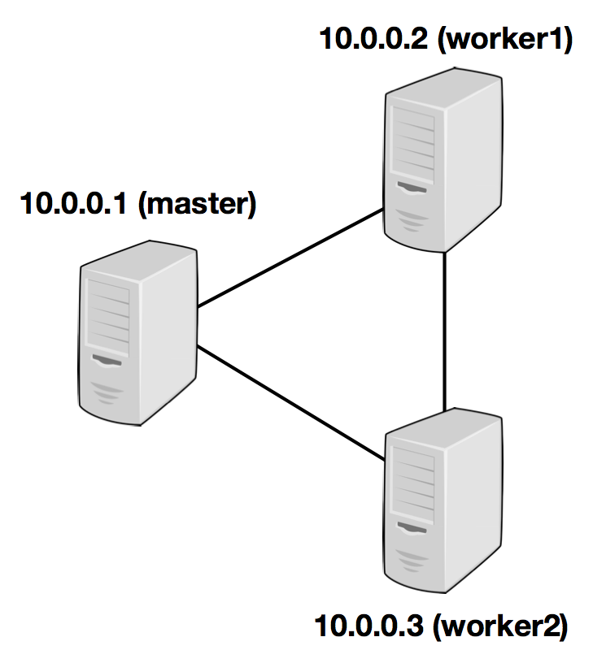

[TOC]
Flink是一种通用型的框架，支持多种部署场景。在下面，我们简短的解释了Flink集群的构建、目标以及可用的构建方案。如果你只想要在本地启动Flink，我们建议你构建一个Standalone Cluster.
# 概览
## 概览与参考架构
下面的图展示了Flink集群的架构，存在一个运行的client，它负责把Flink应用的代码转换成一个JobGraph并提交到JobManager。JobManager将JobGraph中的算子任务分发到TaskManagers，TaskManager是算子(比如source、information、sink)运行的地方。当部署Flink时，每一个组件有一些可用的选项，我们在表格中列出.

|Component|Purpose|Implementations|
|:---|:---|:---|
|Flink Client|将Flink应用编译为dataflow graph，后者会被提交到JobManager| <ul> <li>[Command Line Interface](https://nightlies.apache.org/flink/flink-docs-release-1.16/zh/docs/deployment/cli/)</li><li>[REST Endpoint](https://nightlies.apache.org/flink/flink-docs-release-1.16/zh/docs/ops/rest_api/)</li><li>[SQL c
lient](https://nightlies.apache.org/flink/flink-docs-release-1.16/zh/docs/dev/table/sqlclient/)</li><li>[Python PEPL](https://nightlies.apache.org/flink/flink-docs-release-1.16/zh/docs/deployment/repls/python_shell/)</li></ul>|
|JobManager|JobManager是Flink中的中央调度组件的名字，不同的资源提供者有不同的实现，这些实现在高可用、资源分配行为、支持的任务提交类型等方面都是不同的，任务提交的JobManager类型如下: <br><ul><li>**Application Mode**: 为每一个Flink应用创建一个单独的集群，Job的main方法在JobManager上执行，在一个应用中多次调用`execute/executeAsync`是支持的</li><li>**Session Mode**: 一个JobManager实例管理多个Job，这些Job都在一个集群上运行，并共享集群的TaskManagers</li><li>**Per-Job Mode**: 每一个Job对应一个集群，Job的main方法在集群创建前执行</li></ul>|<ul><li>[Standalone](https://nightlies.apache.org/flink/flink-docs-release-1.16/zh/docs/deployment/resource-providers/standalone/)，这是标准模式，需要启动一个JVM进程，这种部署方式下可以人工设置部署的设置</li><li>[Kubernetes](https://nightlies.apache.org/flink/flink-docs-release-1.16/zh/docs/deployment/resource-providers/native_kubernetes/)</li><li>[YARN](https://nightlies.apache.org/flink/flink-docs-release-1.16/zh/docs/deployment/resource-providers/yarn/)</li></ul>|
|TaskManager|TaskManager是真正执行Flink任务的服务||
|*High Availability Service Provider*|Flink的JobManager可以以高可用的模式运行，并允许Flink从JobManager失败中恢复，为了更快的进行故障切换，可以启动多个备用的JobManager作为备份|<ul><li>[Zookeeper](https://nightlies.apache.org/flink/flink-docs-release-1.16/zh/docs/deployment/ha/zookeeper_ha/)</li><li>[Kubernetes HA](https://nightlies.apache.org/flink/flink-docs-release-1.16/zh/docs/deployment/ha/kubernetes_ha/)</li></ul>|
|*File Storage and Persistency*|对于检查点，Flink依赖外部存储系统|看[FileSystems](https://nightlies.apache.org/flink/flink-docs-release-1.16/zh/docs/deployment/filesystems/overview/)|
|*Resource Provider*|Flink可以通过不同的资源提供者框架部署，比如Kubernetes或者YARN|可以看上面的[JobManager实现](https://nightlies.apache.org/flink/flink-docs-release-1.16/zh/docs/deployment/overview/#jmimpls)|
|*Metrics Storage*|Flink组件报告内部指标，Flink Job也会报告额外的Job相关的指标|可以看[Metrics Reporter](https://nightlies.apache.org/flink/flink-docs-release-1.16/zh/docs/deployment/metric_reporters/)|
|Application-level data sources and sinks|虽然应用程序级别的数据源和汇在技术上不是Flink集群组件部署的一部分，但在规划新的Flink生产部署时应该考虑它们。使用Flink托管常用数据可以带来显着的性能优势|可以看连接器相关的章节|

### 可重复使用资源的清理
一旦作业达到完成、失败或取消这样的全局终止状态，与作业关联的外部组件资源就会被清理。如果清理资源失败，Flink将尝试重试理。您可以配置使用的重试策略。达到最大重试次数但未成功将使作业处于脏状态。它的资源需要手动清理（有关更多详细信息，请参阅高可用性服务/JobResultStore部分）。重新启动同一个作业（即使用相同的作业ID）将导致清理重新启动，而无需再次运行该作业。目前清理`CompletedCheckpoints`时存在一个问题，这些问题在将它们包含在通常的 CompletedCheckpoint 管理中时未能被删除。 这些工件没有被可重复的清理所覆盖，即它们仍然必须手动删除。
## 部署模式
Flink可以用以下3种方式执行应用:
- Application Mode
- Per-Job Mode
- Session Mode
上面的模式的不同在于:
- 集群的生命生命周期与资源隔离程度是不同的;
- application的main方法在客户端执行还是在集群执行;

1. Application Mode
   所有其他模式应用程序的main()方法都在客户端执行。这个过程包括下载应用程序的依赖项到本地，执行main()以提取Flink运行时可以理解的应用程序表示（即JobGraph）并将依赖项和JobGraph(s)发送到集群。这使得客户端需要较多的资源，比如它可能需要大量的网络带宽来下载依赖项并将二进制文件发送到集群，还需要执行main()的CPU周期。当多个用户使用同一个客户端时，这个问题会更加明显。基于此观察，*Application Mode*为每个提交的应用程序创建一个集群，但这一次，应用程序的main()方法在 JobManager上执行。为每个应用程序创建一个集群可以看作是创建一个会话集群，它只在特定应用程序的作业之间共享，并在应用程序完成时删除。使用这种架构，*Application Mode*提供与Per-Job模式相同的资源隔离和负载平衡保证，但是是在整个应用程序的粒度上。在JobManager上执行main()可以节省所需的CPU周期，还可以节省本地下载依赖项所需的带宽。此外，它允许更均匀地分散网络负载以下载集群中应用程序的依赖项，因为每个应用程序都有一个JobManager。在*Application Mode*中，main()是在集群上执行的，而不是在客户端上执行的，就像在其他模式中一样。这可能会对您的代码产生影响，例如，您使用 registerCachedFile()在环境中注册的任何路径都必须可由应用程序的JobManager访问。与Per-Job模式相比，*Application Mode*允许提交由多个作业组成的应用程序。作业执行的顺序不受部署模式的影响，但受启动作业的调用影响。使用阻塞的 execute()建立一个顺序，这将导致“下一个”作业的执行被推迟到“这个”作业完成。使用非阻塞的 executeAsync() 将导致“下一个”作业在“此”作业完成之前开始。*Application Mode*允许multi-execute()应用程序，但在这些情况下不支持高可用性。只有single-execute()应用程序支持应用程序模式下的高可用性。此外，当应用程序模式下多个正在运行的作业（例如使用 executeAsync() 提交）中的任何一个被取消时，所有作业都将停止并且JobManager将关闭。支持定期完成作业（通过关闭源）。
2. Per-Job Mode
   为了提供更好的资源隔离保证，Per-Job模式使用可用的资源提供者框架（例如YARN、Kubernetes）为每个提交的作业启动一个集群。该集群仅适用于该作业。作业完成后，集群将被拆除并清除任何挥之不去的资源（文件等）。这提供了更好的资源隔离，因为行为不端的作业只能关闭它自己的 TaskManager。此外，它将簿记的负载分散到多个 JobManager 上，因为每个作业都有一个。 由于这些原因，Per-Job 资源分配模型是许多生产原因的首选模式。
3. Session Mode
   会话模式假定一个已经在运行的集群并使用该集群的资源来执行任何提交的应用程序。 在同一（会话）集群中执行的应用程序竞争使用相同的资源。这样做的好处是您不必每个作业都启动一个完整的集群，这样的资源消耗太大了。但是，如果其中一个作业行为异常或关闭了TaskManager，那么在该TaskManager上运行的所有作业都将受到故障的影响。除了对导致故障的作业产生负面影响外，这意味着潜在的大规模恢复过程，所有重新启动的作业同时访问文件系统并使其对其他服务不可用。此外，让一个集群运行多个作业意味着JobManager的负载更大，JobManager负责记录集群中的所有作业。
4. Summary
   在*Session Mode*下，集群生命周期独立于集群上运行的任何作业的生命周期，并且资源在所有作业之间共享。Per-Job模式需要为每个提交的作业启动一个集群，但这提供了更好的隔离保证，因为资源不会在作业之间共享。在这种情况下，集群的生命周期与作业的生命周期绑定。最后，应用程序模式为每个应用程序创建一个会话集群，并在集群上执行应用程序的main()方法。
# Resource Providers
## Standalone
1以完全分布式的方式运行Flink。
### 概览
#### 需求
1. 软件需求
   Flink运行在所有类UNIX环境下，机群由一个master节点及多个worker节点组成，每个节点都需要安装JDK，ssh，机群中的所有节点都可以免密登录SSH以及拥有相同的目录结构，以便让脚本来控制一切。需要指定JAVA_HOME环境变量，或者在conf/flink-conf.yaml中通过env.java.home配置项来设置此变量。
2. Flink设置
   去[仓库](https://flink.apache.org/zh/downloads.html)下载可运行的软件包，下载后解压。然后编辑conf/flink-conf.yaml文件为机群配置Flink，`jobmanager.rpc.address`配置项指向master节点，`jobmanager.memroy.process.size`/`taskmanager.memroy.process.size`定义允许分配的最大内存，你必须·提供机群上会被用作worker节点的所有节点列表，也就是运行TaskManager的节点，编辑文件conf/workers，输入每个节点的IP/主机名。如下图:
   
   /path/to/flink/conf/flink-conf.yaml的内容
   >jobmanager.rpc.address: 10.0.0.1
   /path/to/flink/conf/workers的内容
   >10.0.0.2
   10.0.0.3

   Flink目录必须放在所有worker节点的相同目录下。你可以使用共享的NFS目录，或将Flink目录复制到每个worker节点上。
   可以在[配置](https://nightlies.apache.org/flink/flink-docs-release-1.16/zh/docs/deployment/config/)里面了解更多的配置参数信息。
   - jobmanager.memory.process.size每个JobManager可用的内存值;
   - taskmanager.memory.process.size每个TaskManager的可用内存值;
   - taskmanager.numberOfTaskSlots每台机器的可用CPU数;
   - parallelism.default机群中所有CPU数
   - io.tmp.dirs临时目录
3. 启动Flink
   下面的脚本在本地节点启动了一个JobManager并通过SSH连接到workers文件中所有的worker节点，在每个节点上启动TaskManager。现在你的Flink系统已经启动并运行着。可以通过配置的RPC端口向本地节点上的JobManager提交作业。
   >bin/start-cluster.sh

4. 为集群添加JobManager/TaskManager实例
   你可以使用bin/jobmanager.sh和bin/taskmanager.sh脚本为正在运行的集群添加JobManager和TaskManager实例。
   - 添加JobManager: `bin/jobmanager.sh ((start|start-foreground) [args] [webui-port])|stop|stop-all`
   - 添加TaskManager: `bin/taskmanager.sh start|start-foreground|stop|stop-all`
#### High-Availability with Standalone
开启集群的HA机制，必须使用Zookeeper服务，同时还需要让机群开启多个JobManager。
1. Masters File(masters)
   HA机制需要配置conf/masters文件内容，里面包含JobManager所在的机器与端口
   >jobManagerAddress1:webUIPort1
    [...]
    jobManagerAddressX:webUIPortX
   缺省情况下，job manager会随机选择一个端口用于内部进程通信，你可以通过`high-availability.jobmanager.port`设置一个固定的端口，可以接受一个端口或者一个端口范围1-10,11,12-19混合也是支持的。
2. 例子: 有2个JobManager的集群
   - 在conf/flink-conf.yaml文件中设置高可用模式与Zookeeper quorum
     ```properties
     high-availability: zookeeper
     high-availability.zookeeper.quorum: localhost:2181
     high-availability.zookeeper.path.root: /flink
     high-availability.cluster-id: /cluster_one # important: customize per cluster
     high-availability.storageDir: hdfs:///flink/recovery
     ```
   - 在conf/masters配置masters
     ```properties
     localhost:8081
     localhost:8082
     ```
   - 在conf/zoo.cfg文件中配置Zookeeper server，`server.0=localhost:2888:3888`
   - Start ZooKeeper quorum, bin/start-zookeeper-quorum.sh
   - Start an HA-cluster:
     >$ bin/start-cluster.sh
      Starting HA cluster with 2 masters and 1 peers in ZooKeeper quorum.
      Starting standalonesession daemon on host localhost.
      Starting standalonesession daemon on host localhost.
      Starting taskexecutor daemon on host localhost.
#### User jars & Classpath
在standalone模式下，下面的jars会被认为是user-jars，并被包含到user的classpath:
- session mode: 启动命令中指定的jar;
- Application mode: 启动命令指定的jar以及在Flink的userlib目录里面的jar;
### Kubernetes
#### 入门
入门描述了如何在k8s上部署Flink Session集群
1. 介绍
   本文描述了如何使用Flink standalone部署模式在Kubernetes上部署standalone模式的Flink集群。通常我们建议新用户使用native Kubernetes部署模式在 Kubernetes上部署Flink;
2. 准备
   k8s机群
3. Kubernetes上的Flink session集群
   Flink session机群是以一种长期运行的k8s deployment形式执行的，你可以在一个session集群上运行多个flink作业。当然，只有session集群部署好以后才可以在上面提交Flink作业。在k8s上部署一个基本的Flink session机群时，一般包括下面3个组件:
   - 运行JobManager的Deployment;
   - 运行TaskManagers的Deployment;
   - 暴漏JobManager上REST和UI端口的Service;
   使用通用[集群资源定义](https://nightlies.apache.org/flink/flink-docs-release-1.16/zh/docs/deployment/resource-providers/standalone/kubernetes/#common-cluster-resource-definitions)使用kubectl命令创建相应的组件:
   ```bash
   # Configuration 和 service 的定义
   $ kubectl create -f flink-configuration-configmap.yaml
   $ kubectl create -f jobmanager-service.yaml
   # 为集群创建 deployment
   $ kubectl create -f jobmanager-session-deployment.yaml
   $ kubectl create -f taskmanager-session-deployment.yaml
   ```
   我们设置端口转发来访问Flink UI并提交作业:
   - 运行kubectl port-forward ${flink-jobmanager-pod} 8081:8081将jobmanager的web ui端口映射到本地8081;
   - 在浏览器中打开http://localhost:8081
   - 也可以使用命令向集群提交作业: ./bin/flink run -m localhost:8081 ./examples/streaming/TopSpeedWindowing.jar
   使用下面的命令停止运行flink集群:
   ```bash
    $ kubectl delete -f jobmanager-service.yaml
    $ kubectl delete -f flink-configuration-configmap.yaml
    $ kubectl delete -f taskmanager-session-deployment.yaml
    $ kubectl delete -f jobmanager-session-deployment.yaml
   ```
#### 部署模式
1. Application集群模式
   Flink Application集群是运行单个Application的专用集群，部署集群时要保证该Application可用。在k8s上部署一个基本的Flink Application集群时，一般包括3个组件:
   - 一个运行JobManager的Application;
   - 运行若干个TaskManager的Deployment;
   - 暴露JobManager上REST和UI端口的Service;
   检查[Application 集群资源定义](https://nightlies.apache.org/flink/flink-docs-release-1.16/zh/docs/deployment/resource-providers/standalone/kubernetes/#application-cluster-resource-definitions)并做出相应的调整:
   - jobmanager-job.yaml中的args属性必须指定用户作业的主类，也可以参考[如何设置 JobManager 参数](https://nightlies.apache.org/flink/flink-docs-release-1.16/zh/docs/deployment/resource-providers/standalone/docker/#jobmanager-additional-command-line-arguments)来了解如何将额外的args传递给jobmanager-job.yaml配置中指定的Flink镜像。job artifacts参数必须可以从[资源定义示例](https://nightlies.apache.org/flink/flink-docs-release-1.16/zh/docs/deployment/resource-providers/standalone/kubernetes/#application-cluster-resource-definitions)中的`job-artifacts-volume`处获取。假如是在`minikube`集群中创建这些组件，那么定义示例中的 job-artifacts-volume可以挂载为主机的本地目录。如果不使用`minikube `集群，那么可以使用 `Kubernetes`集群中任何其它可用类型的`volume`来提供`job artifacts`。此外，还可以构建一个已经包含`job artifacts`参数的[自定义镜像](https://nightlies.apache.org/flink/flink-docs-release-1.16/zh/docs/deployment/resource-providers/standalone/docker/#advanced-customization)。在创建[通用集群组件](https://nightlies.apache.org/flink/flink-docs-release-1.16/zh/docs/deployment/resource-providers/standalone/kubernetes/#common-cluster-resource-definitions)后，指定[Application 集群资源定义](https://nightlies.apache.org/flink/flink-docs-release-1.16/zh/docs/deployment/resource-providers/standalone/kubernetes/#application-cluster-resource-definitions)文件，执行kubectl命令来启动Flink Application集群:
   ```bash
   $ kubectl create -f jobmanager-job.yaml
   $ kubectl create -f taskmanager-job-deployment.yaml
   ```
2. Per-Job集群模式
   不支持
3. Session机群
   前面的入门就是
#### Kubernetes 上运行 Standalone 集群指南
1. Configuration
   所有配置都在[配置页面](https://nightlies.apache.org/flink/flink-docs-release-1.16/zh/docs/deployment/config/)中，在config map配置文件flink-configuration-configmap.yaml中可以添加配置.
2. 在Kubernets上访问Flink
   接下来可以访问 Flink UI 页面并通过不同的方式提交作业：
   - kubectl proxy:
     - 在终端运行kubectl proxy命令;
     - 在浏览器中导航到 http://localhost:8001/api/v1/namespaces/default/services/flink-jobmanager:webui/proxy;
   - kubectl port-forward:
     - 运行kubectl port-forward ${flink-jobmanager-pod} 8081:8081将jobmanager的web ui端口映射到本地的8081;
     - 在浏览器中导航到 http://localhost:8081;
     - 此外，也可以使用如下命令向集群提交作业: 
       >$ ./bin/flink run -m localhost:8081 ./examples/streaming/TopSpeedWindowing.jar

   - 基于jobmanager的rest服务上创建NodePort service：
     - 运行 kubectl create -f jobmanager-rest-service.yaml 来基于 jobmanager 创建 NodePort service。jobmanager-rest-service.yaml 
       的示例文件可以在 附录 中找到;
     - 运行 kubectl get svc flink-jobmanager-rest 来查询 server 的 node-port，然后再浏览器导航到 http://<public-node-ip>:<node-port>。
     - 如果使用 minikube 集群，可以执行 minikube ip 命令来查看 public ip。
     - 与 port-forward 方案类似，也可以使用如下命令向集群提交作业。
       >$ ./bin/flink run -m <public-node-ip>:<node-port> ./examples/streaming/TopSpeedWindowing.jar
3. 调试和访问日志
   可以通过web用户界面或者kubectl logs访问日志
4. 高可用的Standalone Kubernetes
   对于在Kubernetes上实现HA，可以参考当前的[Kubernets高可用服务](https://nightlies.apache.org/flink/flink-docs-release-1.16/zh/docs/deployment/ha/overview/)。
   - Kubernetes高可用Services
     Session模式和Application模式集群都支持使用[Kubernetes 高可用服务](https://nightlies.apache.org/flink/flink-docs-release-1.16/zh/docs/deployment/ha/kubernetes_ha/)。需要在flink-configuration-configmap.yaml中添加如下Flink配置项，配置了HA存储目录相对应的文件系统必须在运行时可用。请参阅[自定义Flink镜像](https://nightlies.apache.org/flink/flink-docs-release-1.16/zh/docs/deployment/resource-providers/standalone/docker/#advanced-customization)和[启用文件系统插件](https://nightlies.apache.org/flink/flink-docs-release-1.16/zh/docs/deployment/resource-providers/standalone/docker/#using-filesystem-plugins)获取更多相关信息。
     ```yaml
      apiVersion: v1
      kind: ConfigMap
      metadata:
      name: flink-config
      labels:
         app: flink
      data:
      flink-conf.yaml: |+
      ...
         kubernetes.cluster-id: <cluster-id>
         high-availability: kubernetes
         high-availability.storageDir: hdfs:///flink/recovery
         restart-strategy: fixed-delay
         restart-strategy.fixed-delay.attempts: 10
      ...  
     ```
     此外，你必须使用具有创建/编辑/删除ConfigMap权限的service账号启动JobManager和TaskManager pod，请查看[如何为pod配置service账号](如何为 pod 配置 service 账号)获取更多信息。当启用了高可用，Flink会使用自己的HA服务进行服务发现。因此，JobManagerPod会使用IP地址而不是kubernetes的service名称来作为jobmanager.rpc.address的·配置项启动。完整配置参考[附录](https://nightlies.apache.org/flink/flink-docs-release-1.16/zh/docs/deployment/resource-providers/standalone/kubernetes/#appendix)。通常，只启动一个JobManager pod就足够了，因为一旦pod崩溃，Kubernetes就会重新启动它。如果要实现更快的恢复，需要将jobmanager-session-deployment-ha.yaml中的`replicas`配置或 jobmanager-application-ha.yaml中的`parallelism`配置设定为大于1的整型值来启动 Standby JobManagers。
   - 启用 Queryable State
     如果你为TaskManager创建了NodePort service，那么你就可以访问TaskManager的Queryable State服务:
     - 运行`kubectl create -f taskmanager-query-state-service.yaml`来为 taskmanager pod 创建 NodePort service。 
       taskmanager-query-state-service.yaml 的示例文件可以从[附录](https://nightlies.apache.org/flink/flink-docs-release-1.16/zh/docs/deployment/resource-providers/standalone/kubernetes/#common-cluster-resource-definitions)中找到。
     - 运行`kubectl get svc flink-taskmanager-query-state`来查询 service 对应 node-port 的端口号。然后你就可以创建 QueryableStateClient(<public-node-ip>, <node-port> 来提交状态查询。
   - 在 Reactive 模式下使用 Standalone Kubernetes(暂时忽略)


### Working Directory
### Docker设置
### Kubernetes设置
## Native Kubernetes
下面的章节描述如何部署原生的Flink到K8s上。
### Getting Started
#### Introduction
K8s是一个流行的容器编排系统，用于自动部署应用、扩缩容与应用管理。Flink原生部署可以让你直接部署Flink集群到k8s上，更多的，Flink on K8s可以动态的分配/回收TaskManager，因为它可以与K8s直接通信。
#### Preparation
要求:
- K8s>=1.9
- kubectl有操作对象的权限;
- 开启了k8s DNS;
- 带有创建/删除pods的RBAC权限的`default` service account。
#### Starting a Flink Session on K8s
一旦你的Kubernetes集群运行并且kubectl被配置为指向它，你可以以`Session Mode`启动一个Flink集群
```bash
# (1) Start Kubernetes session
$ ./bin/kubernetes-session.sh -Dkubernetes.cluster-id=my-first-flink-cluster

# (2) Submit example job
$ ./bin/flink run \
    --target kubernetes-session \
    -Dkubernetes.cluster-id=my-first-flink-cluster \
    ./examples/streaming/TopSpeedWindowing.jar

# (3) Stop Kubernetes session by deleting cluster deployment
$ kubectl delete deployment/my-first-flink-cluster
```
默认情况下，Flink的Web UI和REST端点暴露为ClusterIP类型的service。如需访问该service，请参阅访问Flink的Web UI获取说明。
### Deployment Modes
对与生产上的使用，我们建议以*Application Mode*的方式部署，因为这样的模式提供了更好的隔离性。
#### Application Mode
*Application Mode*模式需要用户的代码打包成Flink镜像，因为是代码执行是在镜像基础上的，*Application Mode*模式保证Flink组件在应用终止后可以得到合适的清理。Flink社区提供了基础Docker镜像，可以用来生成用户Flink应用镜像:
```Dockerfile
FROM flink
RUN mkdir -p $FLINK_HOME/usrlib
COPY /path/of/my-flink-job.jar $FLINK_HOME/usrlib/my-flink-job.jar
```
创建/发布镜像后，你可以用下面的命令开启一个应用集群:
```java
$ ./bin/flink run-application \
    --target kubernetes-application \
    -Dkubernetes.cluster-id=my-first-application-cluster \
    -Dkubernetes.container.image=custom-image-name \
    local:///opt/flink/usrlib/my-flink-job.jar
```
local是*Application Mode*模式下为转移支持的模式。
`kubernetes.cluster-id`选项指定集群的名字，必须是唯一的，如果你没有指定，那么Flink会自动生成一个随机的名字。`kubernetes.container.image`指定了pod使用的镜像。部署成功后，你可以查看：
```bash
# List running job on the cluster
$ ./bin/flink list --target kubernetes-application -Dkubernetes.cluster-id=my-first-application-cluster
# Cancel running job
$ ./bin/flink cancel --target kubernetes-application -Dkubernetes.cluster-id=my-first-application-cluster <jobId>
```
你可以通过设置bin/flink的执行参数来覆盖conf/flink-conf.yaml中的设置，比如-Dkey=value。
#### Per-Job Cluster Mode
Flink on K8s不支持这种方式
#### Session Mode
在本小节的开头，你已经看到如何以*Session Mode*的模式部署。这种方式可以以2种形式执行:
- detached modo(default): `kubenetes-session.sh`部署Flink集群到k8s上然后返回;
- attached mode(-Dexecution.attached=true): `kubenetes-session.sh`保持活跃状态允许输入命令来控制运行的Flink集群，比如，停止集群等操作。
为了重新链接上运行中的Flink集群，你可以使用cluster-id，如下:
```bash
$./bin/kubernetes-session.sh \
    -Dkubernetes.cluster-id=my-first-flink-cluster \
    -Dexecution.attached=true
```
为了停止Flink集群，你可以删除K8s上Flink集群对应的deployment或者执行下面的命令:
```bash
$ echo 'stop' | ./bin/kubernetes-session.sh \
    -Dkubernetes.cluster-id=my-first-flink-cluster \
    -Dexecution.attached=true
```
### Flink on k8s参考
1. Configuring Flink on Kubernetes
   kubernetes相关的配置选项列在[configuration page](https://nightlies.apache.org/flink/flink-docs-release-1.16/zh/docs/deployment/config/#kubernetes)Flink使用Fabric8 Kubernetes客户端与Kubernetes APIServer通信来创建/删除Kubernetes资源（例如 Deployment、Pod、ConfigMap、Service等），以及观察Pod和ConfigMap。除了上述Flink配置选项外，Fabric8 Kubernetes客户端的一些专门选项可以通过系统属性或环境变量进行配置。例如，用户可以使用以下Flink配置选项来设置并发最大请求数。
   ```properties
   containerized.master.env.KUBERNETES_MAX_CONCURRENT_REQUESTS: 200
   env.java.opts.jobmanager: "-Dkubernetes.max.concurrent.requests=200"
   ```
2. Accessing Flink's Web UI
   Flink的Web UI和REST端点可以通过`kubernetes.rest-service.exposed.type`配置选项以多种方式公开。
   - ClusterIP: 在集群内部IP上公开service。该服务只能在集群内访问。如果要访问JobManager UI或将作业提交到现有会话，则需要启动本地代理。然后，您可以使用localhost:8081将Flink 作业提交到会话或查看仪表板;
    ```bash
    kubectl port-forward service/<ServiceName> 8081
    ```
   - NodePort: 在每个节点IP的静态端口（NodePort）上公开服务。<NodeIP>:<NodePort>可用于访问JobManager服务;
   - LoadBalancer: 使用云提供商的负载均衡器向外部公开服务。由于云提供商和Kubernetes需要一些时间来准备负载均衡器，您可能会在客户端日志中获得一个NodePort JobManager Web界面。 您可以使用kubectl get services/<cluster-id>-rest 获取EXTERNAL-IP 并手动构建负载均衡器 JobManager Web 界面 http://<EXTERNAL-IP>:8081。
3. Logging
   Kubernetes集成将conf/log4j-console.properties和conf/logback-console.xml作为ConfigMap暴露给pod。对这些文件的更改将对新启动的集群可见。
   1. 访问日志
   默认情况下，JobManager和TaskManager会同时将日志输出到控制台和每个pod中的/opt/flink/log。STDOUT和STDERR输出只会被重定向到控制台。您可以通过以下方式访问它们`$ kubectl logs <pod名称>`如果pod正在运行，您还可以使用`kubectl exec -it <pod-name> -- bash`隧道进入并查看日志或调试进程;
   2. 访问TaskManagers的日志
   Flink会自动回收空闲的TaskManager，以免浪费资源。这种行为会使访问各个pod的日志变得更加困难。您可以通过配置 resourcemanager.taskmanager-timeout来增加空闲TaskManager释放的时间，以便您有更多时间检查日志文件。
   3. 动态更改日志级别
   如果您已将logger配置为自动检测配置更改，那么您可以通过更改相应的ConfigMap来动态调整日志级别（假设集群id为 my-first-flink-cluster）`$ kubectl edit cm flink-config-my-first-flink-cluster`
4. Using Plugins
   为了使用插件，您必须将它们复制到Flink JobManager/TaskManager pod中的正确位置。您可以使用内置插件，而无需安装卷或构建自定义Docker映像。例如，使用以下命令为您的Flink会话集群启用S3插件`$ ./bin/kubernetes-session.sh
    -Dcontainerized.master.env.ENABLE_BUILT_IN_PLUGINS=flink-s3-fs-hadoop-1.16.0.jar \
    -Dcontainerized.taskmanager.env.ENABLE_BUILT_IN_PLUGINS=flink-s3-fs-hadoop-1.16.0.jar`
5. Custom Docker Image
   如果你想使用自定义的Docker镜像，那么你可以通过配置选项`kubernetes.container.image`来指定它。Flink社区提供了丰富的Flink Docker镜像，可以作为一个很好的起点。了解如何自定义Flink的Docker镜像，了解如何启用插件、添加依赖项和其他选项;
6. Using Secrets
   Kubernetes Secrets是一个包含少量敏感数据的对象，例如密码、令牌或密钥。此类信息可能会以其他方式放入pod规范或镜像中。Flink on Kubernetes可以通过两种方式使用Secret：
   - 使用Secrets作为 pod 中的文件；
   - 使用Secrets作为环境变量；
   1. 将Secret用作Pod中的文件
   以下命令将在已启动的pod中的路径/path/to/secret下挂载秘密mysecret：`$ ./bin/kubernetes-session.sh -Dkubernetes.secrets=mysecret:/path/to/secret`然后可以在文件/path/to/secret/username和/path/to/secret/password中找到秘密mysecret的用户名和密码。有关更多详细信息，请参阅[Kubernetes官方文档](https://kubernetes.io/docs/concepts/configuration/secret/#using-secrets-as-files-from-a-pod);
   2. 使用Secrets作为环境变量
   以下命令会将秘密mysecret公开为已启动pod中的环境变量：
   ```bash
    $./bin/kubernetes-session.sh -Dkubernetes.env.secretKeyRef=\
        env:SECRET_USERNAME,secret:mysecret,key:username;\
        env:SECRET_PASSWORD,secret:mysecret,key:password
   ```
   环境变量SECRET_USERNAME包含用户名，环境变量SECRET_PASSWORD包含秘密mysecret的密码。有关更多详细信息，请参阅 Kubernetes 官方文档。
7. High-Availability on Kubernetes
   对于Kubernetes上的高可用性，您可以使用现有的高可用性服务。将`kubernetes.jobmanager.replicas`的值配置为大于1以启动备用JobManager。这将有助于实现更快的恢复。请注意，启动备用JobManager时应启用高可用性。
8. Manual Resource Cleanup
   Flink使用[Kubernetes OwnerReference](https://kubernetes.io/docs/concepts/workloads/controllers/garbage-collection/)清理所有集群组件。所有Flink创建的资源，包括ConfigMap、Service和Pod，都将 OwnerReference设置为deployment/<cluster-id>。当部署被删除时，所有相关资源将被自动删除`$ kubectl delete deployment/<cluster-id>`
9. Namespaces
   Kubernetes中的命名空间通过资源配额在多个用户之间划分集群资源。Flink on Kubernetes可以使用命名空间来启动Flink集群。命名空间可以通过kubernetes.namespace进行配置。
10. RBAC
    基于角色的访问控制是一种调节对资源访问权限的方法，这种方法是基于企业中用户的角色，用户可以给JobManager配置RBAC角色与service account来控制访问K8s的K8s API server。每一个命名空间都有一个default service account，然而，`default`service account没有权限创建/删除pods，用户需要更新`default` service account 的权限或者指定一个具有合适角色绑定的新的service account。`$ kubectl create clusterrolebinding flink-role-binding-default --clusterrole=edit --serviceaccount=default:default`，如果你不想要使用`default` service account，使用下面的命令来创建一个新的`flink-service-account` service account，并且设置角色绑定。然后使用配置选项`-Dkubernetes.service-account=flink-service-account`来让JobManager pod可以使用`flink-service-account`service account来创建/删除 TaskManager pods或者leader ConfigMaps，当然这也会允许TaskManager监视leader ConfigMaps来检索JobManager/ResourceManager的地址。
    ```bash
    $ kubectl create serviceaccount flink-service-account
    $ kubectl create clusterrolebinding flink-role-binding-flink --clusterrole=edit --serviceaccount=default:flink-service-account
    ```
    请参考官方文档中[RBAC授权](https://kubernetes.io/docs/reference/access-authn-authz/rbac/)了解更多的信息。
11. Pod Template
    Flink允许用户通过template文件定义JobManager/TaskManager pod规范，这样可以支持一些Flink Kubernetes Config Options不直接支持的特性，使用kubernetes.pod-template-file指定一个包含pod定义的本地文件，它可以用来初始化JobManager/TaskManager，主要的容器的名字应该定义为`flink-main-container`，请参考