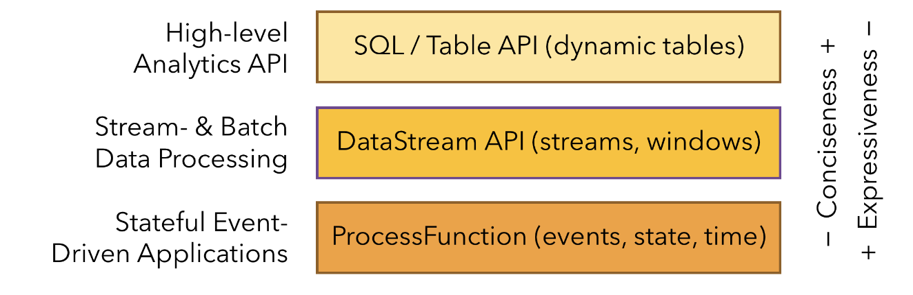

[TOC]
Apache Flink是一个框架与分布式流处理引擎，用于在无边界与有边界的数据流上进行有状态的计算，集群部署适应性强;
## 处理无界与有界数据
任何类型的数据都可以形成一种事件流，分为有界与无界2种:
- 无界: 有流的开始没有流的结束，因为输入是无限的，数据被获取后就要立即处理不能等都到达再处理，还可以规定处理的顺序;
- 有界: 流有开始也有结束，可以获取所有数据后，排序处理，也叫做批处理.

## 部署应用到任何地方
Flink集成了所有常见的集群资源管理器，也可以作为独立集群运行。部署Flink应用程序时，Flink会根据应用程序配置的并行性自动标识所需的资源，并从资源管理器请求这些资源，在发生故障的情况下，Flink通过请求新资源来替换发生故障的容器，提交或者控制应用程序的所有通信都是通过REST调用进行的，这可以简化Flink与各种环境的集成。
## 运行人意规模的应用
Flink 旨在任意规模上运行有状态流式应用。因此，应用程序被并行化为可能数千个任务，这些任务分布在集群中并发执行。所以应用程序能够充分利用无尽的 CPU、内存、磁盘和网络 IO。而且 Flink 很容易维护非常大的应用程序状态。其异步和增量的检查点算法对处理延迟产生最小的影响，同时保证精确一次状态的一致性。
## 利用内存性能
有状态的Flink程序针对本地状态访问进行优化，任务的状态始终保留在内存中，如果状态大小超过内存，则会保存在能高效访问的磁盘数据结构中，任务通过访问本地状体来进行所有的计算，从而产生非常低的处理延迟，Flink通过定期与异步的对本地状态进行持久化存储来保证故障场景下精确一次的状态一致性。


Flink自底向上在不同的抽象级别提供了多种API，针对常见的使用场景开发了专用的扩展库.
## 流处理应用的基本组件
1. 流，flink是一个可以处理任何类型数据流的处理框架，流分为有界/无界，流也分为实时/历史记录，也就是立即处理还是存储一会执行批处理。
2. 状态，具有一定复杂度的流处理应用都是有状态的，任何流处理应用都需要在一定时间内存储所接收的事件或者中间结果，以供后续某个时间点访问，应用状态是Flink中的一等公民，Flink提供了很多状态管理相关的特性支持，包括:

- 多种状态基础类型: Flink为多种不同的数据结构提供了相对应的状态基础类型，比如原子值(value)、列表(list)以及映射(map)，开发者可以基于处理函数对状态的访问方式，选择最高效、最适合的状态基础类型;
- 插件化的State Backend: State Backend负责管理应用程序状态，并在需要的时候进行checkpoint，Flink支持多种state backend，可以将状态存储在内存或者RocksDB;
- 精确一次语义，Flink的checkpoint的故障恢复算法保证了故障发生后应用状态的一致性，因此，Flink可以在应用程序发生故障时对应用程序透明不造成正确性的影响;
- 超大数据量状态，Flink能够利用其异步与增量式的checkpoint算法，存储TB级别的应用状态数据;
- 可弹性伸缩的应用，Flink能够通过在更多或者更少的工作节点上对状态进行重新分布，支持有状态应用的分布式的横向伸缩.
3. 时间，时间时流处理应用的另一个重要的组成部分，因为事件总是在特定时间点发生，大多数的事件流都有事件本身固有的时间语义，常见的流计算都基于事件语义，比如窗口聚合、会话计算、模式检测与基于时间的join，流处理的一个重要的方面时程序如何衡量时间就是区分事件时间与处理时间.
- 事件时间模式，使用事件时间语义的流处理应用根据事件本身自带的时间戳进行结果的计算，无论处理的事历史记录的事件还是实时的事件，事件时间模式的处理总能保证结果的准确性与一致性;
- Watermark支持，Flink引入了watermark的概念，用以衡量事件时间进展，Watermark也是一种平衡延时和完整性的灵活机制;
- 迟到数据处理，当以带有watermmark的事件时间模式处理数据流时，在计算完成之后仍会有相关数据达到，这样的事件称为迟到事件，Flink提供了多种处理迟到数据的选项，例如将这些数据重定向到旁路输出(side output)或者更新之前完成计算的结果;
- 处理时间模式，除了事件时间模式，Flink还支持处理事件语义，处理时间模式根据处理引擎的机器时间触发计算，一般适用于有着严格的低延迟的需求，并且能够容忍近似结果的流处理应用;

## 分层API
Flink根据抽象程度分层，提供了3种不同的API，每一种API在简洁性欲表达力上有着不同的侧重，并且针对不同的应用场景

1. ProcessFunction
是Flink提供的最具表达力的接口，ProcessFunction可以处理一个或者多个数据数据流中的事件，活着归入一个窗口的内的多个事件进行处理，它提供了对于时间与状态的细粒度控制，开发者可以在其中任意的修改状态，也能够注册定时器以在未来的某一个时刻触发回调函数，你可以用ProcessFunction实现许多有状态的事件驱动应用所需要的基于单个事件的复杂业务逻辑,下面是一个例子:
```java
/**

 * 将相邻的 keyed START 和 END 事件相匹配并计算两者的时间间隔
 * 输入数据为 Tuple2<String, String> 类型，第一个字段为 key 值， 
 * 第二个字段标记 START 和 END 事件。
    */
public static class StartEndDuration
    extends KeyedProcessFunction<String, Tuple2<String, String>, Tuple2<String, Long>> {

  private ValueState<Long> startTime;

  @Override
  public void open(Configuration conf) {
    // obtain state handle
    startTime = getRuntimeContext()
      .getState(new ValueStateDescriptor<Long>("startTime", Long.class));
  }

  /** Called for each processed event. */
  @Override
  public void processElement(
      Tuple2<String, String> in,
      Context ctx,
      Collector<Tuple2<String, Long>> out) throws Exception {

    switch (in.f1) {
      case "START":
        // set the start time if we receive a start event.
        startTime.update(ctx.timestamp());
        // register a timer in four hours from the start event.
        ctx.timerService()
          .registerEventTimeTimer(ctx.timestamp() + 4 * 60 * 60 * 1000);
        break;
      case "END":
        // emit the duration between start and end event
        Long sTime = startTime.value();
        if (sTime != null) {
          out.collect(Tuple2.of(in.f0, ctx.timestamp() - sTime));
          // clear the state
          startTime.clear();
        }
      default:
        // do nothing
    }
  }

  /** Called when a timer fires. */
  @Override
  public void onTimer(
      long timestamp,
      OnTimerContext ctx,
      Collector<Tuple2<String, Long>> out) {

    // Timeout interval exceeded. Cleaning up the state.
    startTime.clear();
  }
}
```
2. DataStream API
DataStream API为很多通用的流处理操作提供了处理原语，这些操作包括窗口、逐条记录的转换操作、处理事件时进行外部数据库查询等，比如map()、reduce()、aggregate()等函数，下面是一个例子:
```java
// 网站点击 Click 的数据流
DataStream<Click> clicks = ...

DataStream<Tuple2<String, Long>> result = clicks
  // 将网站点击映射为 (userId, 1) 以便计数
  .map(
    // 实现 MapFunction 接口定义函数
    new MapFunction<Click, Tuple2<String, Long>>() {
      @Override
      public Tuple2<String, Long> map(Click click) {
        return Tuple2.of(click.userId, 1L);
      }
    })
  // 以 userId (field 0) 作为 key
  .keyBy(0)
  // 定义 30 分钟超时的会话窗口
  .window(EventTimeSessionWindows.withGap(Time.minutes(30L)))
  // 对每个会话窗口的点击进行计数，使用 lambda 表达式定义 reduce 函数
  .reduce((a, b) -> Tuple2.of(a.f0, a.f1 + b.f1));
```
3. SQL & Table API
Flink支持2种关系型的API， Table API 与 SQL，批处理与流处理统一的API，关系型API在批处理与实时处理方面以统一的语义执行查询，Table与SQL借助了Apache Calcite来进行查询的解析、校验与优化，可以与DataStream/DataSet API无缝集成，支持用户自定义标量函数、聚合函数以及表值函数.Flink的关系型API旨在简化数据分析、数据流水线和ETL应用的定义。下面是一个例子:
```java
SELECT userId, COUNT(*)
FROM clicks
GROUP BY SESSION(clicktime, INTERVAL '30' MINUTE), userId
```
4. 库
Flink具有数个适用于常见数据处理应用场景的扩展库，这些库嵌入在API中;
- 复杂事件处理(CEP): 模式检测是事件流处理中的一个非常常见的用例。Flink 的 CEP 库提供了 API，使用户能够以例如正则表达式或状态机的方式指定事件模式。CEP 库与 Flink 的 DataStream API 集成，以便在 DataStream 上评估模式。CEP 库的应用包括网络入侵检测，业务流程监控和欺诈检测;
- DataSet API: DataSet API 是 Flink 用于批处理应用程序的核心 API。DataSet API 所提供的基础算子包括map、reduce、(outer) join、co-group、iterate等。所有算子都有相应的算法和数据结构支持，对内存中的序列化数据进行操作。如果数据大小超过预留内存，则过量数据将存储到磁盘。Flink 的 DataSet API 的数据处理算法借鉴了传统数据库算法的实现，例如混合散列连接（hybrid hash-join）和外部归并排序（external merge-sort）。
- Gelly:  Gelly 是一个可扩展的图形处理和分析库。Gelly 是在 DataSet API 之上实现的，并与 DataSet API 集成。因此，它能够受益于其可扩展且健壮的操作符。Gelly 提供了内置算法，如 label propagation、triangle enumeration 和 page rank 算法，也提供了一个简化自定义图算法实现的 Graph API。

Apache Flink 是一个针对无界和有界数据流进行有状态计算的框架。由于许多流应用程序旨在以最短的停机时间连续运行，因此流处理器必须提供出色的故障恢复能力，以及在应用程序运行期间进行监控和维护的工具。
## 7*24小时稳定运行

## Flink能够更方便的升级、迁移、暂停、恢复应用服务
## 监控和控制应用服务


